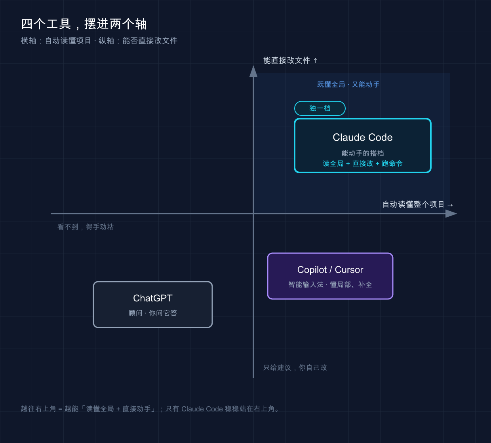

# 01 · Claude Code 简介

*是什么、能做什么、和 ChatGPT / Copilot / Cursor 到底差在哪*

> 📚 **系列导航**：这是「Claude Code 小白教程」的第一篇。从这里出发，咱们一路把它装好、用熟，最后塞进你每天的开发流程。下一篇就动手安装。

兄弟们，今天聊 Claude Code。

我猜你点进来，大概率是这么个状态：身边总有人念叨「Claude Code 多猛多猛」，X（推特）上隔三差五刷到「一句话让它把项目重构了」的截图，可你打开它的官网，看半天还是没搞懂——**它跟我天天用的 ChatGPT 到底差在哪？跟编辑器里那个自动补全的 Copilot 又差在哪？**

说白了，名字里带个 Code，很容易让人以为它就是「会写代码的聊天框」。但真上手用过你会发现，这个理解差得有点远。

这一篇不教你装、不教你敲命令（那是下一篇的事）。**这一篇只干一件事：把「Claude Code 到底是个啥」给你彻底讲明白**，让你心里有个整体地图——知道它能干什么、不能干什么、什么场景该用它而不是别的工具。地图有了，后面每一步才不会走迷糊。

**看完这一篇，你会拿到：**

- 一句话能跟人解释清楚「Claude Code 是什么」
- 一张「能做 / 不能做」清单，知道它的天花板在哪
- 一张对比表，再也不会把它和 ChatGPT / Copilot / Cursor 搞混
- 一个判断标准：什么活儿该交给它，什么活儿别指望它

---

## 01 Claude Code 到底是个啥

先给结论：**Claude Code 是 Anthropic 官方出的「命令行版 AI 编程搭档」——它能读你的整个项目、直接改文件、跑命令，而不只是在聊天框里给你回一段代码**。

Anthropic 就是做出 Claude 这个大模型的公司（你可以把它理解成 ChatGPT 背后那家 OpenAI 的同行竞品）。Claude Code 就是这家公司专门为「写代码」这个场景做的工具。

这里有个关键区别，新手最容易栽在这：

**类比：顾问 vs 坐你旁边的搭档。** 网页版的 Claude（或者 ChatGPT）像个顾问——你把代码截图、复制粘贴给他，他看一眼给你出主意，但**改代码这事还得你自己回去手动干**。Claude Code 不一样，它像个真坐在你工位旁边的搭档：你的整个项目摊在他面前，他能直接翻文件、动手改、改完还能跑一遍看对不对。

这个差别，落到实际就是体验上的天壤之别。

举个例子。用网页版 Claude 改一个 Python 小项目时，流程是这样的：复制报错信息粘进对话框 → 它告诉你可能是哪个文件的问题 → 你切回编辑器找到那个文件 → 复制相关代码再粘回去 → 它给修改建议 → 你再手动抄回编辑器。**一个小 bug 来回切五六次窗口，半小时就这么没了。** 换成 Claude Code，同样的活儿，你就一句「这个报错你帮我查一下根因然后修了」，它自己翻遍相关文件、定位、改完，喝口水的功夫就好了。

这一下就能体会到「代理（Agent）」这个词的分量——**它不是给你建议，是替你动手**。

> 💡 **一句话总结**：Claude Code = 能读你整个项目、能直接动手改的 AI 编程搭档，不是「会写代码的聊天框」。

---

## 02 它在哪儿运行：不止是个黑乎乎的终端

提到「命令行」「终端」，很多新手脑子里立马浮现一个黑乎乎的窗口，瞬间劝退。**别慌，这是个常见误解。**

终端（Terminal，就是你电脑里那个敲命令的窗口）确实是 Claude Code 最核心、功能最全的形态，但**它早就不只活在终端里了**。按官方文档，Claude Code 现在有这么几个「身份」：

| 你在哪用 | 形态 | 适合谁 / 什么场景 |
|---------|------|-----------------|
| **终端** | 功能最全的 CLI（命令行界面） | 想用全部能力、写脚本、做自动化的人 |
| **VS Code / Cursor** | 编辑器插件，内联看改动 | 平时就在 VS Code 里写代码的人 |
| **JetBrains** | IntelliJ / PyCharm 等插件 | Java / Python 重度用户 |
| **桌面 App** | 独立应用，可视化看 diff、并行多会话 | 不想碰命令行、喜欢点界面的人 |
| **网页 / 手机** | 浏览器或 Claude iOS App 里跑 | 临时起个长任务、出门用手机盯进度 |

这里有个特别关键、官方反复强调的点，我单独拎出来加粗：

**所有这些形态，底层是同一个 Claude Code 引擎。** 也就是说，你写的 `CLAUDE.md`（项目说明文件）、你的配置、你接的 MCP（Model Context Protocol）服务——在终端配好了，换到 VS Code、换到手机上照样生效。**配一次，处处能用。**

很多人主力用终端（习惯了，最顺手），但出门在外时可以用网页版起一个「跑测试 + 修失败用例」的长任务，路上打开手机瞄一眼进度。这种「换个地方接着干」的体验，是网页聊天框给不了的。

**友情提示：** 本系列默认从**终端**讲起，因为它功能最全、最能讲透原理。等你摸熟了，再换到 VS Code 或桌面 App 都是水到渠成的事。

> 💡 **一句话总结**：Claude Code 有终端、编辑器插件、桌面 App、网页/手机五种形态，但**底层同一个引擎，配置全平台通用**。

---

## 03 它能干什么：一张「能 / 不能」清单

这部分最实在。**先看它能干的活儿**——我按官方文档梳理，挑几类新手最有体感的：

- **读懂你的代码**：「这个函数干嘛的？」「这块为啥报错？」它结合整个项目上下文回答，不是孤立看一段。
- **跨文件改代码**：「把所有用 `var` 的地方改成 `let`」「把这个大函数拆成三个小的」——它真的去改，不是只给建议。
- **修 bug**：把报错甩给它，它顺着代码库追根因、定位、动手修。
- **干那些你一直拖着的杂活**：给没测试的代码补测试、清 lint 报错、解合并冲突、升级依赖、写 release notes。
- **跟 Git 打交道**：暂存改动、写 commit 信息、建分支、开 PR（拉取请求）一条龙。
- **连接外部工具**：通过 MCP（一个开放标准，后面有专篇讲）读 Google Drive 的文档、更新 Jira 工单、从 Slack 拉数据。

光说不够直观，给你一条官方文档里的真实命令感受一下「一句话指挥」是什么样：

```bash
claude "write tests for the auth module, run them, and fix any failures"
```

翻译过来就是：「给 auth 模块写测试，跑一遍，挂了的你自己修。」——一句话，它把写测试、跑测试、修失败三步全包了。**这就是「代理」和「补全」的本质区别。**

**但是**，比「能做什么」更重要的，是认清它**不能**做什么。这点很关键，我也补充一下我的体会：

| ❌ 不该指望的 | 为什么 |
|-------------|-------|
| 替你拍板技术决策 | 选 A 方案还是 B 方案、值不值得重构——判断和取舍是你的活 |
| 保证代码 100% 没 bug | 它给的是高质量候选，不是绝对正确答案，**必须你来 review** |
| 猜中你没说清的业务逻辑 | 你没讲明白的需求，它只能瞎猜 |
| 你完全看不懂的情况下全自动托管项目 | 你看不懂，就没法判断它改得对不对，等于盲开 |

最容易踩的一个坑，就是第二条。太信它了，让它批量给一个项目加错误处理，它刷刷改了十几个文件，看都没细看就提交了。结果有两处它「自作主张」改了逻辑，上线后才发现。**所以最好立一条铁规矩：它改的每一行，至少扫一遍 diff 再提交。**

用好 Claude Code 的心态基石，就一句话：

> 让 Claude Code 提供高质量候选方案，而不是绝对正确答案。

说白了就一句话——**人定方向、把关、做判断；AI 负责执行、分析、干重复劳动**。这是它的设计哲学：协作，不是替代。

> 💡 **一句话总结**：它能读项目、改文件、跑命令、干杂活，但拍板和把关永远是你的事——**它是搭档，不是甩手掌柜的接盘侠**。

---

## 04 和 ChatGPT / Copilot / Cursor 到底差在哪

这是新手问得最多的问题，咱们一次说清。先上一张总表：

| 维度 | ChatGPT（网页聊天） | Copilot / Cursor（编辑器内） | **Claude Code** |
|------|------------------|--------------------------|----------------|
| **形态** | 网页 / App 聊天框 | 编辑器里的插件 | 命令行 / 插件 / 桌面 / 网页都有 |
| **怎么干活** | 你问它答 | 你写一半，它补后半 | 你下指令，它自己动手干 |
| **看不看得到你项目** | 看不到，得手动粘 | 看得到当前文件 / 部分上下文 | **自动读整个项目** |
| **能不能改文件** | 不能，给你建议你自己改 | 主要是补全、建议 | **能直接改、能跑命令** |
| **最适合** | 问概念、查资料、写零散代码 | 写代码时实时提速 | 真实项目里的理解、重构、修 bug、自动化 |

再用三句大白话给你刻进脑子里：

- **ChatGPT** 像个**顾问**——啥都能聊两句，但你的项目它两眼一抹黑，干活得你自己来。
- **Copilot / Cursor** 像个**智能输入法**——你敲代码它猜你下一句想写啥，帮你打字快一点，主体还是你在写。
- **Claude Code** 像个**能独立干活的搭档**——你说清要什么，剩下的翻文件、改代码、跑测试它包圆，干完你来验收。

**注意：** 这里的 Cursor / Copilot 指的是它们最经典的「编辑器内自动补全」定位。它们这两年也在做更「代理化」的功能（比如 Cursor 的 Agent 模式），边界在变模糊。但**作为入门理解，记住上面这三句的核心定位就够了。**（产品功能迭代快，细节以各家官方为准。）

那 Claude Code 强在哪、弱在哪？实测下来：

**它的强项**——对整个项目的理解能力是真的强，尤其接手一个看不懂的旧项目，让它「先给我讲讲这项目架构」，比自己啃半天文档快得多；大规模重构、跨文件改动也是它的主场。再加上能用 `CLAUDE.md`、Skill 这些把它「调教」成符合你习惯的样子（后面专篇细讲）。

**它的短板**——不如 Copilot 那样「无感」。Copilot 是你写着写着它就帮你补了，零操作成本；Claude Code 得你主动开口下指令，学习曲线也稍陡一点。**所以它俩不是替代关系，是配合关系**——一种顺手的搭配是写代码时开着 Copilot 补全，遇到「要动一大片」的活儿就切给 Claude Code。

> 💡 **一句话总结**：ChatGPT 是顾问、Copilot 是智能输入法、Claude Code 是能动手的搭档——**别二选一，按活儿派工**。

---

## 05 动手：30 秒确认你的电脑认不认识它

说好这篇不教安装，但给你留个**零成本的小动作**，确认下你的环境（装与不装，这条命令都能跑，不会报错搞坏东西）。

打开你的终端（Mac 用「终端 / Terminal」App，Windows 用 PowerShell），敲这一行回车：

```bash
claude --version
```

**两种预期结果，都正常：**

- **情况一**：蹦出一串版本号，类似 `2.x.x (Claude Code)`——恭喜，你之前装过，下一篇可以直接跳到「用起来」。
- **情况二**：报错 `command not found: claude`（Windows 上可能是 `'claude' 不是内部或外部命令`）——也完全正常，说明还没装，**这正是下一篇要解决的第一件事**。

提前剧透一下下一篇会用到的安装命令（**现在别急着敲，先混个眼熟**），官方原版是这样的：

```bash
# macOS / Linux / WSL
curl -fsSL https://claude.ai/install.sh | bash

# Windows PowerShell
irm https://claude.ai/install.ps1 | iex
```



这张图想表达的是：把「能不能自动读懂你整个项目」和「能不能直接动手改文件」当成两个轴，四个工具一摆——**只有 Claude Code 稳稳站在「既懂全局又能动手」那个角**，ChatGPT 两样都靠手动，Copilot/Cursor 懂局部、主要靠补全。看不到图也不影响，记住上一节那三句话就够了。

> 一句提醒：国内用户安装和登录 Claude Code 通常需要「魔法上网」，具体怎么搞、账号怎么登，下一篇专门讲，这里先不展开。

> 💡 **一句话总结**：一条 `claude --version` 就能确认你的电脑认不认识它——报错也别慌，那是下一篇的开场任务。

---

## 06 小结

这一篇咱们没敲几行命令，但把最该想明白的事捋清了：

- **它是什么**：Anthropic 官方的命令行版 AI 编程搭档，能读整个项目、直接改文件、跑命令——不是「会写代码的聊天框」。
- **在哪用**：终端、VS Code/JetBrains 插件、桌面 App、网页/手机，五种形态**同一个引擎、配置通用**。
- **能 / 不能**：能读代码、改文件、修 bug、干杂活、连外部工具；但拍板、把关、补业务逻辑这些**永远是你的活**。
- **和别人的区别**：ChatGPT 是顾问、Copilot 是智能输入法、它是能独立干活的搭档，**按活儿派工，不必二选一**。

**你现在应该能**：跟同事一句话讲清 Claude Code 是什么，也能判断「这个活儿该不该交给它」。这就是入门最该先有的「地图感」——后面所有功能，都是在这张地图上添砖加瓦。

---

下一篇 **02「安装与使用」**：咱们正式动手，把它装到你的电脑上（Mac / Windows / Linux / WSL 分开讲，一步不漏），跑通第一次登录，让 `claude` 这个命令真正在你终端里活起来。先去把上面那条 `claude --version` 敲一下，看看你属于「情况一」还是「情况二」——下一篇正好对症下药。
