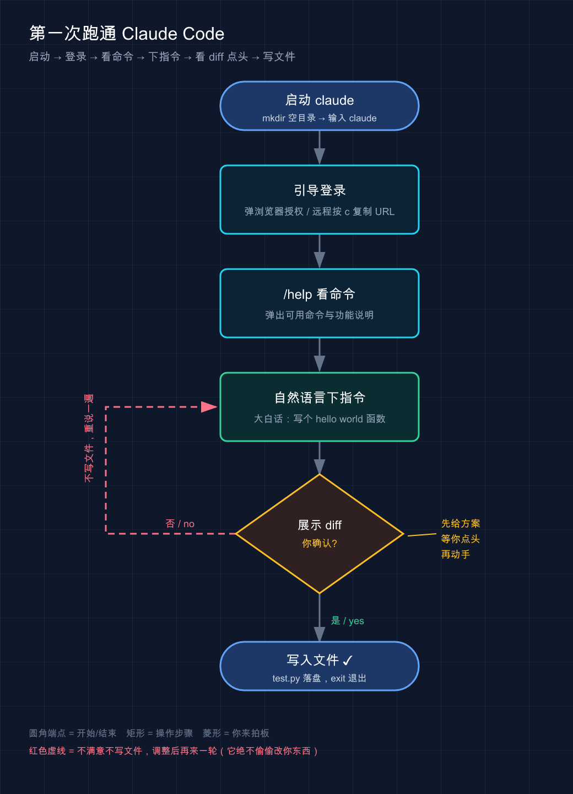

# 02 · 安装与使用

> 📚 **系列导航**：上一篇 [01 · Claude Code 简介](01-what-is-claude-code.md) 讲清了它是什么、能干啥。这一篇带你真正把它装到自己电脑上，登录、跑起来，顺带把升级、卸载、踩坑排查一次说透。下一篇 [03 · Claude Code 如何工作](03-how-it-works.md) 掀开盖子看代理循环。

说个常见的糗事。很多人第一次装 Claude Code，随手搜了篇老教程，照着敲 `npm install -g @anthropic-ai/claude-code`，卡在权限报错上。一着急直接 `sudo` 怼上去——装是装上了，后面自动更新天天失败，`claude doctor` 一片红。折腾快一个钟头才反应过来：**官方早已把原生脚本列为首选，npm 那条路坑更多**，一行 `curl` 脚本三十秒搞定的事，却硬走了最绕、最容易踩坑的那条道。

说白了，**装 Claude Code 本身不难，难的是没人告诉你哪条路是坑**。这篇就把每个平台的正路标清楚，让你别重蹈覆辙。

**看完这一篇，你会拿到：**

- 一条命令在 Mac / Windows / Linux / WSL 上把 Claude Code 装好（带预期输出，能自己验证装没装成功）
- 三种安装方式（官方脚本 / 包管理器 / npm）的对比，知道自己该选哪个
- 登录、升级、卸载的完整操作
- 一份「报错 → 怎么修」的速查表，覆盖九成新手会撞上的坑

---

## 01 装之前先搞清楚三件事

别急着敲命令。太多人装到一半才发现「哦这账号还不能用」，白折腾。三件事先确认一下。

### 第一件：你的电脑够不够格

Claude Code 对机器要求不高，但有几条硬线（**以官方为准**）：

| 项目 | 要求 |
|------|------|
| **操作系统** | macOS 13.0+ / Windows 10 1809+ / Ubuntu 20.04+ / Debian 10+ / Alpine 3.19+ |
| **内存** | 4 GB 以上可用 RAM |
| **处理器** | x64 或 ARM64 |
| **网络** | 需要联网 |
| **终端** | Bash、Zsh、PowerShell 或 CMD 任一 |

macOS 低于 13.0 的注意：**装是能装，但一跑就崩**，报 `dyld: cannot load` 之类的错——老系统不支持二进制用的指令，没有绕过办法，只能升级系统（在还停留在 macOS 12 的机器上，它死活跑不起来，升到 14 才好）。

### 第二件：你得有个能用的账号

**新手最容易忽略的一条：免费版 Claude.ai 账号用不了 Claude Code。**

官方要求是 **Pro、Max、Team、Enterprise 或 Console（API）账号**之一。你平时用网页版 Claude 聊得挺欢，不代表账号能驱动 Claude Code——免费档就是不行。

想用国产模型（DeepSeek、GLM、Minimax）省钱的，账号这步先放着，第 05 篇专门讲接第三方模型。本篇默认你用官方账号。

### 第三件：你打算从哪儿用它

Claude Code 有三种用法：**CLI（命令行）** 功能最全、最贴近设计初衷；**桌面 App** 不用碰终端、下载即用；**编辑器集成**（VS Code / JetBrains）融进现有开发流。

**我的建议：直接学 CLI。** 这篇也以 CLI 为主线——它最稳、最通用，学会它后面桌面 App 和编辑器插件都是几分钟的事（第 08-10 篇会讲）。实在抵触终端的，去 <https://claude.com/download> 下桌面 App，点点就能用。

> 💡 一句话总结：开装前确认三件事——**系统版本够、账号是付费档或 Console、用法选 CLI**，这三关过了再敲命令。

---

## 02 装好它：每个平台一条命令

先给结论：**所有平台都优先用官方安装脚本**（官方叫「原生安装 / Native Install」，现在最推荐）。最大好处是——**装完后台自动更新，基本不用再操心版本**。

**类比：原生安装就像应用商店装 App。** 点一下「安装」，它自己下载、自己装好、以后自己后台更新；老的 npm 方式更像「下个安装包手动点下一步」——能装，但更新得你亲自来，还容易因权限出岔子。

### macOS / Linux / WSL

打开终端，粘这一行：

```bash
curl -fsSL https://claude.ai/install.sh | bash
```

国内网络提示：`claude.ai` 和下载服务器 `downloads.claude.ai` 多数情况下需要**魔法上网**才能稳定访问。装的时候挂上代理，能省掉一大半「卡住 / 超时」的报错。

### Windows（原生，不用 WSL）

**先确认你在哪个终端里**——这是 Windows 用户最常翻车的点，PowerShell 和 CMD 命令不一样：

PowerShell（提示符长这样 `PS C:\>`）：

```powershell
irm https://claude.ai/install.ps1 | iex
```

CMD（提示符是 `C:\>`，没有前面的 `PS`）：

```batch
curl -fsSL https://claude.ai/install.cmd -o install.cmd && install.cmd && del install.cmd
```

**怎么分辨？** 看提示符开头有没有 `PS`：有就是 PowerShell，没有就是 CMD。在 PowerShell 里跑 CMD 那条带 `&&` 的命令会报 `The token '&&' is not a valid statement separator`，反过来在 CMD 里跑 `irm` 会报 `'irm' is not recognized`——看到这俩报错换对应命令即可。

另外，Windows 原生环境**推荐顺手装个 [Git for Windows](https://git-scm.com/downloads/win)**，它给 Claude Code 提供 Git Bash；不装会改用 PowerShell 跑命令（也能用，只是部分 Bash 脚本受限）。WSL 则不需要它。

### Windows 选 WSL 还是原生？

做 Linux 工具链开发、或想用[沙箱](https://code.claude.com/docs/zh-CN/sandboxing)功能就走 WSL。官方对照表：

| 选项 | 需要什么 | 支持沙箱 | 什么时候用 |
|------|---------|:------:|-----------|
| **原生 Windows** | 啥都不用（Git for Windows 可选） | ❌ | Windows 原生项目和工具 |
| **WSL 2** | 启用 WSL 2 | ✅ | Linux 工具链或要用沙箱 |
| **WSL 1** | 启用 WSL 1 | ❌ | WSL 2 用不了时的退路 |

走 WSL 的话，**在 WSL 终端里**跑上面 macOS/Linux 那条 `curl` 脚本就行——是在 WSL 里装，不是在 PowerShell 里。

### 不想碰终端？还有别的路

官方脚本之外还有几条备选道，列个对比按需挑：

| 安装方式 | 命令 | 自动更新 | 我的建议 |
|---------|------|:------:|---------|
| **官方脚本** | `curl ... \| bash` | ✅ 后台自动 | **首选**，省心 |
| **Homebrew**（macOS） | `brew install --cask claude-code` | ❌ 手动 | 已经重度用 brew 管软件的人 |
| **WinGet**（Windows） | `winget install Anthropic.ClaudeCode` | ❌ 手动 | 习惯用 WinGet 的人 |
| **npm** | `npm install -g @anthropic-ai/claude-code` | ❌ 手动 | **最后才考虑**，要先装 Node.js 18+ |

几个坑提前说：

- **Homebrew 有两个 cask**：`claude-code` 是稳定版（慢一周、跳过有重大回归的版本），`claude-code@latest` 是最新版，升级各对应 `brew upgrade claude-code` / `brew upgrade claude-code@latest`。
- **WinGet 不自动更新**：需定期手动跑 `winget upgrade Anthropic.ClaudeCode`。
- **npm 千万别加 `sudo`**。官方明确警告 `sudo npm install -g` 会引发权限问题和安全风险——这正是开头那个最常见的坑。遇到权限报错，正解是改用官方脚本。npm 升级也要用 `npm install -g ...@latest`，别用 `npm update -g`。

> 💡 一句话总结：闭眼选官方脚本就对了，**一条 `curl`（或 Windows 的 `irm`）解决战斗，还自带后台更新**；npm 是下下策，且永远别 `sudo`。

---

## 03 验证装没装成功

装完别急着用，花十秒确认一下。打开一个新终端窗口，敲：

```bash
claude --version
```

预期输出是一个版本号，类似（你看到的数字会更新，正常）：

```text
2.1.81 (Claude Code)
```

**看到版本号 = 装成功了。** 如果报 `command not found: claude` 或 Windows 上的 `'claude' is not recognized`，先别重装——九成是 PATH 没配好（安装目录没进系统搜索路径），第 06 节有修法。

想更详细，官方还给了个体检命令：

```bash
claude doctor
```

它会把安装情况、配置、最近一次更新结果都列出来。**装完新机器或遇到抽风，第一反应就该是先跑一遍 `claude doctor`**——比自己瞎猜快多了。

> 💡 一句话总结：`claude --version` 出版本号就成了；有任何不对劲，`claude doctor` 是你的第一诊断工具。

---

## 04 登录：让它认得你

装好的 Claude Code 还是个「不认识你」的空壳，得登录绑上账号才能干活。在你的**项目目录**里启动它：

```bash
claude
```

首次启动它会自动引导你登录，也可以进界面后手动触发：

```text
/login
```

接下来它弹出浏览器页面让你授权，授权完回终端就登录上了。**凭据存在本地，下次启动不用再登**。换账号再跑一次 `/login` 即可。

### 登录卡住了怎么办

最常见的一种：**浏览器没自动弹出，或你在远程服务器 / WSL / SSH 里登录**——浏览器可能开在另一台机器上，回调回不来。官方办法很简单：

在登录提示界面按 `c`，把那串 OAuth（开放授权）URL 复制出来，手动粘到浏览器打开，登录完显示一个 code，再把 code 贴回终端即可。

在云服务器上配 Claude Code 时很容易吃这亏，傻等浏览器弹窗半天没反应——远程环境就得走「复制 URL 手动开」这条路。连粘贴都不灵的话，还有个更稳的退路命令：

```bash
claude auth login
```

它从标准输入读取你粘贴的 code，专治交互式提示粘不进去的终端。

### 一个隐蔽的登录大坑

登录后报 `This organization has been disabled`，但订阅明明是好的——**大概率是 shell 配置里残留了一个旧的 `ANTHROPIC_API_KEY`**，把你的订阅凭据顶掉了。

环境变量里有 API key 时，Claude Code 会优先用 key 而非订阅。解法是清掉它：

```bash
unset ANTHROPIC_API_KEY
claude
```

要永久解决，去翻 `~/.zshrc`、`~/.bashrc` 或 `~/.profile`，把那行 `export ANTHROPIC_API_KEY=...` 删掉。进 Claude Code 后用 `/status` 能确认当前在用哪种登录方式。

> 💡 一句话总结：`claude` 启动会自动引导登录，**远程/WSL 环境记住「按 `c` 复制 URL 手动开」**；登录报组织禁用，先查环境变量里有没有残留的旧 API key。

---

## 05 升级与卸载

### 升级

**用官方脚本装的啥都不用做**——后台自动更新，下次启动就是新版。想立刻更：

```bash
claude update
```

更新成没成，还是那句 `claude doctor`。更新渠道可选（写在 `settings.json`，或在 Claude Code 内用 `/config` 设）：

```json
{
  "autoUpdatesChannel": "stable"
}
```

- `"latest"`（默认）：新功能一发布就拿到
- `"stable"`：用大概一周前的版本，跳过有重大回归的发布——**追求稳定选这个**

不想要自动更新，在 `settings.json` 的 `env` 里设 `"DISABLE_AUTOUPDATER": "1"` 即可（它只停后台检查，`claude update` 手动更新仍能用）。**Homebrew / WinGet / apt 装的默认都不自动更新**，得手动跑对应升级命令（前面坑提示里说了）。

### 卸载

按你**当初的安装方式**对应卸载。官方脚本装的：

macOS / Linux / WSL：

```bash
rm -f ~/.local/bin/claude
rm -rf ~/.local/share/claude
```

Windows PowerShell：

```powershell
Remove-Item -Path "$env:USERPROFILE\.local\bin\claude.exe" -Force
Remove-Item -Path "$env:USERPROFILE\.local\share\claude" -Recurse -Force
```

其他方式各自对应：Homebrew 用 `brew uninstall --cask claude-code`，WinGet 用 `winget uninstall Anthropic.ClaudeCode`，npm 用 `npm uninstall -g @anthropic-ai/claude-code`。

**注意**：上面这些只删了程序本体，配置、授权、会话历史还留在 `~/.claude/` 里。如果卸载后 `claude` 还能跑，多半是你有**第二个安装**或老版本留下的 shell 别名（第 06 节教你揪出来）。

想彻底清干净（**这步不可恢复，设置 / 授权 / MCP 配置 / 会话历史全没**）：

```bash
# 全局用户设置和状态
rm -rf ~/.claude
rm ~/.claude.json

# 当前项目的本地设置（在项目目录里执行）
rm -rf .claude
rm -f .mcp.json
```

提醒：VS Code 扩展、JetBrains 插件、桌面 App 也会往 `~/.claude/` 写东西，它们还装着这目录就会被重建——要彻底删得先卸了它们。

> 💡 一句话总结：官方脚本装的**升级靠后台自动、`claude update` 手动催**；卸载按当初的装法对应来，**配置文件得单独删、且删了不可逆**。

---

## 06 报错速查：九成新手会撞的坑

装这东西报错基本逃不掉，但绝大多数有标准解法。把官方文档里最高频的几类整理成速查表——**先对症，再下药，别一报错就重装**。

| 你看到的报错 | 真正的原因 | 怎么修 |
|------------|-----------|--------|
| `command not found: claude` | 安装目录没进 PATH | 把 `~/.local/bin` 加进 PATH（见下方） |
| `syntax error near unexpected token '<'` | 安装脚本返回了 HTML 不是脚本 | 多半网络/区域问题，换 Homebrew/WinGet 或稍后重试 |
| `irm is not recognized` | 你在 CMD 里跑了 PowerShell 命令 | 换成 CMD 安装命令，或打开 PowerShell |
| `'&&' is not valid` | 你在 PowerShell 里跑了 CMD 命令 | 换成 PowerShell 的 `irm` 命令 |
| `bash is not recognized` | 在 Windows 上跑了 Mac/Linux 命令 | 换成 PowerShell 的 `irm` 命令 |
| Linux 安装时 `Killed` | 内存不够（OOM 杀进程） | 加交换空间（见下方），Claude Code 要 4GB+ RAM |
| `Error loading shared library` | 安装器误判了系统 libc 类型，拉了错误变体 | 见官方 musl/glibc 排查 |
| 登录后 `403 Forbidden` | 订阅无效 / 账号没权限 | 查订阅状态，或确认 Console 账号有对应角色 |
| `App unavailable in region` | 你所在区域不支持 | 见 [支持的国家/地区](https://www.anthropic.com/supported-countries) |

挑两个最高频的展开说。

### 坑一：`command not found: claude`（最常见）

跑 `claude` 说找不到命令——**不是没装上，是装好的目录没进系统搜索路径（PATH）**。

**类比：PATH 就是系统的门牌号清单。** 程序装好好比房子盖好了，但系统只会去「门牌号清单」上登记过的地址挨个找。`claude` 的房子盖在 `~/.local/bin/`，这地址没登记进清单，自然找不到。

修法（macOS 默认是 Zsh）：

```bash
echo 'export PATH="$HOME/.local/bin:$PATH"' >> ~/.zshrc
source ~/.zshrc
```

Linux 大多默认 Bash，把 `~/.zshrc` 换成 `~/.bashrc` 即可。改完验证：

```bash
claude --version
```

出版本号就修好了。Windows 用户则把 `%USERPROFILE%\.local\bin` 加进用户 PATH 环境变量，然后**重启终端**。

### 坑二：揪出「打架」的多个安装

如果先 npm 装过又官方脚本装一遍，可能同时存在好几个 `claude`，版本对不上、行为诡异。先看看 PATH 上有几个：

```bash
which -a claude
```

列出来不止一个的话，**只留官方脚本那个**（`~/.local/bin/claude`），其余删掉：

```bash
# 卸掉 npm 全局安装
npm uninstall -g @anthropic-ai/claude-code

# 删掉老版本的本地 npm 安装
rm -rf ~/.claude/local
```

很多时候 `which -a claude` 一跑，就会发现 npm 和原生各装了一个，删掉 npm 那个、理顺 PATH，瞬间清静。

> 💡 一句话总结：**报错先查表对因，别条件反射重装**；找不到命令多半是 PATH，行为诡异多半是装了好几个在打架，`which -a claude` 一照便知。

---

## 07 动手：从零跑通第一次

光装好不算数，实际跑一遍确认链路通。**这个最小流程不依赖已有项目，新建个空目录就能做。**

第一步，建测试目录并进去，启动 Claude Code：

```bash
mkdir claude-test && cd claude-test
claude
```

第一次启动会引导你登录（按第 04 节走完），登录后看到欢迎界面。

第二步，在输入框里敲 `/help`，看看有哪些命令：

```text
/help
```

预期：弹出一份可用命令和功能说明的列表。直接打一个 `/`，还会弹出所有命令的自动补全。

第三步，让它干件实事——直接用大白话下指令（不用记命令格式）：

```text
在 test.py 文件里写一个打印 hello world 的函数
```

预期行为：**Claude Code 会先把要改的代码以 diff（差异对比）摆给你看，等你确认（选 yes）才真正写文件**。这是它的核心工作流——先给方案、等你批、再动手，不偷偷改你东西。

确认后，目录里就多了个 `test.py`。退出：

```text
exit
```

到这步，你已经完整跑通了「装 → 登录 → 给指令 → 它改文件 → 你确认」的全流程。**第一次看到它自己写出代码、还停下来等你点头那一下，挺有「这玩意儿真能干活」的实感**——头一回跑通的时候，多少会有点小兴奋。



这张图把上面四步串成一条线：从 `claude` 启动、登录、`/help` 看命令、大白话下指令，到最关键的一环——**它先把 diff 摆给你看、等你点头（是）才写文件；你说不（否）它就不写，调整后再来一轮**，全程绝不偷偷改你的东西。

> 💡 一句话总结：新建空目录就能跑通全流程——**`claude` 启动登录、`/help` 看命令、大白话下指令、看 diff 点 yes**，这套「先给方案再动手」是它最核心的节奏。

---

## 08 小结

这一篇把「装好并用起来」彻底过了一遍：

- **装前确认三件事**：系统版本够、账号是付费档或 Console、用法选 CLI。
- **认准官方脚本**：Mac/Linux/WSL 用 `curl`，Windows 分清 PowerShell（`irm`）和 CMD；npm 是下策，永远别 `sudo`。
- **验证用 `claude --version`，体检用 `claude doctor`**；登录报组织禁用先查残留的 `ANTHROPIC_API_KEY`。
- **报错先查表对因**：找不到命令查 PATH，行为诡异查多重安装。

你现在应该能在自己机器上独立装好 Claude Code、登录、跑通第一个例子，遇到常见报错也知道往哪查。

下一篇 **[03 · Claude Code 如何工作](03-how-it-works.md)**——掀开盖子看里面：你刚那句「写个 hello world 函数」，是怎么从一句话变成一次精准文件修改的？背后是一套叫「代理循环」的机制，搞懂它，你才算真会用 Claude Code，而不只是会敲命令。

> 留个问题：你刚让它写 `test.py` 时，它是**先看了目录里有什么文件、还是直接动手写的**？这个差别，正是下一篇的切入点。

---

装好只是拿到了工具，会用它的「思路」才是真本事——下一篇见。
