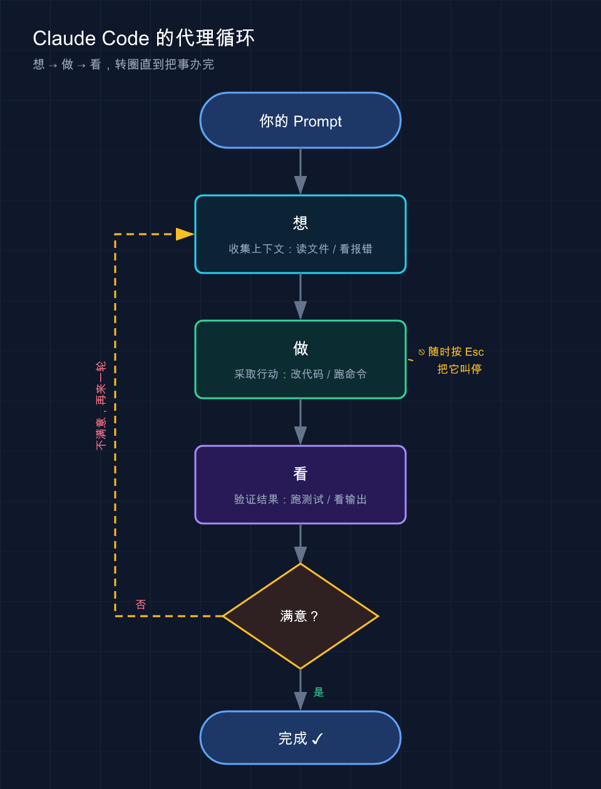

# 03 · Claude Code 如何工作

> 📚 **系列导航**：上一篇 [02 · 安装与使用](02-install.md) 带你把 Claude Code 装好、跑起来。这一篇拆开盖子，看清它到底怎么干活——为什么它能自己读代码、改文件、跑命令，而不只是聊天。

第一次用 Claude Code，常会撞见这么一段对话——

> 你：「这个测试为啥挂了？」
> Claude：「我先跑一下测试套件看看。」（开始跑命令）
> Claude：「报错说 `validateEmail` 返回了 undefined，我去看看这个函数。」（读了文件）
> Claude：「找到了，这里少了一个 return。我改一下，然后重新跑测试确认。」（改完，又跑了一次）
> Claude：「测试过了。」

看到这儿容易有点懵：**只问了一句话，它怎么自己跑命令、自己读文件、自己改、还自己验证了？**

说白了，这就是 Claude Code 和普通 AI 聊天框最大的区别。聊天框只会「回你一段文字」，而 Claude Code 会**自己动手做事**。这背后是一套固定的工作机制，今天讲透。

**看完这一篇，你会拿到：**

- 一张图看懂 Claude Code 的「代理循环」——它每做一件事都在重复的三个动作
- 搞清楚它手里那 5 类「工具」分别能干啥，以及它怎么决定用哪个
- 知道它到底能看到你电脑上的什么、看不到什么（关系到安全）
- 一个能照着跑的小实验，亲眼看它走完一整个循环

---

## 01 代理循环：想 → 做 → 看

先说结论：**Claude Code 干任何活，都在重复三个动作——收集上下文、采取行动、验证结果**。官方把这套机制叫「代理循环（agentic loop）」。

换个更土的说法：**想 → 做 → 看**。

- **想**（收集上下文）：先搞清楚状况——读相关文件、看报错、查 git 状态
- **做**（采取行动）：动手——改代码、跑命令、新建文件
- **看**（验证结果）：检查刚才做的对不对——跑测试、看输出，不对就再来一轮

**类比：一个靠谱的修车师傅。** 你把车开进店说「方向盘抖」，师傅不会立刻拆。他先**看一圈、试开两步**（想），再**动扳手**（做），修完**开一段确认不抖了**（看）。还抖就回第一步重查。Claude Code 就是这么个师傅，只不过修的是你的代码。

回到开头那段对话，对照一下你就懂了：

| Claude 说的话 | 对应循环里的哪一步 |
|---|---|
| 「我先跑一下测试套件」 | 想（收集上下文） |
| 「报错说 undefined，我去看看这个函数」 | 想（继续收集） |
| 「这里少了 return，我改一下」 | 做（采取行动） |
| 「然后重新跑测试确认」 | 看（验证结果） |
| 「测试过了」 | 循环结束 |

它把这三步**串成一条链**，一步的结果决定下一步干什么。修个 bug 可能循环好几轮，问个「这段代码啥意思」可能只要「想」这一步就够。**循环几轮，由任务复杂度决定，不是写死的。**



上面这张图就是 Claude Code 每次干活转的圈：从「想」到「做」到「看」，不满意就从「看」拐回「想」再来一轮——你随时能按 `Esc` 把它叫停。

这里有个关键点，很多人没意识到：**你也是这个循环的一部分**。它走偏了，你随时能插话纠正——这点下一节细说。

驱动这个循环的是两样东西：**模型负责「想」，工具负责「做」和「看」**。

模型就是 Claude 的大脑——Sonnet 应付日常编程够用，Opus 推理更强、适合复杂架构。会话里输入 `/model` 随时切，或者启动时 `claude --model sonnet`。

> 💡 **一句话总结**：Claude Code 不是「回你一段话」，而是「想→做→看」转圈直到把事办完，**这才是它和聊天框的本质区别**。

---

## 02 你也在循环里：随时能打断

上一节结尾说了：你也是这个循环的一部分。展开聊聊。普通 AI 聊天是「你问一句、它答一段、回合结束」。Claude Code 不一样——它在循环里自己跑的时候，**你不用干等着，随时能插手**。

比如让它重构一个模块，看它跑偏了、正要大改一堆文件，直接按 `Esc`，它立刻停下，正在跑的命令也取消了。再补一句「别动那个文件，只改这个函数」，它就顺着新指示继续。

两种打断方式，区别要分清：

| 操作 | 效果 | 什么时候用 |
|---|---|---|
| 按 `Esc` | **立刻停**，正在跑的工具调用被取消，等你下一条指令 | 它跑偏了、要做的事不对，赶紧拦住 |
| 打字 + `Enter` | **不打断当前操作**，发一句补充，它做完手头的就读 | 只是想补个上下文、提个醒，不急着叫停 |

> 你不需要憋一个「完美的提示」。先说个大概，看它做，不对再纠正——**这是对话，不是一次性命令**。

这话是官方文档原话，特别值得记住。刚上手时总想「一句话把需求说全」，憋半天。其实没必要：丢个大方向，它做错了再喊停，**迭代比憋大招快得多**。

> 💡 **一句话总结**：它自主干活，但**永远听你指挥**——`Esc` 急停、打字补充，方向盘随时在你手里。

---

## 03 工具：它能真正动手的原因

上一节说模型负责「想」。那「做」和「看」靠什么？**工具。**

这是 Claude Code 最该记住的一句话：**没有工具，Claude 只能回你文字；有了工具，它能真的读你的代码、改你的文件、跑你的命令。**

**类比：一个戴了智能手环的助理。** 光会说话的助理只能出主意；给他配上能开门、打字、查资料的设备，他才能真正替你把事办了。工具就是 Claude Code 的「手」。

官方把内置工具分成 5 大类。我用大白话给你列一遍——

| 工具类别 | 它能干什么 | 对应你平时的什么操作 |
|---|---|---|
| **文件操作** | 读文件、改代码、新建文件、重命名、重组 | 你在编辑器里打开、敲字、保存 |
| **搜索** | 按文件名找文件、用正则在内容里搜、翻整个代码库 | 你按 `Ctrl+F` 或 `grep` |
| **执行** | 跑 shell 命令、起服务器、跑测试、用 git | 你在终端里敲命令回车 |
| **网络** | 搜网页、抓文档、查报错信息 | 你打开浏览器搜一段错误 |
| **代码智能** | 看类型错误和警告、跳转定义、查引用 | IDE 的「转到定义」「找引用」 |

> ⚠️ **注意**：第 5 类「代码智能」需要额外装[代码智能插件](https://code.claude.com/docs/zh-CN/discover-plugins)才有，前 4 类是开箱即用的。以官方文档为准。

那它**怎么决定用哪个工具**？不是你指定的，是**模型自己根据你的话和当前进展挑**。

举个官方的例子，你说一句「修复失败的测试」，它内部大概会这么走：

1. 跑测试套件，看哪个挂了 —— 用了 **执行**
2. 读报错输出 —— **执行**
3. 搜相关源文件 —— **搜索**
4. 读这些文件理解逻辑 —— **文件操作**
5. 改文件修 bug —— **文件操作**
6. 再跑一次测试验证 —— **执行**

看出来没？**这 6 步就是「想→做→看」循环在工具层面的展开**。每用一次工具，就拿回一点新信息，喂给模型决定下一步——循环就是这么转起来的。

有个很典型的场景：让它给一个没文档的老项目「理一下目录结构」。它不用你喂任何文件，自己 `ls`、自己 `grep` 关键字、读了七八个文件，最后画出一张结构图。**全程没指定任何一个文件**——这就是官方说的「委派，不要指示」：给方向，细节它自己抠。

至于 Skill、MCP、Hook、Subagent 这些——它们是**架在这 5 类内置工具之上的扩展层**，能让 Claude 知道更多、连更多外部服务。本系列后面一篇篇讲，先知道有这么回事就行。

> 💡 **一句话总结**：工具是 Claude Code 的「手」，5 类各管一摊；**用哪个、用几次，它自己决定**，你只管说目标。

---

## 04 它能看到你电脑上的什么

这一节关系到安全，得说清楚。很多人第一次用会犯嘀咕：**它是不是把我整个硬盘都翻了一遍传走了？** 不是。

先记一句话：**Claude Code 的「视野」基本等于你在那个目录下的终端能摸到的东西**。你在哪个文件夹敲的 `claude`，它的活动范围就以那儿为中心。

按官方文档，当你在某个目录运行 `claude`，它能访问：

- **你的项目**：当前目录和子目录里的文件（其他地方的文件需要你给权限才碰）
- **你的终端**：你能跑的任何命令——构建工具、git、包管理器、脚本。**命令行能干的，它就能干**
- **你的 git 状态**：当前分支、未提交的改动、最近的提交历史
- **你的 `CLAUDE.md`**：你写的项目专属说明书，每次会话它都会读（这文件后面有专篇讲）
- **你配置的扩展**：MCP、Skill、Subagent 这些

正因为它能看到**整个项目**，而不只是你当前打开的那一个文件，所以它能跨文件协调——你说「修登录 bug」，它能搜出相关的好几个文件、一起改、再跑测试验证。**这和只看当前文件的内联补全插件，根本不是一回事。**

那安全怎么保证？两道闸——

**第一道：检查点（checkpoint），相当于游戏存档。** 它改任何文件之前，会先给当前内容拍个快照。改坏了，在**输入框空着时连按两次 `Esc`**（或输入 `/rewind`），会弹出一个「回溯菜单」，选「恢复代码」就把文件退回改之前；也可以直接说「撤销刚才的修改」。

> **检查点只管 Claude 用编辑工具改的文件——bash 命令改的、以及外部副作用都不在内。** 数据库、API、线上部署这类「泼出去收不回」的操作没法存档——所以 Claude 在跑这类有外部影响的命令前会**先问你**。

这里有个常踩的坑：有时它改了五六个文件，你看完觉得方向全错。搁以前得手动一个个 `git checkout` 回滚，现在按两下 `Esc`、在弹出的菜单里选「恢复代码」——**五个文件齐刷刷回到改之前**，干净利落。有了这一手，放手让它改代码就没那么怵了。

**第二道：权限模式，相当于实习生动手前问不问你。** 按 `Shift+Tab` 循环切换：

| 权限模式 | 状态栏显示 | Claude 的行为|
|---|---|---|
| **默认** | （不显示提示） | 改文件、跑命令前都会询问你 |
| **自动接受编辑** | `⏵⏵ accept edits on` | 改文件和常见文件命令（如 `mkdir`、`mv`）不问，其他命令仍问 |
| **Plan Mode（计划模式）** | `⏸ plan mode on` | 可读文件和运行探索性命令，但不编辑源代码；先给你一份计划，你批准了才动手 |
| **自动模式** | `⏵⏵ auto mode on` | 用后台安全检查评估所有操作（**实验性，目前是研究预览，可能变化**）|

最值得养成的习惯是用 **Plan Mode**：复杂任务先按两下 `Shift+Tab` 进去，让它「只分析、出方案、别动手」，方案过一遍、改改，确认了再放它执行。**这能躲过好几次「方向错了改一半」的返工**——先看图纸再施工，比边干边改省事太多。

嫌每次都问烦？可以在项目的 `.claude/settings.json` 里把信任的命令（比如 `npm test`、`git status`）加白名单，以后不问。配置细节后面专篇讲。

> 💡 **一句话总结**：它的视野≈你在那个目录的终端权限；**检查点管「改坏了能撤」，权限模式管「动手前问不问」**——两道闸下，放手用也踏实。

---

## 05 动手：亲眼看它走一个完整循环

光看原理记不住，跑一个最小实验，亲眼看它「想→做→看」转一圈。**这个实验不依赖任何现成项目**，新建个空文件夹就能做。

**第一步：建个空目录，进去启动 Claude Code。**

在终端里跑（Mac / Linux；Windows 用 PowerShell 把 `mkdir -p` 换成 `mkdir` 即可）：

```bash
mkdir -p ~/cc-demo && cd ~/cc-demo
claude
```

**第二步：进去之后，先切到计划模式看它怎么「想」。**

按两下 `Shift+Tab`，界面底部会提示进入了 **Plan Mode（计划模式）**。然后丢这么一句给它：

```text
帮我写一个 Python 脚本 add.py，里面一个函数 add(a, b) 返回两数之和，
再写几个测试用例验证它，最后跑一遍测试。先给我计划，别直接动手。
```

**预期看到**：它**不会**立刻建文件，而是先回你一份计划，大致是——

```text
计划：
1. 创建 add.py，实现 add(a, b)
2. 创建测试（用 assert 或 pytest）
3. 运行测试，确认全部通过

需要我开始吗？
```

这就是「想」——它在动手前先理清了思路。**注意它停下来等你批准了，这是计划模式的特征。**

**第三步：批准，看它「做」+「看」。**

回复「可以，开始吧」。接着你会看到它依次：

- **建文件**（文件操作工具）——可能先弹一下权限确认，你按同意
- 写完后**跑测试**（执行工具），比如执行 `python add.py` 或 `pytest`
- 把测试输出贴给你，**预期是类似**：

```text
测试通过：add(2, 3) == 5 ✓  add(-1, 1) == 0 ✓  add(0, 0) == 0 ✓
```

到这儿，你就完整看了一遍循环：**想（出计划）→ 做（建文件、写代码）→ 看（跑测试报告结果）**。

**第四步（可选）：故意制造一次「再循环」。**

跟它说：「把 add 改成减法，但函数名别变，然后重新跑测试。」

你会看到它**改完代码、再跑测试**——如果测试断言还是加法，测试会挂，它会**自己发现挂了、回头再改**。这就是循环的精髓：**看到不对，自动再来一轮。**

新手都值得跑一遍这个实验。比起读十遍「代理循环」四个字，**亲眼看它停下来出计划、再动手、再验证，理解得快得多**。

> 💡 **一句话总结**：跑一遍这个最小实验，你会亲眼看到「想→做→看」转圈——**尤其是它会自己发现错、自动再来一轮那一下**。

---

## 06 小结

这一篇就讲清了一件事：**Claude Code 凭什么能自己干活。**

回顾一下核心：

| 要点 | 一句话记住 |
|---|---|
| **代理循环** | 想→做→看，转圈直到办完；**这是它和聊天框的本质区别** |
| **模型 + 工具** | 模型负责想，工具负责做和看 |
| **5 类工具** | 文件 / 搜索 / 执行 / 网络 / 代码智能，用哪个它自己挑 |
| **能看到什么** | ≈你在那个目录的终端权限，能跨文件协调 |
| **两道安全闸** | 检查点（改坏能撤）+ 权限模式（动手前问不问） |

你现在应该能看懂 Claude Code 跑任务时屏幕上在发生什么——它每读一个文件、每跑一条命令，都是循环里的一步；也知道了怎么用 `Esc` 急停、用计划模式先看方案、靠检查点放心让它改。

**理解了这套机制，你用起来的心态会完全不同**：它不是许愿池，而是个会自己想、动手、检查的搭档——你的活儿是给方向、定验收标准、跑偏时拉一把。

---

下一篇 **04 · API 配置**：Claude Code 装好了、原理也懂了，但它得连上模型才能真正干活。下一篇带你把 API 配通——这一步搞定，前面学的循环和工具才能跑起来。
