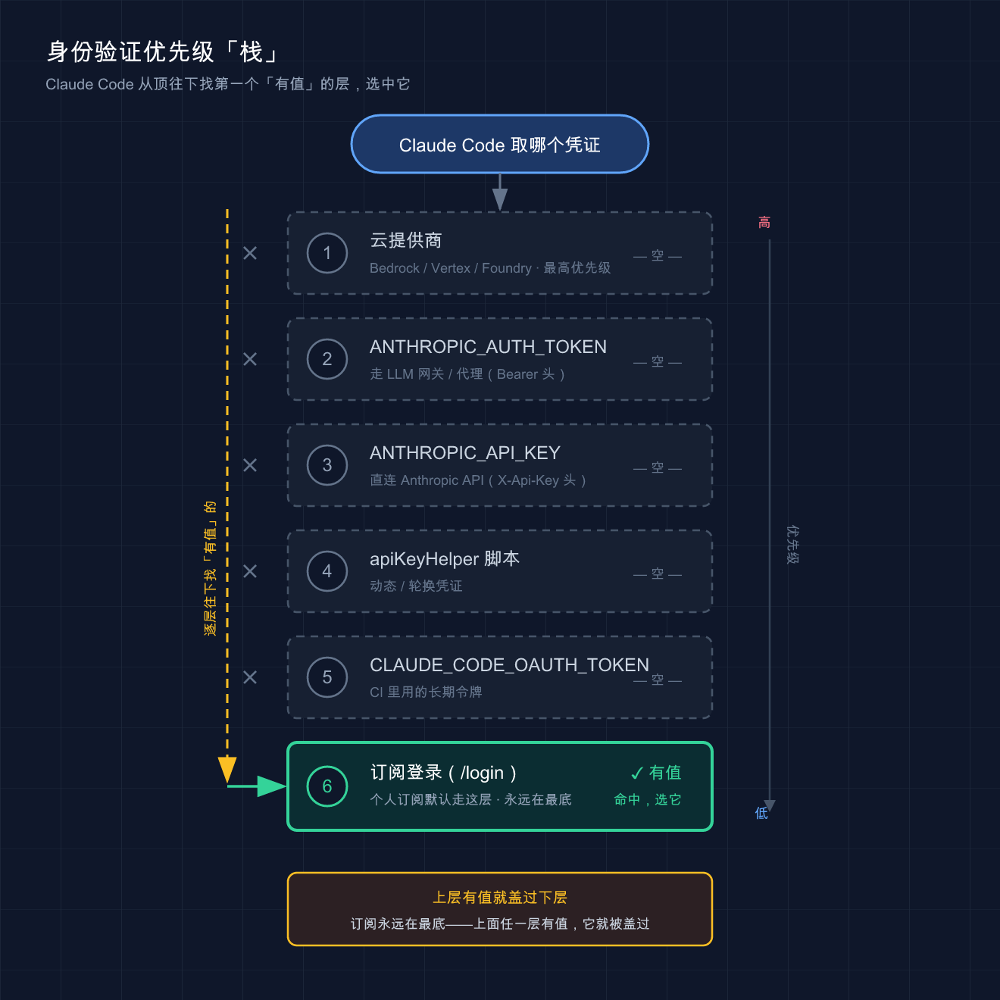

# 04 · API 配置：订阅登录还是 API key，怎么选、怎么切

> 📚 **系列导航**：上一篇 [03 · 它是怎么工作的](03-how-it-works.md) 拆了代理循环——Claude Code 怎么「想 → 做 → 看」。这一篇解决它跑起来的前提：**用什么身份连上模型**。下一篇讲接第三方 / 国产模型。

2026 年 6 月，Claude Code 官方文档里列了整整 **6 种身份验证方式**，从订阅登录到云厂商凭证，优先级一层压一层。

这里有个很常见的坑，我自己就栽过。我那会儿图省事，早年在 `.zshrc` 里 export 过一个 `ANTHROPIC_API_KEY`，后来买了 Max 订阅、`/login` 登录得好好的，结果某天翻 Console 账单，发现 API 这边在持续扣钱——明明以为自己一直在用订阅额度。查了半天才搞明白：**只要环境里有 API key，它的优先级就压过订阅**。

说白了，「登进去了」不等于「用对了身份」。这一篇就把这件事讲透。

**看完这一篇，你会拿到：**

- 订阅登录 vs API key 两条路的**适用场景对照表**，知道自己该走哪条
- 三种「在哪配、怎么改」的落地姿势（命令行登录 / 环境变量 / settings.json），以及 Mac / Windows / Linux 的差异
- 一套**自查命令**：用 `/status` 确认「我现在到底在用哪个身份、哪个模型」，再也不糊里糊涂被扣费

---

## 01 两种身份：订阅登录 vs API key

先给结论：**个人自己用，选订阅登录；要嵌进脚本 / CI / 团队按用量结算，才用 API key。**

Claude Code 连模型，本质要回答一个问题：**「凭什么让我用？」** 这就是身份验证（authentication）——你得证明自己是谁、用谁的额度。官方支持的方式有好几种，但对小白来说，先抓住最主流的两条路就够。

**类比：进健身房。** 订阅登录就像办了张**月卡**——刷脸进门，一个月内随便练，不按次计费；API key 则像**按次买的门票**——每进一次扣一张，用多少付多少。月卡适合天天去的人，门票适合偶尔来一次、或者帮朋友带人进场（脚本、自动化）的场景。

两条路的区别，一张表说清：

| 维度 | 订阅登录（Claude.ai 账户） | API key（Console / 环境变量） |
|------|--------------------------|------------------------------|
| **怎么连** | 终端跑 `claude`，浏览器登录 | 配 `ANTHROPIC_API_KEY` 环境变量 |
| **怎么计费** | 按月订阅（Pro / Max / Team） | 按 token 用量，从 Console 余额扣 |
| **额度** | 有用量上限，到顶要等刷新 | 充多少用多少，无固定上限 |
| **适合谁** | 个人日常交互式开发 | 脚本 / CI / 团队按量结算 |
| **凭证从哪来** | `/login` 浏览器授权 | [Claude Console](https://platform.claude.com) 创建 key |
| **能否无浏览器** | 默认要浏览器（CI 用 `setup-token`） | 能，纯环境变量即可 |

订阅这边再细分一下，因为后面选模型会用到：

- **Claude Pro / Max**：个人订阅，用 Claude.ai 账户登录。Pro 偏轻量，Max 额度大、能用上最强模型。
- **Claude for Teams / Enterprise**：团队套餐，管理员邀请你，统一计费。Enterprise 还能配 SSO、托管策略。

个人项目一律走 Max 订阅登录，省心、不用盯余额；只有往 GitHub Actions 里塞自动化任务时，才单独搞一个 API key（具体到 CI 的玩法第 44 篇再讲）。**日常开发别碰 API key，纯属给自己找扣费焦虑。**

> 💡 一句话总结：**订阅 = 月卡（个人日常），API key = 门票（脚本/团队按量）**，先想清楚自己是哪种人，再去配。

---

## 02 订阅登录：最省心的那条路

如果你是个人用户、买了 Pro 或 Max，那配置这事儿基本**不用配**——跑起来登录一下就行。

**操作就一步。** 装好 Claude Code 后（装机看 [02 篇](02-install.md)），在终端敲：

```bash
claude
```

首次启动，Claude Code 会自动**打开浏览器**让你登录 Claude.ai 账户。登录完浏览器会跳回终端，搞定。

几个真实会撞上的情况，提前说：

- **浏览器没自动弹出来？** 在 Claude Code 界面按 `c`，它会把登录链接复制到剪贴板，你自己粘到浏览器打开。
- **浏览器登录后给了一串「登录代码」、没跳回来？** 把那串代码粘回终端的 `Paste code here if prompted` 提示符处。这种情况常见于 **WSL2、SSH 远程会话、容器**里——因为浏览器连不到本机的回调端口。
- **想换账号 / 退出登录？** 在 Claude Code 里输入 `/logout`，下次启动重新登。

**登进去的凭证存哪了？** 这点平台不一样，知道了排查问题才不抓瞎：

| 平台 | 凭证存储位置 |
|------|------------|
| **macOS** | 加密的系统钥匙串（Keychain） |
| **Linux** | `~/.claude/.credentials.json`（权限 `0600`） |
| **Windows** | `%USERPROFILE%\.claude\.credentials.json`（继承用户目录权限） |

这些都是 Claude Code 通过 `/login` / `/logout` 自动管的，**你不用手动碰**。我自己在 Mac 上排查登录问题时，照着 Linux 的路子去翻 `~/.claude/.credentials.json`，结果死活找不到，一度怀疑没登录成功——原因就在这：macOS 根本没把它放成文件，而是塞进了 Keychain。

> 💡 一句话总结：订阅用户**「跑 `claude` → 浏览器登录」就齐活**，凭证 Claude Code 自动存好，别手动去翻。

---

## 03 API key：脚本和团队的那条路

API key 这条路，适用面其实很窄——**你不做自动化、不在团队里按量结算，基本用不上。** 但既然要讲清楚「怎么切换」，就得先知道它长什么样。

**第一步，拿 key。** 去 [Claude Console](https://platform.claude.com) 创建一个 API 密钥（这是 Anthropic 官方的开发者控制台，按 token 用量计费，和 Claude.ai 订阅是两套账）。

**第二步，配成环境变量。** 平台命令不一样，分开说：

macOS / Linux：

```bash
export ANTHROPIC_API_KEY=sk-ant-你的密钥
```

Windows（PowerShell，永久写入用户环境变量）：

```powershell
[Environment]::SetEnvironmentVariable("ANTHROPIC_API_KEY", "sk-ant-你的密钥", [EnvironmentVariableTarget]::User)
```

> ⚠️ **密钥就是钱，别乱放。** 不要把 key 写进代码、提交进 Git、贴进任何会被分享的文件。临时用 `export` 设在当前终端最稳，关掉就没了。要持久化就走系统环境变量，别硬编码到项目里。

**第三步，启动确认。** 设好后跑 `claude`，交互模式下系统会**提示你批准一次**这个 key（批准 / 拒绝二选一，选择会被记住）。批准后就用它跑。

这里有个官方明说的关键行为，也就是开头那个坑的根源：

> **如果你有活跃的 Claude 订阅，但环境里同时设了 `ANTHROPIC_API_KEY`，那么 API key 在批准后会优先。** 如果这个 key 属于已禁用或过期的组织，还会直接导致验证失败。

换句话说，**API key 会「盖过」你的订阅**。所以才有了下一节要讲的切换问题。

> 💡 一句话总结：API key 走 **Console 拿 key → 配环境变量 → 启动批准** 三步；记住它一旦存在就**优先于订阅**，这是后面所有「切换」问题的根。

---

## 04 怎么切换：优先级才是真相

**核心结论：你「以为在用哪个身份」不重要，Claude Code 的优先级顺序说了算。** 想切换，本质就是去动这个优先级。

**类比：插座的接线顺序。** 你家墙上有好几个插座（订阅、API key、云凭证……），电器到底从哪个取电，不看你心里想用哪个，看**实际插着哪个、谁的位置更靠前**。要换电源，就得把更靠前那个拔掉。

官方文档给的**身份验证优先级**，从高到低 6 层（高的会盖过低的）：

| 优先级 | 凭证来源 | 典型场景 |
|:---:|------|------|
| 1（最高） | 云提供商（Bedrock / Vertex / Foundry） | 企业走云厂商 |
| 2 | `ANTHROPIC_AUTH_TOKEN` 环境变量 | 走 LLM 网关 / 代理 |
| 3 | `ANTHROPIC_API_KEY` 环境变量 | 直连 Anthropic API |
| 4 | `apiKeyHelper` 脚本输出 | 动态 / 轮换凭证 |
| 5 | `CLAUDE_CODE_OAUTH_TOKEN` | CI 里用的长期令牌 |
| 6（最低） | `/login` 的订阅凭证 | **个人订阅默认走这层** |



这张图把上面那张表「立」了起来：6 层凭证从高到低竖直堆叠，Claude Code 从栈顶往下扫，跳过所有「空」的层，停在第一个「有值」的层就用它——个人订阅场景下，上面 5 层都空，于是命中最底层的订阅登录。

看明白没？**订阅在最底层。** 所以只要上面任何一层有值，它就盖过你的订阅。这就解释了开头那个场景——明明登录了 Max，却在烧 API 的钱——因为第 3 层的 `ANTHROPIC_API_KEY` 压着第 6 层的订阅。

**那怎么切回订阅？** 官方给的办法很直接——把更高优先级那层清掉：

```bash
unset ANTHROPIC_API_KEY
```

然后跑 `/status` 确认。如果是交互模式里临时不想用某个 key，也可以走 `/config` 里的**「使用自定义 API 密钥」开关**关掉它。

反过来，**从订阅切到 API key**，就是 `export` 上 key、批准一次即可（见 03 节）。

几条容易踩的细节，一并记下：

- **`ANTHROPIC_API_KEY` / `ANTHROPIC_AUTH_TOKEN` 只对终端 CLI 会话生效。** Claude Desktop 桌面端和远程会话**只认 OAuth 登录**，不读这些环境变量。
- **Claude Code on the Web（网页版）永远用你的订阅凭证**，沙箱里的 API key 环境变量盖不过它。
- `ANTHROPIC_AUTH_TOKEN`（第 2 层）和 `ANTHROPIC_API_KEY`（第 3 层）是两个不同的东西：前者作为 `Authorization: Bearer` 头发送，走网关 / 代理时用；后者作为 `X-Api-Key` 头发送，直连官方 API 时用。**别配混。**

> 💡 一句话总结：切换 = 调优先级。**订阅在最底层，上面任何一层有值都会盖过它**；切回订阅就 `unset` 掉高层那个，再用 `/status` 验。

---

## 05 模型选择基础：opus、sonnet 还是 default

身份配好了，还有一件事要拍板：**让它用哪个模型干活。**

**类比：派活儿挑人。** Opus 是组里**最强的资深工程师**——脑子好、推理深，但慢、贵；Sonnet 是**主力干将**——日常编程又快又稳，性价比高；Haiku 是**跑腿小弟**——简单活儿秒回、最省。难题派 Opus，日常派 Sonnet，杂活派 Haiku。

Claude Code 用**模型别名**让你不用记一长串版本号。常用这几个：

| 别名 | 用途 |
|------|------|
| `default` | 特殊值：清掉手动覆盖，回到你账户层级推荐的模型 |
| `opus` | 最新 Opus，复杂推理 / 架构决策 |
| `sonnet` | 最新 Sonnet，日常编程 |
| `haiku` | 快速高效，处理简单任务 |
| `best` | 当前等同于 `opus`，使用最强大的可用模型 |
| `opusplan` | 混合模式：Plan Mode 用 Opus 想，执行时切 Sonnet 干 |
| `opus[1m]` / `sonnet[1m]` | 带 100 万 token 上下文窗口，啃大代码库 / 长会话 |

注意：**别名指向「你的层级推荐的版本」，会随时间更新**。具体解析成哪个版本，官方文档以它为准——比如在 Anthropic API 上 `opus` 当前解析为 Opus 4.8、`sonnet` 解析为 Sonnet 4.6，但不同提供商（Bedrock / Vertex 等）解析的版本不同（以官方文档为准，可能变化）。

**你订阅的层级，决定了默认给你哪个模型：**

| 账户类型 | `default` 解析为 |
|------|------|
| Max / Team Premium / Enterprise 按量 / Anthropic API | Opus 4.8 |
| Pro / Team Standard / Enterprise 订阅席位 | Sonnet 4.6 |

也就是说，**Pro 用户默认是 Sonnet，Max 用户默认能上 Opus**——这也是推荐重度用户上 Max 的原因之一。另外，达到 Opus 用量阈值时，Claude Code 可能会**自动回退到 Sonnet**，这是正常行为，不是 bug。

**怎么设模型？** 官方按优先级给了四种方式：

```bash
# 1. 会话期间临时切（运行不带参数的 /model 会打开选择器）——优先级最高
/model sonnet

# 2. 启动时指定
claude --model opus

# 3. 环境变量（本会话生效）
ANTHROPIC_MODEL=opus
```

```json
// 4. 写进 settings.json，永久作为新会话默认——优先级最低
{
  "model": "opus"
}
```

以上按优先级从高到低排列：会话内 `/model` > 启动时 `--model` > 环境变量 `ANTHROPIC_MODEL` > settings 文件。一个实用的习惯：日常 `settings.json` 里固定 `sonnet`，碰到需要硬啃的架构问题，对话里临时 `/model opus` 顶上去，省额度。

> 关于工作量级别（`/effort`，控制思考深度）、`opusplan` 的细节这里先不展开——把模型选对，对小白已经够用。需要深挖时查官方「模型配置」文档。

> 💡 一句话总结：**难题 `opus`、日常 `sonnet`、杂活 `haiku`**；`default` 跟你的订阅层级走，Pro 默认 Sonnet、Max 默认 Opus。

---

## 06 动手：3 分钟确认「我在用谁」

光看不练等于没看。下面这套命令，跑一遍你就能彻底搞清楚自己当前的身份和模型状态。**全程在终端、然后在 Claude Code 界面里操作，不依赖任何复杂环境。**

**第一步：进 Claude Code。** 随便找个目录，跑：

```bash
claude
```

**第二步：查当前状态。** 在 Claude Code 输入框里敲：

```
/status
```

它会显示你的**账户信息**和**当前生效的身份验证方式 / 模型**。预期看到类似（具体字段随版本，以实际显示为准）：

```
Account: your@email.com (Max)
Auth: Claude subscription (OAuth)
Model: opus (Opus 4.8)
```

如果这里 `Auth` 显示的是 API key、而你以为自己在用订阅——恭喜，你刚抓到了开头说的那个坑。

**第三步：看能用哪些模型 / 切一下。** 输入：

```
/model
```

会弹出模型选择器，列出 `opus` / `sonnet` / `haiku` 等可选项，上下选、回车确认。想直接切就：

```
/model sonnet
```

**第四步（可选）：验证「订阅 vs API key」的优先级。** 这一步能让你亲眼看见 04 节讲的规律。先退出 Claude Code，在终端里：

```bash
# 看看环境里有没有 API key 在「偷偷」盖过你的订阅
echo $ANTHROPIC_API_KEY
```

- **如果输出一串 `sk-ant-...`**：说明它正压着你的订阅。想用回订阅就 `unset ANTHROPIC_API_KEY`，再进 `claude` 跑 `/status` 复查，`Auth` 应该变回订阅。
- **如果输出为空**：你本来就在走订阅（或其它优先级更高的凭证），没问题。

Windows（PowerShell）查环境变量用：

```powershell
echo $env:ANTHROPIC_API_KEY
```

**验收标准：** 你能用 `/status` 一眼说出「我现在用的是订阅还是 API key、跑的是哪个模型」，并且能通过 `unset` + 复查，亲手切回订阅。做到了，这篇的核心目标就达成了。

---

## 07 小结

这一篇就讲清了一件事：**Claude Code 用什么身份连模型，以及这个身份怎么选、怎么切。**

| 你的情况 | 怎么配 | 默认模型 |
|------|------|------|
| 个人 Pro / Max | 跑 `claude` → 浏览器 `/login` | Pro→Sonnet，Max→Opus |
| 脚本 / CI / 团队按量 | Console 拿 key → 配 `ANTHROPIC_API_KEY` | 看具体设置 |
| 想切回订阅 | `unset ANTHROPIC_API_KEY` + `/status` 复查 | — |

三个最该记住的点：

- **订阅在优先级最底层**，环境里任何一个 API key / token 都会盖过它——被莫名扣费先查这个。
- **`/status` 是你的照妖镜**：搞不清在用谁，敲它。
- **模型按活儿挑**：难题 `opus`、日常 `sonnet`，`default` 跟订阅层级走。

你现在应该能：装好后正确登录、看懂自己在用哪个身份和模型、在订阅和 API key 之间来回切，并且不再被「明明登了订阅却扣 API 费」这种事坑到。

## 下一篇预告

到这儿你连的还是 **Claude 官方的模型**。但 Claude 在国内用，官方 API 不算友好——**能不能让 Claude Code 跑 DeepSeek、通义千问、GLM 这些国产模型？**

能。秘密就在这篇反复出现、却一直没展开的那个环境变量——`ANTHROPIC_BASE_URL`：它不改「用哪个模型」，只改「请求发到哪」。下一篇 **05 · 接入第三方 / 国产模型**，就用它把 Claude Code 接到国产大模型上，省钱还不用魔法上网。

留个小思考给你：既然 API key 会盖过订阅，那把 `ANTHROPIC_BASE_URL` 指向国产平台、再配上对应的 key，Claude Code 是不是就「换芯」了？下一篇见分晓。

---

接好了官方模型这条「主路」，下一篇咱们拐进国产模型这条「岔路」。
