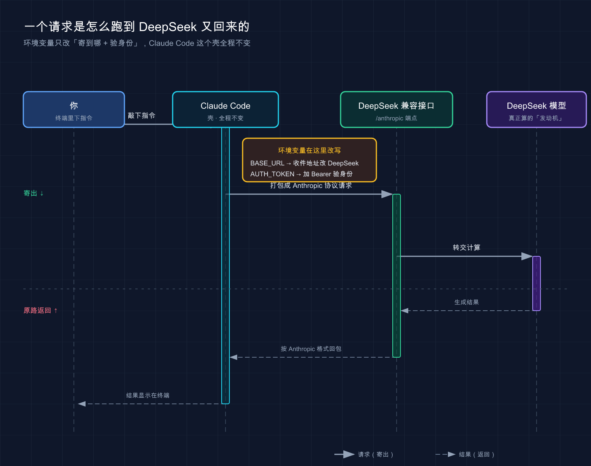

# 05 · 接入第三方 / 国产模型

> 用 DeepSeek 等国产 / 第三方模型驱动 Claude Code，把账单砍下来

> 📚 **系列导航**：上一篇 [04 · API 配置](04-api-config.md) 讲了怎么用官方 API Key 接通 Claude Code。这一篇换个思路——**把后面那个「大脑」整个换掉**，用 DeepSeek 之类的国产模型来省钱。

> ⚠️ **本篇开头先打个预防针**：用第三方模型驱动 Claude Code 属于「**实验性玩法**」。官方文档只正式覆盖到「LLM 网关」和 Bedrock / Vertex 这类托管 Claude，**并没有背书任何非 Anthropic 模型**。本文凡是官方明确写到的（环境变量含义、默认行为）我都标了来源；DeepSeek 那部分以社区方案加实测为主，**接口地址、模型名随时可能变，以 DeepSeek 官方为准**。

兄弟们，先说一句可能挨骂的话：**大多数人根本不需要折腾第三方模型**。

网上一堆教程把「Claude Code 接 DeepSeek」吹成省钱神器，搞得好像不接就是冤大头。但说句实话——如果你已经买了 Claude 的订阅（Pro / Max），或者一个月 API 花销也就几十块，**你折腾半天省下的那点钱，还不够你 debug 环境变量的工夫**。

那这篇为什么还要写？因为有两种人是真用得上：**一种是 API 余额烧得肉疼的重度用户**，每天几千万 token 进出，换个便宜十倍的模型一个月省几百上千；**另一种是连不上官方、又不想搞魔法上网的国内用户**，DeepSeek 这种国内直连的接口反而最省心。

是这两种人——往下看。不是的话，**扫一眼原理就够了，别急着动手换**。

**看完这一篇，你会拿到：**

- 一张「官方 API vs 第三方模型」的取舍对照表，先想清楚该不该换
- 一套照着抄就能跑的 DeepSeek 接入配置（Mac / Windows 分别给）
- 搞懂 4 个关键环境变量到底在干嘛，换任何第三方模型都通用
- 几个常见的坑：弃用变量、`/status` 验证、什么时候别用

---

## 01 先搞懂：换模型到底换了什么

先说结论：**Claude Code 是「壳」，模型是「大脑」，第三方接入做的事，就是把大脑换成别人家的。**

你装的 Claude Code，本质是一个跑在终端里的客户端——它负责读你的代码、调工具、管上下文、跑那个「想 → 做 → 看」的代理循环。**但它自己不会思考**，每一步都要把请求发给某个大模型，等模型回话。默认这个模型是 Anthropic 的 Claude。

**类比：换发动机的车。** Claude Code 是车壳——方向盘、座椅、仪表盘都不变，你的操作习惯一点不用改。模型就是发动机。原厂发动机（Claude）动力最猛但油费贵；你想省钱，可以拆下来塞一台国产发动机（DeepSeek）。车还是那辆车，开起来手感差不多，**就是动力和油耗变了**。

那「换发动机」具体怎么换？靠的不是改代码，而是**几个环境变量**。其中最核心的一个叫 `ANTHROPIC_BASE_URL`——它决定 Claude Code 把请求**发到哪个地址**。

这里有个官方文档里特别强调、但九成教程都没讲清的点：

> **`ANTHROPIC_BASE_URL` 改变请求发送的位置，而不是哪个模型回答它们。**（官方《模型配置》原文）

啥意思？`ANTHROPIC_BASE_URL` 只是改了「往哪寄信」，不负责「谁来回信」。你把地址改成 DeepSeek 的接口，DeepSeek 那边愿不愿意收、用哪个模型回，是**接口地址 + 模型名**两个一起决定的。所以光改 URL 不够，模型名也得跟着配——这是后面踩坑的高发区，先记住。

那为什么 DeepSeek 能直接接？因为 **DeepSeek 提供了一个「兼容 Anthropic 协议」的接口**——地址是 `https://api.deepseek.com/anthropic`。说白了就是 DeepSeek 把自己伪装成 Anthropic 的样子，让 Claude Code 以为还在跟官方说话，实际背后是 DeepSeek 在算。**Claude Code 一行源码都不用改。**

> 💡 **一句话总结**：换模型 = 改几个环境变量把「发动机」换掉，车壳（Claude Code）不动；`ANTHROPIC_BASE_URL` 管「寄到哪」，模型名管「谁来答」，**两个都得配对**。

---

## 02 该不该换？先看这张表

动手之前，先冷静五分钟。**第三方模型不是免费午餐，它省了钱，但也会丢一些东西。**

拿一个真实项目对比了两周：同一套代码、同样的活儿，前一周用官方 Sonnet，后一周换 DeepSeek。下面这张表是实际用下来最真实的感受，不是参数表抄的。

| 维度 | 官方 Claude（Anthropic API） | 第三方 / 国产模型（如 DeepSeek） |
|------|------------------------------|-------------------------------|
| **价格** | 贵，Opus 尤其烧钱 | ✅ 便宜，常便宜一个数量级 |
| **国内直连** | 多数要魔法上网 | ✅ DeepSeek 等国内直连，零门槛 |
| **代码能力** | ✅ 目前第一梯队，复杂重构稳 | 够用，复杂任务偶尔翻车 |
| **工具调用 / Agent 能力** | ✅ 原生最稳，多步任务不掉链子 | ⚠️ 看模型，兼容接口偶有边缘行为 |
| **配置成本** | 填个 Key 就行 | 要配一组环境变量，易踩坑 |
| **官方支持** | ✅ 一等公民 | ❌ 实验性，出问题没人兜底 |

看明白没？**便宜和国内直连是第三方的两张王牌；代价是代码上限、Agent 稳定性和「没人兜底」。**

这两周对比下来的真实结论：**日常的增删改查、写测试、补文档、解释代码，DeepSeek 完全够用，体感跟 Sonnet 差别不大，但花的钱零头都不到。** 可一旦遇到那种「读懂五六个文件的调用关系、跨模块大重构」的活儿，DeepSeek 有两次漏掉了关键依赖，Claude 同样的 prompt 一次就对。

所以更实用的用法是**混着来**：糙活给便宜模型、硬活切回 Claude——具体怎么分层，第 05 节给一套可直接抄的配置。

一句话判断该不该换：

- ✅ **该换**：API 账单一个月几百上千的重度用户；连官方费劲、不想搞魔法上网的国内用户；只想练手、不在乎那点模型差距的人。
- ❌ **别折腾**：已经买了 Claude 订阅的（订阅是固定费用，换 API 反而另外花钱，下一篇 06 细讲）；主力干复杂架构、疑难调试的（省那点钱不值得拿结果质量换）。

### 还在犹豫？先让网络说话

上面那条「该不该换」清单里，**「国内连官方费不费劲」是最难自己判断的一项**——你以为开了魔法上网就稳，结果跑两步 Claude Code 突然 502 或者 400，到底是它抽风还是你网络被风控了？光猜没用，**先跑一遍测**：

[ipcheck](https://github.com/stormzhang/ipcheck) 是我之前写的网络环境诊断小工具，一条命令测完 IP / DNS / 代理 / 风控，直接告诉你当前网络能不能干净连上官方 API。

- 测出来**一片红 / 黄**（DNS 污染、代理识别、风控命中）→ 别犹豫，第三方走起，省掉后面 N 次玄学排查
- 测出来**一片绿**→ 老老实实用官方，别为了省那点钱再折腾一套环境变量

> 💡 **一句话总结**：第三方模型用「省钱 + 国内直连」换「代码上限 + 兜底」；**重度用户和国内直连党该换，订阅党和硬核重构党别凑热闹**。

---

## 03 动手：把 DeepSeek 接进 Claude Code

好，假设你确认要换了。这节给一套**照着抄就能跑**的配置。

> 下面用 DeepSeek 举例（国内最省心）。接其他第三方模型（Kimi、智谱、各种聚合中转站……）**套路完全一样**，只是 `ANTHROPIC_BASE_URL` 和模型名换成对应平台的——这俩以各自官方文档为准。

### 前置：拿到一把 DeepSeek API Key

前提是你已经装好了 Claude Code（没装的回去看 [02 · 安装与使用](02-install.md)）。然后：

1. 打开 [DeepSeek 开放平台](https://platform.deepseek.com/api_keys)，注册 / 登录
2. 创建一个 API Key，**复制出来存好**（形如 `sk-xxxxxxxx`）

> 🔑 API Key 等于你账户的钱包钥匙。**别提交到 Git 仓库、别发群里、别写进代码**。下面我们用环境变量管它，天然不进代码。

### 第一步：配环境变量

环境变量就是「**写给系统看的一组开关和地址**」，Claude Code 启动时会去读它们，决定往哪发、用什么模型。

**类比：填快递单。** `ANTHROPIC_BASE_URL` 是收件地址，`ANTHROPIC_AUTH_TOKEN` 是你的身份证（验明正身才给寄），后面那串 `ANTHROPIC_*_MODEL` 是「指定用哪个快递员送」。单子填对，包裹（你的请求）才能到正确的地方、被正确的人处理。

#### Mac / Linux

打开终端，逐行执行（把 `<你的 DeepSeek API Key>` 换成真的 Key）：

```bash
export ANTHROPIC_BASE_URL=https://api.deepseek.com/anthropic
export ANTHROPIC_AUTH_TOKEN=<你的 DeepSeek API Key>
export ANTHROPIC_MODEL=deepseek-chat
export ANTHROPIC_DEFAULT_OPUS_MODEL=deepseek-chat
export ANTHROPIC_DEFAULT_SONNET_MODEL=deepseek-chat
export ANTHROPIC_DEFAULT_HAIKU_MODEL=deepseek-chat
```

#### Windows（PowerShell）

```powershell
$env:ANTHROPIC_BASE_URL="https://api.deepseek.com/anthropic"
$env:ANTHROPIC_AUTH_TOKEN="<你的 DeepSeek API Key>"
$env:ANTHROPIC_MODEL="deepseek-chat"
$env:ANTHROPIC_DEFAULT_OPUS_MODEL="deepseek-chat"
$env:ANTHROPIC_DEFAULT_SONNET_MODEL="deepseek-chat"
$env:ANTHROPIC_DEFAULT_HAIKU_MODEL="deepseek-chat"
```

> ⚠️ **关于模型名**：上面写的 `deepseek-chat` 是示例占位。**DeepSeek 的具体模型名（以及对应哪个能力档位）以 [DeepSeek 官方文档](https://api-docs.deepseek.com/zh-cn/) 为准**，平台升级时名字会变，别照着写死。模型名是「填给快递单的快递员编号」，填错了系统不认，启动就会报错。



上图想表达的整条链路：你的指令 → Claude Code 打包成请求 → `BASE_URL` 把收件地址改成 DeepSeek → `AUTH_TOKEN` 验明身份 → DeepSeek 模型计算 → 结果原路返回终端。**中间 Claude Code 这个「壳」全程没变。**

### 第二步：让配置永久生效（可选但强烈建议）

上面的 `export` / `$env:` **只在当前这个终端窗口有效**，关掉窗口就没了——这是新手第一个大坑：「我明明配过了，怎么重开终端又不行了？」

要永久生效：

- **Mac（zsh，默认）**：把那几行 `export` 追加到 `~/.zshrc` 末尾，再执行 `source ~/.zshrc`
- **Linux（bash）**：追加到 `~/.bashrc` 末尾，执行 `source ~/.bashrc`
- **Windows**：在「系统属性 → 环境变量」里加用户变量，或写进 PowerShell 的 `$PROFILE`

> 💡 **一句话总结**：接 DeepSeek = 拿 Key + 配一组环境变量（地址 + 身份证 + 模型名）；**临时 export 关窗即失效，要长期用就写进 `~/.zshrc`**。

---

## 04 验证：到底接没接上

配完别急着用，**先验证**。要是没验证就开干，很可能写了半天才发现请求其实还在走官方、根本没切过去——白白浪费时间。

验证就一个命令。进任意项目目录，启动 Claude Code，输入 `/status`：

```bash
cd /path/to/your-project
claude
```

进去之后在对话框敲：

```
/status
```

如果接上了，你会在输出里看到类似这样的几行（关注 Base URL 和模型）：

```
Base URL: https://api.deepseek.com/anthropic
Model: deepseek-chat
```

**看到 Base URL 变成了 DeepSeek 的地址，就说明「发动机」真的换上了。** `/status` 同时会显示你的账户信息和当前模型，是排查这类问题最快的手段——官方文档也专门点名用它「验证你的代理和网关配置是否正确应用」。

如果显示的还是官方地址、或者直接报错，**逐项排查这几个高频原因**：

| 现象 | 大概率原因 | 怎么修 |
|------|-----------|--------|
| Base URL 还是官方的 | 环境变量没生效（可能开了新终端） | 重新 `source`，或确认写进了配置文件 |
| 启动就报模型不存在 | 模型名写错 / 平台改名了 | 去 DeepSeek 官方文档查最新模型名 |
| 401 / 鉴权失败 | API Key 错了或过期 | 重新生成 Key，检查有没有多复制空格 |
| 提示要登录 claude.ai | 客户端还想走官方登录 | 见下方说明 |

最后那条单独说一句：有些第三方接入场景下，Claude Code 启动还会弹官方登录提示。常见的办法是改 `~/.claude.json`，加一行 `"hasCompletedOnboarding": true` 跳过引导。**这属于实验性绕过、不是官方文档记录的标准做法**，新版本行为可能变——能不动就不动，真卡住了再试。

> 💡 **一句话总结**：`/status` 看一眼 Base URL 变没变，就知道接没接上；**接不上别瞎猜，照着排查表一项项过**。

---

## 05 进阶：分层用模型，省钱还不掉链子

这节是**最值钱**的一招，也是第 02 节说的「混着用」的具体落地。

还记得第 01 节那堆 `ANTHROPIC_*_MODEL` 变量吗？它们不是随便重复填的——**Claude Code 内部把任务分了三个档位**，你可以给每个档位指派不同的模型。

| 变量 | 官方含义 | 适合放什么活 |
|------|---------|------------|
| `ANTHROPIC_DEFAULT_OPUS_MODEL` | `opus` 别名解析到的模型 | 最复杂：架构设计、疑难调试 |
| `ANTHROPIC_DEFAULT_SONNET_MODEL` | `sonnet` 别名解析到的模型 | 日常：写功能、改代码 |
| `ANTHROPIC_DEFAULT_HAIKU_MODEL` | `haiku` 别名 / 后台功能（如自动 title 等）的模型 | 轻量：快速问答、后台杂活 |
| `CLAUDE_CODE_SUBAGENT_MODEL` | 所有子代理 / agent team 用的模型 | 子任务，建议给便宜快的 |

以上含义全部来自官方《模型配置》文档。**这套机制不是 DeepSeek 专属，是 Claude Code 原生的**——接第三方时，你只是把这几个别名都指向第三方模型而已。

**类比：餐厅排班。** 大厨（最强模型）工资高，只让他做招牌硬菜；家常小炒交给普通厨师（中档模型）；端茶倒水洗菜这种（后台杂活、子任务）派学徒（便宜快模型）就行。**全店都用大厨？菜是好吃，但你工资发不起。**

所以真正会玩的配法不是「全部填一个模型」，而是**分层**——假设某平台同时有「强推理款」和「快而便宜款」两个模型：

```bash
# 复杂任务用强的
export ANTHROPIC_DEFAULT_OPUS_MODEL=<强推理款模型名>
export ANTHROPIC_DEFAULT_SONNET_MODEL=<强推理款模型名>
# 轻量任务和子代理用便宜快的，省钱
export ANTHROPIC_DEFAULT_HAIKU_MODEL=<快而便宜款模型名>
export CLAUDE_CODE_SUBAGENT_MODEL=<快而便宜款模型名>
```

这么配的好处：你在 Claude Code 里用 `/model opus` 切到「重档」时跑强模型，平时默认跑便宜的，**子代理这种高频后台调用自动走最便宜的**——账单一下就下来了。

还有一个控制「思考深度」的变量 `CLAUDE_CODE_EFFORT_LEVEL`，官方支持 `low` / `medium` / `high` / `xhigh` / `max` / `auto`（`auto` 表示恢复模型默认档位；具体哪些档可用取决于模型）。想让模型多想一会儿、结果更稳，可以调高；想省 token、要快，就调低。

> 一种好用的搭法：**默认档位填便宜模型 + effort 给 `medium`** 跑日常，遇到硬骨头再 `/model` 手动切重档 + 临时拉到 `high`。这么搭一个月 API 账单大概砍到原来的三分之一，日常体感几乎没差。

> 💡 **一句话总结**：别把所有档位填一个模型——**糙活给便宜的、硬活给强的、子代理走最便宜的**，分层之后省钱和质量能兼得。

---

## 06 两个新手必踩的坑

最后拎出两个新手普遍会栽的坑，专门说一下。

### 坑一：抄了已经被官方弃用的变量名

网上（包括一些教程的「参考配置」表里）你会看到一个变量 `ANTHROPIC_SMALL_FAST_MODEL`，用来指定那个「快速小模型」。

**这个变量官方已经标了「已弃用（deprecated）」**，正主是 `ANTHROPIC_DEFAULT_HAIKU_MODEL`。很多人第一次配的时候照着旧教程抄了 `ANTHROPIC_SMALL_FAST_MODEL`，虽然当时还能跑，但心里一直没底——翻一翻官方《环境变量》文档就会发现它已经被替代了。

**结论：新配置一律用 `ANTHROPIC_DEFAULT_HAIKU_MODEL`**，看到老教程里的 `ANTHROPIC_SMALL_FAST_MODEL` 直接换掉，别留着。

### 坑二：分不清 `AUTH_TOKEN` 和 `API_KEY`

接第三方模型时，鉴权用哪个变量？这俩长得像，行为完全不同——直接看官方说法：

| 变量 | 官方行为 | 接第三方该用谁 |
|------|---------|--------------|
| `ANTHROPIC_AUTH_TOKEN` | 作为 `Authorization` 头发送，值自动加 `Bearer ` 前缀 | ✅ **接 DeepSeek 等第三方用这个** |
| `ANTHROPIC_API_KEY` | 作为 `X-Api-Key` 头发送；非交互模式（`-p`）下只要存在就强制用它 | 走官方 Anthropic API 时用 |

为啥第三方推荐 `ANTHROPIC_AUTH_TOKEN`？因为 DeepSeek 这类兼容接口走的是标准 `Authorization: Bearer <key>` 这套，正好对上。这也是社区方案和实测里都用 `ANTHROPIC_AUTH_TOKEN` 的原因。

还有个连带的小坑要心里有数：官方文档明确写了，**当 `ANTHROPIC_BASE_URL` 指向「非第一方主机」（也就是非官方地址）时，MCP 工具搜索默认会被关闭**。简单说就是——**接了第三方之后，某些依赖官方的高级特性可能行为不一样甚至用不了**。这也呼应了第 02 节那句「实验性、没人兜底」。日常编程用不太到，但你要是重度依赖 MCP，心里得有这根弦。

> 💡 **一句话总结**：鉴权认准 `ANTHROPIC_AUTH_TOKEN`、小模型认准 `ANTHROPIC_DEFAULT_HAIKU_MODEL`；**老教程里的弃用变量直接换掉，接了第三方部分高级特性会缩水**。

---

## 07 小结

这一篇就干了一件事：**把 Claude Code 的「大脑」从官方 Claude 换成更便宜的第三方模型。**

串一下要点：

| 环节 | 关键动作 |
|------|---------|
| **想清楚** | 重度用户 / 国内直连党才值得换，订阅党别折腾 |
| **接上** | 配 `ANTHROPIC_BASE_URL` + `ANTHROPIC_AUTH_TOKEN` + 模型名 |
| **验证** | `/status` 看 Base URL 变没变 |
| **省到位** | 分层填模型，糙活便宜的、硬活强的、子代理最便宜的 |
| **避坑** | 别用弃用的 `ANTHROPIC_SMALL_FAST_MODEL`；鉴权用 `AUTH_TOKEN` |

你现在应该能：**独立把 DeepSeek（或任何兼容 Anthropic 协议的第三方模型）接进 Claude Code，验证接通，并按任务分层配置来压低账单。**

再强调一遍那句反共识的话：**这是省钱手段，不是必修课**。值不值得折腾，取决于你是不是真的在为 API 账单肉疼——多数轻度用户老老实实用官方就挺好。

---

下一篇 **[06 · Coding Plan：订阅套餐与计费](06-coding-plan.md)**——既然这篇一直在说「省钱」，那就把账算到底：**Claude 的订阅套餐（Pro / Max）和按量付费的 API，到底哪个划算？** 留个问题给你先想想：如果你每天都重度用 Claude Code，是该买订阅，还是接第三方 API 更省？看完下一篇你就有答案了。
