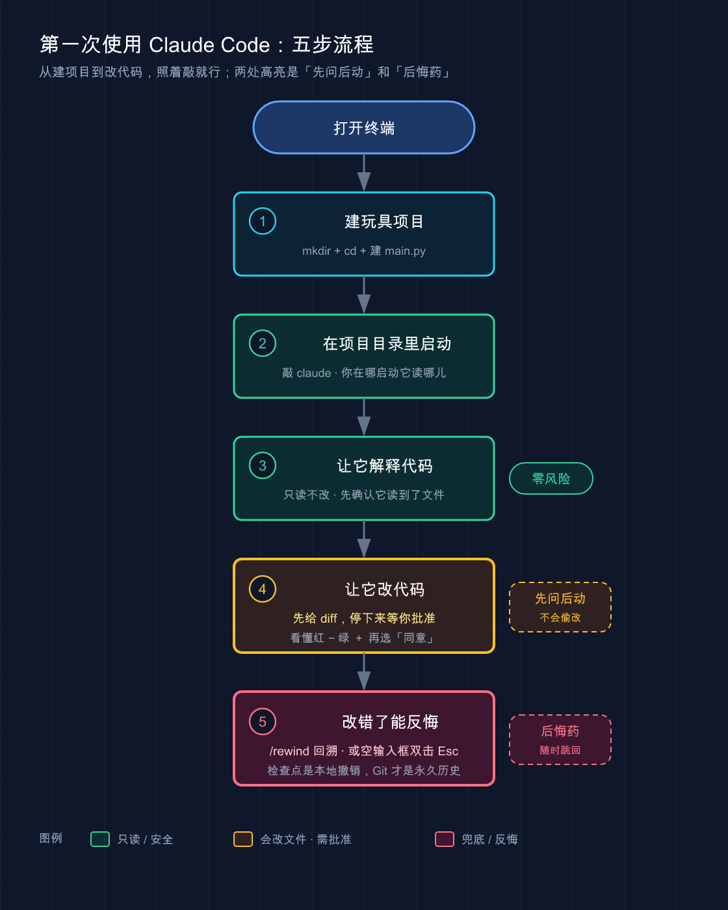

# 07 · 第一次使用：跑通第一个例子

> 📚 **系列导航**：上一篇 [06 Coding Plan：订阅套餐与计费](06-coding-plan.md) 帮你把钱的事算明白了。这一篇该真刀真枪上手了——从打开终端到跑通第一个任务，让你第一次「成功」。

兄弟们，前面几篇全是铺垫——装好了、登录了、套餐也选好了。

工具摆在那儿，但你心里大概还是有点虚：**这玩意儿到底怎么用？我打开终端，然后呢？**

说句实话，很多人第一次跑 Claude Code 的时候，盯着那个光标愣了快一分钟，不知道该敲什么。**生怕一句话说错就把代码搞砸了**。

别紧张。今天咱们就走一遍最简单的流程：建一个只有几行代码的小项目，让 Claude 先读懂它，再让它帮你改一行。**全程不超过五分钟，你会拿到人生第一次「Claude 帮我改代码并且改对了」的成功体验**。这就够了——一旦跑通一次，后面全是水到渠成。

**看完这一篇，你会拿到：**

- 一套从开终端到跑通第一个任务的完整动作流程，照着敲就行
- 看懂 Claude Code 启动后那个「欢迎屏幕」每一块是什么
- 一个跑得通、给了预期输出的 hello world 级实战
- 几个让你「第一次就不踩坑」的关键提醒（权限怎么批、改错了怎么撤）

---

## 01 先建一个「玩具项目」

先说结论：**第一次用，别拿你的正式项目练手，建个玩具项目**。

为什么？因为正式项目文件多、依赖杂，Claude 一上来读半天，你也看不清它到底干了啥。**玩具项目就两三个文件，它改了什么你一眼能看明白——这才是学习用的**。

**类比：学开车先去空场地。** 没人一拿到驾照就上高架。先找个没人的空地，熟悉油门刹车，知道方向盘打多少车拐多少。玩具项目就是你的空场地——**搞砸了也无所谓，重建一个就行**。

对完全没碰过命令行的人来说，**凡是第一次就拿公司项目练的，没有一个不慌的**——光是 Claude 读文件那几秒钟的滚屏，就够手心冒汗了。换个法子，先建个三行代码的小文件，五分钟全跑通，信心一下就有了。

打开你的终端（Mac 上是「终端 / Terminal」，Windows 上推荐用 Git Bash 或 PowerShell），敲下面这几行：

```bash
mkdir hello-claude
cd hello-claude
```

这两行的意思是：**新建一个叫 `hello-claude` 的文件夹，然后进到里面**。`mkdir` = make directory（建文件夹），`cd` = change directory（进文件夹）。

接下来建一个最简单的 Python 文件。Mac / Linux 用：

```bash
echo 'def add(a, b):
    return a + b' > main.py
```

Windows PowerShell 里 `echo` 写多行略麻烦，你可以直接用记事本新建一个 `main.py`，把下面两行贴进去存好：

```python
def add(a, b):
    return a + b
```

> 💡 **一句话总结**：第一次用 Claude Code，先建个两三行的玩具项目当「练车场」，**改砸了重建即可，心不慌手不抖**。

---

## 02 启动 Claude，看懂欢迎屏幕

项目建好了，现在在**同一个文件夹里**启动 Claude Code。确认你的终端当前就在 `hello-claude` 目录下（刚才 `cd` 进去了就还在），敲：

```bash
claude
```

**注意：一定要在项目目录里启动 `claude`，不要在桌面或者主目录裸启**。因为 Claude Code 把你**当前所在的目录当成工作区**——你在哪儿启动，它就读哪儿的文件。这是新手最常踩的第一个坑：在主目录启动，然后问「这个项目做什么」，Claude 一脸懵，因为主目录根本不是个项目。

**类比：请装修师傅上门，得先把他领到要装修的那套房子。** 你不能在小区门口跟他比划半天，他得站在屋里才知道哪面墙要砸、哪里要走线。`cd` 进项目目录再启动 `claude`，就是「把师傅领进门」。

启动后你会看到一个**欢迎屏幕**，按官方文档的说法，上面有你的会话信息、最近的对话、以及最新更新提示。对新手来说，你只需要认住三样东西：

| 你看到的 | 是什么 | 你要做什么 |
|---------|--------|-----------|
| 最底下的**输入框 / 光标** | 你跟 Claude 说话的地方 | 直接打字，敲回车发送 |
| 提示里的 `/help` | 查看所有可用命令 | 想不起命令时敲它 |
| 提示里的 `/resume` | 继续之前的某次对话 | 第一次用先不管 |

输入框就是主战场。**你不用学什么特殊语法，把它当成一个能读你代码的聊天框就对了**——用大白话提需求即可。

想确认自己进对地方了，可以先敲一句最朴素的问题：

```text
这个项目做什么？
```

Claude 会自己去读当前目录下的文件（这里就是 `main.py`），然后告诉你这是个干啥的项目。**整个过程你不用手动把文件「喂」给它**——官方文档明确写了：Claude Code 会根据需要自己读项目文件，你不必手动添加上下文。

> 💡 **一句话总结**：在项目目录里敲 `claude` 启动，认住「输入框 + `/help`」两样就够开工；**它会自己读文件，你只管用大白话提需求**。

---

## 03 让 Claude 先读懂代码

第一个真正的任务，**不是让它改代码，而是让它解释代码**。

为什么先解释？两个原因：一是**让你确认 Claude 确实读到了你的文件**（而不是在瞎编）；二是**解释类任务零风险**——它只是读和说，不会动你一个字，最适合第一次试水。

**类比：新同事入职第一天，你不会直接甩给他核心模块去重构，而是先让他「读读代码，跟我讲讲这块是干嘛的」。** 听他讲一遍，你就知道他读懂没有、靠不靠谱。让 Claude 解释代码，就是这个「入职第一天」的动作。

在输入框里敲：

```text
解释 main.py 这个文件在做什么，用新手能理解的方式说明
```

回车。Claude 会读 `main.py`，然后给你一段大白话解释，大意是：这里定义了一个 `add` 函数，接收两个参数 `a` 和 `b`，返回它们相加的结果。

**这一步跑通，意味着两件事成立了**：Claude Code 装对了、登录态正常，而且它确实在读你的真实文件。**地基稳了，下一步才敢让它动手改**。

把对 Claude Code 的指令分成三类记，你以后用起来心里就有谱了：

| 指令类型 | 干什么 | 例子 | 风险 |
|---------|--------|------|------|
| **解释型** | 让它读懂、讲给你听 | 「解释这段代码」 | 零风险，不动文件 |
| **修改型** | 让它改现有代码 | 「重构这个函数」 | 会动文件，需批准 |
| **生成型** | 让它写新东西 | 「补一个测试用例」 | 会建 / 改文件，需批准 |

> 💡 **一句话总结**：第一个任务先用「解释型」试水——**确认它读到了你的文件、地基稳了，再让它动手**。

---

## 04 让 Claude 改一行代码（关键：它会先问你）

现在到高潮了：**让 Claude 真正改一次代码**。

接着上面的会话，直接敲：

```text
给这个函数增加类型注解，并补充基本的错误处理
```

这时候**最关键的一幕来了**——Claude **不会**直接把你的文件改掉。它会：

1. 找到该改的文件（这里是 `main.py`）
2. **把它打算改成什么样，以 diff（差异对比）的形式摆给你看**
3. **停下来，等你批准**
4. 你点了「同意」，它才真正落盘

这是官方文档反复强调的一条铁律：

> Claude Code 在修改文件前**始终**请求许可。你可以批准单个更改，或为本次会话启用「全部接受」模式。

**类比：实习生动手前先问你一句。** 一个靠谱的实习生，不会未经你同意就把生产代码改了——他会拿着改好的稿子过来：「头儿，我想这么改，你看行不行？」你点头他才动。Claude Code 默认就是这种「先问后动」的实习生。

你会看到一个让你选择的提示，通常是这几个选项的意思：

| 你的选择 | 效果 | 什么时候用 |
|---------|------|-----------|
| **同意 / Yes** | 应用这一次改动 | 看懂了 diff，觉得没问题 |
| **同意，且本次会话不再问** | 之后的改动自动应用 | 你已经信任它了，想提速 |
| **拒绝 / No，并告诉它原因** | 不改，你可以补充要求 | diff 里有你不想要的东西 |

**第一次，强烈建议你老老实实选「同意」就好，别急着开「全部接受」**。说句实话，刚上手那阵子最容易图省事，一上来就把权限放到最松（后面篇章会讲的 `--dangerously-skip-permissions`，顾名思义「危险地跳过权限」），结果它在你没仔细看的情况下连改五六个文件，**等你反应过来，已经分不清哪个改动是你要的、哪个是它自作主张加的了**。教训就一条：**越是不熟，越要让它一步一停**。

看懂 diff 的小技巧：**红色 / `-` 开头的是删掉的旧行，绿色 / `+` 开头的是加上的新行**。你的 `main.py` 大概会从：

```python
def add(a, b):
    return a + b
```

变成类似这样（具体写法 Claude 可能略有不同，意思一致即可）：

```python
def add(a: float, b: float) -> float:
    if not isinstance(a, (int, float)) or not isinstance(b, (int, float)):
        raise TypeError("a 和 b 必须是数字")
    return a + b
```

加了类型注解（`a: float`），也加了基本的错误处理（传进来不是数字就报错）。**这一刻，你就完成了第一次「人机协作改代码」**。

> 💡 **一句话总结**：Claude 改文件前**永远先问你**——第一次老实选「同意」、看懂 diff 再点头，**别图快开全自动**。

---

## 05 改错了怎么办：两条「后悔药」

新手最大的恐惧就是：**万一它改错了、改乱了，我又看不出来，怎么收场？**

放心，有两条后悔药，而且很好用。

**第一条：对话里直接说「改回去」。** Claude 记得这次会话里它干过什么，你不满意，直接用大白话告诉它：

```text
刚才的改动我不满意，帮我改回原来的样子
```

它会把改动回退。**类比：跟同事说「你刚才那版不行，还按原来的来」** ——不用你自己手动一行行抠回去。

**第二条：用检查点（Checkpoint）回溯。** 这是 Claude Code 的「游戏存档」机制——它会自动记录每次文件编辑前的状态，你可以一键跳回去。

**类比：打游戏的存档读档。** 你在 Boss 战前存了档，打输了不用从头再来，读档回到存档点就行。检查点就是 Claude 在动手前帮你悄悄存的档。

怎么触发？按官方文档：

```text
/rewind
```

或者**在输入框为空时，连按两下 Esc 键**，就会弹出回溯菜单。

> ⚠️ 一个细节（官方文档明确提到）：如果输入框里**有文字**，连按两下 Esc 是清空文字、**不是**打开回溯菜单。所以要回溯，先确保输入框是空的。

还有一点要拎清楚——**检查点只能撤销 Claude 通过它的编辑工具做的文件改动，不等于 Git**。官方的建议很到位：

> 把 checkpoints 当成「本地撤销」，把 Git 当成「永久历史」。

也就是说，检查点适合「哎呀这步改坏了，跳回去」这种即时反悔；真正重要的进度，**还是得靠 Git 提交存下来**（Git 怎么用，后面专门有一篇讲）。

| 后悔药 | 怎么用 | 适合场景 | 局限 |
|--------|--------|----------|------|
| **对话里说「改回去」** | 直接打字告诉 Claude | 刚改完、就一两处不满意 | 依赖它理解你的意思 |
| **检查点 `/rewind`** | 敲 `/rewind` 或空输入框双击 Esc | 想精确跳回某个状态 | 只管 Claude 改的文件，非 Git |

> 💡 **一句话总结**：改错别慌，**一句「改回去」+ 检查点 `/rewind`** 兜底；但真正的进度，**该交给 Git 存档**。

---

## 06 动手：五分钟跑通你的第一个任务

光看不练假把式。下面把前面几节串成一条**可以照着敲、有预期输出的完整流程**。打开终端，跟着走。

**第一步：建玩具项目**（Mac / Linux）

```bash
mkdir hello-claude
cd hello-claude
echo 'def add(a, b):
    return a + b' > main.py
```

Windows 用户：`mkdir hello-claude` 和 `cd hello-claude` 照敲，`main.py` 用记事本新建并贴入那两行 Python。

**预期**：`hello-claude` 文件夹里有一个 `main.py`，内容是 `add` 函数那两行。可以敲 `ls`（Windows 用 `dir`）确认文件在。

**第二步：启动 Claude Code**

```bash
claude
```

**预期**：出现欢迎屏幕，底部有输入框和光标。如果提示你登录，说明前面的登录步骤没完成，回去把第 02 篇的登录走一遍。

**第三步：让它解释代码**

在输入框里敲：

```text
解释 main.py 这个文件在做什么，用新手能理解的方式说明
```

**预期**：Claude 读取 `main.py`，用大白话告诉你这是个「把两个数相加」的函数。**看到它准确说出了 `add` 函数的作用 = 成功**。

**第四步：让它改代码，并批准**

```text
给这个函数增加类型注解，并补充基本的错误处理
```

**预期**：Claude 给出一段 diff（红 `-` 旧行、绿 `+` 新行），然后停下来等你选。**看懂后选「同意 / Yes」**。

**第五步：确认改动落地**

退出 Claude（敲 `exit` 或按 `Ctrl+D`），回到终端看文件：

```bash
cat main.py
```

（Windows PowerShell 用 `type main.py`）

**预期**：`main.py` 里出现了类型注解（像 `a: float`）和错误处理（`raise TypeError(...)`）。**和你刚才批准的 diff 对得上 = 全流程跑通，恭喜！**

> ⚠️ 万一卡在权限报错（Mac / Linux 上看到 `Error: EACCES: permission denied` 这类），具体修法因场景不同，后面「常见问题」篇会细讲，这里先知道有这么个坑。

> 💡 **一句话总结**：照着五步走一遍，**跑通比读懂更重要**——拿到第一次「Claude 帮我改对了」的成功体验，后面就水到渠成。

---

## 07 小结

这一篇你干了一件事：**完整跑通了 Claude Code 的第一个任务——从建项目、启动、解释代码，到改代码并批准**。

把核心动作串起来回顾一遍：

| 步骤 | 动作 | 关键点 |
|------|------|--------|
| 建项目 | `mkdir` + `cd` + 建文件 | 先用玩具项目练手 |
| 启动 | 在**项目目录里**敲 `claude` | 你在哪启动，它读哪儿 |
| 解释 | 「解释 xxx 文件」 | 零风险，先确认它读到了文件 |
| 修改 | 用大白话提需求 | 它**先给 diff、等你批准**才动手 |
| 反悔 | 「改回去」/ `/rewind` | 检查点是本地撤销，Git 才是永久历史 |

**你现在应该能：** 打开终端、在正确的目录启动 Claude、用自然语言让它读懂并修改一段代码，看懂它给的 diff，知道改错了怎么退回去。**这套动作，就是你之后所有 Claude Code 使用的最小内核**——后面再花哨的功能，本质都是在这个「提需求 → 看 diff → 批准 / 反悔」的循环上做加法。

---

下一篇 **08「VS Code 集成」**——命令行跑通了，但你可能更习惯在编辑器里写代码、看 diff 看得更清楚。下一篇就教你把 Claude Code 装进 VS Code，让它和你的代码并排坐着干活。



这张图把本篇五步串成一条竖向流程：建玩具项目 → 在项目目录里启动 `claude` → 让它解释代码（绿色·只读零风险）→ 让它改代码（琥珀色高亮·先给 diff 等你批准，即「先问后动」）→ 改错了用 `/rewind` 回溯（玫红色高亮·兜底「后悔药」），两处高亮正是新手最该记住的安全护栏。
