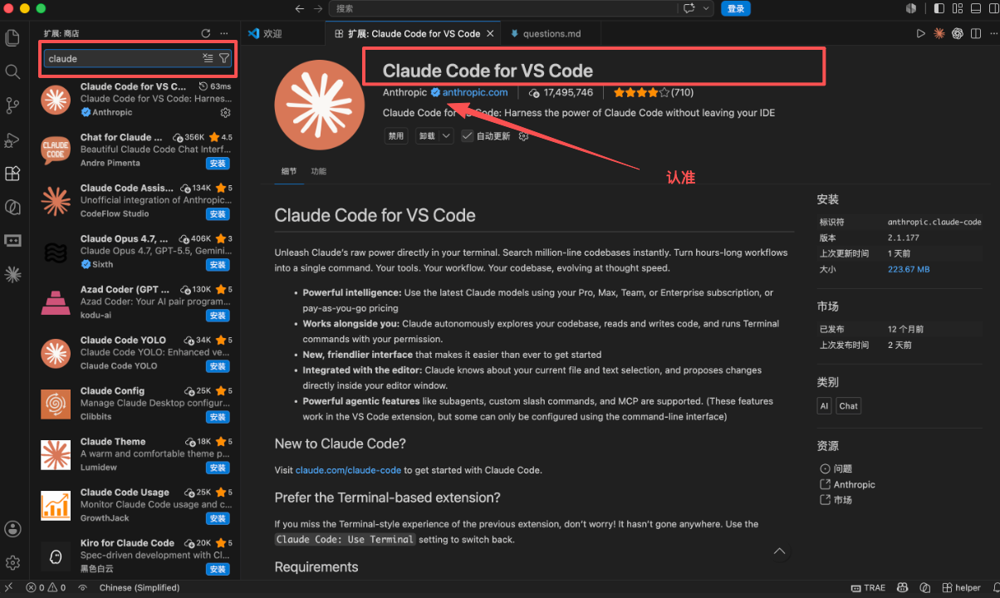
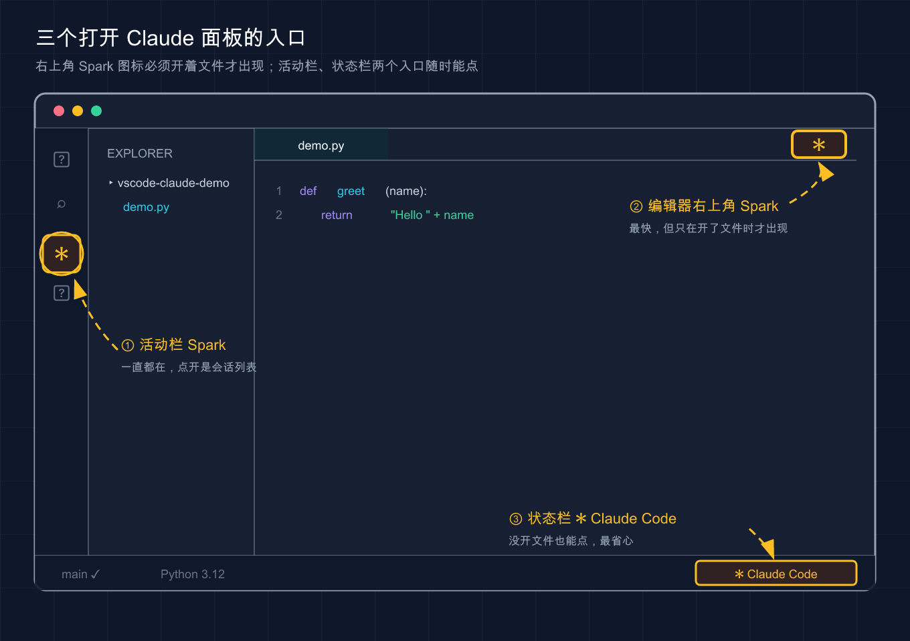
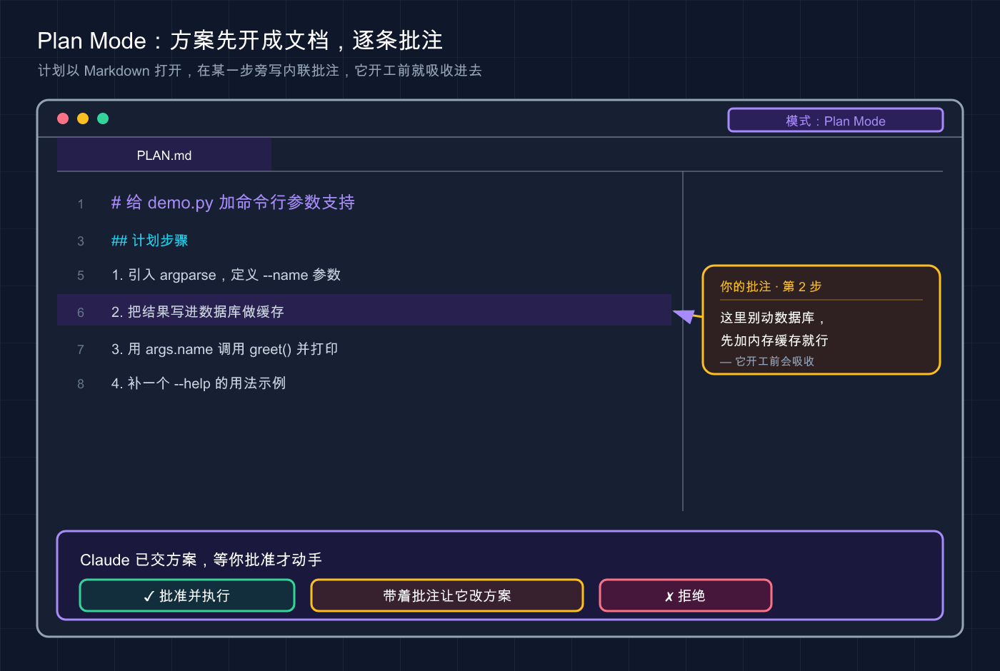

# 08 · VS Code 集成

> 📚 **系列导航**：上一篇 [07 第一次使用](./07-first-run.md) 带你在终端跑通了第一个例子。这一篇把 Claude Code 搬进 VS Code——同样的能力，换成有图形界面的玩法。

刚转去用 VS Code 扩展那阵子，很容易干一件挺蠢的事。

终端里跑得好好的 Claude Code，装完扩展想试试图形界面，打开一个空文件夹，左翻右翻就是找不到官方说的那个「Spark 图标」（工具栏里的火花形图标，Claude Code 在 IDE 里的入口标识）。这时候很容易以为装坏了，卸了重装、重启、清缓存，折腾了快二十分钟，最后翻文档才发现——**那个图标只在你打开了具体文件时才出现，光开文件夹不够**。对着一个空工作区找图标，找一辈子也找不到。

说白了，VS Code 集成不难，但它跟终端是两套交互逻辑，**有些「想当然」会让你卡在最开始那一步**。这篇把这些坑提前给你标出来。

**看完这一篇，你会拿到：**

- 在 VS Code（含 Cursor 等分支）装上 Claude Code 扩展的完整步骤，外加「图标找不到」的排查清单
- 并排 diff（逐行审阅改动）、`@` 提及、计划审阅这三个图形界面独有的爽点怎么用
- 一张「扩展 vs CLI 该用哪个」的对照表，外加一组常用快捷键

---

## 01 先搞清楚：扩展和 CLI 是什么关系

「我已经会用终端里的 `claude` 了，还要不要装扩展？」先给结论：**扩展不是替代 CLI，是在它外面套了一层图形界面**。装扩展时会顺带把 CLI 带上，两者共享同一份 `~/.claude/settings.json` 配置；对话历史可以恢复，但不是实时同步——你在扩展里聊到一半，回头在终端跑 `claude --resume` 就能主动接续那段对话。

**类比：同一个后厨，两个点单窗口。** CLI 是趴在厨房窗口喊单——快、全、什么都能点；扩展是大堂服务员，帮你把菜单做得图文并茂、点单看进度更直观，但有几样「隐藏菜单」只有趴窗口才点得到。**后厨是同一个，菜一模一样。**

到底什么时候用哪个？官方给了张能力对照，整理如下：

| 功能 | CLI（终端） | VS Code 扩展 |
|------|-----------|-------------|
| 命令和 skills | 全部 | 子集（输入 `/` 看可用的） |
| MCP server 配置 | 完整 | 部分（用 CLI 加、面板里 `/mcp` 管） |
| Checkpoints（检查点） | 支持 | 支持 |
| `!` bash 快捷键 | 支持 | 不支持 |
| Tab 补全 | 支持 | 不支持 |
| 并排 diff、选中代码即上下文 | 需连接 IDE | 原生，开箱即用 |

一句话：**写代码、审阅改动这类「跟文件打交道」的活，扩展明显更好用**；`!ls` 这种 bash 快捷键、Tab 补全只有 CLI 有。一般的用法是**主力开在扩展里**，要批量跑命令或用扩展里没有的命令，就在集成终端直接敲 `claude`——历史是通的，无缝切换。

> 💡 一句话总结：扩展和 CLI 是同一个引擎的两张脸，**共享历史和配置，按手头的活随时切换，不用二选一**。

---

## 02 安装：三种姿势，外加图标找不到的排查

### 装之前先看一眼版本

官方硬性要求：**VS Code 1.98.0 或更高版本**，低于这个版本装不上或不工作（点「帮助 → 关于」看版本号）。**首次打开扩展时会让你登录 Anthropic 账户**；公司走 Bedrock、Vertex AI 等第三方提供商的，配置方式不同，末尾单独提。

### 三种安装方式

**方式一：应用市场搜（最稳，推荐新手用）**

在 VS Code 里按 `Cmd+Shift+X`（Mac）或 `Ctrl+Shift+X`（Windows/Linux）打开扩展视图，搜索 `Claude Code`，点**安装**。



上图是扩展视图里搜 `Claude Code` 的样子：红框那条「Claude Code for VS Code」、发布者带蓝色认证勾的 **Anthropic** 才是官方，认准它点进去装。

这里有个**小白最容易踩的坑**：搜 `Claude Code` 会跳出一堆名字相似的扩展，认准发布者是 **Anthropic** 的那个，别装成第三方仿冒的。

**方式二：点链接直装**

开着 VS Code 时，点链接 `vscode:extension/anthropic.claude-code` 会直接跳到扩展安装页（Cursor 把 `vscode:` 换成 `cursor:`）。

**方式三：非主流编辑器 / 装不上时**

扩展也能装在 VS Code 的其他分支里（Cursor、Devin Desktop、Kiro 等）——在它们的扩展视图搜 `Claude Code`，或从 [Open VSX 注册表](https://open-vsx.org/extension/Anthropic/claude-code) 装。万一死活装不上，别死磕，**官方兜底方案是在集成终端直接跑 `claude`**。

> 国内提示：安装、登录授权、之后让 Claude 干活都要连 Anthropic 服务，**全程需要魔法上网**，和终端版一致。

### 装完图标找不到？照这张清单排查

这就是开头那个坑。装好后扩展默认不弹窗，得自己把面板叫出来。**最快的方式：先打开一个具体文件，再点编辑器右上角工具栏里的 Spark 图标**（一个像火花的小图标）。



上图把三个入口的位置都标了出来：编辑器右上角的 Spark 图标（②，最快但只在开着文件时才出现）、活动栏的 Spark（①，一直都在）、状态栏的 ✱ Claude Code（③，没开文件也能点）。

**关键就一句：Spark 图标只在你打开了文件时才出现，光开文件夹不够。** 如果还是看不到，按官方这个顺序查：

| 现象 | 排查动作 |
|------|---------|
| 编辑器右上角没图标 | 先打开一个文件（不是只开文件夹） |
| 打开文件了还是没有 | 确认 VS Code ≥ 1.98.0（帮助 → 关于） |
| 版本也够 | 命令面板跑 `Developer: Reload Window` 重载窗口 |
| 重载也没用 | 临时禁用其他 AI 扩展（Cline、Continue 等），可能冲突 |
| 工作区是「受限模式」 | 扩展在受限模式下不工作，需信任工作区 |

实在找不到 Spark 图标，还有两个备选入口：

- **活动栏**（最左侧那竖排图标）里的 Spark 图标——**这个一直都在**，点开是会话列表。
- **状态栏**（窗口右下角）的 **✱ Claude Code**——**没开文件也能点**，平时更顺手的就是这个，省得纠结有没有开文件。也可以走命令面板（`Cmd+Shift+P` / `Ctrl+Shift+P`）输入 `Claude Code`。

第一次点开面板会出现登录屏，点**登录**、在浏览器完成授权即可。（如果设了 `ANTHROPIC_API_KEY` 却还被要求登录，多半是 VS Code 没继承到终端环境变量，官方解法是从终端用 `code .` 启动 VS Code 把变量带进去。）

> 💡 一句话总结：装扩展认准 Anthropic 发布者，**Spark 图标必须开着文件才出现**——找不到先开文件，再不行就用右下角状态栏那个入口。

---

## 03 diff 视图：改动当面对质，看清了再点头

这是很多人最早被扩展圈粉的功能。终端版改文件时 diff 是文本符号画的，文件一大、改动一多就看着吃力。**扩展把这事搬进了 VS Code 原生的 diff 视图**——红绿高亮标增删，跟你平时看 Git diff 一个观感。

**类比：合同签字前的「修订模式」对照。** 对方把改好的合同发回来，左边原稿、右边改动版，每处增删都标得清清楚楚——你不是闭眼签字，是**逐条看过才落笔**。Claude 改代码也一样，把改动摆出来请求许可，你有三个选择：**接受、拒绝、或直接告诉它改成别的样子**。

还有个容易被忽略、用了一阵子才会注意到的细节：**接受之前可以直接在 diff 视图里手动改 Claude 的建议**，改完它会知道「你动过了」，不再按旧版往下走。比如让它重构一个 200 多行的函数，它一口气改了七八处，要是在 diff 里一眼扫到一处把边界判断写反了，**当场在右侧改对再接受**，就省了一轮来回。

> 💡 一句话总结：diff 视图把每处改动摆到你面前，**看清、能当场改、再决定接不接受**，比终端的文本 diff 安全得多。

---

## 04 `@` 提及和选中代码：把上下文喂准

让 Claude 干活最大的浪费，是它「不知道你说的是哪段代码」于是绕圈子猜。**扩展里有两招把上下文喂得又快又准。**

### 第一招：`@` 提及文件 / 文件夹

在提示框里输入 `@`，跟上文件名或文件夹名，Claude 就会去读那份内容。它支持**模糊匹配**，不用打全名：

```text
> 解释一下 @auth 的逻辑（会自动匹配 auth.js、AuthService.ts 等）
> @src/components/ 里有什么？（文件夹记得加结尾的斜杠 / ）
```

**类比：开会前先把资料甩进群。** 与其口头描述「就那个登录相关的文件」，不如直接 `@` 把文件丢给它，省得它满项目翻找、翻错。对超大 PDF 还能让它**只读指定页**（如第 1-10 页），不用啃完整本。

### 第二招：选中代码，它自动看见

这招比 `@` 还省事：**直接在编辑器里选中一段代码，Claude 就自动看到了**，提示框下方会显示「已选中 XX 行」。你直接问「这段为什么会报错」，它就知道你指哪段。

几个常用配套技巧：

- **插带行号的引用**：按 `Option+K` / `Alt+K`，自动插入像 `@app.ts#5-10` 这样带路径和行号的提及（需编辑器焦点）。
- **临时不让它看选中**：点提示框底部「选择指示器」切换，**出现「斜杠眼睛」图标就表示这段对 Claude 隐藏了**——选中只是想复制时用得上。
- **拖文件当附件**：拖文件到提示框时**按住 `Shift`**；点附件上的 `×` 移除。

比如排查一个样式 bug，CSS 嵌套了五六层。直接选中那段可疑规则丢一句「这里为什么不生效」，**它两轮就定位到是父元素的 `overflow: hidden` 把子元素裁了**——光用文字描述那段嵌套，得打半天字。

> ⚠️ 选中文本和当前打开的文件默认会随提示发给 Claude。**像 `.env` 这种敏感文件，官方建议给路径加一条 `Read` 拒绝规则**，匹配上后它就不会到达 Claude（以官方文档为准）。

> 💡 一句话总结：`@` 提及喂文件、选中代码自动喂上下文——**把「你说的是哪段」这个最大的猜测成本直接干掉**。

---

## 05 计划审阅：让它先交方案，你批了再动手

这一节大概是**扩展相比终端体验提升最大的地方**。先说权限模式：点提示框底部的**模式指示器**可以切换，Claude Code 有这么几档：

| 模式 | Claude 的行为 | 什么时候用 |
|------|--------------|-----------|
| **正常模式**（默认） | 每个操作前都问你同不同意 | 不熟的任务、想全程把关 |
| **Plan Mode（计划模式）** | 先描述打算怎么做，等你批准才动手 | 大改动、多文件、想先看方案 |
| **自动接受模式** | 直接改，不再逐个询问 | 信得过的小批量重复改动 |

> 还有第四档 `bypassPermissions`（绕过所有权限检查），需在设置里开启 `allowDangerouslySkipPermissions`，仅适用于完全隔离的沙箱环境，日常不推荐开。

**类比：实习生动手前问不问你。** 正常模式是「每步先举手问」、自动接受是「放手让他干」——而计划模式最特别，**像实习生先交一份「我打算这么做」给你过目，你点头了才开干**。

计划模式在 VS Code 里有个终端给不了的待遇：**Claude 会把计划自动作为一份完整的 Markdown 文档打开，你能在上面加内联批注**。不用笼统回一句「第二步不对」，而是直接在「第二步」那行旁边写「这里别动数据库，先加缓存」，它开工前就把你的意见吸收进去——比口头返工精确得多。



上图是计划模式打开的 Markdown 计划文档：Claude 把每一步列出来，你在「第 2 步」那行旁边写下内联批注（「别动数据库，先加内存缓存」），它批准开工前就把这条意见吸收进去。

想让它成默认？把设置里的 `claudeCode.initialPermissionMode` 改成 `plan`。一个稳妥的习惯是**凡是「多文件、超过 50 行」的改动，先切计划模式**。这里有个常见教训：图省事全程开自动接受，让它给一个模块加日志，它可能顺手把好几个文件的导入顺序也「优化」了一遍，回头得花十分钟才理清它动了哪些地方。**大改动一律先看计划，在方案阶段就框住它，比事后收拾干净得多。**

> 💡 一句话总结：计划模式 = 先看方案再动手，**还能在 Markdown 计划上逐条批注**——多文件大改动前切它，省下大把返工。

---

## 06 动手环节：10 分钟跑通图形界面全流程

下面从零走一遍，每步都给了「你该看到什么」，照着做就能自验装没装对、会不会用。

**第 0 步：建个最小练手项目**

不用真项目，新建个空文件夹放个文件就行。终端跑：

```bash
mkdir vscode-claude-demo && cd vscode-claude-demo
printf 'def greet(name):\n    return "Hello " + name\n\nprint(greet("world"))\n' > demo.py
code .
```

**预期**：VS Code 打开这个文件夹，左侧资源管理器里能看到 `demo.py`。（没装 `code` 命令行工具就手动打开这个文件夹。）

**第 1 步：打开 Claude 面板并登录**

点开 `demo.py`（**记住，一定要打开文件**），点右上角 Spark 图标，首次出现登录屏就点**登录**、在浏览器完成授权。

**预期**：右侧出现 Claude Code 对话面板，顶部不再显示「未登录」。

**第 2 步：选中代码 + 让它改，看内联 diff**

选中 `demo.py` 里 `greet` 函数那两行，提示框下方应显示「已选中 2 行」。这时输入：

```text
帮我把它改成用 f-string，并加上类型注解
```

**预期**：Claude 没问你「哪个函数」（说明选中上下文喂进去了），直接弹出并排 diff——右边把 `return "Hello " + name` 改成 `return f"Hello {name}"`、签名加了类型注解，下方出现**接受 / 拒绝**提示。看清再点接受。

**第 3 步：试一次计划模式**

点提示框底部的模式指示器切到 **Plan Mode**，输入一个稍大的需求：

```text
给这个文件加上命令行参数支持，让用户能从终端传入名字
```

**预期**：Claude 不直接改文件，先打开一份 Markdown 计划文档列出打算怎么做（比如引入 `argparse`）。你确认或在某步旁边写批注，它再执行。跑到这步，**内联 diff、选中提及、计划审阅三个核心你就都用过一遍了**。

---

## 07 顺手收藏：常用快捷键和「切到 CLI」

**一组常用快捷键**（来自官方，平台差异已标）：

| 操作 | 快捷键 | 说明 |
|------|--------|------|
| 切换焦点（编辑器 ↔ Claude） | `Cmd+Esc` / `Ctrl+Esc` | 光标在哪个面板，快捷键就作用在哪 |
| 在新选项卡打开对话 | `Cmd+Shift+Esc` / `Ctrl+Shift+Esc` | 多开几个对话并行干活 |
| 插入 `@` 提及引用 | `Option+K` / `Alt+K` | 需编辑器获得焦点 |
| 重新打开刚关掉的会话 | `Cmd+Shift+T` / `Ctrl+Shift+T` | 默认开启 |
| 开始新对话 | `Cmd+N` / `Ctrl+N` | **默认关闭**，需在设置里开 `enableNewConversationShortcut` |

> macOS Tahoe+ 有个坑：系统「游戏覆盖」默认占用了 `Cmd+Esc`，会把它截胡。去「系统设置 → 键盘 → 键盘快捷键 → 游戏控制器」清掉那个勾，或把 `Claude Code: Focus input` 重新绑到别的键。

**想用回 CLI 风格界面？** 打开集成终端（`` Cmd+` `` / `` Ctrl+` ``）跑 `claude` 即可——**CLI 会自动连上 VS Code**，照样能用原生 diff（外部终端则跑 `/ide` 手动连）；或在设置勾上 **使用终端**（`useTerminal`）让扩展直接以终端模式启动。

> 第三方提供商（Bedrock / Vertex AI / Foundry）：先勾 **禁用登录提示**（`disableLoginPrompt`），再按提供商指南配 `~/.claude/settings.json`（以官方文档为准）。

> 💡 一句话总结：`Cmd+Esc` 切焦点最常用、`Option+K` 插引用，**想回终端味就跑 `claude` 或勾 `useTerminal`**——图形和命令行随你换。

---

## 08 小结

这一篇把 Claude Code 从终端搬进了 VS Code，核心就这几件事：

- **扩展 ≠ 替代 CLI**：同一个引擎、共享历史和配置，写代码用扩展、要 CLI 专属功能就切终端。
- **装好的第一关是找图标**：认准 Anthropic 发布者，**Spark 图标得开着文件才出现**，找不到就用右下角状态栏入口。
- **三个图形界面爽点**：并排 diff（看清再点头、能当场改）、`@` 提及 / 选中代码（喂准上下文）、计划审阅（先看方案、能逐条批注）。

你现在应该能独立装好扩展、用并排 diff 审阅改动、用 `@` 和选中喂准上下文、大改动前切计划模式。**这套流程跑顺了，日常写代码就能稳定靠它。**

---

下一篇 **09 JetBrains 集成**——如果你的主力是 IntelliJ IDEA、PyCharm 这类 JetBrains 全家桶，Claude Code 同样有原生插件。我们会看看它和 VS Code 扩展有哪些一样、哪些不一样，以及 JetBrains 用户特有的几个配置点。
