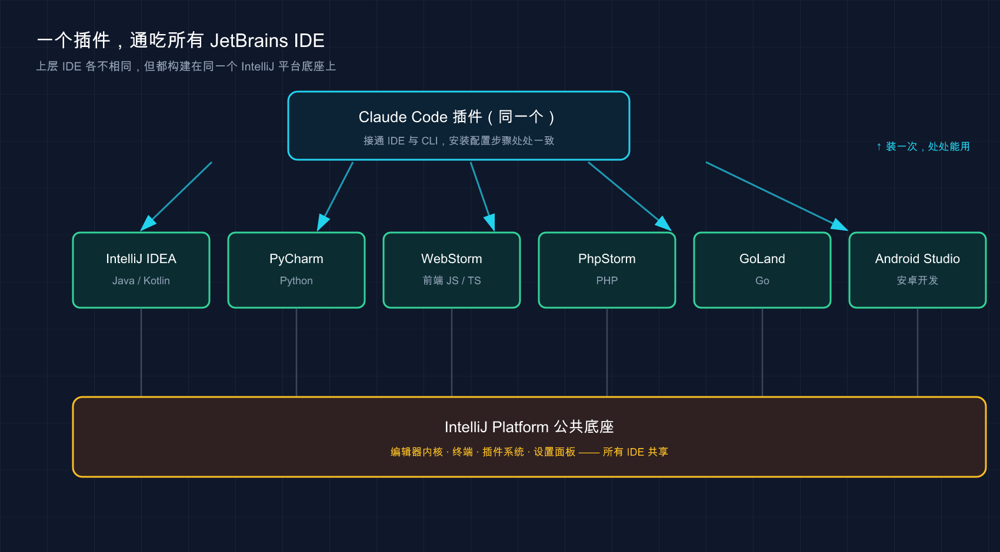

# 09 · JetBrains 集成

> 📚 **系列导航**：上一篇 [08 VS Code 集成](./08-vscode.md) 把 Claude Code 搬进了 VS Code。这一篇换个阵营——如果你的主力是 IntelliJ IDEA、PyCharm、WebStorm 这类 JetBrains 全家桶，同样有原生插件，玩法既像又不像。下一篇 [10 桌面 app](./10-desktop.md)。

A：「我天天泡在 PyCharm 里，VS Code 那套扩展跟我没关系吧？」

B：「有原生插件，装一下，`Cmd+Esc` 就能从编辑器里把 Claude 叫出来。」

A：「那它跟 VS Code 扩展是一回事？diff、`@` 提及那些都有？」

B：「内核是同一个 CLI，但**界面不是同一拨人做的**——有些地方一样，有些地方你得换个姿势。比如它默认是跑在 IDE 自带终端里的，不是一个独立面板。」

这是用 GoLand 写后端的人常有的疑问，很典型：**JetBrains 用户总担心自己是「二等公民」**，好东西都先给 VS Code。

说句实话，这担心一半对一半不对。对的地方：JetBrains 插件确实比 VS Code 扩展**更轻**，它是把 CLI 跟 IDE 接通、让信息在两边流动，而不是做一个大而全的图形面板。不对的地方：**该有的核心体验一个没少**。

这一篇就讲清楚：**怎么装、怎么连、和 VS Code 比差在哪、JetBrains 专属的几个坑（ESC 键、WSL、远程开发）怎么填**。

**看完这一篇，你会拿到：**

- 在 IntelliJ / PyCharm / WebStorm 等 JetBrains IDE 里装好 Claude Code 插件的完整步骤
- 「IDE 内置终端」和「外部终端 `/ide`」两种连接方式，分别什么时候用
- 一张「JetBrains 插件 vs VS Code 扩展」的对照表，外加 JetBrains 专属快捷键
- ESC 键中断失灵、WSL2「检测不到 IDE」、远程开发这三个高频坑的官方解法

---

## 01 先理清楚：插件到底做了什么

很多人装完插件一脸懵：**「我装了插件，怎么没看到一个像 VS Code 那样的聊天面板？」**

先给结论：**JetBrains 插件不是一个独立的聊天窗口，它是一座「桥」**。Claude Code 本体还是那个跑在终端里的 CLI，插件干的活是把 IDE 和 CLI 接通——你在编辑器里选中的代码、IDE 报的 lint 错误、Claude 想做的改动，能在「IDE」和「终端里的 Claude」之间自动来回传。

**类比：手机和电脑之间的隔空投送（AirDrop）。** 文件、剪贴板本来各待各的设备上，开了隔空投送两台设备就「认识」了——电脑上复制，手机上直接粘。插件就是 IDE 和 Claude 之间的这条通道：**你在 PyCharm 里选中一段代码，终端里的 Claude 立刻就「看见」了**，不用复制粘贴。

所以有个关键认知：

> **在 JetBrains 里，你跟 Claude 对话的地方，是 IDE 自带的集成终端**——不是一个新开的侧边面板。

这是和 VS Code 最大的体感差异：VS Code 扩展给你一个图形对话面板；JetBrains 则让你在内置终端里跑 `claude`，插件在背后喂上下文。**对话在终端、diff 弹到 IDE 原生查看器**，两边好处都占着，而且几乎零学习成本——**命令、快捷键、`/` 斜杠命令全是终端那一套**。第一次在 IntelliJ 装插件，本来还会担心要重新适应界面，结果发现**就是熟悉的那个终端 Claude，只是它突然「长了眼睛」，能看到你选了什么、IDE 标红了哪里**。

> 💡 一句话总结：JetBrains 插件是 IDE 和 CLI 之间的「隔空投送」，**对话在内置终端里发生、diff 弹进 IDE**，不是一个独立聊天面板。

---

## 02 支持哪些 IDE，先对个号

JetBrains 是一整个家族，不是单个软件。**好消息是：Claude Code 插件覆盖了主流的几乎全部**。

官方明确列出的支持名单：

| IDE | 主要语言 / 场景 |
|------|----------------|
| **IntelliJ IDEA** | Java / Kotlin，后端、Android 老本行 |
| **PyCharm** | Python，数据、AI、脚本 |
| **WebStorm** | 前端 JS / TS |
| **PhpStorm** | PHP |
| **GoLand** | Go |
| **Android Studio** | 安卓开发（基于 IntelliJ） |

官方说法是「**适用于大多数** JetBrains IDE」——名单外的 JetBrains IDE（RubyMine、CLion、Rider 等）大概率也能用，但官方没背书，能装上就用、出问题以「未明确支持」对待。

**类比：同一品牌的不同车型，共用一套车机系统。** IntelliJ、PyCharm、WebStorm 就像同厂家的轿车、SUV、跑车，定位不同但**底层是同一个平台**（都构建在 IntelliJ Platform 上）。所以一个插件通吃，**这篇里所有操作步骤，不管你用 IntelliJ 还是 GoLand，菜单路径都一致**。下面演示用 PyCharm。



上图把这层关系画清楚了：最上面的 Claude Code 插件只有一个，向下扇出适配每个 IDE；而 IntelliJ IDEA、PyCharm、WebStorm 等虽各管一门语言，却都坐在同一个 IntelliJ Platform 底座上——所以一个插件装一次，处处能用，安装配置步骤也处处一致。

> 💡 一句话总结：主流 JetBrains IDE 都支持，**它们共用同一个 IntelliJ 平台底座**——安装和配置步骤在哪个 IDE 里都一模一样。

---

## 03 安装：插件 + CLI，缺一不可

这步最容易出岔子，因为 **JetBrains 集成需要两样东西都到位**：插件，和 Claude Code CLI 本体，少哪个都不行。

**类比：手机 App + 后台账号。** 装了 App（插件）却没注册后台账号（CLI），打开就是个空壳——插件负责界面集成，真正干活的「后台」是 CLI。**所以装插件前先确认 CLI 在。**

### 第一步：先确认 CLI 装好了

跟着这个系列从头读的话，第 02 篇就装好 CLI 了。不确定就在任意终端跑：

```bash
claude --version
```

**预期输出**：打印出一串版本号，类似 `2.x.x (Claude Code)`。

如果提示 `command not found`，说明 CLI 还没装。回到 [02 安装](./02-install.md) 那篇装一下，或者用官方安装命令（分平台）：

```bash
# macOS / Linux / WSL
curl -fsSL https://claude.ai/install.sh | bash

# Windows PowerShell
irm https://claude.ai/install.ps1 | iex
```

> 国内提示：安装 CLI、之后的登录授权、以及让 Claude 干活，**全程都要连 Anthropic 的服务，需要魔法上网**。这点和终端版、VS Code 版都一致。

### 第二步：装 JetBrains 插件

两条路都能走，推荐第一条。

**方式一：IDE 里搜（推荐）**

1. 打开你的 JetBrains IDE
2. 进 **Settings（设置）→ Plugins（插件）**（Mac 快捷键 `Cmd+,`，Windows/Linux `Ctrl+Alt+S`）
3. 切到 **Marketplace（市场）** 标签
4. 搜索 **Claude Code**
5. 点 **Install（安装）**
6. **装完务必重启 IDE**

**方式二：去插件市场官网装**

直接访问 [JetBrains 插件市场的 Claude Code 页面](https://plugins.jetbrains.com/plugin/27310-claude-code-beta-)，按页面指引安装。

注意插件名带 **\[Beta]** 后缀——**说明它还在 Beta 阶段，行为可能随版本变化**（以官方文档为准）。功能能用，但别当板上钉钉的稳定版。

### 第三步：重启 IDE（别跳过）

官方专门强调了一句：

> **安装插件后，你可能需要完全重启 IDE 才能让它生效。**

「完全重启」是彻底退出再打开，不是关个窗口。这个坑很容易栽进去——装完在 IDE 里跑 `claude`，集成功能死活不激活，以为插件坏了；**彻底退出 IntelliJ 重开，一切正常**。这坑官方也列在「插件不工作」排查第一条，足见多常见。

| ❌ 容易踩的坑 | ✅ 正确做法 |
|--------------|-----------|
| 只装插件、没装 CLI | 先 `claude --version` 确认 CLI 在 |
| 装完不重启就用 | 装完**完全退出 IDE 再重开** |
| 搜到相似插件随便装 | 认准官方的 **Claude Code \[Beta]** |
| 重启关窗口了事 | 「完全重启」= 彻底退出进程再启动 |

> 💡 一句话总结：JetBrains 集成 = **CLI 本体 + 插件**，两样都要装；**装完一定完全重启 IDE**，这是最高频的「装了不生效」原因。

---

## 04 连接：两种姿势，看你从哪启动

插件装好、IDE 重启完，下一步是把 Claude Code 跟 IDE「连上」。**连上后，选区共享、diff 弹进 IDE、诊断共享才会激活。** 连接方式取决于你**从哪里启动 Claude**。

### 姿势一：从 IDE 内置终端启动（推荐，自动连）

最省事。打开 IDE 自带的集成终端（一般在底部，有个 **Terminal** 标签页），直接跑：

```bash
claude
```

**预期**：Claude Code 启动，**所有集成功能自动激活**，不用任何手动连接动作。因为你在 IDE 的「肚子里」启动，插件天然知道该跟哪个 IDE 接通。

**类比：在自家客厅连 Wi-Fi。** 在家里打开手机自动连上，不用输密码。内置终端启动 Claude 就是这体验——**环境对了，连接自动完成**。

### 姿势二：从外部终端启动，用 `/ide` 手动连

如果你习惯用 iTerm、Windows Terminal 这类**独立终端**，那就先启动 Claude，再手动接通：

```bash
claude
```

然后在 Claude 对话里输入：

```text
/ide
```

**预期**：Claude 列出检测到的 JetBrains IDE，选中对应的那个，连接建立、功能激活。**类比：在别人家连 Wi-Fi**，得手动选网络——`/ide` 就是这个动作。

### 一个容易忽略的前提：从项目根目录启动

不管哪种姿势，官方都强调：

> **如果你希望 Claude 能访问和 IDE 相同的文件，请从与 IDE 项目根目录相同的目录启动 Claude Code。**

说白了：**IDE 打开的是哪个项目，就在那个项目的根目录下启动 `claude`**。在 `~/Downloads` 这种目录启动，Claude 看到的文件就和 IDE 里的项目对不上号了。用内置终端启动天然满足这点——这也是**推荐姿势一**的另一个原因。

| 启动来源 | 连接方式 | 项目目录 |
|---------|---------|---------|
| **IDE 内置终端** | 自动激活，无需操作 | 默认就在项目根目录 ✅ |
| **外部终端**（iTerm 等） | 手动跑 `/ide` 选 IDE | 需自己 `cd` 到项目根目录 |

一般**全程用 IDE 内置终端**就够了——连接自动完成、目录天然对齐、终端和代码同窗口，`Cmd+Esc` 一按就在两者间跳。除非手头已经开着外部终端在跑别的，才用 `/ide` 临时接一下。

> 💡 一句话总结：IDE 内置终端启动 = **自动连、目录天然对齐**（推荐）；外部终端启动 = **跑 `/ide` 手动连**。无论哪种，都从项目根目录启动。

---

## 05 它能干什么：五个集成功能

连上之后，插件给的「增益」官方列了五个，逐一说，重点看和 VS Code 的差异，汇总看本节末的对照表。

- **① 快速启动**：编辑器里按 `Cmd+Esc`（Mac）/ `Ctrl+Esc`（Windows/Linux）直接打开 Claude，也可点 UI 里的按钮。**这个用得最勤**——写着代码想问一句，不用鼠标点终端标签，一个快捷键焦点就过去了。
- **② 选区上下文共享**：**IDE 里当前选中的代码、或打开的标签页，自动共享给 Claude**。选中一段问「这段为什么报错」，它知道你指哪段。
- **③ 文件引用快捷键**：按 `Cmd+Option+K`（Mac）/ `Alt+Ctrl+K`（Linux/Windows）插入一条文件引用，形如 `@src/auth.ts#L1-99`，**带路径和行号**，让 Claude 精确定位。
- **④ Diff 查看**：代码改动**直接在 IDE 的 diff 查看器里展示**，而非终端里用文本符号画（默认不一定开，得设 `auto`，下节讲）。
- **⑤ 诊断共享**：IDE 的 lint 警告、语法错误那些红线黄线，**自动共享给 Claude**，它能直接「看到」标红了哪里，不用你复述报错。

两个安全 / 易错点单独拎出来：

> ⚠️ **安全**（和 VS Code 一致）：如果文件命中你设的 [`Read` 拒绝规则](./20-permissions.md)，它的选区共享会被拦住、不发给 Claude（以官方文档为准）。`.env` 这类敏感文件建议加上。
>
> ⚠️ **易错**：文件引用快捷键和 VS Code 不一样——VS Code 是 `Option+K` / `Alt+K`，JetBrains 多一个键，是 `Cmd+Option+K` / `Alt+Ctrl+K`，从 VS Code 切过来最容易按错。

诊断共享这点体会最深。JetBrains 的代码检查本就是业界最强之一——搁以前得把标红的报错复制给终端 Claude，现在它直接读得到。**比如 PyCharm 标了一个「未使用的导入」加几个类型不匹配的黄线，只说一句「把 IDE 标出来的问题修一下」，它就照着诊断一条条修了**，不用你贴一行报错。

| 集成功能 | JetBrains | VS Code | 备注 |
|---------|-----------|---------|------|
| 快速启动 | `Cmd/Ctrl+Esc` | `Cmd/Ctrl+Esc` | 一致 |
| 选区 / 标签共享 | ✅ 自动 | ✅ 自动 | 一致 |
| 文件引用快捷键 | `Cmd+Option+K` / `Alt+Ctrl+K` | `Option+K` / `Alt+K` | **不同！** |
| Diff 弹进 IDE | ✅（需设 `auto`） | ✅ | 一致 |
| 诊断共享 | ✅ 自动 | ✅ 自动 | 一致 |
| 对话界面形态 | **IDE 内置终端** | **独立图形面板** | **核心差异** |

> 💡 一句话总结：五大增益里选区共享、诊断共享、diff 弹进 IDE 和 VS Code 基本一致；**最大差异是对话跑在内置终端**，还有**文件引用快捷键多按一个键**。

---

## 06 配置：把 diff 调出来，再调插件

装好连上还不够，有两处配置值得花两分钟调一下，体验差很多。

### 配置一：把 diff 工具设成 `auto`（重要）

前面说过 diff 能弹进 IDE，但**这取决于一个配置项**。在 Claude Code 里跑 `/config`，找到 diff 工具（diff tool），设为 **`auto`**：

```text
/config
```

| 取值 | 效果 |
|------|------|
| **`auto`** | 改动**在 IDE 的 diff 查看器里**并排显示（推荐） |
| **`terminal`** | 改动**留在终端里**用文本符号画 |

这里强烈建议设 `auto`——既然用了 IDE，就把 JetBrains 那个好用的并排 diff 视图利用起来，终端文本 diff 在改动一多时真费眼。

### 配置二：插件设置（Settings → Tools → Claude Code \[Beta]）

插件本身的设置藏在 **Settings → Tools → Claude Code \[Beta]** 里。几个值得知道的：

- **Claude command（Claude 命令路径）**：默认 `claude`；如果你的 `claude` 不在标准 PATH 里，可填绝对路径（如 `/usr/local/bin/claude`）或 `npx @anthropic-ai/claude-code`。**点 Claude 图标提示「command not found」时，多半就是这里要配。**
- **抑制「Claude 命令未找到」的通知**：嫌提示烦可以关掉。
- **启用 Option+Enter 多行输入**（仅 macOS）：开启后提示框里 `Option+Enter` 插入换行。**Option 键被意外捕获、影响打字就关掉它**，改完需重启终端。
- **启用自动更新**：自动检查并安装插件更新，重启时应用。

这几项里**最该记的是最上面那行 `Claude command` 路径**——点 Claude 图标报「command not found」，十有八九就是它要配。


> 💡 WSL 用户特别注意：把 Claude 命令设成 `wsl -d Ubuntu -- bash -lic "claude"`（把 `Ubuntu` 换成你的 WSL 发行版名）。

> 💡 一句话总结：进 Claude Code 跑 `/config` 把 diff 设成 **`auto`**，再去 **Settings → Tools → Claude Code \[Beta]** 调插件——其中 **Claude command 路径**是排查「命令未找到」的关键。

---

## 07 JetBrains 用户专属的三个坑

下面这三个坑，是 JetBrains 用户**比 VS Code 用户更容易撞上**的，官方单独列了解法。

### 坑一：ESC 键中断失灵

JetBrains 终端有个老毛病：**你想按 `ESC` 中断 Claude 正在跑的操作，结果焦点「啪」一下跳到编辑器去了，操作没断成。** 原因是它默认把 `ESC` 绑成了「把焦点移到编辑器」。解法：

1. 进 **Settings → Tools → Terminal**
2. 二选一：取消勾选 **「使用 Escape 将焦点移动到编辑器」**（Move focus to the editor with Escape），或点「配置终端快捷键」删掉「切换焦点到编辑器」（Switch focus to Editor）这个绑定
3. 应用更改

改完 `ESC` 就能正常中断了。**强烈建议装完就顺手改掉**——不然某次 Claude 跑飞了你想叫停，按 `ESC` 没反应，那一下是真急。

### 坑二：WSL2 提示「未检测到可用的 IDE」

在 WSL2 上用 Claude Code + JetBrains IDE，跑 `/ide` 经常报 **「No available IDEs detected」**。**根因不是插件坏了**，而是 WSL2 的 NAT 网络或 Windows 防火墙，把「WSL2 里的 Claude」和「Windows 上的 IDE」的连接挡了（WSL1 不受影响）。官方给了两个方案，**推荐方案一（放行防火墙）**，因为它不动现有网络模式：

```bash
# 第一步：在 WSL shell 里查 IP
hostname -I
# 假设输出 172.21.123.45，记下子网 172.21.0.0/16
```

```powershell
# 第二步：以管理员身份开 PowerShell，建防火墙规则（IP 范围按你的子网改）
New-NetFirewallRule -DisplayName "Allow WSL2 Internal Traffic" -Direction Inbound -Protocol TCP -Action Allow -RemoteAddress 172.21.0.0/16 -LocalAddress 172.21.0.0/16
```

然后**重启 IDE 和 Claude Code** 让规则生效。

方案二是把 WSL2 切成「镜像网络」（需 Windows 11 22H2 或更高），在 Windows 用户目录的 `.wslconfig` 里加 `[wsl2]` 段、设 `networkingMode=mirrored`，再 `wsl --shutdown` 重启。**用 Windows 10 的别折腾镜像网络，直接用方案一。**

### 坑三：远程开发，插件得装在「远程主机」

如果你用 JetBrains 的 **远程开发（Remote Development）**——本地客户端连到远程服务器写代码——有个反直觉的点：

> **插件必须装在「远程主机」上，不是装在你本地的客户端机器上。**

安装路径是 **Settings → Plugin (Host)**。常见的翻车是在本地客户端装了插件，怎么都连不上，折腾半天才发现装错地方。**记住：Claude 实际在哪台机器干活，插件就装哪台。** 远程开发里干活的是远程主机，插件就归它。

| 坑 | 一句话解法 |
|------|-----------|
| **ESC 不能中断** | Settings → Tools → Terminal，取消「Escape 移焦点到编辑器」 |
| **WSL2 检测不到 IDE** | 放行 Windows 防火墙（推荐）或切镜像网络，然后重启 |
| **远程开发连不上** | 插件装在**远程主机**（Settings → Plugin (Host)），不是本地客户端 |

> 💡 一句话总结：ESC 失灵改终端快捷键、WSL2 检测不到放行防火墙、远程开发插件装远程主机——**这三个是 JetBrains 专属高频坑，装完顺手把 ESC 那个改掉**。

---

## 08 动手环节：10 分钟在 JetBrains 里跑通全流程

下面这套从零走一遍，每步都给了「你该看到什么」，照着做就能自验。**用 PyCharm 演示，其他 JetBrains IDE 步骤完全一样。**

**第 0 步：确认 CLI 在** —— 跑 `claude --version`，**预期**打印版本号（如 `2.x.x (Claude Code)`）；报 `command not found` 就先回 [02 安装](./02-install.md)。

**第 1 步：装插件并重启** —— PyCharm → Settings → Plugins → Marketplace，搜 `Claude Code` → Install，**完全退出 PyCharm 再重开**。**预期**重启后 Settings → Tools 下能看到 **Claude Code \[Beta]**。

**第 2 步：建个最小练手项目** —— 新建文件 `demo.py`：

```python
def greet(name):
    return "Hello " + name

print(greet("world"))
```

**第 3 步：从 IDE 内置终端启动 Claude** —— 打开 PyCharm 底部的 **Terminal** 标签跑 `claude`。**预期**集成功能自动激活（内置终端启动，无需 `/ide`）；首次会引导你登录 Anthropic 账户，浏览器完成授权。

**第 4 步：把 diff 设成 `auto`** —— 在 Claude 里跑 `/config`，把 diff 工具设为 `auto`，这样下一步改动会弹进 PyCharm 的 diff 查看器。

**第 5 步：选中代码 + 提问，验证选区共享**

在编辑器里**选中 `greet` 函数那两行**，回到 Claude 终端，输入：

```text
这段选中的函数有什么可以改进的地方？
```

**预期**：Claude 基于你选中的两行作答（可能建议用 f-string、加类型注解）——**它没反问你「哪个函数」，说明选区共享生效了**。这是验证「隔空投送」通没通的关键一步。

**第 6 步：让它改，看 diff 弹进 IDE**

接着输入：

```text
帮我把它改成用 f-string，并加上类型注解
```

**预期**：因为上一步设了 `auto`，改动**在 PyCharm 的 diff 查看器里**并排显示——左边原始 `return "Hello " + name`，右边改后 `return f"Hello {name}"`，签名也加了类型注解。看清楚了再接受。

跑到这步，**插件装好、CLI 连通、选区共享、diff 弹进 IDE 这四件核心你就都验过一遍了**。要是第 5 步它反问你哪个函数、或第 6 步 diff 没弹进 IDE，回头按第 03、04、06 节查。

---

## 09 小结

这一篇把 Claude Code 装进了 JetBrains 全家桶，核心就这几件事：

- **插件是「桥」不是「面板」**：它把 IDE 和 CLI 接通，**对话跑在 IDE 内置终端、diff 弹进 IDE 原生查看器**，不像 VS Code 给你一个独立聊天面板。
- **装要装两样**：CLI 本体 + 插件，缺一不可；**装完一定完全重启 IDE**，这是最高频的「装了不生效」原因。
- **连有两种姿势**：IDE 内置终端启动自动连（推荐）、外部终端跑 `/ide` 手动连；都从项目根目录启动。
- **三个专属坑**：ESC 中断失灵（改终端快捷键）、WSL2 检测不到 IDE（放行防火墙）、远程开发插件装远程主机。

你现在应该能：在自己的 JetBrains IDE 里独立装好插件、把 Claude 和 IDE 连通、用选区共享把上下文喂准、让改动弹进 IDE 的 diff 查看器审阅。**JetBrains 用户不是二等公民——该有的核心体验一个没少。**

到这里，VS Code 和 JetBrains 两大 IDE 阵营都覆盖了。**它们的共同点是：都要先有一个 IDE，再把 Claude 接进去。** 那如果你压根不想开 IDE，只想要一个独立的、开箱即用的 Claude 客户端呢？

---

下一篇 **10 桌面 app（Desktop）**——Claude Code 还有个**独立的桌面应用**，不依附任何编辑器，双击就能用。我们看看它适合什么人、和 IDE 集成版怎么取舍，以及它有哪些 IDE 版给不了的便利。
