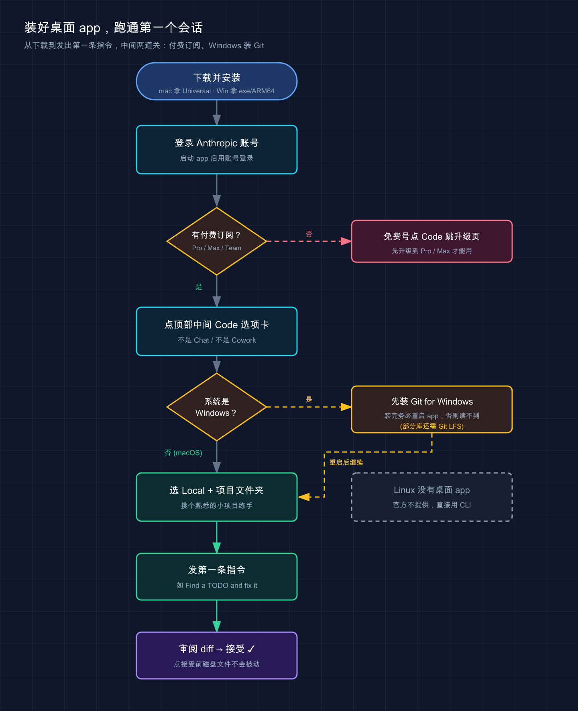

# 10 · 桌面 app（Desktop）

> 📚 **系列导航**：上一篇 [09 JetBrains 集成](./09-jetbrains.md) 把 Claude Code 装进了 IntelliJ 全家桶。这一篇聊一个很多人忽略的入口——**官方桌面 app**，一个没有终端、没有 IDE，也能跑 Claude Code 的独立窗口。

都说命令行才是 Claude Code 的「正统玩法」，桌面 app 顶多是给小白的简化版——**说句实话，这个判断现在已经过时了**。

很多人一开始也是这么想的。可一旦同时改三个互不相干的需求，在终端开三个 tab，改着改着自己就乱了：哪个 tab 在改登录、哪个在重构数据层，切来切去看错好几次。换桌面 app 重试同样的活，左边一栏列着三个会话，每个**自动用 Git worktree 隔开**，改动互不污染，点一下就切过去——这时候才意识到，这玩意儿不是「简化版 CLI」，**它是另一种工作方式**。

更关键的是：桌面 app、VS Code 扩展、命令行，跑的是**同一个底层引擎**，共享同一份 CLAUDE.md 和配置。所以这不是「换个弱化的工具」，而是**同一个 Claude Code 换了个更适合并行、更适合可视化审阅的外壳**。

什么时候该用它、什么时候老老实实回终端，这篇给你讲清楚。

**看完这一篇，你会拿到：**

- macOS / Windows 上装好桌面 app 的完整步骤，外加「为什么 Linux 用不了」的明确说明
- 桌面 app 三个独有的爽点：并行会话 + Git 隔离、集成终端 / 文件编辑、可视化 diff 审阅怎么用
- 一张「桌面 app vs 终端 vs IDE 扩展 该用哪个」的对照表，以及一条把终端会话一键搬进桌面的命令

---

## 01 先搞清楚：桌面 app 到底是什么

很多人一看到「桌面应用」，第一反应是：那不就是 claude.ai 的客户端、套个壳的聊天框吗？

**不是。** 先给结论：**桌面 app 是带图形界面的完整 Claude Code，专门为「同时跑多个会话」而生**。它跟终端里的 `claude` 跑的是同一个引擎，能直接读写你本地的文件、改代码、跑命令，只是把这些操作搬进了一个有侧边栏、有窗格布局的窗口里。

**类比：同一台车，换了套仪表盘。** 命令行是赛车里那种纯数字仪表——信息全、反应快，但你得自己看懂每个读数；桌面 app 是家用车的大屏中控——并行任务、改动 diff、应用预览全都摆在面上，一眼能扫完。**发动机是同一台，跑出来的结果一模一样**，区别只在你坐进去舒不舒服。

这里有个容易混的点：桌面 app 打开后，顶部有**三个选项卡**，别搞错你要去哪个。

| 选项卡 | 干什么 | 能碰你的文件吗 |
|--------|--------|----------------|
| **Chat** | 普通对话，类似 claude.ai | ❌ 不能 |
| **Cowork** | Dispatch 和较长的代理任务 | 在云虚拟机里，不碰本地 |
| **Code** | 交互式编程，直接读写本地文件 | ✅ 能，每步可审阅批准 |

**这一篇只讲 Code 选项卡**——它才是「桌面版 Claude Code」。Chat 和 Cowork 属于 Claude Desktop 的另外两块功能，跟咱们写代码这条线关系不大。

> 💡 一句话总结：桌面 app 不是聊天客户端套壳，**它是带图形界面的完整 Claude Code，认准 Code 选项卡就对了**。

---

## 02 装它：三个平台，差别很大

先把最重要的一条放最前面：**Linux 没有桌面 app**。

这不是漏装了什么，是官方明确不提供——**Linux 用户请直接用 CLI**（前面第 02 篇讲过怎么装）。所以下面只说 macOS 和 Windows。



这张流程图把从下载到发出第一条指令的整条路径串起来，并标出了两道容易卡住的关：**付费订阅**（免费号点 Code 会跳升级页）和 **Windows 装 Git**（装完要重启 app），右下角也顺带提醒了 Linux 没有桌面 app。下面分平台细说每一步。

### 装之前先确认：你得有付费订阅

这条很多人栽过。**桌面 app 的 Code 选项卡要求 Pro、Max、Team 或 Enterprise 订阅**，免费账号点进去会直接提示你升级。常见的踩坑场景是：拿免费号点 Code 一直跳升级页，还以为是装坏了——其实是订阅没到位。

### macOS

去官方下载页拿 **Universal 版**（Intel 和 Apple Silicon 通用），下载 `.dmg` 安装、拖进应用程序文件夹，启动后用 Anthropic 账号登录，点顶部中间的 **Code** 选项卡。

macOS 一般自带 Git，桌面 app 的并行会话隔离依赖它。不放心的话，在终端跑一句确认：

```bash
git --version
```

预期输出类似（版本号不重要，能打印出来就行）：

```
git version 2.39.5 (Apple Git-154)
```

### Windows

x64 处理器下载 `.exe` 安装程序；**Windows ARM64 要单独下 ARM64 安装包**，别拿错。

Windows 有个 macOS 没有的硬门槛：**Code 选项卡的本地会话必须先装 [Git for Windows](https://git-scm.com/downloads/win)**。在一台新装的 Windows 上很容易踩这个坑——没装 Git 就点 Code，弹出一句红色的 `Git is required`，会话压根起不来。装完 Git **记得重启应用**，否则它读不到。

另外 Windows 上有些库还要 **Git LFS**，碰到 `Git LFS is required by this repository but is not installed` 这种报错，就去 [git-lfs.com](https://git-lfs.com/) 装上、跑一句 `git lfs install`，再重启应用。

> 一句重要提醒：桌面 app **自带 Claude Code，不用你单独装 Node.js 或 CLI**。但反过来，如果你还想在终端里敲 `claude`，那个 CLI 得另外装（见第 02 篇）——两者是分开的两份程序，只是共享配置。

> 💡 一句话总结：**Linux 没有、免费号用不了**；macOS 拿 Universal 版即装即用，**Windows 必须先装 Git 再重启**。

---

## 03 爽点一：并行会话 + Git 自动隔离

这是桌面 app **最值得用的理由**，没有之一。

### 先说问题：终端并行的痛

你肯定遇到过这种场景：手头三个任务，修个登录 bug、加一组测试、顺手重构一下工具函数。在终端里你只能开三个 tab 各跑一个 `claude`，但**它们改的是同一份工作目录里的文件**——A 会话改了 `utils.js`，B 会话也想动它，两边的改动就会互相打架。

### 桌面 app 怎么解的

桌面 app 的做法很干净：**点侧边栏的 `+ New session` 开一个新会话，如果项目是 Git 仓库，它会自动给这个会话拉一份独立的 [Git worktree](https://code.claude.com/docs/zh-CN/worktrees)**。

**类比：图书馆的独立研究间。** 你和另外两个人都在看同一套藏书（同一个仓库），但每人分到一间隔音的研究间（worktree），各看各的、各写各的笔记，互不干扰；等你整理好了（提交），成果才汇回总馆。**在你提交之前，一个会话的改动绝不会污染另一个会话**。

侧边栏列着你所有会话，`Ctrl+Tab` / `Ctrl+Shift+Tab` 在它们之间循环切换（这两个键**所有平台都用 `Ctrl`**，不是 Cmd）。想同时看两个会话？**macOS 按住 `Cmd`、Windows 按住 `Ctrl` 点侧边栏里的另一个会话**，它会在旁边分屏打开。

### 几个实用细节

- **worktree 存哪**：默认在 `<项目根>/.claude/worktrees/`。可以在「设置 → Claude Code → Worktree location」改成别的目录。
- **想把 `.env` 这类 gitignore 文件也带进 worktree**：在项目根目录建一个 `.worktreeinclude` 文件，列出要带的文件（以官方文档为准）。
- **会话用完怎么清**：鼠标悬到侧边栏的会话上，点归档图标，对应的 worktree 就删掉了。
- **PR 合并后自动归档**：在「设置 → Claude Code」打开 **Auto-archive after PR merge or close**，跑完的本地会话会自己收掉。

一个值得养成的习惯是：**一个 PR 配一个会话**。改完提交、开 PR、合并，会话自动归档，桌面始终干干净净，不用手动记「哪个 tab 在干嘛」。比起在终端开五六个 tab 自己数，心智负担小太多。

> 💡 一句话总结：**每个会话自动一份 Git worktree**，并行改多个需求互不污染——这是桌面 app 相对终端**最实在的优势**。

---

## 04 爽点二：集成终端 + 文件编辑，不用切来切去

桌面 app 的 Code 选项卡是围绕**窗格**（pane）搭的：聊天、diff、预览、终端、文件、计划、任务……你想怎么摆就怎么摆。**拖窗格标题挪位置、拖窗格边缘改大小**，跟拼积木似的。

> 注意：窗格布局、集成终端、文件编辑器这套需要 **Claude Desktop v1.2581.0 或更高版本**。版本低就先去「Check for Updates」更新（以官方文档为准，版本号可能变化）。

### 集成终端：和 Claude 共享同一个环境

从 **Views** 菜单打开终端，或者直接按 `` Ctrl+` ``（这个键也是全平台 `Ctrl`）。

它最妙的一点是：**终端开在会话的工作目录里，跟 Claude 共享同一个环境**。所以你在这个终端里跑 `npm test` 或 `git status`，看到的就是 **Claude 正在改的那一份文件**，不会出现「Claude 改了但我终端里看的是旧的」这种错位。

这解决了用 VS Code 扩展时的一个老麻烦：以前得自己保证终端 `cd` 到了对的目录，现在直接省了——它本来就在对的地方。

> 提醒：集成终端**只在本地会话里有**，远程会话用不了。

### 文件编辑器：点路径就能改

**点聊天或 diff 里的任意文件路径**，文件就在文件窗格里打开了。直接改、点 **Save** 写回磁盘。

如果你打开文件之后它在磁盘上被改过（比如 Claude 又动了一次），窗格会**警告你**，让你选覆盖还是丢弃，不会闷头把别人的改动盖掉。

> 一个细节：HTML、PDF、图片、视频这类路径，点了不是在文件窗格打开，而是去**预览窗格**——这个下一节细说。文件窗格在本地和 SSH 会话可用；远程会话改文件得直接让 Claude 动手。

### 顺手记一下：视图模式

聊天记录默认把工具调用折叠成摘要（Normal 模式）。想看 Claude 到底每一步干了啥，按 `Ctrl+O` 循环切到 **Verbose**；想只看最终结果和改动，切到 **Summary**。调试「它为什么这么干」时 Verbose 很有用，**并行扫多个会话结果时 Summary 最快**。

> 💡 一句话总结：**终端共享工作目录、文件点开即改**——该有的开发工具都在一个窗口里，不用满屏切应用。

---

## 05 爽点三：可视化 diff 审阅，改对没改对一眼看清

这是图形界面相对纯终端**最直观的提升**。

终端里 Claude 改完代码，diff 是一片绿加红的文本流；桌面 app 把它变成了**能点、能批注、能让 Claude 自审**的可视化界面。

### diff 怎么看

Claude 改了文件后，会冒出一个 **`+12 -1`** 这样的小指示器（加了 12 行、删了 1 行）。**点它就打开 diff 查看器**：左边一栏列改动的文件，右边显示每个文件具体改了哪儿。

### 在某一行直接批注

这是整套 diff 审阅里最好用的地方：**点 diff 里的任意一行，弹出批注框**，输入你的反馈按 **Enter**。想批注多行就一行行点、一条条写，最后一次性提交所有批注：

- **macOS**：`Cmd+Enter`
- **Windows**：`Ctrl+Enter`

Claude 读完你的批注，按要求改，**改完又是一份新 diff 给你审**。这一来一回，比在终端里打字描述「第 23 行那个变量名改一下」精准太多——**你直接戳在那行上说话**。

### 让 Claude 先自审一遍

diff 查看器右上角有个 **Review code** 按钮。点它，**Claude 会在你提交前先把这份改动审一遍**，直接在 diff 里留批注，你可以回复或让它改。

注意它审的是**高信号问题**：编译错误、明显的逻辑 bug、安全漏洞这类。**它不挑代码风格、格式、或者 linter 本来就能抓的东西**——那些交给 linter 就好。

### 改完开 PR，CI 还能盯着

开了 PR 之后，会话里会冒出一条 **CI 状态栏**，Claude Code 用 GitHub CLI 轮询检查结果。两个开关值得知道：

- **Auto-fix**：CI 挂了，Claude 自动读失败日志、试着修。
- **Auto-merge**：所有检查通过后自动合并 PR（合并方式是 squash，且需要你在 GitHub 仓库设置里开过 auto-merge）。

> 前提：PR 监控需要你机器上装好并登录了 [GitHub CLI（`gh`）](https://cli.github.com/)。没装的话，第一次开 PR 时桌面 app 会提示你装。

实测下来，**逐行批注 + Review code 这套组合，已经能替代大半的「人肉 code review 第一遍」**。以前 Claude 改完得逐文件扫一遍找问题，现在让它先自审，只复核它标出来的高信号点，一轮下来省不少眼力。

> 💡 一句话总结：diff **能点能逐行批注**、还能让 Claude **先自审高信号问题**，再配 CI 自动修——**「改对没改对」从靠眼力变成靠界面**。

---

## 06 桌面 app vs 终端 vs IDE 扩展：到底用哪个

讲到这你可能更纠结了：手上明明有终端的 `claude`、有 VS Code 扩展，现在又来个桌面 app，**到底该用哪个？**

先给一句官方原话定调：

> 想在一个窗口里管理并行会话、并排摆窗格、可视化审阅改动，用 Desktop；需要脚本、自动化或更喜欢终端工作流，用 CLI。

把三者摊开对比，按「你最在意什么」来选：

| 你最在意…… | 终端 CLI | VS Code / JetBrains 扩展 | 桌面 app |
|------------|----------|------------------------|----------|
| **并行多会话 + Git 隔离** | 手动开 tab、自己管 worktree | 一般 | ✅ 自动 worktree、侧边栏切换 |
| **可视化 diff、逐行批注** | 纯文本 diff | ✅ 内联 diff | ✅ diff + 批注 + 自审 |
| **在熟悉的编辑器里写代码** | ❌ | ✅ 就在你的 IDE 里 | 自带文件编辑器，但不是你的 IDE |
| **脚本 / 自动化 / 无头运行** | ✅ `--print`、Agent SDK | 部分 | ❌ 仅交互式 |
| **`!bash` 快捷键、Tab 补全** | ✅ | 部分 | ❌（终端原生便利没有）|
| **应用预览、CI 监控、计划任务** | 需自己搭 | 部分 | ✅ 原生 UI |
| **Linux** | ✅ | ✅ | ❌ 不提供 |
| **第三方模型（Bedrock/Vertex/Foundry）** | ✅ | ✅ | 默认只连 Anthropic API（企业部署可配 Vertex / 网关）|

看出门道了吗？**三者不是替代关系，是各有主场**：

- **要脚本化、跑 CI 流水线、用国产 / 第三方模型** → 老老实实用 CLI，桌面 app 干不了这些。
- **主力就在 VS Code / JetBrains 里写码** → 用 IDE 扩展，代码和 AI 在同一个窗口最顺。
- **同时推好几个独立任务、想可视化审阅** → 桌面 app 的主场。

而且**它们能同时用、甚至同一个项目同时用**——共享 CLAUDE.md、MCP server、hooks、skills、`settings.json`。一个顺手的搭配是：**日常写码在 VS Code 扩展，一旦要并行铺开三四个独立需求就切桌面 app，需要批量自动化才回终端写脚本**。

⚠️ 注意：像 `/permissions`、`/config`、`/agents`、`/doctor` 这种会在终端弹交互面板的命令，**在 Code 选项卡里用不了**，会回你一句 `isn't available in this environment`。要改权限规则或配置，直接编辑 `settings.json`，或回独立 CLI 跑。

> 💡 一句话总结：**CLI 管自动化、IDE 扩展管写码、桌面 app 管并行 + 可视化**——三者共享配置、各打各的主场，按当下需求切就行。

---

## 07 动手：装好桌面 app，跑通第一个会话

光看不练假把式。下面走一遍从装到跑通第一个会话的最小流程，**每步都给你能自验的预期结果**。

### 第一步：装好并打开 Code 选项卡

按第 02 节装好（macOS 拿 Universal 版，Windows 先装 Git）。打开应用、登录，**点顶部中间的 Code 选项卡**。

✅ 自验：能看到左侧有会话侧边栏、中间是提示框，说明 Code 选项卡正常。若点 Code 跳升级页 → 你是免费账号，得先订阅 Pro/Max。

### 第二步：选环境 + 项目文件夹

发第一条消息前，提示区要配四样东西：

- **环境**：选 **Local**（在你本机跑、直接读写文件）。另有 Remote（云端）和 SSH（你自己的远程机器），先用 Local 最简单。
- **项目文件夹**：点 **Select folder**，**挑一个你熟的小项目**——别拿祖传大仓库练手。
- **模型**：发送按钮旁的下拉菜单选，Opus / Sonnet / Haiku 都行，会话中途能换。
- **权限模式**：保持默认的**「询问权限」**（`default`），新手最稳。

### 第三步：发第一条指令

提示框里输入一个具体的小任务，比如官方给的示例：

```
找一条 TODO 注释，把它修掉
```

或者：

```
给这个代码库创建一个 CLAUDE.md，写上项目说明
```

按 **Enter** 发送。

### 第四步：审阅并接受改动

因为是「询问权限」模式，**Claude 不会直接改文件，它会先给你一份 diff**。你会看到：

1. 一份 **diff 视图**，显示每个文件具体要改哪儿
2. **接受 / 拒绝**按钮
3. Claude 处理时的实时进度

✅ **预期结果**：你**点接受之前，磁盘上的文件不会被动**。这就是「询问权限」模式的安全感——看清楚再点头。拒绝的话，Claude 会问你想怎么改。

### 第五步（可选）：把终端会话搬进桌面

如果你之前在终端 `claude` 里聊到一半想换到桌面 app，**不用重开**。在终端会话里敲：

```
/desktop
```

Claude 会保存当前会话、在桌面 app 里打开它，然后退出 CLI。

> 注意：`/desktop` 仅 macOS / Windows 可用，且**只在你用 Claude 订阅登录时**能用——API key 登录、或 Bedrock / Vertex / Foundry 部署都不支持（以官方文档为准）。

---

## 08 小结

这一篇把 Claude Code 的第三个入口——桌面 app——讲清楚了，核心就这几条：

- **它是带图形界面的完整 Claude Code，不是聊天套壳**：跟终端同一个引擎、共享 CLAUDE.md 和配置，认准 **Code** 选项卡。
- **装它三个平台差很大**：Linux 没有；免费号用不了（要 Pro/Max 起）；**Windows 必须先装 Git 再重启**。
- **三个独有爽点**：并行会话 + Git worktree 自动隔离、集成终端 / 文件编辑共享同一环境、可视化 diff 能逐行批注还能让 Claude 自审。
- **三者各打主场**：自动化用 CLI、写码用 IDE 扩展、并行 + 可视化用桌面 app，能同时用。

你现在应该能：在 macOS / Windows 上独立装好桌面 app、开多个并行会话且明白它们靠 worktree 隔离、用可视化 diff 审阅并批注 Claude 的改动、并清楚什么时候该切回终端。**把并行这套跑顺，同时推几个需求就不再手忙脚乱了。**

---

下一篇 **11 网页版与云端（Web / 手机）**——桌面 app 里那个 **Remote** 环境、还有手机上能瞄进度的能力，到底是怎么回事？我们会看看不开电脑、甚至人不在工位时，怎么让 Claude Code 在云端接着替你干活。
