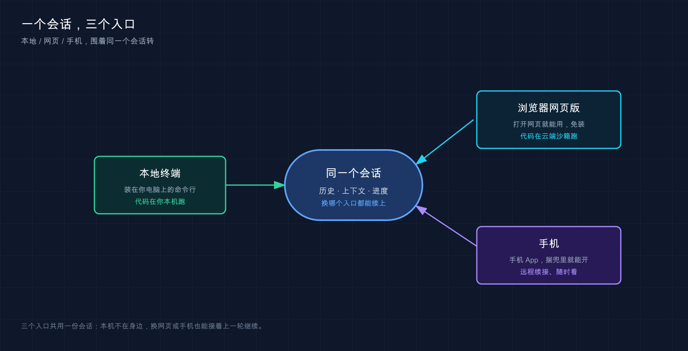

# 11 · 网页版与云端：把 Claude Code 装进浏览器和手机

📚 **系列导航**：上一篇 [10 桌面 app（Desktop）](./10-desktop.md) 帮你把 Claude Code 装成了 Mac / Windows 上的原生应用，跑在你自己机器上。这一篇换个方向——**连装都不用装，浏览器打开就能用**，外加用手机接管你电脑上正在跑的会话。

我前阵子在高铁上，临时收到一条消息——线上一个仓库的 README 里把安装命令写错了，得赶紧改。

**手边没带电脑，只有一台手机，外加那种时断时续的车厢 WiFi。**

放在以前，这就是「等到了再说」。但我当时掏出手机打开 claude.ai/code ，选中那个仓库，敲了一句「修正 README 里的安装命令，npm 包名应该是 xxx」，就把手机塞回兜里了。**等出站的时候，一个改好的分支已经躺在 GitHub 上等我提 PR 了——前后大概十来分钟，一行命令都没敲过，电脑全程没开。**

这就是这一篇要聊的两件事：**网页版**（在云端跑、连 GitHub）和 **Remote Control**（让手机 / 任意设备接管你本地的会话）。说白了，就是把「必须坐在电脑前敲命令」这个前提给拆了。

**⚠️ 注意**：网页版和 Remote Control 目前都处于**研究预览**（research preview）阶段，功能和细节可能随时变化，本篇以官方文档当前版本为准。

**看完这一篇，你会拿到：**

- 搞清楚**网页版**到底是啥：免安装、在云端沙箱跑、连你的 GitHub 仓库
- 一套从登录到提任务、再到提 PR 的完整网页版操作流程，照着走就行
- **Remote Control** 是怎么回事：在电脑上起个会话，用手机 / 别的浏览器接着指挥
- 一张「网页版 vs 本地 CLI vs Remote Control」的取舍对照表，知道什么时候用哪个
- deep-links 一键起会话、国内访问要点这些零碎但有用的细节

---

## 01 先把三个东西分清楚：本地、网页、远控

开篇先泼盆冷水：**很多人一上来就把「桌面 app」「网页版」「Remote Control」搅成一锅粥**，结果用错场景，越用越懵。咱们先花一分钟把它们掰开。

**类比：同一份工作，三种到岗方式。**

- **本地 CLI / 桌面 app**：你**亲自到办公室**上班，电脑、文件、工具全在手边——上一篇讲的桌面 app 就是这种，代码跑在你自己机器上。
- **网页版（on the web）**：你**派了个远程同事**，他在公司租的云服务器上干活，你只需要在浏览器里给他派活、看结果。代码跑在 **Anthropic 的云上**，不碰你的电脑。
- **Remote Control（远程控制）**：你人在办公室、活也在你办公室的电脑上跑，但你**用手机远程遥控**那台电脑。代码还是跑在你机器上，手机只是个「遥控器窗口」。

记住这条最关键的分界线：

**代码到底在谁的机器上跑？** 网页版在 Anthropic 云上跑；Remote Control 和本地一样，始终在你自己机器上跑。

这条线决定了一切——能不能访问你本地的文件、要不要联网克隆仓库、断网了会不会停。后面所有取舍都从这儿派生。

> 💡 **一句话总结**：本地是「亲自到岗」、网页版是「派云端同事」、Remote Control 是「手机遥控你的电脑」；**先认准代码在谁机器上跑，剩下的全好理解**。



看这张图就能搞清楚：哪端只是个窗口，哪端才是真正干活的地方。

---

## 02 网页版是什么：浏览器打开就能用

先给结论：**网页版就是把 Claude Code 搬到了云上，你不用装任何东西，打开网页就能让它干活，干完直接给你提 PR。**

它跑在 [claude.ai/code](https://claude.ai/code) ，**在 Anthropic 管理的云虚拟机（cloud VM）里运行**——这是一台一次性的隔离机器，每次任务都新克隆你的仓库进去。

**类比：租了台一次性的云电脑，用完即焚。** 你不用自己配环境、装依赖，云端那台机器开机时已经预装好了 Python、Node、Go、Docker 一大堆工具。Claude 在那台机器上读代码、改代码、跑测试，结束后把改动以一个 GitHub 分支推给你。**那台机器跟你本地电脑完全隔离，它崩了、被搞坏了，都伤不到你一根头发。**

它适合这几类真实场景：

- **并行跑多个任务**：每个任务一个独立会话、独立分支，互不打架。比如一口气派三个活——修一个 flaky 测试、补一份 API 文档、重构日志模块，三个云会话同时在跑，你喝着咖啡等结果就行。
- **本地没克隆的仓库**：想顺手看一眼某个仓库、改个小东西，但你本地根本没 clone 它。网页版每次都帮你新克隆，**省了你 `git clone` 再配环境那一整套**。
- **不想配本地环境**：换了台新电脑、或者在别人机器上，懒得装一长串依赖。

有两个**前提**得说清楚，免得你白忙活：

1. **它需要一个 GitHub 仓库**。网页版靠克隆 GitHub 仓库来干活，没仓库它没法开工。
2. **目前是研究预览**，开放给 **Pro、Max、Team** 用户，以及有高级席位或 Chat + Claude Code 席位的 Enterprise 用户。

还有个很爽的点：**会话在设备间持久化（persist）**。你在电脑浏览器上派的任务，**关掉网页它照样在云端跑**，回头用手机打开 Claude app 就能接着看进度。开头那个高铁上改 README 的场景，就是靠这条——派完任务锁屏，到站再看结果。

> 💡 **一句话总结**：网页版 = 云端一次性沙箱 + 连 GitHub 仓库 + 免安装，**适合并行跑活、改本地没克隆的仓库、不想配环境**；前提是有 GitHub 仓库、是 Pro / Max / Team 用户。

---

## 03 网页版 vs 本地 CLI：到底该用哪个

这两个不是替代关系，是**分工**关系。实测下来，判断标准就一句话：

**这活需不需要碰我电脑上的东西？** 需要，就老老实实用本地 CLI；不需要，云端跑更省事。

为什么？因为网页版那台云机器**只有你仓库里的东西**——凡是你只在自己电脑上装的、配的（比如某个本地工具、你 `~/.claude/CLAUDE.md` 里的全局指令、`claude mcp add` 加的 MCP server），云端**统统看不见**。要让云端用上，得把配置**提交进仓库**（比如写进仓库的 `.claude/settings.json`、`.mcp.json`）。

来张对照表，一眼看清取舍：

| 维度 | 网页版（on the web） | 本地 CLI / 桌面 app |
|------|------|------|
| **代码跑在哪** | Anthropic 云 VM | 你自己的机器 |
| **从哪聊天** | claude.ai 或手机 app | 你的终端 / 桌面 UI |
| **用得上你的本地配置吗** | ❌ 只有仓库里的 | ✅ 全都在 |
| **需要 GitHub 吗** | ✅ 需要（或捆绑本地仓库上传） | ❌ 不需要 |
| **断开连接还继续跑吗** | ✅ 关掉网页照样跑 | ❌ 关了终端就停 |
| **并行跑多任务** | ✅ 天生擅长，各占一个会话 | 要自己开多个 worktree |
| **权限模式** | 只有「自动接受编辑」和「Plan」 | 全部模式都有 |

有一行我得专门点一下：**网页版的权限模式只有两种**——「自动接受编辑（Auto accept edits）」和「Plan 模式」，**没有**你在第 07 篇里熟悉的那种「每次改动都跳出来问你」的默认（default）模式。

这意味着什么？默认情况下，**云端的 Claude 改完文件直接推分支，不会停下来一行行等你点同意**。所以派云端任务时，**任务描述一定要写清楚、写具体**——它不会中途回头问你「这样改行不行」。这个亏我自己头一回用就吃了：图省事派了个模糊的「优化一下这个日志模块」，回来一看，它自作主张把整套日志重构了一遍、连接口都改了，**远不是我想要的那点小改动**，最后那个分支我直接弃了重派。后来我学乖了，云端任务一律写明白文件名、要改什么、预期行为。

> 💡 **一句话总结**：**碰本地东西用本地 CLI，不碰本地、想并行或想随处可用就上网页版**；记住网页版默认「自动接受编辑」，所以任务描述务必写具体。

---

## 04 Remote Control：让手机接管你本地的会话

网页版是「把活搬到云上」，**Remote Control（远程控制）走的是另一条路：活还在你电脑上跑，但你能从手机 / 任意浏览器去指挥它。**

先给结论：**Remote Control 让你在办公桌上起一个本地会话，然后从沙发上的手机、或另一台电脑的浏览器接着聊——代码自始至终在你自己机器上跑，没有任何东西上云。**

**类比：给你的电脑装了个远程遥控器。** 你的文件系统、本地 MCP server、各种工具、项目配置——**全都还在、全都能用**，跟你坐在电脑前没区别。网页和手机界面只是那个本地会话的一扇「窗户」，你透过窗户发指令，活在窗户后面的电脑上干。

它和网页版的根本区别，还是那条老分界线：

**Remote Control 在你的机器上执行，所以你的本地 MCP server、工具和项目配置都还在。网页版在 Anthropic 云上执行。**

什么时候用它？官方给的判断很清楚：**你正干着本地的活，临时想换个设备接着弄**，就用 Remote Control。一个很典型的场景——下班前在公司电脑上让 Claude 跑一个耗时的重构。人直接走，到家用手机打开 Claude app，会话还连着公司那台电脑，**躺床上就能看它跑到哪了、给它发下一条指令**。

启动也简单。在你的项目目录里跑这一行，就进入「服务器模式」，它会挂在终端等远程连接：

```bash
claude remote-control
```

跑起来后，终端里会显示一个**会话 URL**，按**空格键**还能调出一个**二维码**——手机扫一下，直接在 Claude app 里打开这个会话。

如果你已经在一个 Claude Code 会话里头了，想把当前这次对话直接转成可远程的，不用重开，直接敲：

```text
/remote-control
```

（嫌长可以用别名 `/rc`。）它会继承你当前的对话历史，照样给你一个 URL 和二维码。

几个**硬性前提**记一下，不满足会连不上：

- **版本**：需要 Claude Code **v2.1.51 或更高**，`claude --version` 查一下。
- **登录方式**：必须用 claude.ai 账号 `/login` 登录，**不支持 API key**。
- **本地进程得一直开着**：Remote Control 本质是个跑在你电脑上的本地进程，**你一关终端、退出 `claude`，会话就结束了**。

还有个挺贴心的：当 Remote Control 活着的时候，**长任务跑完或者需要你拿主意时，Claude 能给你手机推送通知**。你也可以在指令里直接要求，比如「测试跑完了通知我」。（推送通知需要 v2.1.110 或更高。）

> 💡 **一句话总结**：Remote Control = 本地会话 + 手机 / 浏览器当遥控器，**代码全程在你机器上跑、本地配置全都在**；`claude remote-control` 起服务、扫码即连，但本地进程不能关。

---

## 05 别搞混：`--remote` 和 `--remote-control` 是两码事

这俩长得太像了，官方文档专门反复强调过，新手一开始也很容易踩这个坑——**它们干的根本是相反的方向**。一行表说清：

| 命令 | 方向 | 干什么 | 代码跑在哪 |
|------|------|------|------|
| `claude --remote "任务"` | 本地 → 云 | 从终端**起一个新的云会话** | Anthropic 云 VM |
| `claude --teleport` | 云 → 本地 | 把一个云会话**拉回本地**继续 | 你的机器 |
| `claude --remote-control` | （无关云） | 把**本地会话**开放给手机 / 网页监控 | 你的机器 |

看出门道了吧：

- **`--remote`**（带任务）= 我人在终端，但想把活**甩到云上**去跑，自己腾出手干别的。
- **`--teleport`** = 云上那个会话我想**拽回本地**接着弄（比如要用本地工具了）。注意这是**单向**的：你能把云会话拉回本地，但**不能**把一个已存在的本地终端会话推上云。
- **`--remote-control`** = 跟云**一点关系没有**，纯粹是把我本地这个会话**开个窗口**让别的设备看 / 控。

举个常见用法：复杂任务可以**先在本地 Plan Mode 规划**（让 Claude 出方案但不动代码），方案满意了推送到 GitHub，再一句 `claude --remote "执行 docs/ 里的迁移方案"` 把执行甩到云上自主跑。**策略你把控，体力活云端干**——这套「本地规划、远程执行」用起来很顺手。

> 💡 **一句话总结**：`--remote` 把活送上云、`--teleport` 把云会话拉回本地（单向）、`--remote-control` 是本地会话开远程窗口——**三个方向，千万别记混**。

---

## 06 deep-links：一个链接直接起会话

最后补一个小而美的功能：**deep-links（深链接）**。

它解决的问题是：有时候你想给别人（或给未来的自己）**一个一键起点**——点一下链接，Claude Code 就在对的仓库里打开，提示词都帮你填好了。

**类比：给同事发一个「点开即用」的快捷方式。** 比起跟人解释「你 clone 这个仓库、cd 进去、然后敲这段话」，直接甩个链接过去，对方点一下，会话开好、提示填好，省事多了。典型用在事故处理手册、监控告警、CI 失败通知里——点开就在出问题的仓库里带着诊断提示开干。

深链接是个 `claude-cli://` 开头的 URL，长这样：

```text
claude-cli://open?repo=acme/payments&q=review%20open%20PRs
```

`repo` 指定一个 GitHub 的 `owner/name` 仓库，`q` 是预填的提示词（要 URL 编码，`%20` 就是空格）。点开它，你机器上会弹出一个新终端，Claude Code 在你 `acme/payments` 那个**本地克隆**里启动，提示框里已经填好了「review open PRs」。有个前提要注意：`repo` 只认识你**至少跑过一次 `claude` 的路径**——如果你从来没在那个克隆里启动过 Claude Code，它找不到记录，会话会回落到你的主目录，而不是仓库目录。

这里有条**安全设定**得记牢，挺重要：

深链接本身**永远不会执行任何操作**。它只是选好目录、把提示填进输入框。**在你看过内容、亲手按下回车之前，没有任何东西会发给模型。**

换句话说，哪怕你从一个不信任的页面点了深链接，它也只是帮你把字打进去，**主动权始终在你手里**。（深链接需要 v2.1.91 或更高。）

> 💡 **一句话总结**：deep-links 用一个 `claude-cli://` 链接帮你「选好仓库 + 填好提示」一键起会话，**但只填不发，按回车前一切可控**。

---

## 07 动手：起一个本地会话，用手机接管它

光说不练没意思。下面这个最小练习，让你亲手体验一次「电脑起会话、手机接管」——**不用 GitHub、不用任何项目，几分钟搞定**。

**第一步：确认版本够新**

```bash
claude --version
```

**预期**：版本号 **≥ 2.1.51**。低于这个数，先 `claude update` 升级，否则 Remote Control 起不来。

**第二步：在任意一个文件夹里起服务器模式**

随便找个目录（沿用第 07 篇那个 `hello-claude` 也行），敲：

```bash
claude remote-control
```

**预期**：终端**不会**像平时那样进入聊天，而是显示一段「等待远程连接」的状态，外加一个会话 URL。**这是对的**——服务器模式就是挂在这儿等手机连。

**第三步：调出二维码**

在那个状态界面里，**按一下空格键**。

**预期**：终端里画出一个**二维码**。（如果你还没装 Claude 手机 app，可以先在另开的 Claude Code 里敲 `/mobile`，它会给你 app 的下载二维码。）

**第四步：手机扫码接管**

用装好 Claude app 的手机扫这个码。

**预期**：手机的 Claude app 里打开了这个会话，**你电脑的终端会显示连接状态变化**。这时你在手机上发一句话，比如：

```text
列出当前目录下有哪些文件
```

**预期**：**活在你电脑上跑**（它读的是你那台机器的目录），结果同步显示在手机上。**看到手机上列出了你电脑当前目录里的文件 = 你已经成功用手机接管了本地会话，全流程跑通，恭喜！**

**第五步：收摊**

回到电脑终端，按 `Ctrl+C` 停掉 `claude remote-control`。

**预期**：服务器模式退出，远程会话随之结束——记得，**本地进程一关，会话就没了**。

> ⚠️ 要是手机连不上、或报「Remote Control 需要 claude.ai 订阅」，**九成是登录方式不对**：Remote Control 只认 claude.ai 账号，不认 API key。先在终端 `/login` 用 claude.ai 账号登录，并确认环境里没设 `ANTHROPIC_API_KEY`。

---

## 08 国内访问：先把魔法上网备好

这一篇讲的所有功能，都绕不开一个现实门槛——**它们全都连 [claude.ai](https://claude.ai) 这套域名**：网页版在 claude.ai/code 跑，Remote Control 和手机 app 也都往 Anthropic 的服务器发请求。

所以结论很直接：**国内用户用网页版、Remote Control、手机 app 之前，先把「魔法上网」准备好**，否则页面打不开、手机 app 连不上、二维码扫了也没反应。这跟前面装本地 CLI 时的网络要求是一回事，只是这回连**手机端**也得在能正常访问的网络环境下。

一个容易忽略的细节：**云会话里的 Claude 是从 Anthropic 的云基础设施访问网络的，不是从你的网络**。所以云端那台机器拉 npm 包、克隆 GitHub 仓库走它自己的通道，跟你本地的魔法上网无关——**你需要魔法上网的地方，只是「浏览器 / 手机怎么连上 claude.ai」这一段**。

> 💡 **一句话总结**：网页版 / Remote Control / 手机 app 全都连 claude.ai ，**国内用之前先备好魔法上网**；但云会话内部的联网走 Anthropic 自己的网络，不归你管。

---

## 09 小结

这一篇，咱们把 Claude Code 从「必须坐在电脑前敲命令」彻底解放了出来，主要拿下两件事：**浏览器免安装直接用（网页版）**，和**用手机 / 任意设备接管本地会话（Remote Control）**。

把核心区别再钉一遍：

| 你想干的事 | 该用哪个 | 代码跑在哪 |
|------|------|------|
| 不想装环境、改个本地没克隆的仓库 | **网页版** | Anthropic 云 |
| 同时跑好几个独立任务 | **网页版**（各占一个会话） | Anthropic 云 |
| 本地活跑一半，换手机接着指挥 | **Remote Control** | 你的机器 |
| 把本地任务甩到云上自主跑 | `claude --remote` | Anthropic 云 |
| 给别人一个一键起会话的链接 | **deep-links** | 点链接那台机器 |

**你现在应该能：** 分清本地、网页版、Remote Control 三者的根本差别（代码在谁机器上跑），知道网页版怎么连 GitHub 提任务提 PR、默认是「自动接受编辑」所以任务要写具体，会用 `claude remote-control` + 扫码让手机接管本地会话，也不会再把 `--remote` 和 `--remote-control` 搞混。**这套「随处可用」的能力，是把 Claude Code 真正塞进你日常工作流的关键一步。**

---

下一篇 **12「项目初始化：用 `/init` 生成 CLAUDE.md」**——不管你是在本地、网页还是手机上用 Claude Code，它干得好不好，很大程度取决于那个仓库里有没有一份像样的 CLAUDE.md 。下一篇就教你用一条 `/init` 命令，让 Claude 自己把项目摸一遍、生成第一版「项目说明书」。你不妨先想想：**如果让一个新同事接手你的项目，你最想先告诉他哪三件事？**
