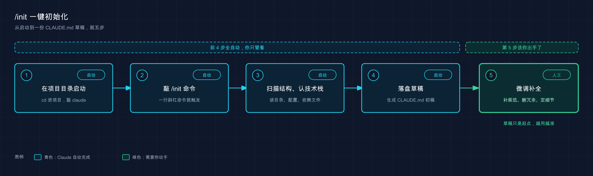

# 12 · 项目初始化：用 /init 一键生成 CLAUDE.md

> 📚 **系列导航**：上一篇 [11 网页版与云端](./11-web-and-cloud.md) 带你跳出终端，在浏览器和云端环境里用上了 Claude Code。这一篇回到本地、回到一个最该养成的习惯——进新项目第一件事，敲 `/init`，让 Claude 自己扫一遍代码库、把项目说明书写出来。下一篇：[13 项目结构](./13-project-structure.md) 。

兄弟们，先讲个常见的蠢操作。

刚上手 Claude Code 那阵，接手一个之前同事留下的 Node 后端项目，没跑 `/init` 就直接开干。第一次问「测试怎么跑」，它去翻了一圈 `package.json` 才回你；过了二十分钟开个新会话，**同样的问题它又从头翻了一遍**；下午换个任务，它第三次问「这个项目用的是 npm 还是 pnpm」。

到这一刻就真被它看烦了——**不是它笨，是没给它一份「项目说明书」，它每次都得从零摸索一遍**。等学会进项目先敲一个 `/init`，这些重复全没了：它一次性把项目摸清、写成一份 CLAUDE.md 存下来，**之后每次会话开局就自带这份上下文，再也不用反复解释**。

说白了，`/init` 就干一件事：**把「Claude 每次重新认识你的项目」变成「认识一次，长期记住」**。这一篇就讲清楚它怎么用、生成出来长啥样、到底帮你省了什么。

**看完这一篇，你会拿到：**

- 搞懂 `/init` 解决的核心痛点：从「每次重新摸索」到「一次生成长期记忆」
- 一套照着敲就行的操作：在项目根目录启动 `claude`，敲 `/init`
- 知道它背后做了什么：扫描结构、识别技术栈、生成 CLAUDE.md 草稿
- 看懂生成出来的 CLAUDE.md 大致长什么样、每一块是干嘛的
- 一个关键认知：`/init` 只是起点，草稿得人工补一刀（怎么补，留给第 18 篇）

---

## 01 为什么要有 /init：Claude 的「失忆」问题

先说结论：**Claude Code 每次开新会话，都是「失忆」状态——它不记得你上次跟它说过什么**。

这不是 bug，是它的设计。官方文档里写得明明白白：

> 每个 Claude Code 会话都从一个全新的上下文窗口开始。

**类比：每天来上班都换一个新实习生。** 这实习生本事不小，但有个毛病——**今天教会他的事，明天来的是另一个人，全得重教**。你跟他讲「我们用 pnpm 不用 npm」「测试在 `tests/` 目录」「提交前要跑 lint」，第二天新的一个来了，又得从头讲一遍。

这就是没有 CLAUDE.md 时的真实状态。前面那个 Node 项目踩的坑就是这么来的——**不是 Claude 记性差，是它压根没有跨会话的记忆载体**。

那怎么办？官方给了两套跨会话传递知识的机制，这一篇只讲第一套：

| 机制 | 谁来写 | 装的是什么 |
|------|--------|-----------|
| **CLAUDE.md 文件** | **你**（可让 /init 起草） | 指令和规则：项目架构、构建命令、约定 |
| 自动记忆（Auto Memory） | Claude 自己 | 它工作中攒下的经验、调试心得 |

注意自动记忆有个硬限制：**每个会话只加载前 200 行或 25KB，超出部分不进上下文**——所以靠自动记忆塞太多东西是靠不住的，CLAUDE.md 才是主力。

CLAUDE.md（项目记忆文件）就是那份**写给「每天换人的实习生」看的入职手册**——你提前写好放在项目里，**Claude 每次开局先读一遍，立刻就「记起」这个项目是怎么回事**。

而 `/init`，就是帮你把这份手册的初稿一键生成出来的命令。

> 💡 **一句话总结**：Claude 每次开会话都「失忆」，CLAUDE.md 是它跨会话的记忆载体——`/init` 帮你把这份记忆的初稿一键写出来。

---

## 02 /init 是什么：让 Claude 自己写自己的说明书

`/init` 是 Claude Code 内置的一个斜杠命令（slash command，输入框里以 `/` 开头的指令）。

它干的事，用一句话概括：**让 Claude 自己扫描你的项目，生成一份专属于这个项目的 CLAUDE.md 草稿**。

官方文档对它的描述很精准：

> 运行 `/init` 自动生成起始 CLAUDE.md。Claude 分析你的代码库并创建一个包含构建命令、测试指令和它发现的项目约定的文件。

**类比：让新员工自己写一份入职手册。** 一般入职手册是老员工写好给新人看的。但 `/init` 反过来——**它让这个「新来的」先把整个项目自己读一遍，然后把读到的东西（用什么技术、目录怎么分、命令怎么跑）整理成一份手册**。读得对不对，你回头审一眼就知道。

这么设计的好处很实在：**项目里的客观事实（技术栈、目录结构、有哪些脚本命令），Claude 自己扫一遍就能扒出来，根本不用你一个字一个字敲**。你省下的力气，留着去补那些它扫不出来的东西（比如团队的分支命名规范），就够了。

什么时候该用它？一般有这几个触发时机：

- **接手一个别人留下的项目**——你自己都没摸熟，正好让它先扫一遍给你打底
- **自己的项目还没有 CLAUDE.md**——一直在裸用，是时候补上了
- **clone 下来一个开源项目想改改**——先 `/init` 拿到项目地图，再动手

> 💡 **一句话总结**：`/init` 让 Claude 把项目自己读一遍，把客观事实整理成 CLAUDE.md 草稿——你省下扒事实的力气，专心补它扫不出的东西。

---

## 03 怎么跑：进目录、启动、敲命令

操作简单到有点反高潮——**启动 `claude` 后，在输入框里敲 `/init` 就完事**。

**第一步：在项目根目录启动 Claude Code。**

这一步是关键，**一定要 `cd` 进项目的根目录再启动**，不能在桌面或主目录裸启。第 07 篇就强调过：你在哪启动，Claude 就把哪儿当工作区、读哪儿的文件。在主目录跑 `/init`，它扫的是你一堆乱七八糟的个人文件，扫了个寂寞。

```bash
cd /path/to/your-project
claude
```

**第二步：在输入框里敲 `/init`，回车。**

```text
/init
```

就这样。接下来你**什么都不用做**，剩下全是 Claude 自己跑——整个过程无需手动操作，它会自行分析、自动输出。

那它在背后到底干了啥？看它跑过很多次，大致是这么个流程：



整件事串成一条线就是：**在项目目录里启动 `claude` → 敲 `/init` → Claude 扫描项目结构、识别技术栈 → 落盘一份 CLAUDE.md 草稿 → 你再人工微调补全**。前四步基本是自动的，最后那步「人工微调」才是把草稿变成好手册的关键，这一篇先点到，第 18 篇专门讲。

官方对这一步的说法是「分析你的代码库」。具体扫的是哪些文件，落到实处大致是这几类（跑下来它基本都会翻）：

- **依赖清单**：`package.json`（Node）、`requirements.txt`（Python）、`pom.xml`（Java）这类——用来判断**技术栈和能跑的命令**
- **现有文档**：`README` 之类——理解**项目是干什么的**
- **配置文件 + 代码结构**：摸清**目录怎么分、入口在哪**

> ⚠️ **一个容易忽略的细节**：如果项目里**已经有** CLAUDE.md，`/init` **不会**粗暴覆盖它。官方文档明确写了——这时它会**建议改进**而不是覆盖。在一个已经写好 CLAUDE.md 的项目里再敲一次 `/init`，本来还担心白写了，结果它老老实实列了几条「这里可以补充」的建议，原文一行没动。这点设计相当贴心。

> 💡 **一句话总结**：`cd` 进项目根目录、启动 `claude`、敲 `/init`，剩下交给它自动扫——已有 CLAUDE.md 时它只建议改进、不覆盖。

---

## 04 生成出来长什么样：CLAUDE.md 草稿拆解

跑完 `/init`，项目根目录下就多了一个 `CLAUDE.md` 文件。打开它，你会看到一份结构清晰的 Markdown。

**类比：一份标准的项目说明书。** 它不是流水账，而是分好块的——项目是干嘛的、用了什么技术、目录怎么分、命令怎么敲、有什么约定。一个新人（包括下一次会话「失忆」后的 Claude）扫一眼这几块，就知道这项目怎么回事了。

生成的内容通常覆盖这么几块（具体字段 Claude 会按你项目实际情况来，下面是个典型样子）：

```markdown
# 项目名称

## 项目概述
简述这个项目是做什么的、核心功能是什么。

## 技术栈
- Frontend: React + TypeScript
- Backend: Node.js + Express
- Database: PostgreSQL

## 目录结构
- `src/components/` - React 组件
- `src/api/`        - API 层
- `tests/`          - 测试文件

## 常用命令
- 启动开发服务器：`pnpm dev`
- 运行测试：`pnpm test`
- 代码检查：`pnpm lint`

## 开发规范
- 使用 TypeScript strict 模式
- 提交前先跑 `pnpm test`
```

逐块说一下它各自的价值——这正是 Claude 以前要反复问你的那些东西：

| 这一块 | 装的是什么 | 它替你省掉的重复 |
|--------|-----------|----------------|
| **项目概述** | 项目目的、核心功能 | 不用每次解释「这项目是干嘛的」 |
| **技术栈** | 用了什么框架、语言、数据库 | 不用每次问「这是 React 还是 Vue」 |
| **目录结构** | 关键目录各放什么、入口在哪 | 不用每次找「API 代码在哪个文件夹」 |
| **常用命令** | 启动、测试、检查怎么敲 | 不用每次翻 `package.json` 找命令 |
| **开发规范** | 项目约定（如 strict 模式） | 不用每次叮嘱「记得开严格模式」 |

看明白没？**前面那个 Node 项目里被问烂的「测试怎么跑」「用 npm 还是 pnpm」，全被「常用命令」「技术栈」这两块一次性吃掉了**。手册写好往那一放，Claude 开局自己读，这些重复对话直接清零。

至于这个文件该放哪——官方给的位置是项目根目录的 `./CLAUDE.md`（或者 `./.claude/CLAUDE.md`）。`/init` 默认就帮你放对地方了，你**不用操心路径**。更细的层级关系（用户级、项目级怎么叠加），留到第 18 篇展开。

> 💡 **一句话总结**：生成的 CLAUDE.md 分「概述 / 技术栈 / 目录 / 命令 / 规范」几块，每一块都精准对掉一类以前反复问的重复——文件放哪 `/init` 帮你搞定。

---

## 05 关键认知：/init 是起点，不是终点

这是这一篇最想让你记住的一句话：**`/init` 生成的是草稿，不是终稿**。

为什么必须人工补一刀？因为有些东西，**Claude 扫遍整个代码库也扫不出来**——它们根本不在代码里，只在你和团队脑子里。

举几个 Claude 自己绝对推断不出来的例子：

- **分支命名规范**：你们约定 `feature/xxx`、`fix/xxx`，这写在哪个文件里？没有。Claude 扫不到。
- **部署流程**：合并到 `main` 自动触发部署、还是要手动点一下？项目代码里看不出来。
- **Code Review 要求**：「PR 必须两人 approve」「核心模块改动先在 Plan Mode 出方案」——这是团队的隐性约定。
- **业务背景**：为什么这块要这么设计、哪个模块碰了容易出事——这些「为什么」藏在你脑子里。

正确的姿势是**迭代优化，而非一次写死**。

前面那个 Node 项目就是反面教材的对照组：`/init` 完就以为万事大吉，没补。结果它生成的「常用命令」里漏了一条**自己写的部署脚本**（因为那脚本藏在 `scripts/` 里没在 `package.json` 暴露），Claude 自然没扫到。手动往 CLAUDE.md 里加一行「部署用 `./scripts/deploy.sh`」，这才算补全。**所以正确的习惯是固定的：`/init` 跑完，立刻通读一遍，把它扫不出的硬约束手动补进去**。

所以正确的姿势是这样的对比：

| ❌ 错误用法 | ✅ 正确用法 |
|-----------|-----------|
| `/init` 跑完就不管，当终稿用 | `/init` 跑完通读一遍，当草稿审 |
| 指望它把团队所有约定都扫出来 | 把它扫不出的硬约束（分支、部署、Review）手动补上 |
| 生成完一次写死，从此不动 | 随项目演进持续迭代、删掉过时的 |

**记住这个分工就行：`/init` 负责把客观事实快速扒出来打底（这块它强），你负责把主观约定和业务背景补进去（这块只有你知道）**。两边配合，才是一份真正好用的 CLAUDE.md。

至于「怎么把这份草稿改成一份精炼又好用的手册」——比如层级怎么设计、怎么用引用拆分、怎么长期维护——那是第 18 篇「CLAUDE.md 使用指南」的活儿。**这一篇你只要做到「有了它」，下一步才谈「写好它」**。

> 💡 **一句话总结**：`/init` 只把客观事实扒出来打底，团队约定、部署流程这些它扫不到的硬货，必须你人工补——草稿审完才算数。

---

## 06 动手：给一个最小项目跑通 /init

光说不练假把式。下面用一个**两三个文件的最小项目**，带你把 `/init` 完整跑一遍，验证它确实生成了 CLAUDE.md。不依赖任何复杂环境，照着敲就行。

**第一步：建一个最小项目**（Mac / Linux）

```bash
mkdir init-demo
cd init-demo
echo '{"name": "init-demo", "scripts": {"test": "echo test ok"}}' > package.json
echo 'console.log("hello from init-demo");' > index.js
```

Windows PowerShell 用户：`mkdir init-demo`、`cd init-demo` 照敲，`package.json` 和 `index.js` 这两个文件用记事本新建、把上面单引号里的内容贴进去存好即可。

**预期**：`init-demo` 文件夹里有 `package.json` 和 `index.js` 两个文件。敲 `ls`（Windows 用 `dir`）能看到它俩。

**第二步：在项目目录里启动 Claude Code**

```bash
claude
```

**预期**：出现欢迎屏幕，底部有输入框。确认终端当前就在 `init-demo` 目录下。

**第三步：跑 /init**

在输入框里敲：

```text
/init
```

**预期**：Claude 开始滚屏——你会看到它在读 `package.json`、`index.js`，分析项目，然后写文件。跑完它会告诉你 CLAUDE.md 已生成。**因为这项目只有两个文件，整个过程很快，几秒到十几秒**。

**第四步：确认 CLAUDE.md 生成了**

退出 Claude（敲 `exit` 或按 `Ctrl+D`），回终端看：

```bash
cat CLAUDE.md
```

（Windows PowerShell 用 `type CLAUDE.md`）

**预期**：终端打印出一份 Markdown，里面**至少能看到项目名 `init-demo`、技术栈是 Node.js / JavaScript、以及那条 `test` 命令（`echo test ok`）被识别成了「运行测试」**。看到这些 = `/init` 跑通了，它确实把你这个小项目读懂并记了下来。

**第五步（可选）：验证它「记住」了**

重新进 `claude`，问一句：

```text
这个项目的测试命令是什么？
```

**预期**：它会**直接告诉你测试命令**，而不用再去翻 `package.json`——因为答案已经写在它开局就读过的 CLAUDE.md 里了。**这一下，你就亲眼看到「失忆」被治好了**。

> ⚠️ 小提醒：真实项目里 `/init` 扫的文件多、生成内容也丰富得多，跑起来会比这个 demo 慢一些，耐心等它扫完即可；扫完别忘了第 05 节说的——**通读一遍，把它扫不出的硬约束补进去**。

> 💡 **一句话总结**：建个两文件的最小项目、`claude` 里敲 `/init`、退出后 `cat CLAUDE.md`，亲眼看它把项目读懂——再问一句测试命令，验证「失忆」被治好了。

---

## 07 小结

这一篇就讲透了一个动作：**进新项目第一件事，敲 `/init`，让 Claude 自己把项目说明书的初稿写出来**。

把核心要点串一遍：

| 维度 | 结论 |
|------|------|
| **解决什么** | Claude 每次会话「失忆」，CLAUDE.md 是跨会话记忆载体 |
| **/init 是什么** | 让 Claude 扫项目、自动生成 CLAUDE.md 草稿的命令 |
| **怎么跑** | `cd` 进项目根目录 → 启动 `claude` → 敲 `/init` |
| **它做了什么** | 扫描结构、识别技术栈、扒命令，落盘成草稿 |
| **长什么样** | 概述 / 技术栈 / 目录 / 命令 / 规范几块 |
| **关键认知** | 草稿不是终稿——团队约定得人工补 |

**你现在应该能：** 进任何一个项目，在根目录启动 `claude` 后敲 `/init`，让它自动生成一份 CLAUDE.md，看懂生成内容里每一块是什么，并且明白这只是起点——客观事实它帮你打底，主观约定要你亲手补。**从此 Claude 不再「每天换个失忆的新人」，而是开局就读过你项目说明书的老手**。

---

下一篇 **13「项目结构」**——你跑完 `/init`，CLAUDE.md 里那份「目录结构」是 Claude 扫出来的。但一个项目除了 CLAUDE.md，还有 `.claude/` 目录、`settings.json`、自定义命令、MCP 配置等一堆「Claude Code 专属文件」各司其职。它们分别放什么、长什么样？下一篇带你把这套项目结构一次理清。
