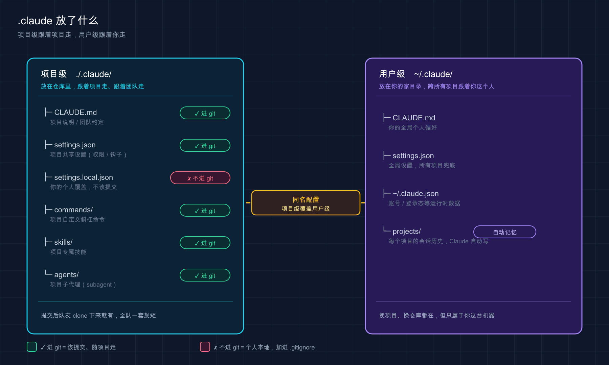

# 13 · 项目结构：Claude Code 在你项目里都放了什么

> 📚 **系列导航**：上一篇 [12 项目初始化](12-project-init.md) 带你跑了 `/init`，给项目生成了第一个 `CLAUDE.md`。这一篇接着往下看——`/init` 之后，你项目里悄悄多出来的那个 `.claude/` 文件夹，到底装了什么、归谁管、要不要进 git。

都说 `.claude` 那个文件夹「不用管，它自己会处理」，但说句实话，**搞懂它你才算真正会用 Claude Code**。

为什么这么讲？因为这套工具几乎所有「高级玩法」——自定义命令、权限控制、子代理、技能——落到磁盘上，全是 `.claude/` 里的几个文件和目录。你不懂它的结构，遇到「为什么我配的权限没生效」「队友拉了代码却没有我的命令」这类问题，就只能干瞪眼。

我刚上手那阵子就干过一件蠢事：图省事，把一个含数据库密码的配置直接写进了 `.claude/settings.json`，跟着 `git push` 一起推上去了。**等我反应过来的时候，密钥已经躺在仓库历史里了**——最后只能改密码、重写历史，折腾了大半个小时。后来我才搞明白，这种东西本该放 `settings.local.json`，那个文件 Claude Code 默认就帮你 gitignore 了。**一个文件放错地方，差别就这么大。**

这一篇不教你每个文件怎么深配（那些留给后面专篇），只干一件事：**给你画一张全景地图**，让你看一眼某个文件就知道「它是干啥的、放哪、归项目还是归我、要不要提交」。

**看完这一篇，你会拿到：**

- 一张 `.claude/` 目录的全景图：每个文件 / 子目录各管什么
- 「项目级」和「用户级」两套配置的根本区别（跟着项目走 vs 跟着你走）
- 一张速查表：哪些该提交 git、哪些必须进 `.gitignore`
- 一个一眼就能上手的动手环节，亲眼看清这两层目录长什么样

---

## 01 先理解一件事：Claude Code 有「两个家」

先给结论：**Claude Code 的配置分两摊放——一摊跟着项目走，一摊跟着你走**。看懂这条，后面全顺。

**类比：公司的「项目档案柜」和你自己的「工位抽屉」。**
项目档案柜（项目级）放的是这个项目所有人都要看的东西——项目规范、谁能动哪些操作，新人来了照着柜子里的资料就能上手。你的工位抽屉（用户级）放的是你个人的习惯——你顺手的快捷方式、你私人的偏好，换个项目这些还跟着你。

落到磁盘上就是两个位置：

| 这一摊 | 在哪 | 影响谁 | 跟着谁走 |
|--------|------|--------|----------|
| **项目级（Project）** | 项目里的 `./.claude/` | 这个仓库的所有协作者 | 跟着项目（提交进 git，团队共享） |
| **用户级（User）** | 你主目录的 `~/.claude/` | 你，在你所有项目里 | 跟着你（在你机器上，从不提交） |

这里有两个术语先点一下：

**项目级（Project scope）**：配置存在仓库里，**进 git，全队共享**。你改了规则提交上去，队友拉下来就同步生效。

**用户级（User scope）**：配置存在你电脑的主目录 `~/.claude/`，**只对你生效、永远不进任何仓库**。你换到公司任何一个项目，这套都跟着你。

举个常见的用法：把「回复用中文」「commit 信息用什么前缀」这类**纯个人偏好**，放在用户级的 `~/.claude/CLAUDE.md` 里——这样打开任何项目，Claude 都按你的习惯来。而「这个项目用 pnpm 不用 npm」这种**项目事实**，写进项目级的 `./CLAUDE.md`，提交上去让全队共享。**个人习惯和项目规范，从一开始就分两个地方放，后面省心。**

> 💡 **一句话总结**：Claude Code 有「两个家」——项目里的 `./.claude/`（跟项目走、进 git、团队共享）和主目录的 `~/.claude/`（跟你走、不进 git、只对你生效）。

---

## 02 打开项目级 `.claude/`：里面都有啥

现在把项目里那个 `./.claude/` 文件夹翻开看看。一个用起来的项目，结构大概长这样：

```text
your-project/
├── CLAUDE.md                ← 项目说明书（也可放 .claude/CLAUDE.md）
├── CLAUDE.local.md          ← 你的个人项目偏好（进 .gitignore）
├── .mcp.json                ← 团队共享的 MCP 服务器配置（进 git）
└── .claude/
    ├── settings.json        ← 团队共享配置：权限、hooks、模型默认值
    ├── settings.local.json  ← 你的个人配置覆盖（自动 gitignore）
    ├── commands/            ← 自定义斜杠命令，每个 .md 一条 /命令
    ├── rules/               ← 模块化的项目规则（CLAUDE.md 拆出来的）
    ├── skills/              ← 技能：可被 /调用 或 Claude 自动调用的工作流
    └── agents/              ← 子代理：各有独立上下文的专项助手
```

逐个说它们是干什么的，**本篇只点到「是什么、归谁管」，深用法各有专篇**：

**`CLAUDE.md` —— 项目说明书。**
Claude 每次进项目**第一个读**的文件。项目是什么、怎么跑、有什么约定，都写这儿。它和 `.claude/settings.json` 有个本质区别：CLAUDE.md 是**给 Claude 看的「指导」**（它读了尽量照做，但不是硬约束），settings.json 是**Claude Code 强制执行的「配置」**。
> 官方提了个细节：`CLAUDE.md` 放项目根目录，或者放 `.claude/CLAUDE.md` 都行——后者能让项目根目录干净点。

**`CLAUDE.local.md` —— 你的个人项目偏好。**
叠在 `CLAUDE.md` 之上、**只与你本人相关**的指令，比如「我本地数据库是 5433 端口」。**要手动加进 `.gitignore`**（跑 `/init` 时选个人选项会帮你加）。

**`settings.json` —— 团队共享的配置中心。**
控制 Claude **能不能**执行某些操作（权限）、在哪些时机跑你的脚本（hooks），还能设这个项目默认用哪个模型。**进 git，是团队的安全基线。**

**`settings.local.json` —— 你的个人配置覆盖。**
和上面同样的 JSON 格式，但**只对你生效、不提交**。你想临时放开个权限、又不想影响队友，就写这儿。**Claude Code 第一次写这个文件时，会自动帮你配 git 忽略它**——这就是开头那个「本该用上、却被漏掉」的文件。
> 这里有个细节官方点了名：它把忽略规则加到的是你**全局**的 `~/.config/git/ignore`（不是项目里的 `.gitignore`），所以你翻项目的 `.gitignore` 是找不到这行的。想让全队都忽略它，得自己再往项目 `.gitignore` 里补一行。

**`commands/` —— 自定义斜杠命令。**
目录里每个 `.md` 文件，就变成一条 `/文件名` 命令。把你反复输入的那段指令存成文件，下次敲 `/` 就能调。官方已将 `commands/` 和 `skills/` 统一为同一底层机制，新建命令推荐用 `skills/`（支持打包附属文件），`commands/` 继续兼容但不再是推荐路径。

**`rules/` —— 模块化的项目规则。**
当 `CLAUDE.md` 写太长（官方建议控制在 200 行内），就把规则按主题拆成 `rules/` 下的多个文件，比如 `testing.md`、`api-design.md`。

**`skills/` —— 技能。**
每个技能是一个**子目录**，里面有个 `SKILL.md`。它既能你手动 `/技能名` 调用，也能让 Claude 根据任务**自动判断**该不该用。

**`agents/` —— 子代理。**
每个 `.md` 定义一个有**独立上下文窗口**的专项助手，主对话脏不到它。适合并行干活或隔离任务。

**`.mcp.json` —— 团队共享的 MCP 服务器配置。**
放在项目根目录，和 `.claude/` 并列。MCP（Model Context Protocol）服务器可以在两个地方配：这里的 `.mcp.json` 是**进 git 给全队共享**的，比如团队都要用的数据库工具或内部 API；而个人的 MCP 配置（比如只你自己在用的工具）存在 `~/.claude.json` 里，不会进任何仓库。**两者的区别就是：项目共享 vs 个人私用**。

> 💡 **一句话总结**：项目级 `.claude/` 里，`CLAUDE.md` / `rules/` 是给 Claude 看的「指导」，`settings.json` 是 Claude Code「强制执行」的配置，`commands/` `skills/` `agents/` 是你给它装的「扩展」。

---

## 03 同样的目录，`~/.claude/` 里也有一套

这是最容易绕晕新手、但其实最简单的一点：**上面那些目录名，在用户级的 `~/.claude/` 里几乎原样再有一份**。

`commands/`、`rules/`、`skills/`、`agents/`、`CLAUDE.md`、`settings.json`——这些在项目里有，在 `~/.claude/` 里也有。区别只有一个：

（用户级 `~/.claude/` 还有几个项目级没有的独有目录——`themes/`、`keybindings.json`、`output-styles/`、`workflows/` 等，留给后续专篇逐一介绍。）

**放在 `~/.claude/` 下的，对你所有项目生效；放在项目 `./.claude/` 下的，只对那一个项目生效。**

举两个用法你就懂了：

- 一个 `/commit-zh` 命令（生成中文 commit 信息），放在 `~/.claude/commands/` 里——**这样在任何项目都能用**，不用每个项目重配一遍。
- 但「部署到公司测试环境」这种命令，明显只跟那一个项目有关，就放进**项目的** `.claude/commands/`，提交上去给全队用。

除了这些「双胞胎」目录，`~/` 主目录下还有两个**只在用户级出现**、而且**你基本不用手动碰**的文件，认个脸就行：

| 文件 / 目录 | 在哪 | 是什么 | 你要不要管 |
|------------|------|--------|-----------|
| `~/.claude.json` | 主目录 | 应用状态：登录态（OAuth session）、主题、个人 MCP 服务器、各项目的信任记录及 UI 偏好 | 基本不碰，靠 `/config` 改 |
| `~/.claude/projects/` | 用户级 | 各项目的会话记录；**自动记忆**就放在它的 `<项目>/memory/` 子目录里 | 不用写，它自己维护 |

这里多说一句**自动记忆（auto memory）**：它和 `CLAUDE.md` 是两套东西。`CLAUDE.md` 是**你写**给 Claude 的指令；自动记忆是 **Claude 自己写**给自己的笔记（比如它摸清了你的构建命令、踩过的坑），存在 `~/.claude/projects/<项目>/memory/` 下，跨会话复用。**这俩别搞混：一个你写、一个它写。**

> 💡 **一句话总结**：`commands/` `skills/` 这些目录项目级和用户级各有一套，区别只是「管一个项目」还是「管你所有项目」；`~/.claude.json` 和 `~/.claude/projects/` 是用户级专属、你基本不用手动碰。

---

## 04 哪些进 git，哪些千万别提交

这一节最实用，开头那个泄露密钥的坑就栽在这。**先给铁律：带「local」的、含密钥的，一律不进 git。**

为什么有的提交有的不提交？逻辑很简单——**团队要共享的就提交，只跟你或你这台机器有关的就别提交**。

**类比：项目档案柜的东西要登记入库（进 git），你工位抽屉里的私人物品不用上交。**

把项目里常见的文件按「该不该提交」分个类，照着这张表办就不会错：

| 文件 / 目录 | 进 git？ | 为什么 |
|------------|:--------:|--------|
| `CLAUDE.md` | ✅ 提交 | 团队共享的项目说明 |
| `.claude/settings.json` | ✅ 提交 | 团队共享的权限 / 配置基线 |
| `.claude/commands/*.md` | ✅ 提交 | 团队复用的标准化命令 |
| `.claude/rules/*.md` | ✅ 提交 | 团队共享的模块化规则 |
| `.claude/skills/`、`.claude/agents/` | ✅ 提交 | 团队共享的技能与子代理 |
| `.claude/settings.local.json` | ❌ 不提交 | 个人覆盖；**Claude Code 自动帮你 gitignore** |
| `CLAUDE.local.md` | ❌ 不提交 | 个人项目偏好；需你手动加进 `.gitignore` |
| **任何含密钥 / token / 密码的文件** | ❌ 绝不提交 | 进了仓库历史就等于泄露 |

几个实用的提醒：

**`settings.local.json` 不用你操心 gitignore。** 官方明确写了：Claude Code 在创建这个文件时，会自动配置 git 忽略它。你想本地临时放开个权限，写这儿最稳。

**`CLAUDE.local.md` 要你自己加 `.gitignore`。** 它和 `settings.local.json` 不一样，不会自动忽略——跑 `/init` 选「个人」选项时会帮你加，否则记得手动加一行。

**密钥永远别硬写进任何配置文件。** 官方推荐的做法是在配置里用环境变量引用，比如写 `${GITHUB_TOKEN}` 而不是把 token 明文贴进去——Claude Code 启动时从你的 shell 环境读，**token 根本不落到文件里**。这条建议雷打不动地执行。

> 💡 **一句话总结**：团队共享的（`CLAUDE.md`、`settings.json`、`commands/` 等）进 git；带「local」的和**任何含密钥的**绝不提交——`settings.local.json` 系统自动帮你忽略，`CLAUDE.local.md` 要你手动加。

---

## 05 配置冲突了听谁的：优先级一张图讲清

你可能已经想到一个问题：**用户级 `settings.json` 和项目级 `settings.json` 都设了同一项，到底听谁的？**

官方给的优先级顺序是这样的（从高到低）：

```text
Managed（组织托管，最高，谁都盖不住）
  ↓
命令行参数（--permission-mode 这类，仅当次会话）
  ↓
Local（settings.local.json）
  ↓
Project（项目 settings.json）
  ↓
User（用户 ~/.claude/settings.json，最低）
```

**记忆口诀：越「具体」、越「靠近当前这次操作」的，优先级越高。** 组织管的 > 你这次命令行临时指定的 > 你这个项目本地的 > 项目共享的 > 你全局默认的。



这张图把两棵树并排摆开：**左边项目级 `./.claude/`（跟着项目走、按需进 git 给团队共享），右边用户级 `~/.claude/`（跟着你这个人走、管你所有项目）**——记住哪棵树管什么，后面配置往哪放就不会乱。

但这里有个**特别容易踩的坑**，必须单独拎出来——**不是所有设置都遵守「覆盖」逻辑**：

| 设置类型 | 多作用域同时存在时 | 例子 |
|----------|-------------------|------|
| **标量值**（单个值） | 取最具体的那个，**覆盖** | `model`：项目设了就用项目的 |
| **数组值**（列表） | 跨作用域**合并**，不覆盖 | `permissions.allow`：用户的 + 项目的 + 本地的**叠加** |

这个区别很容易吃亏：我自己就栽过一次——在用户级 `settings.json` 里 deny 了某个命令，本以为从此全局禁用，结果换到一个项目里它照跑不误，当时我盯着配置看了半天没想通。后来才搞清楚，**权限规则是合并的、不是覆盖的**，项目级 allow 了，会和用户级的规则叠在一起评估。所以**权限别指望靠用户级「一刀切禁掉」**，得搞清楚合并规则。

> 💡 **一句话总结**：优先级从高到低是 Managed → 命令行 → Local → Project → User；但要分清——`model` 这类标量是「覆盖」，`permissions.allow` 这类数组是「合并叠加」。

---

## 06 动手：亲眼看清这两层目录

光看图不如自己扒一眼。下面这套命令**只读不写**，安全得很，照着敲就能把「两个家」看个明白。

**第一步：看你主目录的用户级 `~/.claude/`**

打开终端，敲（Mac / Linux）：

```bash
ls -a ~/.claude
```

Windows PowerShell 用：

```powershell
dir $HOME\.claude
```

**预期**：你会看到 `settings.json`、`projects`、可能还有 `commands`、`skills` 等——具体有哪些取决于你用 Claude Code 多深。**只要列出了东西，就说明用户级这个「家」是存在的、在生效的。**

**第二步：在一个项目里看项目级 `.claude/`**

随便 `cd` 进一个你跑过 Claude Code 的项目（没有的话，回上一篇用 `/init` 建一个），然后：

```bash
ls -a .claude
```

**预期**：至少能看到 `settings.local.json`（你之前批过权限的话），可能还有 `settings.json`。**这就是项目级的「档案柜」，和主目录那个是两套。**

**第三步：验证 `settings.local.json` 确实被 git 忽略了**

在这个项目里（得是个 git 仓库），敲：

```bash
git check-ignore .claude/settings.local.json
```

**预期**：终端**回显出这个文件路径**（`.claude/settings.local.json`），就证明它已经被 git 忽略了——这正是 Claude Code 自动帮你做的。**如果什么都没输出**，说明它没被忽略，你最好手动把这行加进 `.gitignore`。

**第四步（可选）：瞄一眼项目说明书**

```bash
cat CLAUDE.md
```

（Windows PowerShell 用 `type CLAUDE.md`）

**预期**：打印出上一篇 `/init` 生成的内容。**这就是 Claude 每次进项目第一个读的文件**，现在你知道它躺在哪了。

> ⚠️ 一个提醒：`git check-ignore` 只在 git 仓库里有意义。要是这个项目还没 `git init`，这条命令会报 `fatal: not a git repository`，先把它变成 git 仓库再试。

> 💡 **一句话总结**：`ls -a ~/.claude` 看用户级、`ls -a .claude` 看项目级、`git check-ignore .claude/settings.local.json` 验证忽略——三条只读命令，把「两个家」和「谁被 git 忽略」一次看清。

---

## 07 小结

这一篇我们把 Claude Code 在项目里的「家底」摸了一遍。串起来回顾：

| 你记住的 | 具体是什么 |
|----------|-----------|
| **两个家** | 项目 `./.claude/`（跟项目走、进 git）+ 主目录 `~/.claude/`（跟你走、不进 git） |
| **指导 vs 配置** | `CLAUDE.md` / `rules/` 是给 Claude 的指导；`settings.json` 是强制执行的配置 |
| **双胞胎目录** | `commands/` `skills/` `agents/` 项目级和用户级各一套，区别是管一个还是管全部 |
| **git 红线** | 带「local」的、含密钥的，绝不提交；`settings.local.json` 系统自动忽略 |
| **优先级** | Managed → 命令行 → Local → Project → User；标量覆盖、数组合并 |

**你现在应该能：** 打开任何一个项目，看一眼 `.claude/` 里的某个文件就知道它是干什么的、归项目还是归你、要不要提交；也知道配置冲突时该听谁的。**这张全景地图就是后面所有专篇的底图**——之后学 `settings.json` 怎么细配、`CLAUDE.md` 怎么写好、技能和子代理怎么造，你都能在这张图上找到它的位置。

---

下一篇 **14「交互界面与快捷键」**——目录结构这张「静态地图」看明白了，接下来该把 Claude Code 的「操作面板」摸熟了。下一篇带你认全那个界面里每一块、再把最常用的快捷键练成肌肉记忆，让你敲得又快又稳。
