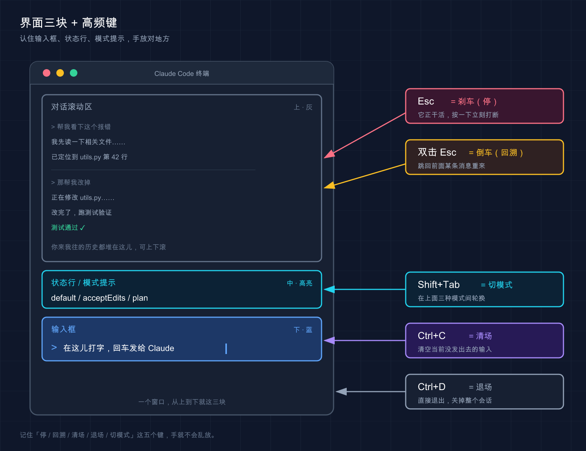

# 14 · 交互界面与快捷键：把手放对地方

> 📚 **系列导航**：上一篇 [13 项目结构](13-project-structure.md) 带你看清 Claude Code 在你项目里都摆了哪些文件。这一篇换个视角——回到那个终端窗口本身，搞懂界面每一块是干嘛的，再把几个能让你「快一倍」的键盘动作焊进肌肉记忆。

「欸，你这 Esc 按一下和按两下不一样？」

「对，差远了。按一下是踩刹车——让 Claude 停下来；按两下是倒车——把整段对话退回到上一个点。」

「……我之前一直当成一个键在用。」

说句实话，这是新手最容易搞混的一句话。Claude Code 的界面看着简单，就一个输入框加几行字，**但底下藏着一整套键盘动作和特殊符号，知道的人用得飞起，不知道的人全靠鼠标和回车硬刚**。我头两周也这样——有一回它顺着我一句模糊的话开始疯狂改一堆文件，我盯着满屏滚动的输出干等了快三分钟，眼看越改越偏，才猛地想起来「我按个 Esc 不就停了吗」，那一刻是真有点想抽自己。

这一篇不教你提需求（那是下一篇的事），只干一件事：**让你把手放对地方**。

**看完这一篇，你会拿到：**

- 一张「界面分区图」——输入框、状态行、模式提示分别在哪、看什么
- 一张能贴在显示器边上的**高频快捷键速查表**（Esc、Ctrl+C、Ctrl+D、Shift+Tab、上箭头……）
- 输入框里 `@` `!` 两个特殊前缀怎么用，外加 `/` 和 `#` 是干嘛的一句话交代
- 多行输入到底怎么打（这个坑太多人踩过）

---

## 01 先看懂这块屏：界面分成哪几部分

先给结论：**Claude Code 的界面，你只需要认住三块——输入框、状态行、模式 / 权限提示**。其他的滚动区域都是它在跟你「说话」，不用专门学。

**类比：看汽车仪表盘。** 你开车不用认全所有指示灯，但方向盘、挡位、油表这几样必须一眼能找到。界面也一样，认住主操作区和几个关键读数就能开走。

`claude` 启动后，从下往上大致是这么个布局：



- **输入框**：最底下那一行，前面通常有个 `>` 提示符。**这是你跟 Claude 说话的唯一入口**，打字、贴代码、敲特殊命令全在这儿。
- **状态行 / 页脚**：紧贴输入框上下的那几行小字。它会显示一些上下文信息——比如当前在哪个目录、有没有后台任务在跑、如果你这个分支有打开的 PR，官方文档说还会在页脚显示一个可点击的「PR #编号」链接，下划线颜色代表审查状态（绿=已批准、黄=待审、红=请求改动、灰=草稿）。
- **模式 / 权限提示**：告诉你现在是「普通模式」还是「计划模式（plan）」还是「自动接受编辑（acceptEdits）」。**这块最该盯**——它决定了 Claude 接下来动手前问不问你。

这里有个新手特别容易慌的场景：**屏幕突然变花、或者一半空白了**。别以为崩了。官方给了个专门的键 `Ctrl+L`，强制重绘屏幕，输入和对话历史都保留。我自己最常撞上的就是在 tmux 里跑 Claude，切到别的窗口办点事、再切回来满屏乱码，第一次遇到我还真以为会话挂了、手都伸到重启上了，后来才知道一个 `Ctrl+L` 就干净了——现在屏幕一花我条件反射就按它。

> 💡 **一句话总结**：界面认住「输入框 + 状态行 + 模式提示」三块就够开工，**屏幕花了别慌，`Ctrl+L` 重绘**。

---

## 02 高频快捷键：像换挡和喇叭，熟了不用低头看

这是本篇的核心。

**类比：车上的换挡杆和喇叭。** 新手开车眼睛老往挡位上瞟，老司机手一搭就知道在几挡，喇叭抬手就按——因为这些动作进了肌肉记忆，不占注意力。快捷键就是这么个东西：**头三天你得照着表按，按熟了，全程手不离键盘，眼睛只盯输出**。

下面这张表，全部按官方 `interactive-mode.md` / `keybindings.md` 核对过，挑的都是新手每天都会用到的。建议你**截图贴在显示器边上**，用一周就记住了：

| 快捷键 | 作用 | 什么时候按 |
|--------|------|-----------|
| **`Esc`** | 中断 Claude 当前的回答或工具调用 | 它跑偏了 / 你想改主意，**刹车**用 |
| **`Esc` `Esc`**（输入框为空时） | 打开回退菜单，跳回上一个点 | 想撤销刚才那轮、**倒车**回存档 |
| **`Ctrl+C`** | 中断；没东西可中断时，第一次清空输入、第二次退出 | 想清掉已经打了一半的输入 |
| **`Ctrl+D`** | 退出 Claude Code 会话 | 干完活，**关门走人** |
| **`Shift+Tab`** | 循环切换权限模式（default / acceptEdits / plan…） | 想让它「先规划别动手」或「放开手脚自己改」 |
| **`↑` / `↓`**（上 / 下箭头） | 翻命令历史（光标在边缘时） | 重发上一条指令，不用重打 |
| **`Ctrl+L`** | 重绘屏幕（保留输入和历史） | 屏幕花了 / 半空白 |
| **`Ctrl+R`** | 反向搜索命令历史 | 想找「我上次那条长指令」 |
| **`Ctrl+O`** | 切换详细转录视图 | 想看它具体调了哪些工具 |

挑三个最容易被搞混的，单独说清楚：

### Esc 一下 vs 两下：踩刹车还是倒车

官方文档把这俩写得明明白白，翻译成人话就是：

- **`Esc` 按一下** = 踩刹车。Claude 正在回答或正在调工具，你一按它就停在当下，**已经做完的部分会保留**，你可以接着补一句重新指挥它。
- **`Esc` 按两下** = 倒车。但有个前提——**输入框必须是空的**。空的时候连按两下 Esc，会弹出回退菜单（就是第 07 篇讲过的检查点 / 回溯），让你跳回之前的状态。

> ⚠️ 这是最坑的一点（官方明确写了）：如果输入框里**有文字**，连按两下 Esc 是「清空这段文字并存进历史草稿」，**不是**打开回退菜单。所以要回退，先把输入框清空。

新手很容易在这上面栽——输入框里打了半句话，想回退，狂按 Esc，结果文字没了、菜单也没出来，一脸懵。搞懂了就好办：**先清空，再双击 Esc**。

### Ctrl+C vs Ctrl+D：清场还是退场

这俩都带点「停」的意思，但完全两码事：

- **`Ctrl+C`** = 清场不离场。有任务在跑就中断任务；没任务时第一次按清掉你输入框里的字，**连按第二次才退出**。
- **`Ctrl+D`** = 直接退场。一下就退出整个会话（它发的是 EOF 信号）。

顺带说个冷知识：这两个键是官方文档里明确标注的「**保留快捷键**」，硬编码、**不能重新绑定**（同一批的还有 `Ctrl+M`，因为它在终端里等于回车）。所以哪个终端、哪个系统，`Ctrl+C` / `Ctrl+D` 的行为都一致，放心用。

### Shift+Tab：一键切换「问不问你」

`Shift+Tab` 大概是日常用得最多的快捷键，没有之一。它在几个**权限模式**之间循环：

- **default（默认）**：动手改文件前会停下问你。
- **acceptEdits（自动接受编辑）**：编辑类操作不再逐个问，提速用。
- **plan（计划模式）**：只出方案不动手，适合大改动前先对齐思路。
- 以及你额外开启的其他模式（如 `auto` / `bypassPermissions`）。

权限模式（Permission Mode），说白了就是「实习生动手前问不问你」的那个开关。

按一下 `Shift+Tab` 就在它们之间转圈，状态行会实时显示你当前在哪个模式。**这套模式具体每个是干嘛、怎么配，第 20 篇「权限配置」专门讲**，这里你只要记住：想换模式，`Shift+Tab` 转就完事了。

（一个平台差异：官方注明在某些 Windows 配置下（不支持 VT 模式的旧版终端、较老的 Node / Bun 运行时），这个键默认是 `Alt+M` 而不是 `Shift+Tab`，遇到不灵的换它试试。）

> 💡 **一句话总结**：`Esc` 一下刹车两下倒车、`Ctrl+C` 清场 `Ctrl+D` 退场、`Shift+Tab` 切「问不问你」——**这四个焊进肌肉记忆，你就出师一半了**。

---

## 03 输入框里的特殊前缀：@ 和 ! 是两把快刀

光会按键还不够。Claude Code 的输入框其实是「智能」的——**某些符号打在开头，会触发完全不同的行为**。官方在「快速命令」里列得很清楚，对新手最有用的是这两个：`@` 和 `!`。

**类比：手机输入法里打 `@` 自动跳出联系人。** 你不用记全名，敲个 `@` 它就把候选人列出来给你选。`@` 在 Claude Code 里也是这个味道，只不过选的是文件。

### `@`：精准点名一个文件 / 目录

直接在输入框里打 `@`，会触发**文件路径自动补全**——它会列出当前项目里的文件让你选，你接着打几个字母过滤，选中即可。

为什么要用它？因为**这是把一个具体文件「钉」进你这句话里最准的方式**。比如你想让它看某个文件：

```text
@src/auth.ts 这里的登录逻辑有没有问题？
```

这么打，Claude 明确知道你指的是哪个文件，不用它自己去猜、去全项目里翻。写复杂指令时基本离不开 `@`——**项目一大，文件重名的多，用大白话说「那个 auth 文件」它经常找错，`@` 一点名就没歧义了**。

### `!`：不打扰 Claude，直接跑个 shell 命令

在输入框开头打 `!`，后面跟一条命令，就进入 **Shell 模式（Bash 模式）**：这条命令**直接在你的终端跑**，不经过 Claude 解释、也不用它批准，跑完的输出还会被加进对话上下文里。

```text
! git status
```

```text
! ls -la
```

这玩意儿什么时候香？**当你想顺手看一眼仓库状态、又不想让 Claude 专门为这跑一趟、烧 token**。比如改到一半，想确认下当前 git 状态，直接 `! git status`，结果立刻出来，而且 Claude 也「看到」了这个输出，下一句它就能接着这个状态聊。

几个官方提到的实用细节：

- 想退出 Shell 模式：按 `Esc`、`Backspace`，或在空提示上按 `Ctrl+U`。
- 它支持基于历史的补全：打一半命令按 `Tab`，能从你这个项目里之前跑过的 `!` 命令补全。

### 那 `/` 和 `#` 呢？

你可能在别处见过这俩，这里一句话交代清楚，别混淆：

- **`/`（斜杠开头）** = 调用命令 / Skill。打一个 `/` 会弹出一长串可用命令（`/help`、`/clear` 等）。**这套斜杠命令体系内容很多，我们留到第 36 篇「斜杠 / 命令」专门展开**，本篇你只要知道「`/` 是命令入口」就够了。
- **`#`（井号开头）** = 历史上有过「用 `#` 开头快速往记忆（CLAUDE.md）里记一条」的用法，**但不同版本行为有差异**。Claude Code 怎么「记住」你的偏好、CLAUDE.md 怎么写，是**第 18 篇「CLAUDE.md 使用指南」和第 25 篇「记忆系统」**的正题，到那儿再系统讲。这里不展开，免得你按了发现版本对不上。

把四个前缀放一起对照，你就不会记串了：

| 开头符号 | 触发什么 | 一句话 | 本篇要不要细讲 |
|---------|---------|--------|--------------|
| `@` | 文件路径自动补全 | 精准点名一个文件 | ✅ 上面讲了 |
| `!` | Shell 模式 | 直接跑 bash，输出进上下文 | ✅ 上面讲了 |
| `/` | 命令 / Skill 菜单 | 控制会话的命令入口 | ❌ 留给第 36 篇 |
| `#` | （与记忆相关，版本相关） | 往 CLAUDE.md 记东西 | ❌ 留给第 18 / 25 篇 |

> 💡 **一句话总结**：`@` 点名文件、`!` 顺手跑命令，这俩是天天用的快刀；`/` 和 `#` 各有专篇，**本篇只认识它们存在就行**。

---

## 04 多行输入：回车老是把话发出去，怎么办

这是个高频「卡点」，单独拎出来讲。

**问题来了**：你想给 Claude 一段比较长的、分好几行的指令，结果**按回车想换行，话却直接发出去了**——半句话就被提交了。新手十个里有八个第一周都中过这招。

原因很简单：**输入框里 `Enter` 默认就是「发送」**，不是「换行」。要换行，得用别的键。官方给了好几种打法，按「最不挑终端」到「最方便」排：

| 打法 | 怎么按 | 适用范围 |
|------|--------|---------|
| **反斜杠转义** | 先打 `\`，再按 `Enter` | **所有终端都行**，记不住别的就记这个 |
| **控制序列** | `Ctrl+J` | 任何终端都行，无需配置 |
| **Shift+Enter** | `Shift+Enter` | iTerm2、WezTerm、Ghostty、Kitty、Warp、Apple Terminal、Windows Terminal**开箱即用** |
| **Option+Enter**（macOS） | `Option+Enter` | macOS 上需先把 Option 配成 Meta 键 |

一个稳妥的习惯：**记死一个 `\` + `Enter` 就够了**——因为它「在所有终端都工作」，换机器、换终端都不用重新适应。等你固定用某个终端了，再去试 `Shift+Enter` 那种更顺手的。

如果你用的是 VS Code、Cursor、Alacritty、Zed、Devin Desktop 这类（它们的内置终端默认不支持 `Shift+Enter` 换行），官方给了个一劳永逸的办法：运行 `/terminal-setup` 自动装上换行绑定。

还有个更舒服的玩法：嫌在小输入框里写长指令憋屈，可以按 `Ctrl+G`，**直接在你的默认文本编辑器里写**，写完保存就带回来了。写那种几十行、带格式的复杂需求时基本都这么干，比在终端里硬敲舒服太多。

> 💡 **一句话总结**：回车默认是「发送」不是「换行」；**换行记死 `\` + `Enter` 万能**，长指令直接 `Ctrl+G` 开编辑器写。

---

## 05 动手：三分钟把这几个键全试一遍

光看不练，明天就忘。下面给一套**最小验证流程**，不依赖任何复杂项目，随便找个文件夹就能跑。打开终端跟着走。

**第一步：进任意一个有文件的文件夹，启动**

```bash
cd ~/Desktop
claude
```

**预期**：出现欢迎界面，最底下是输入框（前面一个 `>`）。

**第二步：试 `!` Shell 模式**

在输入框里打（注意 `!` 顶格开头）：

```text
! echo hello-shortcuts
```

回车。**预期**：终端**直接**打印出 `hello-shortcuts`，并且这条命令和输出被记进了对话——证明 Shell 模式生效了，全程没惊动 Claude 去「解释」。

**第三步：试 `↑` 翻历史**

输入框空着的时候，按一下**上箭头 `↑`**。

**预期**：刚才那条 `! echo hello-shortcuts` 被原样调回输入框里。这就是命令历史，重发指令不用重打。先按 `Esc` 或 `Ctrl+U` 清掉它。

**第四步：试 `Shift+Tab` 切模式**

按一下 `Shift+Tab`，再按一下，再按一下。

**预期**：状态行里的模式提示在 `default` / `acceptEdits` / `plan` 之间循环变化（你启用了哪些模式就在哪些之间转）。**看到那行字在变，就说明你切对了**。多按几下转回 `default`。

**第五步：试多行输入**

打一个字母，然后按 `\` 再按 `Enter`，再打第二行：

```text
第一行 \
第二行
```

**预期**：`\` + `Enter` 让光标**换到了下一行**而不是把「第一行」发出去。这就对了。

**第六步：退出**

按 **`Ctrl+D`**。

**预期**：直接退出 Claude Code，回到普通终端。

跑完这六步，本篇讲的 `!`、历史、`Shift+Tab`、多行、退出，你就全亲手验证过一遍了。

⚠️ 一个可能的小插曲：如果你在 macOS 上发现 `Option+Enter` 之类的 Option 键快捷键不灵，那是终端没把 Option 配成 Meta 键。这是终端设置问题、不是 Claude 的 bug——`\` + `Enter` 永远能用，先拿它顶着。

> 💡 **一句话总结**：照着这六步亲手跑一遍，`!`、`↑` 历史、`Shift+Tab`、`\` + `Enter` 换行、`Ctrl+D` 退出**就全过了一遍肌肉记忆**，比看十遍表都记得牢。

---

## 06 进阶一句：所有键都能改

最后留个钩子。上面这些键全是**默认值**，但 Claude Code 支持自定义快捷键——觉得哪个键不顺手，可以改。

按官方文档（需要 **v2.1.18 或更高版本**，用 `claude --version` 查），运行：

```text
/keybindings
```

会创建 / 打开 `~/.claude/keybindings.json`，你在里面就能重新绑定。不过有几个键改不了——前面说的 `Ctrl+C`、`Ctrl+D` 是硬编码的保留键。

**给新手的建议是：先别急着改。** 默认配置是官方反复打磨过的，先用熟，等你明确感觉到「这个键我每天按、但位置别扭」了，再去动它。一般用上快一个月、才会真正想改某个键，在那之前默认的全够用。

> 💡 **一句话总结**：键不顺手能用 `/keybindings` 改，但**新手先把默认的用熟，别一上来就折腾配置**。

---

## 07 小结

这一篇没教你怎么提需求，专门教你**把手放对地方**——界面看哪、键怎么按、特殊符号怎么用。

把核心动作收成一张表，揣兜里：

| 你想干嘛 | 按这个 |
|---------|--------|
| 让它停下来（保留已做的） | `Esc` |
| 退回上一个点（输入框先清空） | `Esc` `Esc` |
| 清掉输入 / 退出 | `Ctrl+C` / `Ctrl+D` |
| 切「问不问你」的模式 | `Shift+Tab` |
| 翻 / 搜命令历史 | `↑` / `Ctrl+R` |
| 屏幕花了重绘 | `Ctrl+L` |
| 点名一个文件 | `@` |
| 顺手跑条命令 | `!` |
| 多行输入换行 | `\` + `Enter` |

**你现在应该能：** 一眼认出界面的输入框、状态行和模式提示；用 `Esc` 精准刹车、`Shift+Tab` 切权限模式；用 `@` 点名文件、`!` 跑命令；不再被「回车把半句话发出去」坑到。**这些动作熟了之后，你跟 Claude Code 的交互会从「鼠标键盘来回切」变成「手不离键盘」**——效率的差距，就在这儿拉开。

---

下一篇 [**15「怎么提问和给指令」**](15-prompting.md)——手放对地方了，接下来就是「嘴」的功夫了。同样一个需求，会问的人三句话搞定，不会问的人来回扯五轮还跑偏。下一篇咱们就聊：**到底怎么跟 Claude 说话，它才听得准、干得对？**
