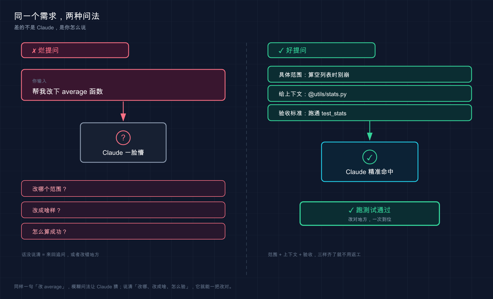

# 15 · 怎么提问和给指令：把话说到 Claude 心坎里

> 📚 **系列导航**：上一篇 [14 交互界面与快捷键] 教你把手指放对地方——光标、回车、Esc、斜杠命令都熟了。这一篇换个层面：手知道往哪按了，**嘴还得知道怎么说**。同样一个需求，话说得好不好，Claude 干出来的活儿天差地别。

说句不太中听的实话：很多人刚上手 Claude Code 那阵子，**都把它当搜索引擎使**。

设想这样一个场景：项目里一个函数报错，你啪地甩过去一句「**修一下这个 bug**」，连哪个文件、什么报错都没说，回车，等着看戏。结果它「猜」了个它以为的 bug，改了三个文件，**没一个是你真正想修的那处**。你盯着满屏 diff 一脸懵，心里还嘀咕「这 AI 不行啊」。

回头一想就明白了——**不行的不是它**。问题压根不在 Claude，在那句话太烂：信息量约等于零，它只能靠脑补。脑补错了，能怪谁？

这么说吧：**Claude Code 的天花板，很大程度上是被你的提问方式锁死的**。同一个模型、同一个项目，会提需求的人三句话搞定，不会提的人来回返工五轮还一肚子火。今天就把「怎么把一句话需求说清楚」这套通用说话法则给你讲透——**不是教你背模板，是教你想明白「Claude 到底需要知道什么才不跑偏」**。

**看完这一篇，你会拿到：**

- 一张「烂提问 vs 好提问」对照表，照着改，返工率立降
- 四条提需求的硬核心法：具体、给上下文、给验收标准、复杂任务先列计划
- `@` 引用文件把范围圈准的正确姿势
- 一个可照做的「同一需求两种说法」实验，亲眼看出差距

---

## 01 烂提问到底烂在哪

把上面那次翻车摊开看。「修一下这个 bug」这句话，**站在 Claude 的角度，信息缺得离谱**：

- 哪个 bug？它得自己猜你说的是哪处。
- 哪个文件？它得满项目翻。
- 期望的正确行为是啥？它根本不知道，只能按「一般来说应该怎样」脑补。

**类比：带新人。** 你跟一个刚入职的实习生说「把那个东西弄一下」，他能弄对才有鬼。换成「把首页右上角那个登录按钮，颜色从灰色改成品牌蓝 `#1A73E8`」，他闭着眼都能做对。**指令越具体，新人越不跑偏；你越是甩一句模糊的，他越得猜，猜错的概率越大。** Claude 一模一样。

来看官方文档里反复强调的这组对照（按官方的意思译成了中文）：

| 场景 | ❌ 烂提问 | ✅ 好提问 |
|------|---------|---------|
| **修 bug** | 「修一下登录的错误」 | 「用户报告会话超时后登录失败。检查 `src/auth/` 里的认证流程，重点看 token 刷新。先写一个能复现问题的失败测试，再修它」 |
| **写测试** | 「给 `foo.py` 加测试」 | 「给 `foo.py` 写测试，覆盖用户已登出的边界情况，别用 mock」 |
| **问代码** | 「`ExecutionFactory` 这破 api 怎么设计成这样？」 | 「翻一下 `ExecutionFactory` 的 git 历史，总结它的 api 是怎么一步步演变成现在这样的」 |
| **加功能** | 「加个日历组件」 | 「先看主页上现有组件怎么实现的，`HotDogWidget.php` 是个好例子。照这个模式实现一个日历组件，让用户选月份、能前后翻年。除了代码库里已有的库，别引新库」 |

看出门道没？**好提问全在干一件事：把 Claude 本来要靠猜的东西，提前喂给它。**

> 💡 **一句话总结**：烂提问烂在「信息缺口全靠 Claude 脑补」，**好提问就是把它要猜的，你提前说清楚**。



这张 Before/After 把同一个需求的两种问法摆到一起：**左边模糊提问，Claude 只能脑补、反问一堆；右边把范围、上下文（`@文件`）、验收标准三件套给齐，它一次命中、直接跑测试通过**。差距不在 Claude，在你怎么说。

---

## 02 心法一：具体 > 模糊

这是四条心法里最重要的一条，没有之一。

官方文档里有句话特别值得记住，原话是：

> 你的指令越精确，你需要的更正就越少。

翻译成大白话：**前面多说一句，后面少返工三轮。** 你以为「省事」是少打几个字，其实少打的那几个字，最后都变成来回拉扯的代价加倍还给你。

**具体到什么程度？** 三个维度往里塞：

**第一，圈定范围**——哪个文件、哪个函数、哪个场景。别让它满项目大海捞针。

**第二，说清约束**——「别引新库」「保持向后兼容」「别动测试文件」。你不说，它就按自己的偏好来，回头未必合你心意。

**第三，指个参照**——「照 `HotDogWidget.php` 那个模式来」。这招实测下来最省心：**与其用语言描述你想要的风格，不如直接甩给它一个你已经满意的现成例子**，它照着抄，八九不离十。

> 这里有个反直觉的例外得讲清楚：**模糊提问不是绝对的错。** 当你在「探索阶段」、自己也没想好方向时，一句开放的「你觉得这个文件有什么可以改进的？」反而能炸出一些你压根没想到要问的东西。官方原话叫「当你在探索并能够改正方向时，模糊的提示可能很有用」。**规律是：要结果时往死里具体，找灵感时故意留白。**

做一个小工具的时候很容易踩到这个边界——一开始就想看看 Claude 怎么理解那摊乱代码，故意问得很泛，它给的几个改进点确实有启发；可一旦心里有了明确目标，再用模糊提问就纯属浪费回合了，它每次都得重新猜你到底要啥。

> 💡 **一句话总结**：要确定结果就往死里具体（范围 + 约束 + 参照），**只有在主动找灵感时才故意留白**。

---

## 03 心法二：给上下文，别让它瞎猜

具体之外，第二招是**把「料」直接喂到它嘴边**，而不是用嘴描述「料」在哪。

最高频的两个动作，记住就够用一大半：

**第一，用 `@` 引用文件。** 在输入框打 `@`，会弹出文件路径补全，选中后**这个文件的完整内容会被直接塞进对话**——Claude 不用先去找、再去读，省一步还不会找错。

```text
参考 @src/types/user.ts 里的类型定义，给 UserService 补上类型注解
```

这比「项目里有个 user 类型文件，你去找找」靠谱一万倍。官方文档明确写了 `@` 引用「在响应前读取文件的完整内容」。

**类比：USB 接口。** `@` 就像把一块「文件 U 盘」直接插进 Claude 的工作台——插上即用，它要的资料一秒到位；你光用嘴说「资料在三楼档案室第二个柜子」，它还得自己跑一趟，跑错了更耽误事。

**第二，报错直接整段贴。** 这条值得练成肌肉记忆——遇到 traceback，**别概括「它报了个空指针」，把完整堆栈原样糊进去**：

```text
运行时报了这个错，帮我定位原因：
TypeError: Cannot read properties of null (reading 'userId')
    at getUserProfile (src/services/user.ts:42:18)
    at async ProfileController.getProfile (src/controllers/profile.ts:15:20)
```

为啥要整段贴？因为堆栈里**文件名、行号、调用链全有**，Claude 顺着 `user.ts:42` 就能精准定位。你概括一遍，等于把这些关键坐标全删了，它又得从头猜。

| 你想给的料 | ❌ 用嘴描述 | ✅ 直接喂 |
|-----------|-----------|---------|
| 某个文件的内容 | 「项目里有个处理认证的文件」 | `@src/auth/session.ts` |
| 一段报错 | 「它报了个 undefined 的错」 | 把完整 traceback 原样贴进去 |
| 一个 UI 问题 | 「按钮位置不对」 | 直接粘截图（Claude 支持读图） |
| 一份接口规范 | 「按我们的 API 规范来」 | `@docs/api-spec.md` |

一句话：**凡是能「贴」的，绝不用「说」。** Claude 读原始材料，永远比读你对材料的二手转述准。

> 💡 **一句话总结**：用 `@` 把文件、用粘贴把报错和截图**直接怼到它面前**，别让它顺着你的描述去猜。

---

## 04 心法三：给一个「可验证」的成功标准

这条最容易被忽略，但威力巨大：**你得让 Claude 知道「干成什么样算成功」，而且这个标准最好它自己能验。**

为什么关键？官方文档点破了底层逻辑——

> 当工作看起来完成时，Claude 会停止。没有它可以运行的检查，「看起来完成」是唯一可用的信号，你成为验证循环：每个错误都在等待你注意到它。

啥意思？你不给标准，Claude 凭「感觉差不多了」就收工，**真正帮它兜底验收的人是你**，每个漏洞都得你亲自逮。可一旦你给它一个能跑出「通过 / 失败」的检查，**这个循环就自己闭合了**：它干完 → 跑检查 → 看结果 → 没过就接着改，根本不用你盯。

对比一下就懂了：

| 任务 | ❌ 没验收标准 | ✅ 给了可验证标准 |
|------|------------|---------------|
| 写函数 | 「实现一个校验邮箱的函数」 | 「写一个 `validateEmail` 函数。示例用例：`user@example.com` 为真、`invalid` 为假、`user@.com` 为假。写完跑测试」 |
| 改 UI | 「让这个仪表盘好看点」 | 「[贴设计稿] 照这个实现，然后对结果截图、跟原稿比对，列出差异并修掉」 |
| 修构建 | 「构建挂了」 | 「构建报这个错：[贴报错]。修它并验证构建通过。解决根本原因，别把错误压下去」 |

注意最后一行那句「**解决根本原因，别把错误压下去**」——这是吃过亏才学会加的一句。不写这句，它有时候会图省事直接给你 `try/except` 一裹、或者加个 `@ts-ignore` 把红线消掉，**报错是没了，病根还在**。

**进阶玩法：`/goal` 把验收标准变成「不达标不收工」。**（需要 Claude Code v2.1.139 或更高版本）普通提问里写验收标准，是「这一轮跑一下」；而 `/goal` 是把标准**钉成整个会话的目标**——每跑完一轮，一个小模型（默认 Haiku）会按你的条件复查一遍，**没达成就自动开下一轮，不把控制权还给你**，直到条件满足才停。

```text
/goal test/auth 里所有测试通过，并且 lint 这步是干净的
```

有个用 `/goal` 的关键细节别踩坑：**那个评估小模型只看 Claude 在对话里「展示」出来的东西，它自己不会去跑命令、读文件**。所以你的条件得是 Claude 自己的输出能证明的——「`test/auth` 测试全过」之所以成立，是因为 Claude 会真的去跑测试，结果打印在对话里，评估模型才读得到。**你写「代码质量很高」这种没法从输出里看出来的，它判不了。**

> 💡 **一句话总结**：给它一个能跑出通过 / 失败的检查（测试、截图比对、构建退出码），**循环就自己闭合**；想让它「不达标不撒手」，上 `/goal`。

---

## 05 心法四：复杂任务，先让它列计划再动手

最后一条，专治「大活儿」：**遇到改动大、跨多文件、或者你自己也吃不准方向的任务，别让它上来就闷头写——先让它列个计划，你过一眼再放行。**

这事第 06 篇（套餐与计费）埋过伏笔，这里说透为什么。官方文档的判断很干脆：

> 让 Claude 直接跳到编程可能会产生解决错误问题的代码。

说白了，**先探索、再规划、最后编程**——把「想清楚」和「动手干」拆开，免得它在错误的方向上一路狂奔，等你发现时已经改了一堆。

**类比：装修先出图纸再砸墙。** 没有哪个靠谱师傅二话不说抄起锤子就砸承重墙。他得先跟你确认「这面墙拆、这里走线、水管改道」，你点头了再开工。**计划，就是 Claude 砸墙前递给你的那张图纸**——图纸上发现不对，改两笔的成本，远低于墙都砸了再返工。

怎么让它先出图纸？两个办法：

**办法一，嘴上说清「先别改」。** 在普通对话里加一句限定就行：

```text
我想给设置页加个深色模式开关。先告诉我要动哪些文件、改动思路是什么，
这一步先别改任何代码。
```

**办法二，切到 Plan Mode（计划模式）。** 这是 Claude Code 专门的「只读规划」档——它会读文件、提方案，**但你批准前它一个字都不落盘**。进入方式：会话里按 `Shift + Tab`（按一两下循环到 Plan Mode），模式会在 `default → acceptEdits → plan` 之间轮转。如果只想让某一条提示用 Plan Mode 跑、不切换整个会话，在那条消息前加 `/plan` 前缀即可。

不过官方也给了个很实在的提醒，**别走极端把啥都拿去规划**：

> 对于范围明确且修复很小的任务（如修复拼写错误、添加日志行或重命名变量），要求 Claude 直接执行。当你对方法不确定、更改修改多个文件或你不熟悉被修改的代码时，规划最有用。**如果你能用一句话描述 diff，跳过计划。**

最实用的土办法就是这最后半句：**「能不能一句话说清这次改完长啥样？」能，直接干；卡壳了，说明这活儿够复杂，先让它列计划。** 改个错别字也走 Plan Mode，纯属给自己加戏。

> 💡 **一句话总结**：拿不准 / 跨多文件 / 不熟的代码 → 先让它列计划（一句「先别改」或 `Shift+Tab` 进 Plan Mode）；**一句话能说清 diff 的小活儿，直接干**。

---

## 06 动手：同一个需求，两种说法见真章

光听道理不解渴，咱们做个**能亲眼看出差距**的小实验。准备一个三行的玩具文件就行，不依赖你任何现成项目。

**第一步：建个有「坑」的玩具文件**（Mac / Linux）

```bash
mkdir prompt-demo
cd prompt-demo
echo 'def average(nums):
    return sum(nums) / len(nums)' > stats.py
```

Windows 用户：`mkdir prompt-demo`、`cd prompt-demo` 照敲，`stats.py` 用记事本新建并贴入那两行。

**这个函数有个坑**：传进来空列表 `[]` 时，`len(nums)` 是 0，会触发「除以零」崩溃。我们就拿它当试验田。

**第二步：在项目目录里启动 Claude**

```bash
claude
```

**预期**：出现欢迎屏幕，底部有输入框。

**第三步：先用「烂提问」，感受一下它怎么脑补**

```text
@stats.py 帮我改改这个函数
```

**预期**：Claude 大概率会「猜」你想干啥——也许加类型注解、也许加文档字符串，**但它不知道你真正在意的是那个空列表崩溃**，方向全凭运气。这就是模糊提问的代价：**它在替你做决定。**

**第四步：换「好提问」——具体 + 上下文 + 验收标准三件套全上**

```text
@stats.py 里的 average 函数有个 bug：传入空列表时会因为除以零而崩溃。
期望行为是空列表返回 0。
帮我修复，并补一个测试：average([]) 应该返回 0、average([2, 4]) 应该返回 3。
写完把测试跑一遍，确认通过。
```

**预期**：这一次 Claude 的动作链条清清楚楚——定位空列表分支 → 加上判空返回 0 → 写出你点名的两个测试用例 → 真的去跑测试 → 把通过结果摆给你看。**它不再猜你要啥，因为你把「修哪、改成怎样、怎么算成功」全说死了。**

**第五步：退出，看改动落没落地**

```bash
cat stats.py
```

（Windows PowerShell 用 `type stats.py`）

**预期**：`stats.py` 里出现了对空列表的判断（类似 `if not nums: return 0`）。**和你第四步要求的对得上 = 你已经摸到「把话说清」的手感了。**

把两次提问并排放一起，差距一目了然：

| | 第三步 ❌ 烂提问 | 第四步 ✅ 好提问 |
|---|------------|--------------|
| 改哪 | 没说，它满文件猜 | 点名 `average` 函数 |
| 改成啥样 | 没说，凭它发挥 | 空列表返回 0，写死了 |
| 怎么算成功 | 没标准，它「感觉」完了就停 | 两个测试用例 + 跑一遍验证 |
| 你的体验 | 盯着 diff 纳闷「这不是我要的」 | 它按你的剧本演，一遍过 |

> 💡 **一句话总结**：同一个文件、同一个 bug，烂提问让 Claude 替你做决定，好提问把「改哪、改成怎样、怎么算成功」全说死——**亲手跑一遍这两步，差距比看十遍道理都直观**。

---

## 07 小结

这一篇就讲了一件事：**怎么把一句话需求，说到 Claude 能精准接住。**

四条心法收个口，背不下来就记这张表：

| 心法 | 一句话 | 怎么落地 |
|------|--------|---------|
| **具体 > 模糊** | 范围 + 约束 + 参照都说清 | 「改 `average`，别引新库，照 `xxx` 的模式」 |
| **给上下文** | 能贴的绝不用嘴说 | `@文件`、整段贴报错、粘截图 |
| **给验收标准** | 让它自己能验「成没成」 | 给测试用例、要它跑一遍；狠的上 `/goal` |
| **先列计划** | 大活儿先看图纸再砸墙 | 一句「先别改」或 `Shift+Tab` 进 Plan Mode |

**你现在应该能：** 把一句模糊的「帮我改改」翻译成 Claude 真正接得住的需求——圈准范围、喂足上下文、给出可验证的成功标准，复杂的还会先让它列计划。**这套说话法则，是你之后用 Claude Code 一切操作的「内功」**——功能再花哨，喂进去的提问烂，出来的活儿也好不了。

> 反过来想一个问题留给你：既然「把话说清」这么重要，那有些规矩（比如「这个项目永远别引新库」「测试一律放 `tests/` 目录」）你**每次都得重说一遍**吗？有没有办法让 Claude「记住」，省得天天复读？

---

下一篇 **16「常见工作流」**——这一篇教的是「怎么把一句话说清」的通用法则，下一篇就把它落到四类最高频的具体活儿上：探索陌生代码库、修 bug、重构、写测试，每一类给你一套能照搬的标准打法。法则有了，该看招式了。
