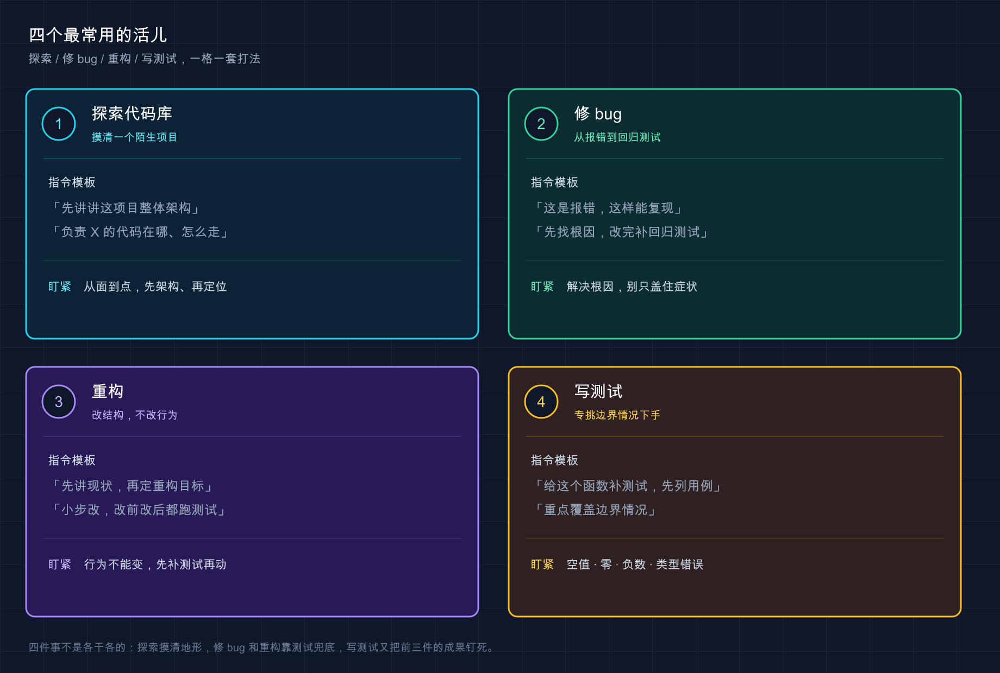

# 16 · 四个最常用的活儿：探索代码库、修 bug、重构、写测试

> 📚 **系列导航**：上一篇 [15 怎么提问和给指令] 教你「话怎么说」——把模糊需求拆成精确指令。这一篇换个角度：日常 80% 的活儿就那四类，**每一类我给你一个能直接抄的指令模板**，照着填空就能用。

兄弟们，今天聊点最实在的。

你回想一下，自己天天对着代码到底在干啥？说白了翻来覆去就四件事：**接手一个看不懂的项目、修一个莫名其妙的 bug、把一坨烂代码重构干净、给某个函数补上测试**。别的需求当然也有，但这四类加起来，占了咱们日常时间的大头。

上一篇讲的是通用的「说话技巧」，这一篇要落到具体场景——**这四类活儿各有各的标准打法，套路是固定的**。用 Claude Code 用久了，最后沉淀下来的就是四个模板，存在备忘录里，遇到对应场景直接调出来填空。

这么说吧：**通用技巧是内功，这四个模板是招式**。内功你已经练过了，今天把招式给你。

**看完这一篇，你会拿到：**

- 四类高频任务（探索 / 修 bug / 重构 / 写测试）各一个可直接复制的指令模板
- 每一类「为什么这么打」的关键道理，不是死记模板
- 一张四类任务的速查卡，存下来随用随调
- 一个能照着跑、给了预期输出的完整实战（拿一个真 bug 走一遍修复流程）

---

## 01 先认住：四种活儿，四把工具

动手之前，先把这四类活儿的「性格」分清楚。它们对 Claude 的要求完全不一样，**用错套路，效果差一大截**。

**类比：工具箱里的四把工具，认准各自的用途。** 螺丝刀用来拧螺丝，扳手用来拧螺母，你拿扳手去拧螺丝当然别扭。探索、修 bug、重构、写测试，就是四把不同的工具——**关键不是「会不会用 Claude」，而是「这活儿该掏哪把工具」**。

它们最核心的区别在一个维度上：**这活儿动不动你的代码？**

| 活儿 | 动代码吗 | Claude 主要在干啥 | 你最该盯的 |
|------|---------|------------------|-----------|
| **探索代码库** | 不动（只读） | 读文件、给你讲 | 它讲得对不对 |
| **修 bug** | 动 | 定位根因 + 改 | 根因找对没、回归测试有没有 |
| **重构** | 动（但行为不变） | 等价改写 | 改完行为有没有变 |
| **写测试** | 加文件 | 生成测试 + 覆盖边界 | 边界情况（edge case）覆盖全没 |

看出来没？**探索是零风险的**（它只读不写），所以可以放心大胆问；**修 bug 和重构是动刀的**，得让它先讲清楚再动手；**写测试介于两者之间**，它新建文件不碰你原有代码，但你得盯它有没有偷懒只测「正常情况」。

记住这张表的判断逻辑，下面四节就是把每一把工具拆开教你怎么握。

> 💡 **一句话总结**：四类活儿先按「动不动代码」分清性格——**探索零风险随便问，动刀的活儿先让它讲再让它改**。

---

## 02 探索陌生代码库：从大到小，三层问下去

先说最高频的场景：**你接手一个完全陌生的项目，第一件事是搞懂它**。

这事儿以前怎么干？打开文件夹，对着几十个目录发懵，一个个点进去看，看俩小时还是云里雾里。**现在不用了——Claude Code 把当前目录当工作区，它能自己读遍整个项目，你只管问**。

**类比：新到一家公司，你不会一上来就钻进某个模块的源码，而是先找老员工问三层。** 第一层「咱们公司整个是做什么的、大架构长啥样」；第二层「负责支付的那块代码在哪儿」；第三层「一笔订单从下单到扣款，代码是怎么走的」。**从大到小、从面到线**，这就是探索的标准节奏。

按官方文档的演示，这三层分别对应三类问题：

```text
给我一个这个代码库的整体概览，说说它的主要架构模式
```

```text
负责用户认证的代码在哪些文件里？这几个文件是怎么协同工作的？
```

```text
追踪一下登录流程，从前端一直到数据库是怎么走的
```

**一个稳妥的习惯是，前两层一定在 Plan Mode（规划模式）里问**——也就是上手前连按两次 `Shift+Tab` 切到规划模式（第一次进 acceptEdits，第二次才到 plan）。为啥？因为探索阶段我们只想让它读和讲，**不想它一激动就开始改文件**。Plan Mode 下它不会动你的源码，问得再多也不会改你一行代码。

比如接手一个三万行的老 Go 项目，第一天就可以这么干：先来一句「整体概览」摸清分了几个服务，再「负责 X 的代码在哪」逐个定位，最后挑核心链路「追踪一下这个请求怎么走的」。**半天就能摸到门道，搁以前没两三天下不来**。

这里直接给你**探索模板**，三层问题填好关键词就能用：

```text
我刚接手这个项目，帮我快速上手。分三步：
1. 给我整体架构概览，说清主要模块和它们的职责
2. 负责 [你关心的功能，如「订单支付」] 的代码在哪些文件里
3. 追踪 [某条核心流程，如「一笔订单的创建到支付」] 的完整执行路径
用新手能懂的方式讲，先别改任何代码。
```

> 💡 **一句话总结**：探索就一个节奏——**从大架构到具体文件再到执行链路，从大到小三层问下去**，前两层在 Plan Mode 里问最稳。

---

## 03 修 bug：贴报错 → 找根因 → 改 → 加回归测试

修 bug 是另一类高频活儿，也是**最容易翻车的一类**。

为啥容易翻车？因为新手最常犯的错是：**贴个报错就甩一句「帮我修一下」，然后 Claude 给你一个「能让报错消失」的修法**。注意，「报错消失」不等于「问题解决」——很多时候它只是把症状盖住了，根因还在那儿埋着，下次换个姿势又炸。

**类比：身上疼去看医生。** 你不会进门就说「给我开点止疼药」，你会说清楚「哪儿疼、什么时候开始疼、做什么动作会更疼」，让医生**先诊断病因，再开方子**。修 bug 一模一样——**先让它找根因，别让它急着「止疼」**。

官方最佳实践里反复强调一条铁律，值得你贴墙上：

> 修复它并验证构建成功。**解决根本原因，不要抑制错误。**

所以正确的修 bug 流程是四步，缺一不可：

1. **贴报错 + 复现步骤**：完整的报错信息、堆栈，外加「我做了什么才触发的」
2. **让它定位根因**：先别让它改，让它说清楚「为什么会错」
3. **给修复**：根因对了，再让它动手改
4. **加回归测试**：补一个能复现这个 bug 的测试，**保证以后不再犯同样的错**

第四步是新手最容易漏的，但**恰恰是最值钱的一步**。官方的提法很妙：让 Claude「**写一个失败的测试来复现问题，然后再修它**」——这样修完测试自动变绿，等于给这个 bug 上了把锁，以后谁再不小心改回去，测试立刻报警。

这个亏很多人都吃过。比如修一个日期解析的 bug，当时 Claude 三下五除二改好了，看报错没了就提交了。结果两周后另一个同事重构时把那行又改回去了，**同样的 bug 原地复活**——因为当初没留测试，没人知道那行代码碰不得。所以修任何 bug 都该带上第四步。

直接给你**修 bug 模板**：

```text
我遇到一个 bug。
报错信息：[完整粘贴报错和堆栈]
复现步骤：[我做了什么才触发，是偶发还是必现]
请你：
1. 先定位根本原因，解释为什么会出错，先别改代码
2. 给我修复方案，解决根因，不要只是把报错盖住
3. 改完补一个能复现这个 bug 的回归测试，跑一遍确认通过
```

> 💡 **一句话总结**：修 bug 四步走——**贴报错和复现步骤、先找根因、再改、最后补回归测试**；少了回归测试这把锁，同一个 bug 迟早复活。

---

## 04 重构：先讲现状 → 定目标 → 小步改 → 改前改后都测

重构这活儿，**风险最高，因为它动的是「没坏的代码」**。

修 bug 好歹有个明确的「修好了」标准——报错没了、测试绿了。重构没有，重构的目标是「代码更干净，但**行为一个字都不能变**」。一旦行为变了，你就是在重构的名义下偷偷引入 bug，**这是最坑的一种 bug，因为没人会去测一段「只是整理了一下」的代码**。

**类比：给一个住人的房子重新装修，但不能让住户搬出去。** 你得保证水电照常、人照住，只是把墙刷新、把线理顺。重构就是「带住户装修」——**功能（住户的生活）必须全程不受影响**。

所以重构的安全打法是四步，核心是「**用测试把行为锁死**」：

1. **先让它解释现状**：搞清楚这段代码现在到底在干啥、有哪些隐藏行为
2. **说清重构目标**：你要的是「拆函数」「换现代写法」还是「去重复」？说具体
3. **小步改**：官方明确建议「以小的、可测试的增量进行重构」，**别让它一次性推翻重写**
4. **改前改后测试都过**：重构前先跑一遍测试存个基准，改完再跑，**两次结果必须一致**

第四步是重构的命根子。**如果这段代码现在没测试，那重构第一步不是改，而是先补测试**——先用测试把「现在的行为」拍下来当快照，重构后对着快照验，行为没变才算成功。这点跟官方最佳实践完全一致：给 Claude 一种能验证自己工作的方式，否则「看起来对」就是唯一信号，**而看起来对的重构，恰恰最容易藏雷**。

这里有个值得守的硬规矩：**没有测试覆盖的代码，别让 Claude 直接重构**。设想一下图快的场景，让它重构一个没测试的工具函数，它把一个边界分支「优化」掉了——那个分支看着像废代码，其实处理了一种罕见输入。**线上炸了才发现**。一律先补测试再重构，慢是慢一点，但再不会翻车。

直接给你**重构模板**：

```text
我想重构 [文件 / 函数名]。
重构目标：[具体说，如「拆成更小的函数」「换成现代写法」「消除重复」]
要求：
1. 先解释这段代码现在的行为，包括容易忽略的边界情况
2. 如果它还没有测试，先补上覆盖现有行为的测试
3. 小步重构，保持对外行为完全不变
4. 重构前后都跑一遍测试，确认结果一致
```

> 💡 **一句话总结**：重构的命根子是「**行为不能变**」——先讲现状、再定目标、小步改，**用改前改后都过的测试把行为锁死**；没测试就先补测试再动手。

---

## 05 写测试：重点是逼它覆盖边界情况

最后一类：**给代码补测试**。

写测试这事儿，Claude 干起来其实很顺手——它会去翻你现有的测试文件，照着你已经在用的框架、断言风格写，**风格自动对齐，不用你教**。但有个坑你必须知道：**你不特别交代，它默认只测「正常情况」**。

什么叫只测正常情况？比如一个除法函数，它给你测「6 除以 2 等于 3」——对是对，但**除以 0 呢？传进来负数呢？传个 null 呢？** 这些「边界情况（edge case）」才是真正会出 bug 的地方，也是测试最该覆盖的地方。

**类比：招个人来给产品做质检，你不能只让他试「正常操作」。** 真正值钱的质检是去试那些「作妖」的输入——空的、超长的、负的、乱码的。**会出问题的永远是边界，不是正常路径**。写测试的核心，就是逼 Claude 去测这些边界。

所以写测试模板的关键，就一句话：**显式要求它覆盖边界情况**。官方最佳实践给的好提示长这样——明确说清「测哪个函数、测什么场景、要不要 mock」：

> 为 foo.py 编写测试，涵盖用户已注销的边界情况。避免 mock。

对照一下两种问法，差距一目了然：

| ❌ 模糊问法 | ✅ 精确问法 |
|-----------|-----------|
| 「给这个函数写测试」 | 「给 `divide` 函数写测试，**重点覆盖除数为 0、负数、非数字输入**这几种边界情况」 |
| 它只测正常路径，覆盖率虚高 | 它把真正会炸的地方都测到 |

还有个小技巧：用 `@` 把目标文件直接点给它（写 `@src/utils/math.py`），它会先读完整文件再动手，**比你用文字描述「那个 math 文件里的 divide 函数」精准得多**。`@` 引用的用法前面篇章讲过，这里正好派上用场。

直接给你**写测试模板**：

```text
给 @[文件路径] 里的 [函数名] 写测试。
要求：
1. 沿用项目现有的测试框架和断言风格
2. 重点覆盖边界情况：[列出你能想到的，如「空输入、零、负数、超大值、类型不对」]
3. 也帮我想想还有哪些我没列到的边界情况，一并测上
4. 写完跑一遍，有失败的修到通过
```

第 3 点是额外加的一招——**主动让它帮你补漏**。官方文档也提到，Claude 能分析代码路径、找出你可能遗漏的边界。写测试时基本都该带这句，**它经常能揪出你压根没想到的输入组合**，比一个人闷头列全多了。

> 💡 **一句话总结**：写测试别只说「写测试」——**显式逼它覆盖边界情况**（空值、零、负数、类型错误），再让它帮你补你没想到的边界，正常路径反而最不重要。

---

## 06 动手：拿一个真 bug 走一遍修复流程

光看模板不算会，得跑一遍。下面用「修 bug」这一类做实战——**它四步最全，跑通它，另外三类你自然就会套**。这里特意埋了个真 bug 给你修。

**第一步：建一个带 bug 的玩具项目**（Mac / Linux）

```bash
mkdir bug-demo
cd bug-demo
echo 'def average(numbers):
    return sum(numbers) / len(numbers)' > calc.py
```

Windows 用户：`mkdir` 和 `cd` 照敲，`calc.py` 用记事本新建，贴入上面那两行 Python。

这个 `average` 函数算平均值，看着没毛病——**但传进去一个空列表，它会除以 0 崩掉**。这就是我们要修的 bug。

**预期**：`bug-demo` 文件夹里有个 `calc.py`，内容是 `average` 函数那两行。

**第二步：启动 Claude Code**

```bash
claude
```

**预期**：出现欢迎屏幕，底部有输入框。

**第三步：套用修 bug 模板，贴报错让它修**

在输入框里敲（这就是把第 03 节模板填好的样子）：

```text
我遇到一个 bug。
报错信息：调用 average([]) 时报 ZeroDivisionError: division by zero
复现步骤：给 calc.py 里的 average 函数传一个空列表就必现
请你：
1. 先定位根本原因，解释为什么会出错，先别改代码
2. 给我修复方案，解决根因，不要只是把报错盖住
3. 改完补一个能复现这个 bug 的回归测试，跑一遍确认通过
```

**预期**：Claude 会先告诉你根因——**空列表时 `len(numbers)` 是 0，除以 0 就崩了**；然后给一个 diff（比如空列表时返回 0 或抛一个更清楚的异常），停下来等你批准；批准后它还会新建一个测试文件（像 `test_calc.py`），里面有一条专门测空列表的用例。

**第四步：批准改动，看它跑测试**

看懂 diff 后选「同意 / Yes」。Claude 会接着运行刚写的测试。

**预期**：终端里能看到测试结果，类似：

```text
test_calc.py::test_average_empty_list PASSED
test_calc.py::test_average_normal PASSED
```

**看到测试全绿 = 这个 bug 被修好了，而且上了锁**——以后谁再把这行改回去，测试立刻变红报警。

**第五步：退出，确认文件真的改了**

退出 Claude（敲 `exit` 或按 `Ctrl+D`），回终端看：

```bash
cat calc.py
```

（Windows PowerShell 用 `type calc.py`）

**预期**：`calc.py` 里 `average` 函数已经加了空列表的处理逻辑，目录下还多了个测试文件。**和你批准的 diff 对得上 = 修 bug 全流程跑通，恭喜！**

**⚠️ 注意：** 如果第三步 Claude 没主动写测试，大概率是你的模板把第 3 点删了。**别省那一句**——回归测试这把锁，正是新手和老手的分水岭。

> 💡 **一句话总结**：修 bug 全流程亲手跑一遍——**埋个真 bug、套模板让它先找根因再改、看着它补测试跑绿**，跑通这一类，另外三类照葫芦画瓢就会。



---

## 07 小结

这一篇把你日常 80% 的活儿拆成了四类，每一类给了一套固定打法和一个能抄的模板：

| 活儿 | 一句话模板核心 | 最该盯的注意点 |
|------|--------------|--------------|
| **探索代码库** | 「整体架构 → 负责 X 的代码在哪 → 追踪某条流程」 | 从大到小三层问，前两层在 Plan Mode |
| **修 bug** | 「贴报错和复现 → 先找根因 → 改 → 补回归测试」 | 解决根因别盖症状，回归测试别省 |
| **重构** | 「讲现状 → 定目标 → 小步改 → 改前改后都测」 | 行为不能变，没测试先补测试 |
| **写测试** | 「写测试，重点覆盖空值/零/负数/类型错误」 | 显式逼它测边界，再让它补漏 |

**你现在应该能：** 拿到任何一类高频任务，不再对着光标发懵——直接调出对应模板填空，知道每一步该让 Claude 先干什么、自己该盯什么。**这四个模板，是你之后绝大多数工作的脚手架**；熟了之后你会发现，再复杂的任务也无非是这四类的组合与串联。

这四个模板经得起天天调用的考验——**再花哨的任务，最后也还是绕回这四套打法。**

---

下一篇 **17「图片与多模态」**——前面全是「打字给指令」，但有些事文字说不清：一个报错截图、一张设计稿、一份数据库结构图。下一篇就教你**把图片直接喂给 Claude**，让它看着图干活。想想看：你手里那张让你头疼的报错截图，如果能直接甩给它，是不是省事多了？
