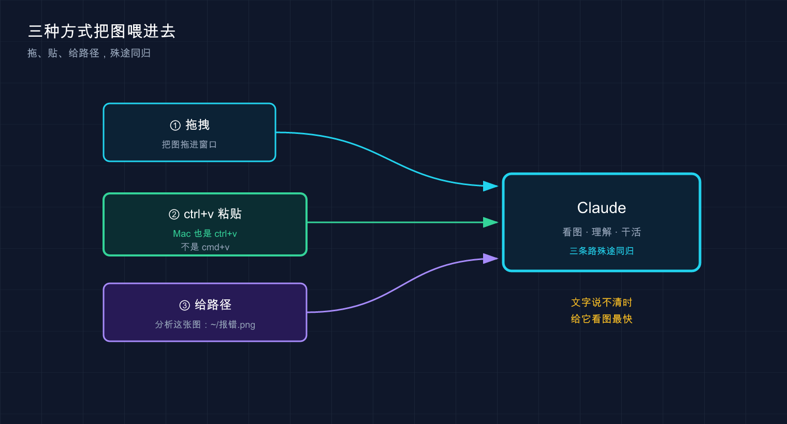

# 17 · 图片与多模态：贴张截图，它就懂了

> 📚 **系列导航**：上一篇 [16 常见工作流](16-common-workflows.md) 把读代码、修 bug、写测试这些日常套路过了一遍。这一篇加一个新维度——**不光能跟它打字，还能直接给它看图**：报错截图、设计稿、架构图，丢进去它就懂。

比如要把一张设计师给的页面截图还原成网页。搁以前，咱们得对着图一个像素一个像素量——这块间距多少、字号几号、按钮圆角几度，光抠数值就得磨一上午。

这时候只要**把那张 PNG 直接拖进 Claude Code 的窗口，敲一句「照着这张设计稿生成对应的 CSS」**。

几分钟后，它吐出来一整段 CSS——布局、配色、圆角、阴影全对上了，贴进项目里，浏览器一刷新，**和设计稿几乎一模一样**。效率差距一下就出来了：给它看比跟它讲快得多。

说白了，**一图胜千言这句话，在 Claude Code 这儿是字面意义上成立的**。今天就把「怎么喂图 + 喂图能干嘛」讲透。

**看完这一篇，你会拿到：**

- 三种把图片塞进 Claude Code 的方法，照着做就行（含一个 Mac 用户必踩的快捷键坑）
- 图片的三大正经用途：贴报错截图、还原设计稿、读图表 / 架构图
- 一个判断标准：**什么时候该上图、什么时候打字就够**
- 多图怎么用、Claude 怎么引用图片、怎么一键点开它说的那张

---

## 01 为什么要给它看图，而不是只打字

先说结论：**当一件事「描述起来比截图还费劲」的时候，就该上图了**。

这是官方文档里白纸黑字的判断标准——**「当文本描述不清楚或繁琐时使用图像」**。

**类比：一图胜千言。** 你跟朋友形容一个红绿报错弹窗长啥样，说半天「左上角有个红叉，下面一行小字，右边还有个按钮……」对方还是云里雾里；但你截个图甩过去，他「哦」一声就全明白了。给 Claude 看图，是同一个道理——**省下你组织语言的力气，也省下它猜的力气**。

哪些场景特别适合上图？用下来主要是这三类：

| 场景 | 打字描述有多累 | 上图有多省 |
|------|---------------|-----------|
| **页面错位 / 样式不对** | 「这个 div 往右偏了大概二十几像素，还跟下面那块重叠了」 | 截个图，它一眼看到错位 |
| **报错弹窗 / 控制台红字** | 把一长串堆栈手敲或复制对齐 | 截图甩进去，连上下文一起给了 |
| **还原设计稿 / 仿一个组件** | 「主色是个偏紫的蓝，圆角不大不小……」 | 给图，让它自己量 |

这里有个关键区别得拎清楚：**Claude Code 看的是「图里的内容」，不是帮你截图**。截图这一步还得你自己来（系统自带的截图工具就行），它负责的是「看懂你给的图」。

> 💡 **一句话总结**：判断标准就一句——**描述起来比截图还累，就上图**；官方原话叫「文本不清楚或繁琐时用图像」。

---

## 02 三种喂图方式：拖、贴、给路径

怎么把图塞进去？官方文档给了三种方法，**任选一种，效果一样**。我按「上手难度从低到高」排一下。



这张图把三条加图路径并到一处：**拖拽进窗口、复制后 `ctrl+v` 粘贴（Mac 也是 `ctrl+v`）、或直接给文件路径**——三种方式殊途同归，都是把图喂给 Claude 让它「看着干活」。

### 方法一：直接拖进窗口（最直觉）

把图片文件从访达 / 文件管理器里**拖**进正在运行 Claude Code 的终端窗口，松手，它就进去了。

这是最不用动脑的方式——**跟你往微信聊天框拖文件发图一个感觉**。新手一般先从这个上手，零学习成本。

### 方法二：复制图片，ctrl+v 粘贴（最高频，但有个坑）

很多时候图根本没存成文件——你刚截了个屏，或者从网页上右键「复制图片」，这时候直接粘贴最爽。

但这里有**全篇最大的一个坑**，官方文档专门强调了：

> 复制图像并使用 ctrl+v 将其粘贴到 CLI 中（不要使用 cmd+v）。

**注意：Mac 上粘贴图片也用 `ctrl+v`，不是你习惯的 `cmd+v`。**

这点反直觉到什么程度？Mac 用户复制粘贴文字十年了都是 `cmd+v`，肌肉记忆根深蒂固。第一次贴截图，很容易习惯性按 `cmd+v`，结果**终端里冒出来一长串乱码路径，图根本没进去**，还以为是不支持。翻一翻文档就明白了——**很多终端里 `cmd+v` 粘的是文件路径文本，只有 `ctrl+v` 才稳稳把图片本身喂给 Claude**。

（补一句：个别终端比如 iTerm2 也认 `cmd+v` 粘图，但各终端行为不一致，**`ctrl+v` 是哪儿都好使的那条路，记它就不踩坑**。）

记死这一条：

| 平台 | 粘贴图片用 | 别用 |
|------|-----------|------|
| **Mac** | `ctrl+v` | ❌ `cmd+v`（多数终端会粘成路径文本） |
| **Windows / Linux** | `ctrl+v`（WSL 中若终端拦截 ctrl+v，改用 `alt+v`） | —— |

一个小细节：粘贴成功后，输入框里会出现一个 `[Image #1]` 的占位标记（官方叫「芯片（chip）」），表示图已经挂上了，你可以在这条提示里接着打字。

### 方法三：直接给图片路径（最适合脚本 / 已存好的图）

如果图已经存成文件了，路径你也知道，那最干脆的办法是**在提示里直接把路径打出来**，让它自己去读：

```text
Analyze this image: /path/to/your/image.png
```

把 `/path/to/your/image.png` 换成你那张图的真实路径就行（相对路径、绝对路径都认）。这种方式不依赖鼠标拖拽，**写在脚本里、或者图片藏在项目某个目录深处时，最好用**。

> 💡 **一句话总结**：拖进窗口 / `ctrl+v` 粘贴 / 直接给路径，三选一；**Mac 用户死记 `ctrl+v`，别按 `cmd+v`**。

---

## 03 用途一：贴报错和 UI 截图，给它「现场」

第一个最实用的场景——**把出问题的截图甩给它，让它看着现场断案**。

为什么这招好用？因为很多报错和样式问题，**文字根本传达不全**。一个报错弹窗里有图标、有颜色、有排版，你手敲只能描述个大概；UI 错位更是如此，差几个像素肉眼能看出来，嘴说不清。

**类比：去医院别光靠嘴描述「这儿疼」，拍张片子给医生。** 你说「肚子右下角隐隐作痛」，医生只能猜；一张 CT 片摆上去，问题在哪一目了然。截图就是给 Claude 的那张「片子」。

具体怎么做？把截图喂进去（三种方法任选），然后配一句话点出你的诉求。官方给的示范提示就很到位：

```text
Here's a screenshot of the error. What's causing it?
```

或者，UI 上的问题：

```text
Describe the UI elements in this screenshot
```

比如调一个 React 页面，有个按钮死活偏右，CSS 翻来覆去看不出毛病。这时候**直接截了张错位的图丢进去**，配一句「这个按钮为什么往右挤了」，Claude 一看就说「你父容器有个 `padding-right`，加上按钮自己的 `margin`，叠一块了」——**一句话点破，对着改一行就好了**。要是靠打字描述这个错位，怕是得来回拉扯好几轮。

> 💡 **一句话总结**：报错和 UI 问题，**截图就是「现场照片」**——给它看比给它讲，断案快得多。

---

## 04 用途二：还原设计稿，截图直接出代码

这就是开头那个「效率差距一下拉开」的场景，单独拎出来讲——**给它一张设计稿，让它吐出能跑的代码**。

为什么这招最惊艳？因为它把「设计→代码」这段最磨人的体力活给省了。**对着图量数值、调间距、试配色**，原本是前端最枯燥的一环，现在丢给它先出个八九不离十的版本，你再微调。

**类比：拿张照片让裁缝照着做衣服。** 你不用把每条尺寸都报给裁缝，把样衣照片往他面前一放，他自己就能量出版型、用料、走线。设计稿截图之于 Claude，就是那张「样衣照片」。

官方给的示范提示，记住这两句就够开工：

```text
照着这张设计稿生成对应的 CSS
```

```text
What HTML structure would recreate this component?
```

第一句让它**照着设计稿生成 CSS**，第二句让它**推断出能复刻这个组件的 HTML 结构**。两句连用，一个静态组件的骨架就出来了。

说句实话，得有个合理预期：**它不是像素级复刻，是给你一个高完成度的起点**。像开头那段 CSS，整体布局和配色全对，但有两个地方的内边距差了几像素，手动调一下就行。可这已经省了至少一小时——**从零写 CSS，和改它给的八成稿，完全是两个工作量**。

| 还原设计稿 | ❌ 纯手写 | ✅ 截图喂给它 |
|-----------|---------|-------------|
| 量数值 | 自己一个个抠像素 | 它照着图估 |
| 出骨架 | 从空文件敲起 | 直接给一版能跑的 |
| 你的活 | 全程从零 | 改最后那一两成 |

> 💡 **一句话总结**：设计稿截图 +「照着这张设计稿生成对应的 CSS」，**它给你八成稿，你补最后两成**，省下的全是体力活。

---

## 05 用途三：读图表和架构图，让它「看懂结构」

第三个用途，**图表、数据库 schema、架构图——这些「结构性」的图，它也能看懂**。

为什么单列一类？因为前两类（报错、设计稿）图里是「界面」，这类图里是「关系」——谁连谁、数据怎么流、模块怎么分层。**这种关系用文字串起来特别绕，用图一目了然，正好是 Claude 的菜**。

**类比：给新同事讲系统，白板上画个框图比讲半天管用。** 你跟新人口述「用户服务调订单服务，订单服务又依赖库存和支付……」，他听得云里雾里；白板上几个框一连，箭头一画，他立马懂了。把这张框图截给 Claude，效果一样。

官方给的示范提示，覆盖了「读」和「改」两个方向：

```text
This is our current database schema. How should we modify it for the new feature?
```

```text
Are there any problematic elements in this diagram?
```

第一句是**拿着现有的数据库结构图，问它新功能该怎么改表**；第二句是**让它审一审这张图里有没有不合理的地方**。

一个很常见的用法：接手一个陌生项目，对方甩来一张架构图 PNG，**直接喂给 Claude，让它先讲讲这套系统大概怎么跑**。它能从图里读出模块和调用关系，给你一段概览——**比自己对着图干瞪眼快多了**，相当于有人先带你把图捋了一遍。

> 💡 **一句话总结**：图表、schema、架构图这类「讲关系」的图，**喂给它当背景**，让它读懂结构再帮你改或审。

---

## 06 多图、引用、一键点开：几个好用的小操作

最后补几个让你用得更顺的细节，都是官方文档里提到的。

### 一次可以喂多张图

不用一张张来——**同一条提示里可以塞多张图**。比如「这是旧设计稿、这是新设计稿，告诉我改了哪些地方」，两张一起给，让它对比。设计稿改版时常这么干，省得来回切换描述。

### Claude 怎么引用图片：`[Image #1]`

当 Claude 在回复里提到你给的某张图时，它会用 **`[Image #1]`、`[Image #2]`** 这样的编号来指代——第几张图就是几号。多图的时候，这个编号让你一眼对上「它说的是哪张」。

### 一键点开它说的那张图

它回复里出现的 `[Image #N]` 是**可以点开的**，按官方说法：

> 当 Claude 引用图像时（例如 `[Image #1]`），`Cmd+Click`（Mac）或 `Ctrl+Click`（Windows/Linux）链接以在默认查看器中打开图像。

也就是说，想确认它指的到底是哪张，**Mac 上 `Cmd+Click`、Windows/Linux 上 `Ctrl+Click`** 那个编号，系统默认看图工具就帮你把图打开了。

| 操作 | Mac | Windows / Linux |
|------|-----|-----------------|
| **粘贴图片** | `ctrl+v` | `ctrl+v` |
| **点开 `[Image #N]`** | `Cmd+Click` | `Ctrl+Click` |

注意这俩快捷键的「分工」是反的：**粘贴图片用 `ctrl`，点开图片链接 Mac 上却用 `Cmd`**。别记混了。

> 💡 **一句话总结**：一条提示能塞多张图，Claude 用 `[Image #N]` 指代，**点那个编号（Mac 是 `Cmd+Click`）就能把图打开**核对。

---

## 07 动手：拖一张图让它读，三步跑通

光说不练假把式。下面用一张你电脑上随便一张图，三步跑通「喂图 → 它读懂」的完整流程。**不需要任何项目，桌面上有张图就行**。

**第一步：随便找一张图，记住它的位置**

截个屏，或者随便找张已有的 PNG / JPG。Mac 截屏默认存桌面，文件名形如 `截屏2026-06-10 下午3.20.15.png`。把它拖到一个好打的路径，比如直接放桌面就行。

**第二步：在任意目录启动 Claude Code**

```bash
claude
```

**预期**：出现欢迎屏幕，底部有输入框。（读图不挑目录，随便在哪启动都行。）

**第三步：把图喂进去，让它描述**

三种方式任选，新手推荐**直接拖**：把那张图从桌面拖进终端窗口，松手，输入框里会出现 `[Image #1]` 标记。然后接着打字：

```text
这张图里是什么？用中文描述一下你看到的内容
```

回车。

**预期**：Claude 读取这张图，用中文告诉你图里有啥——是张截图就说界面元素，是张照片就描述画面内容。**看到它准确说出了图里的东西 = 喂图成功，全流程跑通**。

**⚠️ Mac 用户想试「复制粘贴」那条路**：先在预览 / 浏览器里**复制图片**，回到终端按 **`ctrl+v`**（不是 `cmd+v`）。要是按完冒出来一串文件路径文本而不是 `[Image #N]` 标记，八成是手贱按成 `cmd+v` 了，删掉重来。

> 💡 **一句话总结**：拖进去 / `ctrl+v` / 给路径，三步喂图，看到 Claude 准确描述图里内容即为跑通。

---

## 08 小结

这一篇你学会了给 Claude Code 开「视觉」这一路——**从只能打字，到能直接给它看图**。

把要点串一遍：

| 维度 | 关键点 |
|------|--------|
| **怎么喂** | 拖进窗口 / `ctrl+v` 粘贴 / 给路径，三选一 |
| **最大的坑** | Mac 粘贴图用 `ctrl+v`，**别按 `cmd+v`** |
| **三大用途** | 报错 / UI 截图给现场、还原设计稿出代码、读图表 / 架构图懂结构 |
| **何时上图** | 文字描述比截图还累的时候 |
| **多图与引用** | 一条提示塞多张，Claude 用 `[Image #N]` 指代，点编号可打开 |

**你现在应该能：** 把任意一张截图、设计稿或架构图喂给 Claude Code，让它看着图帮你断报错、出代码、捋结构；并且记住了 Mac 上那个最反直觉的 `ctrl+v`。**这套「给它看」的能力，会让你之后描述问题的成本直线下降**——很多以前要打半天字的需求，现在一张图加一句话就解决了。

---

下一篇 **18「CLAUDE.md 使用指南」**——前面咱们一直在喂图、喂需求，但每次都得重复交代项目背景。有没有办法让 Claude **一进项目就自动知道这是个啥、该守哪些规矩**？下一篇就讲那个给它的「入职手册」——`CLAUDE.md`，配好了它就再也不用你反复念叨了。
