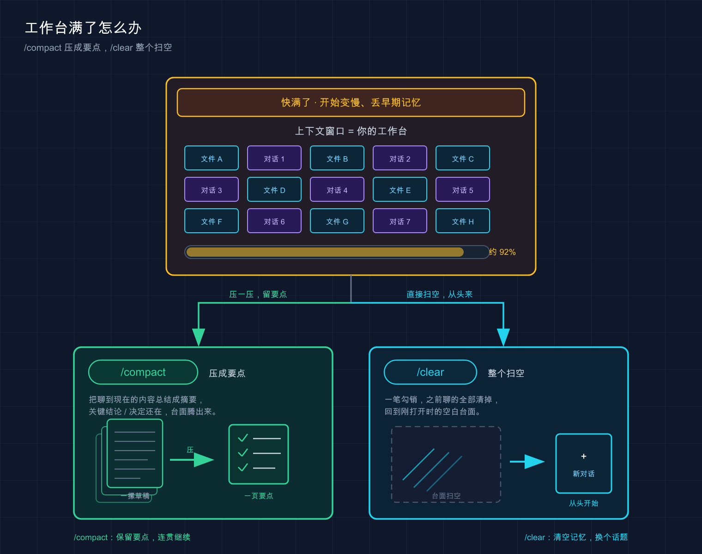

# 19 · 上下文管理：别让它「失忆」也别烧爆 token

> 📚 **系列导航**：上一篇 [18 · CLAUDE.md 使用指南](18-claude-md-guide.md) 教你把项目规范写进那份「入职手册」。这一篇往上一层聊——**这份手册连同你的对话、读过的文件，全都挤在一块叫「上下文窗口」的工作台上**，工作台怎么管好、怎么别把它塞爆，就是今天的事。

刚上手 Claude Code 那阵子，很容易干一件挺蠢的事。

接手一个不熟的中型项目，想着「让它先把整个仓库读一遍再动手，这样它最懂全局」，于是甩了一句：**「把这个项目所有文件都读一遍，然后告诉我架构。」**

结果呢？它真就一个文件接一个文件地读，终端哗哗滚屏，**读了二十几个文件之后明显变慢、变迟钝**。等你开始让它改一个登录的 bug，它居然反问「你说的 auth 模块在哪个文件」——**那文件它十分钟前刚读过**。活没干完，它先「失忆」了，token 也烧了一大把。

搞明白之后才知道：**上下文窗口不是越满越好，它满了反而会变蠢**。今天就把这块「工作台」讲透——它是什么、塞满了会怎样、怎么用 `/compact` 和 `/clear` 收拾、怎么实时看用量，以及怎么从源头省 token。

**看完这一篇，你会拿到：**

- 一个能让你彻底想明白「上下文窗口」的类比，以及它满了之后到底会发生什么
- `/compact`（压缩）、`/clear`（清空）、直接新开会话，三者分别什么时候用，一张表说清
- 用 `/context`、`/usage` 实时盯住占用的具体动作 + 预期输出
- 五个天天用得上的省 token 习惯，每个都来自真实踩坑
- 搞懂「自动压缩」（auto-compact）到底在背后干了啥，别再被它突然打断吓一跳

---

## 01 上下文窗口：Claude 的「工作台」有多大

先把这个最核心的概念立住。

**上下文窗口（context window）** —— 是 Claude 在这一次会话里能同时「看到」的全部内容的总容量，按 token（模型处理文本的最小计费单位）计。

它装的不只是你打的字，而是一整摊东西。官方 `context-window.md` 把它拆得很清楚，我给你翻成人话：

| 装进工作台的东西 | 什么时候进来 | 占多少 |
|---|---|---|
| 系统提示词（Claude 的行为规范） | 每次启动，你看不见 | 固定一块 |
| 你的 CLAUDE.md（全局 + 项目） | 启动时全量加载 | 看文件多大 |
| 自动记忆（auto memory） | 启动时加载（有上限） | 中等 |
| 你打的每一句话 | 你发一句进一句 | 通常很小 |
| **它读过的每个文件** | 它每读一个就追加 | **最大头，烧得最快** |
| 命令输出、工具结果 | 每次工具调用后追加 | 日志 / 大文件极快 |

看到没？**你以为对话主要是「你说的话」，其实大头是它读的文件和命令输出**。前面那次让它读二十几个文件，等于把工作台一下子堆满了别的工程图纸，留给「干活」的空地就没多少了。

**类比：工作台大小。** 把 Claude 想成一个在工作台上干活的木匠。台子就这么大，**图纸、工具、半成品、你递给他的便签，全得摊在这张台子上**。台子大，他能同时照顾的东西多；台子塞满了，他就得把早先的图纸推到一边——那张图纸上的信息，他就「忘」了。

这块台子有多大？**取决于你用的模型**。多数模型在 20 万 token 量级，部分模型（比如带 `[1m]` 标识的）能到 100 万。但记住一句话比记数字更有用：

**台子再大也有边界，塞得越满，它越笨。**

> 💡 一句话总结：上下文窗口就是 Claude 的工作台，**装的大头是它读的文件而不是你说的话**；台子有边界，塞满了它就开始往外「掉」早期信息。

---

## 02 工作台塞满了会怎样：它会变慢、变蠢、甚至「失忆」

这是本篇最该记住的判断：**上下文不是越满越好，满到一定程度，Claude 的表现会肉眼可见地下滑**。

为什么？台子上的东西越多，模型的「注意力」就被摊得越薄，**早先那些不相关的内容开始干扰当前任务**。业内管这个现象叫「上下文衰退」（context rot）。

你怎么知道它「衰退」了？我总结了几个一线症状，命中任意一条就该警觉：

- **它开始前后矛盾**，忘了你俩之前明明已经定好的方案
- **回答变得又模糊又笼统**，细节越来越少，开始说正确的废话
- **反复问你已经回答过的东西**（就像开头那句「auth 在哪个文件」）
- **同一个问题，你纠正它两遍以上还在原地打转**

比如写数据迁移脚本，聊了一个多小时反复调试，到后面它**把前半段我们一起否决掉的错误方案又端了上来**。不是它能力退化了，是**上下文被一小时的调试垃圾污染了**。

那台子真满了 Claude 会怎么办？**它会自动压缩**（auto-compact）——第 05 节细讲。这里先知道：**它是个被动保命动作，时机不由你定，还可能在关键任务的当口突然打断你**。

所以正确姿势是：**别等它自动压缩，你主动管**。怎么管？接着往下。

> 💡 一句话总结：上下文塞满会触发「上下文衰退」——前后矛盾、变笼统、反复问；**与其在污染的台子上反复纠正，不如主动清理**。

---

## 03 两把扫帚：`/compact` 压缩 vs `/clear` 清空

收拾工作台，Claude Code 给了你两把扫帚，**用途完全不同，千万别用混**。

### `/compact`：把台子上的东西「打包压扁」，但留着

`/compact`（压缩）干的事是：**把当前这一长串对话历史，总结成一份精简摘要，然后用摘要替换掉原来的逐字记录**，继续在同一个任务上往下干。

**类比：把摊了一桌的草稿纸整理成一页要点。** 你跟同事讨论了俩小时，桌上堆满了画废的草图。`/compact` 就是把这堆草图归纳成一页「我们最终定了 A、否了 B、下一步做 C」的要点，**腾出桌面，但结论还在**。

关键一点，它支持**带指令告诉它重点保留什么**：

```text
/compact 保留认证流程的架构决策和已确认的 API 格式，丢掉调试中的无效尝试
```

官方 `costs.md` 给的英文例子是 `/compact Focus on code samples and API usage`（重点保留代码示例和 API 用法），一个意思。

**什么时候用 `/compact`**：任务还没干完、上下文却快满了，但**前面聊的东西后面还要用**。比如一个功能做到一半，前期定的架构决策不能丢，但中间一堆试错的命令输出可以扔。

### `/clear`：直接清空，从头再来

`/clear`（清空）更狠：**把整个对话历史全清掉，等于开了一个全新的会话**。

但别怕——**`/clear` 不会动你的 CLAUDE.md 和自动记忆**，它俩在新会话里照样自动加载。你丢的只是「这次对话聊过的内容」，项目规范和长期记忆都还在。

**类比：换个全新的任务，干脆收拾干净台面再开工。** 上一个活儿干完了，下一个活儿跟它八竿子打不着，那把台子整个清空，比留着上一摊干扰更利索。

官方 `costs.md` 原话就建议：**切换到不相关的工作时，用 `/clear` 重新开始**，因为「陈旧的上下文会在随后的每条消息上浪费 token」。

这里有条值得定下来的铁规矩：**同一个问题纠正两遍它还不对，就别在这个会话里耗了，直接 `/clear`**，带着这两遍学到的教训，重写一个更精准的提示词从头问。**干净的台子 + 更好的提示，几乎总是赢过在污染的上下文里继续掰扯**——这是实测下来最值钱的一条经验。

> 💡 一句话总结：`/compact` 是「打包压扁、留着接着用」，`/clear` 是「整个清空、换活儿重开」；**纠正两遍还不对，别犹豫，`/clear`**。

---

## 04 监控用量：用 `/context` 和 `/usage` 看清台子还剩多少

凭感觉判断「是不是快满了」太玄学。Claude Code 给了两个命令让你**看实数**，这俩名字别记混。

### `/context`：看台子被什么占满了

```text
/context
```

`/context` 会**用彩色格子图可视化当前上下文的实时占用**，并按类别列出——系统提示占多少、CLAUDE.md 占多少、各个 MCP 服务占多少、对话历史占多少，还会给优化建议。官方 `context-window.md` 明确：**想知道任意时刻你的真实上下文用量，就跑 `/context`**。

一个值得养成的习惯是：**开始一个大任务之前先 `/context` 看一眼底子**。要是发现某个 MCP 服务白占了一大块、或者 CLAUDE.md 臃肿得离谱，先收拾了再干活。

> 配套还有个 `/memory` 命令，用来检查启动时到底加载了哪些 CLAUDE.md 和自动记忆文件——怀疑它「记错了」什么的时候用它查。

### `/usage`：看这次会话烧了多少 token / 多少钱

```text
/usage
```

`/usage` 顶部的 Session 块给的是**当前会话的 token 使用统计**，还会按本地估算折算成美元。官方 `costs.md` 给的样子大致是这样：

```text
Total cost:            $0.55
Total duration (API):  6m 19.7s
Total duration (wall): 6h 33m 10.2s
Total code changes:    0 lines added, 0 lines removed
```

**预期输出说明**：`Total cost` 是这次会话的预估花费（本地算的，可能和真实账单有出入，权威数字以 Claude Console 为准）；`Total duration (API)` 是真正调用模型的耗时；`Total duration (wall)` 是你开着这个会话的总时长。

> ⚠️ 提醒：Pro / Max 订阅用户的会话成本是包含在订阅里的，**这个美元数跟你的账单没直接关系**，看个相对量级就行。具体的套餐和计费咱们在第 06 篇讲过了，这篇只从「上下文」的角度看 token。

嫌每次手动敲麻烦？官方还支持把上下文用量**常驻显示在状态栏**（statusline），让它一直挂在屏幕上。具体配置方法见官方 statusline 文档，本篇不展开。

> 💡 一句话总结：`/context` 看「台子被什么占了」，`/usage` 看「这次烧了多少 token / 多少钱」；**大任务开干前先 `/context` 看一眼底子**。

---

## 05 自动压缩（auto-compact）：它会自己保命，但你别指望它

前面几次提到「自动压缩」，这节说清它到底是个啥。

**auto-compact（自动压缩）** —— 是 Claude Code 内置的保命机制：**当上下文快要顶到窗口上限时，它会自动把对话历史总结成摘要**，腾出空间继续干，省得你直接撞墙报错。官方 `costs.md` 把它和 prompt caching 并列，作为 Claude Code「自动优化成本」的两个手段之一。

**类比：流水线上的自动卸料。** 传送带快堆满了，系统自己把旧料归拢压实，免得整条线卡死。你不用管，它自动触发。

听起来挺贴心，但**我劝你别依赖它**，原因有两个：

**第一，它的触发时机不由你**。很可能你正让它干一个关键步骤，台子刚好满了，它「啪」地停下来先去压缩——**节奏全被打断**。

**第二，自动压缩是「无指令」压缩**。它触发的那一刻，恰恰是上下文最满、模型最迟钝的时候。**这时候它自己决定丢什么、留什么，很可能把你认为重要的东西给压没了**。

所以正确做法是**主动出手**：在你感觉对话变长、`/context` 显示占用偏高的时候，**自己先 `/compact` 一下，并且带上指令告诉它保留重点**。主动压缩有两个好处——时机你说了算，保留什么你也说了算。

还有一招更省心：**把压缩偏好直接写进 CLAUDE.md**。官方 `costs.md` 给的写法是在 CLAUDE.md 里加一段：

```markdown
# Compact instructions

When you are using compact, please focus on test output and code changes
```

这样**每次压缩（不管手动还是自动）它都会优先保留你指定的内容**，相当于给自动压缩上了个保险。比如在常用项目的 CLAUDE.md 里写一句「压缩时保留已确认的方案决策和接口约定」，就省得每次手动叮嘱了。

> 💡 一句话总结：自动压缩是保命用的，**但它打断你、还可能压没重要信息**；与其等它，不如自己主动 `/compact` 带指令，或在 CLAUDE.md 里把保留偏好写死。

---

## 06 省 token 五招：从源头别让台子那么快满

收拾台子是补救，**不让它那么快堆满才是上策**。下面五招天天用得上，每招都从「上下文」角度出发，跟套餐价格无关。

**第一招：练手别拿大项目。** 跟[第 07 篇](07-first-run.md)说的一样——学习和试验阶段，**建个三五个文件的玩具项目**。文件少，它读得少，台子干净，你也看得清它干了啥。开头那个「读二十几个文件失忆」的坑，根子就是一上来拿了个不熟的中型仓库。

**第二招：用 `@` 精准指文件，别让它满仓库找。** 与其说「修一下登录的 bug」让它一个个文件去翻，不如直接 `@src/api/auth.ts 修复 401 的问题`。官方 `costs.md` 说得很直白：**模糊请求触发广泛扫描，具体请求让它以最少的文件读取高效工作**。`@` 就是把它的目光直接钉在那个文件上。

**第三招：别一次塞太多需求。** 一口气甩五个不相关的任务，它读的文件、产生的输出会把台子撑爆。**拆成五次小提问，每次干完一件**，台子始终清爽。

**第四招：长任务拆分，干完一段就清。** 一个大功能别指望一个会话从头扛到尾。**做完一个相对独立的阶段，`/compact` 收一次；切到完全无关的部分，`/clear` 重开**。

**第五招：把冗长操作丢给子代理（subagent）。** 跑测试、翻大量日志、查文档这种会产出海量输出的活儿，交给子代理去做——**它在自己独立的工作台上折腾，只把结论摘要带回你的主对话**。官方 `context-window.md` 举的例子里，子代理读了 6100 token 的文件，回到主上下文只占 420 token。子代理后面有专篇，这里先知道它是省上下文的利器。（链接届时补充）

把「补救」和「预防」放一起对比，你就知道该往哪使劲：

| 做法 | 性质 | 什么时候 |
|---|---|---|
| `/compact` | 补救·压缩留用 | 任务没完、上下文偏高、前文还要用 |
| `/clear` | 补救·清空重开 | 切到不相关的活儿，或污染太重 |
| **直接新开会话**（退出再 `claude`） | 预防·彻底干净 | 想要绝对干净的台子，连本次记忆痕迹都不要 |
| `@` 精准指文件 | 预防·少读文件 | 每次提需求都该这么干 |
| 玩具项目练手 | 预防·从源头少 | 学习、试验阶段 |
| 子代理跑冗长活 | 预防·隔离输出 | 跑测试 / 翻日志 / 查文档 |

> 💡 一句话总结：收拾台子是补救，**少读文件、拆小任务、丢给子代理才是预防**；最该养成的肌肉记忆是——**提需求时用 `@` 把文件指准**。

---

## 07 动手：三步把上下文管理走一遍

光看不练记不住。下面用一个最小流程，让你**亲眼看到上下文怎么涨、`/compact` 怎么把它压下去**。在任意一个项目目录里启动 `claude`，跟着走。

**第一步：开局先看底子**

启动 Claude 后，第一件事先敲：

```text
/context
```

**预期**：终端列出当前上下文的分类占用——你会看到系统提示、CLAUDE.md 等已经占了一块（**还没聊天就有占用，这很正常**），底部给一个总用量和优化建议。**记下这个初始数字。**

**第二步：故意「喂」它一些内容，再看变化**

随便让它读几个文件、聊几轮，比如：

```text
读一下这个项目的主要源码文件，给我讲讲整体结构
```

等它读完、回答完，再敲一次：

```text
/context
```

**预期**：占用明显涨上去了，**对话历史和文件那几栏数字变大**。这就是「工作台被填满」的过程，你亲眼看到了。

**第三步：用 `/compact` 把它压回去**

```text
/compact 保留这个项目的整体结构结论，丢掉逐个文件的原始内容
```

**预期**：终端出现一条类似「Conversation compacted」（对话已压缩）的提示，**压缩在后台静默完成，不会把摘要刷一屏给你**。压缩完再 `/context` 看一眼，**对话历史那栏的占用应该掉下来了**——结构结论它还记得，但逐个文件的原始字节被压成了摘要。

**对照验证**：压缩前后各跑一次 `/context`，对话历史的 token 数前高后低，就说明 `/compact` 生效了。想验证它「没失忆」，接着问一句「刚才你总结的项目结构是什么」，它应该还能答上来。

> ⚠️ 一个细节：压缩是**有损**操作。它保留你指定的重点和大致脉络，但**早先工具输出的逐字内容会被丢掉**。所以真正重要的结论，养成习惯按第 18 篇讲的做法落到 CLAUDE.md——直接让 Claude「加进 CLAUDE.md」，或用 `/memory` 自己编辑，比压在对话里保险。

> 💡 一句话总结：跑一遍 `/context` → 喂内容 → `/compact` → 再 `/context`，**你就亲眼看到上下文怎么涨、压缩怎么把它压回去**；前后对比对话历史的 token 数，就知道有没有生效。

---

## 08 小结

这一篇咱们把「上下文窗口」这块工作台从里到外摸了一遍：

| 你学到的 | 一句话拎清 |
|---|---|
| 上下文窗口是什么 | Claude 的工作台，大头是它读的文件不是你的话 |
| 满了会怎样 | 触发上下文衰退——变慢、变笼统、前后矛盾、失忆 |
| `/compact` | 打包压扁留着用，可带指令指定保留重点 |
| `/clear` | 整个清空换活儿重开，不动 CLAUDE.md 和记忆 |
| `/context` · `/usage` | 一个看「占了什么」，一个看「烧了多少」 |
| 自动压缩 | 保命机制，但会打断你、可能压没重点，主动出手更好 |
| 省 token | 玩具项目、`@` 指文件、别塞太多、拆任务、丢子代理 |

**你现在应该能：** 看懂上下文窗口里装着什么、为什么它满了 Claude 会变蠢；在该压缩时用 `/compact`、该重开时用 `/clear`；用 `/context` 和 `/usage` 实时盯住占用；并且从提需求那一刻起就用一堆省 token 的习惯，**让台子始终留着干活的空地**。

说到底，**管理上下文的本质就一句话：把 Claude 有限的注意力，省着用在真正要紧的事情上。**



这张图把上下文窗口比成工作台：**塞满了文件和对话（图里到约 92%），就靠 `/compact` 把一摞聊天压成一页要点（留着继续用），或 `/clear` 把整张台面扫空（从头开始）**——前者保信息、后者图干净。

---

下一篇 [**20 · 权限配置**](20-permissions.md) ——这一篇咱们管的是 Claude「能记住多少」，下一篇要管的是它「能动手做多少」。它读文件、改代码、跑命令到底哪些要先问你、哪些可以放行，怎么配一套既安全又顺手的权限规则？留个问题给你先想想：**你愿意让它在没你点头的情况下，直接跑 `git push` 吗？**
