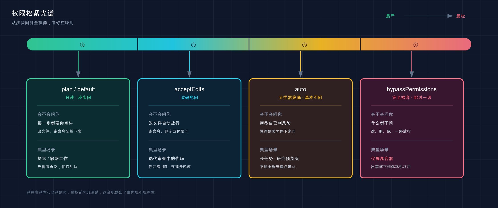

# 20 · 权限配置：放多松、收多紧，你说了算

📚 **系列导航**：上一篇 [19 上下文管理](./19-context-management.md) 教你怎么管好 Claude 的「工作台」、别让它把记忆塞爆。这一篇换个维度——管的不是「它记得多少」，而是「它敢动多少」：从一行命令都要问你，到全自动放飞，权限这根缰绳到底攥多紧，你说了算。

「你怎么敢开 `--dangerously-skip-permissions`？这玩意儿名字里都写着 dangerous 了。」

「我在沙箱里，怕啥。它就算把整个目录 `rm -rf` 了，删的也是个一次性容器，重建一个就有了。」

这段对话我自己两头都站过：在云端的隔离容器里跑批量重构时，我全程开着最松的危险模式，删了重来毫无心理负担；可一回到本机那个装着团队真实代码的目录，我连 `acceptEdits` 都得掂量两秒。说白了，**权限这事没有「对错」，只有「你在哪用」**。同一个开到最松的危险模式，在隔离容器里是「提速神器」，在你装着公司生产代码的机器上就是「定时炸弹」。

前面第 07 篇我们浅尝过一次——Claude 改文件前会停下来问你。那只是冰山一角。今天把整座冰山掀开：**Claude Code 有哪几档权限模式、怎么一键切、怎么用配置文件精确规定「这个能干、那个绝对不许」**。

**看完这一篇，你会拿到：**

- 六种权限模式各是什么、分别该在什么场景用，一张表看明白
- `Shift+Tab` 在模式间切换的肌肉记忆，以及启动时怎么直接指定模式
- 在 `settings.json` 里写 `allow` / `ask` / `deny` 规则的语法，按工具、按命令精确控权
- 「玩具项目放松、生产项目收紧」的两套配置模板，复制即用
- `--dangerously-skip-permissions` 到底什么时候才敢开，红线在哪

---

## 01 先搞懂：权限系统在管什么

先给结论：**Claude Code 默认是个「先问后动」的实习生，权限配置就是你给这个实习生定的「行为守则」**。

它把所有操作分成三类，默认待遇完全不同。官方文档里这张分类表，是理解后面一切的地基：

| 工具类型 | 例子 | 默认要不要批准 |
|---------|------|--------------|
| **只读** | 读文件、`Grep` 搜索 | 不要，直接放行 |
| **Bash 命令** | 执行 shell 命令 | 要 |
| **文件修改** | `Edit` / `Write` 改文件 | 要 |

**类比：实习生动手前问不问你。** 一个靠谱的实习生，让他「看看这段代码」他随手就看了（只读，零风险）；但他要「改生产配置」「跑个删除命令」，正常都会先抬头问你一句「头儿，这个我能动吗？」。Claude Code 默认就是这种人——**读随便读，动手前先报备**。

这里有个关键认知，我自己就在这儿栽过一跤：**权限是 Claude Code 这个程序强制执行的，不是靠「拜托模型自觉」**。

我那会儿在 `CLAUDE.md` 里专门写了句「不要执行 git push」，以为这就锁死了，结果有一次它该 push 还是利索地 push 了——因为 `CLAUDE.md` 只是「影响它想干啥」的软提示，**真正的硬约束得写在权限规则里**。后来我把这条搬进 `deny`，它才老实。官方说得很直白：

> 权限规则由 Claude Code 强制执行，而不是由模型强制执行。您的提示或 `CLAUDE.md` 中的说明会影响 Claude 尝试执行的操作，但它们不会改变 Claude Code 允许的操作。

记住这条，你才知道「防线」该建在哪。

> 💡 一句话总结：只读随便放、动手要批准是默认守则；**真要拦死某个操作，得写权限规则，光在 `CLAUDE.md` 里嘱咐没用**。

---

## 02 六种权限模式：从「步步问」到「全放开」

权限模式（permission mode）控制的是一件事：**Claude 在动手前暂停问你的「频率」**。从「每一步都停下来等你点头」，到「啥都不问直接干」，是一条连续的光谱。

**类比：还是那个实习生，模式就是你给他的「自主权等级」。** 新来第一天，每件事都要请示（`default`）；熟了之后，改代码不用问、但删库还是得喊你（`acceptEdits`）；你出差了完全信任他，让他自己看着办（`bypassPermissions`）。

官方一共给了六种模式。把它们的「会不会先问你」和「适用场景」整理成一张表——**这是本篇最该记住的一张**：

| 模式 | 无需询问就能干的事 | 会不会先问你 | 最适合的场景 |
|------|------------------|------------|------------|
| `default` | 仅只读 | 改文件、跑命令**都问** | 入门、敏感工作 |
| `acceptEdits` | 只读 + 文件编辑 + 常见文件系统命令（`mkdir`、`mv`、`cp` 等） | 文件编辑和上述文件系统命令**不问**，其他 Bash 命令仍问 | 迭代你正在审查的代码 |
| `plan` | 仅只读（只研究、只出方案，**不碰你的源码**） | 跟 `default` 一样的提示规则 | 动手改之前先探索、出计划 |
| `auto` | 所有操作，带后台分类器安全检查 | **基本不问**，越界的由分类器拦 | 长任务、减少打断（研究预览版） |
| `dontAsk` | 仅预先批准的工具 | 不问也不停，没批准的**直接拒** | 锁死的 CI、脚本 |
| `bypassPermissions` | 所有操作，**跳过一切检查** | **完全不问** | 仅隔离容器 / VM |

几个新手最容易搞混的点，挑出来说清楚：

**`plan`（Plan Mode，计划模式）不是「放松」，恰恰是最克制的。** 它让 Claude 只读文件、只跑只读命令去摸清状况，然后给你写一份「我打算这么改」的计划，**但一个字都不会动你的源码**。接手任何陌生项目，第一步都建议先切 `plan` 让它通读一遍再说，比一上来就让它瞎改稳得多。

**`acceptEdits` 是日常开发的甜点区。** 它自动批准你工作目录里的文件编辑和几个常见文件系统命令（`mkdir`、`touch`、`rm`、`rmdir`、`mv`、`cp`、`sed`），但**别的 shell 命令、超出工作目录的写入，照样停下来问你**。等于「改代码不用一次次点同意，但危险动作还留着闸」。

**`auto` 和 `bypassPermissions` 看着都「不问」，但安全性天差地别。** `auto` 是研究预览版，背后有个独立的分类器模型在每个操作前审一遍，越界的（比如 `curl | bash`、推 `main`、删云存储）会被拦下；`bypassPermissions` 是**真·裸奔**，连提示注入都不防。官方写得明明白白：

> `bypassPermissions` 不提供针对提示注入或意外操作的保护。对于没有提示的后台安全检查，请改为使用 auto mode。

所以想「省心又有底线」，优先 `auto`，别一上来就 `bypassPermissions`。

> 💡 一句话总结：`default` 步步问、`acceptEdits` 改码免问、`plan` 只看不动、`auto` 有分类器兜底、`bypassPermissions` 完全裸奔——**记住这条从严到松的光谱，对号入座就行**。



这张图把六种模式排成一条「从最严到最松」的光谱：左边绿区是 `plan` / `default`（只读、步步问，最安全），往右经过 `acceptEdits`（改码免问）、`auto`（分类器兜底），一直到右边红区的 `bypassPermissions`（完全裸奔）——颜色越往右越红，提醒你「越松越要看清自己在哪用」。

---

## 03 切换模式：Shift+Tab 一键循环

模式知道了，怎么切？**最常用的就一个快捷键：`Shift+Tab`**。

在会话里随手按 `Shift+Tab`，会在三种模式间循环：

```text
default → acceptEdits → plan → （再按回到 default）
```

当前是哪个模式，**看状态栏**就知道。比如切到 `acceptEdits` 时，状态栏会显示 `⏵⏵ accept edits on`。

注意一个官方细节，免得你按半天找不到某个模式：**默认循环里只有 `default` / `acceptEdits` / `plan` 这三个**。其余三个进入方式各不同：`auto` 在账户满足条件后会自动出现在循环中；`bypassPermissions` 要用 `--permission-mode bypassPermissions` 等标志启动才进入循环；`dontAsk` 永远不出现在循环里，只能用 `--permission-mode dontAsk` 启动参数设置（下面讲）。

**类比：手机的「响铃 / 震动 / 静音」三段切换。** 你按音量键边上那个拨杆，就在这三档之间转。`Shift+Tab` 就是 Claude Code 的那个拨杆，转一圈是「步步问 / 改码免问 / 只看不动」。

如果你不想每次进来都手动切，有两个办法把模式「钉死」：

**办法一：启动时用参数指定**（只管这一次会话）：

```bash
claude --permission-mode plan
```

把 `plan` 换成 `acceptEdits`、`dontAsk` 等任意模式名都行。`bypassPermissions` 比较特殊——`--permission-mode bypassPermissions` 和 `--dangerously-skip-permissions` 两种写法等价，但日常都用后者那个「自带警告」的名字，第 05 节细说。

**办法二：写进 `settings.json` 当默认**（每次启动都生效）。在你项目的 `.claude/settings.json` 里：

```json
{
  "permissions": {
    "defaultMode": "acceptEdits"
  }
}
```

> ⚠️ 一个官方明确的限制：`defaultMode` 设成 `"auto"` 时，**项目和本地设置里的会被忽略**（防止某个仓库偷偷给自己开自动模式），要默认 `auto` 得写到用户级的 `~/.claude/settings.json` 里。

一个推荐的习惯：**不在项目里钉死模式，全靠 `Shift+Tab` 手动切**。因为同一个项目，有时你想让它放手干（切 `acceptEdits`），有时只想让它出个方案（切 `plan`），写死反而别扭。`defaultMode` 一般只在「这个项目就是要从严」时才设成 `default` 兜底。

> 💡 一句话总结：会话里 `Shift+Tab` 在「步步问 / 改码免问 / 只看不动」三档循环，状态栏看当前档；**想钉死就用 `--permission-mode` 启动参数或 `settings.json` 的 `defaultMode`**。

---

## 04 精细控权：allow / ask / deny 三种规则

模式是「粗调」，定个大基调。**真正精确到「这条命令能跑、那条绝对不许」的「细调」，靠 `settings.json` 里的三种规则**。

每条规则最终都落到三个动作之一：

| 动作 | 效果 | 典型用途 |
|------|------|---------|
| `allow` | 无需审批，自动放行 | 低风险高频操作，如 `git status`、`npm run build` |
| `ask` | 弹提示，由你拍板 | 有点风险想留个确认，如 `git push` |
| `deny` | 直接拦死，不执行也不提示 | 明确禁止的危险操作，如 `rm -rf`、读 `.env` |

**优先级是铁律：`deny → ask → allow`，第一个匹配的规则赢。** 所以 `deny` 永远压过其他俩——你既写了 `allow` 又写了 `deny`，`deny` 说了算。这个设计很合理：**「禁止」就该比「允许」更有分量**。

规则的写法是 `工具名` 或 `工具名(说明符)`。看几个例子就懂了：

| 规则 | 匹配什么 |
|------|---------|
| `Bash` | 所有 Bash 命令 |
| `Bash(npm run build)` | 只匹配 `npm run build` 这条确切命令 |
| `Bash(npm run *)` | 匹配 `npm run` 开头的命令（`build`、`test`…） |
| `Read(./.env)` | 读当前目录的 `.env` 文件 |
| `WebFetch(domain:github.com)` | 抓取 github.com 的网络请求 |

通配符 `*` 有个**新手必踩的空格坑**，官方专门强调过：

> `Bash(ls *)` 匹配 `ls -la` 但不匹配 `lsof`，而 `Bash(ls*)` 匹配两者。

差一个空格，含义就变了。`ls *`（带空格）要求 `ls` 后面必须跟空格，所以 `lsof` 漏网；`ls*`（不带空格）连 `lsof` 一起匹配。**想精确，就带空格**。

一段完整的配置长这样——允许 npm 和 git commit，但拦死 git push：

```json
{
  "permissions": {
    "allow": [
      "Bash(npm run *)",
      "Bash(git commit *)"
    ],
    "deny": [
      "Bash(git push *)"
    ]
  }
}
```

最后一个**安全要点必须划重点**：`Read` / `Edit` 的 `deny` 规则，**拦不住 Bash 子进程里的「绕道读写」**。

啥意思？你写了 `deny: Read(./.env)` 挡住 Claude 直接读 `.env`，但如果它跑一段 Python 脚本 `open('.env').read()`，这个 `deny` 就管不着了——因为那是子进程在读，不走 Claude 的内置文件工具。官方提醒：

> 它们不适用于间接读取或写入文件的任意子进程，如打开文件本身的 Python 或 Node 脚本。为了获得阻止所有进程访问路径的 OS 级别强制执行，请启用沙箱。

这点很容易让人意外——以为 `deny .env` 就万无一失了。所以**真要锁死敏感文件，权限规则 + 沙箱（Sandbox）一起上**才叫深度防御（沙箱是 OS 级隔离，下一篇「安全」会展开）。

> 💡 一句话总结：`deny → ask → allow` 按这个优先级匹配、`deny` 永远最大；规则带不带空格含义不同；**但 `deny` 挡不住脚本绕道读写，敏感文件得配沙箱**。

---

## 05 玩具放松、生产收紧：两套模板 +「危险模式」红线

讲了一堆机制，落到实处就一句话：**项目越「玩具」越能放松，越「生产」越要收紧**。

这里给两套常备配置，按项目性质二选一。

**模板一：玩具 / 个人小项目（放松提速）。** 改砸了重建就行，没必要一步一停。设成 `acceptEdits` 让它改码免问，只兜住几个真危险的：

```json
{
  "permissions": {
    "defaultMode": "acceptEdits",
    "deny": [
      "Bash(rm -rf *)",
      "Bash(git push *)"
    ]
  }
}
```

**模板二：生产 / 公司项目（收紧把关）。** 默认每步都问，读操作放开方便它查代码，写文件和危险命令必须经你手，敏感文件直接拦死：

```json
{
  "permissions": {
    "defaultMode": "default",
    "allow": [
      "Bash(git status *)",
      "Bash(git diff *)",
      "Bash(npm run *)"
    ],
    "deny": [
      "Bash(rm -rf *)",
      "Bash(git push *)",
      "Read(./.env)",
      "Read(./.env.*)",
      "Read(./secrets/**)"
    ]
  }
}
```

写这俩 deny 时记得：上一节说过，挡 `.env` 的 `deny` 防不住脚本绕道，生产环境真要稳，**这层之外还得叠沙箱**。别把单层 `deny` 当成铁壁。

最后是那道**红线**，也是开头对话的主角——`--dangerously-skip-permissions`（等价于 `bypassPermissions` 模式）。

这玩意儿**跳过一切权限检查和安全检查**，工具调用立即执行。它名字里的 `dangerously`（危险地）不是吓唬人。官方给它划了使用边界：

> 仅在隔离环境（如容器、VM 或没有互联网访问的 dev containers）中使用此模式，其中 Claude Code 无法对您的主机系统造成损害。

下面这套铁规矩可以直接照搬：

| 场景 | 敢不敢开 `--dangerously-skip-permissions` |
|------|----------------------------------------|
| 隔离容器 / VM / dev container | ✅ 敢，删的也是一次性环境 |
| CI 里跑一次性任务 | ✅ 敢，但配合 `deny` 再兜一层 |
| 自己日常开发的本机 | ❌ 不开，宁可慢点也要留闸 |
| 装着公司生产代码的机器 | ❌ 绝对不开，这是炸弹 |

两个官方设计的「保险」让你稍微安心：一是即便在这个模式下，**`rm -rf /` 和 `rm -rf ~` 这种删根目录 / 主目录的操作仍会提示**，当作防手滑的断路器；二是在 Linux / macOS 上**以 root 或 `sudo` 身份是直接拒绝启动**这个模式的。但别指望保险——**核心还是「只在删了也不心疼的隔离环境里开」**。

> 💡 一句话总结：玩具项目 `acceptEdits` 提速、生产项目 `default` 把关，两套模板复制即用；`--dangerously-skip-permissions` **只在隔离容器里开，本机和生产机一律免谈**。

---

## 06 动手：5 分钟配出你的第一套权限规则

光看不练假把式。下面带你给一个玩具项目配一套权限规则，**亲眼看到 `allow` 和 `deny` 是怎么生效的**。全程不依赖任何复杂环境。

**第一步：建玩具项目和配置文件**（Mac / Linux）

```bash
mkdir perm-demo
cd perm-demo
mkdir .claude
```

**预期**：`perm-demo` 文件夹里有一个空的 `.claude` 目录。敲 `ls -a` 能看到 `.claude` 在。

**第二步：写一份 `settings.json`**

用你顺手的编辑器，在 `perm-demo/.claude/settings.json` 里贴入：

```json
{
  "permissions": {
    "defaultMode": "default",
    "allow": [
      "Bash(git status *)"
    ],
    "deny": [
      "Bash(git push *)"
    ]
  }
}
```

这套规则的意思：默认每步都问，但 `git status` 放行不用问，`git push` 直接拦死。

**第三步：启动 Claude 并核对规则**

```bash
claude
```

进去后敲：

```text
/permissions
```

**预期**：弹出权限管理界面，能看到你刚写的规则——`git status *` 在 Allow 列表里、`git push *` 在 Deny 列表里，并标着它们来自哪个 `settings.json` 文件。**看到这两条 = 配置已被正确加载**。

**第四步：验证 `deny` 真的拦得住**

在输入框里让它干一件被禁的事：

```text
帮我执行 git push origin main
```

**预期**：Claude **不会**执行，也不会弹「要不要批准」的提示——它会直接告诉你这个操作被权限规则拒绝了。**这就是 `deny` 的威力：不执行、不提示，一拦到底。**

**第五步：对比 `allow` 的顺滑**

再让它干件被放行的事：

```text
帮我看一下 git status
```

**预期**：因为命中了 `allow: Bash(git status *)`，它**不弹批准提示**就直接跑了（这目录还没 `git init`，命令本身会报「不是 git 仓库」，但那是 git 的事——关键是**它没停下来问你**，说明 `allow` 生效了）。

跑通这五步，你就把「写规则 → 加载 → `deny` 拦死 → `allow` 放行」这条完整链路亲手验证了一遍。**以后任何权限配置，本质都是在这套机制上加规则。**

> 💡 一句话总结：建 `.claude/settings.json` 写规则、`/permissions` 看是否加载、再让 Claude 各跑一条被禁和被放行的命令——**亲手跑通这条链路，比记十条语法都管用**。

---

## 07 小结

这一篇我们把 Claude Code 的「权限缰绳」从头捋到尾——**它能放多松、收多紧，全在你的一念之间和几行配置里**。

把核心要点串起来回顾：

| 你要做的事 | 用什么 | 关键点 |
|-----------|--------|--------|
| 调整「问你的频率」 | 六种权限模式 | 从 `default`（步步问）到 `bypassPermissions`（裸奔）一条光谱 |
| 会话里快速切模式 | `Shift+Tab` | 在 `default` / `acceptEdits` / `plan` 三档循环 |
| 钉死默认模式 | `defaultMode` | 写进 `settings.json`；`auto` 得放用户级 |
| 精确控制单条操作 | `allow` / `ask` / `deny` | 优先级 `deny → ask → allow`，deny 最大 |
| 锁死敏感文件 | `deny` + 沙箱 | 光 `deny` 防不住脚本绕道 |

**你现在应该能：** 看懂六种权限模式分别在什么场景用、用 `Shift+Tab` 随手切换、在 `settings.json` 里写出按工具和按命令的 `allow` / `deny` 规则，给玩具项目和生产项目分别配出松紧合适的权限，并且清楚 `--dangerously-skip-permissions` 这道红线只能在隔离环境里碰。**这套「松紧自如」的控权能力，是你敢放手让 Claude 干活、又不至于翻车的底气。**

---

下一篇 **21「安全与风险边界」**——这一篇教你「权限怎么配」，但配置只是工具，更上层的问题是：**到底该不该信任 AI 去碰你的代码和系统？哪些场景是真正的高危区？提示注入、敏感数据泄露这些坑长什么样？** 缰绳攥在手里了，下一篇聊聊「什么时候该收、什么时候能放」的判断力。
