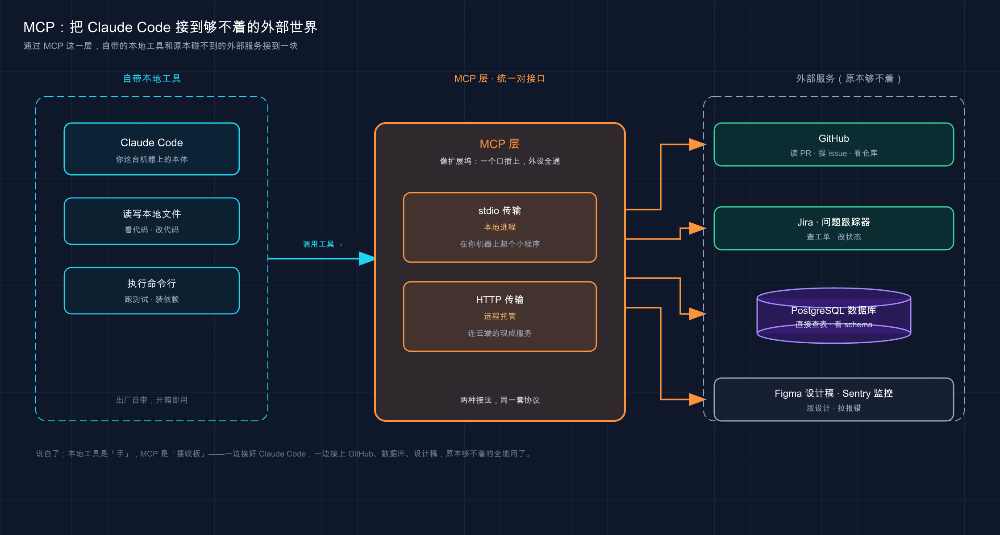

# 22 · MCP：给 Claude 接上外部世界

> 📚 **系列导航**：上一篇 [21 安全与风险边界](21-security.md) 帮你想清楚「什么时候该信任 AI 碰你的代码和系统」。这一篇换个方向——**给 Claude 接上外部世界**。它默认只能摸你本地的文件和命令行，碰不到你的数据库、Jira、Figma。MCP，就是那个让它一次接上一堆外部服务的统一对接口。

**先讲个坑**——我装第一个 MCP server 那会儿，对着终端的报错折腾了快一个小时。

当时想接一个连数据库的 server，从某个仓库的 README 里抄了条命令，大概长这样：`claude mcp add db -- npx server --transport stdio`。敲下去，连不上。我先怀疑是网络，又怀疑是包没装好，删了重装好几遍，`npx` 把那个包反复下载，进度条来回跑——**就是连不上**。

后来翻官方文档才发现，是参数的位置摆错了。官方写得明明白白：**所有选项（`--transport`、`--env`、`--scope`）必须在服务器名字「之前」，`--`（双破折号）之后跟的才是启动 server 的命令**。上面那条命令里 `--transport stdio` 跑到了 `--` 后面，被当成了传给 server 的参数，自然不认。再加上 stdio 是默认传输，根本不用写——正确写法就是 `claude mcp add db -- npx server`，秒连。

说这个坑是想让你少走那一个小时弯路：**MCP 本身不难，难的全是这些「位置」「作用域」「要不要批准」的细节**。今天把这些坑一个个填平，最后带你亲手跑通一个真实 server。

**看完这一篇，你会拿到：**

- 一句话讲明白 MCP 是什么、它到底补上了 Claude 的哪块短板
- 三种 server 形态（本地 stdio、远程 HTTP、已弃用的 SSE）分别什么时候用，一张表说清
- `claude mcp add` 命令的正确写法，以及 `local` / `project` / `user` 三种作用域的区别
- 加完 server 后，工具怎么出现在 Claude 面前、第一次调用要不要你批准（呼应上一篇的权限与安全）
- 一个能照着跑、给了预期输出的实战：5 分钟接上官方文档 server 并验证

---

## 01 先搞懂：MCP 到底补上了哪块短板

先给结论：**Claude Code 默认是个「只会本地干活」的助手，MCP 就是给它统一外接各路服务的那个口子**。

你回想一下前面二十一篇里 Claude 都在干啥——读你的文件、改你的代码、跑你的命令。**全是本地的事**。它再聪明，也碰不到你公司 Jira 上那张工单、连不上你生产库里的数据、看不见设计师在 Figma 上画的稿。这些信息它够不着，你只能自己复制粘贴喂给它。

**类比：带一堆接口的扩展坞。** 你的笔记本越做越薄，机身上可能就剩一两个 Type-C 口，HDMI、网线、U 盘、读卡器全插不上。怎么办？接一个扩展坞——**一根线接上去，HDMI、网线、USB、电源全通了**。MCP 之于 Claude 就是这个扩展坞：**接一次，一堆外部服务的工具就全摆到了它面前**。

官方对它的定义是：

> Claude Code 可以通过 Model Context Protocol (MCP)（一个用于 AI 工具集成的开源标准）连接到数百个外部工具和数据源。MCP 服务器为 Claude Code 提供对您的工具、数据库和 API 的访问权限。

这里有个关键词：**开源标准**。MCP（Model Context Protocol，模型上下文协议，一套规定「AI 怎么调外部工具」的开放规范）不是 Anthropic 关起门来自己玩的私有协议，而是一套公开标准。**好处是「一次对接，到处能用」**——你给某个数据库写的 MCP server，Claude Code 能用，别的支持 MCP 的客户端也能用。

什么时候你该想起它？官方给的判断特别朴素：

> 当您发现自己从另一个工具（如问题跟踪器或监控仪表板）复制数据到聊天中时，请连接一个服务器。

举几个你大概率会遇到的场景，体会一下接上之后能干嘛：

- **「把 JIRA 工单 ENG-4521 里描述的功能实现了，再去 GitHub 开个 PR」**——它自己去读工单，不用你转述
- **「根据我们的 PostgreSQL 数据库，查出本月用了新功能的 10 个用户邮箱」**——它直接查库，不用你导出 CSV 再贴进来
- **「按 Figma 上那版新设计更新邮件模板」**——它去读设计稿，不用你截图描述

> 💡 一句话总结：Claude 默认只会碰本地文件和命令，**够不着你的数据库、工单、设计稿**；MCP 是那个统一外接口，接一次就把一堆外部服务的工具摆到它面前。

---

## 02 三种 server 形态：跑在本地，还是连到云上

MCP server 不止一种。理解它们的区别，你才知道抄来的命令该怎么改。**核心就一个问题：这个 server 是跑在你自己机器上，还是托管在某个网址上？**

**类比：插在扩展坞上的设备，有的就在桌上，有的在墙那头。** U 盘、读卡器是插在扩展坞上、就在你手边的本地设备；网线那头连的是机房里的服务器，隔着老远。MCP server 也分这两类——**一类作为本地进程跑在你机器上，一类是远端托管、你连过去**。

官方给了几种传输方式（transport，即 Claude Code 和 server 之间「怎么通信」的方式），日常用得到的就两种，外加一个已经被淘汰的：

| 形态 | 跑在哪 | 怎么加 | 适合 |
|------|--------|--------|------|
| **stdio**（本地进程） | 你自己机器上，作为子进程启动 | `claude mcp add <name> -- <命令>` | 要直接读本地文件、控制本地浏览器、连本地数据库套接字的工具 |
| **HTTP**（远程托管） | 某个网址上 | `claude mcp add --transport http <name> <url>` | 云服务（Sentry、Notion、GitHub 这类），**官方推荐** |
| **SSE**（远程，已弃用） | 某个网址上 | `claude mcp add --transport sse <name> <url>` | 老配置才会见到，能用 HTTP 就别用它 |

几个新手最容易踩的点，挑出来说清楚：

**stdio server 不写 `--transport`。** 因为本地进程用的就是默认的 `stdio` 传输，**不用专门指定**。它的精髓是 `--` 后面那串命令——那是 Claude Code「该怎么把这个 server 跑起来」的指令。比如官方那个 Playwright（一个能让 Claude 操作浏览器的工具）的例子：

```bash
claude mcp add playwright -- npx -y @playwright/mcp@latest
```

`--` 后面的 `npx -y @playwright/mcp@latest` 就是启动命令，`-y` 是告诉 `npx` 别弹确认、直接装。**stdio server 等于「Claude 帮你在后台拉起一个小程序」**，所以它能跑的前提是你机器上有对应环境（这个 Playwright 就需要较新的 Node 环境，具体版本以其文档为准）。

**HTTP 是连云服务的首选。** 官方原话：

> HTTP 服务器是连接到远程 MCP 服务器的推荐选项。这是云服务最广泛支持的传输方式。

像 Sentry、Notion、GitHub 这些，你不用在本地装任何东西，**给它一个网址就连上了**：

```bash
claude mcp add --transport http sentry https://mcp.sentry.dev/mcp
```

**SSE（Server-Sent Events）你认识就行，别新用。** 官方明确标了「已弃用」：

> SSE (Server-Sent Events) 传输已弃用。请在可用的地方使用 HTTP 服务器。

SSE 一般只在接手别人的老 `.mcp.json` 时才见得到，新加 server 一律 HTTP。

> 💡 一句话总结：本地工具用 **stdio**（`--` 后跟启动命令，不写 transport），云服务用 **HTTP**（给网址，官方推荐），**SSE 已弃用、见到就换掉**。

---

## 03 怎么加一个 server：命令、作用域、那个排坑细节

知道了形态，来看具体怎么加。**两条命令打天下**，剩下的全是细节。

加远程 HTTP server——`--transport http`，给名字，给网址：

```bash
claude mcp add --transport http notion https://mcp.notion.com/mcp
```

加本地 stdio server——不写 transport，`--` 后跟启动命令：

```bash
claude mcp add airtable -- npx -y airtable-mcp-server
```

这里就是开头栽的那个坑，官方专门用一个 `Note` 框强调过，**值得你贴在脑门上**：

> 所有选项（`--transport`、`--env`、`--scope`、`--header`）必须在服务器名称**之前**。然后 `--`（双破折号）将服务器名称与传递给 MCP 服务器的命令和参数分开。

说白了就一句话：**`claude mcp add` 自己的开关全往前放，`--` 后面的全是给 server 的**。差一个位置，命令就不认。

### 三种作用域：这个 server 在哪些项目里能用

加 server 时还有个绕不开的选择：**这个 server 是只在当前项目用、跟全队共享、还是你所有项目都用？** 这就是「作用域（scope）」要管的事，用 `--scope` 指定。

**类比：办公室里一台打印机怎么共享。** 有的打印机只连你这一台电脑、只有你能打（`local`）；有的接进部门共享、还登记进了部门资产表，全组同事都能用（`project`，进 git 共享）；有的是你自己那台便携打印机，换到哪个工位、哪间会议室都拎着用（`user`，跨项目）。三种作用域，就是这三种「摆在哪、谁够得着」。

官方给的三种作用域，区别看这张表：

| 作用域 | 在哪些项目加载 | 跟团队共享吗 | 存哪 |
|--------|--------------|------------|------|
| `local`（默认） | 仅当前项目 | 否，仅你私有 | `~/.claude.json`（在该项目条目下） |
| `project` | 仅当前项目 | **是**，通过版本控制 | 项目根目录的 `.mcp.json` |
| `user` | 你的所有项目 | 否，仅你私有 | `~/.claude.json`（顶级 `mcpServers`） |

怎么选，记住这三句就够：

- **个人实验、带凭据不想进版本库的 → `local`**（默认，不写 `--scope` 就是它）
- **想让全队都用同一套 → `project`**，它写进 `.mcp.json`，提交到 git，**队友拉下来就有**
- **你自己跨项目天天用的 → `user`**，加一次，所有项目都能用

```bash
# 跨所有项目都能用（user 作用域）
claude mcp add --scope user --transport http sentry https://mcp.sentry.dev/mcp

# 跟全队共享（project 作用域，写进 .mcp.json）
claude mcp add --scope project --transport http github https://api.githubcopilot.com/mcp/
```

我自己用下来攒了个习惯：**像 Sentry、GitHub 这种个人天天用的，一律 `user`**——只在第一个项目里加一次，后面再开新项目自动就在，省得重复配。一开始我图省事全用默认的 `local`，结果换个项目又得重加一遍，烦了几次才反应过来该上 `user`。**只有「这个 server 是这个项目专属的、还得让协作者也用上」时，我才用 `project` 写进 `.mcp.json`**。

### 也可以直接写 `.mcp.json`

`project` 作用域那个文件，你也能手写。它本质就是个 JSON，HTTP 和 stdio 两种 server 各自的字段不同：

```json
{
  "mcpServers": {
    "claude-code-docs": {
      "type": "http",
      "url": "https://code.claude.com/docs/mcp"
    },
    "playwright": {
      "type": "stdio",
      "command": "npx",
      "args": ["-y", "@playwright/mcp@latest"]
    }
  }
}
```

HTTP 写 `url`，stdio 写 `command` 和 `args`。**它被检入版本库，等于给团队留了一份「配置即代码」**——别人克隆下来、启动 Claude Code，就会读到这份配置。注意官方一句提醒：**改完 `.mcp.json` 要退出再重启会话才生效**，因为 Claude Code 只在启动时读它。

> 💡 一句话总结：HTTP 用 `--transport http` 给网址、stdio 用 `--` 跟命令，**所有开关放名字前面**；作用域记三句——个人实验用 `local`、跨项目用 `user`、全队共享用写进 `.mcp.json` 的 `project`。



这张图把 MCP 的角色画成了中间那层「扩展坞」：左边是 Claude Code 自带的本地工具（读写文件、跑命令），右边是它本来够不着的外部世界（GitHub、Jira、PostgreSQL、Figma、Sentry）——中间的 MCP 层用 stdio 和 HTTP 两种线把它们接到一块，让外部服务的工具直接出现在 Claude 面前。

---

## 04 加完之后：工具怎么出现、调用要不要你批准

server 加好了，**接下来发生的事，正好接上上一篇讲的权限**。

先说工具是怎么「出现」的。每个 MCP server 都带着一组工具（比如 GitHub server 带「读 PR」「开 issue」这些），加上之后，**这些工具就会被注册到 Claude 面前，它能像用自带工具一样调它们**。你怎么确认连上了、有哪些工具？两个命令：

```bash
# 在终端：列出所有配置的 server 和它们的连接状态
claude mcp list
```

```text
# 在 Claude 会话里：看每个 server 的状态和工具
/mcp
```

`claude mcp list` 会给你看到每个 server 的状态标记，**这几个标记你得认识**（直接关系到「为啥我的 server 不工作」）：

| 状态 | 含义 |
|------|------|
| `✓ Connected` | 连上了，能用 |
| `! Needs authentication` | 通了但要登录（OAuth 或带令牌），去 `/mcp` 里认证 |
| `✗ Failed to connect` / `Connection error` | 连不上（server 没响应，或命令本身跑失败），检查命令 / 网址 |
| `⏸ Pending approval` | 来自 `.mcp.json` 的项目 server，还没经你批准 |

那个 `⏸ Pending approval` 就是**第一处「要不要你批准」**。官方设计得很谨慎：

> 出于安全原因，Claude Code 在使用来自 `.mcp.json` 文件的项目范围的服务器之前会提示批准。

**为啥要这一步？** 想想看：你克隆了别人一个仓库，里面的 `.mcp.json` 写着「启动时跑某个本地 server」。如果不经你同意就自动跑，等于**别人的仓库在你机器上偷偷启动了一个进程**。这道批准就是拦这个的——呼应上一篇的安全主线，**陌生来源的东西，先停下来等你点头**。（如果你手滑拒错了，`claude mcp reset-project-choices` 能重置。）

**第二处批准**，是工具第一次被调用时。官方在快速入门里说：

> Claude 第一次调用服务器时，它会要求使用新工具的权限。批准它以继续。

也就是说，加了 server ≠ Claude 能随便用它的工具。**它第一次真要调某个 MCP 工具时，还会停下来问你**——跟前面篇章里它改文件、跑命令前问你，是同一套权限机制。你批了，它才动。

还有个贴心细节帮你「验真」：**Claude 调用 MCP 工具时，输出里那个工具调用会标上 server 的名字**。这是你确认「这答案是真从外部服务来的，不是它编的」的依据。比如接上 Sentry 后，看到工具调用旁边标着 `sentry` 就能放心——确实是去查了真实报错，不是模型瞎诌一个。

> 💡 一句话总结：MCP 工具加完会注册到 Claude 面前，但有两道批准闸——**项目 `.mcp.json` 的 server 首次加载要你批，工具首次被调用还要你批**；输出里标着 server 名，是你确认「答案真来自外部」的凭据。

---

## 05 第三方 server 的信任问题：别什么都往上接

这一节最短，但**最不能跳过**——它直接接上一篇的安全边界。

先把官方那句警告原封不动放这儿，它在文档里是个红框 `Warning`：

> 在连接每个服务器之前，请验证您信任该服务器。获取外部内容的服务器可能会使您面临提示注入风险。

翻成人话：**MCP server 是第三方写的代码 / 服务，Anthropic 不会替你做安全审计**。官方目录（Anthropic Directory）里的连接器是经过基础审查的，但目录外的 server 你得自己判断可信不可信。

**类比：往生产项目里装一个第三方依赖包。** 你不会随手 `npm install` 一个没听过、维护者是谁都不清楚的包，就让它跑进你的线上代码——你会先看看它谁在维护、多少人在用、口碑如何。MCP server 本质就是这么个「第三方依赖」：**装之前先掂量来路**，尤其是会去抓外部内容（网页、工单、邮件）的那种。

为啥抓外部内容的 server 风险更高？因为那是**提示注入（prompt injection）的温床**——上一篇专门讲过这个坑。简单说：server 抓回来的网页 / 工单里，可能藏着一段「写给 AI 看」的恶意指令，Claude 读进去就可能被带偏。**server 抓得越「野」，这风险越大**。

这里有几条接 server 的土规矩，可以拿去用：

| 场景 | 接不接 |
|------|--------|
| 官方目录（Anthropic Directory）里审过的连接器 | ✅ 优先选这些 |
| 大厂官方出的 server（GitHub、Sentry、Notion 官方） | ✅ 相对放心 |
| GitHub 上随便一个 star 不多的第三方 server | ⚠️ 先看源码、想清楚再接 |
| 让某个 server 拿到你生产库的写权限 | ❌ 能只读就只读，别给写 |

最后一条尤其重要。官方那个连数据库的例子，DSN 里特意写的是 `readonly`（只读账号）——**能用只读凭据就别用可写的**，这是把风险摁到最低的最实在一招。

> 💡 一句话总结：MCP server 是第三方代码，**Anthropic 不替你审计**；接之前先验证信任、优先用官方目录和大厂官方 server，抓外部内容的 server 当心提示注入，**给数据库一律先用只读账号**。

---

## 06 动手：5 分钟接上一个真 server 并跑通

光看不练假把式。下面带你接上**官方文档 server**——它是个托管的 HTTP server，**不要登录、不要任何配置**，专门拿来练手最合适。全程不依赖你已有的任何复杂环境。

> 这个 server 是远程托管的 HTTP 服务，加它需要联网；国内访问 `code.claude.com` 如果不通，先开「魔法上网」再试。

**第一步：加 server**（在终端，不是在 `claude` 会话里）

```bash
claude mcp add --transport http claude-code-docs https://code.claude.com/docs/mcp
```

**预期**：打印一行确认，类似 `Added HTTP MCP server claude-code-docs with URL: https://code.claude.com/docs/mcp to local config`。**看到 `Added` = 配置已写入**（注意它说 `local config`，即默认的 `local` 作用域，只在当前项目生效）。

**第二步：检查连接状态**

```bash
claude mcp list
```

**预期**：列表里出现 `claude-code-docs`，旁边标着 `✓ Connected`。**看到这个绿勾 = 真连上了**。如果显示 `✗ Failed to connect`，多半是网络没通——按上面那条提示开魔法上网再试一次。

**第三步：进会话，点名让它用这个 server**

```bash
claude
```

进去后敲（特意点名 server，是为了保证它走 MCP 而不是用自带的网络搜索回答同样问题）：

```text
用 claude-code-docs server 查一下 MCP_TIMEOUT 这个环境变量是干什么的
```

**预期**：Claude **第一次调用这个 server 时会停下来问你要不要批准**（这就是第 04 节说的「工具首次调用要批准」）——批准它。然后它会返回 `MCP_TIMEOUT` 的说明（用来配置 MCP server 的启动超时），**而且输出里那个工具调用旁边会标着 `claude-code-docs`**。看到这个标记 = 答案是真从文档 server 查来的，不是模型记忆里的。

**第四步：清理**（可选）

练完想拆掉这个 server：

```bash
claude mcp remove claude-code-docs
```

**预期**：打印移除确认。再跑一次 `claude mcp list`，`claude-code-docs` 已经不在列表里了。

> 官方提醒了一句值得记的：**每个连上的 server 都会占用一点上下文窗口**（它的工具名和说明要加载进每次会话）。上一篇讲过工作台塞满会变蠢——**不用的 server 及时 `remove` 掉，把那点空间腾出来**。

跑通这四步，你就把「加 server → 查状态 → 调用要批准 → 拆掉」这条完整链路亲手走了一遍。**以后接任何 server，本质都是这套流程，无非换个名字、换个网址或命令、按需加 `--scope` 和认证。**

> 💡 一句话总结：接官方文档 server 练手最稳——**`add` 加、`list` 看绿勾、会话里点名调用并批准、`remove` 拆掉**；亲手跑通这条链路，比记十条命令都管用。

---

## 07 小结

这一篇我们给 Claude 接上了外部世界——**从「只会本地干活」到「一个口子外接一堆服务」，全靠 MCP 这个扩展坞**。

把核心要点串起来回顾：

| 你要做的事 | 用什么 | 关键点 |
|-----------|--------|--------|
| 理解 MCP 干嘛的 | 一个开源对接标准 | Claude 默认够不着外部服务，MCP 统一外接 |
| 接本地工具 | stdio | `claude mcp add <name> -- <命令>`，不写 transport |
| 接云服务 | HTTP | `--transport http` 给网址，官方推荐 |
| 决定 server 在哪用 | 作用域 | 个人 `local`、跨项目 `user`、全队 `project`（写 `.mcp.json`） |
| 确认连上没、有啥工具 | `claude mcp list` / `/mcp` | 认 `✓ Connected`、`⏸ Pending approval` 这些状态 |
| 控制 Claude 怎么用工具 | 两道批准闸 | 项目 server 首次加载批一次、工具首次调用批一次 |

**你现在应该能：** 看懂 MCP 补上了 Claude 的哪块短板、分清 stdio 和 HTTP 两种 server 该怎么加、用 `--scope` 把 server 配到合适的范围，加完会用 `claude mcp list` 和 `/mcp` 验证状态，清楚工具出现在 Claude 面前后还有两道权限闸，并且懂得在接第三方 server 前先掂量信任。**这套「外接能力」，是你让 Claude 从「本地代码助手」升级成「能直接操作你整套工具链」的那把钥匙。**

这一个对接口，把开头折腾一小时的那点坑都填平了——**记住「开关放名字前、`--` 后跟命令」这一条，你就能少走一大圈弯路。**

---

下一篇 **23「子代理（Subagent）」**——MCP 让一个 Claude 能干的事变多了，但活一多，**一个 Claude 也会忙不过来、上下文也会越塞越满**。下一篇教你换个思路：不让一个 Claude 硬扛，而是**雇一队带独立上下文的专项小弟分活**——主代理派活、子代理各干各的、各自的上下文互不污染。想想看：如果能把「查日志」「写测试」「跑构建」拆给三个互不打扰的小弟同时干，是不是比一个 Claude 来回切省心多了？
