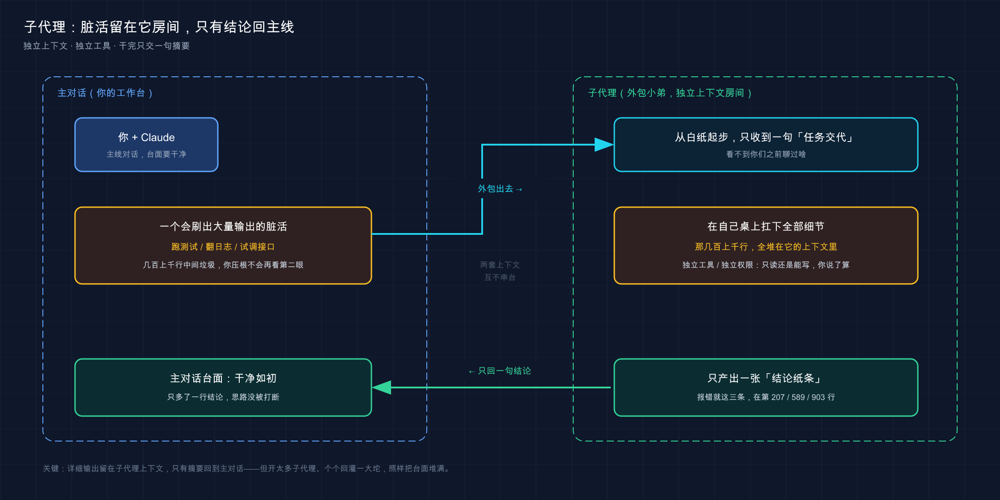

# 23 · 子代理（Subagents）：把活儿外包出去，别什么都自己扛

> 📚 **系列导航**：上一篇 [22 MCP](22-mcp.md) 教你给 Claude 接上外部工具，让它能查数据库、连 GitHub。这一篇换个思路——不是给它「加工具」，而是教你把活儿**外包出去**：子代理（Subagent），一个带独立上下文、独立权限、独立人设的专项助手，干完只把结论交回来。

都说 subagent 强，是 Claude Code 的「高级玩法」。很多人刚知道这功能那会儿，也兴奋得不行，恨不得把一个任务拆成五六个子代理同时跑，觉得这样「更专业、更高效」。

**但说句实话：多数人一上来就拆，是错的。**

这事得用一阵子才能想明白。后面会专门讲为什么——这里先把结论撂这儿：**子代理不是「任务越多越该拆」，它是个有明确适用场景的工具，用对了省心，用错了又慢又贵。** 想清楚「该不该拆」，比学会「怎么拆」重要得多。

这一篇我不光教你建子代理、触发子代理，更重要的是帮你建立那条判断线：**什么时候该外包，什么时候自己干更快。**

**看完这一篇，你会拿到：**

- 子代理到底是什么——独立上下文、独立工具、独立人设，一句话讲透它和主对话的区别
- 它真正解决的三个问题（隔离上下文、专精任务、可并行），以及那个反共识的坑：什么时候**不该**拆
- 用 `/agents` 交互式建，或手写 `.claude/agents/name.md` 配置文件，各字段是干嘛的
- 两种触发方式：靠 `description` 自动委派 vs 你直接点名
- 一个能照着跑、给了预期输出的实战：亲手建一个最小子代理并让它干活

---

## 01 先搞懂：子代理到底是什么

先给结论：**子代理就是 Claude 临时雇来的一个专项小弟——它在自己的房间里干活，干完只把结论交给你，过程中翻的一堆资料不占你的桌面。**

**类比：把一个活儿外包给专项小弟。** 你手上一堆事，其中「把这一千行日志翻一遍，挑出报错的那几条」这种又脏又占地方的活，你不想自己在主工作台上摊开干——那会把你桌面堆满。于是你把它外包给一个专门干这个的小弟：**他在自己的房间里，自己的桌子上，翻完那一千行日志**；翻完了，他不会把一千行原始日志搬回来给你，只递给你一张纸条：「报错就这三条，分别在第 207、589、903 行」。你的桌面始终干干净净。

这个小弟有三样东西是「他自己的」，跟你（主对话）完全隔开。官方文档把这句话讲得很死，值得记住：

> 每个 subagent 在自己的 context window 中运行，具有自定义系统提示、特定的工具访问权限和独立的权限。

拆开看就是三件「独立」：

| 维度 | 主对话（你） | 子代理（外包小弟） |
|------|------------|------------------|
| **上下文** | 你和 Claude 一路聊下来的全部历史 | 一片空白，只收到一句「任务交代」，看不到你们之前聊了啥 |
| **系统提示（人设）** | Claude Code 的默认设定 | 你给它写的专属人设，比如「你是一个只挑刺的代码审查员」 |
| **工具 / 权限** | 你授权过的所有工具 | 可以单独砍掉，比如「只准读、不准写」 |

最关键、也最容易被忽略的是第一行：**子代理是从一张白纸开始的**。官方说得很直接——它「看不到您的对话历史、您已经调用的技能或 Claude 已经读取的文件」。Claude 会写一段「任务交代」丢给它，它就从这句话开始干。

这一点决定了子代理「擅长什么、不擅长什么」，下一节就靠它来判断。

> 💡 一句话总结：子代理 = 独立上下文 + 独立人设 + 独立工具的外包小弟，**在自己房间干活、只交结论回来**；记住它从白纸起步，看不到你们之前的对话。

---

## 02 它解决什么——和那个反共识的坑

知道了「是什么」，得搞清「为什么要有它」。子代理真正解决三个问题，我一个个说，**第三点我会顺手把开头那个反共识的坑挖开**。

### 问题一：隔离上下文，不污染主线

这是子代理最核心、最值钱的用途。

上下文——Claude 的「工作台」是有限的，你跟它聊得越久、读的文件越多，台面越挤，挤满了它就开始忘事、变笨。**有些活会疯狂占台面，但产出的中间垃圾你压根不会再看第二眼。**

比如「把整个测试套件跑一遍，告诉我哪些挂了」。跑测试会刷出几百上千行输出，但你真正要的就一句：「这三个测试挂了，错误是 XXX」。要是在主对话里直接跑，那几百行全糊你台面上了。

**这时候外包给子代理：它在自己房间里把这几百行扛了，只把「挂了哪几个」这一句交回来。** 你的主对话台面，干净如初。官方把这个用途列为子代理「最有效的用途之一」：

> 运行测试、获取文档或处理日志文件可能会消耗大量上下文。通过将这些委托给 subagent，详细输出保留在 subagent 的上下文中，而只有相关摘要返回到您的主对话。

**真实场景**：调一个第三方 SDK 时，得反复 `curl` 它的 API 看返回，每次刷一屏 JSON。聊到第十几轮，主对话被 JSON 塞得开始记不住最初的需求了。换个做法——让一个子代理专门去「试调这个接口、只告诉我字段长啥样」，主对话瞬间清爽，你自己的思路也不断了。

### 问题二：专精某类任务

第二个用途：给某类反复出现的活，定一个「专门干这个的人」。

你要是发现自己老在重复同一种指令——每次写完代码都让 Claude「以资深审查员的视角挑挑刺，重点看安全和命名」——那不如把这套指令固化成一个子代理，叫它 `code-reviewer`，以后一句话就能唤起。官方原话：「当您不断生成相同类型的工作者并使用相同的指令时，定义一个自定义 subagent。」

它「专」在两处：一是**专属人设**（系统提示里写死「你是只挑刺的审查员」），二是**专属工具**（审查员就该只读不写，那就把 Write、Edit 砍掉，它想改也改不了）。

### 问题三：可并行

第三个用途：几件**互不相干**的活，可以同时甩给好几个子代理一起跑。

比如「把认证、数据库、API 这三个模块分别调研一下」——这三块互不依赖，那就开三个子代理同时探索，最后 Claude 把三份结论汇总给你。串行得等三趟，并行一趟搞定。

### 反共识的坑：不是越多越该拆

好，铺垫完三个用途，回到开头那句——**为什么「一上来就拆」是错的？**

因为新手普遍有个误解：「拆得越细 = 越专业 = 越快」。**完全反了。** 子代理有三个隐性成本，简单活儿一拆，成本全冒出来：

| 对比项 | 简单活儿**直接在主对话干** | 简单活儿**硬拆给子代理** |
|--------|--------------------------|------------------------|
| **启动开销** | 没有，张嘴就干 | 子代理从白纸起步，得先花时间「收集上下文」摸清状况 |
| **来回沟通** | 你一句它一句，随时改 | 交代不清就得返工，子代理看不到你们之前的对话 |
| **花费** | 一份 token | 多开一个上下文 = 多烧 token，开越多烧越多 |
| **结果回灌** | 不存在 | 每个子代理都把详细结果塞回主对话，开太多反而把台面又堆满了 |

官方专门给了一张「该用主对话还是子代理」的判断清单，我提炼成一句话：**频繁来回、共享上下文、快速小改、在意速度的活，留在主对话；产出一堆你不想看的中间垃圾、要锁死工具权限、能自包含只回一句结论的活，才外包。**

官方还点了个反直觉的细节——子代理在意「延迟」的场合反而是劣势：

> 延迟很重要。Subagents 从头开始，可能需要时间来收集上下文。

**真实场景**：要是犯轴，连「改个变量名」都要开个子代理，「显得专业」。结果呢？它得先把文件重新读一遍（因为它没你刚才的上下文），慢吞吞改完再回灌结果，比在主对话直接说「把这个变量名改了」慢了一大截，还多烧了 token。所以有条铁规矩值得记住：**一句话能说清、改动就在眼前的活，绝不外包。**

> 💡 一句话总结：子代理解决「隔离上下文、专精任务、可并行」三件事；但**简单活儿直接干更快更省**——拆得多 ≠ 专业，过度拆只会又慢又贵又把台面堆回去。



这张图把「外包」这件事画清楚了：主对话是你的工作台，把一个会刷出大量中间输出的脏活（跑测试 / 翻日志）甩给子代理；子代理在自己**独立的上下文房间**里扛下全部细节，最后只有一行「结论摘要」回到主线，你的台面始终干净。

---

## 03 怎么建：/agents 交互式建

讲完「该不该用」，来动手建一个。**最省事的方式是用 `/agents` 命令，全程交互式，不用手写一个字的配置。**

在 Claude Code 会话里敲：

```text
/agents
```

会弹出一个管理界面。建一个新的，官方推荐的流程是这样几步（我按官方演练复述，你照着走就行）：

1. **选位置**：切到 **Library** 标签 → **Create new agent** → 选 **Personal**。选 Personal 会把它存到 `~/.claude/agents/`，**所有项目都能用**；选 Project 则只在当前项目用、还能跟着 git 提交给团队（这俩的区别下一节细说）。
2. **让 Claude 帮你生成**：选 **Generate with Claude**，然后用大白话描述你要个啥样的助手。比如：「一个代码审查助手，扫描文件、从可读性、性能、最佳实践三个角度提改进建议，每条都说清问题、贴出当前代码、再给改进版。」Claude 会自动帮你写好名字、描述和那段人设系统提示。
3. **选工具**：审查员只该读、不该写，那就**只勾 Read-only tools，其他全取消**。官方提醒了一句关键的：「如果您保持所有工具被选中，subagent 会继承主对话可用的所有工具。」——不主动砍，它就什么都能干。
4. **选模型**：给它单独挑个模型。审查这种活，官方示例选的是 **Sonnet**（分析能力和速度平衡）。
5. **保存**：看一眼配置摘要，按 `s` 或 `Enter` 存下，立马就能用。（实际界面还会让你选背景颜色和内存范围 memory scope；颜色随意，内存默认 None 即可，新手跳过。）

**类比：填一张「外包岗位申请单」。** 你不用懂怎么写合同，前台（`/agents` 界面）拿张表一项项问你：这岗位叫啥、干啥活、能动哪些工具、用哪个档次的人——你填完，它把这个「岗位」给你建好了。`Generate with Claude` 就像旁边有个 HR 帮你把表填得漂漂亮亮。

**真实场景**：一个很值的常驻子代理就是这么建出来的——一个 `test-runner`，专门「跑测试、只回报挂了哪些 + 错误信息」。建的时候特意只给它 Read 和 Bash，不给 Write，**就是怕它跑着跑着手痒去改你的代码**。建一次，之后天天用。

> 💡 一句话总结：`/agents` 是建子代理的推荐方式，全程交互式填表、还能让 Claude 帮你生成人设；**记住主动砍工具，不砍它就继承主对话的全部权限**。

---

## 04 怎么建：手写一个配置文件

交互式建好之后，它落到磁盘上其实就是**一个 Markdown 文件**。看懂这个文件，你也能直接手写、或者改别人的。

子代理文件长这样——**上面一段 YAML 头（frontmatter）管配置，下面的正文就是它的人设（系统提示）**：

```markdown
---
name: code-reviewer
description: Reviews code for quality and best practices
tools: Read, Glob, Grep
model: sonnet
---

You are a code reviewer. When invoked, analyze the code and provide
specific, actionable feedback on quality, security, and best practices.
```

**类比：给外包小弟的一张工牌 + 一份岗位说明书。** YAML 头是工牌上的硬信息——叫什么名、是干什么的、能动哪些工具、什么档次（`name`/`description`/`tools`/`model`）；横线下面那段正文，是塞给他的岗位说明书，「你是谁、来了先干嘛、按什么标准干」。**他上岗只看这两样**，看不到你公司其他乱七八糟的事。

官方明确，**只有 `name` 和 `description` 是必填的**，其余都可省。把常用字段拎出来说清楚：

| 字段 | 必填 | 干嘛的 | 小白要点 |
|------|------|--------|---------|
| `name` | 是 | 唯一标识，小写字母加连字符（如 `code-reviewer`） | 全项目别重名，重了会被悄悄丢掉一个 |
| `description` | 是 | 告诉 Claude「什么任务该派给它」 | **写得越清楚，自动委派越准**，这是触发的关键 |
| `tools` | 否 | 它能用哪些工具 | **省略 = 继承主对话全部工具**；想限权就在这列允许清单 |
| `model` | 否 | 用哪个模型 | `sonnet`/`opus`/`haiku`/`inherit`，**默认 `inherit`**（跟主对话同款） |
| `permissionMode` | 否 | 它的权限模式 | 可选：`default`/`acceptEdits`/`auto`/`dontAsk`/`bypassPermissions`/`plan` |

放文件的位置有讲究，**位置决定了「谁能用到它」**。官方列了好几档，小白只需记住最常用的两档：

| 放哪 | 谁能用 | 适合 |
|------|--------|------|
| `~/.claude/agents/` | **你的所有项目** | 个人通用助手，比如你到哪都想用的代码审查员 |
| `.claude/agents/` | **仅当前项目** | 项目专属助手；**能跟着 git 提交，团队共享** |

官方对项目级这档的建议很实在：

> **项目 subagents**（`.claude/agents/`）非常适合特定于代码库的 subagents。将它们检入版本控制，以便您的团队可以协作使用和改进它们。

最后一个**新手必踩的坑**，官方用了个 Note 专门提醒——手写或直接改磁盘上的文件后，**得重启会话才会加载**；但通过 `/agents` 界面建的，不用重启、立即生效。第一次手写完一个子代理，很容易碰到叫它半天没反应、还以为写错了的情况，其实就是忘了重启。

> 💡 一句话总结：子代理就是个 Markdown 文件，YAML 头管配置（必填只有 `name`/`description`）、正文是人设；**放 `~/.claude/agents/` 全局可用、放 `.claude/agents/` 项目内共享**；手改文件记得重启会话。

---

## 05 怎么触发：自动委派 vs 直接点名

子代理建好了，怎么让它干活？两条路：**Claude 看「岗位描述」自动派单，或者你直接点名叫它。**

### 路子一：description 驱动的自动委派

你正常提你的需求，**Claude 会拿你这句话去比对每个子代理的 `description`，觉得对得上就自动把活派过去。** 你甚至不用知道有这么个子代理存在。

这就是为什么上一节反复强调 **`description` 要写清楚**——它是 Claude 派单的唯一依据。官方给了个提升「主动性」的小技巧：在 description 里加上「use proactively」（主动使用）这类话，Claude 就更愿意主动委派。比如那个审查员的描述写成「写完或改完代码后立即主动审查」，你一改完代码它可能就自己唤起审查员了。

**类比：岗位描述写得好不好，决定 HR 会不会把对的活派给他。** description 就是这个外包岗位的「招聘启事」。启事写得含糊（「处理一些任务」），HR（Claude）根本不知道啥活该找他；写得精准（「专门审查代码安全和命名，写完代码后主动上」），对口的活一来，HR 自然就想到他。

### 路子二：你直接点名

自动委派不靠谱、或者你就想指定某个子代理时，**自己点名**。官方给了几种由轻到重的方式，小白记住前两种够用：

**自然语言点名**——直接在话里叫它的名字，没有特殊语法：

```text
用 code-reviewer 子代理看看我最近的改动
```

**`@` 点名**——输入 `@` 从弹出的列表里选（选中后会插入形如 `@"code-reviewer (agent)"` 的写法），也可以不走列表、直接手敲 `@agent-` 加名字。**这种是「保证」用它**，不把选择权留给 Claude：

```text
@agent-code-reviewer 看看这次认证相关的改动
```

两者的区别官方讲得很清楚：自然语言是「Claude 通常会委托」，而 `@` 是「确保特定 subagent 运行」。一个稳妥的习惯——**新建、还没摸透脾气的子代理，一律用 `@` 点名**，免得 Claude 自作主张没派给它，你还以为子代理坏了。

### 结论怎么交回来

不管哪种方式触发，**子代理干完，只把「结论」交回主对话，过程全留在它自己房间。** 这正是第 01 节那个比喻的兑现：小弟翻完一千行日志，只递回一张「报错在这三行」的纸条。官方原话：它「独立工作并返回结果」，且「详细输出保留在 subagent 的上下文中，而只有相关摘要返回到您的主对话」。

> ⚠️ 但这里有个量的陷阱，官方专门警告过：**开太多子代理、每个都回灌一大坨详细结果，照样会把你主对话的台面堆满。** 所以并行也别贪多——回到第 02 节那条线：能自包含、只回一句结论的活才值得外包。

> 💡 一句话总结：触发分两路——靠 `description` 让 Claude 自动派单（描述要精准），或用自然语言 / `@` 直接点名（`@` 是保证用它）；**子代理只把结论交回主线，但回灌太多照样堆台面**。

---

## 06 动手：5 分钟建一个最小子代理并让它干活

光看不练假把式。下面带你**手写一个最小子代理，再让它真的跑起来**，亲眼看到「外包 → 只回结论」这条链路。全程不依赖任何复杂环境。

我们建一个最简单的：一个**只读的「代码点评员」**，专门读文件、给改进建议，但**一个字都不准改**（只给 Read，不给 Write/Edit）。

**第一步：建一个玩具项目和子代理目录**（Mac / Linux）

```bash
mkdir sub-demo
cd sub-demo
mkdir -p .claude/agents
```

**预期**：`sub-demo` 文件夹里有了 `.claude/agents/` 这层目录。敲 `ls .claude` 能看到 `agents` 在。

**第二步：手写子代理配置文件**

用你顺手的编辑器，新建 `sub-demo/.claude/agents/code-reviewer.md`，贴入：

```markdown
---
name: code-reviewer
description: 只读的代码点评员，读指定文件并从可读性、命名、潜在 bug 角度给改进建议。审查任何代码时主动使用。
tools: Read, Grep, Glob
---

你是一个资深代码审查员，只挑刺、不改代码。
被调用时：
1. 读用户指定的文件
2. 按可读性、命名、潜在 bug 三类列出问题
3. 每条问题给出具体的改进建议，但不要直接修改文件

按严重程度分组：必须改、建议改、可以考虑。
```

注意这里**没给 `model` 字段**——按官方默认，它会 `inherit`（用你主对话同款模型）。`tools` 只列了三个只读工具，**它想写也写不了**。

**第三步：造一段「有改进空间」的代码给它点评**

```bash
echo 'def f(a, b):
    return a / b' > calc.py
```

这个函数名 `f`、参数名 `a`/`b` 都很烂，还没处理除以 0——正好让点评员逮。

**预期**：`sub-demo` 里有了 `calc.py`，内容是上面那两行。

**第四步：启动 Claude，点名让子代理干活**

```bash
claude
```

进去后，**用 `@` 直接点名**（保证用它，别让 Claude 自作主张）。手敲 `@agent-code-reviewer`，或者敲 `@` 后从弹出列表里选 code-reviewer：

```text
@agent-code-reviewer 点评一下 calc.py
```

**预期**：你会看到 Claude **委派给 code-reviewer 子代理**（界面上会标出这个子代理正在跑，可能带个颜色块）。它在自己的上下文里读完 `calc.py`，然后**只把一份「点评结论」交回主对话**——大致会指出：函数名 `f` 和参数 `a`/`b` 不达意、缺少除数为 0 的处理、建议改成更清楚的命名并加边界判断。**注意它只给建议、没动你的文件**（因为你没给它 Write 工具）。

**第五步：验证它真的没改文件**

退出 Claude（敲 `exit` 或按 `Ctrl+D`），回终端看：

```bash
cat calc.py
```

（Windows PowerShell 用 `type calc.py`）

**预期**：`calc.py` **原封不动**，还是那两行——**这就是「限权」的威力**：你只给了只读工具，它就算想帮你改也无能为力，只能动嘴。

跑通这五步，你就把「写配置 → 加载 → 点名触发 → 子代理在独立上下文干活 → 只回结论、不越权」这条完整链路亲手验证了一遍。**以后任何子代理，本质都是在这套机制上换人设、调工具。**

> ⚠️ 如果敲 `@agent-code-reviewer` 时列表里没有它，多半是**子代理文件加载没生效**——手写的文件需要重启会话（第 04 节那个坑）。退出重进，或者干脆用 `/agents` 界面建（免重启）。

> 💡 一句话总结：手写一个只给 Read 的点评员、用 `@` 点名让它跑、再 `cat` 确认文件没被动——**亲手跑通「独立干活 + 限权不越界」这条链路，比记十条字段都管用**。

---

## 07 小结

这一篇我们把「子代理」从「该不该用」一路讲到「怎么建、怎么触发、怎么验证」——**核心不是教你拆得多花哨，而是帮你建立那条「该外包还是自己干」的判断线**。

把要点串起来回顾：

| 你想搞清的事 | 答案 | 关键点 |
|-------------|------|--------|
| 子代理是什么 | 独立上下文 + 人设 + 工具的外包小弟 | 从白纸起步，看不到你们之前的对话 |
| 它解决什么 | 隔离上下文、专精任务、可并行 | 最值钱的是「脏活留它房间、只回结论」 |
| 什么时候**别**用 | 简单活、要频繁来回、在意速度 | 拆得多 ≠ 专业，过度拆又慢又贵 |
| 怎么建 | `/agents` 交互式，或手写 `.claude/agents/name.md` | 必填只有 `name`/`description`；手改要重启 |
| 怎么触发 | `description` 自动派单 / 自然语言 / `@` 点名 | `@` 保证用它；description 写清楚才派得准 |

**你现在应该能：** 判断一个任务该不该外包给子代理（而不是一激动就拆），用 `/agents` 或手写文件建一个带专属人设、限定工具的子代理，并用自动委派或 `@` 点名让它干活、把结论干净地交回主线。**这套「该外包就外包、该自己干就自己干」的分寸感，才是子代理真正的门槛——功能十分钟学会，分寸得用出来。**

记住开头那句反共识的话：**子代理强，但强在「用对场景」，不在「拆得多」。**

> 💡 一句话总结：子代理的门槛不是「会建」，是「知道什么时候该建」——脏活、可自包含、要锁权的，外包；简单、快速、来回频繁的，自己干。

---

下一篇 **24「插件（Plugins）」**——到这儿你手里的「配件」越来越多了：CLAUDE.md、斜杠命令、Skill、现在又加了 Subagent。一个个单独配，是不是有点碎？下一篇就教你把这些打包成一个**插件**，一键安装、一键分享，甚至直接从「插件市场」拿现成的来用。想想看：别人调教好的子代理和命令，能不能一键搬到你这儿？
