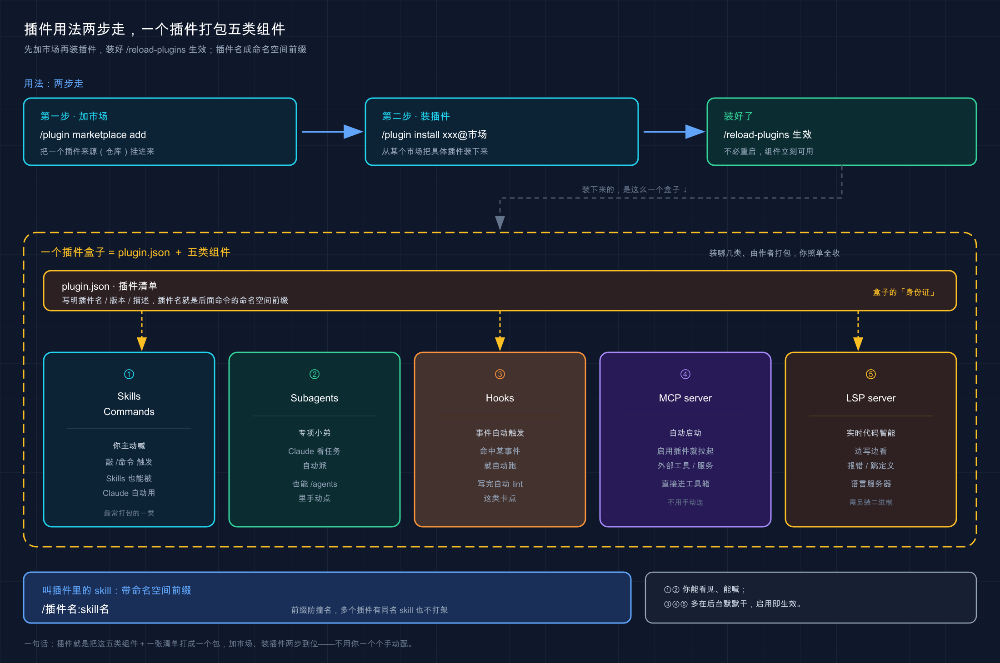

# 24 · 插件（Plugins）：把一堆零碎配置一键打包

> 📚 **系列导航**：上一篇 [23 子代理（Subagents）] 教你亲手造了一个专项小助手。但你有没有发现一个问题——subagent、命令、skill、hook 这些好东西，全是「一个个单独配」的散件。这一篇教你把它们打包成**插件（plugin）**：一键装、一键停，还能直接从「插件市场」拿别人造好的现成全家桶。

兄弟们，今天聊怎么把一堆零碎配置一键打包。说起来，你有没有遇到过这种场景：你辛苦给团队配好了一套「subagent + hook + MCP」，然后某天来了个新同事，你给他讲了半小时——「这个文件放 `agents/`，那段 hook 加到 `settings.json` 里，对了还有 `.mcp.json` 别忘了」——讲完发现他还是漏了一处，跑起来跟你的不一样。这不是谁的问题，散件管理本来就是这样：**配置越分散，口头交代越容易漏**。

你回头看看前面几篇攒下的家当：第 18 篇写了 `CLAUDE.md`，第 22 篇配了 MCP server，第 23 篇造了 subagent，中间还穿插着 skill、hook。**每一样单独看都好用，但它们全是散的**——subagent 放 `agents/`、hook 写在 `settings.json`、MCP 配在 `.mcp.json`，分散在好几个文件里。

问题来了：你在 A 项目辛辛苦苦配好的这一套，换到 B 项目想复用，得一个文件一个文件挨个抄过去。团队里新同事想要你这套配置，你得把目录结构口头讲一遍，还容易漏。**散件管理，就是又累又容易出错。**

说白了，插件就是 Claude Code 给这个问题的官方答案：**把 commands、subagents、skills、hooks、MCP server 这些散件，打成一个能整体分发、能一键启停的包**。这一篇就把「插件是啥、怎么从市场拿现成的、怎么管」一次讲透。

**看完这一篇，你会拿到：**

- 插件到底打包了哪些东西，以及它和「散装配置」该怎么选，一张表说清
- 「插件市场（marketplace）」两步走的逻辑：先加市场、再装插件，命令照抄就能用
- 从官方演示市场亲手装一个插件、跑通它带来的命令，全程给预期输出
- 插件目录长什么样（`plugin.json` + 各组件文件夹），自己想打包时照着摆
- 装第三方插件前必须过的「信任关」，别把陌生插件当无害软件

---

## 01 先搞懂：插件到底是个什么东西

先给结论：**插件就是一个「自包含的文件夹」，把你前面学的那些扩展（skill、subagent、hook、命令、MCP server）打包在一起，能当成一个整体来装、来停、来分发。**

为什么需要它？因为散装配置有三个绕不开的痛点：**跨项目复用麻烦、团队共享靠人肉、版本更新没法追**。你在一个项目里配好的 subagent 加 hook，想搬到另一个项目，只能手动复制粘贴；想分给同事，得把每个文件都说清放哪儿。插件就是把这一整套「装进一个盒子」，盒子整个搬走、整个递给别人就行。

**类比：浏览器扩展商店。** 你想给 Chrome 加广告拦截、加翻译、加截图——不用自己写代码、改配置，去扩展商店点一下「安装」，一整套功能就进来了，不想要了点「移除」就干净卸载。Claude Code 的插件就是这套思路：**逛市场、一键装一整套功能，不用自己一件件手动配**；它把过去散在好几个文件里的扩展，变成商店里一个能直接「装/卸」的条目。

官方文档把「插件」和「散装配置」的取舍讲得很清楚，我替你浓缩成一张表：

| 维度 | 散装配置（`.claude/` 目录） | 插件（plugin） |
|------|------------------------|---------------|
| **最适合** | 单个项目自用、个人工作流、快速试验 | 团队/社区共享、跨项目复用、版本化发布 |
| **怎么共享** | 手动复制文件给别人 | 通过市场，别人 `/plugin install` 一键装 |
| **skill 名字** | 短，如 `/hello` | 带命名空间，如 `/my-plugin:hello` |
| **能不能版本管理** | 不行，改了没法通知用户 | 能，设了版本号用户才收到更新 |

这张表的判断逻辑就一句话：**自己一个项目随手用，散装就够了；要给别人用、要跨项目搬、要能更新，才上插件**。官方也建议「先用 `.claude/` 散装快速迭代，准备好共享了再转成插件」——别一上来就为一个一次性配置造插件，那是过度工程。

这里有个新手最容易迷糊的点，必须先说清：**插件里的 skill 名字永远带「命名空间」**。你在一个叫 `my-plugin` 的插件里写了个 `hello` skill，调用时不是 `/hello`，而是 `/my-plugin:hello`。

> 💡 一句话总结：插件就是把 skill、subagent、hook、命令、MCP server 打成一个能整体装卸的盒子；**自用散装就行，要共享、要复用、要更新才打包成插件**。

---

## 02 为什么打成一个包，比散着放强

上一节讲了「是什么」，这一节补一刀「凭什么值得」——因为光知道概念，你可能还是觉得「我手动复制几个文件也不费事」。

真正的差距在三个地方，结合具体场景讲，你就懂了。

**第一，跨项目复用。** 设想你常备一套「git 提交工作流」的配置——一个生成规范提交信息的 skill、一个提交前自动跑 lint 的 hook。早期这套是散装的，换一个新项目就得把 `skills/` 和 `settings.json` 里那段挨个抄。一旦抄漏了 hook 那段，新项目里提交前没跑 lint，就可能混进去一个格式错误。**打成插件之后，新项目里一句 `/plugin install` 就齐活了，再不会漏。**

**第二，团队共享。** 散装配置分享给同事，基本靠「你把这个文件夹拷过去，放到 `.claude/agents/` 下，然后那个 hook 记得加到 settings 里」——一通口头交代，对方十有八九配错。插件不一样：**你把它发到一个市场（哪怕是公司内部的私有仓库），同事一条命令装好，配置完全一致**，不存在「我这能跑你那不行」。

**第三，版本更新。** 这是散装最致命的短板。散装配置改了，用过的人根本不知道，只能你挨个通知。插件可以带版本号，**你发新版，用户更新时就自动拿到最新的**；官方还专门做了「自动更新」——官方市场默认开着，第三方市场默认关着（这设计很合理，自己人的更新可以自动收，外人的得你主动同意）。

**类比：手机 App 和它在应用商店的关系。** 你装了个 App，它出新版本，应用商店推给你「有更新」，你点一下就升级了，不用自己重新下安装包。插件之于市场，就是 App 之于应用商店——**装是一键装，更新是顺着市场流下来的，不用你手动搬运**。

对照一下散装和插件在这三件事上的差距：

| 你要干的事 | ❌ 散装配置 | ✅ 插件 |
|-----------|-----------|--------|
| 搬到新项目 | 手动复制每个文件，容易漏 | `/plugin install` 一句 |
| 给同事用 | 口头交代放哪、怎么配 | 发市场，对方一条命令装 |
| 推送更新 | 没法通知，只能人肉喊 | 带版本号，用户自动/手动更新 |

说句实话，**单人单项目，插件的好处你感受不深；一旦人多了、项目多了，散装就开始拖后腿**。我自己也是带团队之后才彻底转向插件的——之前给新人配环境，得拉着人对着屏幕一个文件一个文件讲「这个放 `agents/`、那个 hook 加到 settings 里」，一上午能折腾掉小半天，还总有人漏一处；打成插件挂到内部仓库之后，新人就一条命令装完，配置跟我这边一模一样，再没出过「我这能跑你那不行」。

> 💡 一句话总结：插件的真正价值在「规模」——**跨项目复用、团队共享、版本更新**这三件事，散装全靠人肉，插件全是一条命令；人和项目越多，这差距越大。

---

## 03 插件市场：先加「商店」，再装「应用」

知道了插件是什么，下一个问题是：**别人造好的插件，我从哪儿拿？** 答案是「插件市场（marketplace）」。

**这里有个全篇最关键、新手最容易卡壳的认知：用市场是「两步」，不是「一步」。**

- **第一步：加市场。** 把一个市场「注册」给 Claude Code，让它能浏览这个市场里有哪些插件。**注意，这一步一个插件都没装**，只是让你看得到货架。
- **第二步：装插件。** 在货架上挑你要的，单独安装。

**类比：给手机装一个新的「应用商店」。** 你手机上除了自带商店，还可以装第三方应用商店——但「装好这个商店」不等于「装好了里面的 App」。商店只是让你能进去逛、能看到它的全部收藏，**具体要哪个 App，还得你自己点进去单独下载**。插件市场就是这么个「应用商店」：加进来是让你能逛，装哪个插件是另一码事。

想清楚这个「两步」，下面的命令就全顺了。先看加市场——官方给了好几种来源，最常用的是从 GitHub 加：

```text
/plugin marketplace add owner/repo
```

把 `owner/repo` 换成实际的 GitHub 仓库名就行（比如官方演示市场是 `anthropics/claude-code`）。除了 GitHub，市场还能从 Git URL（GitLab、Bitbucket、自托管都行）、本地路径、远程 URL 加，写法官方文档都列了，新手记住 GitHub 这种最常用的即可。

加完市场，装插件用这条：

```text
/plugin install plugin-name@marketplace-name
```

`@` 后面跟的是市场名，意思是「从这个市场装这个插件」。比如从官方市场装 GitHub 集成：

```text
/plugin install github@claude-plugins-official
```

这里要单独点名**官方自带的那个市场**：`claude-plugins-official`。**它不用你手动加——你一启动 Claude Code 它就在了**，里面是 Anthropic 精选的一批插件（GitHub、GitLab、Slack、Figma、Sentry 这些外部集成，还有代码智能的 LSP 插件、安全审查插件等）。所以你想装官方插件，跳过「加市场」那步，直接 `install` 就行。

> 💡 一句话总结：用市场永远是「先加市场、再装插件」两步——`/plugin marketplace add` 加货架、`/plugin install xxx@市场名` 下单；**唯独官方市场 `claude-plugins-official` 自带，开箱就能直接装**。

---

## 04 三个市场，分别是干嘛的

上一节出现了好几个市场名，新手容易搞混。这一节把官方维护的三个市场摆清楚，你以后看到名字就知道是谁。

**类比：同一个城市里三家不同定位的商场。** 一家是品牌直营旗舰店（货都是官方精挑的），一家是开放入驻的大卖场（第三方来摆摊，但进场前过了安检），还有一家是临时的样板展厅（专门摆样品给你看效果）。Claude Code 这三个官方市场正好对上：

| 市场 | 加它的命令 | 定位 | 里面是啥 |
|------|-----------|------|---------|
| `claude-plugins-official`（官方） | 自带，无需添加 | 官方精选 | Anthropic 挑过的插件，最稳 |
| `claude-community`（社区） | `/plugin marketplace add anthropics/claude-plugins-community` | 第三方提交、过了自动审查 | 社区贡献的插件，每个固定到具体提交 |
| `claude-code-plugins`（演示） | `/plugin marketplace add anthropics/claude-code` | 官方放的示例 | 展示插件能力的样板插件 |

几个要点说清楚：

**官方市场最稳但不开放申请。** Anthropic 自己决定收哪些插件，里面的东西经过精选，**踩坑概率最低**。你日常想要的大路货——GitHub 集成、各语言的 LSP、安全审查——基本都在这儿。

**社区市场是开放的，但有门槛。** 第三方插件提交后，要过 Anthropic 的自动验证和安全筛选才进得来，而且每个插件都被「固定到某次具体提交」——意思是你装的就是审查时那个版本，作者不能偷偷换内容。**它要手动加**，加完用 `claude-community` 这个名字装。

**演示市场是用来学的。** 它放的是「展示插件系统能做什么」的样板，下一节的动手实验就拿它练手。**它也要手动加**。

建议的取用顺序：**官方市场优先，官方没有的再去社区市场找，找到了先看主页和它要的权限再装**。演示市场一般只在教学或试水时用——它的定位就是样板，不是给你天天用的生产插件。

> 💡 一句话总结：官方市场自带最稳、社区市场要手动加但过了安检、演示市场是学习样板；**日常先翻官方，缺货再去社区，演示拿来练手**。

---

## 05 装一个插件，到底装进来了什么

`/plugin install` 一敲，到底有什么东西进了你的环境？这一节讲清楚，免得你装完一脸懵「然后呢，我怎么用它」。

一个插件可能带这几类组件进来，**每一类的「触发方式」不一样**，这是关键：

| 组件 | 装进来后怎么用 |
|------|--------------|
| **Skills / Commands** | 变成 `/插件名:skill名` 这种命名空间命令，你手动敲、或 Claude 自动调 |
| **Subagents** | 出现在 `/agents` 列表里，Claude 按任务自动派、你也能手动点 |
| **Hooks** | 在对应事件（如改文件后）自动触发，不用你管 |
| **MCP server** | 自动启动，它的工具混进 Claude 的工具箱里直接能用 |
| **LSP server** | 给 Claude 实时代码智能（跳转定义、查引用、即时报错），需另装语言服务器二进制 |

看出来没？**有的是「你主动喊」（skill、命令），有的是「它自动干」（hook、MCP、LSP）**。所以装完一个插件，你得知道它到底带了哪几类东西，才知道怎么用它。

好消息是，**新版 Claude Code 在你装之前就把这些列给你看**。在 `/plugin` 界面里点开一个插件的详情，会有个「**将安装**」区块，列出这个插件带的命令、agents、skills、hooks、MCP 和 LSP server；还会给一个「**上下文成本**」估算——告诉你这插件每轮大概往你的上下文窗口塞多少 token。

这个「上下文成本」得多说一句，**它很重要**。回想第 19 篇讲的上下文管理：插件带的每个组件，都会占掉你工作台的一块地方。装太多插件，等于还没开始干活，上下文就被各种 skill 说明、MCP 工具定义占掉一大截。**装插件前一定要看这个估算，几百 token 的无所谓，上千的得掂量「我是不是真用得上」**。装一堆用不上的插件白占上下文，是新手常犯的浪费。

还有个细节：**装完插件，记得运行 `/reload-plugins` 让它生效**，不用重启 Claude Code。会话中途装、停、启用插件，都靠这条命令刷新：

```text
/reload-plugins
```

跑完它会告诉你当前加载了几个插件、几个 skill、几个 agent、几个 hook、几个插件 MCP server 和 LSP server。

> 💡 一句话总结：插件带进来的组件分「你主动喊」（skill/命令）和「它自动干」（hook/MCP/LSP）两类；**装前在详情里看「将安装」清单和上下文成本，装后 `/reload-plugins` 生效**。



这张图把本篇的两条主线画在一起：左边是「加市场 → 装插件」的两步流程，右边是一个插件盒子打包的五类组件（skill、subagent、hook、MCP server、LSP server），以及它们装进来后分别是「你主动喊」还是「它自动干」。

---

## 06 动手：加一个市场、装一个插件、用起来

光看不练假把式。下面带你**从官方演示市场加市场、装一个真插件、跑通它带来的命令**，全程不依赖任何复杂环境，跟着抄就行。我们装的是官方文档点名的 `commit-commands`——一个给 git 工作流加 skill 的插件。

**第一步：启动 Claude Code，加演示市场**

随便进一个目录启动 Claude Code：

```bash
claude
```

进去后在输入框敲（这是「两步」里的第一步——加市场）：

```text
/plugin marketplace add anthropics/claude-code
```

**预期**：Claude Code 下载这个市场的目录，提示市场添加成功。此时你的「货架」上有货了，但**还没装任何插件**。

**第二步：打开插件管理器逛一逛**

敲：

```text
/plugin
```

**预期**：弹出一个带四个标签页的界面——**发现 / 已安装 / 市场 / 错误**，用 `Tab` 键来回切（`Shift+Tab` 往回切）。切到「**发现**」标签，能看到你刚加的演示市场里那些样板插件。**看到 `commit-commands` 在列表里 = 市场加对了。**

**第三步：装 `commit-commands` 插件**

你可以在界面里点它选安装范围，也可以直接命令行装（这是「两步」里的第二步）：

```text
/plugin install commit-commands@claude-code-plugins
```

注意 `@` 后面是 `claude-code-plugins`——这是这个演示市场的**内部名字**（不是你加市场时写的 `anthropics/claude-code`，那是仓库地址）。装的时候它会让你选范围：

- **用户范围**（默认）：所有项目里你自己都能用
- **项目范围**：装进 `.claude/settings.json`，这个仓库的所有协作者都能用
- **本地范围**：只在这个仓库、只有你自己能用

先选默认的「用户范围」即可。

**预期**：终端提示插件安装成功，可能还会列出它附带自动装了哪些依赖。

**第四步：让插件生效，看它带来的命令**

```text
/reload-plugins
```

**预期**：Claude Code 重新加载，输出当前加载的插件、skill、agent、hook 以及插件 MCP server 和 LSP server 数量。因为 `commit-commands` 的 skill 带命名空间，它提供的是像 `/commit-commands:commit` 这样的命令。

**第五步：用起来——亲眼看插件的 skill 跑活**

先在当前目录随便改个文件制造一点改动（比如新建一个文本文件），然后敲：

```text
/commit-commands:commit
```

**预期**：这个 skill 会帮你**暂存改动、生成一条提交信息、创建提交**。看到它走完这套 git 提交流程，**说明插件不光装上了，它带的 skill 真的能用了**——这就是「装一个插件、白捡一套现成工作流」的完整体感。

> ⚠️ 如果第五步敲 `/commit-commands:commit` 提示找不到命令，先确认你第四步跑了 `/reload-plugins`；还不行就 `/plugin` 进「错误」标签看加载报错。

跑通这五步，你就把「加市场 → 装插件 → 生效 → 用起来」这条完整链路亲手验证了一遍。**以后装任何插件，本质都是这套流程。**

> 💡 一句话总结：加市场（`marketplace add`）→ 装插件（`install`）→ 生效（`/reload-plugins`）→ 用命名空间命令——**亲手把 `commit-commands` 跑通一遍，比记十条命令都管用**。

---

## 07 想自己打包？先认识插件的目录长相

前面全是「用别人的插件」，但你迟早会想「我能不能把自己那套配置也打成插件」。这一节不教你从零造（那是单独一篇的量），只带你**认住插件的目录长什么样**，做到看得懂、心里有数。

一个插件的核心就两部分：**一个「身份证」文件 + 各组件的文件夹**。

**身份证**就是 `.claude-plugin/plugin.json`，它声明这个插件的名字、描述、版本：

```json
{
  "name": "my-first-plugin",
  "description": "A greeting plugin to learn the basics",
  "version": "1.0.0"
}
```

其中 `name` 最关键——**它就是 skill 的命名空间前缀**。这个插件里的 skill 会变成 `/my-first-plugin:xxx`。`version` 是可选的，但**设了版本号用户才会在你更新时收到更新**，所以发布时记得每次发新版就提一下版本号。

**各组件的文件夹**就摆在插件根目录下，按类型分门别类。官方的目录约定我整理成一张表，照着摆就对：

| 你想加什么 | 放到哪个目录 |
|-----------|------------|
| skill | `skills/<名字>/SKILL.md` |
| subagent | `agents/` |
| hook | `hooks/hooks.json` |
| MCP server | 根目录的 `.mcp.json` |
| LSP server | 根目录的 `.lsp.json` |

整个插件摆起来大概长这样：

```text
my-first-plugin/
├── .claude-plugin/
│   └── plugin.json        ← 身份证，只有它放这儿
├── skills/
│   └── hello/
│       └── SKILL.md
├── agents/
│   └── reviewer.md
└── hooks/
    └── hooks.json
```

这里有个**官方反复强调、新手必踩的坑**，我替你画重点：

> **常见错误**：不要将 `commands/`、`agents/`、`skills/` 或 `hooks/` 放在 `.claude-plugin/` 目录内。只有 `plugin.json` 应该在 `.claude-plugin/` 内。所有其他目录必须在插件根级别。

说白了：**`.claude-plugin/` 这个文件夹里只准放 `plugin.json` 一个东西**，其他组件文件夹全部摆在插件根目录下，跟 `.claude-plugin/` 平级。这个坑我第一次打包就踩了——图省事顺手把 `skills/` 也塞进了 `.claude-plugin/`，结果插件明明加载成功、`/reload-plugins` 也没报错，可那个 skill 死活不出现。我对着 plugin.json 检查了半天名字、版本、命名空间，全对，最后才反应过来是目录摆错位置了。挪出来跟 `plugin.json` 平级，立马就好。

你可能注意到，这套目录结构跟第 13 篇讲的 `.claude/` 项目结构、第 23 篇的 `agents/`、第 22 篇的 `.mcp.json` 几乎一模一样。**这不是巧合**——插件本质就是「把你散在 `.claude/` 各处的那些配置，按同样的格式收进一个独立文件夹」。所以官方才说散装配置能「转换成插件」，因为格式是相通的，搬过去就行。

想真正动手测自己打的包，官方给了个不用装市场的快捷办法——启动时用 `--plugin-dir` 直接加载本地插件目录：

```bash
claude --plugin-dir ./my-first-plugin
```

这个标志专门给开发测试用，改完插件跑 `/reload-plugins` 就能看到效果，不用走「发市场再安装」那一整套。

> 💡 一句话总结：插件 = `.claude-plugin/plugin.json`（身份证，`name` 定命名空间）+ 根目录下的各组件文件夹；**记死那条铁律——`.claude-plugin/` 里只放 `plugin.json`，别的文件夹全摆根目录**。

---

## 08 装第三方插件，先过「信任关」

这是全篇最该慎重的一节，**也是新手最容易掉以轻心的地方**：插件不是无害的小工具，**它能用你的权限在你机器上执行任意代码**。

回想第 21 篇讲的安全边界——那一篇的判断力，到了插件这儿一样适用，甚至更要紧。官方把话说得很重：

> 插件和市场是高度受信任的组件，可以使用您的用户权限在您的机器上执行任意代码。仅从您信任的来源安装插件和添加市场。

这是什么意思？**一个插件里可能带 hook（自动跑脚本）、带 MCP server（自动启动的程序）、带 `bin/` 里的可执行文件**。你装它、启用它，这些东西就在你的权限下跑起来了——它能读你的文件、能联网、能执行命令，**和你自己敲命令的权限一样大**。装一个来路不明的插件，约等于把陌生人的脚本直接在你电脑上运行。

**类比：从陌生网站下载一个 `.exe` 双击运行。** 你不会随便从一个没听说过的网站下个可执行文件就双击吧？因为它一旦跑起来，能干的事跟你本人一样多。装第三方插件就是这个性质——**来源可信不可信，是装之前必须先回答的问题**，不能图省事直接装。

所以这里给你三条「装第三方插件前」的自检，值得当成硬规矩：

| 检查项 | 怎么做 |
|--------|--------|
| **来源可信吗** | 优先官方市场；社区市场的看作者、看主页；陌生个人仓库的，没把握就别装 |
| **它带了什么** | 装前在 `/plugin` 详情的「将安装」里看清楚带不带 hook / MCP / 可执行文件 |
| **范围给到哪** | 不确定的先用「本地范围」试，别一上来就「用户范围」铺到所有项目 |

几个能让你稍微安心的官方设计：**社区市场的插件过了自动验证和安全筛选，且固定到具体提交**（作者没法偷换内容）；**官方市场是 Anthropic 精选**，最省心。但这些都不能替代你自己的判断——**核心还是那句「只从你信任的来源装」**。

一套稳妥的实践：**官方市场的插件直接装；社区市场的，先去它主页扫一眼是谁、干什么的、要哪些权限，再决定；陌生来源的私人插件，除非你能看懂它的代码，否则一律不碰**。说句实话，插件这东西方便归方便，但「方便」和「安全」从来是要你自己拿捏的——**别把一键安装的顺滑，当成了它无害的证据**。

> 💡 一句话总结：插件能用你的权限跑任意代码，装第三方的等于在你机器上运行陌生人的脚本；**装前三查——来源可信吗、带了啥、范围给到哪，官方市场最稳，陌生来源宁可不装**。

---

## 09 小结

这一篇我们把 Claude Code 的「插件」从概念捋到动手——**它本质就是把你前面学的那些散件，打成一个能整体装卸、能分发、能更新的盒子**。

把核心要点串起来回顾：

| 你要做的事 | 用什么 | 关键点 |
|-----------|--------|--------|
| 理解插件是什么 | plugin = 散件打包盒 | 装 skill/subagent/hook/MCP/LSP，自用散装、共享才打包 |
| 拿别人的插件 | 插件市场 | 两步：`marketplace add` 加市场 → `install` 装插件 |
| 认市场 | 三个官方市场 | 官方自带最稳、社区要手动加、演示拿来练 |
| 让插件生效 | `/reload-plugins` | 中途装/停都靠它刷新，不用重启 |
| 看清装了啥 | `/plugin` 详情 | 「将安装」清单 + 上下文成本，装前先看 |
| 自己打包 | `plugin.json` + 组件文件夹 | `.claude-plugin/` 里只放 `plugin.json` |
| 装第三方 | 信任三查 | 能跑任意代码，只从可信来源装 |

**你现在应该能：** 看懂插件和散装配置该怎么选、用「加市场 → 装插件 → `/reload-plugins`」三步从市场拿到现成功能、看懂插件详情里的「将安装」清单和上下文成本、认住插件的目录长相，并且清楚装第三方插件前必须先过信任关。**这套能力让你不用什么都自己从零配——市场上现成的全家桶，拿来即用。**

从第 18 篇到这一篇，你已经把 Claude Code 的「扩展工具箱」配齐了：`CLAUDE.md`、MCP、subagent、skill、hook，最后用插件把它们打包统管。**工具，到这儿算是装齐了。**

---

下一篇 **25「记忆系统（memory）」**——工具装齐了，但你有没有发现一个别扭的地方：每开一个新会话，Claude 又是一张白纸，你上次告诉它的偏好、这个项目的关键事实，它转头就忘。下一篇就聊**怎么让 Claude 跨会话「记住」你**——记住你爱用的技术栈、记住项目的硬规矩，不用每次从头交代。想想看：如果它能像个共事久了的老搭档一样，开口就知道你的习惯，是不是省事多了？
