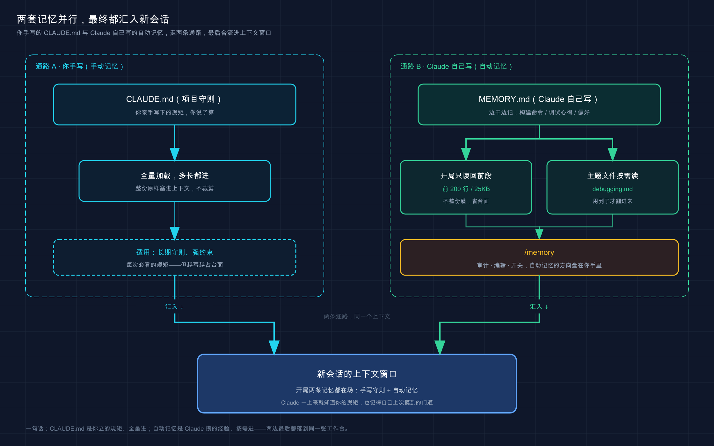

# 25 · 记忆系统（memory）：让它跨会话记住你

> 📚 **系列导航**：上一篇 [24 插件（Plugins）] 教你把一堆零碎配置打包成一键装、一键停的插件。这一篇聊一件更底层的事——**怎么让 Claude 跨会话记住你**。不只是你手写的 CLAUDE.md，还有它工作时自己攒下的那本「私人笔记」，你纠正它一句，它就悄悄记下来，下次开工自动想起。

先说个新手特别容易踩的坑。

刚摸到「能让 Claude 记东西」这功能时，很容易跟捡到宝似的，**啥都往里塞**：今天调通了一个端口号塞进去、改了个临时变量名塞进去、连「这次先用 8081 别用 8080」这种一次性的破事也塞。背后的逻辑往往是「记得越多越聪明」。

结果呢？两周后再开项目，它张口就跟你提那个早就废弃的 8081 端口，还有几条连你自己都忘了为啥写的「偏好」。**它记了一脑子没用的，真正该记的反倒被淹了。**

这时候才会搞明白：**记忆这东西，不是塞得越多越好，是「该记的记准、不该记的别碰」。** 记错了比不记还坑——它会拿着过时的信息一本正经地误导你。

前面 [18 CLAUDE.md 使用指南] 我们专门讲过 CLAUDE.md 怎么写，[19 上下文管理] 也反复提到「自动记忆会占上下文」。但这两块到底怎么咬合成一套完整的「记忆系统」、那本 Claude 自己写的笔记又是怎么运转的，一直没讲透。今天补上。

**看完这一篇，你会拿到：**

- Claude Code 的记忆到底分哪两套：你写的 CLAUDE.md vs 它自己写的「自动记忆」，谁管啥一张表看明白
- 「自动记忆」存在哪个文件、怎么被加载进上下文、怎么用 `/memory` 审计和删改
- 怎么让它记一条、记完落到哪、下次怎么自动生效，一步步带你跑通
- 一张「该记 vs 不该记」清单，帮你避开「啥都塞」那个坑
- `#` 这个老快捷键现在还能不能用，官方现在的正确做法是什么

---

## 01 先分清：记忆其实是两套，不是一套

先给结论：**Claude Code 的「记忆」是两套并行的系统，一套你写、一套它写，各管各的。** 很多人一提「记忆」只想到 CLAUDE.md，其实那只是一半。

**类比：贴在显示器边上的便利贴。** 你桌上常有两种纸。一种是你正经打印出来、用图钉钉在隔板上的「工作守则」——项目规矩、提交流程，写得规规整整，谁来都照着办，这是 **CLAUDE.md**。另一种是你随手撕一张便利贴，写句「上次那个 bug 是缓存没清」往显示器边一贴，下次扫一眼就想起来——这种**它自己随手记的小条**，就是「自动记忆（auto-memory）」。两种纸都在你眼前，但一种是「我定的规矩」，一种是「我顺手记的心得」。

官方把这两套的分工讲得很清楚，整理成一张对照表——**这是本篇最该先记住的一张**：

| 维度 | CLAUDE.md 文件 | 自动记忆（auto-memory） |
|------|--------------|----------------------|
| **谁写的** | 你（手动写） | Claude（自己写） |
| **装什么** | 指令和规则 | 它学到的经验和模式 |
| **典型内容** | 编程标准、工作流、项目架构 | 构建命令、调试心得、它发现的你的偏好 |
| **什么时候加载** | 每次会话，**全量加载** | 每次会话，但**只加载前 200 行或 25KB** |
| **范围** | 用户 / 项目 / 本地级 | 每个 git 仓库一份（所有 worktree 共享） |

看出关键区别没？**CLAUDE.md 是「你想让它怎么干」，自动记忆是「它自己摸索出来的怎么干」。** 你纠正它「这个项目跑测试得先起本地 Redis」，它下次就记得了——这条不用你手动写进任何文件，它自己存。

还有一条官方反复强调、你必须先吃透的认知：

> Claude 将它们视为上下文，而不是强制配置。要阻止某个操作，无论 Claude 决定什么，请改用 PreToolUse hook。

什么意思？**记忆（不管哪一套）都只是「影响它想干啥」的软提示，不是「锁死它能干啥」的硬约束。** 这跟 [20 权限配置] 那篇的结论一脉相承——真要拦死某个操作，得靠权限规则或 hook，光在记忆里写一句「不要 push」是拦不住的。记忆负责「让它更懂你」，不负责「替你把关」。

> 💡 一句话总结：记忆分两套——**CLAUDE.md 你手写规矩、自动记忆它自己记心得**；两套都只是软提示，想真正拦死操作得靠权限或 hook，不是写进记忆就万事大吉。



这张图把两条记忆通路并排画出来：左边是你手写、全量加载进上下文的 CLAUDE.md（项目守则）；右边是 Claude 工作时自己往 `MEMORY.md` 里记、下次会话自动读回前 200 行的自动记忆（私人笔记）。两条线最后都汇进「新会话的上下文窗口」，让它一开工就「记得你」。

---

## 02 CLAUDE.md 在记忆体系里的位置

CLAUDE.md 的写法 [18] 已经讲细了，这里只补一句它在「记忆系统」里扮演的角色——**它是那张钉死的、人人都得看的「工作守则」**。

**类比：还是显示器旁那两种纸，CLAUDE.md 是钉死的那张。** 它不是随手撕的便利贴，是你认真打印、图钉钉牢的正式守则。所以它有几个特点和自动记忆完全不同：**你写的、进版本控制全队共享、每次会话全量加载、内容是「规则」不是「心得」**。

官方给 CLAUDE.md 划了清晰的分层，按加载顺序（从最广到最具体）是这样：

| 层级 | 位置 | 管谁 |
|------|------|------|
| **托管策略级** | macOS: `/Library/Application Support/ClaudeCode/CLAUDE.md`<br>Linux/WSL: `/etc/claude-code/CLAUDE.md` | 企业 IT 统一下发，个人一般不涉及 |
| **用户级** | `~/.claude/CLAUDE.md` | 你所有项目的个人偏好 |
| **项目级** | `./CLAUDE.md` 或 `./.claude/CLAUDE.md` | 这个项目、全队共享（进 git） |
| **本地级** | `./CLAUDE.local.md` | 这个项目、只你自己（进 `.gitignore`） |

这里有个跟自动记忆的**关键差别，新手最该记牢**：

**CLAUDE.md 无论多长都全量加载，自动记忆有上限。** 官方原话——「CLAUDE.md 文件无论长度如何都完整加载」。所以 [18] 才反复劝你把它压在 200 行以内：不是加载不进去，是**写越长越占上下文、它遵守得反而越差**。自动记忆则相反，它有硬上限（下一节细说），超了的部分根本不加载。

实操里分工可以很清楚：**「这是你定的死规矩」就写 CLAUDE.md，「这是让它自己摸索积累的」就交给自动记忆。** 比如「依赖只用 pnpm」这种铁律手写进 CLAUDE.md；而「这个项目的测试得起 Redis」这种它能自己发现的，不必手写，纠正它一次让它自己记。

> 💡 一句话总结：CLAUDE.md 是记忆体系里那张「钉死的正式守则」——你写、全队共享、全量加载、装的是规则；和「它自己随手记心得」的自动记忆，定位完全不同。

---

## 03 自动记忆：它自己写的那本笔记

重点来了，也是 [18] 留给本篇的正题——**自动记忆（auto-memory），Claude 工作时给自己记的那本笔记**。

> ℹ️ 自动记忆需要 Claude Code v2.1.59 或更高版本，默认是开着的。敲 `claude --version` 看一眼你的版本；太老就升一下（升级方法见 [02 安装]）。

**类比：干活久了的老搭档。** 一个跟你配合了一段时间的搭档，有些事你压根不用反复交代——他自己会在脑子里记下来：「这项目构建得跑 `make build` 不是 `npm build`」「上次那个偶发 bug 是时区没设对」。下次遇到类似的，他自己就想起来了。**你不用交代，他边干边积累——自动记忆就是 Claude 的这种「主动学习」能力。**

它具体记些什么？官方给的清单：**构建命令、调试见解、架构笔记、代码样式偏好、工作流习惯。** 注意一个关键设计——**它不是每次会话都往里记**，而是「**根据这条信息未来对话还用不用得上，来决定值不值得记**」。一次性的破事它一般不会记（这点正好治了「啥都塞」的病）。

那它怎么实际写进去的？两种触发方式：

**第一种，你直接让它记。** 在对话里说一句「以后这个项目都用 pnpm，别用 npm」或者「记住 API 测试要本地起 Redis」，它就把这条存进自动记忆。官方原文：

> 当你要求 Claude 记住某些内容时，如「总是使用 pnpm，而不是 npm」或「记住 API 测试需要本地 Redis 实例」，Claude 将其保存到自动记忆。

**第二种，它从你的纠正里自己学。** 你不用明说「记住」，只要你纠正了它一次——比如它用 `npm test` 你说「这项目是 `pnpm test`」——它判断这条以后还用得上，就自己记下来了。这是自动记忆最香的地方：**你正常干活、正常纠正，它在背后默默积累，零额外动作。**

你怎么知道它正在记？**看界面提示。** 官方说，当你看到 Claude Code 界面里冒出「Writing memory」或「Recalled memory」，就是它在往那本笔记里写、或者从里面读了。

> 💡 一句话总结：自动记忆是 Claude 自己写的便利贴——**你让它记、或它从你的纠正里自学**，只记「以后还用得上」的；看到界面提示「Writing/Recalled memory」就是它在记或在翻笔记。

---

## 04 它存在哪、又怎么被加载进上下文

这节解决两个最实际的问题：**这本笔记到底存哪个文件？它又是怎么塞进上下文让 Claude「想起来」的？** 后半截正好呼应 [19] 讲的上下文管理。

**存放位置**，官方定死了——每个项目一个独立的记忆目录：

```text
~/.claude/projects/<project>/memory/
├── MEMORY.md          # 简洁索引，每次会话都加载
├── debugging.md       # 调试相关的详细笔记
├── api-conventions.md # API 设计决策
└── ...                # Claude 自己创建的其他主题文件
```

几个要点拆开说：

**`MEMORY.md` 是入口和索引。** 它像便利贴里的「目录页」，Claude 用它跟踪「我都记了些啥」。详细内容它会拆到 `debugging.md`、`api-conventions.md` 这种**主题文件**里，免得 `MEMORY.md` 越滚越长。

**`<project>` 这个名字按 git 仓库算。** 所以——**同一个仓库的所有 worktree 和子目录，共用这一份自动记忆**。这点跟 CLAUDE.md 不一样（CLAUDE.md 是按目录树拼接的）。

**它是机器本地的，不跨设备同步。** 你这台电脑记的，换台电脑不会有。也别指望它进 git——它就在你 `~/.claude` 下待着。

接下来是**最该理解的机制——它怎么被加载进上下文**，官方写得很死：

> `MEMORY.md` 的前 200 行或前 25KB（以先到者为准）在每次对话开始时加载。超过该阈值的内容在会话开始时不加载。

翻译成人话，三层意思：

1. **每次新会话，自动读回 `MEMORY.md` 的前 200 行**（或 25KB，哪个先到算哪个）。这就是它「跨会话还记得」的原理——上次记的，这次开局自动进上下文。
2. **超过 200 行 / 25KB 的部分，开局不加载。** 所以 Claude 会主动把 `MEMORY.md` 保持精简，详细的甩进主题文件。
3. **主题文件（`debugging.md` 这些）开局也不加载**，它需要时用文件工具按需读——跟 [18] 讲的「子目录 CLAUDE.md 按需加载」一个道理。

把 CLAUDE.md 和自动记忆的加载规则放一起对比，差别一目了然：

| | CLAUDE.md | 自动记忆 `MEMORY.md` |
|--|-----------|---------------------|
| 加载多少 | **全量**，多长都加载 | **只前 200 行 / 25KB** |
| 超出部分 | 照样全加载（所以劝你写短） | **开局不加载**，按需才读 |
| 谁维护精简 | 你手动删 | Claude 自动拆分 |

理解这个上限，你就懂为啥它不会被记忆「撑爆」上下文——**自动记忆天生带了个 200 行的闸**，而 CLAUDE.md 那个闸得你自己把。

> 💡 一句话总结：自动记忆存在 `~/.claude/projects/<project>/memory/MEMORY.md`，按 git 仓库分、机器本地、worktree 共享；**每次开局只读回前 200 行 / 25KB**，超出的拆进主题文件按需读——所以它有天生的上限，不会撑爆上下文。

---

## 05 `/memory`：审计、编辑、开关，一个命令全包

自动记忆最让人不放心的一点是——**它自己记的，万一记错了、记了过时的怎么办？**（开头那个 8081 端口的坑就是这么来的。）官方给的答案是一个命令：`/memory`。

**类比：随时能掀开看的那叠便利贴。** 它自己记的笔记不是黑箱，你想看随时掀开、想撕随时撕。`/memory` 就是「掀开看」这个动作。

在会话里敲 `/memory`，它干三件事：

1. **列出当前会话加载的所有记忆文件**——包括 CLAUDE.md、CLAUDE.local.md、规则文件，以及自动记忆。怀疑它「记错了什么」，先用这个查到底加载了啥。
2. **提供打开自动记忆文件夹的入口**——点一下就能进 `memory/` 目录，那些文件**全是纯 markdown，你随时能读、能改、能删**。记岔了的那条，直接删掉就行。
3. **切换自动记忆的开关**——不想让它自动记了，这里能关。

除了在会话里用 `/memory`，还有两个「钉死开关」的官方办法：

**在 `settings.json` 里关掉自动记忆**（项目级，进配置文件长期生效）：

```json
{
  "autoMemoryEnabled": false
}
```

**或者用环境变量临时关掉**（设 `CLAUDE_CODE_DISABLE_AUTO_MEMORY=1` 即可）。

值得养成一个习惯：**每隔一阵子，敲一次 `/memory` 掀开自己项目那本笔记扫一遍。** 经常能清出几条早该删的——一个换掉的端口、一个废弃的接口约定、一条自己都看不懂的「偏好」。**两分钟的事，省得它哪天拿着过时信息误导你。** 这正是从 8081 那个坑里能学到的教训。

> 💡 一句话总结：`/memory` 一个命令把记忆系统全摊开——列出加载了哪些文件、点开自动记忆文件夹随时读改删、还能开关自动记忆；**定期掀开扫一遍、清掉过时的那几条**，是治「它记错」的最简单办法。

---

## 06 该记什么、不该记什么：别重蹈「啥都塞」的覆辙

机制讲完，落到最实在的判断——**啥值得让它记，啥碰都别碰。** 这节全是用真金白银的坑换来的经验。

好消息是，自动记忆默认就比较克制（只记「以后用得上」的）。但**你主动让它记的时候，得自己把关**——你说「记住 xxx」，它一般就真记了，把不把关全看你。

直接上对照表，**左边是塞了会后悔的，右边是真该记的**：

| ❌ 别让它记（一次性 / 会变 / 敏感） | ✅ 值得记（稳定 / 复用 / 项目特有） |
|--------------------------------|--------------------------------|
| 「这次先用 8081 端口」（一次性） | 「构建命令是 `make build` 不是 `npm build`」 |
| 「临时把这个变量改成 `tmp`」（临时） | 「这项目测试要先本地起 Redis」 |
| 「这版先这么跑着」（马上要变） | 「上次那个偶发 bug 根因是时区没设」（调试心得） |
| 数据库密码 / API key / token（敏感！） | 「日期统一用 ISO 8601 格式」（约定偏好） |
| 「我现在在调登录页」（这次的临时状态） | 「认证逻辑都在 `src/auth/`」（架构事实） |

三条判断原则，记住这三个词就够：

**一是「会不会变」。** 一次性的、马上要改的、「先这么着」的，全别记——它们的保质期比你这次会话还短，记下来就是给未来挖坑。那个 8081 就是典型，调通的当下有用，过两天就是误导。

**二是「能不能复用」。** 只有这次用得上的（「我现在在调 X」），别记；下次、下下次还用得上的（构建命令、架构事实、踩过的坑），才值得记。

**三是「敏不敏感」。** 这条是**红线**——密码、token、API key 这类**绝对不能进任何记忆文件**。自动记忆是纯 markdown 明文存在你硬盘上的，把密钥记进去等于明文落盘。这跟全局安全约束一致：**敏感信息不进代码、不进 commit、不进日志，自然也不进记忆。**

让它记之前，脑子里就过这三关：**会变吗？以后还用吗？敏感吗？** 三关都过了才让它记。**这么把关之后，它那本笔记会干净得多，也不会再拿过时信息误导你。**

> 💡 一句话总结：记之前过三关——**会变的别记、只用一次的别记、敏感的绝对别记**；只记那些「稳定、复用、项目特有」的事实和心得，别啥都往里塞。

---

## 07 `#` 这个老快捷键，现在还能用吗

> ℹ️ **`#` 是早期老做法，新版本已不用这套交互。** 不少老教程和视频还在教「用 `#` 开头快速追加记忆」，忘掉它就好。现在的正确入口：说「记住 xxx」存进自动记忆、说「加进 CLAUDE.md」存进 git 守则、查改删用 `/memory`。
>
> 新手最容易踩的一个坑：光说「记住 xxx」，它**默认存进自动记忆**（机器本地），**不等于进了 CLAUDE.md**（进 git、全队共享）。要全队都能看到某条规矩，必须明说「**加进 CLAUDE.md**」。一句话之差，共享范围天差地别。

> 💡 一句话总结：`#` 过时别用；「记住 xxx」进自动记忆、「加进 CLAUDE.md」进 git——**两者不是一回事，想共享得说全**。

---

## 08 动手：记一条、看它落哪、下次自动生效

光看不练不算会。下面带你完整走一遍：**让它记一条 → 确认落到了自动记忆文件 → 验证下次会话自动想起。** 全程最小示例，不依赖任何复杂环境。

> ℹ️ 前提：`claude --version` ≥ v2.1.59，且自动记忆没被关（默认开着）。

**第一步：建个玩具项目，启动 Claude**（Mac / Linux）

```bash
mkdir memory-demo
cd memory-demo
claude
```

**预期**：进入 Claude Code 会话界面，底部有输入框。

**第二步：让它记一条**

在输入框里敲（用一条典型的、值得记的「构建命令」）：

```text
记住：这个项目的构建命令是 make build，不是 npm build
```

**预期**：Claude 回应说它记下了，并且界面上会闪过一个 **「Writing memory」** 之类的提示——**看到这个提示，就是它正在往那本笔记里写。**

**第三步：用 `/memory` 确认它落到了哪个文件**

紧接着敲：

```text
/memory
```

**预期**：弹出记忆管理界面，列出当前加载的所有记忆文件。你能看到自动记忆的入口，点进去能看到 `MEMORY.md`，里面**有刚才那条 `make build` 的记录**。看到它在文件里 = 这条已经从「对话里说说」变成「落盘的笔记」了。

想从命令行直接确认也行，**另开一个终端**敲：

```bash
cat ~/.claude/projects/*memory-demo*/memory/MEMORY.md
```

**预期**：输出里能看到刚记的那条构建命令（具体路径里的 `<project>` 名按你的目录算，用 `*` 通配即可）。**纯 markdown，一眼能读。**

**第四步：验证下次会话自动生效**

这步是关键——**记忆的意义就在「跨会话」**。退出当前会话：

```text
/exit
```

然后重新启动，再问它一个会用到那条记忆的问题：

```bash
claude
```

进去后敲：

```text
这个项目怎么构建？
```

**预期**：它会直接告诉你用 `make build`（而不是瞎猜 `npm build`）——而且你可能看到 **「Recalled memory」** 的提示，表示它**从笔记里读回了上次记的内容**。**它在全新会话里答对了 = 跨会话记忆完整跑通，恭喜！**

**第五步（可选）：清掉这条，验证删除也生效**

敲 `/memory`，进自动记忆文件夹，把那条 `make build` 删掉存盘。下次再问「怎么构建」，它就不会再笃定地报 `make build` 了——**记错的那条，删了就干净，这正是 `/memory` 给你的「掀开撕掉」的权力**。

跑通这五步，你就把「记一条 → 落盘 → 跨会话自动想起 → 随时审计删改」整条链路亲手验证了一遍。**以后所有记忆相关的玩法，本质都在这套机制上。**

> 💡 一句话总结：让它「记住 xxx」→ 看「Writing memory」提示 → `/memory` 或 `cat` 确认落进了 `MEMORY.md` → 退出重进、它「Recalled memory」自动答对 → 需要时 `/memory` 删改。**亲手跑通这条链路，比记十条概念都管用。**

---

## 09 小结

这一篇把 Claude Code 的「记忆系统」从头捋清了——**它不是一套，是两套并行；不是塞得越多越好，是该记的记准。**

把核心要点串起来回顾：

| 你要搞清的事 | 结论 |
|-------------|------|
| 记忆分几套 | 两套：**CLAUDE.md 你手写规矩** + **自动记忆它自己记心得** |
| 两套怎么区分 | 谁写的、装规则还是装心得、全量加载还是有上限——一张表分清 |
| 自动记忆存哪 | `~/.claude/projects/<project>/memory/MEMORY.md`，按 git 仓库分、机器本地 |
| 怎么被加载 | 开局只读回 `MEMORY.md` **前 200 行 / 25KB**，超出的拆主题文件按需读 |
| 怎么审计删改 | `/memory`：列加载文件、开文件夹读改删、开关自动记忆 |
| 该记 vs 不该记 | 过三关：**会变的、只用一次的、敏感的——都别记** |
| `#` 还能用吗 | 过时了；现在说「记住 xxx」进自动记忆、说「加进 CLAUDE.md」进 git |

**你现在应该能：** 分清 CLAUDE.md 和自动记忆各管什么、各存哪、各怎么加载；让 Claude 记一条并确认它落到了哪个文件；用 `/memory` 把记错、记旧的笔记清掉；以及判断一条信息到底该不该记。**说白了——你能让 Claude「记住该记的、忘掉该忘的」，而不是任它攒一脑子没用的把你自己绕进去。**

记忆这东西，本质是 Claude 在「被动地记住事实」——你纠正它、它积累。**但它能为你做的，远不止记住。**

---

下一篇 **26「Agent Skills」**——记忆是「被动记住事实」，Skills 则是「主动封装能力」：把一套你反复要它干的活儿，打包成一个它能按需调出的「专项本事」。如果说记忆让它「更懂你」，Skills 就是让它「会的更多」。留个小思考：同样是「让 Claude 提前准备好」，你觉得「记住一条规矩」和「学会一项技能」，该在什么时候各用哪个？
