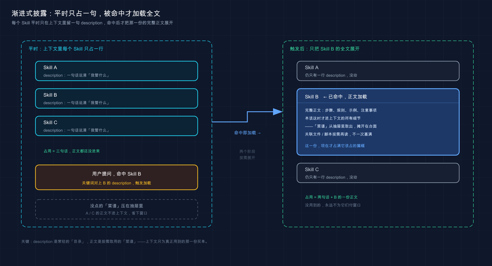

# 26 · Agent Skills：给 Claude 装一身随叫随到的专项本事

> 📚 **系列导航**：上一篇 [25 记忆系统](25-memory.md) 讲的是「被动记住事实」——把项目的偏好、约定写进 `CLAUDE.md`，让 Claude 别每次都问一遍。这一篇换个方向，聊「主动封装能力」：把一整套操作步骤打包成 Agent Skills，让 Claude 在该用的时候，自己调出对应的那身本事。

「Skill 不就是个 slash 命令换了个名字吗？我打 `/deploy` 它就跑部署，跟以前 `.claude/commands/deploy.md` 有啥区别？」

「区别大了。slash 命令是你**主动喊**它才动；Skill 你可以不喊——Claude 一看你这活儿对得上，自己就把它调出来了。而且它平时只占你一句话的位置，用到才展开全文。」

「……自己调出来？那不就乱套了，我哪知道它什么时候会动？」

这是个很常见的误解，我自己刚上手那会儿就这么想的——把已有的 `commit.md` 命令塞进 `.claude/skills/` 里，跑起来跟以前一模一样，我还纳闷「这不就换了个文件夹吗」。后来才反应过来，问题就卡在：**把 Skill 当成 slash 命令的马甲**。其实官方早就把自定义命令并进了 Skills 体系——你那些 `.claude/commands/` 文件照样能用，但 Skill 多了三样东西：能带配套文件、能由 Claude 按需自动触发、平时几乎不占上下文。

> **官方原话**：「**自定义命令已合并到 skills 中。** `.claude/commands/deploy.md` 中的文件和 `.claude/skills/deploy/SKILL.md` 中的 skill 都会创建 `/deploy` 并以相同的方式工作。」

这一篇，我把 Skill 到底是什么、凭什么能「自己调出来」还不撑爆上下文、从哪来、怎么触发，一次给你讲透。

**看完这一篇，你会拿到：**

- Skill 到底是什么——一个 `SKILL.md` 加配套资源，怎么就成了 Claude 的一项本事
- 它如何「按需加载」（渐进式披露）：为什么平时只占一句话、用到才展开，省上下文的秘密全在这
- Skill、slash 命令、Subagent 三者定位差在哪，一张表分清（完整决策留到第 30 篇）
- Skill 从哪来（内置、插件带、自己写）、放在哪个目录决定谁能用
- 怎么触发（靠 description 自动匹配，不用背命令）、怎么查当前有哪些可用

---

## 01 先搞懂：Skill 到底是个什么东西

先给结论：**一个 Skill，本质就是一个叫 `SKILL.md` 的说明文件，外加几个可选的配套文件，打包成一身「专项本事」交给 Claude**。

**类比：手机里的快捷指令。** 你在 iPhone「快捷指令」里编一个「回家模式」——开灯、调空调、放音乐，编好之后你不用再一步步手动操作，喊一句「回家模式」，它就按你排好的顺序自动跑完。Skill 干的是同一件事：你把一套固定流程（比如「总结未提交的改动并标出风险」）写进 `SKILL.md`，之后这套流程就成了 Claude 随手能调的一个动作，你不用每次把步骤重新敲一遍。

`SKILL.md` 长什么样？就两部分，官方文档说得很清楚（这个例子存在 `~/.claude/skills/summarize-changes/SKILL.md`，目录名 `summarize-changes` 就是你以后输入的命令名）：

```yaml
---
description: 总结未提交的改动并标出风险。当用户问改了啥、想要提交信息、或让我审查 diff 时使用。
---

## 当前改动

!`git diff HEAD`

## 说明

把上面的改动用两三个要点概括，再列出你注意到的风险，比如缺失的错误处理、写死的值、需要更新的测试。如果 diff 是空的，就说没有未提交的改动。
```

上面那个 `---` 框起来的部分叫 **YAML frontmatter**（前置元数据，写在文件开头两道 `---` 之间的配置区），它告诉 Claude **这个 Skill 是干啥的、啥时候该用**；下面的 markdown 正文，是 Claude 真正调用时要照着做的**说明**。

注意中间那行 `` !`git diff HEAD` ``——这是个挺妙的设计，叫**动态上下文注入**：Claude Code 会先把这条命令跑了，把它的输出**替换**到这一行，然后 Claude 才看到 Skill 内容。所以 Claude 拿到手的不是「去跑个 diff」，而是已经填好的、你此刻真实的改动。这是预处理，不是 Claude 自己执行的。

一个 Skill 不止 `SKILL.md` 一个文件，它是个**目录**。官方给的标准长相是这样：

```text
my-skill/
├── SKILL.md           # 主说明（必需）
├── template.md        # 让 Claude 填的模板
├── examples/
│   └── sample.md      # 给它看的示例输出
└── scripts/
    └── validate.sh    # 它可以执行的脚本
```

只有 `SKILL.md` 是必需的，其余都可选。这就是 Skill 比老式 slash 命令强的地方：**能带模板、带示例、带脚本**——脚本可以是任何语言，Claude 负责编排，脚本干重活。

**三个真实场景，你立刻能想到 Skill 能干嘛：**

- 你每次让 Claude 提交代码，都要叮嘱「先跑测试、再写中文 commit、前缀用 feat」——把这套写进一个 `commit` Skill，以后一句话搞定。
- 团队约定了一套 API 写法（RESTful 命名、统一错误格式、必带校验）——写成一个 `api-conventions` Skill，谁写接口它自动按这套来。
- 你想生成一张代码库的可视化结构图——官方那个 `codebase-visualizer` Skill 捆了个 Python 脚本，跑完直接在浏览器里打开交互式树图。

> 💡 一句话总结：Skill 就是「`SKILL.md`（说啥时候用 + 怎么做）+ 可选配套文件」打成一包的一身本事——**写一次，之后 Claude 随手就能调，还能捆模板和脚本**。

---

## 02 命门：渐进式披露，省上下文的秘密

这是整篇最该吃透的一节。**Skill 凭什么能塞一大堆，却几乎不占你的上下文？** 答案就一个词：渐进式披露（progressive disclosure，意思是「按需逐步展开」，不相关时不加载全文）。

先说为什么这事关键。前面 [19 上下文管理](19-context-management.md) 讲过，Claude 的「工作台」就那么大，塞进去的每一个字都在花预算、都在挤占它思考的余地。如果每个 Skill 的全文一开会话就全堆进去，装十个 Skill 你的工作台就废了一半。

**类比：餐厅的菜单和后厨。** 你坐下来，服务员先递给你一张**菜单**——每道菜就一行菜名加一句简介，你扫一眼就知道有什么。你点了「宫保鸡丁」，后厨那张**写满步骤的详细菜谱**才被翻出来照着做。没点的菜，菜谱一直压在抽屉里，不占你桌上一寸地方。Skill 就这么运作：

- **平时**：Claude 只看得到每个 Skill 的那一句 `description`（菜单上的菜名）。
- **相关时**：你问的事对上了某个 description，那个 Skill 的**完整正文**才被加载进来（翻出对应菜谱）。

官方把这条规则讲得很直白：

> 在常规会话中，skill 描述被加载到上下文中，以便 Claude 知道什么可用，但**完整 skill 内容仅在调用时加载**。

所以你可以放心大胆地往 Skill 正文里写长篇参考资料、详细检查清单——**用到之前，它几乎不花成本**。这正是官方建议「把内容做成 Skill 而不是全塞进 `CLAUDE.md`」的原因：`CLAUDE.md` 是一开会话就全程驻留的，Skill 正文是用到才来。



这张图把「渐进式披露」两阶段画清楚了：左边是会话常态——三个 Skill 在上下文里**各只占一句 description**，工作台还很空；右边是某个 description 被你的提问命中后，**只有那一个 Skill 的完整正文被加载**进来，其余两个仍然只是一行。一眼看出「省」在哪。

不过有个**配套的代价你得知道**，否则会踩坑：一旦 Skill 被加载，它的正文**会在整场会话里一直驻留**——Claude 不会在后续每一轮重新读它。官方原话：

> 当你或 Claude 调用一个 skill 时，呈现的 `SKILL.md` 内容作为单个消息进入对话，并**在会话的其余部分保持在那里**。

这意味着两件事：第一，Skill 正文里**每一行都是一次重复的 token 成本**，别灌水，官方建议把 `SKILL.md` 控制在 500 行以内，长参考拆到单独文件按需加载；第二，**写「常驻说明」而不是「一次性步骤」**——因为它全程都在，要写成「整个任务都适用的指导」，而不是「第一步做 X」这种用完就过期的。

这里有个相关的小跟头我自己实打实栽过：写了个 Skill，前几轮还照着做，聊到后面死活感觉「它好像把这套说明忘了」，我第一反应是加载失败、还反复重启 Claude 想让它重新读一遍。翻了官方才明白——**内容通常还在，是模型转头去选别的工具了**。解法是把 description 和说明写更明确、让它继续偏向这个 Skill，而不是怀疑加载机制。

> 💡 一句话总结：渐进式披露 = 平时只露一句 description、用到才展开全文，所以装再多 Skill 也不撑上下文；**但展开后会全程驻留，正文务必精简、写成常驻说明**。

---

## 03 Skill、slash 命令、Subagent：到底差在哪

开头那场争论的核心，就是这一节。很多人把这三个搅在一起，其实**定位完全不同**。这里我先把最容易混的点掰开，**完整的「该选哪个」决策表留到第 30 篇**，这节只做到「分得清」。

先把三个名词对齐一下：

- **slash 命令**：你输入 `/xxx` 主动触发的一段操作。
- **Skill**：一身打包好的本事，**你能主动喊、Claude 也能按需自动调**。
- **Subagent（子代理）**：一个**独立上下文**的子助手，主对话把任务委派给它，它在自己的小世界里干完再把结果带回来（前面 [23 子代理](23-subagents.md) 详谈过）。

这里有个关键认知，专门破开头那个误解：**slash 命令和 Skill 不是对立关系，slash 命令其实是 Skill 的一种调用方式**。官方把自定义命令并进了 Skills——你建一个 `commit` Skill，它天然就能用 `/commit` 调。真正的区别不在「叫什么」，而在**谁能发起、占不占上下文**：

| 维度 | slash 命令（老式 `.claude/commands/`） | Skill | Subagent |
|------|--------------------------------|-------|----------|
| 谁能发起 | 只有你（打 `/` 触发） | **你 + Claude 都能**（可自动触发） | 主对话委派 |
| 跑在哪个上下文 | 当前对话里 | 当前对话里（默认） | **独立的子上下文** |
| 平时占不占上下文 | —— | **只占一句 description** | 不占（按需起） |
| 能带配套文件吗 | 不能 | **能**（模板 / 脚本 / 示例） | 看其自身定义 |
| 最适合 | 你想手动控制时机的固定操作 | 让 Claude 该用就用的专项能力 | 隔离地跑独立、重的子任务 |

看懂这张表，开头的争论就化解了：**那种「slash 命令」的理解是 Skill 的手动触发档；它没意识到同一个 Skill 还能让 Claude 自动触发**。

那「自动触发」会不会乱套？不会，因为你能精确控制**谁有权调用它**。官方给了两个 frontmatter 开关：

- `disable-model-invocation: true`：**只有你能调**。用于有副作用、你想亲手掐时机的活儿——比如 `/deploy`、`/commit`、发 Slack 消息。你肯定不希望 Claude「看你代码像是写好了」就自作主张部署了。
- `user-invocable: false`：**只有 Claude 能调**。用于那种「背景知识」型的 Skill——比如一个解释老系统怎么跑的 `legacy-system-context`，Claude 该用时知道就行，但 `/legacy-system-context` 对你来说不是个有意义的命令。

所以「乱套」是可控的：**怕它乱动手的，加 `disable-model-invocation: true` 锁成纯手动**；这正是上面那个误解里该用的招。

> 💡 一句话总结：slash 命令是 Skill 的手动触发档、Subagent 是独立上下文的子助手——三者定位不同；**怕 Skill 自动乱动，就用 `disable-model-invocation: true` 锁成只能你喊**。

---

## 04 Skill 从哪来：内置、插件带、自己写

知道是什么了，那 Skill 从哪儿冒出来的？三个来源，由近到远。

**来源一：内置（捆绑）Skill——开箱就有，每次会话都在。** Claude Code 自带一批捆绑 Skill，不用你装。官方列的有 `/code-review`（审代码）、`/debug`（调试）、`/batch`（批处理）、`/loop`（循环跑）、`/claude-api`（Claude API 参考）等。还有三个配套干「跑起来验证」的：`/run`（启动并驱动你的应用看改动有没有效）、`/verify`（构建并运行确认改动按预期工作）、`/run-skill-generator`（教前两个怎么构建启动你的项目）。这些你打个 `/` 就能在菜单里看到。

> 注意：捆绑 Skill 和 `/help`、`/compact` 那种**内置命令**不是一回事。内置命令直接执行固定逻辑；捆绑 Skill 是**基于提示**的——给 Claude 一份详细说明，让它用自己的工具去编排完成。调用方式一样，都是打 `/` 加名字。

**来源二：插件附带——装个插件，Skill 跟着一起来。** 前面 [24 插件](24-plugins.md) 讲过，插件能打包一堆扩展。Skill 就是插件能带的东西之一：插件里建个 `skills/` 目录，启用插件的地方这些 Skill 就可用了。插件 Skill 用 `插件名:skill名` 的命名空间（比如 `/my-plugin:review`），所以它**永远不会跟你自己的 Skill 撞名**。

**来源三：自己写——这才是 Skill 的主场。** 你把反复粘贴的那套说明、检查清单、多步流程写成一个 `SKILL.md`，它就成了你专属的本事。官方给的判断标准很实用：

> 当你不断将相同的说明、检查清单或多步骤程序粘贴到聊天中时，或者当 CLAUDE.md 的一部分已经演变成程序而不是事实时，**创建一个 skill**。

这句话点破了 Skill 和 `CLAUDE.md` 的分工，跟上一篇正好接上：**`CLAUDE.md` 装「事实」（这项目用什么技术栈、有什么约定），Skill 装「程序」（这件事分几步怎么做）**。你发现自己在 `CLAUDE.md` 里写起了「第一步……第二步……」，那部分就该挪进 Skill。

下面这张表帮你对号入座：

| 你的处境 | ❌ 别再这么干 | ✅ 该上 Skill |
|---------|------------|-------------|
| 每次提交都叮嘱同一套流程 | 每次手动把步骤敲一遍 | 写个 `commit` Skill，一句话调 |
| 团队有固定 API 写法 | 塞进 `CLAUDE.md` 全程占上下文 | 写成 Skill，用到才加载 |
| 想要某种可视化报告 | 每次描述一遍要啥图 | 捆个生成脚本的 Skill |

> 💡 一句话总结：Skill 三个来源——内置捆绑（开箱即用）、插件附带（装啥带啥）、自己写（主场）；**判断要不要自己写就一条：你是不是在反复粘同一套步骤**。

---

## 05 放哪决定谁能用 + 怎么触发、怎么查

最后这节落到最实操的三件事：自己写的 Skill 放哪、它怎么被触发、怎么看现在手上有哪些。

### 放在哪个目录，决定谁能用它

这是官方的位置表，**放错地方 = 该用的人用不上**，照抄就行：

| 范围 | 放哪 | 谁能用 |
|------|------|--------|
| **个人** | `~/.claude/skills/<skill-name>/SKILL.md` | 你的所有项目 |
| **项目** | `.claude/skills/<skill-name>/SKILL.md` | 仅当前这个项目 |
| **插件** | `<plugin>/skills/<skill-name>/SKILL.md` | 启用该插件的地方 |
| **企业** | 见托管设置 | 组织里所有人 |

逻辑很直观：**只有你自己用、跨项目通用的**（比如你个人的 commit 习惯），放个人级 `~/.claude/skills/`；**这个项目专属、想让团队都用的**（比如本项目的部署流程），放项目级 `.claude/skills/` 并提交到版本库。

同名时谁赢？官方规定的优先级是 **企业 > 个人 > 项目**（插件因为带命名空间，不参与抢名）。还有一条安全提示值得划重点：**项目级 Skill 提交进仓库后，别人拉下来要先过「工作区信任」对话框**——因为 Skill 里的 `allowed-tools` 能给自己授权一批工具，**信任仓库前先看看项目里的 Skill 写了啥**，别被一个来路不明的 Skill 偷偷开了权限。

### 怎么触发：靠 description 自动匹配，不用背命令

这是 Skill 最舒服的一点：**你不用记 `/什么什么`，正常说人话就行**。Claude 会拿你说的话去比对每个 Skill 的 `description`，对上了就自动把那个 Skill 调出来。

拿第 01 节那个 `summarize-changes` Skill 举例，它 description 里写了「当用户问改了啥……时使用」，所以两种方式都能触发它：

```text
我改了什么？
```

```text
/summarize-changes
```

第一种是**让 Claude 自动调**（你压根没提 Skill 名，它自己匹配上了）；第二种是**直接喊名字**。日常更推荐第一种——说需求就行，触发交给它。这也反过来告诉你**写 Skill 时 description 有多重要**：description 里得包含「用户会自然说出口的关键词」，它才匹配得准。官方排查「Skill 没触发」的第一条就是查这个：

> 检查描述是否包含用户会自然说的关键字。

### 怎么查：当前到底有哪些 Skill 可用

装了一堆、内置一堆，怎么知道现在手上有啥？最直接一句话问它：

```text
现在有哪些 Skill 可用？
```

它会把当前所有可用的 Skill 列给你。这也是官方排查 Skill 问题的标准动作之一——**先确认它到底在不在列表里**，再谈触发。另外打 `/` 调出命令菜单也能看到能手动调的那些，`/doctor` 则能帮你查「Skill 描述是不是因为装太多被截断了」（装的 Skill 多到一定程度，描述会被压缩以省字符预算，可能把匹配用的关键词削掉）。

> 💡 一句话总结：个人级放 `~/.claude/skills/`、项目级放 `.claude/skills/`，同名时优先级：企业 > 个人 > 项目；触发靠 description 自动匹配、不用背命令；**一句 `What skills are available?` 就能查当前有哪些**。

---

## 06 动手：5 分钟看清「自动触发」和「渐进式披露」

光看不练记不住。下面这套最小操作，不写任何复杂脚本，就让你亲眼看到两件事：**Skill 怎么被一句话自动触发、它平时怎么只占一行**。全程在一个空目录就能跑。

**第一步：建个人级 Skill 目录**（Mac / Linux）

```bash
mkdir -p ~/.claude/skills/explain-self
```

Windows 用户：在 `C:\Users\你的用户名\.claude\skills\` 下新建 `explain-self` 文件夹即可。

**预期**：`~/.claude/skills/` 下多了个 `explain-self` 空目录。

**第二步：写一个最简单的 `SKILL.md`**

用你顺手的编辑器，把下面内容存到 `~/.claude/skills/explain-self/SKILL.md`：

```yaml
---
description: 用大白话解释一段代码或一个报错。当用户说「这段代码啥意思」「这个报错咋回事」「帮我读读这个」时使用。
---

## 说明

把用户给的代码或报错，用初学者能懂的大白话讲清楚：
1. 这东西整体在干啥（一句话）
2. 逐行 / 逐段拆开说
3. 如果是报错，指出最可能的原因和怎么改

不要堆术语，能用生活类比就用。
```

注意它的 description 特意写了「这段代码啥意思」「这个报错咋回事」这些**你真会说出口的话**——这就是自动触发的钩子。

**预期**：`explain-self` 目录里有了一个 `SKILL.md`。

**第三步：启动 Claude 并确认它认得这个 Skill**

```bash
claude
```

进去后敲：

```text
现在有哪些 Skill 可用？
```

**预期**：返回的可用 Skill 列表里，能看到 `explain-self`，旁边是你写的那句 description。**看到它在列表里 = Skill 已被正确加载。**（这一步还顺带印证了渐进式披露：此刻上下文里只有它这**一句 description**，正文那几行说明还没被加载进来。）

**第四步：不喊名字，用「人话」触发它**

故意**不打** `/explain-self`，而是说一句对得上 description 的话：

```text
这段代码啥意思：print(sum([1,2,3]) / len([1,2,3]))
```

**预期**：Claude 会**自动调用** `explain-self` 这个 Skill（你能在它的回应里看到 Skill 被触发的提示），然后按你写的三步——先一句话说整体（算这三个数的平均值）、再逐段拆、术语少——来解释。**它没等你喊命令就调出了对应本事，这就是自动触发。**

**第五步：对比直接喊名字**

再试一次手动档，直接打：

```text
/explain-self 这个报错咋回事：ZeroDivisionError: division by zero
```

**预期**：同样触发这个 Skill，效果和第四步一致——区别只在于这次是你**主动喊**的。两条路通向同一身本事，正好印证第 03 节那张表里「你 + Claude 都能发起」。

跑通这五步，你就把 Skill 最核心的两件事——**「描述匹配自动触发」和「平时只占一句 description」**——亲手验证了一遍。

> 💡 一句话总结：建 `~/.claude/skills/explain-self/SKILL.md`、用 `What skills are available?` 确认加载、再用「人话」和 `/名字` 各触发一次——**亲眼看到自动触发和手动触发通向同一身本事，比记十条文档都实在**。

---

## 07 小结

这一篇把 Agent Skills 从「是什么」到「怎么用」捋了一遍——**它让 Claude 不再是张白纸，而是带着一身能按需调出的专项本事上岗**。

核心要点串起来回顾：

| 你想搞清的事 | 答案 | 关键点 |
|------------|------|--------|
| Skill 是什么 | `SKILL.md` + 可选配套文件打成一包 | frontmatter 说何时用，正文说怎么做 |
| 为什么不撑上下文 | 渐进式披露 | 平时只露一句 description，用到才展开全文 |
| 和 slash / Subagent 差在哪 | 定位不同 | slash 是手动档、Subagent 是独立上下文（决策表见第 30 篇） |
| Skill 从哪来 | 内置 / 插件带 / 自己写 | 反复粘同一套步骤 = 该自己写了 |
| 放哪、怎么触发、怎么查 | 目录决定范围 | description 自动匹配；`现在有哪些 Skill 可用？` 查 |

**你现在应该能：** 说清楚一个 Skill 由什么组成、它凭「渐进式披露」省上下文的原理；分得清 Skill、slash 命令、Subagent 各自的定位；知道 Skill 的三个来源、放在哪个目录决定谁能用；并且明白触发它靠的是 description 自动匹配、不用背命令。**这套「按需调出专项能力」的本事，是你把 Claude 从「通用助手」调教成「懂你这套活儿的专家」的关键一步。**

---

下一篇 **27「Skills 使用实例」**——这一篇全是概念和机制，下一篇真刀真枪：**带你从零装一个真正有用的 Skill，亲手触发它、看着它把活儿干完**。想想看，你日常哪件事是反复跟 Claude 叮嘱同一套流程的？下一篇我们就拿这类活儿开刀，把它封成一个一句话就能调的本事。
