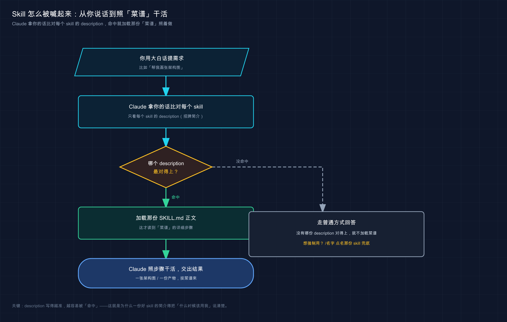

# 27 · Skills 使用实例：装一个、喊一声、看它干活

> 📚 **系列导航**：上一篇 [26 Skill 是什么](26-agent-skills.md) 把原理讲透了——`SKILL.md` 是什么、`description` 凭啥决定 Claude 用不用它。这一篇不讲道理，真刀真枪：**带你查一遍手里有哪些 skill、用一句话喊起一个、盯着它把活干完**，把「会用别人的 skill」落到地上。

比如要赶一份代码库结构图，给老板汇报用。换平时，咱们得先在脑子里理节点、画 Mermaid 草图、调配色、导出 PNG，**一套下来稳稳半天**。这时候只要对着 Claude Code 敲一句「帮我画一张这个项目的架构图」——Claude 就自己搞定了。

它不问你任何参数，自己加载一个叫 `baoyu-diagram` 的 skill，按里面写死的暗色设计系统排好版、生成 SVG、转成 @2x PNG，**前后不到五分钟，图就躺在 `docs/assets/` 里了**。

这一刻你才真正理解 skill 的价值：**它不是「让 Claude 更聪明」，而是「让 Claude 把某件事，每次都按同一套靠谱流程做出来」**。半天压成五分钟，差的就是这套写好的流程。

上一篇你已经知道 skill 是什么了。这一篇只干一件事：**带你把这个「半天变五分钟」的体验，亲手跑一遍**。

**看完这一篇，你会拿到：**

- 一句话查出当前会话里**到底有哪些 skill** 可用，不再瞎猜
- 看懂一个真实 `SKILL.md` 长什么样，知道 `description` 那行凭啥决定它触不触发
- 用「自然语言触发」和「`/` 直呼其名」两种方式跑完一个 skill 的完整流程，每步都有预期输出
- skill 喊不动时的三步排查表（说法太含糊 / description 不匹配 / 压根没启用）
- 把一个 skill 提交进项目、让**全队照同一套流程干活**的具体做法

---

## 01 先别急着用：看看手里到底有哪些 skill

动手第一步不是「用 skill」，是**搞清楚你现在有哪些 skill 能用**。

新手最容易犯的错，是凭印象瞎喊——「我记得有个画图的 skill 吧？」然后对着 Claude 喊半天没反应，以为是 skill 坏了，其实压根没装。**先查清家底，比啥都强**。

**类比：照菜谱做菜前，先翻翻你这本菜谱里到底收了哪几道菜。** 你不会对着厨房空想「今天做个红烧肉吧」，得先确认菜谱里有「红烧肉」这一页、食材步骤都齐。skill 就是 Claude 的菜谱，每个 `SKILL.md` 是一道写好的菜——**先翻目录，确认这道菜在册，再开火**。

查看的办法特别简单，**在 Claude Code 会话里用大白话问它就行**：

```text
有哪些可用的 skill？
```

官方文档里用的是英文问法 `What skills are available?`，中文一样认。**预期**：Claude 会列出当前会话能用的 skill，每个带名字和一句话简介。在这个教程项目里跑，列表里就有那个画图的：

```text
baoyu-diagram — 生成专业的暗色主题 SVG 图（架构图 / 流程图 / 时序图 / 思维导图……）
```

> 💡 一句话总结：用 skill 之前，先在会话里问一句「有哪些可用的 skill？」**确认你要的那道菜在册，再开火**，别对着不存在的 skill 瞎喊。

还有两个查家底的小动作，顺手记一下：

**`/skills` 菜单**——在输入框敲 `/skills` 回车，会弹出一个可视化菜单，把所有 skill 列出来，还能在这里切换每个 skill 的启用状态（高亮后按 Space 循环切换，Enter 保存）。比纯文字列表更直观。

**`/doctor` 体检**——这条偏进阶：如果你装了一大堆 skill，Claude 可能因为「描述预算」装不下、把一部分 skill 的描述截断了，导致它「看不全」。`/doctor` 能告诉你预算有没有溢出、哪些 skill 受影响。新手一般用不到，但**哪天发现某个 skill 莫名其妙不触发了，先跑 `/doctor` 看一眼**。

---

## 02 拆开一个真 skill：`SKILL.md` 长什么样

光知道「有这个 skill」还不够，得看懂**它内部长什么样**，你才明白它凭啥被触发、能干啥。

正好，这个教程项目里就躺着一个真 skill。咱们不看官方文档里的玩具示例，直接扒这个**真实在用、天天靠它出图**的 `baoyu-diagram`。

它在项目里的位置是：

```text
.claude/skills/baoyu-diagram/
├── SKILL.md              # 主说明（必需）
├── references/           # 各类图的详细排版规范（按需加载）
│   ├── architecture.md
│   ├── flowchart.md
│   └── sequence.md
└── scripts/
    └── main.ts           # SVG 转 PNG 的脚本（被执行，不进上下文）
```

看出门道没？**一个 skill 就是一个文件夹，`SKILL.md` 是入口，旁边可以挂参考文档和脚本**。`SKILL.md` 必需，其余都是可选的「料」——参考文档让主说明保持精简（用到哪类图才加载哪个），脚本是给 Claude 跑的工具。

打开它的 `SKILL.md`，**最上面那块 `---` 围起来的就是命门**，叫 frontmatter（前置元数据，写在文件最顶端的配置）：

```yaml
---
name: baoyu-diagram
description: Create professional, dark-themed SVG diagrams of any type — architecture diagrams, flowcharts, sequence diagrams... Also trigger when the user says "画个图" "画一个架构图" "diagram" "flowchart"...
version: 1.117.3
---
```

`---` 下面那一大段 markdown，才是 Claude 真正要照着干的「菜谱正文」（设计系统、配色、排版规则、转 PNG 的命令）。

**这里有个上一篇讲过、但你现在该亲眼对上号的关键点**：那行 `description`，是 Claude 判断「这次该不该用这个 skill」的核心依据（frontmatter 里还有个可选的 `when_to_use` 字段可以补充触发条件，两者合计截断为 1536 字符）。

你注意到没——这个 description 里**明晃晃塞了一堆中文触发词**：「画个图」「画一个架构图」，还有英文的 `diagram`、`flowchart`。这不是随便写的，是作者**故意把用户可能说的话都铺进去**，好让 Claude 一听到这些词就反应过来「该我上了」。

**类比：菜谱页眉那行「适合：家宴、待客、下饭」。** 你翻菜谱找「待客菜」时，一眼扫到页眉这行字，就知道这道菜对路。`description` 就是 skill 的页眉标签——**Claude 拿你的话去比对每个 skill 的 `description`，谁的标签最对得上，就翻开谁那一页**。

所以记住这条因果链，后面排查全靠它：

你说的话 → Claude 拿去比对各个 skill 的 `description` → 匹配上了 → 加载那个 `SKILL.md` 的正文 → 照里面的步骤干活。

`description` 写得越贴近你的真实说法，触发越准。这也是为什么下一节排查「喊不动」，第一个要查的就是它。



这张图把「一句话怎么变成 skill 干活」拆成四步：你说话 → Claude 拿去和每个 skill 的 `description` 比对 → 命中后加载对应 `SKILL.md` 正文 → 照里面写死的步骤产出结果。看懂这条链，你就知道排查该从哪一环下手。

> 💡 一句话总结：一个 skill 就是一个带 `SKILL.md` 的文件夹，最顶上的 `description` 是触发命门——**Claude 拿你的话去比对它，对上了才翻开这页菜谱**。

---

## 03 跑通第一个：自然语言喊一声，看它出活

家底清了、结构懂了，开整。这一节用 `baoyu-diagram` 走一遍**最常见的用法：用大白话喊，让 Claude 自己判断该不该上**。

这是 skill 最爽的地方——**你不用记任何命令，该用哪个 skill 是 Claude 自己挑的**。

第一步，在教程项目根目录把 Claude Code 起起来：

```bash
claude
```

**预期**：进入会话，底部出现输入框。

第二步，直接用大白话提需求——注意，这里**一个字都没提 `baoyu-diagram` 这个名字**：

```text
帮我画一张图，说明 Claude 的「想→做→看」代理循环
```

**预期**：Claude 一听「画一张图」，就去比对各 skill 的 `description`，命中 `baoyu-diagram` 那行的 `diagram`/「画个图」，于是**自动加载它**，然后照菜谱正文干活：读对应的参考文档（流程图就读 `references/flowchart.md`）、按暗色设计系统排版、生成一个 `.svg`、再跑脚本转成 `@2x.png`。

干完它会告诉你产出在哪，大致长这样：

```text
已生成图表：
  docs/claude-code/assets/27-agent-loop.svg
  docs/claude-code/assets/27-agent-loop@2x.png
```

**看到这两个文件 = skill 触发成功、活也干完了。** 整个过程你没碰任何参数，全靠一句大白话。

这就是 skill 和「普通对话」最大的区别。摆一张对比，差距一目了然：

| | ❌ 没有 skill | ✅ 有 skill |
|---|---|---|
| 你要说的 | 详细描述配色、字号、布局、转 PNG 怎么转…… | 一句「帮我画张图」 |
| 产出稳定性 | 这次暗色那次亮色，每次风格飘 | 每次都套同一套设计系统，稳定一致 |
| 你要记的 | 一堆参数和步骤 | 啥都不用记 |

说白了，**skill 把「每次都要交代一遍的繁琐流程」一次性写死了**。你只管说要什么，「怎么做得专业」是菜谱的事。

### 不想等它猜？直接点名

有时候你很确定就要用某个 skill，**懒得让它猜，直接 `/` 点名最快**：

```text
/baoyu-diagram 画一张用户登录的时序图
```

**预期**：跳过「匹配 description」这一步，直接加载 `baoyu-diagram` 并执行，`/` 后面那串话作为参数传进去（这里就是告诉它画什么图）。

两种方式啥时候用哪个？一般来说：

- **探索、不确定该用啥** → 用大白话，让 Claude 自己挑（说不定它挑的比你想的还准）。
- **明确知道要哪个、要它立刻执行** → `/` 点名，尤其是那种「有副作用、不能乱触发」的 skill（比如部署、提交），官方就建议这类干脆只让你手动 `/` 调，别让 Claude 自作主张。

> 💡 一句话总结：跑 skill 两条路——**大白话让 Claude 自己挑、`/名字` 直接点名**；前者适合探索，后者适合「我就要它、立刻干」。

---

## 04 喊了没反应？三步排查，对号入座

真上手你迟早会遇到：**喊了一句，Claude 没用 skill，自己吭哧吭哧用普通方式干了**。先别慌，也别觉得 skill 坏了——**九成是下面三种情况之一**。官方的故障排查就这几条，下面按「最常见」排了序。

**类比：照菜谱做菜，菜没成，无非三种原因——你说的菜名跟菜谱页眉对不上、菜谱根本没收进这本书、或者你话说得太含糊厨师没听懂。** 一条条排，总能揪出是哪环。

**第一步：先怀疑「你说得太含糊」（最常见）。**

很多时候不是 skill 的错，是你那句话**离 `description` 太远**。比如 `baoyu-diagram` 的 `description` 里写的是「画图 / diagram / 架构图」，你要是说「给我整个可视化的东西」，Claude 可能就没把它跟「画图」对上。

**解法**：把话往 `description` 上靠，**换个更直白的说法重说一遍**：

```text
帮我画一张架构图
```

带上「画」「图」这种明确动词，命中率立刻上去。这是最快的一招，先试它。

**第二步：确认「这个 skill 到底在不在册」。**

回到第 01 节那招，问一句：

```text
有哪些可用的 skill？
```

**预期**：如果列表里**根本没有**你要的那个 skill，那问题就清楚了——它压根没装，或者没被加载（比如项目级 skill 还没通过信任、或你启动目录不对）。这种就别在「怎么触发」上耗了，**先把它装上 / 加载上**（第 05 节讲项目级怎么让它生效）。

**第三步：确认了在册、还是不触发——直接 `/` 点名兜底。**

如果第二步确认了它在列表里、第一步换了说法也还是不灵，**别跟它较劲，直接 `/名字` 手动调起来**：

```text
/baoyu-diagram 画一张架构图
```

只要它在册，`/` 点名一定能调起来（`/` 是「我点名要你」，绕过了「Claude 自己判断」那一环）。这一步既是兜底，也能帮你**定位问题**：`/` 调得起来 = skill 本身没毛病，纯粹是自动触发没匹配上，那回头优化 `description` 就行。

把这三步整理成一张排查表，喊不动时照着走：

| 现象 | 先查什么 | 怎么解 |
|------|---------|--------|
| 喊了没反应，Claude 用普通方式干了 | 你的说法离 `description` 远不远 | 换更直白的说法重说（带明确动词） |
| 换了说法还是不灵 | skill 在不在「可用列表」里 | 问「有哪些可用的 skill？」；不在就先装 / 加载 |
| 确认在册、还是不自动触发 | 是不是纯粹匹配没中 | `/名字` 手动点名兜底，事后优化 description |

> ⚠️ 反过来也有「**触发太勤**」的烦恼——某个 skill 动不动就自己蹦出来。官方的解法是：**把它的 `description` 写得更具体**（别用太宽的词），或者给它加 `disable-model-invocation: true`，直接禁止 Claude 自动触发、只许你手动 `/` 调。这个改法属于「造 / 改 skill」，下一篇会展开。

> 💡 一句话总结：喊不动按三步排——**先怀疑说法太含糊（换直白说法）、再查在不在册、最后 `/` 点名兜底**；这三招覆盖你会遇到的几乎所有「不触发」。

---

## 05 让全队都能用：把 skill 提交进项目

到这儿你已经会用 skill 了。但有个问题：上面装在 `~/.claude/skills/` 里的 skill，**只有你自己电脑上有，同事拉下代码是没有的**。

想让**整个团队都照同一套流程干活**，得换个地方放——**项目级 skill**。

**类比：这道菜的菜谱，别只贴在你自家厨房，印进随项目一起发的「公司菜谱册」里。** 谁拿到这本册子（clone 了仓库），翻开就能照着做同一道菜。个人 skill 是你私房菜谱，项目级 skill 是**跟代码一起发出去、人手一份的公共菜谱**。

差别就一个：**放哪、要不要提交进 Git**。看这张对照：

| | 个人 skill | 项目级 skill |
|---|---|---|
| 放在哪 | `~/.claude/skills/<名>/SKILL.md` | 项目里的 `.claude/skills/<名>/SKILL.md` |
| 谁能用 | 你所有项目，但**只有你这台机器** | clone 了这个仓库的**所有人** |
| 进不进 Git | 不进（在你主目录） | **进**，跟代码一起提交 |
| 典型用途 | 你的个人习惯流程 | 团队统一规范（部署、提交格式、出图风格） |

具体怎么落地，就三步：

**第一步：把 skill 放进项目的 `.claude/skills/`**（而不是主目录）：

```text
你的项目/
└── .claude/
    └── skills/
        └── team-commit/
            └── SKILL.md
```

**第二步：提交进版本控制。** 像提交普通代码一样：

```bash
git add .claude/skills/
git commit -m "feat: 加一个团队统一的 commit skill"
```

**第三步：同事拉下来就能用**——这是项目级最香的地方：**别人 clone 仓库、`git pull` 之后，这个 skill 自动就在他们的会话里了**，不用各自手动装。整个团队从此「画图都是同一套风格」「提交都走同一套检查」。

这里有个**官方明确的安全细节，务必记住**：别人项目里检入的 skill，**首次打开该项目时会弹一个「工作区信任」对话框让你确认**。为啥要这一道？因为 skill 可以给自己授予工具权限（比如自动跑命令），**信任一个仓库前，先扫一眼它的 skill 里写了啥**，别闭眼点同意。官方原话：

> 在信任存储库之前查看项目 skills，因为 skill 可以授予自己广泛的工具访问权限。

拉外部项目时就该按这条做。比如 clone 一个开源仓库，信任前翻一眼它 `.claude/skills/` 下的 `SKILL.md`，**有可能发现里面某个 skill 在 `allowed-tools` 里放开了一堆 `Bash` 权限**——倒不一定是恶意，但宁可看清楚再点信任。**这一眼，值得花**。

> 💡 一句话总结：想让全队用同一个 skill，放进项目的 `.claude/skills/` 并提交进 Git，**别人 clone 就自动有**；但信任别人的项目 skill 前，**先扫一眼它都申请了啥权限**。

---

## 06 动手：从零装一个个人 skill，亲手喊起来

前面用的都是现成的 `baoyu-diagram`。这一节带你**从零造一个最简单的 skill 并触发它**——不为造多复杂，就为**亲眼看到「写文件 → 它出现在列表 → 一句话喊起来」这条完整链路**。全程不依赖任何复杂环境。

我们做一个超简单的：让 Claude **用「咖啡馆聊天风」帮你解释一段代码**。

**第一步：建 skill 目录**（个人级，放主目录，你所有项目都能用）。Mac / Linux：

```bash
mkdir -p ~/.claude/skills/explain-casual
```

Windows（PowerShell）：

```powershell
mkdir $HOME\.claude\skills\explain-casual
```

**预期**：`~/.claude/skills/` 下多了个 `explain-casual` 文件夹。

**第二步：写 `SKILL.md`。** 用你顺手的编辑器，在 `~/.claude/skills/explain-casual/SKILL.md` 里贴入：

```markdown
---
description: 用轻松的咖啡馆聊天风格解释一段代码。当用户说「用大白话讲讲这段代码」「这段代码在干嘛」「讲讲这个函数」时使用。
---

## 任务

用最口语、最轻松的方式解释用户给的代码，像跟朋友在咖啡馆闲聊，不要学术腔。要求：

1. 先一句话说清这段代码整体在干嘛。
2. 再挑出关键的几行，逐个用大白话讲。
3. 最后提一句：有没有看着别扭、可能埋坑的地方。
```

**划重点**：那行 `description` 里**故意塞满了用户可能说的话**——「用大白话讲讲这段代码」「这段代码在干嘛」「讲讲这个函数」。这就是第 02 节说的「页眉标签」，**塞得越贴近真实说法，触发越准**。

**第三步：确认它进了列表。** 这里有个官方细节要注意：**会话启动时不存在的「顶级 skill 目录」需要重启才能被监视到**。咱们刚新建了 `explain-casual` 这个目录，所以保险起见**新开一个会话**：

```bash
claude
```

进去后问：

```text
有哪些可用的 skill？
```

**预期**：列表里**出现了 `explain-casual`**，带着你写的那句中文描述。**看到它 = skill 装好且被加载了。**

**第四步：用大白话喊它（别提名字）。** 在会话里贴一段代码让它讲，比如：

```text
用大白话讲讲这段代码：
def average(numbers):
    return sum(numbers) / len(numbers)
```

**预期**：Claude 把你这句「用大白话讲讲这段代码」跟 `explain-casual` 的 `description` 对上，**自动加载这个 skill**，然后照里面三步走：先一句话说它算平均值；再讲 `sum(numbers) / len(numbers)` 这行；最后**提醒你传空列表会除以 0 崩掉**（这正是第 1 步任务里「埋坑的地方」那条在起作用）。整个口吻是轻松的咖啡馆风，不是干巴巴的文档腔。

**第五步：对比一下「点名调用」。** 再试 `/` 直呼：

```text
/explain-casual def average(numbers): return sum(numbers) / len(numbers)
```

**预期**：同样的效果，但这次是你**点名**触发的——跳过了「Claude 自己判断」那一环，`/` 后面的代码作为参数传进去。

跑通这五步，你就把 skill 的完整生命周期**亲手摸了一遍**：写 `SKILL.md` → 它出现在可用列表 → 大白话能喊起来 → `/` 也能点名。**以后用任何别人的 skill，本质都是这套机制，无非菜谱内容更复杂。**

> ⚠️ 如果第三步列表里没看到 `explain-casual`：十有八九是**没重启会话**（新建顶级目录得重启才被监视到），退出 `claude` 重进一次。要是重进还没有，检查文件路径和文件名是不是**一字不差**地叫 `SKILL.md`（全大写）。

> 💡 一句话总结：亲手造个最简单的 skill 跑一遍——**建目录、写 `SKILL.md`（description 塞满真实说法）、重启确认进列表、大白话喊起来**；这条链路走通，别人的 skill 你也就全会用了。

---

## 07 小结

这一篇全程在动手，把「会用别人的 skill」从概念落成了肌肉记忆。把核心动作串起来回顾：

| 你要做的事 | 怎么干 | 关键点 |
|-----------|--------|--------|
| 查有哪些 skill | 问「有哪些可用的 skill？」/ `/skills` 菜单 | 用之前先确认它在册 |
| 看懂一个 skill | 读它的 `SKILL.md` | 最顶上的 `description` 是触发命门 |
| 触发一个 skill | 大白话喊 / `/名字` 点名 | 探索用前者，要它立刻干用后者 |
| 喊不动排查 | 换直白说法 → 查在不在册 → `/` 点名兜底 | 九成是「说法太含糊」 |
| 让全队用 | 放进项目 `.claude/skills/` 并提交 Git | 信任别人的项目 skill 前先看它申请了啥权限 |

**你现在应该能：** 在任何会话里查清手里有哪些 skill、看懂一个真实 `SKILL.md` 的结构和它凭啥触发、用两种方式把一个 skill 跑起来、喊不动时三步定位问题，还能把一个 skill 提交进项目让团队共享。**这套「会用别人的 skill」的能力，是你之后白嫖整个 skill 生态的入场券**——社区里大量现成 skill，装上、喊一声，就是别人写好的专业流程为你所用。

开头那张「半天变五分钟」的架构图，就是这么来的。你现在也有了同一把钥匙。

---

下一篇 **28「skill-creator：造你自己的 skill」**——会用别人的菜谱了，下一步自然是**自己写菜谱**。你有没有哪段流程，是每次都要给 Claude 重复交代一长串？（这种流程往往不止一个。）下一篇就教你用官方的 `skill-creator`，把这种「反复粘贴的繁琐流程」一次性固化成你专属的 skill，从「用菜谱的人」变成「写菜谱的人」。
