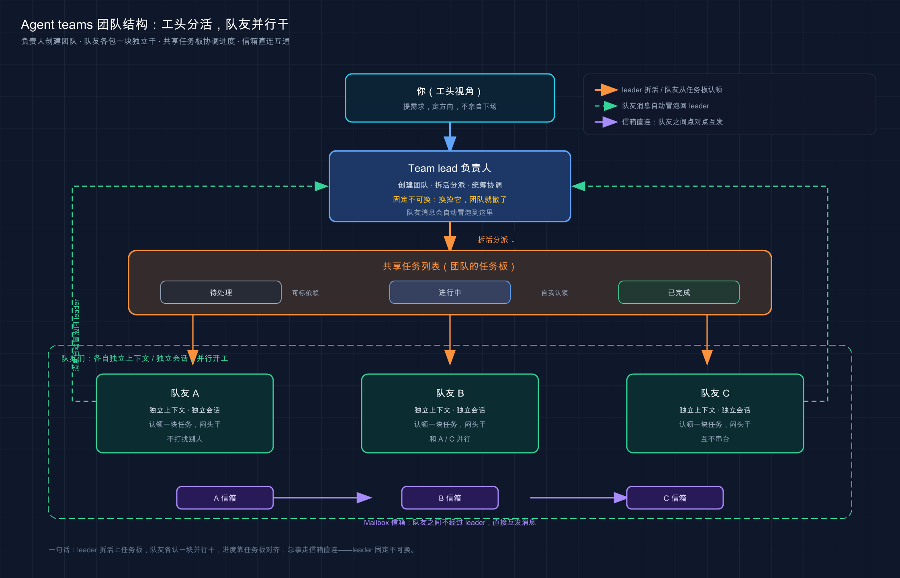

# 29 · Agent teams 智能体团队：多会话协作

> 📚 **系列导航**：上一篇 [28 skill-creator 使用] 教你造一个能被准确触发的 skill。这一篇上「多智能体协作」——把好几个 Claude Code 会话编成一个团队，**你当工头分活、它们各包一段并行干**，干完你统一验收。

> ⚠️ **实验性，可能变化**：Agent teams 是官方明确标注的实验性功能，**默认关闭**，需要 Claude Code v2.1.32 或更高版本。本篇命令和默认值以写作时的官方文档为准，但界面、快捷键、行为后续都可能调整，照做前先 `claude --version` 对一下版本。

「你这屏幕上怎么开着仨 Claude？还都在跑。」

「一个在改前端、一个改后端、一个专门写测试，我盯着分活。」

「那不乱套了？你一个人哪盯得过来三个？」

「不用我一直盯。它们各干各的，谁卡住了、谁要我拍板，会主动冒泡找我——我大部分时间在干别的。」

这段对话里那个开着仨 Claude 的人，就是我。我自己第一次同屏跑多个会话那会儿，旁边同事的反应一模一样——先是惊，再是「你盯得过来吗」。说白了，**让人惊讶的点全在「一个人怎么同时指挥多个 AI」**，而这正是这一篇要拆的东西——Agent teams（智能体团队），让多个 Claude Code 会话像一个团队那样协作，你只负责分派和验收。

**看完这一篇，你会拿到：**

- Agent teams 到底是什么、解决单会话的什么天花板，一句话讲透
- 它和上一波学的 subagent（子代理）差在哪——一张对照表分清「啥时候用哪个」
- 团队的四个关键件（leader（负责人）、队友、共享任务列表、信箱）各干什么
- 怎么用 `claude agents`（agent view）这块「总控屏」管多个会话，以及在团队里 `Shift+Down` 切队友
- 一个能照着跑、给了预期输出的实战：启用功能 → 起一个三人团队 → 看它们并行干

---

## 01 先搞懂：单会话的天花板在哪

先给结论：**Agent teams 是为了突破单个 Claude Code 会话「上下文有限 + 只能串行」这两堵墙**。

前面十几篇我们一直在「一个会话」里折腾——开一个 Claude，给它指令，它一步步干。这模式 90% 的活儿够用。但有两种情况会顶到天花板：

**一是上下文塞不下。** 一个会话只有一个上下文窗口（context window，可以理解成它的「工作记忆」）。让它同时读前端、后端、测试三大块代码再统筹改，记忆很快就满了，越往后它越「忘事」。

**二是只能一件接一件干。** 单会话本质是串行的——读完 A 才读 B，改完前端才轮到后端。三块互不相干的活，它也只能排队来。

**类比：一个大工程，你一个人既当水电工、又当瓦工、还兼木工，全部工种自己上。** 一是脑子里记不下这么多并行的事，盯着水电就忘了瓦工那边的进度；二是只有一双手，这会儿在接线就贴不了瓷砖，只能一个工种干完再换下一个。**这时候聪明的做法不是自己硬扛，是当工头——招几个师傅，水电、瓦工、木工各包一段同时开干，你负责分活和验收。**

Agent teams 就是把你从「亲自下场的工人」变成「指挥若定的工头」。它适用在四类活儿上（官方点名的「最强用例」）：

- **研究和审查**：几个队友同时查一个问题的不同侧面，再互相质疑彼此的发现
- **新模块 / 新功能**：每个队友独占一块互不干扰的部分
- **使用竞争假设调试**：几个队友并行测试不同理论，互相证伪，更快收敛到根因
- **跨层改动**：前端、后端、测试横跨多层，每层派一个队友盯

> 💡 一句话总结：单会话有「记忆装不下、活儿只能串行」两堵墙；**Agent teams 让你从一个人硬扛，升级成工头带一队人并行干**。

---

## 02 它和 subagent 到底差在哪

这是最容易混的一对，必须先掰清楚——不然你学了俩功能也不知道该用哪个。

上一波（第 23 篇）我们学的 subagent，是**在一个会话里**外包一个专项助手：它有独立上下文，干完只把结论交回给主对话，**队友之间互不说话、也不归你直接管**。Agent teams 完全不是一回事——**它是多个对等的、完整的 Claude Code 会话在协作**，队友之间能直接发消息，你也能绕过 leader 直接跟某个队友聊。

**类比：subagent 是你派出去跑个腿的临时工，agent team 是你召集起来开工的一个班组。** 跑腿的临时工，你交代一句「去把这一千行日志里的报错挑出来」，他自己去办、办完回来递张纸条，**他不认识你别的临时工，全程只跟你这一个上级对接**；而一个班组里的工人，彼此能商量「你那边的接口改了没、我这边好对接」，你这个工头也能随时走到任何一个工人跟前单独叮嘱几句。

差别落到实处，就是这张表——**记不住别的就记它**：

| 维度 | Subagent（子代理） | Agent teams（智能体团队） |
|------|------------------|------------------------|
| **上下文** | 独立上下文，结果回传给调用者 | 独立上下文，**完全独立** |
| **谁在协调** | 主代理统管所有活 | leader 协调，但有**共享任务列表自我协调** |
| **队友之间** | 不通信，只向主代理报结果 | **直接互发消息** |
| **你能否直接管** | 不能，只能通过主对话 | **能直接跟任意队友对话** |
| **token 成本** | 较低，结果汇总回主上下文 | **较高，每个队友都是一个独立 Claude 实例** |
| **最适合** | 只要结果、不用讨论的专注任务 | 需要讨论、互相质疑的复杂协作 |

最该记住的一句官方判断标准：

> 当你需要快速、专注的工作人员报告结果时，使用 subagents。当队友需要分享发现、相互质疑和自我协调时，使用 agent teams。

还有个更直接的土办法：**这帮「工人」之间需不需要互相通气？** 不需要（各查各的、查完汇总），用 subagent，便宜；需要（边干边对接、互相挑刺），才上 agent teams。

> 💡 一句话总结：subagent 是跑腿临时工——独立干、只对你一个人报；agent teams 是一个班组——队友互相说话、你能直接管每一个；**要不要互相通气，就是选哪个的分水岭**。

---

## 03 团队是怎么搭起来的：四个关键件

一个 agent team 跑起来，背后就四个零件。认住它们，你才看得懂屏幕上发生了什么。

**类比：一个真实的施工班组。** 有一个工头（leader），有几个干活的工人（teammates），墙上贴着一张写满活儿的任务板（task list），工人之间还能互相递条子沟通（mailbox 信箱）。这四样凑齐，班组就能转。

官方给的架构表，就是这四件：

| 组件 | 角色 |
|------|------|
| **Team lead（负责人）** | 创建团队、生成队友、协调分活的那个主会话——就是你最先打开的那个 |
| **Teammates（队友）** | 各自领任务干活的独立 Claude Code 实例，每个有自己的上下文 |
| **Task list（任务列表）** | 队友认领和完成的共享工作清单，三种状态：待处理 / 进行中 / 已完成 |
| **Mailbox（信箱）** | 代理之间互发消息的系统，队友的消息会自动送到 leader，不用你去轮询 |

几个新手最该知道的运转细节：

**leader 一旦定了就换不了。** 创建团队的那个会话，终其一生都是 leader——你没法把某个队友「提拔」成 leader，也不能转交领导权。所以**你最先打开的那个会话，就是你这个「工头」的本体**。

**队友领活有两种方式。** leader 可以明着指派「这个任务给小 A」；队友也可以干完手头的活，自己从任务板上挑下一个没人认领、没被卡住的任务接着干（官方叫「自我认领」）。为了防止俩队友同时抢同一个任务，系统用**文件锁**兜底，不会撞车。

**任务之间能有依赖。** 比如「写测试」得等「实现功能」先完成。有未完成依赖的任务，在依赖没干完前认领不了；依赖一旦完成，被卡住的任务会**自动解锁**。

**队友不继承你的对话历史。** 这点新手最容易栽——想当然以为 leader 知道的事队友自然都知道，结果生成队友时啥背景都没给，它一脸懵。官方写得很清楚：队友生成时会加载和常规会话一样的项目上下文（`CLAUDE.md`、MCP、skills），**但 leader 的对话历史不会继承**。所以派活时，该交代的背景得在指令里写明白。

> 💡 一句话总结：一个团队 = 工头（leader，定了不能换）+ 工人（队友，各有独立上下文）+ 任务板（共享列表，能依赖、能自我认领）+ 信箱（互发消息）；**派活时记得把背景写全，队友不读你的历史**。



这张图把一个 agent team 的四个零件摆清楚了：中间是你这个 leader（工头），向下生成几个独立的队友（工人）各包一块活；底下一张共享任务板让大家认领任务、自动处理依赖；队友之间还有信箱直连——**消息绕不绕过 leader、活儿谁认领，一眼看明白**。

---

## 04 用 agent view 当「总控屏」管多个会话

团队起来了，问题来了：**好几个会话同时在跑，我盯哪儿？**

答案是 agent view（代理视图）——一块把所有后台会话摊在一个屏幕上的「总控屏」，命令是 `claude agents`。

> ⚠️ agent view 是**研究预览版**，需要 Claude Code v2.1.139 或更高版本，界面和快捷键可能随版本变。

**类比：施工现场墙上那块工程进度看板。** 你不用挨个工位去问「干到哪了」，抬头扫一眼看板就行——哪道工序在进行、哪个卡住等你拍板、哪个已经验收完了，一目了然。`claude agents` 就是 Claude Code 的这块看板：每个会话占一行，行首一个图标用颜色和动画告诉你它的状态。

官方的状态对照，挑最常用的几个：

| 状态 | 图标显示 | 含义 |
|------|---------|------|
| 工作中 | 动画 | Claude 正在跑工具或生成回复 |
| 需要输入 | 黄色 | 在等你回答某个问题或拍板某个权限 |
| 已完成 | 绿色 | 任务成功干完了 |
| 失败 | 红色 | 任务报错结束了 |

在这块看板上，你对着任意一行能干三件事，由轻到重：

- **窥视（Peek）**：按 `Space` 打开一个小面板，看这个会话最近的输出、或它正卡在哪个问题上——大多数时候这就够了，**不用真进去**。在窥视面板里直接打字回复、按 `Enter` 发出去，也不用进去。
- **回复**：窥视面板里就能回。它要是抛了个多选题，按数字键就能选。
- **附加（Attach）**：按 `Enter` 或 `→` 钻进这个会话的完整对话，就跟你平时单开一个 Claude 一模一样。在空输入框上按 `←` 退出来回看板。

有个特别方便的设计：**这些后台会话不需要任何终端开着也照跑**。一个独立的监督进程（supervisor）在背后托管它们——你关掉 agent view、关掉这个 shell、甚至另开一个新会话，它们都在继续干。等你回来打开 `claude agents`，它们还在那儿。

你完全可以把 `claude agents` 当**主入口**用，而不是 `claude`：进来先在看板底部的输入框甩几个独立任务（每打一个提示按 `Enter` 就起一个新会话并行跑），然后该干嘛干嘛，哪行变黄了（需要你）或变绿了（干完了）再回来处理。**比开七八个终端窗口来回切清爽太多了。**

> 💡 一句话总结：`claude agents` 是管多会话的「总控屏」——一行一个会话、看颜色知状态；`Space` 窥视、`Enter` 钻进去、`←` 退出来；**会话在后台照跑，不用一直开着终端盯**。

---

## 05 在团队里指挥队友：分活、切人、要计划

前面是「多会话」的通用管法。回到 agent teams 本身，**你作为 leader 怎么具体指挥这帮队友**？核心就一句：**用大白话告诉 leader 你想要啥，它替你处理协调、分活、委派**。

**起一个团队**，不用记什么命令，自然语言描述任务和团队结构就行。官方那个效果很好的例子（三个角色互相独立、不用互相等）：

```text
I'm designing a CLI tool that helps developers track TODO comments across
their codebase. Create an agent team to explore this from different angles: one
teammate on UX, one on technical architecture, one playing devil's advocate.
```

翻成中文你也可以直接说：「帮我建一个 agent team 从不同角度探索这个问题：一个负责 UX、一个负责技术架构、一个专门唱反调。」Claude 就会创建团队、按角度生成队友、让它们各自探索、最后综合发现。

**切队友、单独叮嘱。** 在 in-process（同终端内）模式下，按 **`Shift+Down`** 在队友之间循环，转到某个队友就能直接打字给他发消息——补个指令、追个问、或者让他换个思路。按 `Enter` 进他的会话看详情，`Escape` 打断他当前这一轮，`Ctrl+T` 切换任务列表。**转到最后一个队友后再按 `Shift+Down`，会绕回 leader。**

> 注意这里和上一节的快捷键别记串了：管后台会话的总控屏里切行用 `↑`/`↓`，而 agent team 里切队友用 `Shift+Down`，两套场景两套键。

**让队友先出计划再动手。** 活儿有风险时，可以要求队友在只读计划模式下先规划，等你（leader）批准了再实施：

```text
生成一个架构师队友来重构认证模块。
在他改动任何东西之前，必须先经过计划批准。
```

队友规划完会给 leader 发一个「计划批准请求」，你批了它才退出计划模式开干；你打回去，它就照反馈改了重交。

**指定队友数量和模型。** 你也可以明说要几个、用什么模型：

```text
建一个有 4 个队友的团队，并行重构这些模块。
每个队友都用 Sonnet。
```

一个**省钱关键点**别忽略：队友默认**不跟随** leader 的 `/model` 选择。想统一改它们的模型，要么在提示里像上面那样指定，要么去 `/config` 设「默认队友模型」。

**干完收摊。** 活儿结束，让 leader 清理团队：

```text
清理这个团队
```

> ⚠️ 官方反复强调：**清理一定走 leader，别让队友去清理**——队友的团队上下文可能解析不对，会把资源弄成不一致状态。而且清理前得先把还在跑的队友关掉，不然 leader 检测到有活跃队友会清理失败。

> 💡 一句话总结：起团队、分活、切队友（`Shift+Down`）、要计划批准、收摊清理，全用大白话指挥 leader；**记牢三条——队友模型要单独指定、背景要在指令里给全、清理只走 leader**。

---

## 06 该不该上团队：别为了拆而拆

学到这儿你可能跃跃欲试，想把啥都拆成团队跑。**打住——这正是第 23 篇讲 subagent 时那条反共识铁律的延续：不是任务越多越该拆。**

Agent teams 有实打实的代价，而且比 subagent 更重：

**一是 token 烧得多。** 每个队友都是一个完整独立的 Claude 实例、各有各的上下文，**几个队友就是几份 token 在烧**。官方说得直白：日常任务，单会话更划算；只有研究、审查、新功能这类真能从并行获益的活，多花的 token 才值。

**二是协调本身有开销。** 队友越多，互相通信、任务协调、潜在冲突就越多，过了某个点**再加人也不会按比例提速**——三个专注的队友常常干得过五个分散的队友。

我把「值不值得拆」整理成一张对照，照着对号入座：

| 场景 | 拆不拆成团队 |
|------|-----------|
| 前端 / 后端 / 测试三层并行改，互不依赖 | ✅ 拆，各包一层正合适 |
| 一个 bug 根因不明，想用几个竞争假设并行排查 | ✅ 拆，让队友互相证伪收敛更快 |
| 多人并行审一个 PR（安全 / 性能 / 测试覆盖各一人） | ✅ 拆，各用一套过滤器不重叠 |
| 一连串有先后依赖的步骤（A 做完才能做 B） | ❌ 别拆，串行的活单会话更顺 |
| 几个队友要改**同一个文件** | ❌ 别拆，两人编辑同一文件会互相覆盖 |
| 随手一个小任务 | ❌ 别拆，协调开销比省下的时间还多 |

官方还给了两条特别实在的上手建议，新手照做能少踩坑：

**从「研究 / 审查」这类不写代码的活开始。** 审 PR、调研一个库、排查 bug——这些任务边界清楚、不写代码，**能让你体会并行探索的价值，又不带来并行写代码那一堆协调麻烦**。我自己第一次用 agent teams，就是拿来审一个 PR：三个队友分别盯安全、性能、测试覆盖，全程没人改文件，自然也没冲突，看着三块发现陆续冒出来挺爽——体验顺了，我才敢往「并行改代码」上推。**别像我后来那回，头脑一热直接让仨队友并行改三个相邻文件，结果改动互相打架，光理这堆冲突就比单会话老老实实串行干还慢。**

**团队规模从 3–5 个起步。** 这个区间在各类任务上都好使——并行有了，协调又不至于失控。真要扩，只在「活儿确实能从更多人同时干获益」时才扩。

> 💡 一句话总结：Agent teams 比 subagent 更烧 token、协调更重，**只在「真能并行获益」时才拆**；互相依赖、改同一文件、随手小活一律别拆；新手从「不写代码的研究 / 审查」+「3–5 人」起步最稳。

---

## 07 动手：启用功能，起一个三人团队跑起来

光看不练假把式。下面带你**从零启用 Agent teams，起一个三人团队并行干一件最简单的活**。全程不依赖任何复杂项目。

> 前提：`claude --version` 看一眼，得是 **v2.1.32 或更高**；不够就先 `claude update`。

**第一步：启用实验性功能**

Agent teams 默认关闭，先在用户级设置里把开关打开。编辑 `~/.claude/settings.json`（没有就新建），加上 `env` 这段：

```json
{
  "env": {
    "CLAUDE_CODE_EXPERIMENTAL_AGENT_TEAMS": "1"
  }
}
```

**预期**：文件里有这段 `env` 配置。这是官方指定的启用方式——把环境变量 `CLAUDE_CODE_EXPERIMENTAL_AGENT_TEAMS` 设成 `1`。

**第二步：建一个玩具目录并进去开 Claude**(Mac / Linux)

```bash
mkdir team-demo
cd team-demo
claude
```

Windows 用户：`mkdir`、`cd` 照敲，再 `claude`。

**预期**：出现 Claude Code 欢迎屏，底部有输入框。

**第三步：用大白话起一个三人团队**

在输入框里敲（这就是「描述任务 + 团队结构」让 leader 自己组队）：

```text
帮我建一个 agent team，从三个不同角度调研「个人博客该选静态站还是动态站」：
一个队友只论证「该选静态站」，一个只论证「该选动态站」，
一个唱反调专门挑前两个方案的毛病。让他们各自给出结论。
```

**预期**：Claude 会先告诉你它要创建一个团队、生成三个队友（各自一个角度），并请你确认。**它不会不打招呼就建团队**——官方明确「没有你的批准不会创建团队」。确认后，三个队友陆续起来，各自在自己的上下文里开干。

**第四步：用 `Shift+Down` 切到某个队友看看**

team 跑起来后，leader 的终端会列出所有队友和他们在干的活。按 **`Shift+Down`** 循环切到某个队友，你能直接给他发消息。比如切到「唱反调」那个，补一句：

```text
也帮我从「维护成本」这个角度再挑挑毛病
```

**预期**：这条消息直达那个队友（不经过 leader 转述），他会把「维护成本」也纳进来接着挑。**切到最后一个队友再按 `Shift+Down`，会绕回 leader**——回到 leader 你就又能统筹全局了。

**第五步：收摊清理**

调研完了，回到 leader，让它收摊：

```text
帮我清理这个团队
```

**预期**：leader 会先确认队友都停了，再删掉共享的团队资源。**如果还有队友在跑，清理会失败**——这时先让 leader 把队友关掉（「让那几个队友 shut down」）再清理。记住官方那条：**清理永远走 leader，别让队友去清。**

跑通这五步，你就把「启用 → 组队 → 并行干 → 切队友直聊 → 收摊」这条完整链路亲手走了一遍。**之后任何 agent teams 的用法，本质都是在这条链路上换任务、换队友角色而已。**

> 💡 一句话总结：`settings.json` 里 `env` 开开关 → 大白话让 leader 组队 → `Shift+Down` 切队友直聊 → leader 收摊清理；**亲手跑通这条链路，比记十条快捷键都管用**。

---

## 08 小结

这一篇我们把 Claude Code 的「多智能体协作」从头捋了一遍——**你从一个亲自下场的工人，升级成了指挥一个班组的工头**。

把核心要点串起来回顾：

| 你想做的事 | 用什么 | 关键点 |
|-----------|--------|--------|
| 突破单会话的记忆 + 串行天花板 | Agent teams | 多个对等会话并行，你当 leader 分活 |
| 分清和 subagent 的区别 | 看「要不要互相通气」 | 要通气、要互相质疑才用 team，否则 subagent 更省 |
| 管多个并行会话 | `claude agents`(agent view) | 一行一会话、看颜色知状态、`Space` 窥视 |
| 在团队里切队友直聊 | `Shift+Down` | 转一圈回到 leader；和看板切行的 `↑`/`↓` 别记串 |
| 判断该不该拆 | 一张「值不值得」对照表 | 互相依赖、改同一文件、小活一律别拆 |

**你现在应该能：** 说清 Agent teams 解决什么、它和 subagent 差在哪、用 `claude agents` 这块总控屏盯住多个并行会话、用大白话指挥 leader 组队分活、并且清楚「什么时候值得拆、什么时候别为了拆而拆」。**这套「当工头」的能力，是你把大任务真正并行化、又不至于烧钱失控的底气。**

但说句实话——**它毕竟还是实验性的**，界面、快捷键随版本变，日常 90% 的活儿单会话依旧够用。把它当个「大活儿提速神器」收进工具箱，别一上来就拿小任务硬拆。

---

下一篇 **30「功能怎么选：CLAUDE.md vs Skill vs Hook vs MCP vs Subagent」**——到这篇为止，`CLAUDE.md`、Skill、Hook、MCP、Subagent、Agent teams，Claude Code 的招式你已经学了一大摞。但学得多不等于用得对，真正难的是临到一个具体需求，**到底该掏哪一个？** 下一篇我给你一张决策表，把这些功能的「适用边界」摆到一张纸上——看完你就再不会对着一个需求犯「该用啥」的选择困难症了。
