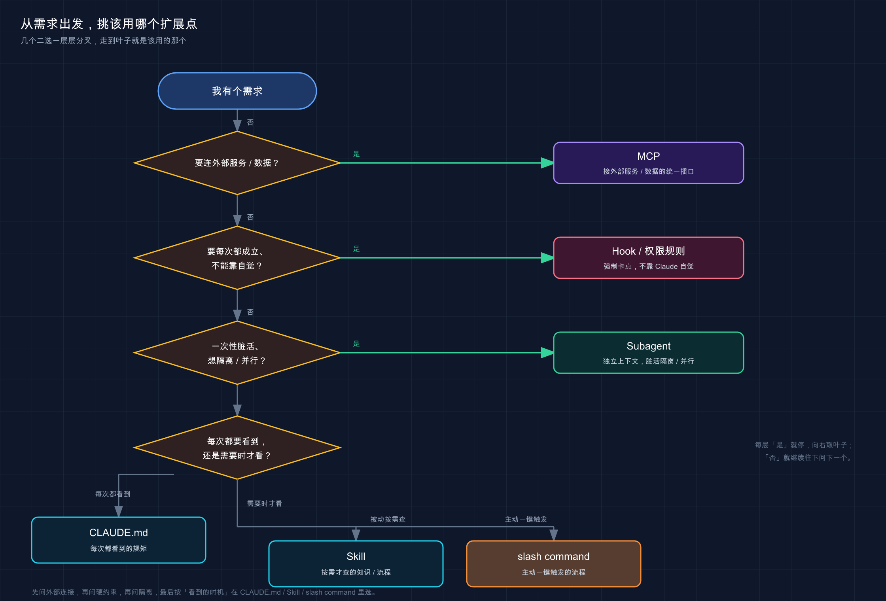

# 30 · 功能怎么选：CLAUDE.md vs Skill vs Hook vs MCP vs Subagent

> 📚 **系列导航**：上一篇 [29 Agent teams 智能体团队](29-agent-teams.md) 教你用 Agent teams 开多智能体并行协作。这一篇给整个第四组收口——CLAUDE.md、Skill、Hook、MCP、Subagent 一路学下来，全堆在脑子里反而容易选错。我给你一张决策表加一棵决策树，**对着「需求」直接查「该用哪个」，再不纠结**。

兄弟们，学到这儿，你手里已经攒了一堆扩展点了。

CLAUDE.md、Skill、Hook、MCP、Subagent，外加随处可见的斜杠命令（slash command），五六个名词，每个单看都懂。**但真到「我这个需求，该用哪个」的时候，十有八九会卡壳。** 刚学完这套的人，最常冒出来的一句就是「这个用 Skill 还是 Subagent 啊？」「这事儿我写进 CLAUDE.md 行不行？」

说白了，这不是知识不够，是**没建立「需求 → 方案」的映射**。每个扩展点的官方介绍你都读过，但它们是按「这是什么」组织的，不是按「你想干嘛」组织的。这一篇就反过来——**从你的需求出发，倒推该用哪个**。

这么说吧：前面九篇是把五件兵器一件件递到你手上，这一篇是教你**临阵该抽哪把**。

**看完这一篇，你会拿到：**

- 五大扩展点（外加 slash command）各自「解决什么、什么时候选、什么时候别用」的一句话定位
- 一张「需求 → 推荐方案」决策表，对症查方案
- 一棵能照着走的决策树，三四个问题问下来就锁定该用哪个
- 几组最容易混的对比（Skill vs Subagent、CLAUDE.md vs Skill、Hook vs 权限规则）一次讲透
- 知道这些扩展点怎么组合、怎么用 plugin 打包带走

---

## 01 先建一个总框架：六个扩展点插在「代理循环」的不同位置

动手挑之前，先在脑子里搭个总架子。**这些扩展点不是平行的六个选项，而是插在 Claude 工作流程不同环节上的六个挂钩。**

回想第 03 篇讲的「代理循环」——Claude 干活就是「想 → 做 → 看」转圈。这六个扩展点（CLAUDE.md、Skill、slash command、MCP、Subagent、Hook），正好插在这个循环的不同位置：有的在「想」之前塞进背景，有的在「做」的时候接外部、开分身，有的在某个固定时刻自动扣扳机。官方那句话点得很准，值得先记住：

> 扩展插入代理循环的不同部分。

**类比：医院的分诊台。** 你身体不舒服去医院，不会自己冲进某个科室，先到分诊台说「症状」——头疼挂神经内科、肚子疼挂消化科、要拍片去影像科。分诊台不治病，它干的是**照你的症状把你导向对的科室**。这一篇我就是给你当这个分诊台：你报「需求」，我把你导向对的「扩展点」。

落到真实场景，你纠结的往往就那几句话：「我想让它**每次都遵守**某条规矩」「让它**需要时自动调出**某项专长」「让某件事在**特定时机自动发生**」「让它**连上外部数据或服务**」。需求一旦说清，挂哪个科其实没那么难。下面几节，逐个把「科室」介绍清楚，最后给你一张总表加一棵树。

> 💡 一句话总结：六个扩展点不是六选一的平行选项，而是**插在「想→做→看」不同环节上的挂钩**；选的关键不是「哪个厉害」，而是「你的需求该挂哪个」。

---

## 02 六个科室，一句话认清各自的「主治」

先把六个扩展点的「主治范围」一句话钉住。这一节是地基，下面的决策表全建在它上面。我按官方那张功能表的口径，给每个配一个最典型的场景。

**CLAUDE.md —— 让它「每次都记住」的规矩。** 项目约定、构建命令、「永远用 pnpm 不用 npm」「提交前先跑测试」这类**始终生效**的背景。它每个会话自动加载，Claude 一开工就看得到。

**Skill —— 让它「需要时自动调出」的专项能力。** 可重复用的知识或流程：一份 API 风格指南、一套部署清单、一个调试套路。平时只占描述文本，**用到时才把完整内容调进来**；你也能用 `/<name>` 主动唤它。

**slash command —— 你「主动一键触发」的固定流程。** 它其实就是 Skill 的一种用法（带 `/<name>` 触发的那种）。区别只在「谁来发起」：Skill 可以由 Claude 自动判断要不要用，slash command 是**你打 `/deploy` 主动喊它来**。

**MCP —— 把它「接到外部世界」的接口。** 查你的数据库、发消息到 Slack、控制浏览器——凡是 Claude 内置工具够不着、需要连外部服务或数据的，靠 MCP（详见第 22 篇）。

**Subagent —— 给它开个「独立分身」去干脏活。** 需要读几十个文件、跑大范围搜索，但你只想要个结论、不想让中间过程把主对话塞满时，派个 Subagent 去（详见第 23 篇）。它在隔离的上下文里干，干完**只把摘要递回来**。

**Hook（钩子）—— 在固定时机「自动扣扳机」。** Hook 就是「某个事件一发生就自动跑的一段动作」。某个生命周期事件一触发（比如「每次改完文件」「每次会话开始」），它就**雷打不动**执行——跑 linter、拒掉危险命令、发条通知。它不靠 Claude 思考，触发是**有保证的**。

> Hook 这个概念，前面一直没集中讲过，这里先建立个印象就行：**它是「事件触发的自动动作」**。完整的写法、能监听哪些事件，留到第 33 篇专门拆。

光说容易糊，并排放一张表，对照看立刻清楚：

| 扩展点 | 一句话主治 | 谁来触发 | 占不占常驻上下文 |
|--------|----------|---------|----------------|
| **CLAUDE.md** | 每次都遵守的项目规矩 | 自动，每会话加载 | 占（全文常驻） |
| **Skill** | 按需调出的专项知识 / 流程 | Claude 自动判断 **或** 你 `/<name>` | 低（平时只占描述） |
| **slash command** | 主动一键触发的固定流程 | 你打 `/xxx` | 低（同 Skill） |
| **MCP** | 连外部服务 / 数据 | Claude 用到工具时 | 低（先只占工具名） |
| **Subagent** | 隔离上下文 / 并行专项任务 | 你或 Claude 派活 | 不占主窗口（独立上下文） |
| **Hook** | 特定事件自动跑固定动作 | 生命周期事件 | 零（除非它返回输出） |

这张表你不用背，**但「谁来触发」和「占不占常驻上下文」这两列，是后面所有决策的分水岭**——一个决定「是你主动还是它自动」，一个决定「值不值得常开着」。

> 💡 一句话总结：六个扩展点的「主治」各不相同——**规矩进 CLAUDE.md、专长做 Skill、一键流程是 slash command、外部连接靠 MCP、隔离干活派 Subagent、固定时机自动跑用 Hook**。

---

## 03 决策表：报需求，查方案

总框架有了，主治认清了，现在上这一篇的核心——**「需求 → 推荐方案」决策表**。用法很简单：左列找一句最像你心里那句话的需求，右列就是该用的扩展点，末列告诉你「为什么是它、别错用成隔壁」。

| 你的需求（心里那句话） | 推荐方案 | 为什么是它 / 别用错 |
|---------------------|---------|-------------------|
| 「每次都按我们的约定来」（用 pnpm、提交前跑测试） | **CLAUDE.md** | 始终生效的规矩，要它每会话都看到 |
| 「这份 API 文档 / 风格指南，它需要时能查到」 | **Skill** | 参考资料，平时别占上下文，用到再调 |
| 「我想敲个 `/deploy` 就跑完整套部署流程」 | **slash command**（Skill 的一种） | 你主动触发的固定多步流程 |
| 「让它查我们公司数据库 / 发 Slack」 | **MCP** | 要连外部服务和数据，内置工具够不着 |
| 「让它读完几十个文件，只给我个结论」 | **Subagent** | 要上下文隔离，别让中间过程塞爆主窗口 |
| 「这几件事同时查，互不依赖」 | **Subagent**（多个并行） | 并行专项任务，各干各的返回摘要 |
| 「每次改完文件，自动跑一遍 ESLint」 | **Hook**（`PostToolUse`） | 固定时机的自动动作，不需要它思考 |
| 「`rm -rf /` 这种命令，给我硬拦死」 | **Hook**（`PreToolUse`）**或权限规则** | 要「保证」拦住，不能靠提示 |
| 「它老忘某条约定，提醒过两次了」 | **CLAUDE.md** | 反复犯的错，写进常驻规矩，不是聊天里临时纠正 |
| 「同一段开场提示，我天天手打」 | **Skill** | 重复输入的提示，存成可调用的 Skill |
| 「这套配置，我想原样搬到另一个项目」 | **Plugin**（打包层） | 把 Skill / Hook / Subagent / MCP 捆一起带走 |

我把官方「随时间构建你的设置」那张触发器表的精神也揉进去了：**很多需求其实是「重复」逼出来的**——同一句提示打第三遍、同一个错纠正第二次，就是信号，该把它「固化」成对应的扩展点了，别老靠临场嘱咐。

这里插一个最容易踩的真坑。图省事的话，很容易把一份将近三百行的 API 接口清单**直接塞进 CLAUDE.md**，想着「让它一直记着多方便」。结果呢——每个会话一开就先吞掉一大块上下文，正经活儿还没开始，工作台已经被占走一截；更糟的是 Claude 经常**抓不住你真正强调的那几条核心约定**，被那堆接口细节淹了。把接口清单挪进一个 Skill，CLAUDE.md 只留一句「接口规范见 `api-skill`」，**世界一下就清净了**。这就是官方反复念叨的那条：

> 保持 CLAUDE.md 在 200 行以下。如果它在增长，将参考内容移到 skills。

> 💡 一句话总结：拿不准时，**先把需求翻译成「心里那句话」，再来这张表对号入座**；尤其记住「始终生效→CLAUDE.md、按需参考→Skill、外部连接→MCP、隔离干活→Subagent、固定时机→Hook」。

---

## 04 一棵决策树：三四个问题问下来，直接锁定

表是「已知需求查方案」，但有时候你需求自己都没想太清。这时候用**决策树**更顺——**顺着几个二选一的问题往下走，走到叶子就是答案**。

我把判断顺序设计成下面这棵树。核心就四个问题，按这个顺序问，基本不会错：



这张图把「我有个需求，该用哪个扩展点」拆成一条自上而下的问答路径——先问「要不要硬保证/连外部」，再问「该它自动还是你主动」，一路分叉走到底，每个叶子节点就是一个明确的扩展点。

把这棵树用文字走一遍，你会发现判断顺序其实很自然：

**第一问：这事要「连外部服务或数据」吗？**
要——比如查数据库、发 Slack、控制浏览器——**直接挂 MCP**，到此结束。这一条最好认，先筛掉。

**第二问：这事要「每次都成立、不能靠 Claude 自觉」吗？**
要「保证」级别的强制——比如「`.env` 绝对不许编辑」「`rm -rf /` 必须拦」「每次改完文件必须跑 lint」——**用 Hook**（或权限规则，见下一节）。关键词是「**保证**」：Hook 在它的事件上总会触发，是确定的；写进 CLAUDE.md 只是「请求」，Claude 可能照办也可能漏。

**第三问：这事是「一次性的脏活、想隔离」吗？**
要读一堆文件、跑大搜索，只想要结论、不想让过程占满主对话，或者几件事想并行——**派 Subagent**。它在独立上下文里干，干完只递摘要回来。

**走到这儿还没分出去的，就是「知识 / 规矩 / 流程」三选一了，再问最后一个**：

**第四问：它该「每次都看到」，还是「需要时才看」？**
- 每次都得看到的**规矩**（约定、构建命令、永不做 X）→ **CLAUDE.md**。
- 需要时才查的**知识或流程**（API 文档、部署清单、调试套路）→ **Skill**。
- 这里头「你想主动一键触发的多步流程」，就让这个 Skill 带上 `/<name>`，当 **slash command** 用。

四个问题，从「最好认的外部连接」问到「最微妙的知识 vs 规矩」，**层层筛下来，叶子就是答案**。挑扩展点时，脑子里基本就是默念这四句。

> 💡 一句话总结：决策树的顺序是「**连外部？→ 要硬保证？→ 要隔离？→ 每次看还是按需看？**」，四问下来直达叶子，比死记一堆定义好用得多。

---

## 05 三组最容易混的，一次讲透

光有树还不够，**总有那么几对长得像、一选就纠结的**。我挑出新手问得最多的三组，逐一掰开。这三组讲明白了，决策表用起来才不打架。

### Skill vs Subagent

这两个最容易混，因为「都能装一套流程」。但它们解决的根本不是一回事。

**类比：手册 vs 外派。** Skill 是一本**可以共享的手册**，谁需要谁翻、翻完内容进的是你当前这本「工作笔记」；Subagent 是**外派一个人**带着任务出去办，办完只回来跟你汇报结论，他在外面翻了多少资料你这边一点不沾。

核心差别就一个词：**上下文**。

| 对比维度 | Skill | Subagent |
|---------|-------|----------|
| 它是什么 | 可复用的知识 / 流程 | 有独立上下文的隔离工作者 |
| 内容去哪 | 加载进**你的主窗口** | 用它**自己的窗口**，结果才回主窗口 |
| 主对话受影响吗 | 占用主上下文 | 隔离，几乎不占主窗口 |
| 最适合 | 参考资料、可调用流程 | 读一堆文件的活、并行任务、专项工作者 |

一句话切：**要「内容进我这儿用」选 Skill，要「过程别污染我这儿、只给我结论」选 Subagent**。它俩还能合体——Subagent 启动时可以预加载指定的 Skill，等于「外派的人自带专用手册」。

### CLAUDE.md vs Skill

这俩都是「存指令」，区别在**加载方式**。

| 对比维度 | CLAUDE.md | Skill |
|---------|-----------|-------|
| 什么时候加载 | 每个会话，自动 | 按需（用到才加载） |
| 能触发工作流吗 | 不能 | 能，用 `/<name>` |
| 最适合 | 「始终做 X」的规矩 | 参考资料、可调用流程 |

判断口诀官方给得很干脆：**「Claude 应该始终知道」的进 CLAUDE.md，「有时才需要查」的进 Skill**。第 03 节那个「三百行接口塞 CLAUDE.md」的坑，本质就是把该进 Skill 的东西错放进了 CLAUDE.md。

### Hook vs 权限规则

这组的纠结点是：**「拦住某个危险操作」到底用 Hook 还是用权限规则（第 20 篇讲的 `deny`）？**

先说共性：**两者都是「强制级」的硬约束，不靠 Claude 自觉**——这点上它俩站一边，跟「写在 CLAUDE.md 里的请求」泾渭分明。官方那句话点破了关键：

> CLAUDE.md 或 skill 中的「永远不要编辑 `.env`」之类的说明是请求，而不是保证。阻止编辑的 `PreToolUse` hook 是强制执行。

区别在「**管的面有多宽、做的事有多杂**」：

- **权限规则**：声明式，专管「这个工具 / 这条命令，准不准」。在 deny 规则里写一条 `Bash(rm -rf *)`（即 settings.json 的 `"deny": ["Bash(rm -rf *)"]`）就拦死，简洁，适合**纯粹的「准入判断」**。
- **Hook**：能跑一段脚本，除了「拦」还能**顺手干别的**——拦下的同时记个日志、发个通知、自动改写参数。适合 **「拦 + 附带动作」或权限规则表达不了的复杂判断**。

一条好用的经验法则：**「准不准」这种黑白判断，优先用权限规则，一行搞定；要在拦截那一刻顺带做点啥（记录、通知、改写），才上 Hook**。两者不冲突，常常一起用——权限规则定基本盘，Hook 补那些「拦完还要再干一手」的活。

> 💡 一句话总结：**Skill 进我上下文 / Subagent 隔离只给结论；CLAUDE.md 每次看 / Skill 按需看；权限规则管「准不准」黑白判断 / Hook 管「拦截 + 附带动作」**——三组分清，选择不再打架。

---

## 06 组合才是常态：单选题做久了，记得它们能叠

到这儿你可能以为挑扩展点是道「单选题」。**恰恰相反——真实项目里几乎全是组合。** 每个扩展点干自己最擅长的那块，拼起来才是一套完整的「装备」。

官方给的几组经典搭配，每一组我都拿真实场景翻译一下：

| 组合 | 怎么配合 | 落地长啥样 |
|------|---------|-----------|
| **Skill + MCP** | MCP 负责「连上」，Skill 负责「教它用好」 | MCP 接通数据库，Skill 写清你的表结构和常用查询套路 |
| **Skill + Subagent** | Skill 里启动 Subagent 去并行干活 | 一个 `/audit` Skill 同时派出查安全、查性能、查风格三个 Subagent |
| **CLAUDE.md + Skill** | CLAUDE.md 放常驻规矩，Skill 放按需细则 | CLAUDE.md 写「遵守我们的 API 约定」，Skill 里放那份完整风格指南 |
| **Hook + MCP** | Hook 在某事件触发时，通过 MCP 干件外部的事 | 改完关键文件后，Hook 自动经 MCP 发条 Slack 通知 |

看「Skill + MCP」这组就明白组合的妙处了：**光有 MCP，Claude 能连上数据库，但它不懂你的表怎么设计、该怎么查最优；光有 Skill，它懂套路却连不上库**。两个一叠，才是「既连得上、又用得好」。一个常用配置就是这么搭的——MCP 接好库，Skill 里写满「查用户订单走哪张表、统计口径是哪个字段」，配合起来 Claude 写出来的查询基本不用返工。

那一套组合好的配置，怎么搬到别的项目、或者分享给同事？**答案是 Plugin（插件）——它是把这一切「打包带走」的那一层。**

**类比：行李箱。** 你出门不会把衬衫、剃须刀、充电器一件件抱在怀里，你把它们**统统码进一个箱子**拎走。Plugin 就是这个箱子——把 Skill、Hook、Subagent、MCP server 一股脑装进一个可安装的单元，**第二个项目要用同一套，装上这个 plugin 就齐了**；里头的 Skill 还带命名空间（像 `/my-plugin:review`），多个 plugin 各装各的也不撞名。官方说得很直接：

> Plugin 将 skills、hooks、subagents 和 MCP servers 捆绑到单个可安装单元中。

Plugin 的具体做法第 24 篇讲过，这里你只要记住它在体系里的位置：**别的五个是「功能」，plugin 是「把功能装箱分发」的那层**。

> 💡 一句话总结：挑扩展点不是单选题——**真实配置几乎都是组合**（Skill+MCP、CLAUDE.md+Skill…）；想把一整套搬到别处或分享，用 **Plugin 打成一个箱子带走**。

---

## 07 动手：把一个真实需求清单，逐条「分诊」

光看表不算会，得真上手「分诊」一遍。下面给你一份**模拟的真实需求清单**——这都是项目里会冒出来的真实念头。你的任务：照前面的决策树，给每一条挂对科室。**这一节不用敲命令，是纯脑力练习，但它比记十条定义都管用。**

**第一步：把这份清单抄到你的备忘录里（或就在脑子里过）**

```text
需求清单（给每条挑一个扩展点）：
A. 团队约定「一律用 pnpm，禁止 npm」，希望它每次都遵守
B. 想让它查公司内部的 PostgreSQL 数据库
C. 想敲一个命令就跑完「打 tag → 改 changelog → 推送」整套发版
D. 每次它编辑完任何文件，自动跑一遍 prettier 格式化
E. 让它一次性读完整个 utils 目录，只告诉我哪些函数没人用
F. 一份很长的「内部错误码对照表」，它偶尔需要查
G. 「生产数据库的迁移脚本，绝对不许它执行」，要硬拦死
```

**第二步：自己先走一遍决策树，把答案写在每条后面**

别急着往下看，先用第 04 节那四个问题（连外部？要硬保证？要隔离？每次看还是按需看？）自己判一遍。

**第三步：对答案**

下面是参考答案和判断理由。**对得上几条不重要，重要的是「为什么」对得上**：

| 需求 | 该用 | 判断理由（走了决策树哪条） |
|------|------|--------------------------|
| **A** 一律用 pnpm | **CLAUDE.md** | 不连外部、不需脚本保证、不隔离；是「每次都看到」的规矩 |
| **B** 查内部数据库 | **MCP** | 第一问就命中：要连外部服务和数据 |
| **C** 一键发版 | **slash command** | 你主动触发的固定多步流程，给 Skill 配个 `/release` |
| **D** 编辑后自动格式化 | **Hook**（`PostToolUse`） | 固定时机、要每次都跑、不需它思考 |
| **E** 读整个目录找死代码 | **Subagent** | 读一堆文件只要结论，隔离掉别塞爆主对话 |
| **F** 偶尔查错误码表 | **Skill** | 按需才看的参考资料，别塞 CLAUDE.md |
| **G** 禁执行迁移脚本 | **权限规则 / Hook** | 要「保证」拦死，不能靠提示；纯准入判断优先权限规则 |

**预期**：如果你 A、F 没有混（一个进 CLAUDE.md、一个进 Skill），D、G 没有混（一个 Hook 自动跑、一个权限拦死），E 你选了 Subagent 而不是 Skill——**那你这套「分诊」逻辑已经立起来了**，以后真实需求来了照这个流程走就行。

哪条卡住了，回第 05 节翻对应的那组对比，多半就是那一对没分清。**这套判断一般也得练上一阵才能形成肌肉记忆**——头几次很容易把「该 Subagent 的活硬塞成 Skill」，跑两回发现主对话被中间过程灌爆，才记住「只要结论就派分身」。

> 💡 一句话总结：拿一份真实需求清单**逐条走决策树分诊**，比背定义有用一百倍；卡住的那条，回去翻对应的「易混对比」基本就通了。

---

## 08 小结

这一篇给第四组收了口——把你一路学来的五大扩展点（外加 slash command），从「各是什么」翻转成「需求来了该用哪个」。

把核心串起来回顾：

| 你心里那句话 | 该挂的科室 | 一句话关键点 |
|------------|-----------|-------------|
| 「每次都得遵守」 | **CLAUDE.md** | 始终生效的规矩，每会话自动加载，控制在 200 行内 |
| 「需要时自动调出 / 我一键触发」 | **Skill / slash command** | 按需的知识与流程，平时不占上下文 |
| 「连外部服务和数据」 | **MCP** | 内置工具够不着的，靠它接外部 |
| 「读一堆文件只给我结论」 | **Subagent** | 隔离上下文、并行专项，只返回摘要 |
| 「特定时机自动跑、要保证」 | **Hook** | 事件触发的确定动作，护栏级强制 |
| 「整套搬走 / 分享给别人」 | **Plugin** | 把上面这些打包成一个可安装单元 |

**你现在应该能：** 拿到任何一个「我想让 Claude……」的需求，不再对着五六个名词发懵——心里默念那四个问题（连外部？要硬保证？要隔离？每次看还是按需看？），顺着决策树走到叶子，直接锁定该用哪个；遇到 Skill vs Subagent、CLAUDE.md vs Skill、Hook vs 权限规则这种容易混的，也能讲清它俩到底差在哪。**这套「需求 → 方案」的映射建起来，前面九篇学的零件才算真正盘活，能按需取用了。**

整个第四组（高级功能扩展）到这儿就齐了。**五件兵器你都摸过了，也知道临阵该抽哪把——剩下的，就是把它们用顺。**

---

下一篇起，进入第五组「系统配置与优化」。从 **31「settings.json：用户级 / 项目级配置」** 开打——这一路你写了 CLAUDE.md、配了权限、马上还要配 Hook，这些配置到底该写进哪个文件、用户级和项目级谁压谁，是时候规规矩矩安顿明白了。想想看：同一条配置，**写在你的主目录和写在项目里，效果可能正好相反**——这里头的门道，下一篇给你理清。
