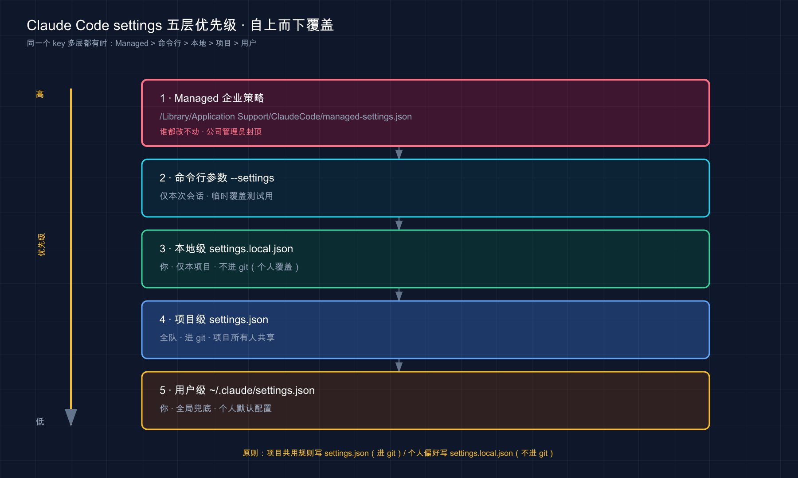

# 31 · settings.json：用户级 / 项目级配置

> 📚 **系列导航**：上一篇 [30 功能怎么选：CLAUDE.md vs Skill vs Hook vs MCP vs Subagent](30-choosing-features.md) 教你「需求来了该挂哪个扩展点」。这一篇往下挖一层——这些扩展点背后的开关，**到底写进哪个文件、用户级和项目级谁压谁**。`settings.json` 就是 Claude Code 那块总配电盘，今天把它的接线规则一次理清。

这里有件特别容易栽的蠢事，踩过一次就再难忘。

刚开始正经用 Claude Code 时，常见的操作是在某个项目的 `.claude/settings.json` 里塞一行 `defaultMode: "auto"`，想让它一进项目就自动放行、别老问。改完没反应。第一反应是写错了字段名，对着官方文档逐字核对三遍，**一个字母都没错**。再怀疑是 JSON 格式坏了，拿在线校验器跑一遍，**合法得很**。折腾大概二十分钟，甚至开始怀疑是不是 Claude Code 这个版本有 bug。

后来才在文档角落里看到那句话：`defaultMode` 设成 `"auto"` 时，**写在项目设置里会被直接忽略**——这是官方故意拦的，防止某个仓库偷偷给自己开自动模式（这点第 20 篇也提过）。那行配置语法全对、文件没坏，**纯粹是写错了「楼层」**。挪到用户级的 `~/.claude/settings.json` 里，秒生效。

说这个坑是想让你记住一件事：**`settings.json` 的坑，九成不在「怎么写」，而在「写在哪一层、哪一层压哪一层」**。今天就把这套「楼层规则」掰开揉碎，让你下次配置时心里有数——这条该放家目录还是放项目里，一眼就知道。

**看完这一篇，你会拿到：**

- 一句话讲明白 `settings.json` 是什么、它跟 CLAUDE.md 到底分什么工
- 三个层级（用户级 / 项目级 / 本地级）各自的文件位置、影响范围、该放什么
- 一张「谁压谁」的优先级表，外加一个最反直觉的例外（数组是合并不是覆盖）
- 几个你最常会动的配置项（`model`、`permissions`、`env`、`hooks`、`statusLine`）分别干嘛、放哪层
- 一个能照着跑、给了预期输出的实战：写一份配置 → 用 `/status` 验证它真生效

---

## 01 先搞懂：settings.json 是什么，跟 CLAUDE.md 分什么工

先给结论：**`settings.json` 是 Claude Code 的「行为开关总成」——用 JSON 格式管权限、环境变量、默认模型、Hook、状态栏这些工具行为；它跟 CLAUDE.md 是两套东西，一个管「怎么干活」，一个管「记住什么」。**

很多人一上来就把这俩搞混。你前面写了一路 CLAUDE.md（第 18 篇），又配了权限规则（第 20 篇），接下来还要配 Hook——这些东西**最终都落在 `settings.json` 这个文件里**，但它跟 CLAUDE.md 装的是完全不同的内容。

**类比：公司的项目档案柜 vs 你工位上的电闸盒。** CLAUDE.md 像档案柜里那本《项目说明书》——写的是「我们用 pnpm 不用 npm」「提交前先跑测试」这类**给人（给 Claude）看的、自然语言的约定**，它每会话被读进去当背景。`settings.json` 不一样，它是工位墙上那个**电闸盒**——里面是一个个明确的开关：这个工具准不准用、默认跑哪个模型、改完文件自动触发哪段脚本。**档案柜是「讲给它听的规矩」，电闸盒是「替它定死的机器行为」**。

官方把它的定位说得很干脆：

> `settings.json` 文件是通过分层设置配置 Claude Code 的官方机制。

注意「**官方机制**」和「**分层**」这两个词，正好是这一篇的两条主线：它是**配置 Claude Code 的正规入口**（不是临时在命令行敲参数），而且是**分好几层叠起来**的（用户级、项目级、本地级）。

落到你会遇到的真实场景，`settings.json` 管的就是这几类事：

- **「这个项目里，`rm -rf` 这种命令给我拦死」**——写 `permissions.deny`
- **「这个项目默认用 Sonnet 就行，别老用 Opus 烧额度」**——写 `model`
- **「每次它改完文件，自动跑一遍格式化」**——写 `hooks`
- **「我想让终端底下那行状态栏显示当前 git 分支」**——写 `statusLine`

这些都不是「讲给 Claude 听」的话，而是**实打实改变它运行行为的开关**。这就是 `settings.json` 跟 CLAUDE.md 的根本分工。

> 💡 一句话总结：CLAUDE.md 是「讲给 Claude 听的自然语言规矩」，`settings.json` 是「替它定死机器行为的开关总成」——**前者管记住什么，后者管怎么干活**，两套东西别混着用。

---

## 02 三个层级：家目录、项目里、还是只在你这台机器

`settings.json` 最该先搞懂的，不是有哪些字段，而是**它有三个层级，同一个文件名摆在三个不同位置，作用范围天差地别**。开头那个坑，根子就在没分清层级。

**类比：贴通知的三种地方。** 同一条「下班记得关空调」的通知，贴在**公司大门口**（全公司每个项目都看得到）、贴在**这间办公室门上**（只有这个项目的人看得到、还登记进了办公室公约）、还是贴在**你自己显示器边上的便利贴**（只有你看、别人不知道）——范围完全不同。`settings.json` 的三个层级就是这三种「贴法」。

官方定义的三层，看这张表（外加最高的 Managed 层，企业 IT 专用，咱们小白基本碰不到，下一节单独提一句）：

| 层级 | 文件位置 | 影响谁 | 进 git 吗 | 该放什么 |
|------|---------|--------|----------|---------|
| **用户级（User）** | `~/.claude/settings.json` | 你，跨你**所有**项目 | 否（在你家目录） | 个人偏好：你惯用的模型、主题、跨项目都想要的工具 |
| **项目级（Project）** | `.claude/settings.json` | 这个仓库的**所有协作者** | **是**（提交到 git 共享） | 团队约定：权限规则、Hook、共享的 MCP |
| **本地级（Local）** | `.claude/settings.local.json` | 你，**仅在这个仓库** | 否（自动 gitignored） | 个人覆盖、带凭据的实验性配置 |

三层的取舍，记住这三句就够：

- **「我所有项目都想要」→ 用户级**（`~/.claude/settings.json`）。比如「我习惯默认用 Sonnet」「我的状态栏脚本」，配一次，开任何项目都在。
- **「全队都该有、还得跟着仓库走」→ 项目级**（`.claude/settings.json`）。它被**提交进 git**，队友拉下来就有同一套配置，这是「配置即代码」。
- **「只我自己、这个项目专属、不想进版本库」→ 本地级**（`.claude/settings.local.json`）。

这里有个**特别贴心的细节**，官方明说了：当你创建 `.claude/settings.local.json` 时，**Claude Code 会自动帮你把它加进 git 忽略**。

> Claude Code 将在创建 `.claude/settings.local.json` 时配置 git 以忽略它。

为啥这么设计？想想看：本地级就是放「私人物品」的——你个人的实验配置、可能带点凭据的东西，**这些本来就不该上交到版本库污染队友**。官方替你把这道防线焊死了，省得你哪天手滑 `git add .` 把私人配置怼上去。这也呼应了第 21 篇讲的安全主线：**敏感东西，从源头就别让它有机会进 git**。

### 实战里怎么分：一个真实项目的三层分布

光记定义不够，看一个真实项目里这三层各放了啥，立刻就有体感：

- **用户级**（`~/.claude/settings.json`）：那套自定义状态栏脚本、默认模型偏好。这些跟具体项目无关，是「走到哪带到哪」的个人习惯。
- **项目级**（`.claude/settings.json`）：一组 `permissions.deny`（禁 `curl`、禁读 `.env`）、一个「提交前自动跑 lint」的 hook。这些是**全队的底线和卡点**，必须进 git 让每个协作者拉下来都有。
- **本地级**（`.claude/settings.local.json`）：个人临时多放行的几条命令（团队没必要知道）、一个还在试验、没成熟到能分享给队友的 hook。

判断一条配置该放哪层，脑子里过一个问题链就够：**「这条只我自己要 → 用户级或本地级；全队都要 → 项目级」**，再细分一步：**「全项目通用、还跟着我走 → 用户级；就这个项目、还不想进 git → 本地级」**。

一个反方向的错很常见：图省事把项目专属的权限规则全堆进了**用户级**——结果换到另一个项目，那些规则**全跟过来了**，在不相干的项目里平白多出一堆莫名其妙的放行。这才能明白：**「这条配置该跟着我走，还是该跟着项目走」**，是分层的第一判断。跟着项目走的，老老实实放项目里。

> 💡 一句话总结：三层一句话区分——**跨所有项目放用户级 `~/.claude/settings.json`、全队共享放项目级 `.claude/settings.json`（进 git）、私人覆盖放本地级 `.claude/settings.local.json`（自动 gitignored）**；判断口诀「跟着我走 vs 跟着项目走」。

---

## 03 谁压谁：优先级，外加一个最反直觉的例外

三层都能写同一个字段。那问题来了：**用户级说用 Opus、项目级说用 Sonnet，到底听谁的？** 这就是「优先级（precedence）」要管的事，也是 `settings.json` 最容易绕晕人的地方。

先给官方的优先级排序，从**高到低**（高的压低的）：

| 优先级 | 层级 | 说人话 |
|--------|------|--------|
| 1（最高） | **Managed**（企业 IT 部署） | 公司锁死的策略，谁都改不动 |
| 2 | **命令行参数**（`--settings` 等） | 你启动时临时拍的板，只管这一次会话 |
| 3 | **本地级** `.claude/settings.local.json` | 你在这个项目的私人覆盖 |
| 4 | **项目级** `.claude/settings.json` | 团队共享的项目设置 |
| 5（最低） | **用户级** `~/.claude/settings.json` | 你的全局默认，没人覆盖时才生效 |

这个「从高到低」的压制关系，画成一张图你会更有体感——**高层像盖在低层上的纸，挡住下面写了同字段的部分**：



这张图自上而下就是优先级从高到低：**上面的层覆盖下面的层**（仅限单值字段）。换句话说，越靠上的越「临时、具体」，越靠下的越「全局、兜底」——只有当上面所有层都没碰某个字段时，最下面的用户级默认才轮到生效。

一句话记牢这个顺序：**越「具体到当下」的越大，越「全局兜底」的越小**。命令行参数（就这一次）压本地（就这项目、就你），本地压项目（全队），项目压用户（全局）。官方给的例子最直观：

> 例如，如果您的用户设置允许 `Bash(npm run *)`，但项目的共享设置拒绝它，则项目设置优先，命令被阻止。

也就是说——**你在家目录给自己开的绿灯，进了某个项目可能被项目设置一票否决**。这恰恰印证了上一篇结尾埋的那个悬念：**同一条配置，写在你家目录和写在项目里，效果可能正好相反**。开头那个 `defaultMode: "auto"` 的坑，本质就是栽在没吃透这套层级语义上。

**Managed 层，小白一句话带过就行。** 它是企业 IT 通过 MDM、注册表或服务器统一下发的策略，优先级最高、**用户和项目都覆盖不了**，专门给公司强制执行安全合规用的（比如「全公司禁止 `curl`」）。你自己一个人用、或者小团队协作，基本碰不到它——**知道有这么个「天花板层」存在就够了**，真在受管控的公司环境里再去翻官方的 `server-managed-settings` 那页。

### 那个最反直觉的例外：数组是「合并」，不是「覆盖」

上面说的「谁压谁」，针对的是**单个值**（像 `model` 这种，你写一个值我写一个值，高层那个赢）。但有一类配置**完全不按这个来**，新手十有八九会栽——**数组类配置（比如 `permissions.allow` / `deny`）是跨层「合并」的，不是覆盖**。

啥意思？看官方原话：

> **数组设置跨作用域合并。** 当相同的数组值设置出现在多个作用域中时，数组被**连接和去重**，而不是替换。

翻成大白话：**你的权限规则不会被项目设置「整个换掉」，而是两边的规则「拼到一起」一块生效**。

举个例子你立刻懂：

| 场景 | 直觉（错的） | 实际（对的） |
|------|-----------|-----------|
| 用户级 `allow: ["Bash(npm run *)"]`，项目级 `allow: ["Bash(git diff *)"]` | 项目级优先级高，所以只剩 `git diff` | **两条都生效**：`npm run *` 和 `git diff *` 都被允许 |

这跟单值字段的「高层覆盖低层」是**两套逻辑**，一定要分开记：

- **单值字段**（如 `model`、`defaultMode`）：高优先级层**整个盖掉**低层。
- **数组字段**（如 `permissions.allow` / `deny`、`env` 里的多个变量也类似拼装）：各层**拼起来去重**，谁都不会抹掉谁。

这个点很容易绊人：以为在项目级写了一组 `deny`，就把用户级那组宽松的 `allow` 顶掉了，结果发现用户级那些 `allow` 还在生效——**因为它俩是合并的，不是替换的**。理解了这条，你才不会「以为关了某个口子、其实它还从另一层敞着」。

> 💡 一句话总结：优先级口诀「**越具体到当下的越大**」（命令行>本地>项目>用户，Managed 封顶）；但**数组类配置（尤其权限规则）是跨层合并去重、不是覆盖**——这是最容易踩的反直觉点。

---

## 04 最常动的几个配置项：放哪层、干嘛用

层级和优先级理清了，来看你**实际最常会去动**的几个字段。`settings.json` 官方支持的键有上百个，但 90% 的人日常碰的就这么几个。我挑出来，每个讲清「干嘛的、放哪层最合适」。

先放一份**麻雀虽小五脏俱全**的示例，让你对长相有个整体印象（这是官方示例的精简版）：

```json
{
  "$schema": "https://json.schemastore.org/claude-code-settings.json",
  "model": "claude-sonnet-4-6",
  "permissions": {
    "allow": ["Bash(npm run test *)"],
    "deny": ["Bash(curl *)", "Read(./.env)"]
  },
  "env": {
    "CLAUDE_CODE_ENABLE_TELEMETRY": "1"
  }
}
```

开头那行 `$schema` 强烈建议你加上。它指向官方的 JSON 架构，**加了之后在 VS Code、Cursor 这类编辑器里写配置会有自动补全和实时校验**——字段名敲错、值类型不对，编辑器当场给你标红。开头那对着文档逐字核对字段名的二十分钟，**要是当初加了这行 `$schema`，编辑器早就提示出来了**。官方原话：

> 将其添加到您的 `settings.json` 可在 VS Code、Cursor 和任何其他支持 JSON 架构验证的编辑器中启用自动完成和内联验证。

下面逐个拆这几个高频字段：

### model：默认用哪个模型

`model` 决定这一层默认跑哪个模型。值填模型 ID（像 `"claude-sonnet-4-6"`）。

- **放哪层**：看你的需求。「我个人就爱用某个模型」→ 用户级；「这个项目大家统一用 Sonnet 省额度」→ 项目级。
- **一个要注意的点**：`model` 跟大多数字段不同，它**在会话启动时只读一次**，改了要么重启、要么会话里用 `/model` 现切。`--model` 启动参数和 `ANTHROPIC_MODEL` 环境变量都能临时盖过它（模型相关详见第 5 篇）。

这个字段有个很顺手的用法：**给不同项目配不同的默认模型**。比如一个文档类项目，活儿都不重，就在它的项目级 `settings.json` 里写死 `model` 用相对轻量的型号；另一个核心代码项目则不设、保持用户级那个更强的默认。这么一分，**进哪个项目就自动用哪个档位，不用每次手动 `/model` 切**——既不浪费强模型的额度在简单活儿上，也不在硬骨头项目上将就。这正是「项目级压用户级」这条优先级的实用价值：**项目级给这个项目定制，用户级兜底其余所有项目**。

### permissions：准不准用某个工具 / 命令

这是第 20 篇专门讲过的——`allow`（放行）、`ask`（每次问）、`deny`（拦死）三种规则，按工具、按命令精确控权。

- **放哪层**：团队都该守的安全底线（比如「禁 `curl`」「禁读 `.env`」）→ **项目级**，进 git 让全队都有；你个人图省事想多放行几条 → 本地级或用户级。
- **记住第 03 节那条**：`permissions` 是数组，**跨层合并**——别指望在某一层写 `deny` 就能把别层的 `allow` 顶掉。

### env：给会话注入环境变量

`env` 里写的键值对，会作为环境变量应用到**每个会话以及 Claude Code 跑起来的子进程**。

**类比：进车间前统一发的工牌和装备。** 不管今天谁来上工，一进这个车间（会话）就自动配齐这套环境——`env` 就是这套「入场标配」，你在这儿声明的变量，会话里跑的每条命令、每个子进程都带着它。

- **典型用途**：打开遥测（`CLAUDE_CODE_ENABLE_TELEMETRY`）、给某个工具链塞个固定变量。
- **放哪层**：项目专属的环境（比如这个项目要连的某个服务地址）→ 项目级；你全局都想要的 → 用户级。

### hooks：在固定时机自动跑脚本

`hooks` 是上一篇反复提到、第 33 篇要专门拆的那个「事件触发自动动作」的入口——它就配在 `settings.json` 里。比如「每次改完文件自动跑格式化」「每次会话开始打个招呼」。

- **放哪层**：团队都该跑的卡点（如「提交前自动 lint」）→ 项目级；你个人的自动化习惯 → 用户级。
- 具体怎么写、能监听哪些事件，这里先知道「**它的家在 `settings.json`**」就行，第 33 篇展开。

### statusLine：自定义底部状态栏

第 14 篇讲过界面底下那行「状态行」。`statusLine` 让你**自定义它显示什么**——比如塞个脚本进去，实时显示当前 git 分支、当前模型、token 用量。

```json
{
  "statusLine": {
    "type": "command",
    "command": "~/.claude/statusline.sh"
  }
}
```

- **放哪层**：状态栏是个人视觉偏好，**绝大多数人放用户级**（`~/.claude/settings.json`），配一次所有项目通用。

我把这几个常用字段「放哪层」的经验汇成一张表，纠结时直接查：

| 配置项 | 干嘛的 | 我的默认放法 |
|--------|--------|-------------|
| `model` | 默认模型 | 个人偏好→用户级；项目统一→项目级 |
| `permissions` | 工具 / 命令准入 | 安全底线→**项目级**（进 git） |
| `env` | 注入环境变量 | 项目专属→项目级；全局→用户级 |
| `hooks` | 事件触发自动动作 | 团队卡点→项目级；个人习惯→用户级 |
| `statusLine` | 自定义状态栏 | 个人视觉→**用户级** |

### 一个容易踩的混淆：不是所有配置都住在 settings.json 里

这点很多人不知道，往往是被报错教育才记住的。Claude Code 还有**另一个**配置文件 `~/.claude.json`（注意，是家目录下的 `.claude.json`，跟 `~/.claude/settings.json` 不是一个东西）。它装的是**另一类东西**：你的登录会话、用户/本地作用域的 MCP server 配置（第 22 篇提过 MCP 配置存这儿）、每个项目的信任状态、各种缓存。

关键的坑在于——**有少数配置项官方规定就只能放 `~/.claude.json`，你要是把它们写进 `settings.json`，会直接触发架构校验错误**。官方点名的几个比如：`autoConnectIde`（外部终端自动连 IDE）、`teammateDefaultModel`（队友默认模型）这类。

典型的撞坑场景是想配「外部终端自动连 VS Code」，顺手写进了 `settings.json`，结果 `$schema` 校验当场标红、`/status` 也报错。翻文档才知道这字段的家在 `~/.claude.json`。**所以记住：`settings.json` 管「行为开关」，`~/.claude.json` 管「会话状态 / MCP / 缓存」这类幕后数据**——绝大多数时候你只碰前者，但偶尔有字段「死活写不进 settings.json」时，先想想它是不是该去 `~/.claude.json`。

> 💡 一句话总结：高频字段就这几个——`model`（默认模型）、`permissions`（控权）、`env`（环境变量）、`hooks`（自动动作）、`statusLine`（状态栏）；**「全队该有」放项目级进 git、「个人偏好」放用户级**，加上 `$schema` 让编辑器替你查错；注意少数字段（如 `autoConnectIde`）住在 `~/.claude.json` 而非 `settings.json`。

---

## 05 在哪编辑、改完啥时候生效、怎么确认它真的读到了

字段会写了，还有三个**特别实际**的问题没解决：在哪改、改完要不要重启、怎么知道它真生效了。开头折腾的二十分钟，一半时间就耗在「不确定它到底读没读到这份配置」上。

### 在哪编辑：直接改文件，或者用 `/config`

两条路：

1. **直接拿编辑器改那个 JSON 文件**——按第 02 节的位置找到对应层级的文件改就行。本项目 CLAUDE.md 也建议「改文件优先用清晰的编辑」，比临时敲命令更可控。
2. **会话里敲 `/config`**——官方提供的交互式设置界面，能看状态、改一部分常用开关（主题、详细输出这类）。

一个**容易误会的点**官方专门澄清过：`/config` 里那个 Config 选项卡**不是**你 `settings.json` 文件内容的完整视图，它只是「主题、详细输出」等少数固定开关的编辑器。**别指望在 `/config` 里看到你写的每一条配置**——完整的还得去文件里看。

### 改完啥时候生效：大部分热加载，两个例外要重启

这是个好消息——**Claude Code 会盯着你的设置文件，改了大多数键会在运行中的会话里直接生效，不用重启**。官方明说：

> Claude Code 监视您的设置文件，并在它们更改时重新加载它们……这包括 `permissions`、`hooks` 和凭证助手。

但有**两个例外**，它俩是「启动时只读一次」的，改完得重启（或用对应命令现切）才认：

| 字段 | 改完怎么生效 |
|------|------------|
| `model` | 重启，或会话里用 `/model` 现切 |
| `outputStyle`（输出样式，下一篇讲） | 重启，或 `/clear` 后重建 |

记这条的实际意义：你改了 `permissions` 或 `hooks`，**存盘就生效，接着用**；但你改了 `model` 发现没变化，**别急着怀疑写错了——它就是要重启才认**。开头那个坑要是发生在 `permissions` 上，本来存盘就能验出来，偏偏撞上了「层级被忽略」的特例，才多绕了那么久。

### 怎么确认它真读到了：`/status` 看「Setting sources」

这是最关键的一招，**专治「我不确定它到底加载了哪份配置」**。会话里敲 `/status`，里面有一行 `Setting sources`，**列出当前会话实际加载了哪几层设置**——比如 `User settings`、`Project local settings`（具体标签名以实际界面为准）。

官方对它的说明很实在：

> `Setting sources` 行确认正在读取哪些源……仅当该源至少加载一个键时，该层才出现在列表中，因此空列表意味着未找到任何设置源。

这话信息量很大，拆开看：

- 你写的那层**出现在列表里** = 这份文件被成功读到了。
- 你写的那层**没出现** = Claude Code 压根没找到 / 没读到它（多半是路径放错了，比如把 `.claude/settings.json` 写成了 `settings.json`）。
- 文件要是有**语法错误**（JSON 坏了、值不合法），`/status` 会**直接报错**给你看，省得你瞎猜。

**所以以后配完一份 `settings.json`，第一件事就是敲 `/status` 确认那层真在列表里**——这一步要是早知道，开头那二十分钟的弯路能省成两分钟。

### 配置不生效？照这张表排查

把这一篇所有「坑」收拢成一张排查表。下次你写的配置「没反应」，**别急着怀疑语法，按这个顺序自查**，基本一查一个准：

| 现象 | ❌ 别先怀疑 | ✅ 先查这个 |
|------|-----------|-----------|
| 改完完全没反应 | 字段名写错了？ | `/status` 看你那层在不在 `Setting sources` 里——不在就是**路径放错了** |
| `model` 改了不变 | 配置坏了？ | `model` **重启才生效**（或 `/model` 现切），存盘不够 |
| `defaultMode: "auto"` 不起作用 | 拼写错了？ | `auto` 在**项目/本地级被忽略**，得放用户级（第 03 节） |
| 写了 `deny` 但某命令还能跑 | deny 没写对？ | 权限**跨层合并**，多半别层有条 `allow` 没抹掉（第 03 节） |
| 某字段死活写不进 settings.json | JSON 格式错了？ | 它可能住在 `~/.claude.json`（如 `autoConnectIde`，第 04 节） |

你看这张表里，**真正属于「语法写错」的几乎没有**——绝大多数「不生效」都是层级、生效时机、合并语义这几个概念没吃透。这也正是开头那个坑最想传给你的一句话：**`settings.json` 难的从来不是怎么写，是搞清它那套分层规则**。

> 💡 一句话总结：改文件或用 `/config`（后者只管少数开关）；`permissions`/`hooks` 存盘热加载、`model`/`outputStyle` 要重启；**配完务必 `/status` 看「Setting sources」那行确认你那层真被读到了**；不生效先查层级别查语法。

---

## 06 动手：写一份用户级 + 项目级配置，用 /status 验证它真生效

光看不练假把式。下面带你**亲手写两层配置、再用 `/status` 验证它们真被加载**——把这一篇的「写文件 → 分层 → 验证」整条链路跑通一遍。全程用最小示例，不依赖你已有的复杂环境。

**第一步：建个练手项目**（在终端）

```bash
mkdir settings-demo && cd settings-demo
```

**第二步：写一份项目级配置**

在 `settings-demo/.claude/settings.json` 里贴入下面这份（放行测试命令、拦死 `curl`）。第一行 `$schema` 让你的编辑器顺手做校验：

```json
{
  "$schema": "https://json.schemastore.org/claude-code-settings.json",
  "permissions": {
    "allow": ["Bash(npm run test *)"],
    "deny": ["Bash(curl *)"]
  }
}
```

**第三步：写一份本地级配置**

再在 `settings-demo/.claude/settings.local.json` 里贴入一条**只属于你、不进 git** 的私人放行：

```json
{
  "permissions": {
    "allow": ["Bash(git status *)"]
  }
}
```

**预期**：这两个文件都建好后，你这个项目里就同时有了「项目级」和「本地级」两层配置。注意——按第 02 节说的，`settings.local.json` 会被自动 gitignore（下一步验证）。

**第四步：确认本地级真被 git 忽略了**

```bash
git init -q && git status --short
```

**预期**：输出里能看到 `.claude/settings.json`（项目级，待加入版本库），但**看不到** `.claude/settings.local.json`——**它被自动忽略了**。看到这个差异 = 第 02 节那条「本地级自动 gitignored」在你这儿验证成功。

**第五步：进会话，用 `/status` 验证两层都被读到**

```bash
claude
```

进去后敲：

```text
/status
```

**预期**：在弹出的状态信息里找到 `Setting sources` 那一行，**它应该列出 `Project local settings`**（可能还有你早先配过的 `User settings`），具体标签名以实际界面为准。**看到你写的层都在列表里 = 那份配置被成功加载了**。如果某一层没出现，回第 02 节核对文件路径有没有放错。

**第六步：再用 `/permissions` 交叉确认规则生效**

```text
/permissions
```

**预期**：能看到刚写的规则——`npm run test *` 和 `git status *` 在允许列表里、`curl *` 在拒绝列表里。**特别注意**：`git status *` 来自本地级、另外两条来自项目级，但它们**全都在生效**——这正是第 03 节讲的「权限规则跨层合并、不是覆盖」的活例子。

跑通这六步，你就把 `settings.json` 最核心的能力亲手验了一遍：**分层写、自动隔离私人配置、用 `/status` 确认加载、用 `/permissions` 看合并效果**。以后配任何一层、任何字段，本质都是这套流程。

> 💡 一句话总结：动手就练「**项目级 + 本地级两份配置 → `git status` 验本地级被忽略 → `/status` 看两层都加载 → `/permissions` 看规则合并**」——亲手跑通这条链路，分层和合并这两个最绕的点立刻就通了。

---

## 07 小结

这一篇我们把 Claude Code 那块「总配电盘」`settings.json` 从里到外理清了——**从「它是什么」到「分几层、谁压谁、改完怎么验」，把配置这件事规规矩矩安顿明白**。

把核心要点串起来回顾：

| 你想搞清的事 | 答案 | 一句话关键点 |
|------------|------|-------------|
| 它跟 CLAUDE.md 啥关系 | 两套东西 | CLAUDE.md 管「记住什么」，`settings.json` 管「怎么干活」 |
| 有几层、放哪 | 三层 | 用户级 `~/.claude/`、项目级 `.claude/`（进 git）、本地级 `.claude/settings.local.json`（自动 gitignore） |
| 冲突听谁的 | 越具体越大 | 命令行>本地>项目>用户，Managed 封顶 |
| 最反直觉的点 | 数组合并 | 权限规则等数组**跨层拼起来去重**，不是覆盖 |
| 常动哪几个字段 | 五个 | `model`/`permissions`/`env`/`hooks`/`statusLine` |
| 改完怎么验 | `/status` | 看「Setting sources」那行确认你那层真被读到 |

**你现在应该能：** 分清 `settings.json` 和 CLAUDE.md 各管什么、知道一条配置该放用户级还是项目级、看懂「谁压谁」的优先级以及「数组合并不是覆盖」这个反直觉例外、认识 `model`/`permissions`/`env`/`hooks`/`statusLine` 这几个高频字段，并且配完会用 `/status` 确认它真生效。**这套「分层配置」的能力，是你把 Claude Code 从「装好能用」调成「贴合你和团队工作流」的那把扳手。**

开头那二十分钟的弯路，根子就一句话——**没分清「写在哪一层」**。这一篇之后，你能少走一大圈：**配置不生效时，先别怀疑语法，先想「我是不是放错了楼层」，再敲个 `/status` 看一眼**。

---

下一篇 **32「输出样式（Output Styles）」**——你刚在 `settings.json` 里见过一个特殊的 `outputStyle` 字段，还记得它是「启动时只读一次、要重启才生效」的两个例外之一吗？下一篇就专门讲它：**怎么调 Claude 的「说话风格和系统提示」**，让它从默认的「干活助手」切换成更适合讲解、教学或别的场景的样子。想想看：同一个 Claude，换一套输出样式，给你的回答风格能差出多远？
