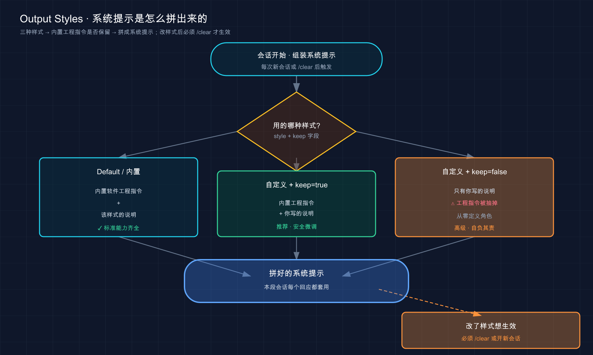

# 32 · 输出样式（Output Styles）：换一档「节目」，不换主持人

> 📚 **系列导航**：上一篇 [31 settings.json：用户级 / 项目级配置](31-settings-json.md) 把「配置写哪个文件、谁压谁」捋清楚了。这一篇接着讲一个就住在那套配置里的开关——**输出样式（output styles）**。它管的不是「Claude 知道什么」，而是「Claude 怎么回应你」。一行设置，就能让它从默认的「闷头干活的工程师」，切成边讲解边干、甚至根本不写代码的另一副样子。

都说「想让 Claude 听话，就往 CLAUDE.md 里堆」——堆约定、堆规矩、堆它该记住的一切。

说句实话，这话只对了一半。CLAUDE.md 确实是装「项目背景」的好地方（详见第 18 篇），但有一类需求往里塞，是**塞错抽屉了**。

哪一类？**「我希望它每次回应的口吻 / 角色 / 格式都变一变」这类。** 比如：我想让它每次都先画个图再解释、我想让它一边写代码一边教我为什么这么写、我干脆想拿它当个写作助手而不是程序员。这些需求你写进 CLAUDE.md，它会**时灵时不灵**——因为 CLAUDE.md 是「附在系统提示之后的一条用户消息」，是给 Claude 看的「请求」，不是改它「本性」的开关。真正改「Claude 怎么说话」的开关，叫 output styles。

这么说吧：CLAUDE.md 是递给新员工的项目资料，output styles 是直接重写他的**岗位说明**——「你这个岗，是埋头编程的工程师，还是边干边讲的导师」。这一篇就讲清这个开关怎么拨。

举个能让你立刻有感觉的场景：**让一个完全不懂代码的人拿 Claude Code 改简历**。开着默认的工程师人格，它动不动就想「帮你把这段拆成函数」「要不要加个测试」——满脑子工程思维，跟改简历这事儿完全不在一个频道。这不是 CLAUDE.md 能解决的问题，这就是 output styles 存在的原因。

**看完这一篇，你会拿到：**

- 一句话讲明白 output styles 改的到底是什么（剧透：是「怎么回应」，不是「知道什么」）
- Claude Code 自带的几种内置样式（默认、Proactive、Explanatory、Learning）各是干嘛的、什么时候切
- 怎么切换样式——以及一个**版本变更的坑**：老的 `/output-style` 命令已经没了，现在该怎么切
- 自定义一个属于你自己的输出样式：Markdown 文件怎么写、那几个 frontmatter 字段各管什么、`keep-coding-instructions` 这个开关别按错
- output styles 和 CLAUDE.md、`--append-system-prompt`、Subagent、Skill 到底差在哪，一张表理清，再不混

---

## 01 先搞懂：它改的是「怎么回应」，不是「知道什么」

先把这一篇最核心的一句话钉死，后面全建在它上面：

> **输出样式改变 Claude 的响应方式，而不是 Claude 知道什么。**

这是官方文档的原话。它的意思是：output styles 不会给 Claude 灌进任何关于你项目的新知识，它动的是 Claude 的**系统提示（system prompt，即每次会话开头就装进去、定义 Claude「是谁、该怎么干活」的那段底层指令）**——给它**设定角色、语气和输出格式**。

**类比：同一位主持人，换一档节目就换一套台风。** 还是这个人，业务能力没变（嘴皮子、知识储备都是他自己的）；但他主持《新闻联播》是一套沉稳腔，主持少儿节目是另一套蹦蹦跳跳的语调，主持教学频道又会放慢节奏、边讲边停下来提问。**换的是「这档节目要求他怎么说话」，不是把他换成另一个人。** output styles 就是给 Claude「换节目」——模型还是那个模型，能力一点没动，变的是它跟你对话时的角色、口吻和格式。

那它什么时候派上用场？官方给的判断很实在：

> 当你在每个回合中不断重新提示相同的语音或格式时，或者当你希望 Claude 充当软件工程师以外的角色时，请使用一个。

（原文如此，这里的「语音」指回应口吻 / 格式。）

翻成大白话，就两种信号：

- **「同一句要求我每轮都得重打一遍」**——比如你每次都得叮嘱「解释的时候先给我画个流程图」，打到第五遍就该想：这不该每轮手打，该固化成一个样式。
- **「我想让它干的根本不是写代码这件事」**——比如拿它当写作助手、当数据分析师。Claude Code 默认那套系统提示是为「高效完成软件工程任务」调的，你让它写小说，那套「先限定改动范围、写好注释、验证工作」的工程指令反而碍事。

回到开篇那个改简历的场景——这正是第二种信号的典型案例：**Claude Code 整个默认人格是为软件工程调的**，你让它帮人改简历，那套「限定改动范围、写好注释、验证工作」的工程指令全成了干扰。这种「让它别当工程师」的活，靠在 CLAUDE.md 里写一堆「请你忘掉你是程序员」是解决不了的——CLAUDE.md 是附在后面的一条请求，output style 才是改它岗位说明的那把刀。

> 💡 一句话总结：output styles 动的是 Claude 的**系统提示**——给它换角色、换语气、换格式，**改的是「怎么回应」，不是「知道什么」**；两种信号该想起它：同一句话每轮重打、或想让它干编程以外的活。

---

## 02 四种内置样式：默认之外，还有三档现成的

不用你自己写，Claude Code 已经内置了几种样式，开箱就能切。先把这几档认全。

**默认（Default）样式**，就是你前面三十一篇一直在用的那个——它的系统提示是**为「高效完成软件工程任务」专门调好的**。埋头干活、改动克制、该验证就验证，这是 Claude Code 的「本职岗位」。没特殊需求，就用它。

除了默认，官方还内置了**三档**额外样式，我挨个用一句话讲清它「跟默认比，多了点啥」：

**Proactive（主动型）——更敢自己拿主意、倾向动手而非先规划。** 官方的说法是：它会「立即执行，做出合理的假设而不是暂停进行常规决策，并倾向于行动而非规划」。说白了就是少跟你来回确认、少在那儿列计划，遇到常规小决策自己拍板往前推。

> 这里有个容易混的点，官方专门点了：Proactive 提供的是比[自动模式](/zh-CN/permission-modes)更强的「自主执行**指导**」，但它**无需更改你的权限模式**就能用——所以**工具运行前你照样会看到权限提示**。权限模式（第 20 篇讲的「实习生动手前问不问你」）管的是「要不要拦着问你」，Proactive 管的是「它的行事风格多激进」，两码事，别当成一个。

**Explanatory（讲解型）——边干活边给你「知识点」。** 它在帮你完成工程任务的同时，会插入一段段教育性的「Insights（洞见）」，帮你理解「为什么这么实现、这个代码库是什么模式」。适合你想顺便搞懂代码、而不只是要个结果的时候。

**Learning（学习型）——协作式边学边做，还会留作业给你。** 这是最特别的一档。它不光像 Explanatory 那样分享洞见，**还会在代码里留 `TODO(human)` 标记，要求你自己动手写一小段、战略性的代码片段**。等于 Claude 把脚手架搭好，关键的几行留给你填——逼着你真上手，而不是全程看它表演。

把这三档落到一句真实的话里，你会更有体感：

- 同一个需求「给这个列表加个分页」，**Proactive** 下它大概率直接动手改、少问你「要不要先列个方案」；
- 同一个需求，**Explanatory** 下它边改边告诉你「这里为什么用游标分页而不是 offset、这个项目其它地方也是这么写的」；
- 同一个需求，**Learning** 下它会把外层框架写好，在最关键那个函数体里留一行 `// TODO(human): 在这里实现游标的解析`，把笔交到你手上。

四档并排，对照看立刻清楚谁该上场：

| 内置样式 | 跟默认比，核心区别 | 什么时候切它 | 响应会更长吗 |
|---------|------------------|------------|------------|
| **Default**（默认） | —— | 正常软件工程，绝大多数时候 | 基准 |
| **Proactive** | 更敢自己拿主意、少确认、倾向动手 | 你嫌它来回问、想让它放开手脚干 | 不一定 |
| **Explanatory** | 边干边插「Insights」讲解 | 想顺便搞懂实现思路和代码库模式 | **更长**（设计如此） |
| **Learning** | 讲解 + 留 `TODO(human)` 让你自己写 | 学习场景，想边做边练手 | **更长**（设计如此） |

最后这列「响应会更长吗」要单独拎出来提醒：官方明确说，**Explanatory 和 Learning 在设计上就比 Default 产出更长的响应**——因为要插讲解、要留作业。长响应意味着更多输出 token（关于 token 怎么计费，见第 06 篇）。所以这俩别一直挂着当默认用，**想学的时候切上，学完切回 Default**，省 token 也省得每次都被一堆讲解刷屏。

一个简单的用法路线：日常干活就用 **Default**；遇到一个不熟的开源仓库、想边让它改边搞懂它的架构，切 **Explanatory**；真要静下心学某个新框架、不想光看它写、想自己也敲两行，才切 **Learning**。Proactive 用得最少的人，往往是更习惯它动手前停一下让人看一眼的——这纯属个人偏好，你嫌它墨迹，完全可以反过来。

> 💡 一句话总结：内置四档——**Default 埋头干活、Proactive 放开手脚少确认、Explanatory 边干边讲、Learning 边讲边留作业给你**；后两档响应更长更费 token，按需切、用完切回默认。

---

## 03 怎么切换：那个 `/output-style` 命令，已经没了

这一节得先泼盆冷水，因为这里藏着一个**版本变更的真坑**——很多老教程、老视频还在教的命令，现在敲下去是无效的。

你在别处大概率会看到这么个说法：「用 `/output-style` 命令切换样式」。**这个独立命令已经被移除了。** 官方文档写得清清楚楚：

> 独立的 `/output-style` 命令在 v2.1.73 中已弃用，在 v2.1.91 中被移除。使用 `/config` 或直接编辑 `outputStyle` 设置。

所以，现在切换样式有**两条正路**，我都给你写清。

### 路子一：`/config` 菜单里点（推荐，直观）

在 Claude 会话里敲 `/config`，在弹出的菜单里找到**输出样式（Output Styles）**那一项，选你要的样式。官方原话：

> 运行 `/config` 并选择**输出样式**从菜单中选择一种样式。你的选择会保存到[本地项目级别](/zh-CN/settings)的 `.claude/settings.local.json`。

注意这句末尾的落点——**你在菜单里选的样式，会被写进当前项目的 `.claude/settings.local.json`**。这正好接上一篇 settings.json 的知识：`settings.local.json` 是**项目级、且只属于你个人、不进版本控制**的那一份（第 31 篇讲过它的定位）。换句话说，你切的样式默认只影响你自己、只在这个项目里生效，不会因为提交代码把它强加给队友。

### 路子二：直接编辑 `outputStyle` 字段

不想点菜单，也可以手写。在 settings 文件里加一个 `outputStyle` 字段就行：

```json
{
  "outputStyle": "Explanatory"
}
```

值就填样式的名字（内置的填 `Explanatory`、`Learning`、`Proactive`，或自定义样式的名字）。这个字段写在哪个 settings 文件里，就决定了它的作用范围——想全局默认就写进用户级 `~/.claude/settings.json`，想这个项目专属就写进项目级。**谁压谁的优先级规则，跟第 31 篇讲的完全一致**，这里不重复。

### 一个必须记住的生效时机

无论哪条路，切完都有个「什么时候才算数」的讲究。官方点得很准：

> 输出样式是系统提示的一部分，Claude Code 在会话开始时读取一次。更改将在 `/clear` 或新会话后生效。

**类比：节目的台本，是开播前发到主持人手里的。** 节目都开播半小时了，你临时塞张新台本进去，这一期是改不动的——得等下一期开播才生效。output style 一样：它是系统提示的一部分，**Claude 在会话开始时只读一次**。你中途切了样式，当前这段对话不会立刻变身，得 `/clear` 清一下（第 19 篇讲过 `/clear` 是「收拾干净台面重开」）或者干脆开个新会话，新样式才真正上场。

很多人头一回切样式就栽在这儿：在 `/config` 里把样式改成了 Explanatory，回到对话发现它还是闷头干活、半句讲解没有，当场以为「这功能坏了」。折腾半天才反应过来——**没 `/clear`，旧的系统提示还在这段会话里挂着呢**。`/clear` 一下，讲解立刻就出来了。这个坑你记着，能省下当时那十分钟的抓狂。

> 💡 一句话总结：老的 `/output-style` 命令**已被移除**，现在切样式走两条路——**`/config` 菜单里选**（存进 `settings.local.json`）或**直接编辑 `outputStyle` 字段**；切完记得 **`/clear` 或开新会话**才生效，别像我一样以为它坏了。

---

## 04 自定义一个属于自己的样式：一个 Markdown 文件搞定

内置四档不够用？你完全可以**自己写一个**。好消息是，门槛低得出奇——**一个 Markdown 文件就是一个输出样式**。

官方把结构说得很干脆：

> 自定义输出样式是一个 Markdown 文件：frontmatter 用于元数据，然后是要添加到系统提示的说明。

拆开就两部分：**头部的 frontmatter**（用 `---` 包起来的元数据）+ **下面的正文**（你想追加进系统提示的指令）。下面分三步带你建一个。

### 第一步：把文件存到对的地方

跟前面学过的扩展点（Skill、Subagent）一样，输出样式也分**三个存放级别**，存在哪决定了它在哪些项目能选到：

| 级别 | 存放目录 | 谁能用到 |
|------|---------|---------|
| **用户级** | `~/.claude/output-styles` | 你所有项目都能选 |
| **项目级** | `.claude/output-styles`（项目根目录下） | 仅当前项目，可随项目提交、共享给队友 |
| **托管策略级** | [托管设置目录](/zh-CN/settings)内的 `.claude/output-styles` | 由组织统一下发 |

**这个「项目级 vs 用户级」的逻辑，跟第 31 篇讲 settings、第 25 篇讲记忆是同一套思路**：自己天天用的、跨项目通用的，放用户级（`~/.claude/output-styles`）；某个项目专属、还想让协作者也能用上的，放项目级（`.claude/output-styles`），它能跟着 git 走。

还有一条命名规则得记住：

> 文件名成为样式名称，除非你在 frontmatter 中设置 `name`。

也就是说，你存一个 `code-reviewer.md`，它的样式名默认就叫 `code-reviewer`；除非你在 frontmatter 里另写了 `name`，那就以 `name` 为准。

### 第二步：写 frontmatter 和正文

来看官方给的这个例子——一个「每次解释都先画图」的样式。我先原样放上来，再逐字段拆：

```markdown
---
name: Diagrams first
description: Lead every explanation with a diagram
keep-coding-instructions: true
---

When explaining code, architecture, or data flow, start with a Mermaid diagram showing the structure, then explain in prose.

## Diagram conventions

Use `flowchart TD` for control flow and `sequenceDiagram` for request paths. Keep diagrams under 15 nodes.
```

上半部分 `---` 之间是 frontmatter，下半部分是正文指令（「解释代码、架构或数据流时，先给一个展示结构的 Mermaid 图，再用文字解释……」）。这段正文，会被**追加进 Claude 的系统提示**——从此它每次解释都会先画图。

frontmatter 支持的字段一共四个，逐个说清：

| Frontmatter 字段 | 管什么 | 默认值 |
|------|--------|--------|
| `name` | 样式名（不写就用文件名） | 从文件名继承 |
| `description` | 样式描述，会显示在 `/config` 选择器里 | 无 |
| `keep-coding-instructions` | **是否保留 Claude Code 内置的软件工程指令** | `false` |
| `force-for-plugin` | 仅 plugin 用：启用插件时自动套用此样式，无需用户手动选 | `false` |

前两个好懂——`name` 是名字，`description` 是给你自己在菜单里认的一句话说明。后两个得单独讲，尤其 `keep-coding-instructions`，它是**整个自定义样式里最容易按错的开关**，下一节专门拆。`force-for-plugin` 只跟做插件相关（第 24 篇讲过 plugin 能打包分发各种扩展点，输出样式也能被插件带着走），日常自己写样式用不到，知道有这么个字段即可。

### 第三步：切到你的新样式

存好文件、写好内容，回到 `/config` 的输出样式菜单里，**你的新样式就会出现在选项里**（旁边显示你写的那句 `description`），选中它。一样的规矩——**`/clear` 或开新会话后生效**。

> 💡 一句话总结：自定义样式就是**一个 Markdown 文件**——frontmatter 写元数据、正文写要追加进系统提示的指令；存对级别（用户级跨项目、项目级随项目走），文件名即样式名，写完去 `/config` 里选、`/clear` 生效。

---

## 05 那个最容易按错的开关：`keep-coding-instructions`

上一节卖了个关子——`keep-coding-instructions` 这个 frontmatter 字段，值得单开一节，因为**按错它，你的自定义样式效果会差十万八千里**。

先说它管什么。前面讲过，Claude Code 默认那套系统提示里，塞满了「软件工程指令」——怎么限定改动范围、怎么写注释、怎么验证工作。**当你写一个自定义样式时，这套内置指令默认会被「踢掉」**。官方原话：

> 自定义输出样式排除了 Claude Code 的内置软件工程说明……除非 `keep-coding-instructions` 设置为 `true`。

这个字段默认是 `false`，意思是：**默认情况下，你的自定义样式会把内置工程指令整个换掉，只留你写的那段**。是保留还是踢掉，全看你的样式是不是还要 Claude 干编程这件事。判断只需问一句：

**「我这个样式，Claude 还在写代码吗？」**

- **还在写代码、只是换个说话方式**（比如「编程照旧，但每次都先给我画个图」）→ **设 `keep-coding-instructions: true`**，把内置工程指令留着。上一节那个「Diagrams first」例子就是这种——它要的是「解释时先画图」，但 Claude 仍在正常编程，所以官方给它设了 `true`。
- **根本不写代码了**（比如把它当写作助手、数据分析师）→ **省掉这个字段**（让它默认 `false`），把那套工程指令踢干净。它都不编程了，「限定改动范围、写测试」这些指令留着纯属干扰。

官方把这条判断讲得特别清楚，值得原样记住：

> 当你改变 Claude 的通信方式但仍在编程时（例如总是用图表回答），请保留它们。当 Claude 根本不进行软件工程时（例如写作助手或数据分析师），请省略它们。

我把这两种情况摆一张对照表，按错的后果一目了然：

| 你的样式想干嘛 | `keep-coding-instructions` 该设 | 按错了会怎样 |
|--------------|------------------------------|------------|
| ✅ 编程照旧，只改回应方式（先画图、固定格式…） | `true`（保留工程指令） | ❌ 设成 `false`：它丢了「限定范围、验证」这些工程纪律，改起代码毛手毛脚 |
| ✅ 完全不编程（写作 / 数据分析 / 翻译…） | 省略（默认 `false`） | ❌ 设成 `true`：满脑子还想着拆函数、加测试，跟你要的写作助手不在一个频道 |

回到第 01 节那个改简历的场景——**根子就在这儿**。那时候要的是个「写作助手」人格，根本不该带任何编程指令。如果当时就会写自定义样式、并且**省掉 `keep-coding-instructions`**（让工程指令默认踢掉），它就不会动不动想「帮你把这段拆成函数」了。这个开关，本质就是在回答「**这副新人格，还兼着工程师那份工吗**」。

> 💡 一句话总结：`keep-coding-instructions` 默认 `false`，会把内置工程指令**整个踢掉**；判断只问一句「**这样式 Claude 还编程吗**」——还编程就设 `true` 保留、不编程就省掉它踢干净，**按反了人格就跑偏**。

---

## 06 它在底层到底怎么作用：拼进系统提示的那一截

前面几节零散提到「追加进系统提示」「会话开始读一次」「踢掉工程指令」——这一节把这套底层机制一次讲透。**搞懂它怎么工作，前面那些「为什么」就全通了**：为什么改了样式要 `/clear`、为什么它影响每一个回应、为什么 `keep-coding-instructions` 能控制工程指令的去留。

官方把工作原理总结成三条，我逐条翻成你能记住的话：

> * 所有输出样式都在系统提示的末尾添加了自己的自定义说明。
> * 所有输出样式都会在对话期间触发提醒，让 Claude 遵守输出样式说明。
> * 自定义输出样式排除了 Claude Code 的内置软件工程说明……除非 `keep-coding-instructions` 设置为 `true`。

第一条：**你的样式指令，是被拼到系统提示「末尾」的**。系统提示是 Claude 每次会话开头就装进去的底层指令，你的 output style 内容追加在它最后——所以它对**这段会话里的每一个回应**都生效，不是只管某一句。

第二条：**对话期间它会反复「提醒」Claude 守住样式**。聊久了 AI 容易把开头的设定忘到脑后，这条提醒机制就是定期把样式说明拎出来念一遍，保证它不跑偏。

第三条，正好解释了上一节那个开关：**自定义样式默认会把内置工程指令从系统提示里「抽掉」，只留你写的那段**；`keep-coding-instructions: true` 则是告诉它「别抽，留着」。这就是为什么这个字段能决定「Claude 还编不编程」——它管的是系统提示里那段工程指令的**存废**。

一张图把「系统提示是怎么被组装出来的」画清楚：



这张图说的是：会话一开始，Claude Code 按你选的样式**组装系统提示**——内置样式和 `keep=true` 的自定义样式都带着工程指令，`keep=false` 的自定义样式则把工程指令抽掉只留你的说明；拼好之后，这段提示对本次会话每个回应都生效；而你**中途改了样式，得 `/clear` 或开新会话，它才会拿新样式重新组装一遍**（第 03 节那个坑的根源就在这）。

最后提一句 token（计费见第 06 篇）。官方说得实在：

> 令牌使用情况取决于样式。向系统提示添加说明会增加输入令牌，尽管 prompt caching 在会话中的第一个请求之后会降低这个成本。

翻成大白话：样式说明会进系统提示，**多少占点输入 token**；好在 Claude Code 有 prompt caching（提示缓存，把不变的系统提示缓存起来重复用），**会话里第一次请求之后这点成本就降下来了**，不用太焦虑。真正会显著拉高消耗的是 Explanatory、Learning 那种「设计上就产出长响应」的样式（多在**输出** token 上），这跟你自己写的样式让 Claude 生成多少东西，是同一个道理——**说明越长、让它产出越多，token 越多**，按需用就好。

> 💡 一句话总结：output style 的指令被**拼到系统提示末尾**、对本段会话每个回应都生效，还会被反复提醒守住；自定义样式默认**抽掉**内置工程指令（`keep=true` 才留）；改样式要 `/clear` 重新组装；样式占点 token，但有 prompt caching 兜着，长响应样式才是消耗大头。

---

## 07 output styles vs CLAUDE.md / Skill / Subagent：到底差在哪

学到这儿，你脑子里大概率冒出一个问题：**这玩意儿跟前面学的 CLAUDE.md、Skill、Subagent，听着都能「定制 Claude 行为」，到底有啥不一样？** 这一节一次理清。第 30 篇那张「功能怎么选」的大表是从需求出发挑工具，这里我们专盯着「跟 output styles 怎么区分」来看。

先抓住 output styles 最独一份的那个特征——**它是直接改系统提示本身，而且对每一个回应都生效**。别的功能要么是「在系统提示之后加一段」，要么是「特定时机才加载」，没一个像它这样动到系统提示的根上。官方那张对比表把这层差别讲透了，我搬过来并各补一句大白话：

| 功能 | 工作原理 | 什么时候用它（而不是 output style） |
|------|---------|------------------------------|
| **输出样式** | **直接修改系统提示**，每个回应都套用 | 你要的就是「每轮都换个角色 / 语气 / 默认格式」 |
| **CLAUDE.md**（第 18 篇） | 在系统提示**之后**附加一条用户消息 | 你要灌的是**项目约定和代码库背景**，不是说话方式 |
| **`--append-system-prompt`** | 往系统提示**追加**内容、不删任何东西 | 你只想给**某一次**调用临时加点指令 |
| **Subagent**（第 23 篇） | 用**自己独立的**系统提示、模型、工具跑子代理 | 你要把某件专注的活交给一个有独立上下文的小助手，它干完只交结论 |
| **Skill**（第 26 篇） | 调用时 / 相关时才加载特定指令 | 你有个**可复用的工作流**，按需调出 |

这张表里，新手最该分清的是头两行——**output style vs CLAUDE.md**。它俩最容易混，因为都「能让 Claude 听你的」。但本质天差地别：

**CLAUDE.md 装的是「内容 / 背景」，output style 装的是「方式 / 角色」。** 一个回答「这个项目是什么、有哪些约定」，一个回答「你该用什么口吻、什么格式来回应」。再说得直白点，回到开篇那个比喻：**CLAUDE.md 是递给员工的项目资料，output style 是给他定的岗位说明**。你不会把「我们用 pnpm 不用 npm」写进 output style（那是项目约定，进 CLAUDE.md），也不会把「请你每次都先画图再解释」写进 CLAUDE.md 当成铁律（那是回应方式，该做成 output style）。官方在文档里专门留了一句指路，就是怕你放错：

> 有关你的项目、约定或代码库的说明，请改用 CLAUDE.md。

至于 `--append-system-prompt`，它跟 output style 像在「都动系统提示」，但**一个是一次性、一个是持久的**：`--append-system-prompt` 是你启动某一次 `claude` 时临时往系统提示后面贴一句，用完即走；output style 是存进配置、每次会话都套上的持久人格。落到命令上就是这个区别——临时试某个风格，你会这么开一次会话：

```bash
claude --append-system-prompt "这次回答都用中文、尽量简短"
```

关掉再开就没了。但如果这个风格你天天要，就别每次手打这串参数，**把它沉淀成一个 output style**，一劳永逸。**临时试一句用前者，固定下来用后者**，这就是它俩的分工。

还有 Skill（第 26 篇）也值得一句区分：Skill 是「**按需才加载**的可复用工作流」，平时不占系统提示，你 `/<name>` 或 Claude 判断相关时才把它调进来；output style 是「**一直挂着、每个回应都套**的角色设定」。一个是「需要时才翻出来的菜谱」，一个是「贯穿整场的主持台风」——要某个特定任务的流程做 Skill，要全程都变的角色语气做 output style。

还有一种常见的混淆是另一个方向：想让 Claude「回答风格简洁、少废话」，**第一反应是写进 CLAUDE.md**。结果它时灵时不灵——因为风格这种东西，本就该靠改系统提示（output style）来定，而不是靠 CLAUDE.md 那条「附加在后面的请求」去提醒。这跟第 30 篇里把「三百行接口塞进 CLAUDE.md」是同一类错误：**东西没放进对的抽屉。**

> 💡 一句话总结：output styles 独一份在于**直接改系统提示、每个回应都套用**；跟它最容易混的是 CLAUDE.md——**CLAUDE.md 装项目背景（内容）、output style 装角色语气格式（方式）**；一次性临时加指令用 `--append-system-prompt`，要独立作用域的助手用 Subagent。

---

## 08 动手：写一个「先画图再解释」的自定义样式并跑通

光看不练假把式。这一节带你从零建一个自定义输出样式、切上去、并亲眼验证它真的生效。我们就做官方那个最经典的「先画图再解释」，**全程不依赖你任何已有的复杂项目**，随便找个目录就能练。

### 第一步：建样式文件

我们存到**用户级**目录（`~/.claude/output-styles`），这样你以后任何项目都能选到它。先建目录、再建文件：

```bash
mkdir -p ~/.claude/output-styles
```

然后用你顺手的编辑器，在 `~/.claude/output-styles/` 下新建一个文件 `diagrams-first.md`，填入下面的内容（正文我翻成了中文，方便你读；指令用中文 Claude 一样照办）：

```markdown
---
name: Diagrams first
description: 每次解释都先画一张图，再用文字说明
keep-coding-instructions: true
---

解释代码、架构或数据流时，先给一张展示结构的 Mermaid 图，再用文字解释。

## 画图约定

控制流用 `flowchart TD`，请求路径用 `sequenceDiagram`。每张图节点控制在 15 个以内。
```

注意 `keep-coding-instructions: true`——因为这个样式下 **Claude 还在正常编程**，只是多了个「先画图」的习惯，所以要把内置工程指令**留着**（第 05 节讲的判断）。

### 第二步：切到这个样式

进 Claude 会话，敲 `/config`，进**输出样式**菜单，应该能看到一个 `Diagrams first`（旁边显示你写的那句 `description`），选它。

```bash
claude
```

进去后敲 `/config`，方向键移到「Output Styles」，回车，选 `Diagrams first`。

**预期**：菜单里**能看到** `Diagrams first` 这一项，且旁边挂着「每次解释都先画图……」那句描述。**看到它在列表里 = 文件被正确识别了**。如果没看到，八成是文件没存对目录、或 frontmatter 的 `---` 写漏了。

### 第三步：`/clear` 让它生效

选完别急着提问——**先 `/clear`**（还记得第 03 节那个坑吗？系统提示会话开始才读一次）：

```text
/clear
```

### 第四步：提个问题，验证它真先画图了

清完台面，问它一个「需要解释」的问题，看它是不是乖乖先上图：

```text
解释一下用户登录的请求是怎么从前端走到数据库的
```

**预期**：它的回答会**先甩出一个 Mermaid 图**（多半是个 `sequenceDiagram`，画前端 → 后端 → 数据库的请求路径），**然后**才用文字解释。看到「图在前、文字在后」这个顺序 = 你的自定义样式**生效了**。

作为对比，你可以 `/config` 切回 `Default`、再 `/clear`、问同一个问题——它就只给文字、不画图了。**这一前一后的差别，就是 output style 实打实在改「怎么回应」的铁证。**

### 第五步：清理（可选）

不想留这个样式，直接删文件即可：

```bash
rm ~/.claude/output-styles/diagrams-first.md
```

删完它就从 `/config` 菜单里消失了。（如果当前正用着它，记得先在 `/config` 里切回 `Default`。）

跑通这五步，你就把「**建文件 → 切样式 → `/clear` 生效 → 验证 → 清理**」这条完整链路亲手走了一遍。以后做任何自定义样式，无非换换正文指令、按需调 `keep-coding-instructions`，流程都是这一套。

> 💡 一句话总结：自定义样式实操就五步——**建 `.md` 文件、`/config` 选、`/clear` 生效、提问验证「图在前文字在后」、删文件清理**；切回 Default 问同一问题做对比，差别一眼可见。

---

## 09 小结

这一篇我们拆透了 output styles——**那个改「Claude 怎么回应你」而非「Claude 知道什么」的开关**。

把核心要点串起来回顾：

| 你想干的事 | 怎么做 | 关键点 |
|-----------|--------|--------|
| 理解 output styles 是什么 | 改系统提示里的角色 / 语气 / 格式 | 改「怎么回应」，不改「知道什么」 |
| 用现成的内置样式 | Default / Proactive / Explanatory / Learning | 后两档响应更长更费 token，按需切 |
| 切换样式 | `/config` 菜单选，或编辑 `outputStyle` 字段 | 老的 `/output-style` 命令**已移除**；切完 `/clear` 才生效 |
| 自定义一个样式 | 写一个 Markdown 文件（frontmatter + 正文） | 文件名即样式名；存用户级跨项目、项目级随项目走 |
| 决定保不保留工程指令 | `keep-coding-instructions` | 还编程就 `true`、不编程就省掉（默认 `false`） |
| 跟 CLAUDE.md 分清 | 看装的是「方式」还是「内容」 | 角色语气格式→output style；项目背景约定→CLAUDE.md |

**你现在应该能：** 一句话说清 output styles 改的是什么、内置四档分别什么时候切、用 `/config`（而不是已废弃的 `/output-style`）把样式切对并知道要 `/clear` 才生效；自己写一个 Markdown 自定义样式、把 `keep-coding-instructions` 这个开关按对，还能拎清它跟 CLAUDE.md、Skill、Subagent 的边界。**说白了，你手里这下多了一把「给 Claude 换人格」的钥匙——同一个模型，能让它从工程师切成导师、切成写作助手，按活儿换装。**

回到开篇那句「想定制就往 CLAUDE.md 里堆」——现在你该清楚了：**项目背景往 CLAUDE.md 堆没错，但「换个口吻、换个角色、换种格式」这类「怎么回应」的事，归 output styles 管**，放对抽屉，两个都好用。

---

下一篇 **33「钩子（Hooks）」**——output styles 是「换 Claude 说话的方式」，但它终究还得靠 Claude 自己「愿意照办」。有没有一种机制，能让某件事**雷打不动、不靠 Claude 自觉就自动发生**？比如「每次它一改完文件，就自动跑一遍格式化」「某条危险命令必须被硬拦」。这就是 Hook 干的活——**事件一触发就执行的自动卡点**，前面第 30 篇给你留了个引子，下一篇彻底拆开。想想看：哪些事你已经叮嘱过 Claude 好几遍、却还想要个「保证它每次都做」的硬约束？
