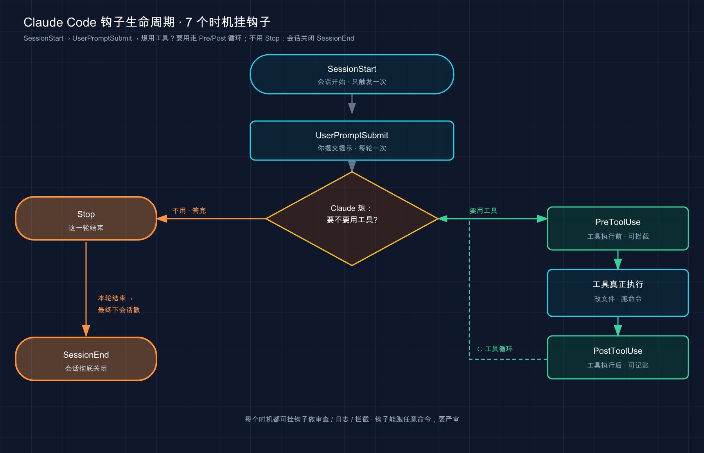

# 33 · 钩子（Hooks）：在固定时机自动扣扳机

> 📚 **系列导航**：上一篇 [32 输出样式（Output Styles）](./32-output-styles.md) 教你怎么换一套「人格」让 Claude 用你想要的口吻干活。这一篇聊的是另一种「自动化」——不是改它怎么说话，而是**在某个事件一发生的那一刻，雷打不动替你跑一段动作**：改完文件自动格式化、危险命令直接拦死、它干完活给你发条通知。这就是钩子（Hooks）。

设想这样一个数字：**某一周里，让 Claude 改完代码后，手动补敲 `prettier --write` 的次数，是 23 次**。

23 次。同一个动作，机械地重复了 23 遍。更离谱的是中间还漏了两回——提交上去之后被 CI 的格式检查打回来，又得重新跑一遍流程。

这时候就该想一个事：**这种「每次都得做、做的内容还一模一样」的动作，凭什么要靠人记着、靠 Claude 自觉？** 在 CLAUDE.md 里写过「改完文件记得跑 prettier」，可它三次里总有一次想不起来——因为那只是一句**请求**，不是**保证**。

而配一个钩子（Hook），一行配置，问题就彻底没了：**从那以后，Claude 每编辑完一个文件，格式化就自动跑，再没手敲过一次 prettier，也再没被 CI 打回来过**。这一篇，就把这个能「自动扣扳机」的东西，从是什么讲到怎么配、怎么调。

**看完这一篇，你会拿到：**

- 一句话讲明白 Hook 是什么、它跟「写进 CLAUDE.md 的请求」差在哪个根本点上
- Claude 干活的生命周期里，到底有哪些「时机」能挂钩子（`PreToolUse` / `PostToolUse` / `Stop` / `SessionStart` 等）
- 钩子配在哪个文件、`matcher` 怎么把它收窄到「只在改文件时触发」
- 三个能直接抄走的真实例子：改完自动格式化、拦危险命令、干完发通知
- 钩子和 Claude 之间靠什么对话（stdin 的 JSON、退出码、stdout）——这是看懂一切的钥匙
- 钩子不触发、报错时，怎么一步步查出来

---

## 01 先搞懂：Hook 到底是什么、强在哪个「保证」上

先给结论：**Hook 是「某个事件一发生，就自动执行的一段命令或请求」——它不靠 Claude 思考决定要不要做，触发是有保证的。**（最常用的是 shell 命令，此外还支持 HTTP 端点、MCP 工具、LLM 提示等形式。）

官方的定义很干脆，先放这儿：

> Hooks 是用户定义的 shell 命令，在 Claude Code 生命周期中的特定点执行。它们对 Claude Code 的行为提供确定性控制，确保某些操作始终发生，而不是依赖 LLM 选择运行它们。

注意里头两个词：**「确定性控制」「始终发生」**。这就是 Hook 的命门所在。

**类比：家里贴的自动化规则（「当……就……」）。** 你给智能家居设过那种规则吧——「**当**有人开门，**就**亮灯」「**当**我离家，**就**关掉所有插座」。条件一满足，动作必然发生，不需要谁记得。Hook 就是给 Claude Code 装的这种规则——你定义「**当**某个事件发生，**就**跑这段命令」，它自动执行，雷打不动。

这里要把一个**最关键的区别**钉死：**写进 CLAUDE.md 的是「请求」**——它大概率照办，但可能漏；**配成 Hook 的是「保证」**——只要那个事件触发，动作一定执行，跟 Claude 记不记得没半点关系。官方的话：

> CLAUDE.md 或 skill 中的「永远不要编辑 `.env`」之类的说明是请求，而不是保证。阻止编辑的 `PreToolUse` hook 是强制执行。

这就是开头那 23 次的根源：「改完跑 prettier」写在 CLAUDE.md 里是请求，三次漏一次；配成 Hook 是保证，一次不漏。

几个你大概率会遇到、值得「上保证」的场景，先感受一下：

- **「每次改完文件，自动格式化 / 跑 lint」**——别再手敲，也别指望它自觉
- **「`rm -rf`、删生产库这种命令，给我硬拦死」**——要确定地拦住，不能靠提示
- **「它干完活、或者等我输入时，给我发条桌面通知」**——你好切去干别的，不用盯着终端

> 💡 一句话总结：Hook 是「事件触发的自动动作」，核心价值是**把「请求」变成「保证」**——CLAUDE.md 拜托它做的事可能漏，Hook 挂上的事件一触发就必然执行。

---

## 02 有哪些「时机」能挂钩子：认识生命周期事件

Hook 不是随便什么时候都能挂，它得挂在 Claude 干活流程里**特定的「时机」**上。这些时机，官方叫**事件（event）**。想用好 Hook，第一步就是认清「我想让这事在什么时候发生」。

回想第 03 篇讲的「代理循环」——Claude 干活是「想 → 做 → 看」转圈。这些事件，正好散布在这个循环的前前后后。官方把它们按**触发频率**分成了三档，这个分法特别好记：

- **每个会话一次**：`SessionStart`（会话开始 / 恢复时）、`SessionEnd`（会话结束时）
- **每一轮对话一次**：`UserPromptSubmit`（你刚提交提示、Claude 还没开始处理时）、`Stop`（Claude 答完这一轮时）
- **代理循环里每次工具调用**：`PreToolUse`（某个工具**就要执行前**）、`PostToolUse`（某个工具**成功执行后**）

光说有点抽象，画张图你一眼就懂这几个最常用的事件卡在哪儿：



这张图把「想→做→看」的循环摊开了：一进会话是 `SessionStart`，你说话是 `UserPromptSubmit`，然后进入「要不要用工具」的循环——每次动工具，前面有 `PreToolUse`、后面有 `PostToolUse`，循环转完这一轮就是 `Stop`，整个会话收摊是 `SessionEnd`。**你想让动作在哪一步发生，就挂对应的那个事件。**

这六个是日常用得最多的。其实官方支持的事件有三十来个（比如压缩前后的 `PreCompact`/`PostCompact`、文件落盘变动的 `FileChanged`、配置被改的 `ConfigChange`、子代理起停的 `SubagentStart`/`SubagentStop` 等），但**对小白来说，先把下面这四个吃透，能覆盖九成场景**：

| 事件 | 什么时候触发 | 最典型的用法 |
|------|------------|------------|
| **`PreToolUse`** | 某个工具**执行前** | 拦危险命令、保护敏感文件（**能阻止操作**） |
| **`PostToolUse`** | 某个工具**成功执行后** | 改完文件自动格式化 / 跑 lint |
| **`Stop`** | Claude 答完这一轮 | 提醒「活还没干完，继续」、扫一遍工作区 |
| **`SessionStart`** | 会话开始或恢复时 | 往上下文里注入项目状态（如最近的提交） |

记这张表有个窍门：**看名字里的 `Pre` 和 `Post`**——`Pre` 是「之前」，所以只有它能在动作发生前**拦住**；`Post` 是「之后」，工具都跑完了，它只能「事后补一刀」（格式化、记日志），拦不了。这个差别下一节细说。

> 💡 一句话总结：Hook 挂在 Claude 生命周期的**特定事件**上，按频率分三档（每会话 / 每轮 / 每次工具调用）；新手先吃透 `PreToolUse`（前，能拦）、`PostToolUse`（后，补刀）、`Stop`（答完）、`SessionStart`（开场）这四个就够用。

---

## 03 钩子配在哪、`matcher` 怎么把它收窄

知道了能挂哪些事件，来看怎么写。Hook 写在**设置文件（settings.json）**里——就是第 31 篇专门讲过的那套配置文件。**写在哪个文件，决定了它管多大范围**：

| 配在哪个文件 | 生效范围 | 能共享给团队吗 |
|------------|---------|--------------|
| `~/.claude/settings.json` | **你所有项目** | 否，只在你这台机器 |
| `.claude/settings.json`（项目根） | **仅当前项目** | **是**，可以提交进 git |
| `.claude/settings.local.json`（项目根） | 仅当前项目 | 否，被 gitignore |

这跟第 31 篇讲配置时的「项目档案柜 vs 工位抽屉」是同一套逻辑：**全队都该有的 Hook（比如「改完一律格式化」）写进项目的 `.claude/settings.json` 提交进 git；只是你自己想要的（比如发通知到你的桌面）写进 `~/.claude/settings.json`**。

### Hook 配置长什么样

先看一个最小的完整例子——**「每次用 Edit 或 Write 改完文件，自动跑 prettier 格式化」**，就是治好那 23 次毛病的那段。写进项目根目录的 `.claude/settings.json`：

```json
{
  "hooks": {
    "PostToolUse": [
      {
        "matcher": "Edit|Write",
        "hooks": [
          {
            "type": "command",
            "command": "jq -r '.tool_input.file_path' | xargs npx prettier --write"
          }
        ]
      }
    ]
  }
}
```

别被这层嵌套吓到，它就三层，对着拆一下你立刻懂：

1. **`"PostToolUse"`**——挂哪个**事件**（这里：工具执行后）。
2. **`"matcher": "Edit|Write"`**——**收窄到哪些工具**才触发（这里：只在 `Edit` 或 `Write` 工具之后，不在 `Bash`、`Read` 之后）。
3. **里层的 `hooks` 数组**——真正要跑的**动作**：`"type": "command"` 表示跑一条 shell 命令，`"command"` 就是那条命令。

这条命令里的 `jq` 是个解析 JSON 的小工具（Mac 用 `brew install jq` 装，Ubuntu 用 `apt-get install jq`）。它的作用下一节讲——简单说就是从 Claude 递来的数据里，**把刚改的那个文件路径抠出来**，喂给 prettier。

### `matcher`：让钩子「只在该触发的时候触发」

`matcher` 是 Hook 配置里**最该搞懂的一个字段**。一句话：**没有它，钩子会在那个事件的「每一次」都触发；有了它，你能把范围收窄**。

**类比：保安的进门规定——不是来送货的，不进大门。** 没有 `matcher` 的钩子就像让保安「任何人来都登记」，效率很低；有了 `matcher`，就变成「**只有快递员**来才登记，其他人直接放行」。`matcher` 干的就是这个「划定触发范围」的活。

对工具类事件（`PreToolUse`/`PostToolUse`），`matcher` 匹配的是**工具名**。它的写法有三种，看这张表：

| 你写的 matcher | 含义 | 例子 |
|--------------|------|------|
| `"Edit\|Write"` | 精确匹配这几个工具（`\|` 是「或」） | 只在 Edit 或 Write 之后触发 |
| `"Bash"` | 精确匹配单个工具 | 只在跑 Bash 命令时触发 |
| `""` 或省略 | **匹配所有**，每次都触发 | 该事件每次发生都跑 |

注意：**`matcher` 区分大小写**，写成 `edit` 是匹配不上 `Edit` 工具的——这是新手钩子不触发最常见的原因之一。

还有一点新手容易忽略：**有些事件压根不支持 `matcher`**（比如 `UserPromptSubmit`、`Stop`），因为它们没有「工具名」这种东西可筛，总是每次都触发。给这些事件加 `matcher`，会被静默忽略。

> 💡 一句话总结：Hook 写进 `settings.json`（全局放家目录、项目放 `.claude/`），配置就三层——**事件、matcher、动作**；`matcher` 负责把钩子收窄到「只在该触发的工具上触发」，且**区分大小写**。

---

## 04 钩子和 Claude 怎么对话：stdin、退出码、stdout

这一节是**看懂一切的钥匙**。前面那条 `jq` 命令为什么能拿到文件路径？钩子怎么「拦」住一条命令？答案全在这套「对话机制」里。

机制本身极简单，就三条管道：**Claude 把事件数据从 `stdin` 喂给你的脚本 → 脚本干活 → 脚本用「退出码 + stdout」告诉 Claude 接下来怎么办**。逐个拆。

### 输入：Claude 从 stdin 递给你一坨 JSON

事件一触发，Claude Code 会把**这个事件的相关数据**，作为一段 JSON 从标准输入（stdin）塞给你的命令。比如 Claude 要跑 Bash 命令时，`PreToolUse` 钩子收到的大概长这样：

```json
{
  "session_id": "abc123",
  "cwd": "/Users/sarah/myproject",
  "hook_event_name": "PreToolUse",
  "tool_name": "Bash",
  "tool_input": {
    "command": "npm test"
  }
}
```

看到了吧——**Claude 要干什么、用哪个工具、参数是什么，全在里头**。第 03 节那条 `jq -r '.tool_input.file_path'`，干的就是从这坨 JSON 里把 `tool_input.file_path`（要改的文件路径）抠出来。`jq` 就是专门解析 JSON 的工具，`-r` 是让它输出纯文本（不带引号）。

### 输出：用「退出码」告诉 Claude 下一步

脚本干完活，靠**退出码（exit code）**给 Claude 下指令。这是 Hook 最核心的约定，**记住三个数就行**：

| 退出码 | 含义 | 效果 |
|-------|------|------|
| **`0`** | 没意见，正常走 | 操作继续（`PreToolUse` 时**不等于批准**，照常走权限流程） |
| **`2`** | **拦住！** | 操作被阻止；你写到 **stderr** 的内容会作为反馈递给 Claude，让它调整 |
| 其他（如 1） | 出错了，但不拦 | 操作继续，终端显示一条 hook 报错提示 |

**重点是 `exit 2`**——这是钩子「踩刹车」的唯一方式。注意一个反直觉的坑：

> 对于大多数 hook 事件，仅退出代码 2 阻止操作。Claude Code 将退出代码 1 视为非阻止错误并继续操作，尽管 1 是传统的 Unix 失败代码。如果您的 hook 旨在强制执行策略，请使用 `exit 2`。

翻成人话：**想拦操作，必须 `exit 2`，不是 `exit 1`**。很多人按 Unix 习惯写了 `exit 1`，结果钩子「报了错但没拦住」，命令照样跑了。这是第一次写拦截钩子时最容易栽的跟头——脚本明明判断出了危险命令、也打印了警告，但因为顺手写成 `exit 1`，Claude 该跑还是跑了，吓人一身汗。

还有个细节关系到「能不能拦住」：**只有 `Pre` 类事件能真正拦操作**。`PostToolUse` 收到 `exit 2` 也拦不住——因为工具已经跑完了，木已成舟，它只能把 stderr 显示给 Claude 看。这就呼应了上一节那句「`Pre` 能拦、`Post` 只能补刀」。

### 进阶：用 stdout 返回 JSON，做更细的控制

退出码只能「拦 / 不拦」两档。想要更细的控制（比如**拦的同时告诉 Claude 具体原因**、或往它上下文里**注入一段信息**），就改成 `exit 0` 然后往 **stdout** 打印一段 JSON。

> 用退出码 2 配 stderr 来「阻止」，或用 JSON 配退出码 0 来做「结构化控制」。**两者不要混用**：你退出 2 时，Claude Code 会忽略 JSON。

举两个最常见的 JSON 输出：

**① `PreToolUse` 想拦截、并说明理由**——用 `permissionDecision`：

```json
{
  "hookSpecificOutput": {
    "hookEventName": "PreToolUse",
    "permissionDecision": "deny",
    "permissionDecisionReason": "这条命令会动生产库，禁止执行"
  }
}
```

`permissionDecision` 有四个值：`"deny"`（拦掉，把理由发给 Claude）、`"ask"`（照常弹权限框问你）、`"allow"`（跳过权限框直接放行）、`"defer"`（延迟执行，让工具稍后恢复，适合非交互模式下的异步审批场景）。

这里有条**安全红线**必须讲清楚，呼应第 20、21 篇的权限与安全：**钩子返回 `"allow"`，不能绕过你设置里的拒绝规则**。官方原话——

> 返回 `"allow"` 跳过交互式提示但不覆盖权限规则。如果拒绝规则与工具调用匹配，即使你的 hook 返回 `"allow"`，调用也会被阻止。

也就是说：**Hook 只能「收紧」限制，不能「放松」到超过权限规则允许的范围**。这是个很重要的安全设计——它保证了恶意钩子没法靠返回 `allow` 把你的安全护栏拆了。反过来，`PreToolUse` 钩子的拦截优先级极高：**哪怕你开了 `--dangerously-skip-permissions`（跳过所有权限），一个返回 `deny` 的钩子照样能拦住**。所以拿 Hook 来强制团队红线，是真·拦得死。

**② `SessionStart` 想往上下文里塞点信息**——直接往 stdout 打印文本就行（这几个事件特殊，stdout 会被当成上下文喂给 Claude）。比如会话一开就把最近 5 条提交告诉它：

```json
{
  "hooks": {
    "SessionStart": [
      {
        "hooks": [
          {
            "type": "command",
            "command": "git log --oneline -5"
          }
        ]
      }
    ]
  }
}
```

> 💡 一句话总结：钩子和 Claude 靠三条管道对话——**stdin 喂 JSON 进来、退出码下指令、stdout 做精细控制**；记死「`exit 2` 才拦得住（不是 1）」「退出码和 JSON 别混用」「Hook 只能收紧、不能放松权限」这三条，就抓住了七成。

---

## 05 三个能直接抄走的真实例子

理论够了，上三个常用、你也能直接抄的钩子。每个都标清楚「挂哪个事件、收窄到哪、配在哪个文件」。

### 例子一：改完文件自动格式化（`PostToolUse`）

就是治好那 23 次毛病的那个，最实用、零风险，**强烈建议每个项目都配上**。写进项目根的 `.claude/settings.json`：

```json
{
  "hooks": {
    "PostToolUse": [
      {
        "matcher": "Edit|Write",
        "hooks": [
          {
            "type": "command",
            "command": "jq -r '.tool_input.file_path' | xargs npx prettier --write"
          }
        ]
      }
    ]
  }
}
```

**逻辑**：Claude 每次用 `Edit`/`Write` 改完文件 → 钩子从 stdin 的 JSON 里抠出文件路径 → 丢给 `prettier --write` 格式化。从此格式永远统一，不用你操心。把 `prettier` 换成 `eslint --fix`、`gofmt`、`black` 都是一个套路。

### 例子二：拦掉危险命令（`PreToolUse` + 脚本）

这个用上了「`exit 2` 拦截」。命令复杂时，把逻辑写进一个**单独的脚本**比硬塞进 JSON 清爽得多。

**第一步**，把脚本存到 `.claude/hooks/block-dangerous.sh`：

```bash
#!/bin/bash
# block-dangerous.sh：拦截 rm -rf 这类危险命令
INPUT=$(cat)
COMMAND=$(echo "$INPUT" | jq -r '.tool_input.command')

if echo "$COMMAND" | grep -q "rm -rf"; then
  echo "Blocked: 检测到 rm -rf，已拦截" >&2   # 写到 stderr，会反馈给 Claude
  exit 2                                       # exit 2 = 阻止这次工具调用
fi

exit 0   # 其余命令放行，走正常权限流程
```

**第二步**，给脚本加可执行权限（Mac/Linux 必须，否则 Claude 跑不了它）：

```bash
chmod +x .claude/hooks/block-dangerous.sh
```

**第三步**，在 `.claude/settings.json` 里注册它，挂到 `Bash` 工具的 `PreToolUse` 上：

```json
{
  "hooks": {
    "PreToolUse": [
      {
        "matcher": "Bash",
        "hooks": [
          {
            "type": "command",
            "command": "\"$CLAUDE_PROJECT_DIR\"/.claude/hooks/block-dangerous.sh"
          }
        ]
      }
    ]
  }
}
```

这里那个 `$CLAUDE_PROJECT_DIR` 是 Claude Code 提供的环境变量，指向**项目根目录**——用它拼路径，钩子不管在哪个子目录跑都能找到脚本，比写死的相对路径稳。

> ⚠️ 这一节回到第 21 篇的安全主线：**钩子是用你的完整用户权限跑的 shell，能删你能删的任何文件**。官方反复强调，加任何钩子前先审一遍它的命令，尤其别从来路不明的地方抄整段脚本就往设置里塞。

### 例子三：它需要你输入时，发条桌面通知（`Notification`）

Claude 干到一半要你批准、或者答完等你下一句时，你可能早切去刷别的了。挂个通知钩子，它就主动喊你。这个用 `Notification` 事件（Claude 发通知时触发）。

**macOS** 写进 `~/.claude/settings.json`（这种「叫我」的钩子是你个人偏好，放全局）：

```json
{
  "hooks": {
    "Notification": [
      {
        "matcher": "",
        "hooks": [
          {
            "type": "command",
            "command": "osascript -e 'display notification \"Claude Code 在等你\" with title \"Claude Code\"'"
          }
        ]
      }
    ]
  }
}
```

**平台差异**（官方给的原生命令，照抄即可）：

| 平台 | 通知命令（填进 `command`） |
|------|-------------------------|
| **macOS** | `osascript -e 'display notification "..." with title "Claude Code"'` |
| **Linux** | `notify-send 'Claude Code' '...'` |
| **Windows** | 用 PowerShell 的 `MessageBox`（官方文档有完整片段） |

macOS 上如果通知没弹出来，多半是 Script Editor 没拿到通知权限——去「系统设置 → 通知」里找到 Script Editor 把开关打开。第一次配很容易死活没声响，折腾半天才发现是这个权限没给。

> 💡 一句话总结：三个钩子按风险递增——**格式化（`PostToolUse`，零风险，建议人人配）、拦命令（`PreToolUse`+脚本，记得 `chmod +x` 和 `exit 2`）、发通知（`Notification`，平台命令不同）**；脚本路径用 `$CLAUDE_PROJECT_DIR` 拼最稳。

---

## 06 动手：5 分钟配一个钩子并亲眼看它触发

光看不练记不住。下面带你配一个**最安全、最容易看到效果**的钩子——**每次 Claude 跑完 Bash 命令，就把这条命令记进一个日志文件**。全程不动你任何代码，纯加一段配置，跑完能亲眼验证。

这个练习用到 `jq`。没装的话：Mac 跑 `brew install jq`，Ubuntu 跑 `sudo apt-get install jq`。装不装得上不需要魔法上网。

**第一步：找一个练手目录，打开它的项目设置文件**

随便找个空目录（别在重要项目里练），在里头建 `.claude/settings.json`。如果文件已存在且有别的内容，把 `hooks` 这块作为新键加进去，别整个覆盖。文件内容：

```json
{
  "hooks": {
    "PostToolUse": [
      {
        "matcher": "Bash",
        "hooks": [
          {
            "type": "command",
            "command": "jq -r '.tool_input.command' >> ~/claude-bash-log.txt"
          }
        ]
      }
    ]
  }
}
```

这条钩子：每次 `Bash` 工具跑完（`PostToolUse` + `matcher: "Bash"`）→ 从 stdin 的 JSON 里抠出命令 → 用 `>>` 追加写进家目录的 `claude-bash-log.txt`。

**第二步：在这个目录里启动 Claude，确认钩子已注册**

```bash
claude
```

进去后输入 `/hooks`：

```text
/hooks
```

**预期**：弹出一个**只读**的钩子浏览器，列出所有事件。找到 `PostToolUse`，旁边应该显示有 1 个钩子。选中它能看到详情：事件、matcher（`Bash`）、来源文件（`Project`，即项目的 `.claude/settings.json`）、还有那条命令。**看到它在列表里 = 钩子注册成功了。**

`/hooks` 菜单是**只读**的——它只能让你查、不能加和改。要改钩子，直接编辑 `settings.json`，或者直接让 Claude 帮你改。

**第三步：让 Claude 跑条 Bash 命令，触发钩子**

按 `Esc` 回到对话，让它跑个无害的命令：

```text
帮我用 ls 看一下当前目录有哪些文件
```

它会调用 `Bash` 工具跑 `ls`。**这一跑，`PostToolUse` 钩子就该触发了。**（钩子成功执行时是「静默」的，终端不会特意提示——这是正常的。）

**第四步：验证钩子真跑了——查日志文件**

新开一个终端，看日志：

```bash
cat ~/claude-bash-log.txt
```

**预期**：文件里出现了刚才那条 `ls` 命令（以及这个会话里 Claude 跑过的其他 Bash 命令）。**看到命令被记下来了 = 钩子真的在每次 Bash 后自动触发了**，你这条「自动化规则」立起来了。

**第五步：清理（可选）**

练完拆掉很简单——把 `.claude/settings.json` 里那段 `hooks` 删掉就行（钩子没有单独的「删除命令」，从配置里移除条目即可）。日志文件 `rm ~/claude-bash-log.txt` 删掉。

跑通这五步，你就把「**写配置 → `/hooks` 确认注册 → 触发事件 → 验证副作用**」这条完整链路亲手走了一遍。**以后配任何钩子，本质都是这套流程**，无非换个事件、换个 matcher、换条命令。

> 💡 一句话总结：练手就配「记录 Bash 命令」这种零风险钩子最稳——**写进 `.claude/settings.json`、用 `/hooks` 看它注册、让 Claude 跑命令触发、查日志文件验证**；亲眼看到副作用发生，比记十条定义都顶用。

---

## 07 钩子不触发 / 报错了，怎么查

Hook 配好了不灵，是新手最常见的卡点。别瞎猜，按下面这个顺序查，基本都能定位。我把官方的排查清单整理成了「症状 → 怎么查」：

| 症状 | 最可能的原因 / 怎么查 |
|------|---------------------|
| **钩子压根不触发** | ① 跑 `/hooks` 看它到底注册了没；② `matcher` 区分大小写，`edit` 匹配不上 `Edit`；③ 事件挂错了（想拦操作要用 `PreToolUse`，不是 `PostToolUse`） |
| **`/hooks` 里根本没有我配的钩子** | ① JSON 格式错了（**JSON 不允许尾逗号、不允许注释**）；② 文件位置错了（项目钩子在 `.claude/settings.json`，全局在 `~/.claude/settings.json`）；③ 改完没生效就重启一次会话 |
| **终端报 `hook error`** | 脚本意外非零退出。手动测一下（见下方命令）；报 `command not found` 多半是脚本路径不对，用绝对路径或 `$CLAUDE_PROJECT_DIR`；报 `jq: command not found` 就是没装 `jq` |
| **脚本没跑起来** | Mac/Linux 上脚本忘了加可执行权限，补 `chmod +x` |
| **想拦却没拦住** | 八成是写了 `exit 1`，改成 `exit 2`（见第 04 节那个坑） |

两个**最实用的排查手段**单独拎出来：

**① 手动喂假数据测脚本**。不用真在 Claude 里触发，自己造一段 JSON 管道喂给脚本，看它退出码对不对：

```bash
echo '{"tool_name":"Bash","tool_input":{"command":"rm -rf /tmp/x"}}' | ./block-dangerous.sh
echo $?   # 看退出码：拦截脚本这里应该输出 2
```

这是调拦截钩子的标准动作——**先把脚本单独喂熟了，再挂到 Claude 上**，省得在真实会话里反复试。

**② 开调试日志看细节**。想看「到底哪些钩子匹配了、退出码多少、stdout/stderr 是啥」，用 `--debug` 启动，日志会写进 `~/.claude/debug/<会话id>.txt`：

```bash
claude --debug
```

或者会话里直接敲 `/debug` 也能开。日志里会有类似这样的行，一眼看出钩子有没有跑、跑成啥样：

```text
[DEBUG] Executing hooks for PostToolUse:Bash
[DEBUG] Hook command completed with status 0
```

还有个一键开关值得知道：**想临时关掉所有钩子**（比如怀疑某个钩子在捣乱），在设置文件里加一句 `"disableAllHooks": true` 就行，不用一个个删。

> 💡 一句话总结：钩子不灵别瞎猜，按「**`/hooks` 看注册 → 查 matcher 大小写和事件选对没 → 手动喂 JSON 测脚本 → `--debug` 看日志**」的顺序查；想拦没拦住先看是不是写了 `exit 1`。

---

## 08 小结

这一篇我们把 Hook 从「是什么」一路讲到「怎么配、怎么调」——**它是给 Claude Code 装的「自动化规则」：某个事件一触发，就雷打不动替你跑一段动作**。

把核心串起来回顾：

| 你想干的事 | 怎么落地 | 关键点 |
|-----------|---------|--------|
| 理解 Hook 是什么 | 事件触发的自动 shell 命令 | 把「请求」变成「保证」，不靠 Claude 自觉 |
| 选对挂载时机 | 认生命周期事件 | `Pre` 能拦、`Post` 补刀、`Stop` 答完、`SessionStart` 开场 |
| 写一个钩子 | 配进 `settings.json` | 三层：事件 + `matcher`（区分大小写）+ 动作 |
| 让钩子和 Claude 对话 | stdin / 退出码 / stdout | **`exit 2` 才拦得住**，退出码和 JSON 别混用 |
| 拦危险操作 | `PreToolUse` + 脚本 | 记得 `chmod +x`，Hook 只能收紧不能放松权限 |
| 钩子不灵了 | 按顺序排查 | `/hooks` 看注册、手动喂 JSON 测、`--debug` 看日志 |

**你现在应该能：** 说清 Hook 和「写进 CLAUDE.md 的请求」差在哪个根本点（保证 vs 请求）；知道 `PreToolUse`/`PostToolUse`/`Stop`/`SessionStart` 各自挂在 Claude 干活流程的哪一步；照着模板往 `settings.json` 里写一个带 `matcher` 的钩子；看懂钩子靠 stdin/退出码/stdout 跟 Claude 对话，并记死「`exit 2` 才能拦」；钩子不触发时知道从 `/hooks` 和 `--debug` 入手查。**开头那 23 次手敲 prettier 的苦差，到这儿你已经有能力用一行配置永久解决了。**

Hook 是「系统配置与优化」这一组里很硬核的一块——它让你对 Claude 的行为有了**确定性**的掌控，而不只是「拜托它」。

---

下一篇 **34「CLI 参考手册：命令与全部标志」**——这一路你敲了不少 `claude` 开头的命令、用了 `--debug`、`--dangerously-skip-permissions` 这些标志，但它们其实只是冰山一角。下一篇把 `claude` 命令行的**全部命令和标志**系统梳一遍，当成一本随手能翻的「字典」。想想看：你现在能脱口而出的 `claude` 标志有几个？翻完那篇，你会发现自己之前**至少漏用了一半能省事的开关**。
