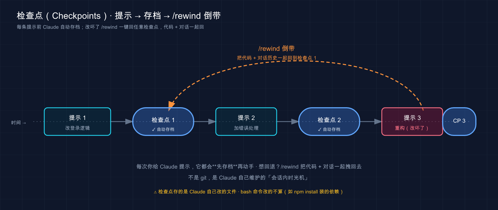

# 37 · 检查点（Checkpoints）：随时能倒带的安全网

> 📚 **系列导航**：上一篇 [36 斜杠 / 命令] 把 `/` 开头那一长串命令理顺了，`/rewind` 也在里头露过脸。这一篇专门把它拆开讲——**检查点（Checkpoint）是 Claude Code 自动给你存的「编辑前快照」，让你随时倒带回某个状态**。它怎么自动记、怎么回退、能回滚什么不能回滚什么、跟 git 到底怎么分工，一篇说透。

都说检查点是你的「后悔药」，有它兜底就能放开手脚让 Claude 大干一场——**说句实话，把它当 git 用，迟早翻车。**

设想一个刚上手 Claude Code 的人，听说有 `/rewind` 这玩意儿，整个人就松了，让 Claude 一口气改十几个文件，中间还跑了几条 `rm` 和 `mv` 清理目录。改到第三轮发现方向不对，淡定地 `/rewind` 想跳回去——**结果代码是回去了一部分，但那几个被 `rm` 删掉的文件，一个都没回来**。当场就懵了：「不是说能撤销吗？」

能撤销，但撤销的是 **Claude 用编辑工具改的那些文件**，不是它跑 bash 命令在你磁盘上留下的痕迹，更不是 git 那种永久历史。**检查点是个「会话级的本地撤销」，强在快、强在自动、强在连对话都能一起退**；但它有清清楚楚的边界，越界的事它管不了。

这一篇就干两件事：一是把检查点这套「自动存档 + 倒带」讲到你闭眼能操作；二是把它的**边界**钉死——哪些能回、哪些回不来、什么时候该靠它、什么时候必须上 git。**搞清楚边界，它才是真安全网，不然就是个会骗你的安全网。**

**看完这一篇，你会拿到：**

- 一句话讲明白检查点是什么、它什么时候**自动**帮你存（不用你手动操作）
- `/rewind` 和「空输入框双击 Esc」两种打开方式，以及回退菜单里那几个选项分别干嘛
- 一张「能回滚 vs 回不来」对照表——代码、对话能回，bash 副作用和外部状态回不来
- 检查点和 git 的明确分工：什么时候用哪个，为什么不能拿一个替另一个
- 一个能照着跑、给了预期输出的实战：亲手制造一次「改错」再倒带回去

---

## 01 检查点是什么：它在你每次发话前，偷偷拍了张快照

先给结论：**检查点是 Claude Code 自动给你的代码拍的「编辑前快照」——你每发一条提示，它就拍一张；事后想退回哪张，一句 `/rewind` 跳回去。**

第 07 篇你已经见过它一面，知道改错了能 `/rewind` 兜底。这一篇往深里走。先回想一下你跟 Claude 干活的节奏：你发一句指令 → 它「想 → 做 → 看」转一圈、改几个文件 → 你看结果再发下一句（这个循环第 03 篇讲过）。**检查点干的事，就是在每一句指令落地之前，先把当时的代码状态拍下来留底。**

**类比：录像机（DVR）的时间轴回放。** 你家那台能回放的机顶盒，节目是连续录下来的，但它在每个节目切换的地方都打了个「章节标记」。你想重看某一段，不用从头快进，直接拖到那个章节标记上一点就跳过去了。检查点就是这个味道：**你发的每一条提示，都是时间轴上的一个章节标记；`/rewind` 就是把整盘带子拖回某个标记重来。** 区别只在于——录像机回放是「看」，检查点回放是真把代码和对话**退回到那一刻**，让你能换个走法重录。

官方对它的定位是这样的：

> 当您与 Claude 合作时，checkpointing 会自动捕获每次编辑前代码的状态。这个安全网让您可以放心地执行雄心勃勃的大规模任务，因为您始终可以返回到之前的代码状态。

注意那个词——**自动**。这是检查点最爽的一点，也是它和 git 最大的体感差别：**你什么都不用做。** git 是你得记着 `git commit`，忘了提交就没存上；检查点是 Claude 在背后默默拍，你压根不用操心「我存了没」。

官方列了四类最典型的用场，我每条配一个你真实会遇到的画面：

- **探索替代方案**：A 实现做完不满意，退回起点重来 B 方案，**起点完好无损**，不用怕「试坏了回不去」。
- **从错误中恢复**：它改完某个文件，测试反而挂了，你又懒得手动一行行抠回去——退回上一个检查点，干净。
- **迭代功能**：让 Claude 把整个模块重写一遍练手，写完发现不如原来——跳回重写前，跟没发生过一样，**敢放手试**。
- **释放上下文空间**：调试聊了一长串，前面的设置说明想留、中间的试错想丢——这就用上「总结」了（第 03 节讲）。

体会一下这四类的共同点：**它们都是「我想大胆往前冲，又怕冲坏了回不来」**——检查点就是来消掉这份「怕」的。

> 💡 一句话总结：检查点是 Claude **每次编辑前自动拍的代码快照**，你每发一条提示就多一个「章节标记」，事后一句 `/rewind` 就能把代码和对话倒带回那一刻——**全程自动，不用你手动存**。

---

## 02 它到底什么时候存、存哪、留多久

检查点既然是「自动」的，那你得知道它**自动的规律**——什么时机拍、拍的东西放哪、能放多久。这三点官方写得很清楚，我一条条给你对。

### 触发时机：每条提示一个检查点

规律就一句话：**你每发一条提示（prompt），Claude Code 就创建一个新检查点。** 官方原话：

> 每个用户提示都会创建一个新的 checkpoint。

所以时间轴上的「章节标记」密度，是跟着你说话的节奏走的——你发十句指令，就有十个可以跳回去的点。这也解释了为什么后面回退菜单里列出来的，**正是你这次会话发过的每一条提示**：每条提示既是一次「动手的开始」，也是一个「可以退回去的存档点」。

把这个节奏画出来，你一眼就懂检查点是怎么沿着你的对话「一路落点」的：



这张图画的是：你每发一条提示，Claude 动手之前先落一个检查点（蓝色节点）；等改到提示 3 发现搞砸了，一句 `/rewind` 就能顺着那条虚线**跳回检查点 1**，把提示 2、3 的改动连同对话一起退掉——这正是它「随时能倒带」的本质。

### 存哪：藏在你的 `~/.claude` 里

快照不是凭空记在内存里的，它落到了磁盘上。官方文档（`claude-directory.md`）里点了名：

> `file-history/<session>/` —— Claude 更改的文件的编辑前快照，用于 checkpoint 恢复。

也就是说，每个会话的「编辑前快照」都存在 `~/.claude/file-history/<session>/` 这个目录下。你**不用去碰它**，但知道它在哪有两个好处：一是明白检查点是真有实体文件撑着、不是玄学；二是哪天你好奇 Claude Code 在你机器上占了多少地方，知道这块归它管。

### 跨会话：关了重开，存档还在

既然落了磁盘，就有个很实用的特性——**检查点跨会话不丢**。官方原话：

> Checkpoints 在会话之间持久存在，因此您可以在恢复的对话中访问它们。

什么意思？你今天干到一半 `Ctrl+D` 退出，明天用 `claude --resume`（或 `--continue`）把这个会话续上，**之前那一串检查点还在**，照样能 `/rewind` 倒带回昨天某个点。容易误以为 `/rewind` 只在当前这次开着的窗口里有效，关掉就清零——可实际上续一个三天前的会话，回退菜单里那些老提示**居然还能跳**，它是真存在盘上、跟着会话走的。所以「存档」这事，连「关机重开」这一关它都扛得住，只受那个 `cleanupPeriodDays` 期限管。

### 留多久：默认 30 天，可调

检查点不会永远留着，官方设了个自动清理：

> 在 30 天后自动清理（可配置）。

这个「可配置」具体是哪个开关？是 settings.json 里的 `cleanupPeriodDays`（第 31 篇专门讲过 settings.json 的用户级 / 项目级配置）。官方 `settings.md` 说它默认 **30** 天清理不活跃会话的记录、最少 1 天，设成 `0` 会被直接拒绝——这个值同时管着检查点快照的留存。**对小白的建议：别动它。** 默认值够用了，你真正需要长期保存的进度，本来就该交给 git（下面第 05 节细说），而不是指望检查点替你存半年。

哪天翻 `~/.claude` 想清理空间，注意到 `file-history` 这个目录，才反应过来：**原来每天那一堆 `/rewind` 的「后悔药」，都是这儿在默默兜着。** 平时根本感知不到它存在，这恰恰是「自动」的好处。

把这三点拢成一张表：

| 维度 | 规律 | 你要做的 |
|------|------|---------|
| **什么时候存** | 每发一条提示，自动建一个检查点 | 啥都不用做，正常说话就行 |
| **存在哪** | `~/.claude/file-history/<session>/` | 不用碰，知道它在哪即可 |
| **跨会话吗** | 跨会话持久，恢复对话后还能用 | 关了重开也找得回 |
| **留多久** | 默认随 `cleanupPeriodDays` 清理 | 别改；长期进度交给 git |

> 💡 一句话总结：检查点**每条提示存一个**，落在 `~/.claude/file-history/` 里、**跨会话不丢**、默认按 `cleanupPeriodDays` 清理；这套规律你只需知道、不用操作——它全自动。

---

## 03 怎么倒带：`/rewind`、双击 Esc，和那张回退菜单

知道了它在背后默默存，现在学怎么把它调出来用。**入口就两个，记死了：`/rewind` 命令，或者空输入框双击 Esc。**

### 两个入口

第一个，在会话里敲斜杠命令：

```text
/rewind
```

第二个，更快——**在输入框为空时，连按两下 `Esc`**：

```text
（输入框空着，连按 Esc Esc）
```

这两个都会弹出同一个**回退菜单（rewind menu）**。官方原话：

> 运行 `/rewind`，或在提示输入为空时按两次 `Esc`，打开回溯菜单。

这里有个**第 14 篇就埋过的坑**，必须再敲一遍黑板：

> 如果提示输入包含文本，双 `Esc` 会清除它而不是打开菜单。清除的文本会保存到您的输入历史记录中，因此在您完成回溯菜单后，按 `Up` 可以调用它。

翻译成人话：**输入框里有字的时候，双击 Esc 是「清空这段字」，不是打开菜单。** 想倒带，先确保输入框是空的。新手很容易在这儿栽跟头——打了半句话想反悔，狂按 Esc，字没了菜单也没出来，一脸懵。**记住：先清空，再 Esc Esc。** 拿不准就老老实实敲 `/rewind`，它不挑输入框空不空。

### 回退菜单里在选什么

菜单弹出来，**它列的是你这次会话发过的每一条提示**——也就是时间轴上那一串「章节标记」。你先选一个「想退回到的点」，再选「**怎么退**」。这第二步是关键，因为退法不止一种。

官方给的几个操作，我逐个翻译：

| 菜单选项 | 它干嘛 | 什么时候选 |
|---------|--------|-----------|
| **恢复代码和对话** | 代码和对话**一起**退回那个点 | 整轮都想推倒重来：当那几句话从没发生过 |
| **恢复对话** | 只退对话，**代码保持现状** | 改出来的代码想留，但聊歪了想重新组织对话 |
| **恢复代码** | 只退代码改动，**对话保留** | 代码改坏了要回滚，但前面的讨论还想接着用 |
| **从此处总结** | 把这条及之后的对话**压缩成摘要** | 砍掉一段跑偏的旁支讨论，保住前面的完整细节 |
| **到此处总结** | 把这条之前的对话**压缩成摘要** | 压掉冗长的前期铺垫，留住最近工作的完整细节 |
| **算了** | 啥也不动，返回列表 | 点错了 / 看看就走 |

中间那两个「只退一半」的选项，新手常犯嘀咕「为啥要分开退」。各举一个真实场景就通了：

- **只「恢复代码」**：你跟 Claude 来回聊了五轮终于定下方案，它照着改了，结果代码跑挂了。你想退掉这堆烂代码，**但那五轮讨论的来龙去脉不能丢**（重新解释一遍太累）——这时选「恢复代码」，代码回到改之前，对话原封不动，让它**带着原来的理解重写一遍**。
- **只「恢复对话」**：反过来，它改出来的代码你挺满意、想留着，可这轮对话被你问的几个无关问题带歪了，越聊越乱——选「恢复对话」，把对话退回到歪掉之前那个点，**代码留在现状**，你重新组织思路接着指挥。

看懂没——**「恢复代码 / 恢复对话」是给你拆开来精修的两个旋钮**，不是非得「代码和对话」一起退。这里面最常用的其实是「恢复代码」：方案没问题，就是 Claude 写歪了，退掉代码让它重写，比从头描述需求省事得多。

**而这里最容易混的，是「恢复」和「总结」根本是两回事。** 别被放在同一个菜单里就以为它们干类似的活：

- **恢复（restore）** = 真的**往回退状态**：把代码、对话、或两者都退回选中的点。这是「时光倒流」。
- **总结（summarize）** = **不动磁盘上的文件**，只是把对话的某一侧压缩成 AI 生成的摘要、腾出上下文空间。这是「整理桌面」，不是倒带。

官方把这层区别说得很直白：

> 恢复选项恢复状态：它们撤销代码更改、对话历史或两者。总结选项将对话的一部分压缩为 AI 生成的摘要，而不改变磁盘上的文件。

看出来了吗——**「总结」其实是第 19 篇那个 `/compact` 的精确版**。`/compact` 是把整个对话压一遍，而这里的「从此处 / 到此处总结」，是让你**挑一个点，只压它的一侧**：跑偏的旁支用「从此处总结」砍掉，冗长的开场用「到此处总结」压扁。官方自己也是这么对照的：

> 这类似于 `/compact`，但更有针对性：您不是总结整个对话，而是选择所选消息的哪一侧进行压缩。

还有个贴心细节：**选了「恢复对话」或「从此处总结」之后，被选中那条消息的原始提示会自动填回输入框**，你可以改一改重新发——相当于「退回到说这句话之前，给你个重说的机会」。（选「到此处总结」则不一样：它把你留在对话末尾、输入框空着。）

### 两个新手常卡的小问题

**「回退菜单弹出来是空的 / 没几个点可选」**——正常。菜单列的是**你这次会话发过的提示**，你才刚开张、只发了一两句，自然没几个点可退。检查点是「边干边攒」的，发得越多、可退的点越多。

**「我手滑选错了点，退过头了，能不能再退回来？」**——先别慌。检查点本身是**跨会话留在磁盘上**的（第 02 节说过），并不会因为你 `/rewind` 一次就消失；菜单里那些点通常还在，你可以**再开一次回退菜单，挑一个更靠后的点**调整。不过具体每个版本的菜单行为可能有差异，**最稳的还是那条老规矩**：动手干高风险的活之前，先 `git commit` 一笔——git 那条「永久历史」永远是你退无可退时的最后一道防线（下一节细说）。

> 💡 一句话总结：倒带入口就俩——`/rewind` 或**空输入框**双击 Esc；菜单里先选「退回哪个点」再选「怎么退」，**「恢复」是真退状态、「总结」只压上下文不动文件**，这俩千万别混；退过头别慌，**真兜底的是提前 `git commit`**。

---

## 04 边界在哪：能回滚什么，什么死活回不来

这一节是全篇的命门，开头那个栽进去的跟头就栽在这儿。**检查点不是万能撤销键，它只盯着一类东西——Claude 用「文件编辑工具」做的直接改动。** 越过这条线的，它一概管不了。

**类比还是那台录像机：它只录了「屏幕上的画面」，没录「你家客厅里真实发生的事」。** 你倒带回去，画面是回去了，但你刚才在客厅打翻的那杯咖啡、寄出去的那封信、删掉的那个文件——**现实世界里已经发生的事，倒带带不回来。** 检查点拍的是「代码文件的快照」，它管得了文件内容的来回；管不了 Claude 跑命令在你系统里掀起的真实动静。

具体哪些回得来、哪些回不来，官方在「限制」一节列得很清楚，我整理成一张对照表——**这张表你得记牢**：

| 类别 | 能不能回 | 为什么 |
|------|---------|--------|
| Claude 用编辑工具改的**文件内容** | ✅ 能回 | 这正是检查点跟踪的对象 |
| **对话历史** | ✅ 能回 | 回退菜单可单独 / 一起恢复对话 |
| Claude 跑 **bash 命令**改的文件（`rm` / `mv` / `cp`…） | ❌ 回不来 | bash 改动不被跟踪 |
| **当前会话没编辑过的文件** | ❌ 回不来 | 只跟踪本会话碰过的文件 |
| 你**在 Claude Code 外面**手动改的文件 | ❌ 回不来 | 外部更改不被捕获 |
| **其他并发会话**改的东西 | ❌ 回不来 | 同上，除非碰巧动了同一个文件 |
| 已经**发出去的副作用**（发请求、删数据库行、推送…） | ❌ 回不来 | 外部状态，检查点完全够不着 |

最该刻进脑子的是**头两条「回不来」**，官方专门拎出来强调。先看 bash 命令这条：

> Checkpointing 不跟踪由 bash 命令修改的文件。例如，如果 Claude Code 运行 `rm file.txt`、`mv old.txt new.txt`、`cp source.txt dest.txt`……这些文件修改无法通过回溯撤销。只有通过 Claude 的文件编辑工具进行的直接文件编辑才会被跟踪。

这就是开头那个坑——**Claude 是用 `rm` 删的文件，不是用编辑工具改的，所以 `/rewind` 救不回来。** 划重点：**「Claude 改文件」分两种**——用它的编辑工具改（受跟踪、能回退），和用 bash 命令改（不受跟踪、回不来）。这俩在你眼里都是「它动了我的文件」，但在检查点眼里天差地别。

怎么当场分清它走的是哪种？**看它在干活时打出来的工具调用名**（第 14 篇讲过 `Ctrl+O` 能展开详细转录）：

- 看到 `Edit`、`Write`、`MultiEdit` 这类**编辑工具**在动——受检查点跟踪，改坏了 `/rewind` 能救。
- 看到 `Bash` 在跑 `rm`、`mv`、`cp`、`>`（重定向覆盖）这类命令——**不受跟踪**，改坏了 `/rewind` 救不回。

这俩在转录里写得清清楚楚。**养成「让它干高风险活时瞄一眼工具名」的习惯**，你就能在它真动手前判断：这步要是搞砸，我还有没有 `/rewind` 这张后悔药。判断为「没有」的，就老老实实先 `git commit`。

再看「外部更改」这条：

> Checkpointing 仅跟踪在当前会话中编辑过的文件。您在 Claude Code 外部对文件所做的手动更改以及来自其他并发会话的编辑通常不会被捕获，除非它们碰巧修改了与当前会话相同的文件。

意思是：你自己拿别的编辑器改的、或者另开一个 Claude Code 会话改的，这个会话的检查点**不认**。

这里有条值得照办的土规矩：**凡是让 Claude 干「删文件、移目录、改数据库、发请求」这类带不可逆副作用的活，绝不指望 `/rewind` 兜底——该 `git commit` 的先提交，该备份的先备份。** 检查点只在「它用编辑工具改坏了代码」这种场景下，才是真靠得住的后悔药。

把「新手以为它能救」和「实际能不能救」摆一起，开头那个反共识就立住了：

| 出了岔子的事 | 新手以为 `/rewind` 能救 | 实际 | 真正的救法 |
|------------|:---:|:---:|------------|
| Claude 用编辑工具把代码改坏了 | ✅ | ✅ **能救** | `/rewind` |
| Claude 跑 `rm` 删错了文件 | ✅ | ❌ 救不回 | 提前 `git commit` / 备份 |
| Claude 跑了个写库的脚本、改了数据 | ✅ | ❌ 救不回 | 数据库备份 / 事务回滚 |
| Claude `git push` 推上去了 | ✅ | ❌ 救不回 | git 层面 revert（远端已变） |
| 你自己拿别的编辑器改花了文件 | ✅ | ❌ 不认 | 你自己的撤销 / git |

中间那几行的「❌」，全是开头那类坑的变体——**它们的共同点是「改动跑到了检查点的视野之外」**：要么走的是 bash 而非编辑工具，要么发生在 Claude Code 之外，要么干脆是把变化推到了外部系统。**只要一件事的后果落在了「磁盘上的代码文件」之外，检查点就够不着。** 记死这一句，比记那张限制表更省脑子。

> 💡 一句话总结：检查点只管**编辑工具改的文件 + 对话**，这俩能回；**bash 命令的副作用（`rm`/`mv`）、外部改动、已发出的请求一律回不来**——一句话判断：**后果落在「代码文件」之外的，它都够不着**，别拿 `/rewind` 当保险。

---

## 05 和 git 的分工：本地撤销 vs 永久历史，谁也替不了谁

讲到这儿，开头那句「别把检查点当 git 用」就能彻底讲透了。**很多人一上手就纠结「有了检查点，还要不要 git？」——答案是：要，而且它俩根本不抢饭碗。**

官方把这层关系一句话钉死，值得你裱起来：

> 将 checkpoints 视为「本地撤销」，将 Git 视为「永久历史」。

**类比：草稿本上的涂改 vs 交出去归档的正式文件。** 检查点像你在草稿本上写写画画——写错一笔随手擦掉重写，快、随意、只对你自己有意义，本子用完（30 天后）也就扔了。git 像你把定稿打印出来、签字、归进档案柜——**留痕、能给别人看、能追溯到任意一版、永久保存**。你不会因为草稿本能擦就不归档正式文件，也不会因为要归档就连打草稿都拿正式文件来回改。**两样都得有，各干各的。**

官方给的分工清单：

> - 继续使用版本控制（例如 Git）进行提交、分支和长期历史；
> - Checkpoints 补充但不替代适当的版本控制。

把它俩并排放，区别一目了然：

| 维度 | 检查点（Checkpoint） | Git |
|------|---------------------|-----|
| **谁来触发** | 自动（每条提示） | 手动（你 `git commit`） |
| **粒度** | 每条提示一个，很细 | 一次 commit 一个，你定 |
| **管不管 bash 副作用** | ❌ 不管 | ✅ 已提交的文件能恢复 |
| **保存多久** | 默认随 `cleanupPeriodDays` 清掉 | 永久（直到你删历史） |
| **能分享 / 协作吗** | ❌ 纯本地、只对你 | ✅ 推上去全队可见 |
| **最适合** | 「这步改坏了，跳回去」即时反悔 | 里程碑、永久历史、协作 |

注：git 同样管不了已发出的请求、数据库改动等外部副作用，只是能帮你恢复磁盘上**已提交的**文件。

**什么时候用哪个，我给你一套土办法：**

- **小步快跑、随时反悔** → 检查点。改一版不行 `/rewind`，再试一版，完全不用碰 git，丝滑。
- **干完一个像样的阶段、想长期存下来** → `git commit`。一个功能做通了、测试过了，提交一笔，这才是「永久存档」。
- **要让 bash 副作用也能回滚** → 只能靠 git。上一节说了检查点管不了 `rm`，但只要你**提交得勤**，git 能把整个工作区的状态找回来。

比较稳的节奏是这样：**让 Claude 干活的过程中，靠检查点随时倒带试错；每完成一个能跑通的小阶段，立刻 `git commit` 钉一个永久存档点。** 这俩配合起来，等于「细粒度的随手撤销」叠上「粗粒度的永久里程碑」，双保险。**真正会咬人的教训是：太信检查点，一个下午没 commit 过，结果会话崩了重开，虽然代码文件还在，但那一长串「章节标记」全断了——想退回三小时前某个中间态，退不了了。所以更该养成「跑通就提交」的肌肉记忆。**

关于 git 怎么跟 Claude Code 配合（让它帮你写 commit message、管分支），**第 43 篇「Git 工作流」**有专篇，这里你只要先记住一条：**检查点是本地撤销、git 是永久历史，前者补充后者、绝不替代。**

最后补一个进阶岔路，官方提了一句：如果你想**换个方法试试、又想原封不动保住当前会话**，别用「总结」（它会改你当前会话的上下文），而是用 fork：

```bash
claude --continue --fork-session
```

它会基于当前会话**叉出一条新分支**去试，原会话完好。这招你先知道有，真到「想并行试两种思路」时再翻第 34 篇的「继续 / 恢复会话」。

> 💡 一句话总结：检查点 = **自动的本地撤销**（细、快、纯本地、会过期），git = **手动的永久历史**（可追溯、可协作、不丢）；**小步试错靠检查点，里程碑和副作用回滚靠 git**，跑通一个阶段就 `commit`。

---

## 06 动手：亲手制造一次「改错」，再倒带回去

光看不练记不住。下面这套**最小流程**，带你亲手走一遍「Claude 改文件 → 你反悔 → `/rewind` 倒带回去」的完整闭环。不依赖任何复杂项目，随便找个空文件夹就能跑。打开终端跟着走。

**第一步：建个玩具文件夹，放一个一眼能看懂的文件**

```bash
mkdir ~/rewind-demo && cd ~/rewind-demo
git init
printf 'hello\n' > note.txt
git add note.txt && git commit -m "init: 初始 note"
```

**预期**：`note.txt` 里就一行 `hello`，并且 git 提交了一笔（待会儿好对比检查点和 git 的区别）。

**第二步：启动 Claude，让它改这个文件**

```bash
claude
```

进去后发第一条指令（这条提示会触发**第一个检查点**）：

```text
把 note.txt 的内容改成三行：apple、banana、cherry，用编辑工具改
```

**预期**：Claude 用编辑工具把 `note.txt` 改成三行水果（default 模式下它会先给 diff 等你批准，批准它）。**特意强调「用编辑工具」，是为了让这次改动落进检查点的跟踪范围**——这正是 `/rewind` 能救的那一类。

**第三步：再发一条，把它改得更「面目全非」**

```text
再把这三行全删掉，换成一行：这是我不想要的版本
```

**预期**：`note.txt` 现在只剩「这是我不想要的版本」。到这儿你已经发了两条提示，时间轴上有**两个章节标记**了。

**第四步：打开回退菜单，倒带**

确保输入框是空的，然后**连按两下 `Esc`**（或者直接敲 `/rewind`）：

```text
（输入框空着，Esc Esc）
```

**预期**：弹出回退菜单，列出你刚才发的那两条提示。**选中第一条提示（改成三行水果那次）之前的点，再选「恢复代码和对话」。**

**第五步：验证倒带成功**

回到终端（或用 `!` 在会话里跑），看一眼文件：

```text
! cat note.txt
```

**预期**：`note.txt` **变回了一行 `hello`**——你两次改动全被退掉了，代码和对话都回到了改之前。**看到 `hello` 回来 = 检查点倒带成功。** 这就是「本地撤销」的威力：你没敲一个 `git` 命令，纯靠检查点就把两轮改动干净退回去了。

**第六步（关键对照）：验证 bash 副作用回不来**

现在故意让它用 **bash 命令**删文件，体会第 04 节那条边界。在会话里发：

```text
用 bash 命令（rm）把 note.txt 删掉
```

它删完之后，再 `/rewind` 试图退回删除之前那个点，选「恢复代码」。然后看：

```text
! ls
```

**预期**：`note.txt` **没回来**，`ls` 里找不到它。这就印证了——**bash 命令（`rm`）改的东西，检查点跟踪不到、`/rewind` 救不回。** 想找回？这时候才轮到 git 上场：

```bash
git checkout note.txt
```

（这条会用 git 里那笔 `init` 提交把文件恢复出来。）**预期**：`note.txt` 带着 `hello` 回来了——**git 这个「永久历史」，补上了检查点够不着的那块。**

跑完这六步，你就把本篇最核心的两件事**亲手验证**过了：**检查点能丝滑倒带编辑工具的改动（第五步），但管不了 bash 副作用——那得靠 git（第六步）。** 这一正一反两个结果，比前面讲十遍边界都记得牢。

> 💡 一句话总结：这套实战让你亲眼看到——**编辑工具改的，`/rewind` 一键退回**；**bash `rm` 删的，检查点束手无策、得靠 `git checkout` 找回**。一正一反，边界就刻进去了。

---

## 07 小结

这一篇把 Claude Code 那张「自动安全网」彻底拆开了——**检查点是它每次编辑前自动拍的代码快照，让你随时倒带，但它有清清楚楚的边界，跟 git 是搭档不是替身。**

把核心要点串成一张表，揣兜里：

| 你想搞清的事 | 结论 | 关键点 |
|------------|------|--------|
| 检查点是什么 | 每条提示前自动拍的代码快照 | 全自动，不用你手动存 |
| 怎么倒带 | `/rewind` 或**空输入框**双击 Esc | 输入框有字时双 Esc 是清空、不开菜单 |
| 菜单里选什么 | 先选「退回哪个点」再选「怎么退」 | **「恢复」退状态 / 「总结」压上下文**，别混 |
| 能回滚什么 | 编辑工具改的文件 + 对话 | 这俩能回 |
| 什么回不来 | bash 副作用、外部改动、已发请求 | `rm`/`mv` 的改动一律救不回 |
| 和 git 啥关系 | 本地撤销 vs 永久历史 | 小步试错靠它、里程碑和副作用靠 git |

**你现在应该能：** 说清检查点是什么、它什么时候自动帮你存；用 `/rewind` 或双击 Esc 打开回退菜单，分得清「恢复」和「总结」的区别；心里有一条清晰的边界线——**编辑工具改的能回，bash 副作用和外部状态回不来**；并且知道它和 git 怎么分工、什么时候该提交。**把这条边界刻牢，检查点才是真正能托底的安全网，而不是一个会在关键时刻骗你的「假后悔药」。**

回到开头那句：检查点确实是后悔药，但它治的是「代码改坏了」，治不了「`rm` 删错了」——**前者放心 `/rewind`，后者老老实实 `git commit` 在前头兜着。** 分清这两味药，你就能比开头那位少摔一跤。

---

下一篇 **38「插件参考手册」**——你一路学下来的 Skill、Hook、Subagent、MCP，还有这一篇的种种命令，怎么打包成一个能装能卸、能分享给别人的「插件」？第 24 篇带你入了门，这一篇是把插件的**完整结构和清单字段**摊开当工具书查。想想看：如果你想把自己这套顺手的配置，做成一个朋友「装上即用」的包，它内部到底长什么样？

