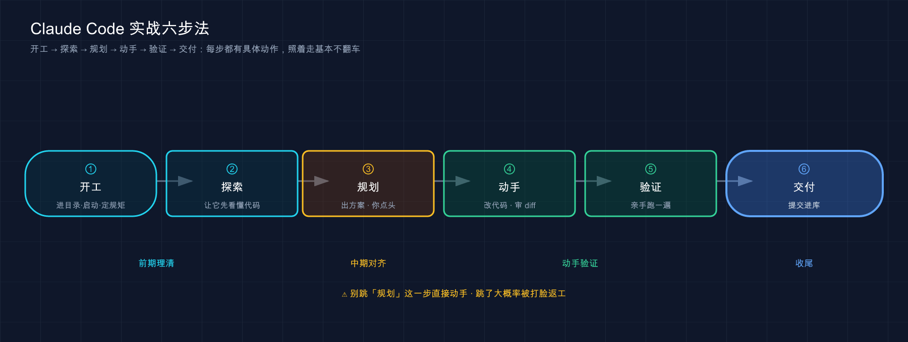

# 39 · 实战入门：拿一个真需求，从开工到交付走一整趟

> 📚 **系列导航**：上一篇 [38 插件参考手册](38-plugins-reference.md) 教你把自己那套配置打成一个能发出去的包。这一篇彻底换挡——**前面三十八篇全在「一件件拆功能」，这一篇第一次把它们串成一条完整的实战路径**：拿一个真实的小需求，从打开项目、写 CLAUDE.md、提问、审查改动到验证交付，一口气走完。学过的招，这回拧成一股绳用。

说句实话，大多数人以为 AI 写代码就是「一句话然后等结果」——说清楚需求，Claude 自己跑完，你接过来用。这条路听起来顺，踩一次坑就知道哪里断了：

> 方向跑偏了、顺手多改了三个文件、说好的 bug 修完照崩……最后花在收拾的时间，比自己动手还多。

**不是工具不够聪明，是这趟流程里少了几个关键交接棒。**

**说白了，这就是「学过每个动作」和「能把动作连成一趟」之间的鸿沟。** 你练过打方向、练过看后视镜、练过点刹车，但第一次独自上路，得把这些动作**按正确的顺序连起来**才叫会开车。这一篇不教任何新功能，只干一件事——**带你把已经会的零件，第一次连成一条能跑通的实战路径**。

我们挑的任务小到不能再小，但五脏俱全：**给一个数单词频率的小脚本加个功能，顺手修个 bug**。麻雀虽小，从开工到交付那条完整的路，一步都不缺。

**看完这一篇，你会拿到：**

- 一条「开工 → 探索 → 规划 → 动手 → 验证 → 交付」的标准实战路径，每一步该敲什么、看什么
- 一个能照着抄的真实小任务（数单词的脚本加 `--top N`、修空参数崩溃），全程命令 + 预期输出
- 「先让它探索、再让它动手」这条铁律为什么是新手最该养成的肌肉记忆
- 怎么用 plan mode（详见第 20 篇）让它**先出方案再砸代码**，以及怎么审查它给你的 diff
- 一张「老手怎么走 vs 新手怎么走」的对照表，把最常踩的顺序坑标出来

---

## 01 先看全景：一趟实战，就这六步

动手之前，先把整趟路在脑子里过一遍。**一个真实任务从接到手到交付，无论大小，骨架都是这六步：**



**类比：接力赛的交接棒。** 这六步就是六个交接棒的人：探索把「我看懂了什么」交给规划，规划把「打算怎么改」交给动手，动手把「改了什么」交给验证。**任何一棒掉了棒，整趟都得返工**——新手翻车，九成是某个交接没做，最典型的就是「没探索就直接让它动手」，棒还没拿稳就开跑。

这六步不是我编的，它就是官方快速开始（quickstart）和常见工作流（common workflows）两篇文档拼起来的实操顺序。官方那句话点得很到位：

> 在进行更改之前，让 Claude 理解您的代码。

**这六步还能压缩，但不能跳。** 熟手会把「探索 + 规划」合成一句话、把「验证 + 交付」连成一个动作，看起来像三步——但每一步都还在，只是节奏快了。新手最爱犯的不是「走得慢」，而是**直接把中间四步全删了**，只剩「说需求 → 拿结果」，等于把棒从第一个人手里直接扔到终点线，中间没人接。这一篇剩下的篇幅，就是带你把这六步**在一个真实任务上踏踏实实走一遍**，每一棒都亲手交一次。我会在每步开头标清「这一步对应前面哪一篇学过的东西」，让你边走边把零件对上号。

> 💡 一句话总结：一趟实战的骨架永远是「**开工 → 探索 → 规划 → 动手 → 验证 → 交付**」六步，像接力赛一样**棒棒得交到位**；新手最常掉的那一棒，是「没让它探索就直接动手」。

---

## 02 准备：造一个练手的小项目

为了让你能**原样照着跑**，我们不碰任何真实的大项目，先花两分钟造一个最小的练手场。它只有一个 Python 脚本加一个文本文件，**不依赖任何第三方库，有 `python3` 就能跑**（Mac / Linux 自带；Windows 装了 Python 即可）。

**第一步：建目录、进去、放两个文件**

在终端里执行（这一步是纯手动准备，还没动用 Claude Code）：

```bash
mkdir wordcount-demo && cd wordcount-demo
```

新建一个 `wordcount.py`，内容如下（这就是我们要改的「祖传代码」，故意写得糙一点）：

```python
import sys
from collections import Counter

def count_words(path):
    with open(path) as f:
        text = f.read()
    words = text.lower().split()
    return Counter(words)

def main():
    path = sys.argv[1]
    counts = count_words(path)
    for word, n in counts.items():
        print(f"{word}: {n}")

if __name__ == "__main__":
    main()
```

再建一个 `sample.txt` 当测试数据：

```text
the quick brown fox the lazy dog the fox
```

**第二步：手动跑一遍，确认它能用**

```bash
python3 wordcount.py sample.txt
```

**预期输出**（顺序可能略有不同，数字一定一样）：

```text
the: 3
quick: 1
brown: 1
fox: 2
lazy: 1
dog: 1
```

看到这些计数 = 脚本正常工作，练手场搭好了。**这个脚本有两个毛病，正好当我们的任务**：

- **缺个功能**：我想只看「最高频的前 N 个词」，现在它一股脑全打出来。
- **藏个 bug**：你试试不带文件名直接跑 `python3 wordcount.py`，它会甩你一脸 `IndexError` 崩溃，而不是好好提示你「该传个文件」。

**第三步：把它纳入 git（这一步很关键，别跳）**

```bash
git init && git add . && git commit -m "init: 一个简陋的数词脚本"
```

**预期**：末尾出现一行类似 `2 files changed` 的提交确认（`wordcount.py` 和 `sample.txt` 各记一笔）。看到它 = **你已经有了一个干净的「原点」**，后面无论 Claude 把代码改成什么样，你都能一键退回这里。

为什么开工前一定先 `git commit`？因为**它是你最硬的那张后悔药**。第 37 篇讲过检查点（checkpoint）能倒带 Claude 的编辑，但检查点和 git 是两套东西、各管一段（第 37 篇专门掰过）。**开工前一个干净的 git 提交，是你「无论后面怎么折腾都能一键回到原点」的地基**——没提交就让它大改、改完想反悔却没有干净基线可对比，是很常见的亏，所以雷打不动先提交再开工。

> 💡 一句话总结：练手场就一个糙脚本 + 一个文本文件，**有 `python3` 就能跑**；它故意留了「缺功能」和「藏 bug」两个活儿；**开工前先 `git commit` 一次，给自己留最硬的后悔药**。

---

## 03 开工：在项目目录里启动，先写一份最小的 CLAUDE.md

环境有了，正式开第一棒——**开工**。这一步对应第 02 篇（启动）、第 07 篇（第一次跑通）、第 12 / 18 篇（CLAUDE.md）。

**第一步：在项目根目录启动 Claude Code**

你得**在 `wordcount-demo` 这个目录里**敲 `claude`，而不是在别处。Claude Code 默认拿「你启动它的那个目录」当工作区——站错地方，它读的就是别的项目的文件。

```bash
claude
```

**预期**：看到 Claude Code 的欢迎屏，底部显示当前目录是 `wordcount-demo`。这就是第 07 篇带你跑通过的那个起点。

**第二步：先给它一份「最小可用」的 CLAUDE.md**

第 18 篇反复强调过一句话：**最没用的 CLAUDE.md 是写了三百行 Claude 一条没听的那种**。所以练手项目别贪多，三五行说清最要紧的规矩就够。我们这个小脚本，规矩其实就两条：用什么跑、改完怎么验。在会话里直接让它生成（也可以手写，但让它写更省事）：

```text
帮我在项目根目录建一个 CLAUDE.md，写清两条：
1. 这是个纯标准库的 Python 命令行小工具，不要引入任何第三方依赖
2. 每次改完代码，用 python3 wordcount.py sample.txt 跑一遍验证不报错
```

**预期**：Claude 会**先把要写的内容给你看，再请求批准写文件**（第 20 篇讲的权限机制——它动文件前一定先问你）。批准后，项目根目录多出一个 `CLAUDE.md`，内容大致长这样：

```markdown
# wordcount-demo

一个数文本里单词频率的命令行小工具。

## 技术约束
- 纯 Python 标准库，**不要引入任何第三方依赖**。

## 验证
- 每次改完代码，跑一遍确认不报错：`python3 wordcount.py sample.txt`
```

短，但两条最要紧的规矩都钉死了。**别嫌它简陋——三五行能管住的事，不必写三十行。**

> 这里你可能想到第 12 篇的 `/init`。区别在：`/init` 是让 Claude **自己扫一遍代码库、自动生成**一份较完整的说明书，适合有点规模的真实项目；咱们这个脚本就两个文件，**手动指明那两条核心规矩反而更准、更短**。两条路都对，看项目大小挑。

为什么开工就花这一步写 CLAUDE.md？**因为它是给后面所有交接棒定的「总规矩」**。等下你让它加功能，它会自动记得「别引第三方库」；改完它会自动记得「跑一遍验证」——**你只说一次，整场都生效**，不用每个指令都复读。这就是 CLAUDE.md 最实在的价值：把「每次都要嘱咐的话」固化成它每会话自动加载的背景。

> 💡 一句话总结：开工 = **站对目录敲 `claude`** + **写一份三五行的最小 CLAUDE.md** 把核心规矩定死；练手小项目手动指明两条规矩，比 `/init` 扫全库更准更短。

---

## 04 探索：先让它「看懂」，别急着让它「动手」

这是整趟路**最该养成肌肉记忆、也最容易被新手跳过**的一棒——探索。对应第 16 篇「四个最常用的活儿」里的第一类。

**先说结论：拿到任务的第一句话，不是「给我改」，而是「先看懂」。**

开头那个愣住的场景，犯的就是这个错——一上来就想敲「给脚本加个 `--top` 参数」。**坏在哪？** Claude 对你的代码一无所知，它会一边猜一边改，猜错了就给你改出一堆四不像。**正确的开法是先派它去摸清现状**：

```text
先别改任何代码。给我讲讲 @wordcount.py 现在是怎么工作的，
入口在哪、有没有什么明显的问题或者容易崩的地方？
```

注意两个细节：

- 开头那句 **「先别改任何代码」**，是给它划一道线——这一棒只许看、不许动。第 15 篇讲过，把边界说清，它就不会越界。
- 那个 **`@wordcount.py`**，是用 `@` 直接把文件内容塞进对话（第 16、17 篇提过的 `@` 引用），省得它再去翻一道。

**预期**：Claude 会读完文件，给你一段讲解——大致会说：这是个用 `Counter` 数词频的脚本，入口是 `main()`，它从 `sys.argv[1]` 取文件路径，**然后大概率会主动点出那个隐患：如果不传文件名，`sys.argv[1]` 会越界崩溃**。

看到没——**你还没提那个 bug，它探索的时候自己就发现了**。这就是「先探索」白赚的好处：它不光看懂了现状，还顺手帮你把问题摸出来了。这一棒交得漂亮，下一棒（规划）才有谱。

**这个脚本只有十几行，探索一句就够；但真实项目里，探索往往要「由宽到窄」问几层。** 官方常见工作流里给的探索套路就是这个节奏：先问全局，再钻局部——

```text
先给我这个代码库的整体结构和它是干嘛的（先别改任何代码）
```

```text
处理用户登录的逻辑在哪几个文件？它们怎么配合的？
```

第一句拿到「全局地图」，第二句顺着地图钻进你要改的那块。**为什么不一上来就问细节？** 因为它对项目越没概念，越容易把「看起来相关」的文件当成「真正相关」的——先给它一张全局地图，它后面定位才准。进一个没碰过的中等项目，雷打不动先来这么两三句，**宁可多花两分钟探索，也不让它带着错误的全局印象去改**。

**类比：第一次独自上路前，先绕车走一圈。** 老司机上车前会下意识扫一眼——轮胎瘪没瘪、后面有没有障碍、镜子角度对不对。这一圈花不了十秒，但能避开「直接挂挡撞上没看见的柱子」。让 Claude 先探索，就是上路前这一圈——**十秒钟的「看一眼」，省掉的是后面「改错了推倒重来」的半小时**。

> 探索阶段读文件会吃上下文（第 19 篇讲过工作台塞满会变蠢）。任务大、要翻一堆文件时，可以让它**派个 subagent 去探索**（第 23 篇）——子代理在自己的窗口里翻，只把结论递回来，你的主对话不被一堆文件内容灌满。小任务用不上，知道有这条路即可。

> 💡 一句话总结：拿到任务**第一句话永远是「先别改、先看懂」**；让它探索不仅省掉瞎猜乱改，还常常白赚一个「它主动帮你发现的问题」——这一棒，新手最该练成本能。

---

## 05 规划：让它先出方案，你点头了再砸代码

探索完，它懂了现状，也知道你要干嘛。**但还差一步——让它先把「打算怎么改」摆出来给你看，你认可了再动手**。这一棒对应第 20 篇里的 plan mode（计划模式）。

为什么不直接让它改？因为**「它理解的方案」未必是「你想要的方案」**。让它先讲一遍打算，是花一分钟堵住「方向就跑偏了还一路改到底」的最便宜的保险。

**方式一：直接让它先说方案、别动手**

最简单的，一句话约束它：

```text
我想给这个脚本加一个 --top N 参数，只显示最高频的前 N 个词；
顺手把不传文件名就崩溃的问题也修了。
先告诉我你打算怎么改、动哪几个地方，等我说「开始」你再动手。
```

**预期**：它会回你一份计划，类似——用 `argparse` 替掉手写的 `sys.argv`、加一个 `--top` 选项、用 `Counter.most_common(N)` 取前 N 个、不传文件名时由 `argparse` 自动报友好提示而不是崩溃。**它停在这儿等你拍板，不会擅自改文件。**

**方式二：正经用 plan mode**

如果是更大的任务，更稳妥的是切到官方的计划模式——它会**强制**Claude 不编辑源代码、只产出方案，**不批准就一行都不改**（但它仍可运行 shell 命令做探索）。两种进法（第 20 篇讲过）：

```bash
claude --permission-mode plan
```

或者在会话里按 **`Shift+Tab`** 循环切到 plan mode。官方对它的定位很清楚：

> Claude 读取文件并提出计划，但在您批准前不进行任何编辑。

这两种方式的区别，一张表看清：

| 做法 | 怎么约束它 | 强制程度 | 适合 |
|------|-----------|---------|------|
| **一句话叫它先说方案** | 靠你在提示里写「先别动手」 | 软约束（它一般会听，但没拦死） | 小改动、你盯着的时候 |
| **plan mode** | 模式层面**禁止编辑源代码**（shell 命令仍可跑） | 硬约束（批准前源代码一行都改不了） | 大改动、不放心、想认真审方案 |

一个实用的习惯：**像这个 `--top` 这么小的改动，方式一一句话就够**；但凡涉及多文件、或心里没底的改动，一律 `Shift+Tab` 切 plan mode——**让模式替你把住「没点头不许动」这道闸，比盯着省心**。给一个不熟的项目做较大改动时，要是图快没切 plan mode，它很可能一口气改了四个文件、方向还跟你想的不一样，回退花的时间够看三遍方案了。**所以拿不准就 plan。**

> 💡 一句话总结：动手前让它**先出方案、你点头再改**；小改动一句「先别动手」就行，大改动 / 没底的改动用 `Shift+Tab` 切 **plan mode** 硬性锁住「批准前一行不改」。

---

## 06 动手 + 审查：放它改，但每一处 diff 你都过一眼

方案点头了，第六棒（其实是动手和审查连着的一棒）——**让它改，同时你盯着每一处改动**。对应第 20 篇的权限确认。

**第一步：给它开绿灯**

```text
方案可以，开始改吧。
```

**预期**：Claude 开始编辑 `wordcount.py`。**关键来了——它每改一处，会把那段 diff（改动对照：删了哪几行、加了哪几行）摆到你面前请求批准**（除非你开了「全部接受」模式，新手强烈别开）。第 20 篇讲过这套权限机制，**这一步就是它真正落地的时刻**。

**第二步：认真看 diff，别无脑回车**

这是新手最容易松懈的地方——**diff 划过去看都不看就一路 `y`**。我的铁律是：**每一处改动至少扫一眼「它动的是不是我让它动的地方」**。这个任务里你该看到的改动大致是：

```text
- import sys
+ import argparse

- def main():
-     path = sys.argv[1]
-     counts = count_words(path)
-     for word, n in counts.items():
+ def main():
+     parser = argparse.ArgumentParser(...)
+     parser.add_argument("path", ...)
+     parser.add_argument("--top", type=int, default=None, ...)
+     args = parser.parse_args()
+     counts = count_words(args.path)
+     items = counts.most_common(args.top) if args.top else counts.most_common()
+     for word, n in items:
```

扫一眼确认三件事：**① 它确实在加 `--top` 和改入参（符合方案）；② 没顺手乱动 `count_words` 那个本来就好的函数；③ 没偷偷引入第三方库（CLAUDE.md 立的规矩）。** 对得上，就批准。

**怎么快速扫一段 diff？** 不用逐字读，盯三类信号就够：**红行（`-`，删了什么）别有你舍不得删的；绿行（`+`，加了什么）别有你没要的依赖或没让加的功能；改动的范围别超出你说的那几个地方**。这个任务里红行删的是手写 `sys.argv`、绿行加的是 `argparse` 和 `--top`，范围只在 `main()` 里——全在预期内，放心批。

**关于那个「全部接受」模式，给新手一句忠告：练手阶段别开。** quickstart 里提过你可以「为会话启用全部接受模式」（也就是第 20 篇的 acceptEdits），开了它就不再逐处问你、自己一路改下去。**省事，但代价是你彻底交出了「事中拦截」这道窗口。** 比较稳的做法是只在两种情况开：一是改动已经在 plan mode 里逐行看过方案、心里有数；二是一堆机械的重复改动（比如批量改个变量名）。**头一两个月，老老实实一处一处看，把「读 diff」的眼力练出来再谈放飞。**

**为什么审查这一步省不得？** 因为 **AI 改代码不是「对或错」的二极管，它常常「大体对、细节偏」**——可能多改了你没让改的地方，可能用了你不想要的写法。第 20 篇那句话值得再贴一遍：

> Claude Code 在修改文件前始终请求许可。

这道许可不是走过场，**它是你「事中拦截」的唯一窗口**——一旦批了、改下去了，就得靠第 37 篇的检查点或 git 去「事后倒带」，成本高一截。**事中扫一眼 diff，永远比事后回滚划算。**

> 💡 一句话总结：动手阶段**放它改、但每处 diff 都过一眼**——确认「动的是该动的、没乱碰好代码、没违反 CLAUDE.md」；这道批准是你**事中拦截**的唯一窗口，无脑回车等于把后悔药留给事后。

---

## 07 验证：跑给你看，别信「我改好了」

代码改完了，它八成会跟你说一句「已经改好了，加上了 `--top` 参数，也修复了崩溃问题」。**这句话你一个字都别信，直到你亲眼看它跑通。** 这是整趟路的倒数第二棒，也是新手最爱省的一棒。

**先说结论：「它说改好了」不算数，「跑一遍对了」才算数。** 这正是项目规范里那条「改完主动验证、不要只改不验」的硬要求，落到实操就是——**亲手把验收标准跑一遍**。

**第一步：验证新功能（`--top`）**

```bash
python3 wordcount.py sample.txt --top 3
```

**预期输出**（按词频从高到低，只出前 3 个）：

```text
the: 3
fox: 2
quick: 1
```

看到只剩前三、且是按频率排好序的 = **新功能成了**。（`the` 出现 3 次、`fox` 2 次，第三名是任意一个出现 1 次的词。）

**第二步：验证旧功能没被改坏（回归）**

加了新参数，**老用法不能崩**——不带 `--top` 时得跟原来一样全打出来：

```bash
python3 wordcount.py sample.txt
```

**预期**：跟第 02 节那份原始输出一致（六个词全在）。一致 = **没有「修好新的、碰坏旧的」**。

**第三步：验证 bug 真的修了**

这步最关键——重现当初那个崩溃，看它现在是不是好好提示而不是甩 traceback：

```bash
python3 wordcount.py
```

**预期**：**不再是那串 `IndexError` 崩溃，而是一行干净的用法提示**，类似：

```text
usage: wordcount.py [-h] [--top TOP] path
wordcount.py: error: the following arguments are required: path
```

从「程序崩了甩你一脸 traceback」变成「明确告诉你少传了 `path`」——**这就是 bug 修好的铁证**。三步全过，这趟活儿才算真的成了。

**想再稳一档？让它把验证「钉成一个测试」。** 上面三步是你手动跑、这次过了就完事；但同一个 bug，下次别人一改代码可能又崩回去。更稳的做法是让 Claude 顺手写个小测试，把「不传文件名要友好报错」这条变成**可重复跑的关卡**——官方常见工作流里专门有「修复 bug 时先写一个能重现它的测试，再让测试通过」这套（项目规范里那条「写重现 bug 的测试再让它通过」也是这个意思）：

```text
给「不传文件名时不崩溃、而是退出码非 0 并打印用法提示」写一个测试，再确认它通过。
```

**预期**：Claude 写一小段测试（用 `subprocess` 跑脚本、断言退出码和输出），然后跑给你看绿灯。**这一步把「我这次跑过了」升级成「以后每次都能自动验」**——对一次性练手是锦上添花，对真实项目几乎是必备。小任务你嫌重可以跳，但**心里得有这根弦**。

为什么对「亲手跑」这么轴？**因为被「我改好了」坑过的人不止一两个。** 让它修一个边界情况，它信誓旦旦说修好了，没跑就提交，结果那个边界根本没覆盖到——它改的是「看起来相关」的另一处。**所以认一个死理：AI 说的「完成」是假设，你跑出来的「通过」才是事实。** 这跟项目规范里那句「凡声称已验证，必须真的跑一遍」是一个意思。

> 💡 一句话总结：验证 = **亲手跑三遍**——新功能对不对、旧功能有没有被改坏、bug 是不是真修了；**「它说改好了」是假设，「你跑出来对了」才是事实**，这一棒省不得。

---

## 08 交付：让它写提交信息，把成果存进库

三步验证全过，最后一棒——**交付**，把这次成果稳稳存进 git。对应第 07 篇尾巴提过的「对话式 Git」。

**第一步：先看一眼到底改了什么**

```text
我改了哪些文件？给我一个改动概览。
```

**预期**：Claude 跑 `git status` / `git diff`，告诉你这次只动了 `wordcount.py`，新增了 `--top` 参数、把入参改成 `argparse`。**交付前再确认一次「改动范围跟预期一致」**，是临门一脚的复查。

**第二步：让它生成提交信息并提交**

```text
用一句话描述清楚这次改动，提交它。
```

**预期**：Claude 会**先把它拟的提交信息（commit message）给你看**——类似「feat: 给 wordcount 加 --top N 参数并用 argparse 修复缺参崩溃」——**再请求批准执行 `git commit`**。这又是第 20 篇那道权限闸：**它动你的 git 历史前，照样先问你**。

> 这里插一句重要的边界：**`git commit` 它会先把要提交的内容给你确认；但 `git push`（推到远程）是另一回事**。把成果推上 GitHub 之类的远程仓库前，务必你自己心里有数、亲自把关——这是第 43 篇「Git 工作流」要细讲的，这里你先记住：**本地提交可以放手让它代劳，推远程这一步自己捏在手里**。

**第三步：确认提交成功**

```text
显示我最后 1 次提交。
```

**预期**：它跑 `git log -1`，你能看到刚才那条提交信息和改动。看到它 = **这趟活儿正式交付，从开工到入库全程闭环**。

走到这儿，你回头看看：从一个崩溃、功能也不全的糙脚本，到一个带 `--top`、缺参数还会友好提示的小工具，**全程你只敲了六七句自然语言**——但每一句都卡在那六步的正确位置上。**这就是「把零件连成一趟」的样子。**

> 💡 一句话总结：交付 = **先看改动概览 → 让它拟提交信息并 `commit`（它会先给你确认）→ `git log` 验证入库**；记住边界——**本地 commit 可放手，push 远程自己把关**（留给第 43 篇）。

---

## 09 改岔了怎么办：干净地退回去，别在烂摊子上硬补

上面那趟走得顺，是因为这里故意挑了个小任务。**真实任务多半没这么乖**——验证那一步常常是红的：功能没实现对、或者它把别处改坏了。这时候新手的本能反应往往是错的：**对着已经改乱的代码，再让它「在这基础上修一下」**。

**别这么干。** 在一个已经偏了的状态上反复打补丁，越补越乱——它每次都带着上一版的错误上下文，很容易把窟窿越捅越大。**正确的处理是：先干净地退回到一个已知正确的点，再带着「这次该怎么说得更清楚」重开一次。** 这正好把第 37 篇的检查点和第 02 节那个开工前的 git 提交派上用场。

退回有两档，看你改到哪一步了：

| 退回档位 | 用什么 | 退到哪 | 适合 |
|---------|--------|--------|------|
| **轻档：撤销刚才的编辑** | 第 37 篇的检查点，`/rewind` | Claude 改这一批文件之前 | 改岔了一两处、刚发现就想撤 |
| **重档：回到开工原点** | git，`git restore .` / `git reset --hard` | 你开工前那个干净提交 | 整个方向都偏了、想从零重来 |

**轻档**最常用：在会话里敲 `/rewind`，它能把 Claude 这一轮的文件编辑倒带回去（第 37 篇专门讲过它的边界——能回文件、回对话，但别拿它当 git 使）。**重档**是兜底：要是改得面目全非、检查点也理不清了，就回到第 02 节那个开工提交——这就是当初为什么坚持「开工前先 commit」，**那一个干净提交，就是你永远能逃回去的原点**。

退回去之后别急着原样重说一遍。**先想想这次为什么偏了**——十有八九是探索没做够、或者指令给得太含糊（第 15 篇讲的「话说清」）。一条经验：**第一次让它改偏了，90% 是那句指令里漏了关键约束**，比如没说清「只改这个函数、别动别的」。退回原点、把那句话补具体，第二次往往就顺了。**退回不是失败，是止损**——比在烂摊子上硬补省太多事。

> 💡 一句话总结：改岔了**第一反应是「干净退回」，不是「在烂摊子上硬补」**；轻档用 `/rewind` 撤编辑、重档用 git 回开工原点（开工前那次 commit 就是干这个的）；退回后先补清指令再重开，别原样重说。

---

## 10 一组对照：老手怎么走 vs 新手怎么走

同样这六步，老手和新手走出来天差地别——**差的全在那几个「省掉的交接棒」上**。我把最常见的坑并排列出来，你对着自查：

| 环节 | ❌ 新手常踩 | ✅ 老手怎么走 |
|------|-----------|-------------|
| **开工** | 随便哪个目录就敲 `claude`，不写 CLAUDE.md | 站对项目目录，先写三五行最小 CLAUDE.md 定规矩 |
| **探索** | 上来就「给我改」，跳过看懂 | 第一句永远「先别改、先看懂」，让它先摸现状 |
| **规划** | 直接让它动手，方向偏了才发现 | 让它先出方案、点头再改；没底就 plan mode |
| **动手** | diff 看都不看一路 `y` | 每处 diff 扫一眼：动的对不对、有没有越界 |
| **验证** | 信「我改好了」就完事 | 亲手跑三遍：新功能、旧功能、bug 各验一遍 |
| **交付** | 改完晾着，或不看范围直接提交 | 先看改动概览、让它拟提交信息、`log` 确认入库 |

**这张表的精髓就一句：新手把六步压成两步（说需求 → 拿结果），老手老老实实走六步。** 刚上手那阵子谁都爱抄近道，吃过几次「方向跑偏 + 没验证就提交」的连环亏，才慢慢把这六步走顺。**最该先练成本能的是头尾两棒——开头的「先探索」和结尾的「亲手验证」**，这两棒守住，翻大车的概率就低一大半。

还有个常被问的：**「每次都这么六步，不嫌麻烦？」** 不嫌，因为**任务越小，每步越快**——咱这个练手任务，六步全走完也就十分钟。而且熟了以后，探索和规划常常能合并成一句话（「先看懂 @file 再告诉我你打算怎么改 X，别动手」）。**流程是骨架，不是镣铐**；骨架记牢了，怎么打快板是你的事。

> 💡 一句话总结：老手 vs 新手的差距全在「**省没省掉交接棒**」；最该练成本能的是头尾两棒——**开头「先探索」、结尾「亲手验证」**；任务越小每步越快，六步是骨架不是镣铐。

---

## 11 小结

这一篇没教任何新功能，只干了一件事——**带你把前面三十八篇学的零件，第一次在一个真实小任务上连成一趟完整的实战路径**。

先把整趟你敲过的话**连起来回放一遍**，你会发现就这六七句、每句卡在一个交接棒上：

```text
# 开工后（先定规矩）
帮我建个 CLAUDE.md：纯标准库别引第三方依赖；改完跑 python3 wordcount.py sample.txt 验证

# 探索（先看懂、别动手）
先别改任何代码。讲讲 @wordcount.py 怎么工作的、有没有容易崩的地方？

# 规划（出方案、等点头）
我想加 --top N 只看高频前 N 个词，顺手修不传文件名就崩溃的问题。先说方案，等我说开始再动手。

# 动手（点头放行，然后逐处审 diff）
方案可以，开始改吧。

# 验证（亲手跑，不信它说的）
（回终端跑：--top 3 / 不带 top / 不带文件名，三条各验一遍）

# 交付（看范围 → 提交 → 确认）
我改了哪些文件？ → 用一句话描述这次改动，提交它。 → 显示我最后 1 次提交。
```

**看清楚没——真正的「实战」就是这几句自然语言，难的从来不是话术，是把每句话放对位置。** 把这趟路的六步串起来回顾：

| 步骤 | 这一步干什么 | 用到的前篇 | 一句话关键点 |
|------|------------|-----------|------------|
| **开工** | 站对目录启动 + 写最小 CLAUDE.md | 02 / 07 / 12 / 18 | 核心规矩说一次，全场生效 |
| **探索** | 让它先看懂代码、别动手 | 16 | 第一句永远「先别改、先看懂」 |
| **规划** | 让它出方案、你点头 | 20（plan mode） | 没底就 `Shift+Tab` 硬锁「批准前不改」 |
| **动手** | 放它改、每处 diff 过一眼 | 20（权限确认） | 事中拦截比事后回滚划算 |
| **验证** | 亲手跑通，别信「我改好了」 | 16 / 37 | 跑出来的「通过」才是事实 |
| **交付** | 看范围 → 拟提交信息 → 入库 | 07 | 本地 commit 可放手，push 自己把关 |

**你现在应该能：** 拿到任何一个「帮我给某个东西加个功能 / 修个 bug」的真实小需求，不再对着终端发懵不知先敲哪句——心里默念那六步（开工、探索、规划、动手、验证、交付），一棒一棒交到位地走下来；尤其守住头尾两棒「先探索、后验证」，让 Claude 既不瞎猜乱改、改完也确实跑得通。**这套流程跑顺了，前面学的所有零件才算真正活了过来，能拧成一股绳替你干活。**

这一篇是个分水岭——**从这儿往后，咱们默认你「会把零件连成一趟」了**，后面几篇会在这条实战路径上继续加新本事。

---

下一篇 **40「Chrome：让它操作浏览器」**——这一趟实战，Claude 干的全是「本地文件 + 命令行」的活。但真实工作里，多少事得**在浏览器里**完成：填个表单、点几下页面、抓一段网页上的数据、对着真实渲染的界面调样式。下一篇就给它接上浏览器这只「手」，让它从「只会改代码」迈向「能替你点鼠标」。想想看——**当 Claude 不光能改你的代码、还能亲自打开浏览器替你操作时，它能帮你干的活，又要宽一大圈了。**
