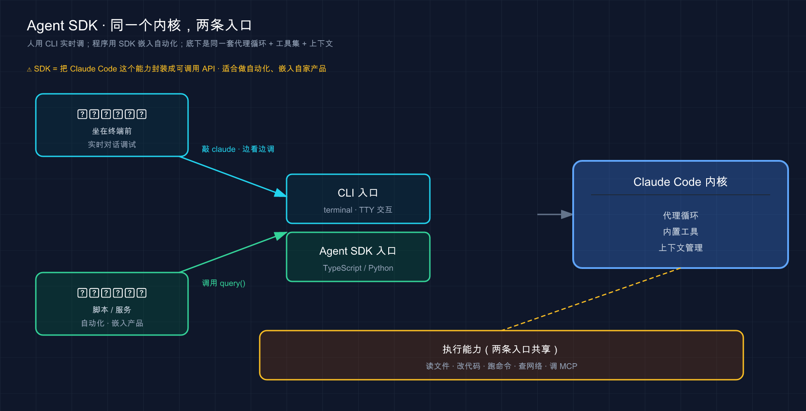

# 45 · Agent SDK：把 Claude Code 的能力搬进你自己的程序

> 📚 **系列导航**：上一篇 [44 GitHub Actions](44-github-actions.md) 教你把 Claude 接进 CI，让它在 PR 和流水线里自动干活。这一篇再进一步——**不止接进流水线，而是把 Claude Code 整套能力当成一个库，嵌进你自己写的程序和服务里**。Agent SDK，就是那条让你「用代码调起一个 Claude 代理」的官方通道。

兄弟们，今天聊个让你从「用工具的人」变成「造工具的人」的东西。

前面四十多篇，你一直是 Claude Code 的**用户**——在终端敲 `claude`，跟它对话，看它改代码。这是它的「正面」。但它还有个「背面」你大概率没碰过：**它的内核——那套读文件、跑命令、想了再做的代理循环——是可以被你的代码直接调起来的**。

这就是 Agent SDK（Agent 软件开发工具包，让你在 Python / TypeScript 里编程调用 Claude Code 内核的一套库）。说白了，**它把「Claude Code 是什么」从一个命令行工具，变成了你程序里的一个函数**。你写几行代码，就能在自己的应用里跑出一个会自主读代码、改文件、查网络的 AI 代理。

这东西的分量，在你想做个「自动审 PR 的小机器人」时最容易体会到。一开始老老实实调原始 API，结果光是「让模型读个文件」就得自己写一大堆代码——把文件内容塞进请求、接住模型说「我要读 X」、真去读、再把结果回传……来回折腾大半天。换成 Agent SDK，**那一坨脏活全没了，三行代码 Claude 自己就把文件读了、bug 也改了**。今天就把这条路给你铺平。

**看完这一篇，你会拿到：**

- 一句话讲清 Agent SDK 是什么、它把 Claude Code 的哪部分「拆出来给你用」
- 它和你天天敲的 CLI 到底差在哪——同一个内核，两个不同的「入口」
- 它和「原始 API」的本质区别（这条想不通，你会以为自己在重复造轮子）
- TypeScript 和 Python 两套怎么选、装哪个包、要什么前置条件
- 一个能照着敲、给了预期输出的最小代理：让它自己找出并修掉一个 bug
- 想清楚「这玩意儿到底适合谁、你该不该学」

---

## 01 先搞懂：Agent SDK 把 Claude Code 的什么「拆出来」了

先给结论：**Agent SDK 就是把 Claude Code 的内核做成一个库，让你能用代码（Python 或 TypeScript）调起一个和 CLI 同款的 Claude 代理。**

回想第 03 篇讲的「代理循环」——Claude 干活的本质是「想 → 做 → 看」转圈：想清楚下一步、调个工具去做（读文件、跑命令）、看结果再决定下一步。你在终端里用 `claude` 时，享受的就是这套循环加一堆内置工具（Read、Edit、Bash 这些，详见第 03 篇）。

**关键认知：这套循环和工具，不是 CLI 独有的，它是可以被你的代码直接调起来的。** 官方把这件事说得很直白：

> Agent SDK 为您提供了与 Claude Code 相同的工具、代理循环和上下文管理，可在 Python 和 TypeScript 中编程。

**类比：把咖啡馆的那台全自动咖啡机搬回自己家厨房。** 你天天去楼下咖啡馆点咖啡（这是用 CLI），喝得挺顺。但有一天你想在自己开的早餐店里也供应同款咖啡——你不可能让客人都跑去那家咖啡馆。于是你**把同一台机器搬进自己店里**：还是那个磨豆、萃取、打奶的内核，只不过现在嵌在你自己的流程里，你想什么时候出杯、出给谁、配上什么早餐套餐，全由你的代码说了算。Agent SDK 就是这台「搬得走的机器」——**同款内核，装进你自己的程序里跑**。

那它到底「拆出来」了什么？官方列得很清楚，CLI 里那些让 Claude 强大的东西，SDK 里**一个不少**：

- **内置工具**：Read、Write、Edit、Bash、Glob、Grep、WebSearch 这些开箱即用，**你不用自己实现工具怎么执行**
- **代理循环**：想→做→看那套编排，SDK 帮你转
- **上下文管理**：哪些文件读过、对话历史，它替你记着
- 再往上，Hook、子代理、MCP、权限控制、会话恢复——**CLI 有的扩展点，SDK 里都能编程调用**

落到真实场景，你什么时候会想起它？举三个常见的念头：

- **「我想做个 Slack 机器人，谁发个报错日志进来，它自己去代码库里定位、给个修复建议」**——这得把代理嵌进你的 Slack 服务
- **「我想跑个定时任务，每晚自动扫一遍代码库里的 TODO，整理成报告」**——这得用代码调起代理、还得能拿到它的输出
- **「我想给我的产品加个『AI 助手』功能，底层是 Claude 直接操作用户的项目文件」**——这更是非 SDK 不可

这三件事，**用 CLI 都别扭**——CLI 是给「人坐在终端前」设计的；而上面这些，是「程序自动调起、自动收结果」。这正是 SDK 的主场。

> 💡 一句话总结：Agent SDK 把 Claude Code 的**内核（工具 + 代理循环 + 上下文管理）做成了一个库**，让你用代码调起一个和 CLI 同款的 Claude 代理，**嵌进自己的程序和服务里**。

---

## 02 它和 CLI 到底差在哪：同一个内核，两个入口

这是最容易绕进去的一点，先把它彻底说清：**Agent SDK 和你天天敲的 CLI，底下是同一套东西，区别只在「入口」——一个给人手敲，一个给程序调用。**

官方那句话点得最准，我原封不动放这儿：

> 相同的功能，不同的界面。

**类比：同一台咖啡机，店里现点现做 vs 装进自动售卖机批量出杯。** 还是那台咖啡机（同一个内核）。摆在吧台后头，店员看着客人现点现做、随时能问「要不要加糖」——这是 **CLI**，适合人在场、边看边调。把同一台机器装进无人售卖机，投币、按钮、自动出杯、不用人盯——这是 **SDK**，适合「程序自动触发、批量跑、没人值守」。机器没变，**变的是谁来按下那个按钮**。

什么时候用哪个，官方给了张特别实在的对照表，我照搬过来：

| 用例 | 最佳选择 |
|------|---------|
| 交互式开发（你坐在终端边写边调） | **CLI** |
| 一次性任务（临时让它干件事） | **CLI** |
| CI/CD 管道（流水线里自动跑） | **SDK** |
| 自定义应用程序（嵌进你自己的产品） | **SDK** |
| 生产自动化（无人值守、长期跑） | **SDK** |

看这张表的窍门：**问自己一句「这事儿是我人坐在这儿盯着，还是程序自动跑」**。人盯着、要随时插话——CLI；程序自动起、自动收结果——SDK。

而且官方特意提了一句很关键的话，打消你「学了一个是不是另一个就白学」的顾虑：

> 许多团队同时使用两者：CLI 用于日常开发，SDK 用于生产。工作流在它们之间直接转换。

这话很实在。**很多人就是这么用的**：白天写代码，终端里 `claude` 随手使唤（CLI）；等某个流程被重复手敲到第五遍、烦了，就把它用 SDK 写成一个脚本挂起来自动跑。**两边的「提示词」「该给哪些工具」「权限怎么配」这套思路是完全通的**——你在 CLI 里攒的所有经验，搬到 SDK 里一行都不浪费。

所以别把它俩对立起来看。**这么说吧：CLI 是你「亲自上手」的入口，SDK 是你「派程序去跑」的入口，背后是同一个 Claude Code。** 一张图把这层关系画清楚：



这张图的意思：**上面是两个不同的「入口」——人手敲走 CLI，程序调用走 SDK；但两条路汇到同一个 Claude Code 内核，最后干的活也是同一套**。所以你才会看到「同内核、两入口」这个说法。

> 💡 一句话总结：CLI 和 SDK **同一个内核、两个入口**——人坐着边看边调用 CLI、程序自动起批量跑用 SDK；**两者常常一起用，你在 CLI 攒的经验搬到 SDK 完全通用**。

---

## 03 别搞混：Agent SDK 不是「原始 API」，差在「谁来跑工具循环」

这一节是全篇最值钱的一个区分。**搞不清它，你很可能以为自己在用 SDK，其实在重复造 Claude 早就给你造好的轮子。**

你可能听过「Anthropic 的 API」或者「Client SDK」（直连模型 API 的那套客户端库）。它和 Agent SDK 名字像、都能调 Claude，但**干的活根本不是一回事**。一句话区分：

**Client SDK 给你「会说话的模型」，工具循环你自己写；Agent SDK 给你「会干活的代理」，工具循环它替你跑。**

官方解释得很到位：

> Anthropic Client SDK 为您提供直接 API 访问：您发送提示并自己实现工具执行。Agent SDK 为您提供具有内置工具执行的 Claude。

**类比：买一堆生豆自己烘焙冲煮 vs 买一台全自动咖啡机。** Client SDK 像是商家只卖给你**生咖啡豆**——豆子是好豆子（模型很强），但想喝上一杯，**烘焙、磨粉、烧水、萃取、打奶，每一步都得你自己动手**。Agent SDK 是直接给你**一台全自动机**——你按一下「美式」，它内部该磨磨、该萃萃，**直接给你出一杯**。模型是同一批豆子，区别在「中间那一堆工序谁来做」。

落到代码上，差别一眼就能看出来。这是官方给的对比（Python），你感受一下两边的代码量：

```python
# Client SDK：工具循环得你自己写
response = client.messages.create(...)
while response.stop_reason == "tool_use":
    result = your_tool_executor(response.tool_use)   # 你自己去执行工具
    response = client.messages.create(tool_result=result, **params)  # 再把结果喂回去

# Agent SDK：Claude 自己把工具跑了
async for message in query(prompt="Fix the bug in auth.py"):
    print(message)
```

看出来了吗？**Client SDK 那个 `while` 循环——「模型说要用工具 → 你去执行 → 把结果传回去 → 模型接着想」——就是开头折腾大半天的那一坨。** 模型只会「说」它想读 `auth.py`，但**真去读这个动作，得你写代码完成**，读完还得手动把内容塞回去。这套「工具循环」你得从头实现。

Agent SDK 把这一整个 `while` 循环**收进了那个 `query()` 里**。你只管说「修掉 auth.py 的 bug」，**它自己决定读哪个文件、自己去读、自己改、自己验**，你坐着收消息流就行。

这就是开头那个教训的根儿。做 PR 审查机器人时，**很容易头两天就栽在这个 `while` 循环上**——接模型的 `tool_use`、自己实现「读文件」「跑 git diff」、再把结果回传，逻辑绕、还老有边界情况漏掉。一旦发现 Agent SDK 把这层全包了，那几百行胶水代码**当场就能删到只剩个 `query()` 调用**。所以这条得给你钉死：

| 对比维度 | Client SDK（原始 API） | Agent SDK |
|---------|----------------------|-----------|
| 给你的是 | 会说话的模型 | 会干活的代理 |
| 工具谁执行 | **你自己写代码执行** | **Claude 自动执行** |
| 那个 while 工具循环 | 你从头实现 | SDK 替你跑 |
| 内置工具（读写文件、跑命令） | 没有，全自己来 | 开箱即用 |
| 适合 | 要极致定制、不需要文件系统操作 | 要一个能直接动手干活的代理 |

**判断口诀：你要的是「一个能直接读你文件、跑你命令、动手改代码的代理」——选 Agent SDK，别去碰那个 `while` 循环。** 只有当你压根不需要它操作文件系统、就想要个纯对话且要极致控制每一步时，才考虑 Client SDK。

> 💡 一句话总结：Agent SDK ≠ 原始 API——**原始 API（Client SDK）给你模型、工具循环你自己写；Agent SDK 给你代理、工具循环它替你跑**。要「会动手干活的 Claude」，认准 Agent SDK，省下那一大坨胶水代码。

---

## 04 两套语言：TypeScript 和 Python，装哪个、要什么前置

Agent SDK 官方提供**两套**，按你顺手的语言挑：**TypeScript** 和 **Python**。功能上**两边对齐**，官方文档每个示例都同时给两种写法，所以别纠结「哪个功能更全」——挑你团队和项目本来就在用的那门语言就对了。

**怎么选，就一句话：你的程序用什么写，就用哪套 SDK。** 后端是 Node / 前端工程化栈——TypeScript；做数据、脚本、AI 工程——Python。没有对错，跟着你的项目走。

### 装哪个包、要什么前置条件

两套的安装命令和前置要求不一样，我对照列清楚（**全部照官方文档，没编造**）：

| | TypeScript | Python |
|---|-----------|--------|
| 安装命令 | `npm install @anthropic-ai/claude-agent-sdk` | `pip install claude-agent-sdk` |
| 前置环境 | **Node.js 18+** | **Python 3.10+** |
| 要单独装 Claude Code 吗 | **不用**（SDK 自带一个二进制） | 见下方说明 |

TypeScript 这边有个很省心的细节，官方专门标了出来：

> TypeScript SDK 为您的平台捆绑了一个本地 Claude Code 二进制文件作为可选依赖项，因此您无需单独安装 Claude Code。

也就是说，**TS SDK 装上就能跑，不用你先去装 Claude Code 本体**。

Python 这边有个版本坑，官方也点了——**包要求 Python 3.10 或更高**。如果 `pip` 报 `No matching distribution found for claude-agent-sdk`，八成是你的 Python 太老了。先查版本：

```bash
python3 --version        # macOS / Linux
py --version             # Windows
```

低于 3.10 就升级。在一台老 Mac 上装很容易栽在这儿——系统自带的 `python` 还是 3.9，报的就是那个 `No matching distribution`，升到 3.11 就能秒装上。

### 还得有 API 密钥

不管哪套，跑之前都得有个 Anthropic 的 API 密钥（API key，调用模型的身份凭证）。官方建议在项目目录建个 `.env` 文件放进去：

```bash
ANTHROPIC_API_KEY=your-api-key
```

> 密钥从 Claude 控制台（platform.claude.com ）拿；**它是凭证，千万别提交进 git**——记得加进 `.gitignore`。这套 API 配置的来龙去脉，第 04 篇讲透过，不熟的回去翻。

这里有个**计费上的重要提醒**，官方在文档开头用醒目框标了出来，我原话搬给你（涉及你的钱，不能含糊）：

> 从 2026 年 6 月 15 日开始，订阅计划上的 Agent SDK 和 `claude -p` 使用将从一项新的每月 Agent SDK 额度中扣除，该额度与您的交互式使用限额分开。

翻成人话：**你订阅套餐里那份「交互式额度」（你在终端聊天用的），和「Agent SDK 额度」从这天起是分开两本账**。所以别以为「我有订阅了，SDK 随便跑」——SDK 这边走的是单独的额度。具体规则以官方那篇说明为准。

> 💡 一句话总结：两套 SDK **功能对齐、按语言挑**——TS 用 `npm install @anthropic-ai/claude-agent-sdk`（Node 18+，自带二进制免装本体），Python 用 `pip install claude-agent-sdk`（**要 3.10+**）；都得配 `ANTHROPIC_API_KEY`，且注意 SDK 额度和交互式额度分开计费。

---

## 05 一段代码看懂它长啥样：query() 是入口

讲了半天，上代码你才有体感。**Agent SDK 的主入口就一个东西：`query()`。** 把它搞懂，整套 SDK 的门就推开了。

官方那个最小例子，我们逐行拆。先看 Python 版：

```python
import asyncio
from claude_agent_sdk import query, ClaudeAgentOptions


async def main():
    async for message in query(
        prompt="Find and fix the bug in auth.py",
        options=ClaudeAgentOptions(allowed_tools=["Read", "Edit", "Bash"]),
    ):
        print(message)  # Claude 读文件、找到 bug、改掉它


asyncio.run(main())
```

TypeScript 版是一模一样的逻辑：

```typescript
import { query } from "@anthropic-ai/claude-agent-sdk";

for await (const message of query({
  prompt: "Find and fix the bug in auth.ts",
  options: { allowedTools: ["Read", "Edit", "Bash"] }
})) {
  console.log(message); // Claude 读文件、找到 bug、改掉它
}
```

就这么点。拆开看三个关键部分（官方原话归纳）：

**① `query()`——代理循环的主入口。** 它返回一个「异步迭代器」（async iterator，可以一条条往外吐消息的对象），所以你用 `async for`（TS 里是 `for await`）来**流式接住 Claude 干活过程中冒出来的每一条消息**：它的思考、它调了哪个工具、工具返回了啥、最终结果。

**② `prompt`——你想让它干啥。** 跟你在 CLI 里敲的那句话没区别。这里是「找出并修掉 auth.py 里的 bug」。Claude 自己判断要用哪些工具。

**③ `options`——这个代理的配置。** 最常用的就是 `allowed_tools`（TS：`allowedTools`），**预先批准它能用哪些工具**。上面给了 `Read`、`Edit`、`Bash`，意思是「准你读文件、改文件、跑命令」。

注意那个 `async for` / `for await` 循环——**它会一直转，直到 Claude 把活干完或出错**。每转一圈吐一条消息，SDK 在背后默默处理工具执行、上下文管理、重试这些脏活，你只管消费这个消息流。官方原话：

> SDK 处理编排（工具执行、上下文管理、重试），所以你只需使用流。

**这就是它跟原始 API 最爽的地方**——你看这段代码里**根本没有那个 `while` 工具循环**，全被 `query()` 吞了。

再说一个**给工具就是给权限**的关键点（呼应第 20 篇的权限）。你在 `allowed_tools` 里给什么，直接决定这代理能干多少事。官方给了张特别清楚的对照：

| 你给的工具 | 这个代理能干啥 |
|-----------|--------------|
| `Read`、`Glob`、`Grep` | **只读分析**（能看不能改） |
| `Read`、`Edit`、`Glob` | **分析 + 改代码** |
| `Read`、`Edit`、`Bash`、`Glob`、`Grep` | **完全自动化**（能看、能改、能跑命令） |

**想做个「只许看不许动」的安全代理？只给它 `Read`、`Glob`、`Grep` 就行。** 这比 CLI 里临时把关更彻底——代理压根没拿到 `Edit`，它想改也改不了。

> 补一句给 Python 用户的：除了一次性的 `query()`，Python SDK 还有个 `ClaudeSDKClient`——它是对 `query()` 的封装，让多次调用自动共享同一个 session，不用手动传 `resume` 参数。适合聊天界面、REPL 这类多轮对话场景；一次性任务用 `query()` 就够，刚上手先把它吃透。

> 💡 一句话总结：Agent SDK 的入口是 `query()`——给它 `prompt`（干啥）和 `options`（配置，最关键是 `allowed_tools` 决定它能用哪些工具），它返回一个**消息流**让你 `async for` 接住；**那个原始 API 里的 `while` 工具循环，被 `query()` 整个吞掉了**。

---

## 06 动手：5 分钟跑一个「自己找 bug、自己修」的代理

光看不练假把式。这一节带你**亲手跑通官方那个最经典的入门代理**——故意写段有 bug 的代码，让代理自己找出来、自己修掉。**全程不依赖你已有的任何复杂项目**，照着敲就行。下面用 Python 演示（TS 流程一样，命令在每步标了）。

> 前置：Node.js 18+ **或** Python 3.10+，外加一个 Anthropic API 密钥。装 SDK、调用模型都要联网；国内访问如果不通，先开「魔法上网」再试。

**第一步：建个空目录，进去**

```bash
mkdir my-agent
cd my-agent
```

**第二步：装 SDK 并配密钥**

Python（用自带的 venv）：

```bash
python3 -m venv .venv
source .venv/bin/activate
pip install claude-agent-sdk
```

> TypeScript 就改成 `npm install @anthropic-ai/claude-agent-sdk`。

然后在 `my-agent` 目录里建个 `.env`，写进你的密钥：

```bash
ANTHROPIC_API_KEY=your-api-key
```

**预期**：`pip install` 末尾打印 `Successfully installed claude-agent-sdk-...`。**看到 `Successfully installed` = SDK 装好了。** 如果报 `No matching distribution found`，是 Python 版本低于 3.10，先升级（见第 04 节）。

**第三步：造一个有 bug 的文件**

在 `my-agent` 里新建 `utils.py`，原样粘进这段（这是官方的示例代码，里面**埋了两个会崩的 bug**）：

```python
def calculate_average(numbers):
    total = 0
    for num in numbers:
        total += num
    return total / len(numbers)


def get_user_name(user):
    return user["name"].upper()
```

两个 bug 是：`calculate_average([])` 传空列表会**除以零崩掉**；`get_user_name(None)` 会**报 TypeError**。

**第四步：写那个代理**

新建 `agent.py`，粘进这段（官方快速入门版，我加了中文注释）：

```python
import asyncio
from claude_agent_sdk import query, ClaudeAgentOptions, AssistantMessage, ResultMessage


async def main():
    # 代理循环：Claude 边干活边把消息流式吐出来
    async for message in query(
        prompt="Review utils.py for bugs that would cause crashes. Fix any issues you find.",
        options=ClaudeAgentOptions(
            allowed_tools=["Read", "Edit", "Glob"],  # 预先批准这几个工具
            permission_mode="acceptEdits",            # 自动批准文件编辑
        ),
    ):
        # 只打印人类看得懂的部分
        if isinstance(message, AssistantMessage):
            for block in message.content:
                if hasattr(block, "text"):
                    print(block.text)              # Claude 的思考
                elif hasattr(block, "name"):
                    print(f"Tool: {block.name}")   # 它正在调用的工具
        elif isinstance(message, ResultMessage):
            print(f"Done: {message.subtype}")      # 最终结果


asyncio.run(main())
```

这里多了个第 05 节没细讲的选项：`permission_mode="acceptEdits"`——**自动批准文件编辑**，这样代理改文件时不会停下来等你点头（适合这种你信任的脚本）。权限模式官方给了好几档，挑你眼熟的看：

| 模式 | 行为 | 用在哪 |
|------|------|--------|
| `acceptEdits` | 自动批准文件编辑和常见文件系统命令，其他操作仍问你 | 受信任的开发工作流（**本例用的就是它**） |
| `bypassPermissions` | 每个工具都不问、直接跑 | 沙箱 CI、完全受信任的环境 |
| `default` | 需要你提供回调来处理批准 | 要自定义批准流程 |
| `dontAsk` | 未预批准的工具直接拒绝，不提示 | 锁定的 CI、无头脚本 |
| `plan` | 只允许只读工具，Claude 只分析不改文件 | 先规划后再批准执行 |

**第五步：跑起来**

```bash
python agent.py
```

> TypeScript 是 `npx tsx agent.ts`。

**预期**：终端会**流式滚出**代理的工作过程——先是它的思考（比如说要先读 `utils.py`）、然后 `Tool: Read`、`Tool: Edit` 这类工具调用行，最后一行 `Done: success`。**看到 `Done: success` = 代理跑完了。**

**第六步：验收——看 `utils.py` 被改成啥样了**

重新打开 `utils.py`。**预期**：你会看到代理**自己加了防御性代码**——比如 `calculate_average` 里多了「空列表就返回 0（或抛个清楚的错）」的判断，`get_user_name` 里多了「`user` 为 None / 没有 name 字段时的处理」。

这就是 Agent SDK 的精髓，官方原话点破：

> 这就是 Agent SDK 的与众不同之处：Claude 直接执行工具，而不是要求你实现它们。

整个过程里，代理**自主地**：读了 `utils.py` 理解代码 → 分析出会崩的边界情况 → 编辑文件加上错误处理。**你一行业务逻辑没写，全是它干的。**

跑通这一趟，你就把「装 SDK → 配密钥 → 写 `query()` → 给工具和权限 → 收消息流 → 验结果」这条完整链路亲手走了一遍。**以后做任何 SDK 代理，骨架都是这套**——无非换个 `prompt`、调整 `allowed_tools`、按需配权限和 MCP。

> 顺带一提，官方还建议你换些 prompt 玩玩，体会同一套代码干不同的活：`"Add type hints to all functions in utils.py"`（加类型标注）、`"Write unit tests for utils.py, run them, and fix any failures"`（写测试、跑、修挂的——这个得在 `allowed_tools` 里加上 `Bash`）。

> 💡 一句话总结：跑通入门代理就六步——**建目录、装 SDK 配密钥、造个带 bug 的文件、写 `query()` 代理、`python agent.py` 跑、看文件被自动修好**；亲手走一遍，比记十个 API 参数都管用。

---

## 07 这玩意儿适合谁：你该不该现在就上手

最后掏心窝子说一句：**Agent SDK 不是每个人都得马上学的东西，但「想拿 Claude 干点自动化」的人迟早绕不开它。** 帮你对号入座，省得学错方向。

**先说什么时候你压根用不上它。** 如果你就是想在终端里让 Claude 帮你写代码、改 bug、跑命令——**老老实实用 CLI，别碰 SDK**。SDK 是「写程序去调 Claude」，你要是没有「写程序」这个需求，它对你就是多余的复杂度。有人刚学会 CLI 就急着上 SDK，结果在 `async` / 异步迭代器上卡半天，**正经活儿一件没干**——这就是典型的方向错了。

**那什么时候你该上？** 三类信号，中一条就值得学：

| 信号（你心里冒出的念头） | 该不该上 SDK |
|------------------------|-------------|
| 「我就想终端里让它帮我写代码」 | ❌ 用 CLI 就够，别碰 SDK |
| 「同一个流程我已经手敲第 N 遍了，想自动化」 | ✅ 该上，写成 SDK 脚本挂起来 |
| 「我想给自己的产品/服务加个能动手干活的 AI 功能」 | ✅ 必须上，这是 SDK 主场 |
| 「我想做个机器人 / 定时任务，自动跑代理」 | ✅ 该上，CLI 干这个很别扭 |

官方还给了一条很实在的「成长路径」建议，适合你心里有个谱：

> 一个常见的路径是先使用 Agent SDK 在本地进行原型设计，然后为生产环境迁移到 Managed Agents。

这里冒出个新名词 **Managed Agents（托管代理）**——简单说，它是 Anthropic **替你托管运行**代理和沙箱的一套 REST API，你的程序发事件、收结果，**不用自己操心跑在哪、会话怎么存**。而 Agent SDK 是**在你自己的进程里跑**代理循环。两者的取舍，官方一张表说清（我精简了关键几行）：

| | Agent SDK | Managed Agents |
|---|-----------|----------------|
| 跑在哪 | **你自己的进程、你的基础设施** | Anthropic 托管的基础设施 |
| 界面 | Python / TypeScript 库 | REST API |
| 代理操作的文件 | **你机器上的真实文件** | 每个会话一个托管沙箱 |
| 最适合 | **本地原型、直接操作你文件系统的代理** | 生产级、不想自己运维沙箱和会话 |

**对小白和大多数人来说，路径很清晰：先用 Agent SDK 在本地把想法跑通**（就像第 06 节那样），**等真要上线、要扛流量、不想自己运维了，再考虑迁到 Managed Agents**。前者是你学习和原型的起点，后者是生产化的进阶——**现在，把 Agent SDK 这一步走扎实就够了。**

最后说一句。把好几个重复的手工流程改成 SDK 脚本——比如每周扫一遍几个仓库的过期依赖、自动整理成一份清单。**头一回把它挂上定时任务、第二天早上看到报告自己生成好躺在那儿的时候，那种「造了个会自己干活的东西」的感觉，是用 CLI 给不了的。** 如果你也有那种「同一件事手敲烦了」的时刻——那就是 SDK 在向你招手了。

> 💡 一句话总结：**只想终端里使唤 Claude → 用 CLI 别碰 SDK；想自动化某个重复流程、或给产品加个会干活的 AI → 上 SDK**；路径是「先用 Agent SDK 本地跑通，要生产化再迁 Managed Agents」，现在把第一步走扎实就行。

---

## 08 小结

这一篇我们掀开了 Claude Code 的「背面」——**它的内核可以被你的代码当成一个库调起来，这就是 Agent SDK**。

把核心要点串起来回顾：

| 你想搞清的事 | 答案 | 一句话关键点 |
|------------|------|-------------|
| Agent SDK 是什么 | Claude Code 内核做成的库 | 同款工具+代理循环+上下文管理，可编程调用 |
| 和 CLI 啥关系 | 同一个内核，两个入口 | 人手敲用 CLI、程序调用 SDK，经验通用 |
| 和原始 API 啥区别 | 工具循环谁来跑 | 原始 API 你自己写 `while`，SDK 替你跑 |
| 两套语言怎么选 | 按你的项目语言挑 | TS（Node 18+）/ Python（3.10+），功能对齐 |
| 入口是啥 | `query()` | 给 prompt + options，收消息流 |
| 该不该学 | 看你有没有「自动化/嵌产品」需求 | 只用 CLI 别碰，想自动化就上 |

**你现在应该能：** 一句话讲清 Agent SDK 把 Claude Code 的什么拆出来给你用、说明白它和 CLI 是「同内核两入口」、分清它和原始 API 差在「谁跑工具循环」、知道 TS 和 Python 两套怎么选和装、看懂 `query()` 那段最小代码在干嘛，并且亲手跑通了一个「自己找 bug 自己修」的代理。**更重要的是，你想清楚了自己该不该现在就上手——这比急着写代码重要得多。**

到这儿，你对 Claude Code 的认知已经从「一个命令行工具」升级成了「一套既能亲自用、又能编程嵌入的代理能力」。**它不再只是你手里的工具，而是你能拿去造东西的零件。**

---

下一篇 **46「开发配置」**——你刚学会用 SDK 写代理，但真要动手开发，光会 `query()` 还不够：**API 密钥怎么管才安全、不同环境（开发 / 生产）的配置怎么分、用第三方模型供应商时环境变量怎么设**……这些「开发前要先安顿好的事」，下一篇集中给你理清。想想看：同一份代理代码，**在你本地能跑、推到服务器上却连不上模型**，十有八九就栽在配置上——下一篇帮你提前避开这些坑。
