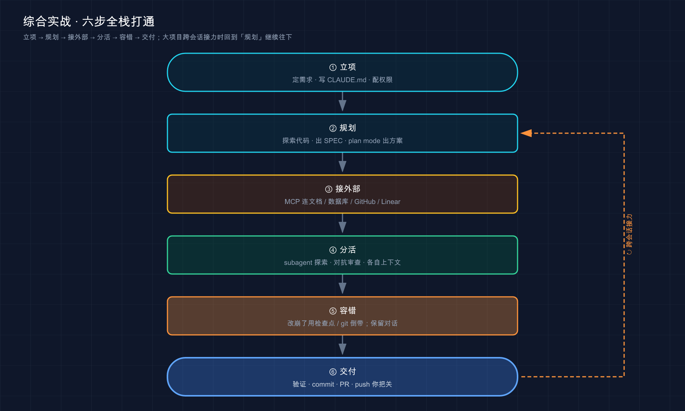

# 48 · 综合实战：从零到上线，把所学串成一条线

> 📚 **系列导航**：上一篇 [47 Voice 语音模式] 让你把「打字下指令」换成「张嘴说需求」，解放了双手。这一篇是整套教程的**毕业设计**——不教任何新功能，而是拿一个**比第 39 篇大一圈、要跨好几个会话**的真实项目，把 CLAUDE.md、权限、MCP、subagent、检查点、git 这些零件**一次性全调动起来**，走一趟从开工到交付的完整工程流。

把用 Claude Code 攒下来的项目翻一遍做个粗略统计就会发现：**真正让人觉得「这玩意儿值回票价」的，没有一个是「一句话改一行」的小活儿，全是那种横跨三五个会话、动用了四五种功能的中等项目。**

具体点说——用它从零搭一个内部用的小工具，前后开了 4 个会话、用掉大概两个半小时，中间接了一个 MCP server 去查文档、派了一个 subagent 做安全审查、还靠检查点救回过一次改崩的代码。**最后回头看那条 git 提交记录，干干净净 7 个 commit，每个都说得清干了啥。** 那一刻你才会真切感到：前面学的零件，不是一个个孤立的招式，是能**拧成一股绳**的。

说白了，这正是「学过每个功能」和「能用它们干成一件正经事」之间最后那道坎。第 39 篇带你走过一趟最小实战——单会话、单脚本、纯本地。**这一篇要把摊子铺大**：项目更复杂、要跨会话接力、要连外部、要派分身、还要在改崩时优雅地退回去。**前 47 篇是把乐器一件件教给你，这一篇是让你当一回指挥，把整个乐队合成一支完整的曲子。**

**类比：指挥一支乐队完整演奏一支曲子。** 你练过小提琴、练过铜管、练过打击乐——每件乐器单独都摸熟了。但「会演奏每件乐器」和「能让它们合奏出一支曲子」是两码事：你得知道哪个声部什么时候进、谁主谁辅、节奏怎么对上。这一篇里，**你就是那个指挥**——CLAUDE.md、权限、MCP、subagent、检查点、git 是你的各个声部，我带你把它们按正确的时机一个个引进来，合成一趟完整的演出。

**看完这一篇，你会拿到：**

- 一张「中等项目从零到交付」的完整地图，看清每个学过的功能**在哪一步登场、解决哪一棒的事**
- 一套跨会话接力的打法：怎么用 `--resume`、SPEC 文档、检查点把一个大活儿**安全地分到几天 / 几个会话里干**
- 每个关键环节「该敲什么、看什么、卡在哪」，含命令与预期输出
- 一个能照着抄的真实小项目（一个带本地存储、测试、文档的命令行任务清单工具），全程串起 CLAUDE.md → 权限 → MCP → subagent → 检查点 → git
- 一张「玩具练习 vs 真实项目」的对照表，把「摊子一大就翻车」的坑标出来

---

## 01 先看全景：一个中等项目，功能在哪一步登场

动手之前，先把整支曲子的「总谱」摊开看一眼。**一个中等项目从零到交付，骨架还是那几步，但每一步都比第 39 篇重，而且会拉进新的声部。**



这张图把一趟中等实战画成一条**带回路**的流水线：六个环节依次接棒，而那条虚线是关键——**真实项目一个会话干不完，验证完一轮会回到「规划」开下一个会话**，把功能一块块啃下来。第 39 篇那条单向直线，这里弯成了一个能转好几圈的环。

跟第 39 篇最大的不同，就两点，先记死：

- **它要跨会话。** 一个会话上下文塞满了就该收尾（第 19 篇讲过工作台塞满会变蠢），换个干净会话接着干。所以「怎么把活儿安全地交接到下一个会话」本身就是一门功夫。
- **它要调动新声部。** 单脚本用不上 MCP、subagent，但中等项目里它们是常态——查外部文档、隔离掉脏活、找个新鲜模型挑刺。

官方最佳实践那句话，正好是这一篇的总纲：

> 一旦你对一个 Claude 有效，通过并行会话、非交互模式和扇出模式来增加你的输出。

说白了就是：**摸清一套有效的打法之后，就靠并行跑多个会话、用非交互批量执行、用扇出派分身同时推进，把产出放大**——而不是每次都从零试。这一篇就是在实战中把这几招一件件用起来。

下面每一节，我都会在开头标清「这一棒对应前面哪一篇学过的东西」，让你边走边把零件对上号。**地图记牢了，剩下的就是看每个声部什么时候进场。**

> 💡 一句话总结：中等项目的骨架仍是「立项 → 规划 → 接外部 → 分活 → 容错 → 交付」，但比小任务多了两样——**要跨会话接力、要调动 MCP / subagent 这些新声部**；那条回到「规划」的虚线，是真实项目的常态。

---

## 02 立项：定项目、写 CLAUDE.md、把权限基线配好

第一棒——**立项**。对应第 12 / 18 篇（CLAUDE.md）、第 20 篇（权限）。这一棒在小任务里只是「写三五行 CLAUDE.md」，到了中等项目，**得把「项目规矩」和「权限基线」一起立起来**，因为后面好几个会话都要吃这套地基。

我们这一篇要做的项目：**一个命令行的任务清单工具（todo-cli）**——能加任务、列任务、标记完成，数据存在本地一个 JSON 文件里，再配上测试和一份 README。它比第 39 篇那个单文件脚本大：**多个文件、有持久化、有测试、要跨会话分步做**，但依然只用 Python 标准库，谁都能跑。

**第一步：建项目骨架、纳入 git**

```bash
mkdir todo-cli && cd todo-cli && git init
```

为什么开工第一件事就是 `git init`？因为**它是你整趟项目最硬的那张后悔药**。检查点（第 37 篇）能倒带 Claude 的编辑，但它和 git 是两套东西、各管一段。**一个干净的初始提交，是你无论后面怎么折腾都能逃回去的原点**——这条第 39 篇讲过，项目越大越要守。

**第二步：在项目根启动，写一份够用的 CLAUDE.md**

```bash
claude
```

进去后让它生成 CLAUDE.md（中等项目更推荐先手动指明几条核心规矩，比 `/init` 扫全库更准，因为这会儿还没什么代码可扫）：

```text
帮我在项目根目录建一个 CLAUDE.md，写清这几条：
1. 这是个纯 Python 标准库的命令行工具，不要引入任何第三方依赖
2. 数据持久化到项目根的 todos.json，所有读写都走这一个文件
3. 每加一个功能都要配 unittest 测试，改完跑 python3 -m unittest 验证
4. 提交信息用中文，前缀用 feat: / fix: / docs:
```

**预期**：Claude 先把内容给你看、再请求批准写文件（第 20 篇的权限机制）。批准后多出一个 `CLAUDE.md`，把这四条规矩钉死。注意——**它现在只有十来行**。官方那句红线值得再贴一遍：

> 保持简洁。对于每一行，问自己：「删除这个会导致 Claude 犯错吗？」如果不会，删除它。

这四条全是 Claude 猜不出来、又会反复用到的规矩，所以留着。后面三四个会话，它每次开工都自动加载这份说明，**你不用每个会话都复读「别引第三方库、改完跑测试」**。

**第三步：把权限基线配好——这是中等项目比小任务多出来的关键一步**

小任务你可以一处一处批准。但中等项目要跑好几个会话、改十几个文件，官方在最佳实践里直接点破了这个问题：**「在第十次批准后，你不是真的在审查，你只是点击通过。」** 所以开工就该把权限基线定好。三条路，看场景挑：

| 做法 | 怎么用 | 适合的场景 |
|------|--------|-----------|
| **权限允许列表** | `/permissions` 把你确定安全的命令加进去（如 `python3 -m unittest`、`git status`） | 项目里反复跑的安全命令，免得每次都问 |
| **plan mode（计划模式）** | `Shift+Tab` 切，或 `claude --permission-mode plan` 启动 | 不熟的改动、要先审方案再动手时 |
| **auto mode（自动模式）** | `claude --permission-mode auto`，分类器只拦危险操作 | 信任任务大方向、不想点过每一步时 |

做这个 todo-cli 时一套实用的配法：**`python3 -m unittest`、`git diff`、`git status` 这几条反复跑的，第一时间用 `/permissions` 加进允许列表**；涉及多文件的功能改动一律先 `Shift+Tab` 切 plan mode 审方案。**这套基线立好，后面几个会话的批准噪音直接少一大半**——头一回做中等项目时要是没配，光「要不要跑测试」这一个问题就能批二十多次，烦到差点关掉确认（那才是真危险）。

> ⚠️ 权限放松是把双刃剑——auto mode 和「全部接受」省心，但你交出的是「事中拦截」那道窗口。第 20、21 篇专门讲过这个权衡：**越是放手，越要靠后面的验证和检查点兜底**。

> 💡 一句话总结：中等项目的立项 = **git init 留原点 + 写一份十来行的 CLAUDE.md 定规矩 + 用 `/permissions`、plan mode、auto mode 配好权限基线**；权限基线这一步，是项目变大后比小任务多出来、最该花两分钟做的事。

---

## 03 规划：先探索出一份 SPEC，再跨会话分步实现

地基打好，第二棒——**规划**。对应第 16 篇（探索）、第 20 篇（plan mode）、第 19 篇（上下文管理）。中等项目和小任务在这一棒分野最大：**小任务一句话说清就能动手，中等项目得先沉淀出一份「规格说明（SPEC）」，再照着它分会话啃。**

**为什么中等项目一定要先出 SPEC？** 因为功能一多，你脑子里那点模糊想法根本撑不住一趟实现——做到一半发现边界没想清、字段对不上，回头返工。官方最佳实践给了个特别好用的招：**让 Claude 反过来采访你**。

**第一步：让它采访你，逼出一份 SPEC**

进 plan mode（`Shift+Tab`），把这段话甩给它：

```text
我想做一个命令行任务清单工具 todo-cli，数据存本地 JSON。
用 AskUserQuestion 工具详细采访我：技术实现、命令行接口怎么设计、
边界情况（比如空清单、重复任务、文件损坏）、有哪些权衡。
别问显而易见的，挖那些我可能没想到的硬骨头。
问完把完整规格写进 SPEC.md。
```

**预期**：Claude 会一条条问你——「任务要不要带优先级？」「`todos.json` 不存在时是报错还是自动建？」「标记完成是删掉还是留着打勾？」**这些全是你自己拍脑袋时漏掉的**。问够了，它写出一份 `SPEC.md`，把命令、字段、边界、验收标准全列清。官方点破了 SPEC 的价值：

> 最有用的规范是自包含的：它们命名涉及的文件和接口，说明什么在范围之外，并以端到端验证步骤结束。

做这个工具时，它常会问到一个你压根没想的点：**「两条任务文字一模一样，算不算重复、要不要去重？」** 被这么一问才意识到这是个真要拍板的设计决策。**花十分钟被它采访，省掉的是后面「做到一半推翻重来」的两小时**——这笔账太划算了。

**第二步：把大活儿切成「一个会话一块」**

SPEC 出来了，**别想着一个会话从头干到尾**。中等项目的功能一多，单会话上下文很快就塞满，塞满了 Claude 就开始「忘事、犯错」（第 19 篇讲透了）。正确的打法是**照 SPEC 切块，一个会话啃一块**：

```text
会话 1：搭骨架——文件结构、todos.json 读写、add 命令 + 测试
会话 2：list 和 done 命令 + 测试
会话 3：边界处理（文件损坏、空清单）+ 补全测试
会话 4：写 README、整体过一遍、交付
```

**第三步：会话之间怎么安全接力**

这是中等项目独有的功夫。一个会话干完一块，怎么把活儿交给下一个会话？两个抓手：

- **`/clear` 收尾，`--resume` 接力。** 干完一块、要换不相关的下一块时，`/clear` 重置上下文（官方反复强调「不相关任务之间频繁 `/clear`」）；想接着之前那条线干，用 `claude --resume` 从列表里挑回那个会话。
- **SPEC.md 当「交接班的备忘录」。** 每个会话开头让它先读一眼 `SPEC.md` 和 `git log`，几秒钟就接上了上一棒的进度——**这就是为什么 SPEC 要落成文件，而不只是聊在对话里**：对话会随会话清掉，文件不会。

给你一句能直接抄的「接力开场白」，每个新会话第一句就甩这个：

```text
先读 SPEC.md 和 git log 看我们做到哪了，别改任何代码，
告诉我下一块该做什么、有没有遗留的坑。
```

做 todo-cli 时偷个懒很容易翻车——第二个会话没让它读 SPEC，凭记忆直接说「接着做 list 命令」，结果它**把第一个会话已经定好的 JSON 字段名又改了一套**，两个会话的数据格式对不上，白折腾。所以雷打不动的做法是：**新会话第一句永远是「先读 SPEC 和 git log」**，让它自己接上进度，比口头复述准得多。

官方那句话点得很实在：

> Claude Code 在本地保存对话，所以当任务跨越多个会话时，你不必重新解释 context。

官方说的「保存对话」是指历史记录文件会留下来——但要注意，那些历史对话一旦重新加载进来就占上下文窗口，塞满了同样会变蠢（第 19 篇讲的那个坑）。所以 SPEC 是比历史对话更可靠的交接锚点：**一份文件，几秒钟让新会话读完就接上了，不占多余的窗口空间。**

> 💡 一句话总结：中等项目规划 = **先让 Claude 采访你逼出一份 SPEC.md，再照它把大活儿切成「一个会话一块」**；会话间用 `/clear` 收尾、`--resume` 接力，SPEC 文件当交接班备忘录——**对话会清掉，文件不会**。

---

## 04 接外部：用 MCP 把它够不着的东西接进来

骨架开始动工，很快会撞到第三棒——**接外部**。对应第 22 篇（MCP）。这一棒在第 39 篇那个纯本地小脚本里完全用不上，但**中等项目几乎绕不开**：你总会需要它查个外部文档、读个数据库、开个 PR。

**什么时候该想起 MCP？** 官方的判断特别朴素：

> 当您发现自己从另一个工具复制数据到聊天中时，请连接一个服务器。

做 todo-cli 时常撞上的真实场景是：写测试时拿不准 `unittest` 里某个断言方法的准确用法，**第一反应是去浏览器搜，搜完再复制回来贴给它**——这就是该上 MCP 的信号。与其手动倒腾，不如让它自己去查。

**类比：给一台只有本地硬盘的电脑插上网线。** 没联网时，电脑只能读自己硬盘里那点东西，要外面的资料你得拿 U 盘一趟趟拷。插上网线，它自己就能去取了。Claude 默认就是那台「没联网」的电脑——只摸得到你本地的文件和命令；MCP 就是那根网线，**接一次，外部那些它本来够不着的东西，它自己就能去拿**。区别只在网线那头连的是什么：连文档站、连数据库、还是连 GitHub。

**这里我们接一个最适合练手的：官方文档 MCP server**。它是托管的 HTTP server，**不用登录、不用任何配置**，专门拿来练手最稳。

**第一步：加 server**（在终端，不是在 `claude` 会话里）

```bash
claude mcp add --transport http claude-code-docs https://code.claude.com/docs/mcp
```

**注意：** 这个 server 是远程托管服务，加它需要联网；国内访问 `code.claude.com` 如果不通，先开「魔法上网」再试。

**预期**：打印一行确认，类似 `Added HTTP MCP server claude-code-docs ...`。

**第二步：确认连上了**

```bash
claude mcp list
```

**预期**：列表里 `claude-code-docs` 旁边标着 `✓ Connected`。看到这个绿勾 = 真连上了；要是 `✗ Failed to connect`，多半是网络，开魔法上网再试。

**第三步：在会话里点名让它走这个 server 查**

```text
用 claude-code-docs server 查一下 Claude Code 的 subagent 是怎么定义的，
配置文件放哪、有哪些字段。
```

**预期**：Claude **第一次调这个 server 会停下来问你要不要批准**（第 22 篇说的「工具首次调用要批准」）——批准它。然后它返回 subagent 的说明，**而且输出里那个工具调用旁边会标着 `claude-code-docs`**。看到这个标记 = 答案是真从文档查来的，不是模型记忆里编的。

中等项目里 MCP 的真实用法远不止查文档。常见的还有这几路，体会一下「接上之后能干嘛」：

| 你想让它够着的东西 | 接哪个 server | 接上之后能干嘛 |
|------------------|--------------|--------------|
| 项目的 issue / PR | GitHub MCP | 「把 issue #12 描述的功能实现了，再开个 PR」 |
| 公司数据库 | PostgreSQL 等 MCP | 「查本月新增的任务条数」（生产库**一律先用只读账号**） |
| 设计稿 | Figma MCP | 「按这版设计调整命令行的输出格式」 |

**但接 server 前那句安全警告，项目越大越不能忘**（第 21、22 篇讲过）：

> 在连接每个服务器之前，请验证您信任该服务器。获取外部内容的服务器可能会使您面临提示注入风险。

MCP server 是第三方代码，Anthropic 不替你审计。**优先用官方目录和大厂官方 server，给数据库一律先用只读账号**——这是把风险摁到最低最实在的一招。还有官方那句提醒：**每个连上的 server 都吃一点上下文窗口**，所以这个练手的 docs server 用完，记得 `claude mcp remove claude-code-docs` 拆掉，把空间腾出来。

> 💡 一句话总结：中等项目几乎绕不开 MCP——**发现自己在「从别处复制数据贴给它」时，就该接个 server**；练手用免登录的官方文档 server 最稳，真实项目接 GitHub / 数据库 / Figma，但**接前先验信任、数据库用只读、不用的及时拆**。

---

## 05 分活：派 subagent 干脏活，再找个新鲜模型挑刺

项目代码越堆越多，第四棒登场——**分活**。对应第 23 篇（subagent）、第 29 篇（agent teams）。这一棒小任务用不上，但中等项目里**它是保住主对话不被塞爆、保住代码质量的两员大将**。

### 用 subagent 探索，别让一堆文件灌满主对话

todo-cli 做到第三个会话，文件多了起来，假设你想搞清「现在的 `todos.json` 读写逻辑散落在哪几处」。**别直接在主对话里让它一个个翻文件读**——那会把一堆文件内容灌进你的主上下文，正经活儿的空间就被挤没了（第 19 篇讲的工作台塞满变蠢）。正确做法是**派个 subagent 去翻**：

```text
派一个 subagent 去摸清 todos.json 的所有读写都发生在哪些函数里，
只把「哪些文件、哪些函数、各自干啥」的清单报给我，别贴文件全文。
```

**预期**：subagent 在**它自己的独立上下文**里翻文件，翻完只把一份摘要清单递回主对话。官方说得很直接：

> 由于 context 是你的基本约束，subagents 是可用的最强大的工具之一……它们在单独的 context windows 中运行并报告摘要。

**类比：派个实习生去档案室查资料。** 你要的是「查到什么」，不是让他把整柜子档案搬到你办公桌上。subagent 就是这个实习生——他在档案室（独立上下文）里翻得天翻地覆，回来只给你一页要点，**你的桌面（主上下文）干干净净**。

### 找个新鲜模型给代码挑刺——「不让作者给自己打分」

功能写完了，**别让刚写完代码的那个 Claude 自己审自己**——它会偏袒自己刚写的东西。中等项目里必做的一步，是**开一个新鲜上下文专门挑刺**。官方把道理讲透了：

> 在新鲜的 subagent context 中运行的审查者只看到差异和你给它的标准，而不是产生更改的推理，所以它按自己的条件评估结果。

最省事的是跑官方捆绑的 `/code-review` 命令，它会在新鲜子代理里审当前 diff、把缺陷报回来：

```text
/code-review
```

或者你自己写审查提示，点名「审什么、按什么标准、什么算缺陷」：

```text
用 subagent 对照 SPEC.md 审一遍刚才的改动：每条要求是否实现、
列出的边界情况有没有测试、有没有动到范围外的代码。
只报影响正确性的问题，别报风格偏好。
```

做 todo-cli 时，审查 subagent 常能揪出一个主会话也没注意的 bug：**`todos.json` 损坏时以为已经处理了，其实只 catch 了文件不存在、没 catch 内容不是合法 JSON 的情况**。这就是「新鲜模型」的价值——它不带「刚写的应该没问题」这层滤镜。不过官方也提醒一句别走偏：

> 告诉审查者只标记影响正确性或陈述要求的缺陷，将其余的视为可选。

> 实验性提醒：**Agent teams（智能体团队，第 29 篇）是这一棒的「自动化加强版」，可能随版本变化**。它能让多个会话带着共享任务清单自动协作——比如一个写代码、一个持续审查。中等项目你先用「手动开个 subagent 挑刺」就够；等活儿大到一个人盯不过来，再上 agent team 让它自己跑这个循环。

> 💡 一句话总结：项目变大后**两员大将**——探索脏活派 **subagent**（独立上下文翻文件、只递摘要，主对话不被灌满）；代码质量靠**新鲜模型挑刺**（`/code-review` 或自定义审查提示，不让作者给自己打分）；再大就上 agent team（实验性）。

---

## 06 容错：改崩了别硬补，干净地倒带回去

项目一大，**「改崩」就成了家常便饭**，第五棒就是专治这个——**容错**。对应第 37 篇（检查点）。这一棒第 39 篇点过，但中等项目里它的分量重得多：**改动越复杂、越容易偏，而你已经回不到「一眼能看完所有 diff」的小任务状态了。**

**先说新手最容易犯的错：对着已经改乱的代码，再让它「在这基础上修一下」。**

千万别这么干。在一个已经偏了的状态上反复打补丁，越补越乱——它每次都带着上一版的错误上下文，窟窿越捅越大。**正确处理是：先干净地退回到一个已知正确的点，再带着「这次该怎么说清楚」重开。** 退回有两档：

| 退回档位 | 用什么 | 退到哪 | 适合 |
|---------|--------|--------|------|
| **轻档：撤刚才的编辑** | 检查点，`/rewind` 或连按两次 `Esc` | Claude 改这一批文件之前 | 改岔一两处、刚发现就想撤 |
| **重档：回到某个干净提交** | git，`git restore .`（撤工作区未暂存改动）或 `git reset --hard <SHA>`（回到某个 commit） | 你之前 commit 过的某个稳定点 | 方向整个偏了、想从某节点重来 |

**轻档**最常用：敲 `/rewind` 打开倒带菜单，能只回代码、只回对话、或两者都回。官方对它的定位很清楚，有一点中等项目尤其要记牢——**检查点只跟踪 Claude 在本会话里做的更改，不跟踪 bash 命令改的文件，更不是 git 的替代品。**

**这就是为什么中等项目要勤 commit。** 检查点只管 Claude 在本会话里的编辑；可这项目跨好几个会话、中间还跑过测试、装过东西——**这些检查点管不着，只有 git 管得着**。做 todo-cli 时很容易栽这么一个跟头：第三个会话让它重构 JSON 读写，它一口气改了三个文件、还顺手「优化」了没让动的 add 逻辑，方向全偏。**幸好每完成一块就 commit 了一次，`git reset --hard` 回到上一个稳定提交，三十秒回到原点**——要是只指望检查点，跨会话那部分根本理不清。

退回去之后**别急着原样重说一遍**。先想想这次为什么偏了——十有八九是**指令漏了关键约束**（第 15 篇讲的「话说清」）。重开时补一句「只重构读写那两个函数、绝对别动 add」，第二次就顺了。**退回不是失败，是止损。**

> 💡 一句话总结：项目大了「改崩」是常态——**第一反应永远是「干净退回」，不是在烂摊子上硬补**；轻档用 `/rewind` 撤编辑、重档用 git 回稳定提交；**检查点只管本会话的编辑、不是 git 替代品**，所以中等项目要勤 commit 留退路。

---

## 07 动手：把一个真项目从零串到交付

光看地图不算会，得真上手把整支曲子合奏一遍。下面给你一个**能原样照着跑**的完整流程——做完那个 todo-cli 的前两块（搭骨架 + add/list），全程把前面六棒串起来。**只用 Python 标准库，有 `python3` 就行**（Mac / Linux 自带，Windows 装了 Python 即可）。

**第一步：立项（对应 02 节）**

```bash
mkdir todo-cli && cd todo-cli && git init && claude
```

进会话后写 CLAUDE.md：

```text
建一个 CLAUDE.md：纯 Python 标准库别引第三方依赖；数据存项目根的 todos.json；
每个功能配 unittest，改完跑 python3 -m unittest 验证；提交信息用中文带 feat:/fix: 前缀。
```

**预期**：它给你看内容、请求批准、写出十来行的 `CLAUDE.md`。批准后顺手把测试命令加进允许列表：在会话里敲 `/permissions`，把 `Bash(python3 -m unittest*)` 加到 allow。**预期：允许列表里出现 `Bash(python3 -m unittest*)` 一行 = 加进去了。**

**第二步：规划（对应 03 节）**

切 plan mode（`Shift+Tab`），让它先出方案别动手：

```text
我要做 todo-cli：todo.py 提供 add「文字」加任务、list 列出所有任务（带编号和完成状态），
数据存 todos.json。先告诉我文件结构和你打算怎么实现，等我说「开始」再动手。
```

**预期**：它回一份计划——`todo.py` 含读写 `todos.json` 的函数、`add` / `list` 两个子命令（用 `argparse`），外加一个 `test_todo.py`。**它停在这儿等你拍板。**

**第三步：动手 + 审 diff（对应 02 节权限）**

```text
方案可以，开始吧。先实现 add 和 list，再写对应的 unittest。
```

**预期**：Claude 开始建 `todo.py` 和 `test_todo.py`，**每改一处把 diff 摆给你批准**。扫一眼确认三件事：① 真在实现 add/list（符合方案）；② 没引第三方库（CLAUDE.md 的规矩）；③ 没乱动别的。对得上就批。

**第四步：验证——亲手跑，别信「我改好了」（对应全篇铁律）**

先跑测试（这条已在允许列表里，不会再问你）：

```bash
python3 -m unittest
```

**预期输出**（关键是最后那行 `OK`）：

```text
...
----------------------------------------------------------------------
Ran 3 tests in 0.00s

OK
```

再亲手跑一遍真实功能：

```bash
python3 todo.py add "写第48篇教程"
python3 todo.py add "跑通动手环节"
python3 todo.py list
```

**预期输出**（编号 + 未完成标记，具体符号看它实现，大致如此）：

```text
[1] [ ] 写第48篇教程
[2] [ ] 跑通动手环节
```

看到测试 `OK`、`list` 列出刚加的两条 = **这一块真的成了**。「它说改好了」是假设，**你跑出来对了才是事实**——这条第 39 篇讲过，项目越大越要守。

**第五步：找新鲜模型挑刺（对应 05 节）**

```text
/code-review
```

**预期**：它在新鲜子代理里审刚才的 diff，把发现报回来（比如「`todos.json` 不存在时没处理」）。**只修影响正确性的，风格偏好先放着。**

**第六步：交付（对应 06 节 + git）**

```text
我改了哪些文件？给个改动概览。然后用一句话描述这次改动、提交它。
```

**预期**：它跑 `git status` / `git diff` 给你看范围，再**拟一条提交信息（如 `feat: 实现 todo-cli 的 add 和 list 命令`）、请求批准执行 `git commit`**——这又是第 20 篇那道权限闸：它动你的 git 历史前照样先问你。

**第七步：守住 push 这条红线**

到这儿这一块就交付了。但有一条边界**任何项目都不能含糊**：

> **本地 `commit` 可以放手让它代劳，但 `git push`（推到远程）这一步，钥匙必须攥在你自己手里。**

把成果推上 GitHub 之类的远程前，务必你自己心里有数、亲自把关——这是第 43 篇「Git 工作流」细讲的。本地提交它先给你确认、放手没问题；**推远程那一下，自己来。**

跑通这七步，你就把「立项 → 规划 → 动手 → 验证 → 挑刺 → 交付 → 守红线」在一个真项目上**亲手合奏了一遍**。接着照同样的节奏做 done 命令、补边界处理，就是完整的 todo-cli——**整套打法一模一样，无非多转几圈那个回路**。

> 💡 一句话总结：动手就是把六棒在真项目上跑一遍——**立项配规矩和权限 → plan mode 出方案 → 审 diff 动手 → 亲手跑测试和功能验证 → `/code-review` 挑刺 → 看范围后 commit**；记死最后一条红线——**本地 commit 放手，push 远程自己把关**。

---

## 08 一组对照：玩具练习 vs 真实项目，差距在哪

同样是「让 Claude 干活」，玩具练习和真实中等项目走出来天差地别——**差的全在那几个「摊子一大才暴露」的地方**。我把最常见的坑并排列出来，对着自查：

| 环节 | ❌ 玩具练习的随意打法 | ✅ 真实项目该有的打法 |
|------|---------------------|---------------------|
| **规矩** | 写三行 CLAUDE.md 就够 | 立项就把规矩 + 权限基线一起配好，管住后面所有会话 |
| **规划** | 一句话说需求直接干 | 先让它采访你逼出 SPEC.md，照它切块分会话 |
| **会话** | 一个会话从头干到尾，塞爆也不管 | 一块一个会话，`/clear` 收尾、`--resume` 接力、SPEC 当交接备忘录 |
| **外部** | 数据靠手动复制粘贴 | 该接 MCP 就接，但先验信任、数据库只读 |
| **质量** | 让写代码的自己审自己 | 派新鲜模型挑刺（`/code-review`），不让作者给自己打分 |
| **容错** | 改崩了就在烂摊子上硬补 | 干净退回（`/rewind` / git），勤 commit 留退路 |
| **交付** | 改完晾着，或不看范围乱提交 | 看范围 → 拟提交信息 → commit；**push 自己把关** |

**这张表的精髓就一句：玩具练习能省的步，真实项目一步都省不得——因为摊子一大，省掉的每一步都会在后面加倍还回来。** 刚从「玩具」迈到「真实项目」那阵子，很容易把小任务那套随意打法原样搬过来，结果**一个会话塞爆了硬撑、改崩了硬补、改完没审就提交**，连环踩坑，那个本该两小时的活儿干了大半天。**从这里就能认下一个理：项目越大，流程越要稳——流程不是拖慢你的镣铐，是让你能放心把摊子铺大的骨架。**

还有个常被问的：**「中等项目每步都这么讲究，不嫌慢？」** 恰恰相反——**正是因为讲究，你才敢把活儿交得更大、跑得更远**。省掉规划和验证，看着快，实则把时间挪到了后面的返工里。

> 💡 一句话总结：玩具 vs 真实项目的差距，全在「**摊子大了还省不省那几步**」；规矩、规划、会话接力、外部信任、新鲜挑刺、容错退路、push 把关——**这七处真实项目一步都省不得**，省掉的会在后面加倍还回来。

---

## 09 小结

这一篇是整套教程的毕业设计——**没教任何新功能，只带你当一回指挥，把前 47 篇学的零件在一个中等项目上合奏成一支完整的曲子**。

把整支曲子的「总谱」串起来回顾，你会看清每个声部在哪一棒进场：

| 步骤 | 这一棒干什么 | 调动的声部（前篇） | 一句话关键点 |
|------|------------|------------------|------------|
| **立项** | 定项目 + 写 CLAUDE.md + 配权限基线 | 12 / 18 / 20 | 规矩和权限基线一次配好，管住后面所有会话 |
| **规划** | 采访出 SPEC、切块分会话 | 16 / 19 / 20 | 对话会清掉，SPEC 落成文件才能跨会话交接 |
| **接外部** | MCP 连文档 / 数据库 / GitHub | 22 | 「在复制粘贴数据」就是该接 server 的信号 |
| **分活** | subagent 探索 + 新鲜模型挑刺 | 23 / 29 | 隔离脏活护主上下文，别让作者给自己打分 |
| **容错** | 改崩了干净退回 | 37 | `/rewind` 撤编辑、git 回稳定提交，勤 commit |
| **交付** | 验证 → commit → push 把关 | 43 / 44 | 本地 commit 放手，push 远程自己捏着 |

**你现在应该能：** 拿到一个「帮我从零做个 XX 工具 / 服务」的中等需求，不再只会单会话怼一个小脚本——心里有这张总谱，知道立项就把规矩和权限配好、规划阶段逼出一份 SPEC、把大活儿切成几个会话接力着干，知道什么时候该接 MCP、什么时候该派 subagent 挑刺、改崩了怎么干净退回，最后干干净净交付、守住 push 那条红线。**这一趟跑顺了，前 47 篇学的所有零件才算真正活了过来，能拧成一股绳替你干一件正经事。**

整套教程的「实战」部分到这儿就圆满了——**从第 39 篇的最小一趟，到这一篇的中等项目全流程，你已经把乐器和指挥都摸了一遍。**

---

下一篇 **49「最佳实践」**——这一篇带你走通了「怎么做」，下一篇换个高度聊「怎么做得更好」：把官方和实战里踩出来的那些经验，浓缩成一份能反复翻的实践清单。想想看——**同样跑完这趟流程，为什么有人三句话搞定、有人来回返工五轮？** 差距往往就藏在那些「说出来不起眼、做到了差很多」的习惯里，下一篇一条条给你拆开。
