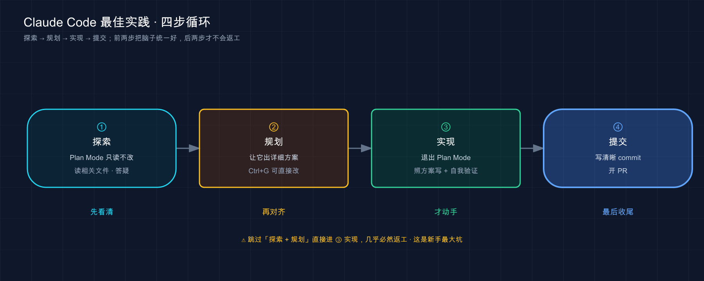

# 49 · 最佳实践：把零散的好习惯，攒成一套能照着做的心法

> 📚 **系列导航**：上一篇 [48 综合实战：从零到上线串起所学](48-capstone-project.md) 带你把前面所有功能拧成一条完整的开发流。这一篇换个高度——**不教新功能，教「怎么用得好」**。同样的 Claude Code，有人用得顺风顺水，有人天天跟它较劲，差的就是这套官方和老用户磨出来的最佳实践。我把它们汇成几条能照着做的法则，外加一摞「好做法 vs 坏做法」对照表。

「这 prompt 写得太省了。」

设想一个刚上手 Claude Code 的人，敲了句「修一下登录的 bug」就回车，等了半天 Claude 改出来一坨他根本没想要的东西，一脸委屈：「我说得还不够清楚吗？」

可你要是把这话甩给一个**今天第一天来、还没摸过这个项目的实习生**，他能修对吗？哪个登录？什么 bug？在哪个文件？怎么算修好了？——你一样没说。换个写法重来一版：「用户报告 session 超时后再登录会失败，先去 `src/auth/` 看 token 刷新那段，写个能复现的测试，再让它过。」这回 Claude 一把就修对了。

说白了，Claude Code 用得好不好，**八成不在工具本身，在你怎么跟它配合**。它能力很强，但它不会读心。这一篇把官方《最佳实践》那套，加上老用户长期攒下来的经验，归成几条**你今天就能照着改的法则**。

**看完这一篇，你会拿到：**

- 一条贯穿全文的总约束（上下文窗口是最金贵的资源），理解了它，下面所有法则就都顺了
- 五条核心法则：给验证手段、先探索再编程、把话说具体、CLAUDE.md 写精、及时纠偏
- 好几张「❌ 坏做法 vs ✅ 好做法」对照表，照着改 prompt 立竿见影
- 一份「这个场景该用哪条法则」的速查，外加一个能亲手跑的对比实验

---

## 01 一条总约束：上下文窗口是你最金贵的资源

所有最佳实践，几乎都能追到同一条根上。官方开篇就把它点破了，我先原样抄给你：

> 大多数最佳实践都基于一个约束：Claude 的 context window 填充速度很快，随着填充，性能会下降。

**上下文窗口（context window，即 Claude 一次能「装在脑子里」的全部信息）装着你整段对话**——每条消息、它读过的每个文件、每条命令的输出，全在里头。问题是它会很快塞满：一次稍微深点的调试，或者让它把代码库翻一遍，轻松就吞掉几万个 token（第 19 篇讲过 token 和上下文窗口是什么，这里不展开）。

**而一旦塞满，Claude 就开始变笨**——忘掉你早先的交代、犯更多低级错。

**类比：带一个新来的实习生上手项目。** 这个实习生绝顶聪明、手脚麻利，但有个怪毛病：**他的脑子是张固定大小的白板**，你交代的事、他翻过的资料、跑过的命令结果，全得写在这张白板上。白板写满了，他就开始顾此失彼——你早上叮嘱的「提交前先跑测试」，到下午他就忘了，因为那行字早被后面一堆东西挤掉了。

这个比喻这一篇我会反复用——**因为后面几乎每条法则，本质都是在帮这个实习生「省着用他的白板」**：

- 让他**能自己验收**，你就不用每一步都盯着看（省你的时间，也省得反复来回污染白板）；
- 让他**先摸清再动手**，就不会白板写满了才发现方向错了；
- 把话**一次说具体**，就省掉来回追问那几轮消耗；
- 给他的**常驻便签写精**，白板开局就不会先被废话占走一截；
- 一**跑偏立刻拽回来**，别等白板被一串错误方法塞爆。

记住这条总约束，下面前五条法则你会发现它们其实是一家人——全在「替单个实习生省白板」。等你把一个实习生使唤利索了，最后还有第六条：**多招几个实习生横向铺开**，那是后话。

> 💡 一句话总结：Claude 的上下文窗口会很快填满、填满就变笨，**它是你最金贵的资源**；这一篇所有法则，归根结底都是在教你「替那个聪明实习生省着用他的白板」。

---

## 02 法则一：给它一个能自己验收的方式

先上结论，这条是我心里**最重要的一条**：

> **给 Claude 一个它能自己跑的检查——测试、构建、截图比对。这是「你得盯着的会话」和「你能走开的会话」之间的分水岭。**

为啥这么关键？官方那句话戳中了要害：

> 当工作看起来完成时，Claude 会停止。没有它可以运行的检查，「看起来完成」是唯一可用的信号，你成为验证循环。

翻成人话：**你要是不给它验收标准，那个「验收」就只能你自己来**——它每犯一个错，都得等你火眼金睛发现。你从「派活的人」沦落成「质检员」，每一步都得盯。但你只要给它一个能产出「过 / 不过」信号的东西，这个循环就自动闭合了：它干完活、自己跑检查、读结果、不对就接着改，直到检查通过。

**类比：装修队交工前那道验收。** 你请人装修，最怕的就是工人「凭感觉觉得弄好了」就收工——瓷砖贴歪了、插座不通电，他自己看不出来，全等你入住才发现。但你要是开工前就甩给他一张**验收清单**（「每个插座插电笔测一遍亮不亮、每块砖拿靠尺量平不平」），他就能自己一项项核对、不合格自己返工，交到你手上的是已经验过的活。**「能自己跑的检查」就是你递给 Claude 的那张验收清单。**

什么东西能当这张清单？官方给了一串，全是能返回「Claude 在对话里读得到的信号」的东西：

- **测试套件**（最常用，跑完直接告诉它过没过）
- **构建的退出码**（编译过不过）
- **linter**（代码规范检查）
- **拿输出跟固定基准比对的脚本**
- **跟设计稿比对的浏览器截图**（第 17 篇讲的贴图复刻 UI，就能这么验）

最实用的是怎么把它写进 prompt。官方这张对照表，我建议你直接收藏：

| 场景 | ❌ 没给验收 | ✅ 给了验收 |
|------|-----------|-----------|
| **写函数** | 「实现一个验证邮箱的函数」 | 「写个 `validateEmail` 函数。示例用例：`user@example.com` 为真、`invalid` 为假、`user@.com` 为假。**实现后跑测试**」 |
| **改 UI** | 「让仪表盘好看点」 | 「[贴截图] 照这个设计实现。**做完截图跟原设计比对，列出差异再修**」 |
| **修构建** | 「构建失败了」 | 「构建报这个错：[贴错误]。修好并**验证构建成功。解决根因，别把错误压下去**」 |

看出门道了吗？左边那列，Claude 干完只能「觉得」自己对了；右边每一条结尾都挂了个**它能自己跑、能读到结果**的检查。

检查还能分**约束力的档位**，看你要它管多严——这点官方讲得很细，我归成一句给你：

| 约束力 | 怎么挂 | 适合 |
|--------|--------|------|
| **本次提示内** | prompt 里直接写「跑测试并迭代到通过」 | 今天手头随便哪个任务，最轻量 |
| **整个会话** | 设成 `/goal` 条件，每轮自动重检直到成立 | 要它持续盯着一个目标别跑偏 |
| **确定性闸门** | 写个 Stop hook，检查不过就不让它收工 | 无人值守时强制把关（第 33 篇讲 hook） |

新手用最上面那档就够了——**prompt 结尾加一句「做完跑测试并验证」，立竿见影**。后两档是等你要让 Claude「没人盯着也能正确收工」时再上的重武器。

这里还得提一句官方反复强调的「**解决根因，别压症状**」——这恰好撞上调试里那条铁律：**别为了让代码跑起来就把报错注释掉、或加个绕过标记蒙混过去**。一个典型的翻车场景是：构建报个 type 错误，图快让它「先让构建过」，结果它真的把那行类型断言成了 `any`，错误是没了，bug 埋更深了。稳妥的做法是 prompt 里永远带一句「**修复根本原因，不要把错误压下去**」。

还有个加分动作：**让它把证据亮出来，而不是嘴上说「成功了」**。

> 让 Claude 显示证据而不是声称成功：测试输出、它运行的命令及其返回的内容，或结果的屏幕截图。

你审一眼它贴出来的测试输出，比你自己重新跑一遍快得多——而且对于你没盯着的会话，这是唯一能信的东西。

> 💡 一句话总结：**给 Claude 一个能自己跑的检查（测试 / 构建 / 截图比对），它就能自我验收、不对自己返工**；prompt 结尾挂一句「做完跑测试并验证」，你就从质检员变回派活的人。

---

## 03 法则二：先探索，再规划，最后才编程

第二条法则，专治「方向跑偏」。

> **让 Claude 上来就闷头写代码，很容易写出一坨「解决了错误问题」的东西。把「摸清楚 + 定方案」和「动手实现」分开。**

官方推荐的工作流分四步，我用上面那个实习生的比方串一遍你就懂了：



这张图是官方那套四阶段工作流：左边两步「想清楚」、右边两步「干出来」，中间那道竖线（退出 Plan Mode）就是从「动脑」切到「动手」的开关。

**为啥探索和实现要分开？** 你想啊——你不会让一个第一天来的实习生连项目都没翻过就直接上手改核心模块。你会先让他**读代码、问问题、把现状摸清**（这就是「探索」），再让他**说说打算怎么改**（这就是「规划」），你点头了他再动手。Claude 也一样，**Plan Mode（计划模式，只读不改、专门用来摸清现状和定方案的模式，第 35 篇细讲）就是干这个的**。

探索阶段，你在 Plan Mode 里这么使唤它（官方示例的意思）：

```text
读一下 src/auth 目录，搞清楚我们怎么处理 session 和登录。
顺便看看 secret 这类环境变量是怎么管的。
```

它只读不改，读完回答你。摸清了再让它出方案：

```text
我想加 Google OAuth。哪些文件要改？session 流程是怎样的？给我一份计划。
```

方案出来你觉得不对，**按 `Ctrl+G` 能直接在文本编辑器里改这份计划**，改完它接着往下走。满意了，切出 Plan Mode 让它照方案实现——别忘了第一条法则，**让它顺手把验证也做了**。

但官方也老实提醒了：**Plan Mode 不是万能的，它有开销**。

> 对于范围明确且修复很小的任务（如修复拼写错误、添加日志行或重命名变量），要求 Claude 直接执行。

官方给了一句**特别好用的判断口诀**，平时拿它做决定就够：

> **如果你能用一句话描述这个 diff，就跳过计划。**

改个拼写、加行日志、重命名变量——这种你一句话说得清的，直接让它干，套 Plan Mode 纯属脱裤子放屁。**反过来，方法没想好、要动好几个文件、或者你对这块代码不熟**——这三种情况，老老实实先规划。一条好用的分界线：**碰一个没读过的模块，或者预感要连带改三个以上文件，一律先进 Plan Mode**；剩下的直接上。

> 💡 一句话总结：**方法没把握、要改多个文件、对代码不熟，就先 Plan Mode 探索 + 规划再动手；一句话能说清的 diff，直接干**——官方那句「能一句话描述 diff 就跳过计划」是最好用的分界线。

---

## 04 法则三：把话说具体——你越精确，要返工的越少

这条是开头那个故事的正主。一句话：

> **你的指令越精确，需要的更正就越少。** Claude 能推断意图，但它不会读心。

引用具体文件、点明约束、指出参照的例子——这三招就能让 prompt 的质量上一个台阶。官方这张对照表是全篇的精华，我逐条带你品（第 15 篇讲过提问的通用心法，这里专挑「具体」这一点往死里抠）：

| 招式 | ❌ 模糊 | ✅ 具体 |
|------|--------|--------|
| **限定范围**：哪个文件、什么场景、测试偏好 | 「给 `foo.py` 加测试」 | 「给 `foo.py` 写测试，**覆盖用户已登出的边界情况，别用 mock**」 |
| **指向来源**：把它导到能回答问题的地方 | 「`ExecutionFactory` 这 api 咋这么怪？」 | 「**看 `ExecutionFactory` 的 git 历史**，总结它的 api 是怎么演变成这样的」 |
| **参照现有模式**：指出代码库里的范例 | 「加个日历组件」 | 「看主页现有组件怎么写的，`HotDogWidget.php` 是个好例子。**照这个模式**实现一个日历组件，能选月份、能前后翻年。别引新库」 |
| **描述症状**：给现象 + 大概位置 + 「修好」长啥样 | 「修登录错误」 | 「用户反馈 session 超时后登录失败。查 `src/auth/` 的认证流程，**特别是 token 刷新。先写个失败测试复现，再修**」 |

看出右边那列的共性没有？**全在做减法之外的加法**——加了文件名、加了边界情况、加了参照例子、加了「修好的样子」。这就是开头那条重写后的 prompt 为啥一把就对：把「修登录 bug」这种模糊话，按最后一行那个模板**重写成了带文件、带症状、带验收的具体指令**。

最受用的是第三招「**参照现有模式**」。我自己就在这上面栽过——有回图省事直接甩了句「加个导出 CSV 的功能」，它确实给我整出来了，但用了套跟项目里已有导出逻辑完全不搭的新写法，还顺手引了个我根本没用过的库，对齐返工磨了我大半个下午。后来学乖了，换成一句模板就好办了——「**先看 `XXX.ts` 里现有的导出是怎么做的，照那个模式来，别引新库**」。就加这么半句，它写出来的代码风格、用的工具函数全跟项目对齐，基本不用返工。**指一个现成的好例子给它，胜过你描述十句「我想要的风格」。**

不过官方留了个有意思的例外，值得你知道：

> 当你在探索并能够改正方向时，模糊的提示可能很有用。

像「**你会怎么改进这个文件？**」这种故意开放的问法，反而能**抖出一些你压根想不到要问的东西**。接手陌生代码时这招特别好用——先扔个模糊问题让它自由发挥，看它冒出什么，再据此收紧。所以「具体」是默认档，「模糊」是探索时的特殊档，别一根筋。

### 配套动作：把「料」喂足

光说得具体还不够，**该塞给它的资料得塞够**。官方给了几个喂料的招，第 17 篇详细讲过多模态，这里汇总成一张速查：

- **用 `@` 引用文件**，而不是干巴巴描述「那个文件在哪儿哪儿」。打 `@` 它会跳出文件名让你选，它读完再回答。
- **直接粘贴图片**：截图、设计稿、报错的图，复制粘贴或拖进去就行（去看医生别光靠嘴说、拍张片子给医生——这事第 17 篇的比方很贴切）。
- **给 URL**：文档、API 参考的网址直接贴。常用的域名可以用 `/permissions` 加进白名单免得每次问。
- **管道灌数据**：`cat error.log | claude` 直接把文件内容怼进去。
- **让它自己去取**：告诉它「用 bash 命令 / MCP 工具去把你要的上下文拉过来」，它会自己动手。

> 💡 一句话总结：**默认把话说到「换个实习生也能照做」的具体程度**——点文件、限场景、给参照、说清「修好的样子」；要喂的资料用 `@`、贴图、URL、管道一次给足；只在「想让它自由发挥探出新东西」时才故意模糊。

---

## 05 法则四：CLAUDE.md 要写精，不是写多

CLAUDE.md 怎么写得好，是「最佳实践」绕不开的一条。第 18 篇已经把它的语法、放哪、怎么生成讲透了，**这一节只补一个最容易被新手忽略、却最致命的点：精，比全重要一万倍**。

先记住 CLAUDE.md 是啥——**Claude 每次开新对话都会自动读的那个文件**，里头放它没法从代码里猜到的持久背景（构建命令、代码风格、工作流规矩）。`/init` 能帮你生成一份起步的（第 12 篇讲过）。

**类比：留给值班同事的便签。** 你下班前给接班的同事留张便签，写「服务器半夜会自动重启，别慌」「客户 A 的邮件优先回」——**写三五条关键的，他扫一眼就记住了**。可你要是把整本运维手册抄上去、密密麻麻贴满一墙，结果就是**他一条都不会认真看**，你真正想强调的那两句反而被淹了。CLAUDE.md 就是这张便签：**它的价值在「短到每条都被看见」，不在「全」。**

这不是我瞎说，官方把这条几乎是吼出来的：

> 保持简洁。对于每一行，问自己：「删除这个会导致 Claude 犯错吗？」如果不会，删除它。**膨胀的 CLAUDE.md 文件会导致 Claude 忽略你的实际指令！**

这条踩坑的方式通常有两种。第一种是贪心地把一大段「这个项目为什么这么设计」的来龙去脉写进 CLAUDE.md，想着「让它充分理解背景」，洋洋洒洒小一百行。结果它经常**抓不住你真正强调的那几条硬规矩**（比如「禁止改数据库迁移文件」），全被那堆背景叙事淹了——背景它本来读代码就能懂，根本不该占便签的位置。第二种更直接：有份**只有偶尔写某类接口时才用得上**的规范，图省事也塞进了 CLAUDE.md，相当于每次开会都把一份「平时八竿子打不着」的资料强塞进白板。这两块都该按官方的话办——**背景叙事直接删（它读代码自会懂），偶尔才用的规范挪进 Skill**（第 26 篇）；CLAUDE.md 瘦下来之后，它对那几条核心规矩的遵守会肉眼可见地变好。

到底什么该写、什么该删？官方这张表是金标准，我建议你拿它逐行审一遍自己的 CLAUDE.md：

| ✅ 该写进去 | ❌ 不该写 |
|-----------|----------|
| Claude 猜不到的 bash 命令 | 它读代码就能搞清的任何东西 |
| 跟默认**不一样**的代码风格规则 | 它早就懂的标准语言约定 |
| 测试指令、你偏好的测试运行器 | 详细的 API 文档（**改成贴链接**） |
| 仓库规矩（分支命名、PR 约定） | 经常变的信息 |
| 你项目特有的架构决策 | 长篇解释或教程 |
| 开发环境的怪癖（必需的环境变量） | 「写干净的代码」这种不言自明的废话 |
| 常见的坑、反直觉的行为 | 逐个文件描述代码库 |

右边那列的共性就一句：**凡是 Claude 自己能想明白的、或者会过时的、或者属于「正确的废话」，全删**。

官方还教了两个进阶手法，顺带提一句：

- **想让某条规矩更被当回事**，可以加 `IMPORTANT` 或 `YOU MUST` 这种强调词（你看本教程项目自己的 CLAUDE.md 里就用了「IMPORTANT」）。
- **CLAUDE.md 支持用 `@路径` 语法引入别的文件**，比如 `Git workflow: @docs/git-instructions.md`，把细则拆出去、主文件保持清爽。

最后官方给了条「**反向诊断**」，特别实用：**如果你三令五申某条规矩它还是不听，文件多半太长了，规则被噪音淹了；如果它问你 CLAUDE.md 里明明写了的事，那条措辞多半不清楚。** 把 CLAUDE.md 当代码养——出问题就回去审它、定期修剪、改完观察它行为有没有真变。

> 💡 一句话总结：CLAUDE.md 的命脉是「**精**」不是「全」——每行都拿「删了它 Claude 会犯错吗？」过一遍，不会就删；详细文档贴链接、有时才用的知识挪进 Skill，**让那张便签短到每条都被看见**。

---

## 06 法则五：一跑偏就立刻拽回来，别硬熬

最后一条法则，关乎你怎么**经营一段会话**。核心就一句：

> **一发现 Claude 跑偏，立刻纠正它，别等它越走越远。** 对话是可逆的——用好这一点。

最好的结果都来自**紧密的反馈循环**。Claude 有时一次就完美解决，但更多时候，**快速拽它一把，比让它在错路上跑完再推倒重来，要快得多**。官方给了一套「拽回来」的工具，配上常见的用法：

| 你想干啥 | 怎么做 | 我的用法 |
|---------|--------|---------|
| **中途喊停** | 按 `Esc`，上下文保留，可以重新指方向 | 一看它读错文件了立刻 `Esc`，省得它顺着错的往下跑 |
| **倒带到之前** | 按两下 `Esc` 或 `/rewind`，恢复对话 / 代码状态 | 它把代码改乱了，`/rewind` 回到上一个干净点（第 37 篇细讲检查点） |
| **撤销刚才那步** | 直接说「**撤销那个改动**」 | 比手动改回去快 |
| **不相关任务之间重置** | `/clear` 清空上下文 | 修完 bug 要去写新功能，先 `/clear` |

这里有条**老用户都认、新手最该听的铁律**，官方说得斩钉截铁：

> **如果你在一个会话里对同一个问题纠正了 Claude 两次以上，context 就被失败的方法污染了。**运行 `/clear`，用一个更具体的、包含你刚学到的东西的提示重新开始。

翻成大白话：**纠正第三次还不对，别再纠正第四次了**。这时候你的白板上已经堆满了「试过 A 不行、试过 B 也不行」的垃圾，Claude 被这些噪音带着越走越偏。**正确动作是 `/clear` 推倒重来**——但这次开局的 prompt 里，把你这几轮折腾**学到的东西**写进去（「别走 X 方案、问题根源在 Y」）。

> 干净的会话 + 更好的提示，几乎总是优于冗长的会话 + 一堆累积的更正。

这条我是吃过亏才信的。有阵子跟它死磕一个状态管理的 bug，一轮轮纠正下去，纠了得有五六次，越改越乱，最后那版代码连我自己都看不懂了，还在那儿犟着不肯重开。后来一咬牙 `/rewind` 回最初状态、`/clear`，重开一个会话，把「这 bug 跟组件卸载时的异步回调有关，别动渲染逻辑」一次性说清——**新会话两轮就修好了**，前面那一下午全是白耗。打那以后我给自己定了条硬规矩：**同一个问题纠正满三次，无条件 `/clear` 重开**。

### 顺带两个「经营会话」的好习惯

这条法则底下，还挂着两个官方推荐、能让你白板更干净的习惯（都呼应第 19 篇的上下文管理）：

- **派 subagent 去做调查**：让它「**用 subagent 去查 X**」。它在自己独立的白板上翻一堆文件，**只把结论递回你的主对话**，你的白板一点不沾（第 23 篇细讲）。官方原话——「由于 context 是你的基本约束，subagents 是可用的最强大的工具之一」。
- **给会话起名、之后能续上**：`claude --continue` 接最近一次会话，`claude --resume` 从列表里挑。给会话起个像 `oauth-migration` 这样的描述性名字，**像对待 git 分支一样对待它们**，下次直接找回来接着干。

> 💡 一句话总结：**一跑偏立刻 `Esc` 停 / `/rewind` 倒带 / 说「撤销那个」；同一问题纠正满三次，无条件 `/clear` 带着教训重开**——干净会话 + 好 prompt 永远赢过长会话 + 一堆更正。调查的脏活派给 subagent，别脏了主白板。

---

## 07 法则六：一个 Claude 用顺了，再考虑横向铺开

前五条都默认「一个你、一个 Claude、一段对话」。但你把单个 Claude 用顺之后，官方还有一整套「**横向扩展**」的玩法能让产出翻几倍。这一节只给你建个印象、点几个最值钱的，具体操作分散在第 41 篇（并行任务）和第 44 篇（GitHub Actions）里。

> **先把一个 Claude 用对，再谈并行。** 顺序别反——一个都指挥不利索，开五个只会乱五倍。

官方点了几个最常用的扩展姿势：

- **多开几个会话并行干**：几个互不依赖的活儿，开多个会话各干各的。最稳的隔离办法是 worktree（每个会话在独立的 git 检出里，编辑不打架），或者干脆用桌面端 / 网页版可视化地管多个会话。
- **Writer / Reviewer 模式**：这个我极力推荐。**让会话 A 写代码，再开一个全新的会话 B 去审 A 写的代码**。妙处在于——B 的白板是干净的，它**不会偏袒「自己刚写的代码」**，挑起毛病来比 A 自审狠得多。官方原话点破了关键：

> 新鲜的 context 改进了代码审查，因为 Claude 不会偏向于它刚刚编写的代码。

- **非交互模式跑脚本**：`claude -p "你的提示"` 不开交互会话直接出结果，这是把 Claude 塞进 CI、pre-commit hook、批处理脚本的入口。需要结构化输出时加 `--output-format json`，调试时加 `--verbose`。比如大规模迁移，可以写个循环对几千个文件逐个 `claude -p`，配 `--allowedTools` 把它无人值守时能干的事框死。
- **加一道对抗性审查**：Claude 无人值守跑得越久，**交工前让一个全新的 subagent 在干净白板上审一遍 diff** 就越重要。官方自带的 `/code-review` 就是干这个的——它在新 subagent 里只看差异、挑 bug，再把发现递回来。

不过官方在这儿补了句**反过来的提醒**，值得记住，免得用力过猛：

> 被提示查找缺陷的审查者通常会报告一些，即使工作是健全的……追逐每个发现会导致过度工程。

意思是：让它「找毛病」它就**一定会找出毛病**，哪怕代码本来没问题。**别每条都追着改**，否则会堆出一坨没必要的抽象和防御性代码——告诉审查者「只标影响正确性的，其余当可选」。这条恰好跟「对抗过度工程」是一个道理。

> 💡 一句话总结：**一个 Claude 用顺了再横向铺开**——多会话并行（worktree 隔离）、Writer/Reviewer 用干净白板互审、`claude -p` 进脚本、收尾加道对抗性审查；但审查者「报的毛病」别每条都追，**只改影响正确性的**，别过度工程。

---

## 08 还有几条「沟通」上的好习惯

上面五条是骨架，再补几条官方专门讲「**怎么跟 Claude 沟通**」的小习惯，零散但顶用。

**第一，把它当资深同事一样问。** 加入一个陌生代码库时，别自己闷头啃，直接问它你会问老员工的那些问题——官方原话「**问 Claude 你会问资深工程师的问题**」：

```text
日志是怎么工作的？
我要怎么新建一个 API 端点？
foo.rs 第 134 行那个 async move 是干嘛的？
为啥这段代码第 333 行调 foo() 而不是 bar()？
```

不用任何特殊咒语，**直接问**。这是个特别高效的入职方式，每接手一个新项目都先这么问一圈，比看半天文档快。

**第二，大功能让它先「采访」你。** 这条是官方一个很妙的技巧——动手前，让 Claude 反过来拿问题轰你：

```text
我想做 [一句话描述]。用 AskUserQuestion 工具详细采访我。

问技术实现、UI/UX、边界情况、顾虑和权衡。别问显而易见的，
专挑我可能没想到的硬骨头问。聊透了，把完整的 spec 写到 SPEC.md。
```

它会问出一堆你压根没考虑过的东西（边界情况、技术选型的权衡）。**采访完得到一份 `SPEC.md`，然后开个新会话、用干净的白板照着这份 spec 实现**。官方点了句关键——「花在让 spec 精确上的时间，比花在盯实现上的时间收益更大」。做稍大点的功能都建议这么干，那份被逼出来的 spec 经常能帮你发现需求里的窟窿。

> 你应该问 Claude 你会问另一个工程师的相同类型的问题。

**第三，让它显示证据，别信它的「我觉得」。** 这条跟法则一一脉相承，但值得单拎出来当沟通习惯：凡是它说「应该可以了」「这样就对了」，你都回一句「**跑一下验证，把输出贴出来**」。把「声称」逼成「证据」，是对付那种看着合理、实则没处理边界的实现的最稳一招。

> 💡 一句话总结：陌生代码库**直接当资深同事问**（不用特殊提示）；大功能让它用 `AskUserQuestion` **先采访你、产出 SPEC.md 再新会话实现**；它一说「搞定了」，就让它**亮出测试 / 命令输出当证据**。

---

## 09 动手：用一个对比实验，亲眼看看「具体」值多少

光看法则不够，得亲眼看一次差距。这个实验**不依赖你任何现成项目**，跟着做五分钟，你会对「把话说具体 + 给验收」有肌肉记忆。

**目标**：同一个需求，先用模糊 prompt、再用具体 prompt，对比 Claude 干出来的活差多少。

**第一步：建个空目录，进 Claude**

```bash
mkdir cc-best-practice-demo && cd cc-best-practice-demo && claude
```

**第二步：先发一条「模糊」prompt**

进去后敲（故意学新手那样省着说）：

```text
写个判断密码强不强的函数
```

**预期**：它多半会给你一个 `checkPassword` 之类的函数，但**判定标准全是它自己拍脑袋定的**——可能只看长度，也可能加一堆你没要的规则；大概率**没有测试**，你根本不知道它对不对。先把这版留着。

**第三步：`/clear` 后，发一条「具体 + 带验收」的 prompt**

```text
/clear
```

清空后，按法则一和法则三重写这条需求：

```text
写一个 isStrongPassword(pwd) 函数，放到 password.js。
规则：长度 >= 8、至少 1 个大写字母、至少 1 个数字，三条全满足才算强。
示例用例：'Abc12345' 为 true，'abc12345' 为 false（没大写），'Abcdefgh' 为 false（没数字）。
写完用这些用例跑一遍验证，把测试输出贴给我。
```

**预期**：这一版你会明显看到三处不同——

1. 函数的判定规则**跟你说的一字不差**，不再是它自己瞎定；
2. 它会**真的去跑那几个示例用例**，并把类似 `✓ Abc12345 → true` 的结果贴出来；
3. 你扫一眼那个输出就能**自己验收**，不用再去人肉读代码猜它对不对。

**第四步：把两版并排看一眼**

你不用记任何东西，**就盯着这两版的差距感受一下**：左边那版你得自己当质检员、还未必查得出错；右边那版它自己验完、把证据递到你手上。**这就是这一整篇法则压缩成的一次体感**——多花十几个字写清楚「规则 + 用例 + 验证」，省下的是你来回返工的好几轮。

> 💡 一句话总结：同一个需求，**模糊 prompt 让你当质检员、具体 + 带验收的 prompt 让它自己交验过的活**；亲手跑一遍这个对比，比记十条法则都管用。

---

## 10 小结

这一篇没教新功能，教的是「**怎么把已有功能用到位**」——把官方《最佳实践》和老用户的经验，归成几条你今天就能照着改的法则。

最后用上下文窗口那条总约束，把六条法则串成一张速查表：

| 你遇到的情况 | 该用哪条法则 | 一句话关键动作 |
|------------|------------|--------------|
| 「它干完我得自己一行行查对不对」 | **给验收手段** | prompt 结尾挂「做完跑测试 / 截图比对并验证」 |
| 「它写出来的东西方向就错了」 | **先探索再编程** | 不熟 / 改多文件，先进 Plan Mode；一句话能说清的直接干 |
| 「它老 get 不到我要啥」 | **把话说具体** | 点文件、限场景、给参照、说清「修好的样子」，料用 `@`/贴图喂足 |
| 「叮嘱过的规矩它总不听」 | **CLAUDE.md 写精** | 逐行问「删了会犯错吗」，不会就删；文档贴链接、细则挪 Skill |
| 「同一个问题改了好几轮越改越乱」 | **及时纠偏** | 纠正满三次无条件 `/clear`，带着教训重开 |
| 「一个 Claude 不够用，想提速」 | **横向铺开** | 先用顺一个再并行；Writer/Reviewer 用干净白板互审 |

**你现在应该能：** 拿到任何一段「跟 Claude 较劲」的体验，先回到那条总约束（白板别塞满），再对号入座该提哪条法则——是没给验收、没说具体、CLAUDE.md 太肥，还是该 `/clear` 重开了。**这六条不是死规矩**，官方最后那句话说得很到位——它们是「**通常很管用的起点**」，用多了你会长出自己的直觉：什么时候该具体、什么时候故意模糊去探路，什么时候清空、什么时候让上下文攒着。

> 注意什么有效。当 Claude 产生很好的输出时，注意你做了什么。

把这套心法用顺，你和 Claude 的配合就从「天天较劲」变成「越用越顺手」了。

---

下一篇 **50「反模式：常见的错误用法」**——这一篇讲的是「该怎么做」，下一篇专讲「**千万别这么做**」。官方那张「常见失败模式」清单（厨房水槽会话、反复纠正、CLAUDE.md 过度膨胀、信任却不验证、无限探索）我只在这篇点了名，下一篇把每一个掰开揉碎、配上真实翻车现场和解药。想想看：你回顾自己这段时间用 Claude Code，**最常踩的是哪一个坑**？带着这个问题翻下一篇，对号入座会格外有共鸣。
