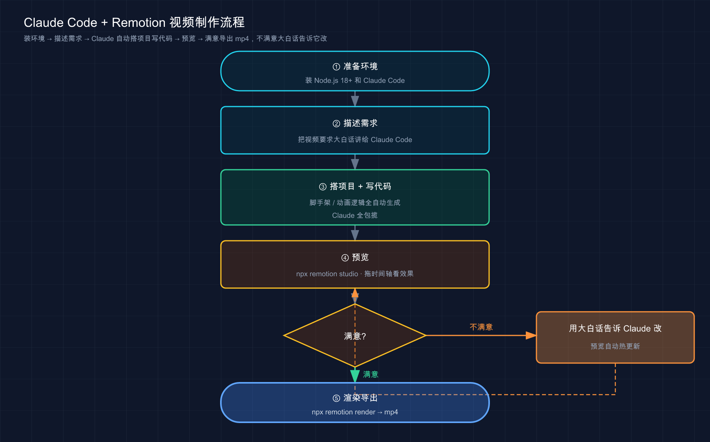

# 53 · 制作视频（Remotion）〔选读〕

> 📚 **系列导航**：上一篇 [52 术语表（小白友好）](52-glossary.md) 把全教程出现过的名词收进了一张「随手能查」的表里。这一篇是整套教程的**最后一站**，也是个〔选读〕的边缘玩法——**让 Claude Code 帮你用代码做视频**。靠的是 Remotion（一个用 React 写视频的框架）：你用大白话描述要什么动画，它写「画每一帧」的代码，最后渲染成 mp4。读完你会知道这事儿到底香在哪、对谁有用、对谁是浪费时间。

> 📌 **关于本篇的定位**：Claude Code 官方文档**没有 Remotion 专页**——这不是 Claude Code 的内置功能，而是「拿 Claude Code 去写另一个框架的代码」的一种用法。所以本篇的技术事实基于 **Remotion 的通用知识 + 教程实践**，不引官方 Claude Code 文档（因为它压根没讲这个）。归到「选读」，是因为它确实是个边角料：大多数人用不上，但用得上的人会觉得「卧槽这也行」。

兄弟们，先甩个数据给你找找感觉。

**Remotion 这个开源项目，在 GitHub 上攒了五万多颗 star。** 一个「用 React 写视频」的框架，能有这个量级的关注度，本身就说明一件事——**「把视频当代码来写」不是小众极客的自娱自乐，是真有人靠它干活**。

最出圈的一个用法是这样的：某些产品给每个用户生成「专属年度总结视频」——你的播放时长、你听得最多的歌、你的排名，几万个用户就是几万条**内容不同但模板一致**的视频。这种活儿你让剪辑师用 Pr、AE 一条条剪？剪到天荒地老。但如果视频是**一段能传参数的代码**，那就是一个循环的事——换个数据，渲染一条新的。

说到「能传参数的代码」，你是不是想起谁了？**对，正是 Claude Code 的主场。** 视频一旦变成 React 代码，那它就跟你前面五十二篇里折腾的任何代码没区别了——你描述需求，它写、它改、它调。这一篇就带你看明白这套组合到底怎么玩，以及最关键的：**它适合你吗？**

**看完这一篇，你会拿到：**

- 一句话讲明白 Remotion 是什么、它凭什么能「用代码做视频」
- 为什么 Remotion 和 Claude Code 是绝配——视频变代码，代码就是 Claude 的活儿
- 一套「从空目录到一个 mp4」的最小流程，每步给了预期输出，能照着跑
- 三个核心概念（帧、插值、弹性）的小白版解释，看懂 Claude 生成的代码在写啥
- 一张「谁该用 / 谁别碰」的对照表，帮你判断要不要在这上面花时间

---

## 01 先搞懂：Remotion 凭什么能「用代码做视频」

先给结论：**Remotion 就是把「视频的每一帧」变成一张 React 渲染出来的画面，再把这些画面按顺序拼成视频。** 你不再用鼠标在时间轴上拖素材，而是**写代码描述「第几帧长什么样」**。

这听着有点反直觉——视频不都是拍出来、剪出来的吗？怎么还能「写」出来？关键在于**它做的是哪一类视频**：不是真人出镜、实拍剪辑那种，而是**文字动画、数据图表、Logo 片头、代码演示**这类「画面完全由规则生成」的视频。这类东西本来就没有「拍摄」一说，全是「按规则画」——而「按规则画」，正是代码最擅长的。

**类比：小时候玩的翻页动画书（flip book）。** 你在便签本每一页角上画一个小人，第一页他抬左脚、第二页抬右脚、第三页跳起来……单看每一页都是静止的一张图，但你**拇指飞快一翻**，小人就跑起来了。视频的本质就是这么回事——**一堆静止画面，放得够快，眼睛就看成了连续动作**。Remotion 干的事，就是让你**用代码画这本翻页书的每一页**：你写一个函数，告诉它「第 0 页文字在屏幕外、第 30 页滑到中间」，它就把中间每一页该画成啥样**算出来、画出来、连成视频**。

落到真实场景，下面这几类视频用 Remotion 做就特别顺：

- **数据可视化视频**：一个数字从 0 涨到一百万的弹跳动画、一张随时间生长的柱状图——数据驱动，代码一控一个准
- **批量个性化视频**：上面说的「年度总结」那种，同一个模板灌不同数据，循环渲染几千条
- **技术演示 / 教程片头**：代码块逐行高亮、终端打字效果、Logo 砸入画面——程序员做自己的演示视频，比学 AE 快多了

举个常见的场景：想给一个小工具做个 15 秒的发布预告。**不会 After Effects**，找剪辑外包又觉得为 15 秒不值当。这时候让 Claude Code 配 Remotion，**从空目录到一条能看的 mp4，前后一个多小时**——其中大半时间还是在反复调「这个字飞得太快了」「背景太丑了」。这事儿要搁以前，软件都还没装明白。

为了让你一眼看清 Remotion 在「做视频」这件事里的位置，我把它和你大概率听过的另外两类工具并排放一下：

| 工具类型 | 怎么做视频 | 强在哪 | 弱在哪 |
|---------|----------|--------|--------|
| **剪辑软件**（剪映 / Pr / AE） | 鼠标拖素材、手 K 关键帧 | 真人实拍、自由创意、所见即所得 | 不能批量、改一处要手动、学起来慢 |
| **在线模板**（各种「一键生成」站） | 套现成模板填内容 | 快、零门槛 | 模板套死、改不动细节、风格千篇一律 |
| **Remotion** | **写代码描述每一帧** | 精确可控、能批量、能进 git、能复用 | 不碰实拍、要点编程环境（但有 Claude 顶上） |

看这张表你就明白它的生态位了——**它不跟剪映抢「剪生活视频」的活，也不跟在线模板抢「随手出一张」的活，它专攻那块「要精确、要批量、要可复用」的硬骨头**。而它唯一的门槛「要会写代码」，恰好被 Claude Code 给抹平了。

> 💡 一句话总结：Remotion 把视频拆成**一帧一帧的 React 画面**，你用代码描述「第几帧长什么样」，它负责画出来拼成片子；它擅长的是**文字、数据、Logo 这类「按规则生成」的视频**，不跟剪辑软件抢实拍、不跟在线模板抢「随手出图」，专攻「精确 + 批量 + 可复用」那一块。

---

## 02 为什么 Remotion 和 Claude Code 是绝配

上一节最后那句话其实已经点透了——**视频一旦变成代码，做视频就变成了写代码，而写代码是 Claude Code 的本行。** 这就是这俩凑一块儿的全部理由。

我把这事儿展开说清楚。传统做动效视频，门槛卡在哪？卡在**软件**：你得会用 After Effects 或 Pr，得懂关键帧、缓动曲线、图层蒙版那一整套「软件操作」。这套东西学起来不快，不少程序员都卡在「想做个动画但懒得学 AE」这一步。

**类比：你不会 After Effects，但雇了个懂 React 的动效师傅坐你旁边。** 你不用碰那些复杂软件，只要**跟师傅用大白话说需求**——「我要一行字从左边飞进来，停一下，再变成绿色发光」——师傅听懂了，转身把对应的代码写出来。Remotion 提供了「视频能用代码写」这个**可能性**，Claude Code 就是那个**帮你把需求翻译成代码的师傅**。你负责审美和拍板，它负责动手敲。

这套配合的妙处，在于它**完美踩中了 Claude Code 最擅长的几件事**：

| 做视频的环节 | 传统方式（手动） | Claude Code + Remotion |
|-------------|----------------|----------------------|
| **从零搭项目** | 自己配 React、装依赖、建目录 | 一句话让它把项目脚手架全搭好 |
| **写动画逻辑** | 在 AE 里手 K 关键帧 | 你描述效果，它写 `interpolate`/`spring` 代码 |
| **改一个细节** | 软件里翻图层找参数 | 「第 2 个场景字太小」→ 它定位代码改掉 |
| **批量出不同版本** | 一条条另存为重做 | 改个参数循环渲染，几千条不在话下 |

看「改一个细节」这行最能体会爽点。你在预览里看到「这个卡片入场太快了」，**搁 AE 你得在一堆图层里翻出那个关键帧**；而这儿你只要在终端打一句「FeaturesScene 里卡片的入场动画慢一点」，Claude 自己去对应的 `.tsx` 文件里把那个数值调小——**预览还会热更新**，你立刻看到效果。这种「自然语言改视频」的体验，实测下来是这套组合最上瘾的一点。

这里得插一句**重要前提**，免得你产生误会：**这套组合的核心是 Claude Code 在写 React 代码，不是 Claude Code 自己「会做视频」。** 所以前面教程里讲的那一整套，在这儿全都用得上——

- 提需求越具体，它做得越准（详见第 15 篇「怎么提问」），「6 秒、1920×1080、30fps、黑底金字」比「做个酷炫片头」强一百倍；
- 用 `/init` 或一份 CLAUDE.md 把项目约定固定下来（详见第 12、18 篇），它后续改代码就更稳；
- 甚至可以挂一个专门的 Skill 把「Remotion 该怎么写」的规范喂给它（详见第 26 篇），生成的代码质量会明显不一样。

换句话说：**Remotion 这部分你不用从头学，你前五十二篇练的「怎么指挥 Claude Code 写代码」的功夫，在这儿直接复用。**

> 💡 一句话总结：Remotion 把视频变成 React 代码，而**写 React 代码正是 Claude Code 的本行**；你负责用大白话提需求和审美拍板，它负责搭项目、写动画逻辑、按你的反馈改——前面学的指挥 Claude 写代码那套，原样搬过来就行。

---

## 03 三个核心概念：看懂 Claude 生成的代码在写啥

你完全可以不懂代码，光靠嘴指挥 Claude 也能做出视频。**但只要花三分钟认识三个词，你看它生成的代码就不再是天书**，改起来也更有底气。这三个词是 Remotion 的全部地基：**帧、插值、弹性**。

### 帧（frame）：视频是按「第几帧」算的

回到翻页书的类比——**视频的最小单位是「帧」，也就是翻页书的「一页」**。Remotion 里有个核心函数 `useCurrentFrame()`，它告诉你「现在画的是第几帧」。你的整个动画，本质就是一句话：**「在第 frame 帧，画面该是什么样」**。

帧和时间的换算就一个公式，记住它你就能看懂所有时长设置：

**总帧数 = 秒数 × 帧率（fps）**。比如 6 秒、30fps 的视频，就是 `6 × 30 = 180` 帧。

所以你在代码里看到 `durationInFrames={180}` 配 `fps={30}`，脑子里立刻反应过来：**这是个 6 秒的片子**。（fps 即 frames per second，每秒多少帧；30fps 流畅，60fps 更丝滑但文件更大。）

### 插值（interpolate）：把「从 A 到 B」平滑算出来

`interpolate()` 是用得最多的函数，干的事一句话能说清：**给两个时间点和两个值，它帮你算出中间每一帧的过渡值**。

举个最直白的例子——你想让一行字在前 30 帧里从「完全透明」淡入到「完全不透明」：

```tsx
import { interpolate, useCurrentFrame } from "remotion";

const frame = useCurrentFrame();
// 第 0 帧时 opacity=0，第 30 帧时 opacity=1，中间自动平滑过渡
const opacity = interpolate(frame, [0, 30], [0, 1]);
```

读这段代码：`interpolate(frame, [0, 30], [0, 1])` 翻成人话就是「**当 frame 从 0 走到 30，把值从 0 平滑拉到 1**」。Claude 写淡入淡出、位移、缩放、旋转，底层全靠它。你看到 `interpolate` 就知道：**这儿有个东西在「从某状态平滑变到另一状态」**。

### 弹性（spring）：让动画「Q 弹」而不是直愣愣

`spring()` 是让动画**带物理弹性**的函数。`interpolate` 出来的是匀速直线运动，看着「机械」；`spring` 模拟的是**弹簧**那种「冲过头再弹回来」的手感，自然得多。

有个说法很在理：**用 `spring()` 做的弹性动画，比线性动画自然 10 倍。** 拿前面那个发布预告来说，一开始 Logo 是「啪」一下硬切到中间的，丑得很；后来跟 Claude 说「让 Logo 用弹性效果弹进来」，它把 `interpolate` 换成了 `spring`，Logo 就有了那种「弹一下稳住」的高级感。**所以你想让动画显得专业，提需求时直接说「用弹性缓动」**——这是一条很实用的经验。

这三个概念你不用会写，**认识就行**。下面这张表帮你对号入座：看到哪个词，就知道 Claude 在干啥。

| 你看到的词 | 它在干啥 | 你想要时怎么跟 Claude 说 |
|-----------|---------|----------------------|
| `useCurrentFrame()` | 取「当前第几帧」 | （一般不用你管，它自己用） |
| `durationInFrames` / `fps` | 定视频多长、多流畅 | 「做个 6 秒、30fps 的视频」 |
| `interpolate(...)` | 从 A 平滑过渡到 B | 「让它淡入 / 滑进来 / 放大」 |
| `spring(...)` | 带弹性的过渡 | 「用弹性效果，弹一下那种」 |

最后把三个词串成一个完整画面，你就彻底有感觉了。下面这段是 Claude 可能生成的一个最小组件——**一行 HELLO，淡入的同时带弹性放大**。你不用会写，跟着右边注释读一遍：

```tsx
import { interpolate, spring, useCurrentFrame, useVideoConfig } from "remotion";

export const Hello = () => {
  const frame = useCurrentFrame();        // 现在画第几帧
  const { fps } = useVideoConfig();        // 拿到帧率

  // 前 30 帧从透明淡入到不透明
  const opacity = interpolate(frame, [0, 30], [0, 1]);
  // 用弹性算出缩放值，从小弹到正常大小
  const scale = spring({ frame, fps, config: { damping: 12 } });

  return (
    <div style={{ opacity, transform: `scale(${scale})` }}>HELLO</div>
  );
};
```

读懂它一点不难：`useCurrentFrame()` 取「第几帧」→ `interpolate` 把透明度从 0 拉到 1（淡入）→ `spring` 把缩放做成弹性（弹一下）→ 最后把这两个值套到那行字的样式上。**整段就在回答一个问题：「第 frame 帧，这行 HELLO 该长啥样」**。Claude 生成的代码再花哨，骨架也是这个套路——**认出这几个词，你就能跟它讨论该改哪儿**。

> 💡 一句话总结：三个词够你看懂代码——**帧**是视频的「页」（总帧数 = 秒 × fps）、**`interpolate`** 把「从 A 到 B」平滑算出来、**`spring`** 让动画带弹性更自然；它们串起来就在回答「第几帧画面长啥样」，你不用会写，认得它们 + 知道用大白话怎么点单就够了。

---

## 04 最小流程全景：从空目录到一个 mp4

把整套流程在脑子里过一遍，你做视频就不会迷路。**核心五步，每一步要么是你给 Claude 下指令，要么是跑一条命令看结果。**

我先用一张流程图把全景画出来，再逐步拆。



这张图说的是：**装好环境后，你跟 Claude 描述需求 → 它生成代码 → 你预览 → 不满意就用嘴让它改、满意就渲染成 mp4**，中间「预览—改—再预览」会转好几圈，这是常态。

下面把每一步说清楚，关键的给命令和预期。

### 第一步：准备环境

Remotion 是基于 Node.js 的，所以你机器上得有 **Node.js 18 或更高版本**，外加装好的 Claude Code（装 Claude Code 详见第 02 篇）。验证 Node 版本：

```bash
node --version
```

**预期**：打印类似 `v20.11.0` 的版本号。**只要前面那个数字 ≥ 18 就行**。如果低于 18，Remotion Studio 启动会报错——这是新手最常踩的第一个坑（用 nvm 这类工具升到 20 即可）。

**⚠️ 注意：** Remotion 渲染视频时，底层会用到一个无头浏览器（headless Chromium，没有界面、在后台跑的浏览器，用来把每一帧「截图」下来）。首次渲染它可能要下载这个组件，**国内网络如果卡在这一步，开「魔法上网」再试**。

### 第二步：建个空目录，启动 Claude Code，把需求讲清楚

```bash
mkdir hello-video && cd hello-video
claude
```

进了 `claude` 交互界面，把你的需求**一次性描述清楚**。需求越具体，它一次到位的概率越高。一个最小示例提示词：

```text
帮我用 Remotion 创建一个项目，做一个 6 秒的开场视频。
要求：1920x1080，30fps，纯黑背景；
画面中央显示 "HELLO" 几个白色大字，从透明淡入并轻微放大，
最后这几个字带一圈绿色（#67c23a）发光。
只要一个 Composition，不用拆多个场景。
```

注意我这个提示词里把**时长、分辨率、帧率、颜色、动画方式**全写死了——这正是第 15 篇反复强调的「指令要具体」。**「6 秒、1920×1080、30fps、黑底白字、淡入放大、绿色发光」**，比「做个酷炫片头」强太多。

你不用每次都从零想，**记住一个「五要素」清单，照着填就是一条好提示词**：

| 要素 | 该说清什么 | 例子 |
|------|----------|------|
| **时长** | 几秒 | 「6 秒」 |
| **尺寸 + 帧率** | 投哪个平台、多流畅 | 「1920×1080,30fps」 |
| **背景** | 别只说「好看」，给具体的 | 「纯黑」「深灰到墨蓝的渐变」 |
| **主体内容** | 显示什么文字 / 数字 / 图形 | 「中央白色大字 HELLO」 |
| **动画方式** | 怎么进、怎么出、要不要弹 | 「淡入并轻微放大、用弹性效果」 |

尺寸这一项，**直接说你要投的平台，比报数字更省事**——抖音竖屏（1080×1920）、B 站横屏（1920×1080）、微信朋友圈方形（1:1），你说平台名，它换算尺寸。提需求基本就照这五行填，**一次到位的概率明显比瞎描述高多了**。

### 第三步：它搭项目 + 写代码

接下来 Claude Code 会自己干活：初始化 `package.json`、装 Remotion 依赖、建好 `src/` 目录、写出那个 `Composition` 组件、把动画逻辑用 `interpolate`/`spring` 写好。**整个脚手架它一手包办**，你看着它一个个建文件就行。生成完，它通常会告诉你「装依赖、跑预览」的命令——照着做。

### 第四步：预览（这步最关键）

```bash
npm install
npx remotion studio
```

**预期**：终端打印类似 `Remotion Studio running at http://localhost:3000`，浏览器自动打开。你会看到一个**带时间轴的预览界面**——能播放、能拖动时间轴**逐帧**看效果。

这步是整个流程的核心。**视频好不好，全在这儿看出来。** 你拖着时间轴看，觉得「这个字飞太快了」「绿光太刺眼了」，记下来——下一步直接让 Claude 改。

### 第五步：不满意就让它改，满意了渲染导出

发现问题，**别自己去翻代码**，回到 Claude Code 终端用大白话说：

```text
"HELLO" 淡入太快了，把淡入时间拉长到 1 秒；绿色发光弱一点。
```

它定位到对应代码改掉，**Remotion Studio 会自动热更新**，你回浏览器刷一眼就看到新效果。这个「说—改—看」的循环转几圈，调到满意为止。

满意后，渲染成 mp4：

```bash
npx remotion render HelloVideo out/hello.mp4
```

这里 `HelloVideo` 是你的 **Composition ID**（要和代码里注册的那个 id 一致，Claude 会告诉你叫啥），`out/hello.mp4` 是输出路径。**预期**：终端跑一个进度条，结束后打印类似 `Rendered ... → out/hello.mp4`。去 `out/` 目录，**你的 mp4 就躺在那儿了**。

两个新手最容易卡的小点，这里一次说清：

**Composition ID 不知道叫啥？** 别瞎猜——**直接问 Claude「这个视频的 Composition ID 是什么」**，它告诉你；或者打开 `remotion studio` 预览界面，**左边那一栏列出的就是所有 Composition 的名字**，照着抄即可。ID 错了渲染会报「找不到这个 Composition」，这时候去那两个地方核对一下就好。

**为什么不能跳过预览直接渲染？** 因为**渲染是「重活」**，一条视频可能跑几分钟；而预览是实时的、能逐帧拖。**正确姿势是：在预览里反复调到满意，最后才渲染一次出片**。很多人一开始不懂这道理，每改一点就渲染一遍看效果，白白等了一堆进度条——**记住「预览调、渲染出」，能帮你省下大把时间**。

> 💡 一句话总结：五步走——**装环境（Node 18+）→ 描述需求 → 它搭项目写代码 → `remotion studio` 预览 → 用嘴让它改 / 满意了 `remotion render` 出 mp4**；其中「预览—改—再预览」会转好几圈，这是正常的，别指望一次到位，而且**调试全在预览里做，渲染只在最后出片时跑一次**。

---

## 05 动手：跑通一个最小示例并验证

光看流程不算数，这一节给你一套**能照着敲、每步有预期**的最小实战。**全程不依赖你已有任何视频相关环境，只要有 Node.js 18+ 和 Claude Code。**

**⚠️ 提醒：** 这个例子会让 Claude Code 真去**联网装依赖、建文件、跑渲染**，比你平时问它问题「重」一些。装依赖和首次渲染下组件可能要等几分钟，**国内网络不稳就开魔法上网**。

**第一步：确认 Node 版本够（不够后面全白搭）**

```bash
node --version
```

**预期**：打印 `v18.x.x` 或更高（如 `v20.11.0`）。**第一个数字 ≥ 18 就过关**。低了先升级再往下走。

**第二步：建空目录，启动 Claude Code**

```bash
mkdir hello-video && cd hello-video
claude
```

**预期**：进入 Claude Code 交互界面，光标在输入框等你说话。

**第三步：把第 04 节那段最小需求提示词粘进去发给它**

就用上面那段「6 秒、1920×1080、30fps、黑底白字 HELLO、淡入放大、绿色发光」的提示词。

**预期**：Claude Code 开始**建文件、写代码**——你会看到它创建 `package.json`、`src/Root.tsx`（或 `src/index.ts`）、那个动画组件等。它干活时可能会**请求你批准**「创建文件」「跑 `npm install`」这类操作（这正是第 20 篇讲的权限机制）——批准它继续。干完它会提示你下一步命令。

**第四步：装依赖 + 起预览**

```bash
npm install
npx remotion studio
```

**预期**：`npm install` 拉完依赖（第一次稍慢）。`remotion studio` 打印 `Remotion Studio running at http://localhost:3000` 并自动开浏览器，你能看到 **HELLO 几个字在黑底上淡入、带绿光**的预览，可以拖时间轴逐帧看。**看到这个能播放的预览 = 你这条链路通了。**

**第五步：用一句话让它改，验证「自然语言改视频」**

回到 Claude Code 终端，敲：

```text
把 HELLO 的淡入时间拉长，慢一点进来。
```

**预期**：Claude 找到对应的 `interpolate` 那段代码，把过渡的帧区间改大（比如从 `[0, 15]` 改成 `[0, 45]`）。**Remotion Studio 自动热更新**，你回浏览器看，HELLO 进场明显变慢了。**看到这个变化 = 你已经掌握了这套玩法的精髓**——做视频不用碰软件，张嘴就行。

**第六步：渲染出 mp4**

```bash
npx remotion render HelloVideo out/hello.mp4
```

（`HelloVideo` 换成 Claude 告诉你的真实 Composition ID。）**预期**：跑一个进度条，结束打印 `Rendered ... → out/hello.mp4`。打开 `out/hello.mp4`，**一条真正的视频文件**，能用任何播放器打开。

跑通这六步，你就把「**确认环境 → 描述需求 → 生成代码 → 预览 → 用嘴改 → 渲染出片**」这条完整链路亲手走了一遍。**以后做更复杂的视频，无非是把需求描述得更细、改的轮次更多——核心流程就这些。**

> 💡 一句话总结：动手六步——**`node --version` 确认 ≥18 → 空目录起 `claude` 描述需求 → 它生成代码 → `remotion studio` 预览 → 用一句话让它改看热更新 → `remotion render` 出 mp4**；亲手跑通一次，比看十遍流程图都管用。

---

## 06 谁该用、谁别碰：先想清楚再投入

这一节最实在，也是〔选读〕篇该有的态度——**不是所有人都该碰这玩意儿，我直接告诉你它对谁是利器、对谁是浪费时间。**

先说结论：**Remotion + Claude Code 适合「程序化、参数化、要批量、数据驱动」的视频；不适合「一次性创意、真人实拍、重剪辑」的视频。** 拿不准就看下面这张表对号入座。

| 场景 | 适不适合 | 为什么 |
|------|---------|--------|
| 给每个用户生成专属「年度总结」视频，要几千条 | ✅ 非常适合 | 同模板灌不同数据，循环渲染，正是代码的强项 |
| 数字增长、图表生长这类**数据可视化**视频 | ✅ 非常适合 | 数据驱动，代码精确控制，比手 K 关键帧准 |
| 程序员给自己产品做**技术演示 / 片头** | ✅ 适合 | 代码高亮、终端打字、Logo 动画都好实现，省去学 AE |
| 想要每帧**精确可控、可版本管理**的动画 | ✅ 适合 | 视频是代码，能进 git、能 diff、能 code review |
| 婚礼 / 旅行 vlog，要剪真人实拍素材 | ❌ 别碰 | 这是剪辑活，用剪映 / Pr，Remotion 帮不上 |
| 一次性的、靠灵感的创意 MV | ❌ 别碰 | 没有「可复用模板」，写代码的成本远高于直接剪 |
| 你完全不想碰命令行、装环境都嫌烦 | ⚠️ 慎入 | 哪怕有 Claude 帮忙，装 Node、跑命令这关躲不掉 |

判断标准就一句话：**这条视频是「一次性的艺术品」，还是「能换数据复用的模板」？** 前者老老实实用剪辑软件，后者才轮到 Remotion 上场。前面那个发布预告之所以值得用它，是因为**后面还会做第二个、第三个工具的预告**——有了这套代码，下次换个文字和颜色就能再出一条，这才是它的价值所在。要是真就只做这一条、以后再不碰，那老实学十分钟剪映可能更快。

再说句**可能不太中听的大实话**：刚学会这套的人，很容易**高估自己会用到它的频率**。常见的情形是：兴冲冲搭好环境、做了个炫酷片头，然后……就没有然后了——因为平时根本没有「批量出视频」的需求。**工具再酷，没有真实场景撑着，就是个一次性的玩具。** 所以这里有个很务实的建议：**别为了学而学**。你先扪心自问一句「我手头有没有那种『同模板换数据』的视频要反复做」——有，这篇就是给你的，赶紧上手；没有，**知道有这条路就够了**，等真碰上了再回来翻这篇，照着五步走一遍就行。这也正是它被归进〔选读〕的原因。

还有个**容易被忽略的隐性成本**得提醒你：**渲染要吃机器性能和时间**。一条 60 秒、带特效的视频在普通笔记本上渲染两三分钟很正常——视频越长、特效越多，渲染越慢，风扇会呼呼转。好在有个省事招：**渲染慢就让 Claude 加上 `--concurrency` 参数开多线程并行**，速度能快几倍。

再说两条常见的坑，能帮你少走弯路：

**第一，别一句话要它做特别复杂的视频。** 要是一上来就贪心，让它做「五个场景、每个场景不同转场、还要配音乐节奏」的长视频，生成的代码很容易乱成一团，改起来比重做还累。稳妥的做法是——**先让它做一个最简单的版本跑通，再一个场景一个场景地往上加**。这跟第 16 篇讲的「复杂任务拆开做」是一个道理，在做视频上尤其明显。

**第二，`spring` 动画偶尔「只显示第一帧」别慌。** 有时某个带延迟的弹性动画死活不动，查下来是个已知小毛病——延迟没处理好时传给 `spring` 的帧数变成了负数。你不用懂原理，**直接把现象告诉 Claude：「这个动画只显示第一帧，不动」**，它基本一眼就知道怎么修（给帧数加个不让它变负的保护）。**这也是这套组合的好处：坑你不用自己填，描述清楚交给它就行。**

> 💡 一句话总结：判断标准就一句——**「一次性艺术品」用剪辑软件、「能换数据复用的模板」才上 Remotion**；数据可视化、批量个性化、技术演示是它的主场，真人实拍和一次性创意别硬凑；另外渲染吃性能和时间，长视频记得让 Claude 开 `--concurrency` 并行。

---

## 07 小结

这一篇带你见识了 Claude Code 的一个边角玩法——**让它用 Remotion 帮你「用代码做视频」**。

把核心要点串起来回顾：

| 你想搞清的事 | 答案 | 一句话关键点 |
|------------|------|-------------|
| Remotion 是什么 | 用 React 写视频的框架 | 视频 = 一帧帧的 React 画面，像翻页书 |
| 为啥配 Claude Code | 视频变代码，写代码是它本行 | 你提需求审美，它搭项目 / 写动画 / 改细节 |
| 要懂哪些概念 | 帧、`interpolate`、`spring` | 认识就行，不用会写；总帧数 = 秒 × fps |
| 怎么做 | 描述 → 生成 → 预览 → 改 → 渲染 | 「预览—改—再预览」转几圈是常态 |
| 适合谁 | 程序化 / 批量 / 数据驱动的视频 | 真人实拍、一次性创意别碰 |

**你现在应该能：** 一句话讲清 Remotion 凭什么能用代码做视频（每帧一张 React 画面，像翻页书）、说明白它和 Claude Code 为啥是绝配（视频变代码就是 Claude 的活儿）、看懂生成代码里帧 / `interpolate` / `spring` 在干啥、照着动手环节从空目录跑出一条真 mp4，并且最重要的——**判断出这玩意儿到底值不值得你花时间**。这就够了：选读篇的目的不是让你都得会，而是**让你知道「还有这条路」，需要时知道去哪找**。

到这儿，这一篇结束了。**而它结束的同时，整套《Claude Code 小白教程》也走到了终点。** 下面这段，是给一路读到这儿的你的收尾。

---

## 08 写在最后：五十三篇，咱们一起走完了

兄弟们，能读到这一篇的最后，我得先说一句：**牛。**

回头看这一路——

**第一组**咱们从「Claude Code 到底是个啥」聊起，把环境装好、把账号配通、把第一个例子跑起来，让你从「听说过」变成「手里有」。

**第二组**带你把它接进 VS Code、JetBrains、桌面端、网页端，又教你怎么在自己的项目里把它**正经用起来**——初始化、认识项目结构。

**第三组**是核心交互的硬功夫：怎么提问、怎么贴图、怎么写 CLAUDE.md、怎么管上下文、怎么配权限、怎么守住安全边界。**这一组练扎实了，你就算真正「会用」Claude Code 了。**

**第四组**给你递上了五件兵器——MCP、Subagent、Plugin、记忆、Skill，外加 Agent teams，还教你「啥时候抽哪一把」。

**第五、六组**深入系统配置与实战：settings、输出样式、Hook、CLI、检查点、Chrome、并行、Git、GitHub Actions、Agent SDK……把你从「会用」推向「用得精、用得自动化」。

**第七组**收尾：最佳实践、反模式、FAQ、术语表，加上你刚读完的这篇 Remotion 选读。

五十三篇，**从一个命令行工具，讲到一整套能融进你工作流的代理能力**。

说句心里话——**这套教程从来不是让你「背命令」的**。命令会变、版本会更新、新功能层出不穷（你看官方那个 changelog 多勤）。真正想留给你的，是**那套「怎么和 AI 协作」的思路**：把它当坐你旁边的搭档而不是查询机器、需求讲具体、该确认时确认、把反复用的东西固化下来、信任但留一道闸。**这套思路，比任何一条具体命令都活得久。**

最后，**别把这五十三篇当终点，当起点**。工具是死的，真正的功夫在你接下来**用它去解决一个真问题**的过程里长出来。去起一个你一直想做却没空做的小项目，让 Claude Code 陪你从零干到上线——**那一刻你学到的，会比读完这五十三篇还多。**

> 这套手艺，最好的练法永远是：**关掉教程，打开终端，敲下 `claude`，然后开始干你自己的活。**

咱们，后会有期。
