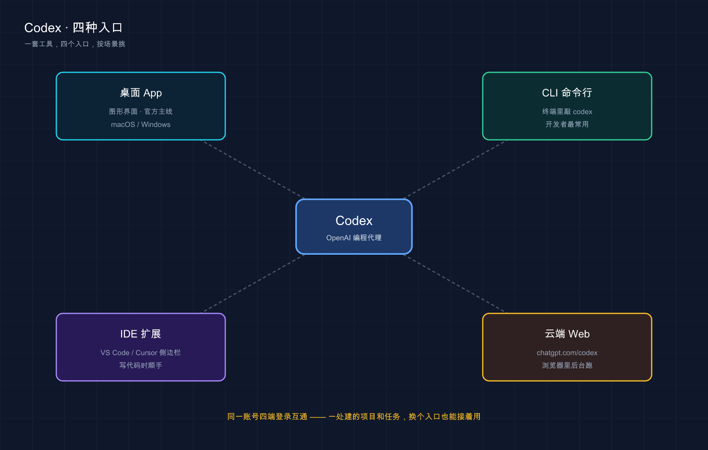
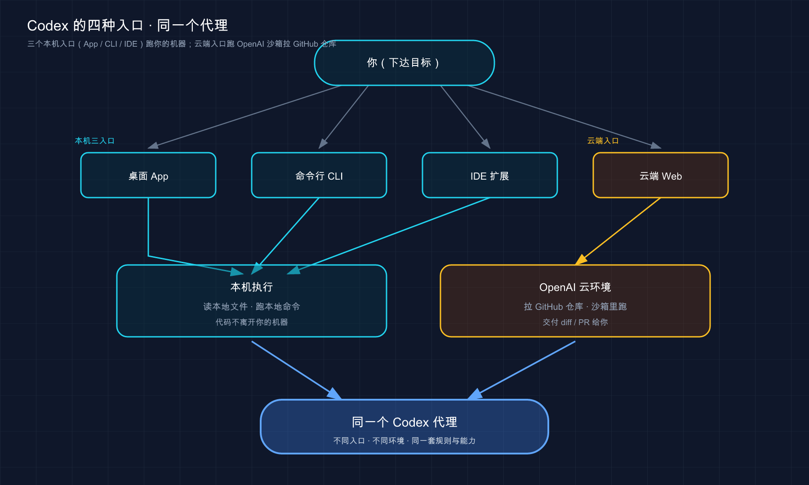

# 01 · 认识 Codex 与四种入口

> 📚 **系列导航**：这是「Codex 小白教程」的**开篇第一篇**。不用任何基础，咱们从「Codex 到底是个啥」讲起。下一篇〈02 核心概念速览〉，咱们把术语一次性捋顺。

---

> Codex 是什么、四种入口各干嘛、和 ChatGPT 及 Claude Code 到底差在哪

兄弟们，本教程来聊 OpenAI 的 Codex。

Codex，名字听着是不是很耳熟？OpenAI 几年前就有个叫 Codex 的老模型，打开它官网一看更懵——**怎么又是桌面 App、又是命令行、又是浏览器插件、还有个云端网页版？到底哪个才是「Codex 本体」？我该装哪个？**

说句实话，这正是 Codex 最容易把新手绕晕的地方：它不是「一个软件」，而是**同一个 AI 编程代理（Agent），它有四副面孔**。搞不清这点，你会在「该下载哪个」上卡半天。

这一篇不教安装、不敲命令（那是第 03 篇的事）。**它只干一件事：把「Codex 是个啥、四副面孔各管什么、跟 ChatGPT 和 Claude Code 差在哪」给你彻底讲明白**，让你心里先有张地图。地图有了，后面装哪个、用哪个，你自己就拿得准。

**看完这一篇，你会拿到：**

- 一句话跟人讲清楚「Codex 是什么」，不再被名字带偏
- 一张四种入口（桌面 App / CLI / IDE 扩展 / 云端 Web）的对照表，知道自己该从哪个进
- 一套判断：Codex 和 ChatGPT 差在哪、和 Claude Code 又差在哪，不再混为一谈
- 一个零成本小动作，30 秒确认你的电脑认不认识它

---



这张图把全篇的核心一眼摆出来：桌面 App、命令行 CLI、IDE 扩展、云端 Web 是 Codex 的四副面孔——长相和落脚处各不相同，背后却是同一个账号、同一套 Codex 代理打通互联。

---

## 01 Codex 到底是个啥

先给结论：**Codex 是 OpenAI 官方出的「AI 编程代理」——你给它一个目标，它能读你的整个项目、直接改文件、跑命令、跑测试，把活儿干完交给你验收，而不只是在聊天框里回你一段代码。**

OpenAI 你肯定不陌生，就是做 ChatGPT 那家公司。Codex 是它专门为「写代码」这个场景做的工具。按官方文档，它干的活儿主要是这么几类（这几条等于它的「能力清单」，先混个眼熟，第 02 篇再展开）：

- **写代码**：你描述要什么，它顺着你项目已有的结构和风格生成代码，不是甩给你一段孤立的片段。
- **读懂陌生代码库**：接手一个没文档的老项目，让它先「讲讲这项目架构」，比自己啃半天快得多。
- **审查代码**：帮你找潜在 bug、漏掉的边界条件、逻辑错误。
- **调试修复**：把报错甩给它，它顺着代码追根因、定位、给修复补丁。
- **自动化杂活**：重构、补测试、做迁移、配环境这类重复劳动，一句话委托出去。

这里有个新手最容易栽的关键区别，单独拎出来：

**类比：查菜谱（ChatGPT） vs 请私人厨师到家做饭（Codex）。** 你平时用 ChatGPT 写代码，像是查菜谱——它告诉你「这道菜放盐、放糖、翻炒三分钟」，但**锅还得你自己掂**：复制代码、切回编辑器、粘贴、改报错，全是你的手工活。Codex 不一样，它像个直接进了你厨房的厨子——你说「我想吃这个」，它自己翻冰箱（读文件）、开火（跑命令）、炒完端上桌（改完代码、跑过测试），你只管尝一口验收。

这个差别落到实际，体验是天壤之别。

举个我自己的例子。今年三月我重拾一个搁置了大半年的 Python 小爬虫，依赖早过期了，跑起来一堆报错。换成以前，我得把报错一条条复制到 ChatGPT、它告诉我「可能是某个库版本问题」、我再切回去查、改、再跑……一个下午就耗在来回切窗口上。这次我直接在项目目录里开了 Codex，丢一句「这项目跑不起来了，你查下根因然后修到能跑」，它自己翻遍 `requirements.txt` 和报错栈、定位到两个不兼容的依赖、改完版本号又跑了一遍确认。**我去接了杯咖啡回来，它已经在等我看 diff 了。**

这一下就能体会到「代理（Agent，能自主执行任务的 AI）」这个词的分量——**它不是给你出主意，是替你动手把活干完**。

> 💡 **一句话总结**：Codex = OpenAI 官方的 AI 编程代理，你给目标、它动手干完，不是「会写代码的聊天框」。

---

## 02 四副面孔：同一个 Codex，四种入口

这是 Codex 跟很多工具最不一样、也最容易把人绕晕的地方，咱们重点讲。

提到「命令行」「终端」，不少新手脑子里立马蹦出个黑乎乎的窗口，瞬间劝退。**别慌——Codex 恰恰是几个主流 AI 编程工具里，对「不想碰命令行的人」最友好的之一，因为它专门做了个图形界面的桌面 App。**

按官方文档，Codex 一共有**四种入口**，你从任意一个进都行：

| 入口 | 它长啥样 | 跑在哪 | 适合谁 / 什么场景 |
|------|---------|--------|------------------|
| **桌面 App**（Codex app） | 独立应用，图形界面、能可视化看 diff、多任务并排跑 | 你本机 | 不想碰命令行、喜欢点界面、要同时盯好几个任务的人 |
| **命令行 CLI**（Codex CLI） | 终端里敲 `codex` 的命令行工具 | 你本机 | 习惯终端、要写脚本做自动化、在服务器 / SSH 里干活的人 |
| **IDE 扩展**（IDE extension） | VS Code / Cursor / Windsurf / JetBrains 里的侧边栏插件 | 你本机 | 平时就泡在编辑器里写代码的人 |
| **云端 Web**（Codex cloud） | 浏览器打开 `chatgpt.com/codex` ，任务在 OpenAI 的云环境里跑 | 云端 | 起个长任务挂后台、并行跑多个、不占用本机的人 |

四个里前三个（桌面 App、CLI、IDE 扩展）都是**在你自己电脑上干活**——读的是你本机的文件，跑的是你本机的命令。只有第四个**云端 Web 不一样**：

**类比：把活外包出去。** 前三种入口，像你请了个助手坐你工位上，用你的电脑、你的资料干活，你全程看着。云端 Web 则像把任务**外包给一个远程团队**——你在浏览器里下个单，OpenAI 在它自己的云端起一个隔离环境，把你 GitHub 上的仓库拉过去，关起门来改，改完给你交一份 diff、甚至直接帮你提一个 PR（Pull Request，拉取请求）。你电脑关了它照样跑。

这种「外包」模式有两个实打实的好处：**一是并行**——你可以一口气甩出去三五个任务同时跑，互不阻塞；**二是隔离**——它在自己的沙箱里折腾，不碰你本机系统，搞砸了也波及不到你。我自己最常用的搭配是：手头小修小补用桌面 App 或 CLI 当场盯着，「跑全套测试再修好失败用例」这种又慢又长的活，丢去云端挂着，过会儿回来收。

这里有个特别关键、值得加粗记牢的点：

**这四个入口，背后是同一套 Codex，配置很大程度上能打通。** 比如你写的 `AGENTS.md`（项目说明文件，后面专篇讲）、你定义的 Skills（可复用的指令和工作流）——官方明确说能在桌面 App、CLI、IDE 扩展之间复用。**调教一次，多处能用。** 你之前用过其中任意一个，再开另一个，还能看到过去的项目记录。

> 一句友情提示：**新手别纠结「先学哪个」**。我的建议是——怕命令行就从**桌面 App** 起步（图形界面、有可视化 diff，最稳）；本来就爱泡终端的，直接上 **CLI**。本系列后面四个入口都会单独开篇细讲（第 07~10 篇），这里你只要记住「同一个 Codex，四副面孔」就够了。

> 💡 **一句话总结**：Codex 有桌面 App / CLI / IDE 扩展 / 云端 Web 四种入口，前三种在你本机干活、云端 Web 把活外包到云上跑，但底层是同一个 Codex、配置能打通。

---

## 03 它能干什么、不能干什么

能力清单第 01 节列过了，这里补最该认清的另一半——**它不能干什么**。这点比「能干什么」更值钱，因为新手翻车基本都翻在这。

| ❌ 别指望它做的事 | 为什么 |
|----------------|-------|
| 替你拍板技术方向 | 选哪套架构、值不值得重构、需求该怎么取舍——判断和决策是你的活，它不擅长全局系统设计 |
| 保证代码 100% 没 bug | 它给的是高质量候选，不是绝对正确答案，**改完必须你来 review** |
| 猜中你没说清的需求 | 你没讲明白的业务逻辑，它只能瞎猜，越自动越容易跑偏 |
| 在你完全看不懂的情况下全自动托管 | 你看不懂它改了啥，就没法判断对错，等于闭眼开车 |

最容易踩的是第二条。之前干过一件蠢事：让 Codex 给一个项目批量补错误处理，它刷刷改了十几个文件，当时图省事直接就提交了。结果有两处它「自作主张」顺手改了原有逻辑，过了好几天才发现一个接口行为变了。**从那以后我立了条铁规矩：它改的每一行，至少过一遍 diff 再提交。** 顺嘴提一句，Codex 官方在快速上手里也专门提到——动手前后用 Git 打个检查点（checkpoint，可以理解成给项目「存档」），万一改砸了一键回滚。这个习惯，新手越早养成越好。

用好 Codex 的心态，其实就一句话：

> 让 Codex 提供高质量候选方案，而不是绝对正确答案。

说白了——**人定方向、把关、做判断；AI 负责执行、分析、干重复劳动**。这是它的设计哲学：协作，不是替代。

> 💡 **一句话总结**：它能读项目、改文件、跑命令、干杂活，但拍板和把关永远是你的事——**它是搭档，不是甩手掌柜的接盘侠**。

---

## 04 Codex vs ChatGPT vs Claude Code

新手问得最多的两个问题：「Codex 跟 ChatGPT 不是一家吗，有啥区别？」「它跟 Claude Code 又差在哪？」一次说清。

### Codex 和 ChatGPT 差在哪

它俩同属 OpenAI，但**根本不是一个维度的东西**。

**类比：参谋 vs 特种兵。** ChatGPT 像个坐在指挥部的参谋——你把情况描述给他，他给你出主意、画方案，但**他不下场**，执行还得你自己来。Codex 像个能空降到现场的特种兵——你给个目标，他自己摸进你的项目（读文件、跑命令、改代码），把任务执行完再回来复命。

说白了：**ChatGPT 你问它答，Codex 你下指令它动手干。** 而且有意思的是——Codex 本身就含在 ChatGPT 的订阅里（按官方文档，**每个 ChatGPT 账号——包括免费档——都含 Codex 用量**，付费档 Plus / Pro / Business / Edu / Enterprise 额度更高），也可以用 OpenAI 的 API key 按量付费接入。具体哪档订阅给多少额度、各功能在不同登录方式下有没有差异，**变化较快，一律以官方计费页为准**（这块第 04 篇专门讲）。

### Codex 和 Claude Code 差在哪

这俩常被放一起比。先泼盆冷水：**别问「哪个更强」，这俩定位太像了，强弱要看你具体怎么用。** 真正的差别在「工作流重心」：

| 维度 | **Codex**（OpenAI） | **Claude Code**（Anthropic） |
|------|--------------------|------------------------------|
| **出身** | OpenAI，底层用 GPT 系列模型 | Anthropic，底层用 Claude 系列模型 |
| **最顺手的入口** | 官方做了**图形界面桌面 App**，对不碰命令行的人友好 | **终端（CLI）原生**，功能最全也最能讲透原理 |
| **项目说明文件** | `AGENTS.md` | `CLAUDE.md` |
| **四种入口** | 桌面 App / CLI / IDE 扩展 / 云端 Web | 终端 / 编辑器插件 / 桌面 App / 网页·手机 |
| **能不能改文件、跑命令** | 能，是个真·代理 | 能，是个真·代理 |

看出来没——**两者骨架几乎一样**：都是「能读项目、能动手」的编程代理，都有本机 + 云端多种入口，都用一个项目说明文件来「调教」。最直观的差异有两点：一是**血统不同**（GPT vs Claude，背后模型不一样）；二是**默认气质不同**——Codex 官方力推那个图形界面的桌面 App，明摆着想拉「不想碰命令行」的人；Claude Code 则是终端原生、命令行味儿更浓。

我自己俩都在用，分工大致是：**需要图形界面、想可视化盯着 diff、或者一个项目里并行开好几条线**的活，我用 Codex 的桌面 App；**钻在终端里、要接一堆自定义脚本和钩子**的活，我留给 Claude Code。一个补充而不是替代另一个。

> 注意：模型谁更聪明、价格谁更划算、各自开放了哪些功能，这些**变化极快**，今天的结论下周可能就过期。所以本篇刻意不写死任何跑分和价格数字——**要对比这些，请直接看两家各自的官方页面。**

> 💡 **一句话总结**：ChatGPT 是出主意的参谋、Codex 是 OpenAI 家能动手的特种兵；Codex 和 Claude Code 是「同类不同家」的两个编程代理，骨架像、血统和默认气质不同，别二选一，按活儿派工。

---

## 05 动手：30 秒确认你的电脑认不认识它

说好这篇不教安装，但留个**零成本小动作**，确认下你的环境（装没装，这条命令都能跑，不会搞坏任何东西）。

打开你的终端（Mac 用「终端 / Terminal」App，Windows 用 PowerShell），敲这一行回车：

```bash
codex --version
```

**两种预期结果，都正常：**

- **情况一**：蹦出一串版本号——恭喜，你之前装过 CLI，第 03 篇可以直接跳到「用起来」。
- **情况二**：报错 `command not found: codex` （Windows 上可能是 `'codex' 不是内部或外部命令`）——也完全正常，说明 CLI 还没装，**这正是第 03 篇要解决的第一件事**。

提前剧透一下 CLI 的安装命令（**现在别急着敲，先混个眼熟**），官方原版长这样：

```bash
# macOS / Linux：标准安装脚本
curl -fsSL https://chatgpt.com/codex/install.sh | sh
```

```powershell
# Windows PowerShell
powershell -ExecutionPolicy ByPass -c "irm https://chatgpt.com/codex/install.ps1 | iex"
```

装完在终端敲一句 `codex` ，它会引导你登录（用 ChatGPT 账号或 OpenAI API key），然后就能在当前目录里干活了。

> 提醒一：上面是**命令行 CLI** 的装法。如果你怕命令行，桌面 App 走的是「下载安装包、双击装」的图形界面路子（macOS / Windows 有，Linux 目前还在等通知排队），跟装普通软件没区别——第 03 篇会四种入口分开讲，一步不漏。

> 提醒二：Codex 背靠 OpenAI / ChatGPT 的账号体系，国内用户安装和登录通常需要「魔法上网」，具体怎么搞、账号怎么登，第 03 篇专门讲，这里先不展开。

下面这张图，把四种入口的「本机 / 云端」关系理一下，看不到图也不影响理解，记住上面那张表就够了：



这张图想说的是：四个入口都是你向 Codex 下达目标的「门」，前三扇门通向你的本机、最后一扇通向 OpenAI 的云，但门后是**同一个 Codex**。

> 💡 **一句话总结**：一条 `codex --version` 就能确认电脑认不认识它——报错也别慌，那是第 03 篇的开场任务；怕命令行就记住还有个图形界面的桌面 App 可选。

---

## 06 小结

这一篇没敲几行命令，但把开头最该想明白的事捋清了：

- **它是什么**：OpenAI 官方的 AI 编程代理，你给目标、它读项目、动手改、跑命令、把活干完——不是「会写代码的聊天框」。
- **四副面孔**：桌面 App、CLI、IDE 扩展、云端 Web 四种入口，前三种在你本机干活、云端 Web 把活外包到云上跑，**底层同一个 Codex、配置能打通**。
- **能 / 不能**：能读代码、改文件、修 bug、干杂活；但拍板、把关、补需求**永远是你的活**，改完一定过 diff。
- **和谁怎么比**：ChatGPT 是参谋、Codex 是能动手的特种兵；Codex 和 Claude Code 是同类不同家，骨架像、血统和气质不同，**按活儿派工，别二选一**。

**你现在应该能**：跟同事一句话讲清 Codex 是什么，也能判断自己该从哪个入口进门、什么活儿该交给它。这就是入门最该先有的「地图感」——后面所有功能，都是在这张地图上添砖加瓦。

---

下一篇 **〈02 核心概念速览〉**：咱们把 Codex 世界里那堆术语一次性捋顺——代理循环、上下文、`AGENTS.md`、审批模式、沙箱、Skills、MCP……都是后面天天打交道的词。先去把上面那条 `codex --version` 敲一下，看看你属于「情况一」还是「情况二」，第 03 篇正好对症下药。
