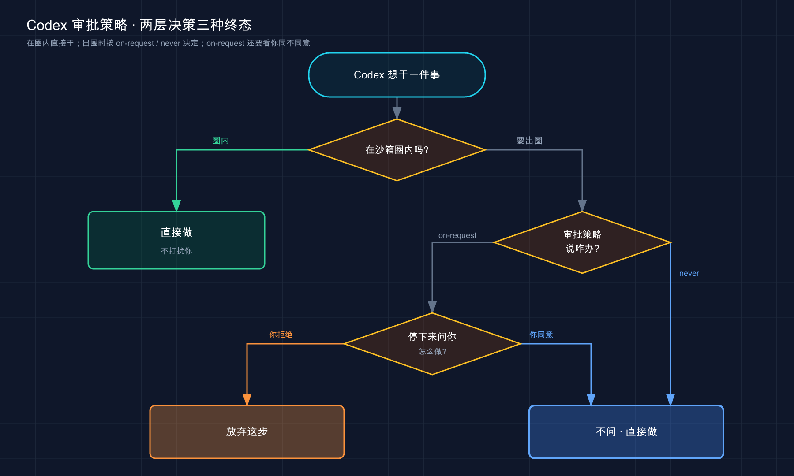
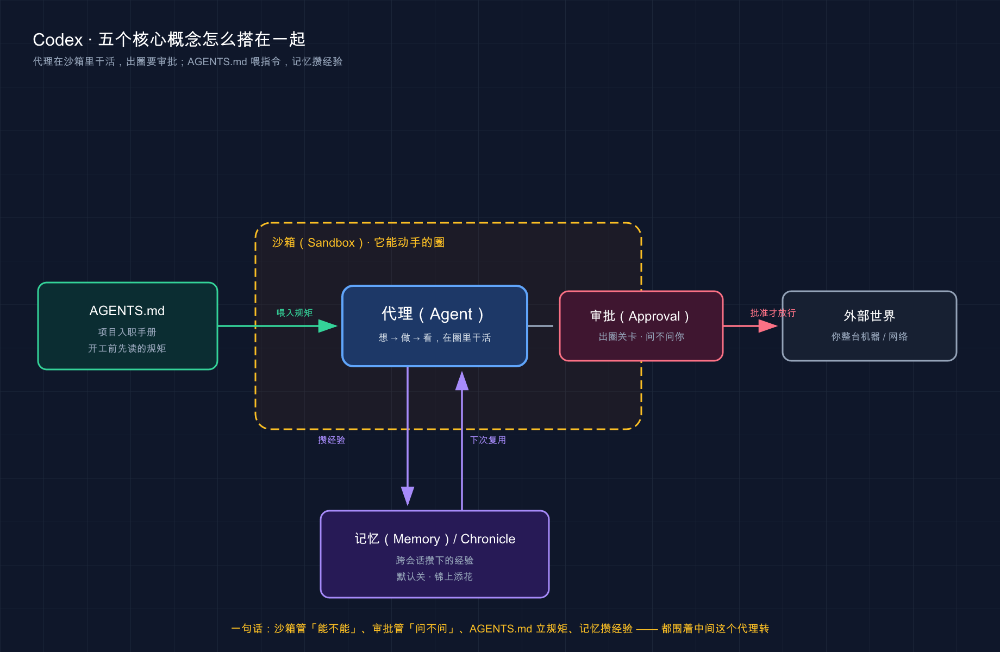

# 02 · Codex 核心概念速览

> 📚 **系列导航**：上一篇 [01 · 认识 Codex 与四种入口](01-what-is-codex.md) 带你认全了 Codex 的四张脸——桌面 App、命令行、IDE 扩展、云端。这一篇往里走一层，把后面所有章节都要反复用到的几个核心概念，一次性讲透。下一篇 [03 · 安装与登录](03-install.md) 再正式动手装。

先说个之前我自己干的蠢事，刚开始用 Codex 那会儿，张口就问它「帮我把这三个文件批量重命名」，它噼里啪啦改完，一看傻眼了——它只动了当前项目目录里的，桌面上那两个**纹丝没动**。我当时还纳闷：不是说能跑命令吗，咋还挑食？后来翻文档才反应过来：那是**沙箱**（Sandbox）在拦着，它默认只能在你指定的工作区里动手，出了这个圈得先问你。

那一刻我才明白：**用 Codex 之前不搞懂这几个概念，你会一直觉得它「时灵时不灵」**——其实它一点没乱，是你不知道它头上戴着几道紧箍咒。

这一篇就把这几道紧箍咒、外加它的几样独门配置，掰开揉碎讲清楚。

**看完这一篇，你会拿到：**

- 一句话讲明白 Codex 的「代理（Agent）」是什么，以及它和聊天机器人差在哪
- 彻底搞懂**沙箱**和**审批**这对兄弟——为什么我那次重命名会失败，以及怎么放开它
- 认识 `AGENTS.md`：让 Codex 记住你项目规矩的那张「入职手册」
- 知道**记忆**（Memory）和 **Chronicle** 是什么、默认开没开、能不能用
- 一个能照着跑的小实验，亲眼看清沙箱拦你那一下

> ⚠️ 下文凡涉及具体命令、配置项、默认行为，都以 Codex [官方文档](https://developers.openai.com/codex) 为准；模型名、套餐这类会随版本变的东西，看到时以你本地实际显示为准。

---

## 01 代理（Agent）：它会自己动手，不只是回你话

先说结论，一句话：**Codex 是 OpenAI 的「编程代理（coding agent）」，能自己读代码、改文件、跑命令，而不只是给你回一段文字。** 官方原话就是 "OpenAI's coding agent that can read, edit, and run code"。

这里的「代理（Agent）」是关键词，第一次见得解释一句：**代理 = 能自己拆解任务、调工具、看结果、再决定下一步的 AI，不是一问一答的聊天框。**

官方描述 Codex 干活的方式是这么一句：**「代理在一个循环里跑终端命令，它改代码、跑检查、尝试验证自己的工作」**（原文：The agent runs terminal commands in a loop. It edits code, runs checks, and tries to validate its work）。

翻译成大白话，还是那三个动作——**想 → 做 → 看**：

- **想**：读相关文件、看报错、搞清楚状况
- **做**：改代码、建文件、跑命令
- **看**：跑测试、看输出，不对就回头再来一轮

**类比：一个肯自己跑腿的代购。** 普通聊天机器人像个只会查价格的客服——你问它「这件衣服多少钱」，它告诉你，完事。Codex 像个代购：你说「帮我买件均码的黑卫衣」，它自己去翻货、比价、下单、收到货还拆开检查尺码对不对，不对再退换。**「自己跑完整个流程」才是代理和聊天框的本质区别。**

几个你真会遇到的场景：

- 你说「这个测试为啥挂了」，它**自己跑测试 → 读报错 → 找到 bug → 改 → 再跑一遍确认**，全程你就看着。
- 你扔给它一个没文档的老项目说「理一下结构」，它自己查看当前目录里有哪些文件、自己搜关键字、读一堆文件，最后给你画张图——**你一个文件都没指定**。
- 你说「把这个函数加上缓存」，它改完顺手把相关调用处也一起捋了，因为它能跨文件看全局。

> 💡 **一句话总结**：Codex 是「代理」不是「聊天框」——它在「想→做→看」的循环里自己把活干完，**这套机制和 Claude Code 一模一样，换了个壳而已**。

---

## 02 沙箱（Sandbox）：它动手的圈，画在哪

来了，重点。开头我那次重命名失败，罪魁祸首就是它。

**沙箱（Sandbox）**：官方定义是「让 Codex 能自主行动、又不至于对你整台机器有无限权限的那道边界（boundary）」。说白了，**它就是给 Codex 画的一个圈——圈内的事它自己干，要出圈，先问你**。

**类比：商场里的儿童乐园。** 你把娃放进围栏，里头的滑梯海洋球随便玩，你不用每个动作都盯着；但娃想翻出围栏跑到停车场，警报就响了，得你点头。沙箱就是这个围栏：**圈内自由活动免打扰，出圈才拦你**——既省得你一惊一乍，又不怕它闯祸。

这道围栏管两样东西：**它能改哪些文件、能不能联网**。官方给了三种常见的沙箱模式：

| 沙箱模式 | 能改文件吗 | 能联网吗 | 啥时候用 |
|---|---|---|---|
| `read-only`（只读） | ❌ 不能（要改得先批） | ❌ | 只想让它读代码、做审查、出方案，别动我东西 |
| `workspace-write`（工作区可写） | ✅ 仅限工作区内 | ❌ 默认不行 | **日常开发最常用**；版本控制目录下 Codex 默认推荐这个，非版本控制目录默认 `read-only` |
| `danger-full-access`（完全访问） | ✅ 全机器 | ✅ | 完全信任的环境，**名字带 danger 不是吓你的，慎用** |

看到 `workspace-write` 那行「仅限工作区内」没有？**这就是我桌面文件没被改的原因**——它们不在我启动 Codex 的那个项目目录里，压根不在围栏内。不是 Codex 偷懒，是它真的够不着。

还有个细节官方特意强调了：**沙箱不只管 Codex 自己的读写，它派生出去的命令也一样受限**。也就是说，哪怕它调用 `git`、包管理器、测试脚本，这些命令也都被关在同一个圈里——不会有「主进程被关着、子命令却越狱」的漏子。

平台上各有各的实现，这点你装的时候会碰到（细节留到 [03 安装与登录](03-install.md) 讲）：

- **macOS**：用系统自带的 Seatbelt 框架，**开箱即用**，啥都不用配。
- **Windows**：直接在 Windows 原生环境运行，用原生 Windows 沙箱（分 `elevated` 和 `unelevated` 两种模式）；用 WSL2 则走 Linux 那套实现。
- **Linux / WSL2**：得先自己装一个叫 `bubblewrap` 的东西，沙箱才正常工作（这是官方明确要求的前置条件）。

> 💡 **一句话总结**：沙箱是 Codex 头上的第一道紧箍咒——**默认（`workspace-write`）只让它在你的工作区里改文件、还不许联网**；想让它管更宽，得自己把圈画大。

---

## 03 审批（Approval）：到了围栏边，谁来点头

沙箱画好了圈，那「出圈的时候找谁批」——这是另一码事，叫**审批（Approval）**。

很多人（包括当初的我）会把这俩搞混，官方专门点了一句，值得记住：**沙箱定义的是技术边界，审批策略决定的是 Codex 何时必须停下来、跨界之前先问你。**

**类比：门禁卡 + 保安。** 沙箱是那道**门禁**（物理上拦着你出不去），审批是门口那个**保安的脾气**——有的保安见谁都放（`never`），有的只拦陌生人（`untrusted`），有的是你想出门就喊一嗓子问一下（`on-request`）。门是死的，保安的松紧是你能调的。

官方给的三种常见审批策略：

| 审批策略 | Codex 的行为 | 大白话 |
|---|---|---|
| `untrusted` | 不在「可信集合」里的命令，跑之前先问 | 只防陌生命令 |
| `on-request` | 默认在沙箱里干，**需要出圈时才停下来问** | 最常用的平衡档 |
| `never` | 不弹审批，闷头干 | 全自动，配合完全访问才有意义 |

注意：这里的 `untrusted / on-request / never` 是官方文档里的三种审批策略——它们和沙箱模式是两个独立的维度，分开配置、分开理解。

这俩怎么搭？官方给了两个现成组合，记这两个就够用：

- **低风险本地自动化**（推荐日常）：`sandbox_mode = "workspace-write"` 配 `approval_policy = "on-request"`。围栏锁着、出圈才问，安全又不烦。
- **完全放开**（慎用）：`sandbox_mode = "danger-full-access"` 配 `approval_policy = "never"`。等于把门拆了、保安也放假——**只在你 100% 信任的环境用**。

我自己的习惯是：**新项目、不熟的代码库，一律先 `read-only` 让它只读只分析**，等我看完它的方案、心里有底了，再切到 `workspace-write` 放它动手。有次我图省事直接上 `danger-full-access` 跑一个批量脚本，它在我半个主目录里翻文件，看得我手心冒汗——从那以后我再没在不该用的地方开过完全访问。

怎么切？日常你不用碰配置文件，在 CLI 会话里一句 `/permissions` 就能当场换模式（桌面 App 和 IDE 里则是输入框旁边的权限选择器）。想让它每次启动都用同一套，再去写配置文件——那是 [18 config.toml 配置详解](18-config.md) 的活，这里先知道有这么个开关。

下面这张图把沙箱和审批的关系理一遍：



这张图在干什么：它说清了一件事——**Codex 每要做一步，先看「在不在沙箱圈内」（沙箱说了算），出圈了再看「要不要问你」（审批说了算）**。两道关卡，各管各的。

> 💡 **一句话总结**：沙箱管「能不能」、审批管「问不问」，**两个旋钮分开拧**；日常 `workspace-write` + `on-request` 这套组合，安全和省心兼顾。

---

## 04 AGENTS.md：给 Codex 的项目入职手册

前三节讲的是「权限」。这一节换个话题：**怎么让 Codex 记住你这个项目的规矩**，省得每次都得重新交代一遍。

答案是一个叫 `AGENTS.md` 的文件。

**类比：给新员工的入职手册。** 新人来公司，你不会每天追在屁股后面念叨「咱们用 pnpm 不用 npm」「提交信息要写中文」——你给他一本手册，他自己看。`AGENTS.md` 就是给 Codex 的这本手册：**放进项目里，它每次开工前先读，按里头的规矩办**。

官方对它的定位是「durable project guidance」——跟着仓库走、在代理开始干活之前就生效的持久指引。一句话嘱咐：**保持精简（Keep it small）**，别把它写成长篇大论。

里头通常写这些（官方给的例子）：

- 构建和测试命令（比如「测试用 `pytest -q`」）
- 代码审查的期望（比如「改完必须跑 lint」）
- 这个仓库特有的约定（比如目录怎么放、命名怎么取）

它能放在两个层级，**离工作目录越近的越优先**（这点和优先级判断很关键）：

| 层级 | 放哪 | 管谁 |
|---|---|---|
| 全局 | `~/.codex/AGENTS.md` | 你这个人的偏好（比如「回我话简洁点」），跨所有项目生效 |
| 项目 | 仓库根目录或子目录里的 `AGENTS.md` | 这个项目 / 团队的规矩，可以提交进 Git 全队共享 |

最妙的用法官方点了出来，我自己也最爱用——**把它当反馈回路（feedback loop）**：当 Codex 对你的代码库做了错误假设，你别光在对话里纠正（那是一次性的，下次它又忘），直接**让它把这条修正写进 `AGENTS.md`**，下回开新会话它自己就继承了。我给一个 Python 项目调了两周，`AGENTS.md` 从空白长到二十来行，全是它踩过、被我逮住、然后自己记下来的坑——现在新会话基本不犯重复错误了。

> `AGENTS.md` 之于 Codex，约等于 `CLAUDE.md` 之于 Claude Code——**同一个概念，换了个文件名**。

> 💡 **一句话总结**：`AGENTS.md` 是 Codex 的项目入职手册——**写下你项目的规矩，它每次开工先读**；把它当反馈回路，犯一次错就记一条，越用越顺手。

---

## 05 记忆（Memory）与 Chronicle：它能不能「记住」你

最后这组概念，是 Codex 比较新、也容易让人误会的地方——**它到底能不能记住你之前聊过的东西？**

先把两个词分清楚：

**记忆（Memory）**：让 Codex 把**早先会话里学到的有用信息**带到后面的工作里——比如你的技术栈、项目惯例、踩过的坑，省得每开一个会话都重新交代。

**类比：一个跟久了的老搭档。** 新来的助理你得反复教「我们用 TypeScript、不写分号」；跟你三年的老搭档，你一个眼神他就懂——因为他**记着**你的习惯。Memory 就是把 Codex 从「新来的」往「老搭档」上带。

但有几个**关键的事实**你必须知道，不然又会觉得它「时灵时不灵」：

- **默认是关的（off by default）。** 不主动开，它不会记任何东西。开的方式：在 Codex App 设置里打开，或在 `~/.codex/config.toml` 的 `[features]` 段里写 `memories = true`。
- **有地区限制。** 官方明说：发布时**欧洲经济区、英国、瑞士暂不可用**。
- **不是实时更新的。** 它会等一个会话「闲置足够久」、确认你不是还在干活，才在后台悄悄总结成记忆——所以你刚结束会话，记忆可能还没写进去。
- **存在本地**：默认放在 `~/.codex/memories/` 下，是一堆生成的 markdown 文件。
- **能逐会话控制**：在 App 和 CLI 里用 `/memories` 决定「当前这个会话要不要用已有记忆、要不要拿来生成新记忆」。

官方还补了句要紧的：**真正必须每次都生效的团队规矩，老老实实写进 `AGENTS.md`**，别指望记忆——记忆是「锦上添花的本地回忆层」，不是规则的唯一来源。这话我深有体会：记忆这东西是概率性的，靠它兜底重要规矩，迟早翻车。

> 💡 **一句话总结**：记忆是「老搭档」模式，但默认关着、有地区限制——重要规矩还是靠 `AGENTS.md`，记忆只管锦上添花的部分。

再说 **Chronicle**，开头先标清楚：

> ⚠️ **实验性，可能变化。** Chronicle 目前是「需主动开启的研究预览（opt-in research preview）」，**只对 ChatGPT Pro 用户、且只在 macOS 上可用**，欧盟、英国、瑞士同样还没有。

**Chronicle 是给记忆「喂屏幕」的。** 普通记忆是从你和 Codex 的**对话**里学；Chronicle 更进一步，**用你屏幕上的内容**帮 Codex 理解你最近在忙啥——你正看着哪个文件、哪个 PR、哪个文档，它能顺着接上，省得你从头解释。

**类比：一个能看你屏幕的搭档。** 普通搭档只能听你说；Chronicle 这个搭档还能瞟一眼你的显示器，「哦你在看这个报错」，于是不用你复述。听着很爽，但代价也实在——官方明明白白警告了三条：**吃配额很快、会增加提示注入（prompt injection）的风险、记忆是不加密地存在你本地的**。换句话说，**方便和风险都摆在台面上，自己掂量**。我个人态度：尝鲜可以，敏感屏幕内容（密码、私信、客户数据）面前，记得用菜单栏的「Pause Chronicle」暂停它。

| 维度 | 记忆（Memory） | Chronicle |
|---|---|---|
| 信息从哪来 | 之前的**对话**会话 | 你的**屏幕**内容 |
| 成熟度 | 正式功能（默认关） | **研究预览（实验性）** |
| 平台 | 跟随 App / CLI | **仅 macOS、仅 Pro** |
| 我的建议 | 想省事可以开 | 尝鲜可以，敏感场景记得暂停 |

> 💡 **一句话总结**：记忆让 Codex 从「新人」变「老搭档」，**但默认关着、有地区限制、还别拿它替代 `AGENTS.md`**；Chronicle 是实验性的「看屏幕」增强，方便但风险也明摆着。

---

五个概念单独讲完了，在进入动手环节之前，用一张图把它们串起来看一眼——单独理解每个概念容易，但它们怎么协作才是关键：



这张图在干什么：**中间那个「代理」是主角，它被关在「沙箱」这个圈里干活**；想出圈到外部世界（你整台机器、网络），得先过「审批」这道关卡；左边的 `AGENTS.md` 在它开工前把项目规矩喂进去；下边的「记忆 / Chronicle」则跨会话帮它攒经验、下次复用——**五个概念全是围着中间这个代理转的**。

---

## 06 动手：亲眼看沙箱拦你那一下

光读概念记不住。跑个一分钟的小实验，**亲眼看沙箱在 `read-only` 模式下怎么拦住一次写操作**——这是这一篇最该有体感的地方。**实验不依赖任何现成项目，新建个空文件夹就行。**

**第一步：建个空目录，进去启动 Codex。**

在终端里跑（Mac / Linux；Windows 用 PowerShell，把 `mkdir -p` 换成 `mkdir`）：

```bash
mkdir -p ~/codex-demo && cd ~/codex-demo
codex
```

> 还没装 Codex？没关系，这一篇先建立概念，[03 安装与登录](03-install.md) 会手把手带你装好再回来跑。

**第二步：切到只读模式。**

在 Codex 会话里输入斜杠命令，把权限调到只读：

```text
/permissions
```

然后在弹出的选项里选只读那一档（`Read Only` / `read-only`）。**预期看到**：界面提示当前进入只读模式，类似——

```text
Permissions updated: read-only
```

> ⚠️ **新版菜单可能不同**：codex-cli **0.142** 起，官方推出了 [permission profiles](https://developers.openai.com/codex/permissions)（标记 **Beta，may change**）替代旧的「Read Only / Auto / Full Access」预设——你的 `/permissions` 菜单可能变成了 `Ask for approval` / `Approval for me` / `Full access` 这类**审批策略**的档（不再直接出现 `Read Only`）。
>
> 如果你看不到 `Read Only` 选项，**走旧 sandbox 模式最稳**（官方保留兼容）：先退出会话，用 `codex --sandbox read-only` 重新进入；或在 `~/.codex/config.toml` 写 `sandbox_mode = "read-only"` 永久生效。本节后续实验按这套兜底全部跑得通。
>
> 这块属于「实验性，可能变化」，本教程后续涉及 `/permissions` 切只读的地方都同此说明，不再重复。

**第三步：让它干一件「要写文件」的事，看它被拦。**

丢这么一句给它：

```text
帮我新建一个文件 hello.txt，里面写一行字 "hello codex"。
```

**预期看到**：它**不会**默默把文件建好，而是**停下来请求你的批准**——因为「写文件」这一步突破了 `read-only` 的边界，按审批策略它必须先问你。大意是：

```text
我需要创建文件 hello.txt，这超出了当前只读模式的权限，
是否允许？(y/n)
```

**看到这个「停下来问」的瞬间，你就亲眼见到沙箱 + 审批联手干活了**：沙箱判定「这步要出圈」，审批接着弹出来找你点头。这正是第 02、03 节讲的两道关卡，在屏幕上活生生跑了一遍。

**第四步：对比一下放开后的样子。**

回 `/permissions` 切到工作区可写（`workspace-write`），再让它建一次 `hello.txt`。这回**预期**它直接建好、不再问你——因为在工作区里写文件本就在沙箱圈内，无需审批。

```text
已创建 hello.txt
```

跑完用 `/status` 看一眼当前会话的模型、审批策略这些信息，心里就更有数了：

```text
/status
```

**同一个建文件的请求，只读时被拦、可写时放行**——这就是沙箱模式实打实的区别。比起读十遍「沙箱是安全边界」，**亲眼看它在只读模式下停下来问你那一下，理解得快得多**。

> 💡 **一句话总结**：跑一遍这个最小实验，你会亲眼看到——**同一个写文件请求，`read-only` 拦下来问、`workspace-write` 直接放行**，沙箱和审批就是这么联手的。

---

## 07 小结

这一篇把 Codex 后面所有章节都要用到的核心概念，一次铺平了：

| 概念 | 一句话记住 | 对应 Claude Code 的啥 |
|---|---|---|
| **代理（Agent）** | 会自己想→做→看的 AI，不是聊天框 | 代理循环，一模一样 |
| **沙箱（Sandbox）** | 给它画的圈，管「能改哪、能不能联网」 | 类似权限边界，但更显式 |
| **审批（Approval）** | 出圈时问不问你，和沙箱是两个旋钮 | 类似权限模式 |
| **AGENTS.md** | 项目入职手册，写下规矩它每次先读 | 就是 `CLAUDE.md` 换名 |
| **记忆 / Chronicle** | 让它记住你的偏好；Chronicle 看屏幕、实验性 | 类似 memory，Chronicle 是新东西 |

你现在应该能看懂：为什么 Codex 有时「不肯」改某个文件（不在沙箱圈内）、为什么它会突然停下来问你（要出圈、审批拦着）、以及怎么用 `AGENTS.md` 让它记住你的规矩、用 `/permissions` 当场调松紧。

**最该带走的一句话**：Codex 不是个许愿池，而是个**戴着紧箍咒的能干搭档**——你的活儿是给方向、画好它能动手的圈、跑偏时拉一把。把这几个概念吃透，后面学各个入口、配置、扩展，都是在这套地基上添砖加瓦。

---

下一篇 **03 · 安装与登录**：概念懂了，该真刀真枪把 Codex 装到你机器上了。下一篇带你在 Mac / Windows / Linux 上装好 Codex、登录账号、跑通第一句话——尤其 Linux 用户，还记得本篇说的那个 `bubblewrap` 吗？装的时候你就知道它派什么用场了。
