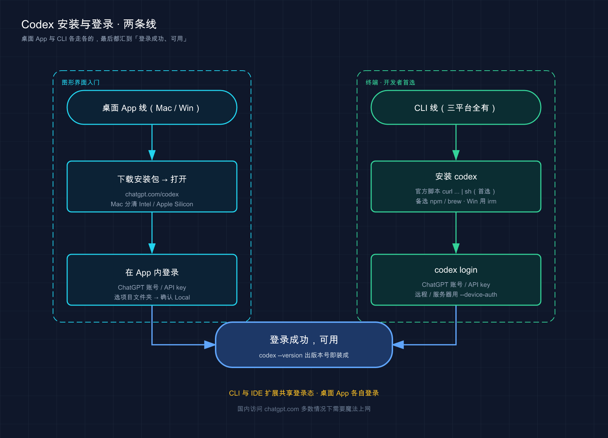
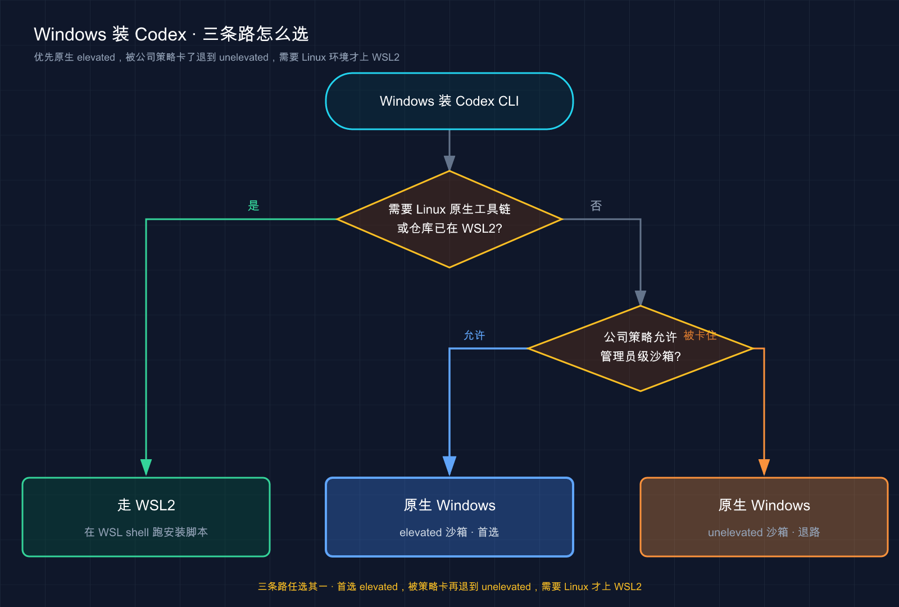
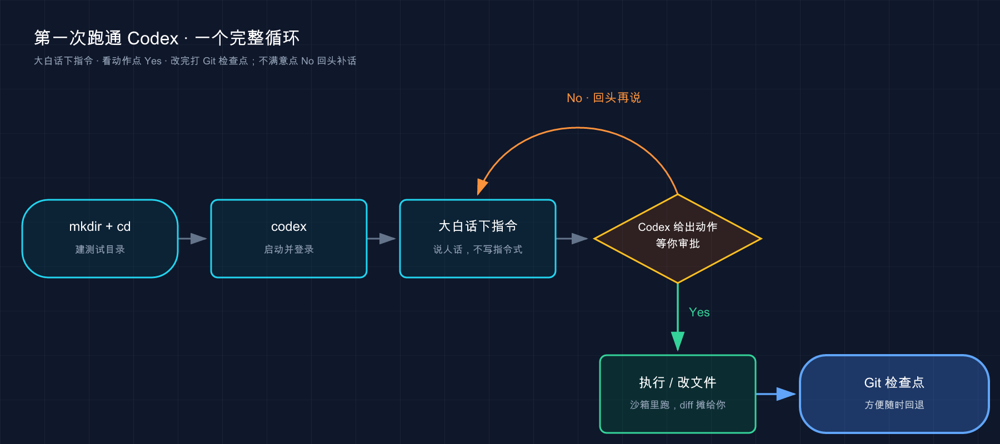

# 03 · 安装与登录（Mac / Windows / Linux）

> 📚 **系列导航**：上一篇 [02 · 核心概念速览](02-core-concepts.md) 把 Codex 的几个关键词（代理、沙箱、审批、本地 / 云端）讲明白了。这一篇带你真正把它装到自己电脑上——**桌面 App 和 CLI 两条线都覆盖**，登录授权、三平台差异、常见装机故障一次说透。下一篇 [04 · 订阅与计费](04-pricing.md) 再聊钱的事。

OpenAI 在 2026 年初把 Codex 拆成了**四个入口**：网页版、桌面 App、CLI、IDE 扩展。我自己从 CLI 一路用到桌面 App，最直观的感受是——**装哪个、怎么装，官方说法跟你随手搜到的老教程经常对不上**。

其实，**装 Codex 本身不难，难的是没人告诉你哪条路是官方的正路、哪条是过时的坑**。这篇就把每个平台、每种装法的正路标清楚，让你别重蹈我朋友的覆辙。

**看完这一篇，你会拿到：**

- 桌面 App 与 CLI 两条安装线，在 Mac / Windows / Linux 上各自怎么走（带预期输出，能自己验证装没装成功）
- CLI 三种装法（官方脚本 / Homebrew / npm）的对比，知道自己该选哪个
- 两种登录方式（ChatGPT 账号 / API key）的区别，以及远程 / 服务器环境登录卡住的标准解法
- 一份「报错 → 怎么修」的速查表，覆盖大多数新手会撞上的坑

---

## 01 装之前先搞清楚三件事

别急着敲命令。太多人装到一半才发现「原来这平台还没桌面版」「这账号还得开 MFA」，白折腾。三件事先确认一下。

### 第一件：你打算从哪个入口用它

Codex 有四个入口，但**安装这件事**上，真正要选的是两条线：

- **桌面 App**：图形界面、点点就能用，适合不爱碰终端的人。但**只有 macOS 和 Windows 有，Linux 暂时没有**（官方挂了个 Linux 通知等候页）。
- **CLI（命令行）**：跑在终端里的编程代理，**三大平台全支持**，也是开发者最常用的方式。

**我的建议：开发者直接学 CLI，它最通用、跨平台没死角。** 这篇以 CLI 为主线，桌面 App 单开一节讲下载和首次登录。装哪个先用都行——登录态在 **CLI 和 IDE 扩展之间共享**（桌面 App 各自登录，第 06 节会讲）。

### 第二件：你得有个能用的账号

**新手最容易忽略的一条：Codex 跟着 ChatGPT 套餐走。**

官方明确：ChatGPT 的 **Plus、Pro、Business、Edu、Enterprise** 套餐都**包含** Codex 用量。你也可以不绑套餐、改用 **OpenAI API key** 按量付费——但用 API key 登录时，**部分依赖 ChatGPT 工作区的功能会受限或不可用**（比如云端 Codex 就强制要 ChatGPT 登录）。

> 用 API key 跑本地 CLI 是 OK 的，OpenAI 按标准 API 价格从你的 Platform 账户扣费，跟套餐里那份额度是两本账。

账号和计费的细节，下一篇 [04 · 订阅与计费](04-pricing.md) 专门展开。本篇默认你手里有一个能用的 ChatGPT 套餐或 API key。

### 第三件：网络得能上 OpenAI

Codex 不管哪个入口都要联网，而且连的是 OpenAI 的服务器。**国内网络访问 `chatgpt.com` 、`platform.openai.com` 这些域名多数情况下需要魔法上网**，装的时候、登录的时候、平时跑任务的时候都得挂着，否则极易卡在「下载超时」「登录回调失败」上。这是国内用户踩坑的第一大来源，先把代理备好。

> 💡 一句话总结：开装前确认三件事——**入口选 CLI（跨平台无死角）、账号是 ChatGPT 套餐或 API key、网络能稳定上 OpenAI**，这三关过了再敲命令。

---

## 02 路线一：桌面 App（Mac / Windows）

不爱碰终端的，从桌面 App 入门最省事。

**类比：桌面 App 就像装了个「带工程目录的 ChatGPT」。** 你平时用 ChatGPT 网页版怎么聊天，它就怎么聊；区别是它能绑定你电脑上的一个文件夹，在里面读文件、改代码、跑命令——相当于把聊天框、IDE 工程目录、长期记忆三样缝在了一起。

真实场景：

- 你是产品 / 设计，不写代码但想让 AI 帮你改个小需求、看看项目里某个功能怎么实现的。
- 你想多个项目并行——A 项目让它跑测试的同时，切到 B 项目继续提需求。
- 你想要图形化的「审查面板」一行行看它改了什么，再决定接不接受。

### 下载与安装

打开 <https://chatgpt.com/codex> ，下载对应平台的安装包：

| 平台 | 怎么选 |
|------|--------|
| **macOS（Apple Silicon）** | 直接下载默认包 |
| **macOS（Intel 芯片）** | 选 **Intel build**，别下错 |
| **Windows** | 下载官网安装包 |
| **Linux** | 暂无桌面 App，官网填表[等通知](https://openai.com/form/codex-app/) ；先用 CLI |

> Mac 用户分不清自己是 Intel 还是 Apple Silicon？点屏幕左上角苹果图标 →「关于本机」，「芯片」那行写 Apple M 系列就是 Apple Silicon，写 Intel 就下 Intel build。下错芯片版本会装不上或一跑就崩。

### 首次登录与选项目

装好打开 App，按三步走：

1. **登录**：用 ChatGPT 账号或 OpenAI API key 登录（API key 登录部分功能受限，见下一节）。
2. **选项目**：挑一个你想让 Codex 工作的文件夹。之前用过 App / CLI / IDE 扩展的话，这里会列出历史项目。
3. **发第一条消息**：选好项目后，**确认左下角选的是 Local**（让 Codex 在你本机干活，而不是云端），然后把需求打进输入框。

第一次进去先别急着上手复杂功能，**把注意力放在「对话」和「项目」两样上**：对话就跟 ChatGPT 网页版一样聊；项目则会绑定到你电脑的一个文件夹，Codex 只在这个目录里动手。

装好打开后，可在左下角「设置 → 常规 → 语言」切换语言（App 能自动识别）。注意右边栏和底部栏需通过右上角图标展开。界面大致如下：


> 💡 一句话总结：桌面 App 只有 Mac / Windows，**Mac 注意分清 Intel / Apple Silicon 包**；装好就三步——登录、选项目文件夹、确认 Local 后发消息。

---

## 03 路线二：CLI（三平台一条命令）

先给结论：**所有平台都优先用官方安装脚本**（standalone installer，独立安装器）。它不依赖 Node.js，下个独立二进制就能跑，最干净。

**类比：官方脚本就像应用商店「一键安装」。** 点一下，它自己下载、自己放到位、不挖你系统其它东西；老的 npm 方式更像「先装个包管理器、再用它装应用」——多一层依赖（Node.js），多一处可能出岔子的地方。

### macOS / Linux

打开终端，粘这一行：

```bash
curl -fsSL https://chatgpt.com/codex/install.sh | sh
```

> 国内网络提示：`chatgpt.com` 多数情况下需要**魔法上网**才能稳定访问。装的时候挂上代理，能省掉一大半「卡住 / 超时」的报错。

如果是写自动化脚本、CI 里无人值守安装（不想要任何交互提示），官方提供了一个环境变量：

```bash
curl -fsSL https://chatgpt.com/codex/install.sh | CODEX_NON_INTERACTIVE=1 sh
```

### Windows（原生，不用 WSL）

在 **PowerShell** 里跑（提示符长这样 `PS C:\>`）：

```powershell
powershell -ExecutionPolicy ByPass -c "irm https://chatgpt.com/codex/install.ps1 | iex"
```

无人值守版本（CI / 脚本）：

```powershell
$env:CODEX_NON_INTERACTIVE=1; irm https://chatgpt.com/codex/install.ps1 | iex
```

> 这里 `-ExecutionPolicy ByPass` 是临时放行一次脚本执行，不会永久改你系统的策略；`irm`（Invoke-RestMethod）拉下脚本，`iex`（Invoke-Expression）执行它。看到 `irm is not recognized` 说明你跑在 CMD 里了，去开一个 PowerShell 窗口。

### 还有别的路：Homebrew / npm

官方脚本之外还有两条备选道，列个对比按需挑：

| 安装方式              | 命令                             | 需要前置        | 我的建议                                                               |
| ----------------- | ------------------------------ | ----------- | ------------------------------------------------------------------ |
| **官方脚本**          | `curl ... \| sh`（Win 用 `irm`）  | 无           | **首选**，独立二进制、最干净                                                   |
| **Homebrew**（Mac） | `brew install --cask codex`    | 装过 Homebrew | 已重度用 brew 管软件的人；更新略滞后于官方 |
| **npm**           | `npm install -g @openai/codex` | Node.js     | 习惯 npm 全局装工具的人                                                     |

Homebrew 的更新比官方晚一两天，因为需要 Cask 维护团队审核；好处是版本经过一轮检验，对不爱追最新版的人反而稳。

Homebrew（macOS）：

```bash
brew install --cask codex
```

npm（任意平台，需先有 Node.js）：

```bash
npm install -g @openai/codex
```

几个坑提前说：

- **npm 那条要不要加 `sudo`，看你的 Node 环境**。很多老教程直接写 `sudo npm install -g`，但 `sudo` 全局装 npm 包是出了名地容易留下权限烂摊子。我自己的习惯是——**用 nvm / Volta 把 Node 装在用户目录下，全程不碰 `sudo`**；真撞上权限报错，与其 `sudo` 硬怼，不如直接换官方脚本那条路，根本不经过 npm。
- **Homebrew 是 `--cask` 不是普通 formula**，别漏掉 `--cask`，也别写成别的包名——包名就是 `codex`。

> 💡 一句话总结：CLI 闭眼选官方脚本，**Mac/Linux 用 `curl ... | sh`，Windows 用 `irm`**，独立二进制不依赖 Node；Homebrew / npm 是备选，npm 尽量别 `sudo`。

两条安装线讲完了，用一张图把它们并排摆出来对照：



这张图把桌面 App 和 CLI 两条线并排画出来：**左线下载安装包、打开、在 App 里登录；右线装好 codex、跑 `codex login`**，两条路最后都汇到同一个终点——「登录成功、可用」，登录都可二选一走 ChatGPT 账号或 API key。

---

## 04 Windows 用户：原生还是 WSL？

Windows 是 Codex 三平台里**讲究最多**的一个，单开一节说清。

官方给了三种实际跑法：

- **原生 Windows + `elevated` 沙箱**：首选。用专门的低权限沙箱用户、文件系统边界、防火墙规则把 Codex 圈在工作目录里，安全性最强。
- **原生 Windows + `unelevated` 沙箱**：退路。当公司电脑策略不让做 `elevated` 那套管理员级配置时用，比 `elevated` 弱一些但仍有保护。
- **WSL2（Windows 里的 Linux 子系统）**：跑在 Linux 环境里，用 Linux 那套沙箱。需要 Linux 原生工具链、或你的代码仓库本来就在 WSL2 里时选它。

官方对照表：

| 跑法 | 需要什么 | 什么时候用 |
|------|---------|-----------|
| **原生 + elevated** | 管理员批准的沙箱配置 | **默认首选**，性能最好、安全性最高 |
| **原生 + unelevated** | 无需管理员级配置 | 公司策略卡住 elevated 时的退路 |
| **WSL2** | 启用 WSL2 | 需要 Linux 工具链，或仓库已在 WSL2 |

几条硬提醒：

- **Windows 版本**：官方推荐 **Windows 11**；Windows 10 是「尽力支持」，要求 **1809 或更新**（依赖 ConPTY 等现代控制台组件），更老的 Win10 不推荐。
- **`winget` 得能用**：缺了就先更新 Windows 或装上 Windows 包管理器。
- **WSL1 已经不支持了**：从 Codex `0.115` 起 Linux 沙箱换成了 `bubblewrap`，**WSL1 在 `0.114` 之后就被砍了**，要用就上 WSL2。

走 WSL2 的话，先在**管理员 PowerShell** 里装好子系统，再进 WSL shell 里跑 CLI 安装脚本：

```powershell
wsl --install
wsl
```

进到 WSL（提示符变成 Linux 那种）之后：

```bash
curl -fsSL https://chatgpt.com/codex/install.sh | sh
codex
```

> 一个 WSL 性能坑：**别把代码仓库放在 `/mnt/c/...` 这种 Windows 挂载路径下**，I/O 会明显慢，还容易出 symlink、权限问题。放在 Linux 家目录（如 `~/code/my-app` ）下最快。需要从 Windows 访问这些文件时，去资源管理器输 `\\wsl$` 进去找。

下面这张图帮你三步决策走哪条路：



这张图就一句话：**优先原生 elevated，被公司策略卡了退到 unelevated，需要 Linux 环境才上 WSL2**。

> 💡 一句话总结：Windows 首选**原生 + elevated 沙箱**，被策略卡住退到 unelevated，要 Linux 环境才上 **WSL2**；注意 **WSL1 已被砍**、Win11 最稳。

---

## 05 验证装没装成功

CLI 装完别急着用，花十秒确认一下。打开一个**新终端窗口**，敲：

```bash
codex --version
```

预期输出是一行版本号（你看到的数字会更新，正常）：

```text
codex-cli 0.139.0
```

**看到版本号 = 装成功了。** 如果报 `command not found: codex`（Windows 上是 `'codex' is not recognized` ），先别重装——大概率是 PATH 没配好（安装目录没进系统搜索路径），第 08 节有修法。

> 具体的版本检查参数、以及「怎么手动升级到最新版」，**以官方文档 / `codex --help` 输出为准**——这块官方在持续调整，我就不写死某个命令名免得过时误导你。装好后用 `codex --help` 看一眼当前版本支持哪些子命令，最靠谱。

桌面 App 的版本号在 App 菜单里能查到（具体位置以官方为准）。App 和 CLI 版本不一致会导致功能差异，对不上时先各自看一眼版本号。

> 💡 一句话总结：CLI 用 `codex --version` 出版本号就成了；**升级 / 版本参数以官方和 `codex --help` 为准**，别迷信老教程里写死的命令。

---

## 06 登录：让它认得你

装好的 Codex 还是个「不认识你」的空壳，得登录绑上账号才能干活。在你的**项目目录**里启动 CLI：

```bash
codex
```

没有有效登录态时，它会**默认引导你用 ChatGPT 登录**，弹出浏览器走授权流程，授权完浏览器把 access token 送回 CLI，就登上了。

### 两种登录方式，怎么选

| 方式 | 怎么登 | 适合谁 | 注意 |
|------|--------|--------|------|
| **ChatGPT 账号**（默认推荐） | 启动后选 Sign in with ChatGPT，浏览器授权 | 大多数人、要用云端功能的 | 用量走你的 ChatGPT 套餐 |
| **API key** | 选用 API key 登录，从 [OpenAI 后台](https://platform.openai.com/api-keys) 拿 key | CI/CD、程序化跑 CLI | 按标准 API 价计费；**部分依赖 ChatGPT 工作区的功能不可用** |

我自己日常开发用 ChatGPT 账号登录——套餐里那份额度够用，还能用上云端任务。**API key 我只在写自动化脚本、放进 CI 时才用**，因为它不需要浏览器交互，适合无人值守；但官方也提醒：别把带 API key 的 Codex 跑在不可信或公开环境里。

### 登录态存在哪、会不会反复登

登录成功后，凭据**缓存在本地**，下次启动直接复用，不用重登。两个关键点：

- **CLI 和 IDE 扩展共享同一份登录缓存**——在一边登出，另一边下次启动也得重登。
- 缓存存在本地**明文文件** `~/.codex/auth.json` 里，或 OS 系统凭据存储里（macOS 上可能走 Keychain）；用 `cli_auth_credentials_store` 可指定（`file` / `keyring` / `auto`，详见第 18 节配置篇）。

> ⚠️ `~/.codex/auth.json` 里装着你的 access token，**把它当密码看**：别提交进 Git、别贴进工单、别发到聊天里。

ChatGPT 登录的会话，Codex 会在过期前**自动刷新 token**，所以正常用着一般不用反复登。

### 远程 / 服务器 / WSL 登录卡住怎么办

这是开头我朋友踩的那个坑：**在远程服务器、headless 环境、或本机网络挡了 localhost 回调时，浏览器登录这条路走不通**——要么浏览器开在另一台机器上，要么 OAuth 回调回不来。官方首选解法是**设备码登录**（Device Code Login）。

在交互登录界面选 **Sign in with Device Code**，或直接运行：

```bash
codex login --device-auth
```

这是测试版（beta）功能。它会给你一个链接和一次性验证码，你在**任意能上网的浏览器**打开链接、输码，就登上了，完全不依赖本机有没有浏览器。

设备码登录需要先在 ChatGPT 安全设置（个人）或工作区权限（管理员）里**开启**。如果服务器端没开、设备码走不通，还有两条退路：

1. **拷贝认证缓存**：在一台有浏览器的机器上正常 `codex login`，确认生成了 `~/.codex/auth.json` ，再把它拷到 headless 机器的同一路径。比如通过 SSH：

   ```bash
   ssh user@remote 'mkdir -p ~/.codex'
   scp ~/.codex/auth.json user@remote:~/.codex/auth.json
   ```

2. **SSH 端口转发回调**：把 Codex 的本地回调端口（默认 `localhost:1455` ）从远程转发到本地，就能正常走浏览器流程：

   ```bash
   ssh -L 1455:localhost:1455 user@remote
   ```

   然后在这个 SSH 会话里跑 `codex login`，按提示在你**本地**浏览器打开地址即可。

我后来给那位朋友就是用的设备码登录——一行 `codex login --device-auth`，复制链接到自己电脑浏览器、贴个码，三十秒搞定，比之前傻等浏览器弹窗强太多。

> 💡 一句话总结：默认用 **ChatGPT 账号**登录，凭据明文存 `~/.codex/auth.json`（当密码看）；**远程 / 服务器环境记住 `codex login --device-auth`**，不行再拷贝缓存或 SSH 转发 1455 端口。

---

## 07 动手：从零跑通第一次

光装好不算数，实际跑一遍确认链路通。**这个最小流程不依赖已有项目，新建个空目录就能做。**

第一步，创建测试目录并进到这个目录下，启动 Codex：

```bash
mkdir codex-test && cd codex-test
codex
```

第一次启动会引导你登录（按第 06 节走完）。登录后看到欢迎界面和输入框。

第二步，让它干件实事——直接用大白话下指令（不用记命令格式）：

```text
在 test.py 里写一个打印 hello world 的函数
```

预期行为：**Codex 默认是带审批的——它要改文件或跑命令时，会先把动作摆给你看，等你确认（选 Yes）才真正执行**。这是它的核心节奏：先给方案、等你批、再动手，不偷偷改你东西（具体的审批 / 沙箱模式后面有专门一篇展开）。

确认后，目录里就多了个 `test.py`。退出 CLI 按 `Ctrl + C` 或输入 `/exit`（以界面提示为准）。

第三步（**强烈建议养成的习惯**），既然 Codex 会改你的代码库，**在让它动手前后各打一个 Git 检查点**，万一改炸了能一键回退：

```bash
git init
git add -A && git commit -m "codex 动手前的检查点"
```

到这步，你已经完整跑通了「装 → 登录 → 给指令 → 看它的动作 → 你确认 → 它改文件」的全流程。**第一次看到它停下来、把要执行的动作摆给你点头那一下，挺有「这玩意儿真能干活、而且不乱来」的实感**——我头一回跑通时，先是被它读项目的速度惊到，然后才反应过来它居然乖乖停在那等我批。

下面这张图把上面几步串成一条线：



图里最关键的就是中间那个**审批岔口**：你点 Yes 它才动手，点 No 就退回来重说——全程它不偷偷改你的东西。

> 💡 一句话总结：新建空目录就能跑通全流程——**`codex` 启动登录、大白话下指令、看动作点 Yes**；动手前后打 **Git 检查点**，这套「先给方案再动手、改前先存档」是最稳的节奏。

---

## 08 报错速查：新手最常撞的坑

装这东西报错基本逃不掉，但绝大多数有标准解法。把最高频的几类整理成速查表——**先对症，再下药，别一报错就重装**。

| 你看到的报错 / 现象 | 真正的原因 | 怎么修 |
|------------------|-----------|--------|
| `command not found: codex` | 安装目录没进 PATH | 把安装目录加进 PATH（见下方） |
| `'codex' is not recognized`（Windows） | 同上，PATH 没配 / 没重启终端 | 配好 PATH 后**重启终端** |
| `irm is not recognized` | 你在 CMD 里跑了 PowerShell 命令 | 打开 PowerShell 再跑 `irm` 那条 |
| 登录浏览器一直转圈 / 回调失败 | 远程 / headless / 本机挡了 localhost 回调 | 用 `codex login --device-auth`（见第 06 节） |
| 下载安装脚本卡住 / 超时 | 国内网络没走代理 | 挂上魔法上网重试，或换 Homebrew |
| API key 登录后部分功能用不了 | API key 登录本就限制了部分 ChatGPT 工作区功能 | 改用 ChatGPT 账号登录 |
| Windows 报错 `1385`（沙箱命令失败） | Windows 策略不给沙箱用户登录权限 | 公司机器找 IT；急用先切 `unelevated` 沙箱 |
| `codex` 卸载后还能跑 | 装了**好几个** codex 在打架 | `which -a codex` 揪出来删多余的 |

挑两个最高频的展开说。

### 坑一：`command not found: codex`（最常见）

跑 `codex` 说找不到命令——**不是没装上，是装好的目录没进系统搜索路径（PATH）**。

**类比：PATH 就是系统的「门牌号清单」。** 程序装好好比房子盖好了，但系统只会去清单上登记过的地址挨个找。`codex` 的房子盖好了，地址却没登记进清单，自然喊它不应。

修法（macOS 默认是 Zsh，先确认安装脚本把 `codex` 放在哪个目录，再把那个目录加进 PATH）：

```bash
echo 'export PATH="$HOME/.local/bin:$PATH"' >> ~/.zshrc
source ~/.zshrc
```

> 上面假设安装目录是 `~/.local/bin` ；**你实际的目录以安装脚本的输出提示为准**（脚本装完通常会打印它放到了哪、要不要你手动加 PATH）。Linux 大多默认 Bash，把 `~/.zshrc` 换成 `~/.bashrc` 。Windows 则把对应安装目录加进**用户 PATH 环境变量**，然后**重启终端**。

改完验证：

```bash
codex --version
```

出版本号就修好了。

### 坑二：揪出「打架」的多个安装

如果先 npm 装过、又官方脚本装一遍，可能同时存在好几个 `codex`，版本对不上、行为诡异，甚至卸载后还能跑。先看看 PATH 上有几个：

```bash
which -a codex
```

列出来不止一个，**只留你想用的那个**（一般是官方脚本装的），其余删掉。比如卸掉 npm 全局安装：

```bash
npm uninstall -g @openai/codex
```

很多时候 `which -a codex` 一跑，就会发现 npm 和官方脚本各装了一个在抢同一个命令名——删掉多余的、理顺 PATH，瞬间清静。我自己就吃过这亏：先用 npm 装着玩，后来换官方脚本，结果 `codex --version` 显示的一直是那个老的 npm 版本，查了半天才发现 PATH 里 npm 的目录排在前面。

> 💡 一句话总结：**报错先查表对因，别条件反射重装**；找不到命令多半是 PATH，行为诡异 / 卸不干净多半是装了好几个在打架，`which -a codex` 一照便知。

---

## 09 小结

这一篇把「装好并用起来」彻底过了一遍：

- **装前确认三件事**：入口选 CLI（跨平台无死角）、账号是 ChatGPT 套餐或 API key、网络能稳定上 OpenAI。
- **两条安装线**：桌面 App 只有 Mac / Windows（Mac 分清 Intel / Apple Silicon）；CLI 三平台全有，**认准官方脚本**（`curl ... | sh` / Windows `irm`），Homebrew、npm 是备选。
- **Windows 讲究多**：首选原生 + elevated 沙箱，被策略卡住退到 unelevated，要 Linux 环境才上 WSL2；WSL1 已被砍。
- **登录默认走 ChatGPT 账号**，凭据明文存 `~/.codex/auth.json`（当密码看）；远程 / 服务器记住 `codex login --device-auth`。
- **报错先查表对因**：找不到命令查 PATH，行为诡异查多重安装。

你现在应该能在自己机器上独立装好 Codex（App 或 CLI）、登录、跑通第一个例子，遇到常见报错也知道往哪查。

下一篇 **[04 · 订阅与计费](04-pricing.md)**——把钱的事说透：ChatGPT 各档套餐分别给多少 Codex 额度？API key 按量付费到底怎么算？跟 Claude Code 比哪个更划算？刚装好正想撒欢用，先搞清楚自己手里的账号每天能用多少，免得跑到一半被限额拦下来。

> 留个问题：你刚登录时选的是 **ChatGPT 账号**还是 **API key**？这俩不只是「登录方式」不同——**计费和能用的功能也不一样**，这正是下一篇的切入点。

---

装好只是拿到了工具，先把额度和计费算明白，才能放开手用——下一篇见。
