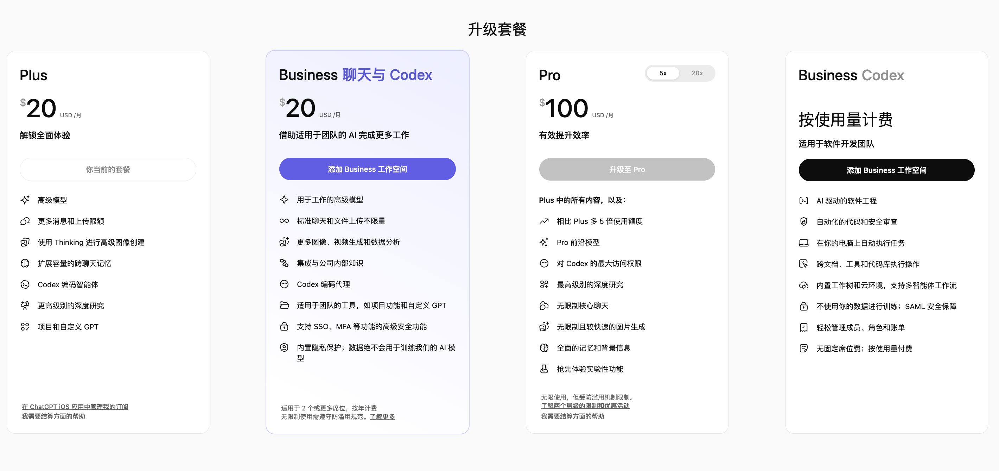

# 04 · 订阅与计费

> 📚 **系列导航**：上一篇 [03 安装与登录](03-install.md) 把 Codex 装好、用 ChatGPT 账号或 API key 登进去了。这一篇把账算清楚——**到底该订哪个套餐、钱怎么花的、API key 又是另一回事，以及怎么让额度更耐用**。

都说「订阅一个 ChatGPT Plus 就能无脑用 Codex」，但说句实话，**Codex 的计费根本不是「订了就随便用」那么简单**。

我自己 2026 年初刚把 Codex 接进工作流时就吃过这个亏：以为 Plus 那 20 刀一个月就是「Codex 包月」，结果连着两天让它在一个上万行的老项目里跑重构，第二天下午就撞到了限额——CLI 直接提示我「本窗口用量已到上限」。我当时还纳闷，明明每天就发了几十条消息怎么就到顶了。后来才搞明白：**Codex 的限额不是按「几条消息」算的，是按「每条消息烧多少 token」算的**，我那几十条全是「读大文件 + 长任务」，一条顶人家十条。

更绕的是，Codex 同一个工具有**两套完全不同的付费逻辑**：用 ChatGPT 账号登录走「订阅 + 额度」，用 API key 登录走「按 token 实时扣费」。这俩混在一起，新手很容易算糊涂。

这一篇就把这两套逻辑掰开揉碎讲明白。**搞清楚计费规则，比纠结订哪档更重要**——同一个 Plus，会用的人一个月够用，不会用的人两天触顶。

**看完这一篇，你会拿到：**

- 一张「ChatGPT 订阅各档 vs API key」的对比表，知道自己该走哪条路
- 看懂 Codex 的两套计费逻辑（订阅含的「用量限额 + 额度」 vs API key 的「按 token 扣费」）
- `/status` 命令的用法，在 CLI 里随时查「还剩多少额度」
- 一套官方认证的「让额度更耐用」习惯，**同样的活儿，token 能少烧一大截**

> ⚠️ **价格与限额随时会变**：本文里的具体金额、限额区间、积分单价都来自官方 [pricing](https://developers.openai.com/codex/pricing) 页某一时刻的快照，**OpenAI 调价、调限额很频繁**，下单前请一律以官网当前价为准，文中数字只帮你建立概念。

---

## 01 先搞清楚：你在为什么付费

先说结论：**Codex 这个工具本身不要钱，你付的是背后「模型算力」的钱**。

Codex 只是个命令行工具（外加桌面 App、IDE 扩展、网页端几个入口），下载安装全免费。真正花钱的是它背后的 GPT 系列大模型——你提问、它读文件、它写代码跑命令，每一步都要把内容发给模型处理，**这个处理量才是计费单位**。

**类比：Codex 是一台你免费领到的「叫车 App」，模型是真正跑的车。** 装 App、注册账号都不花钱，但你一旦叫车出发，**车跑的每一公里都在计费**——你问得越多、让它读的代码越大、让它想得越久，「里程」就越长。

这个「里程」的计量单位叫 **token（模型把文字切成的最小计费块）**。**类比：token 就是文字的「计价字数」。** 一段话发给模型，会被切成一个个 token 来数：你发出去的算「输入 token」，它回来的算「输出 token」，**输出通常比输入贵不少**。

举几个你天天会遇到、token 悄悄堆起来的场景：

- 让它「读一下这个 2000 行的文件再改」——**整个文件都变成输入 token 发出去了**
- 一轮对话聊到第 50 条——**前面那 49 条作为上下文每次都重发一遍**
- 项目根目录放了个又长又啰嗦的 `AGENTS.md`（Codex 的项目说明书）——**它每条消息都把这份说明塞进去**

所以**花钱多少跟「问了几个问题」关系不大，跟「每次塞进去多少上下文」关系极大**——这是后面省钱的核心抓手，先记住。

> 💡 一句话总结：工具免费，**你付的是模型按 token 计的算力费**——输入 + 输出 + 上下文，全都算钱。

---

## 02 两套计费逻辑：ChatGPT 订阅 vs API key

知道了为 token 付费，下一个关键问题是：**这钱通过什么渠道付？** Codex 就两条路，而且差别巨大，先上表，再说人话。

| 维度 | ChatGPT 订阅登录 | API key 登录 |
|------|----------------|-------------|
| **怎么收费** | 固定月费，含一定「用量限额」，超了买积分续 | 没有月费，**按实际 token 用量实时扣费** |
| **付费心理** | 封顶可控，月初心里有数 | 浮动，用多少付多少，账单事后才知道 |
| **云端功能**（自动代码审查、Slack、GitHub 等） | ✅ 有 | ❌ **基本没有** |
| **新模型** | 第一时间能用 | **延迟开放**（如 GPT-5.3-Codex-Spark 等新模型晚一步） |
| **适合谁** | 个人日常高频用、想要固定支出 | CI/CD、自动化脚本、共享环境里跑 Codex |
| **怎么登录** | `codex login`（浏览器授权 ChatGPT 账号） | API key 登录（`codex login` 里选 API key 方式） |

（来源：官方 [pricing](https://developers.openai.com/codex/pricing)、[auth](https://developers.openai.com/codex/auth) 文档）

**这两条路不是「哪个更划算」，是「你是什么用法」。** 拆开说：

**ChatGPT 订阅** 是绝大多数个人开发者该走的路。你已经订了 Plus / Pro，那 Codex 就在订阅范围内、跟着限额走，**不用单独绑卡、不用盯实时账单**，撞到限额了再决定要不要买积分。云端那些花活（GitHub 自动代码审查、Slack 集成）也只有订阅登录才有。

**API key** 是给「机器」用的，不是给「人」日常聊天用的。官方明确推荐它用在**程序化场景，比如 CI/CD 流水线**——脚本里跑 Codex，按标准 API 价实时扣 token 钱。代价是：**没有云端功能，新模型还延迟开放**。所以你要是个人坐在电脑前敲代码，别图省事用 API key，多半不划算还少功能。

> 关于「用 API key 时钱怎么算」：它走的是 OpenAI Platform 的标准 API 价，**跟 ChatGPT 订阅的限额、积分完全是两套账**，具体单价以 [API pricing](https://platform.openai.com/docs/pricing) 页为准，本文不写死。

我自己的搭配是：**人在终端前手敲，用 ChatGPT 订阅登录；写到自动化脚本、半夜让它批量跑任务，才换 API key。** 两套互不干扰，账也清爽。

> 💡 一句话总结：**人用订阅、机器用 API key**——订阅图省心和云端功能，API key 图自动化里按量精算，别用反了。

---

## 03 ChatGPT 各档怎么选：Plus / Pro / Business / Enterprise

走订阅这条路，下一步就是选档。我把官方 pricing 页列出的、**含 Codex 能力的几档**整理成一张表（具体金额随时会变，认概念为主）：


这张图列出了 Plus、Pro、Business、Enterprise & Edu 和 API key 五个档位在 Codex 能力上的对比，后面文字逐档细说。

| 档位 | 月费（参考） | Codex 用量（相对） | 关键特点 | 适合谁 |
|------|------------|------------------|---------|--------|
| **Plus** | \$20/月 | 基准量 | 网页/CLI/IDE/iOS 全入口、云端自动审查 + Slack、最新模型 | 个人，每周几段专注的编程 |
| **Pro** | 从 \$100/月起 | **Plus 的 5 倍或 20 倍** | Plus 全部 + 一个面向日常的快速模型（研究预览） | 重度用户、每天大量跑 Codex |
| **Business** | 按量付费（Pay as you go） | 同 Plus 量级、可加积分 | 团队席位管理、更大的云端虚拟机、SSO/MFA、数据默认不训练 | 创业团队、成长型公司 |
| **Enterprise & Edu** | 联系销售 | 弹性定价、用量随积分伸缩 | Business 全部 + 优先处理、SCIM/RBAC、审计日志、数据驻留 | 整个组织级部署 |

（来源：官方 [pricing](https://developers.openai.com/codex/pricing) 页）

说几句表里塞不下的人话：

**Plus（\$20）是绝大多数人的起点。** 该有的入口（网页、CLI、IDE 扩展、iOS）和云端功能（自动代码审查、Slack）它都有，最新模型也第一时间能用。**唯一的悬念就是「限额够不够你用」**——这就是开头我两天触顶那次的坑，下一节专门讲限额。

**Pro（从 \$100 起）的卖点就一个：限额大幅提升。** 官方写得很直白——Pro 提供「比 Plus 高 5 倍或 20 倍」的 Codex 用量，外加一个面向日常编程的快速模型（研究预览阶段）。**说白了就是 Plus 撞限额撞烦了、又不想买积分续命的人，直接上 Pro。** 我自己在那次重构触顶后纠结过要不要升 Pro，最后没升——因为靠下一节那套省 token 的习惯，Plus 又够用了。**先学会省，再考虑升档。**

**Business / Enterprise & Edu 是团队和组织的事。** Business 走「按量付费 + 席位」、给团队管理和安全控制；Enterprise & Edu 再往上叠优先处理、合规审计、数据驻留这些。**个人开发者基本用不到，知道有这两档就行。**

### 那 Free 和 Go 呢？

很多人会问：**ChatGPT 免费版（Free）、入门档 Go，能不能白嫖 Codex？**

说实话，**这块官方 Codex 定价页讲得很模糊**。截至本文参考的快照，pricing 页**正经列出的、含 Codex 能力的最低档就是 Plus（\$20）**，Free 只在「图像生成不支持免费版」这一句里被顺带提了一下，Go 档**整页没出现**。

所以我的判断和建议：

**类比：这就像健身房的「免费体验卡」和「正式月卡」。** 体验卡也许能进门转一圈，但器械、私教这些核心服务八成得正式月卡才解锁。Codex 的核心编程能力，官方明确挂在 Plus 及以上。

- **别指望 Free / Go 能正经跑 Codex 编程**——至少官方定价页没给它们承诺额度。
- 真想免费试，**Codex 网页端的 Sites 功能预览期间免费**（来源：pricing 文档），可以拿来感受一下，但这不等于「免费用 Codex 写代码」。
- **Free / Go 到底含不含、含多少 Codex，会随官方政策调整**——下单前直接去 [chatgpt.com/pricing](https://chatgpt.com/pricing) 看当前档位说明，别信任何「免费版也能无限用」的二手说法。

> 💡 一句话总结：**个人从 Plus 起步、撞限额烦了再上 Pro、团队才看 Business 以上**；Free / Go 能不能用 Codex 官方说得含糊，以官网当前页为准，别预设能白嫖。

---

## 04 限额到底怎么算：5 小时窗口 + 积分续命

这是最容易让新手懵的一块，也是我开头那次「两天触顶」的真正原因。讲清楚两件事：**限额怎么数、超了怎么办。**

### 限额按「5 小时滚动窗口」算，不是按天

官方把 Codex 的用量限额分成**本地消息（Local Messages）**和**云端任务（Cloud Tasks）**两类，二者**共享一个「5 小时窗口」**（来源：pricing 文档）。也就是说，每 5 小时是一个计量周期，不是「每天清零」那么简单，可能还另有每周上限。（窗口的具体起算方式以官方当前说明为准。）

更关键的是——**限额是个区间，不是固定数**。比如官方给 Plus 标的是「GPT-5.5 每 5 小时 15–80 条本地消息」。为啥是范围？因为：

> 你能发多少条 Codex 消息，取决于用的模型、编程任务的大小和复杂度、以及你在本地跑还是云端跑。小脚本或常规函数可能只耗掉一点点配额，而大型代码库、长时间运行的任务、需要 Codex 记住更多上下文的长会话，每条消息会用掉多得多的配额。（译自官方 pricing 文档）

看懂这句你就明白我那次为啥几十条就触顶了——**我每条都是「大型代码库 + 长任务」，吃配额的速度是小脚本的好几倍。** 同样一个 Plus，你拿来改改小函数能发大几十条，我拿来啃大项目可能十几条就见底。

### 不同档位的限额差多少

直接上官方的数（GPT-5.5 模型、每 5 小时本地消息，仅供建立概念，**实际以官网为准**）：

| 档位 | GPT-5.5 本地消息 / 5 小时（参考） |
|------|--------------------------------|
| **Plus** | 15–80 条 |
| **Pro（5x）** | 80–400 条 |
| **Pro（20x）** | 300–1600 条 |
| **Business** | 15–80 条（同 Plus 量级，可加积分） |

（来源：官方 [pricing](https://developers.openai.com/codex/pricing) 页；同页还有 GPT-5.4、GPT-5.4-mini 的更高限额，换小模型能发更多条。）

这张表透露一个省钱信号：**同一档下，换更小的模型（如 GPT-5.4-mini），限额能翻好几倍。** 后面 05 节会用到。

### 超了怎么办：买积分续

撞到限额不用慌，也不用急着升档。官方给的办法是**买积分（credits）续命**：

> ChatGPT Plus 和 Pro 用户达到用量限额后，可以购买额外积分继续工作，无需升级现有套餐。（译自官方 pricing 文档）

**类比：积分就像手机流量包用完后的「加油包」。** 月套餐的限额是你的「包月流量」，用超了不必直接升更贵的套餐，**单独买个加油包接着用就行**。Business / Enterprise / Edu 这边对应的是买「工作区积分」。

积分本身也按 token 算账——官方给了张「每百万 token 多少积分」的费率卡，还顺带提了一句很实用的参考值：

> GPT-5.5 平均每条消息消耗 5–45 积分。（译自官方 pricing 费率卡）

记住这个「5–45 积分/条」的量级就够了，**具体每百万 token 多少积分、各模型费率，以官网费率卡为准**，会变。

> 💡 一句话总结：限额按 **5 小时计量周期 + 模型** 算、是个区间不是死数；**啃大项目掉得快**，撞顶了买积分续命，别一上来就升档。

---

## 05 让额度更耐用：官方认证的省 token 习惯

换更贵的档是下策，**会用工具才是上策**。回到 01 节那句——**花钱多少跟你塞进去多少上下文极度相关**。下面四条全部来自官方 pricing 文档的「怎么让限额更耐用」一节，我挑的是对新手最立竿见影的，每条我都自己验过。

**第一，提示写具体，删掉没用的上下文。** 官方原话是「给 Codex 精确的指令，但移除不必要的上下文」。你越含糊，它越要满项目翻文件猜你想干嘛，每翻一个都烧 token。我那次重构触顶后复盘，**有大半 token 是它在「猜我到底要改哪」时瞎读文件烧掉的**——后来我把需求写成「改 `src/auth.ts` 里的 `login` 函数，加输入校验」，一下就省下来了。

**第二，给 `AGENTS.md` 瘦身。** `AGENTS.md` 是 Codex 的项目说明书，**它每条消息都会把这份内容塞进上下文**。官方建议大项目用「嵌套」的方式分层放（不同子目录放各自的小 `AGENTS.md`），别在根目录堆一份几百行的巨无霸。我之前在一个项目里把根 `AGENTS.md` 从两百多行砍到几十行，**每条消息的输入 token 肉眼可见地降了一截**。

**第三，少挂 MCP server。** MCP（外部工具接口）每接一个，**它的工具描述就会塞进你每条消息的上下文，吃掉更多限额**。官方建议「不用的时候把 MCP server 关掉」。说白了：用得着才开，别一股脑全挂着。

**第四，常规任务换小模型。** 官方明说「换成 GPT-5.4 或 GPT-5.4-mini 能延长你的本地消息限额」。结合 04 节那张表——**小模型同档限额翻好几倍**。日常改代码、调小 bug，用 `/model` 切个小模型完全够；只有硬骨头才上最强的。

下面这张表可以当成贴在显示器边上的「省额度速查」：

| 坏习惯 ❌ | 好习惯 ✅ | 省在哪 |
|---------|---------|--------|
| 「帮我改进下这个项目」 | 「改 `src/auth.ts` 的 `login` 加输入校验」 | 少瞎翻文件 |
| 根目录堆几百行 `AGENTS.md` | 瘦身 + 按子目录分层 | 每条消息少塞上下文 |
| MCP server 全程挂满 | 用得着才开，用完关 | 不为没用的工具付费 |
| 全程挂最强模型 | 常规活换 GPT-5.4-mini | 同档限额翻几倍 |

补一条 CLI 里的实战习惯：**切到不相关的活儿，用 `/new` 开个新对话。** `/new` 能在不退出 CLI 的前提下「重置聊天上下文」（来源：官方 CLI 斜杠命令表）——否则一个对话从早聊到晚，下午每条消息都把上午那堆早没用的内容重发一遍，限额白白浪费。

> 💡 一句话总结：省额度不是换贵套餐，是 **提示说清、`AGENTS.md` 瘦身、MCP 按需开、常规换小模型、切活用 `/new`**——上下文越小，额度越耐用。

---

## 06 动手：在 CLI 里盯住你的用量

光看不练等于没看。下面这套动作**你现在就能跑一遍**，几分钟建立起「用量感知」。

**前提**：已按 [03 安装与登录](03-install.md) 装好并登录了 Codex（ChatGPT 订阅或 API key 都行）。**国内用户注意**：登录 ChatGPT 账号、跑云端任务通常需要「魔法上网」，本地用 API key 跑则看你网络能不能直连 OpenAI API。

在项目目录下启动 Codex：

```bash
codex
```

**第一步：用 `/status` 查当前会话状态和剩余限额。** 在 Codex 对话里直接敲：

```text
/status
```

它会显示**当前模型、审批策略、可写目录、剩余上下文容量**等会话配置与 token 用量（来源：官方 CLI 斜杠命令表）。而「查剩余用量限额」这一点，官方在计费文档里也专门点了用 `/status`：

> 想在 Codex CLI 会话进行时查看剩余限额，可以用 `/status`。（译自官方 pricing 文档）

重点看两个：**当前模型**对不对（常规任务别挂着最强模型），**剩余限额**还剩多少。撞顶前心里有数，比突然被拦住强。

**第二步：随便让它干个小活，再看一次。** 先发个小任务：

```text
看看当前目录下有哪些文件，简单说下这个项目是干嘛的
```

等它回完，再敲一次 `/status`，对比一下上下文用量涨了多少。**这就是「问一个简单问题 + 读一遍目录」的成本**——有了这个基准，以后哪次对话异常烧额度你一眼能察觉。

**第三步：常规任务切个小模型。** 用 `/model` 切换当前模型和推理强度（来源：官方文档，`/model` 用于选择活动模型，可在会话中途切换）：

```text
/model
```

按提示选个更小的模型（如 GPT-5.4-mini 这类）跑日常活儿，**限额能撑更久**。也可以在启动时直接指定，比如：

```bash
codex --model gpt-5.5
```

（`--model` 后跟哪些模型名**以你账号当前可用的为准**，`/status` 里能看到当前用的是哪个。）

**第四步（订阅用户）：网页端看完整用量面板。** CLI 里的 `/status` 看的是当前会话，**想看跨设备的完整用量和剩余限额**，去官方用量面板：

```text
https://chatgpt.com/codex/settings/usage
```

（来源：官方 pricing 文档明确指向这个 [Codex usage dashboard](https://chatgpt.com/codex/settings/usage)。）

> API key 用户：你不走 ChatGPT 限额，**账单和用量在 OpenAI Platform 后台看**（[platform.openai.com](https://platform.openai.com) ），不是上面这个面板。但 `/status` 看当前会话上下文、`/new` 切活清上下文这些习惯照样要养成。

跑完这几步，你就从「闷头烧额度」升级成「随时知道还剩多少、还能主动省」。

> 💡 一句话总结：**`/status` 查剩余限额建基准 → `/model` 切小模型省额度 → 网页面板看全局用量**，几分钟拿回开销掌控权。

---

## 07 小结

这一篇把 Codex 的「钱」掰开揉碎讲了一遍。

| 你学到的 | 关键点 |
|---------|--------|
| **为什么付费** | 工具免费，付的是模型按 token 计的算力费 |
| **两套计费逻辑** | 人用 ChatGPT 订阅（含限额 + 积分），机器用 API key（按 token 实时扣） |
| **各档怎么选** | 个人从 Plus 起、撞顶上 Pro、团队看 Business 以上 |
| **限额怎么算** | 5 小时计量周期 + 模型，是区间不是死数；超了买积分续 |
| **怎么省额度** | 提示说清、`AGENTS.md` 瘦身、MCP 按需开、常规换小模型、切活用 `/new` |

只记一条的话：**花钱多少跟「塞进去多少上下文」极度相关，不是跟「问了几个问题」**。吃透这句，省额度的招你都能自己推导出来——**看懂两套账、查清当次开销、撞顶买积分、把活儿干得更省**，到这你都拿下了。

⚠️ 再强调一次准确性：本文涉及的**套餐金额、限额区间、积分单价都会变动**，一律以官方 [pricing](https://developers.openai.com/codex/pricing) 页或 [chatgpt.com/pricing](https://chatgpt.com/pricing) 当前价为准；`/status`、`/model`、`/new` 等命令行为以[官方 CLI 文档](https://developers.openai.com/codex/cli)为准，可能随版本更新（`codex --version` 看版本）。

---

账算明白、套餐也选好了，可如果你在国内、又嫌官方订阅要绑外币卡 + 魔法上网太折腾，还有一条更省的路——下一篇 **05「接入 DeepSeek 等国产模型」**，教你把 DeepSeek、Kimi、GLM 这些国产模型接进 Codex，**不用 OpenAI 账号也能让它跑起来**。这条路对国内开发者尤其实在。
