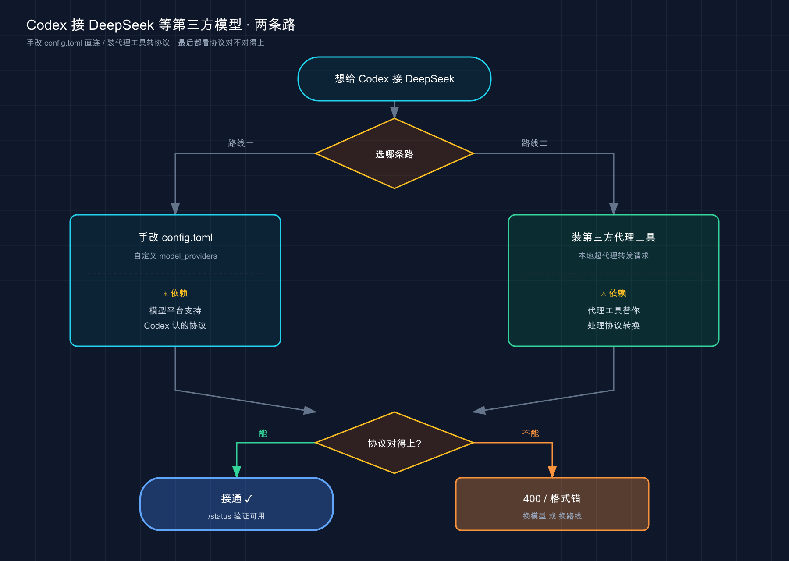
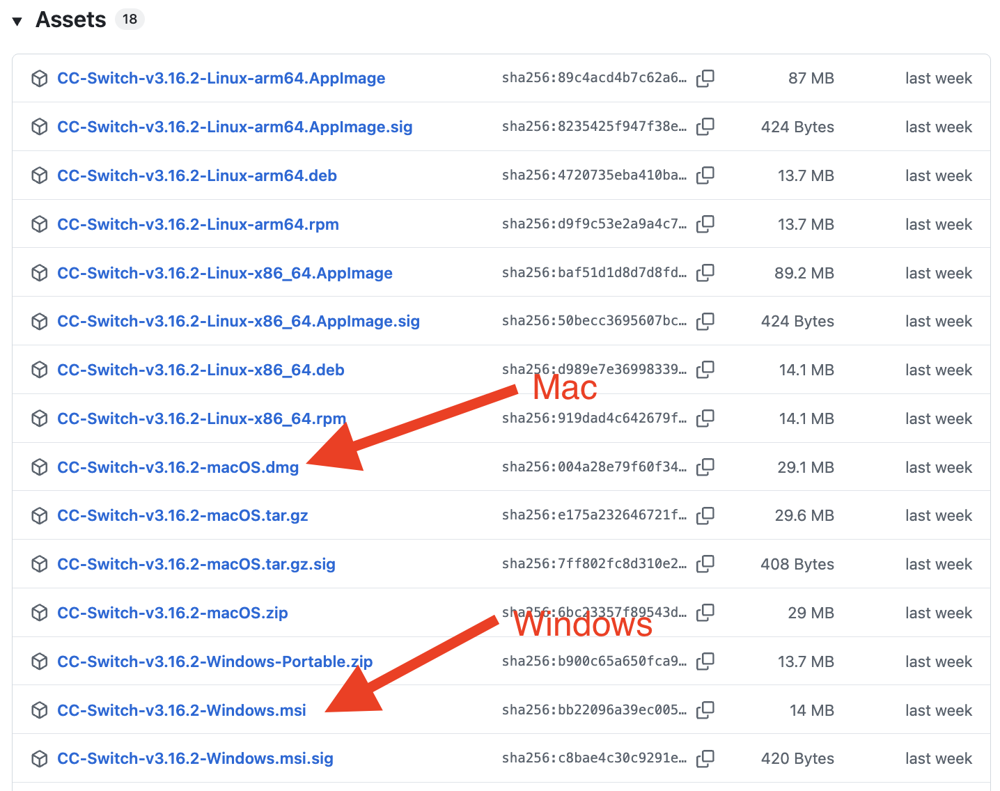
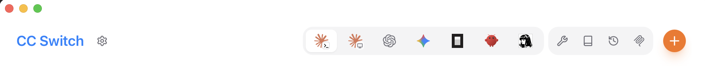
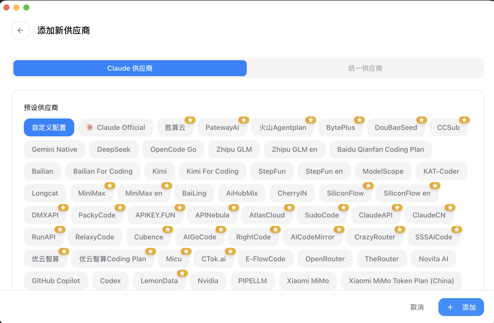

# 05 · 接入 DeepSeek 等国产模型

> 📚 **系列导航**：上一篇 [04 · 订阅与计费](04-pricing.md) 把 Codex 的账算明白了——订阅划算还是按量付费划算。这一篇接着「省钱」往下走，聊一个更野的路子：**把 Codex 背后的大脑，换成 DeepSeek 这类国产模型**。

> ⚠️ **开头先把丑话说清楚（实验性、可能变化，以实测为准）**：Codex 是 OpenAI 自家的产品，它的官方文档里**根本没打算让你接 DeepSeek**。给 Codex 接第三方模型，是社区玩出来的路子，靠的是官方留的一个口子——自定义模型提供商（`model_providers`）。这条路能不能跑通、能跑多顺，**取决于第三方模型支持哪种接口协议**，而这一点恰恰是最容易翻车的地方（后面第 03 节细说）。本篇凡是官方文档明确写了的（配置项、默认行为）我都标了来源；DeepSeek 那部分以实测和社区方案为主，**接口地址、模型名、协议支持随时会变，一切以 DeepSeek 和 Codex 官方为准**。

兄弟们，先还原一段我前阵子真实的对话。

> 同事：「你 Claude Code 不是接了 DeepSeek 省了一大笔吗？Codex 照搬一下呗。」
> 我：「我也以为照搬就行……结果搞了俩小时，配置全对，一发请求直接 400。」
> 同事：「啊？不是改个 base_url 的事吗？」
> 我：「Codex 跟 Claude Code 不是一个套路。这俩长得像，骨子里差远了。」

说句实话，**这篇是我整个 Codex 系列里最想给你提个醒的一篇**。网上一搜「Codex 接 DeepSeek」，教程一大把，但九成没说清楚一件要命的事：Codex 接第三方，跟 Claude Code 接第三方，**底层逻辑完全不同**，照着 Claude Code 的经验抄，大概率卡在协议上。这篇就把这个坑，连根挖给你看。

**看完这一篇，你会拿到：**

- 一句话讲清 Codex 和 Claude Code 接第三方的**根本区别**（省你几个小时）
- 一张「该不该给 Codex 接第三方」的取舍对照表，先想清楚再动手
- 两条接入路线（手改 `config.toml` vs 第三方代理工具）的优劣对比和适用人群
- 一份照着抄的 `model_providers` 配置骨架 + 验证方法 + 高频报错排查表

---

## 01 先搞懂：Codex 换模型，和 Claude Code 不是一回事

先给结论，这是全篇最值钱的一句：**Claude Code 换模型靠改环境变量，Codex 换模型靠改配置文件里的「模型提供商」；更关键的是，Codex 对第三方的接口协议有硬要求，不是随便一个兼容接口都能接上。**

我们一步步拆。

你装的 Codex，本质也是个跑在终端里的客户端——它读代码、调工具、管上下文，但**它自己不思考**，每一步都要把请求发给一个大模型。默认这个模型是 OpenAI 的 GPT（当前推荐 `gpt-5.5`，来源：Codex 官方《Models》文档）。

所谓「接第三方」，就是把这个发请求的目标，从 OpenAI 改到别人家。Codex 官方确实留了这个口子——文档原话是：

> 你也可以把 Codex 指向任何支持 [Chat Completions](https://platform.openai.com/docs/api-reference/chat) 或 [Responses API](https://platform.openai.com/docs/api-reference/responses) 的模型和提供商，以适配你的特定用例。（Codex 官方《Models》文档）

**类比：插座的制式。** Claude Code 像个万用充电头，第三方只要做一个「兼容 Anthropic 协议」的接口，它一插就通。Codex 不一样，它更像认插座制式的电器——**它只认 OpenAI 那两种「插座」（Chat Completions 和 Responses API）**。DeepSeek 这类国产模型，普遍提供的是「兼容 OpenAI」的接口，也就是 OpenAI 制式的插座，所以理论上能插。但这里有个暗坑：

**Codex 官方明确写了——Chat Completions API 的支持「已弃用，未来版本会移除」（来源：《Models》文档）。** 也就是说，Codex 正在把宝押在 Responses API 上。而 Responses API 是 OpenAI 自家相对新的协议，**很多第三方模型平台并没有完整实现它**。

这就是我开头卡两小时的根因：我以为「DeepSeek 兼容 OpenAI」就万事大吉，结果撞在了协议这堵墙上。

> 💡 **一句话总结**：Claude Code 换大脑改环境变量、认 Anthropic 协议；Codex 换大脑改 `config.toml` 里的模型提供商、认 OpenAI 协议（且力推 Responses API）——**别拿 Claude Code 的经验硬套 Codex**。

---

## 02 该不该给 Codex 接第三方？先看这张表

先泼盆冷水：**就「接第三方」这件事，Codex 比 Claude Code 更不值得折腾。** 这是我用下来的真实判断，不是和稀泥。

原因很简单，叠了三层：

第一，**Codex 接第三方的成功率，比 Claude Code 低**——卡在前面说的协议问题上，不一定一把通。

第二，**GPT-5.5 这代模型在 Codex 里的代码能力是真强**，尤其复杂任务、长链路重构，第三方模型接上了也未必追得上，省了钱但活儿质量打折。

第三，**OpenAI 的订阅（Plus / Pro）本身就把 Codex 额度包进去了**（上一篇 04 算过账）。你订阅都买了，再花 API 的钱接第三方，等于重复付费。

把官方和第三方摆一起对比，你心里就有数了：

| 维度 | 官方 GPT（Codex 默认） | 第三方 / 国产模型（如 DeepSeek） |
|------|------------------------|-------------------------------|
| **价格** | 贵，重度用按量付费烧钱 | ✅ 便宜，常便宜一个数量级 |
| **国内直连** | 多数要魔法上网 | ✅ DeepSeek 等国内直连，零门槛 |
| **接入难度** | 登录即用 | ⚠️ **协议可能不兼容，未必接得上** |
| **代码 / Agent 能力** | ✅ GPT-5.5 第一梯队，长链路稳 | 够日常用，复杂任务偶尔掉链子 |
| **官方支持** | ✅ 一等公民 | ❌ 实验性，出问题没人兜底 |
| **配置稳定性** | 跟着官方走 | ⚠️ 协议 / 模型名变了就得重配 |

看明白了吧？**和 Claude Code 那篇里「第三方是省钱王牌」的结论不同——在 Codex 这边，第三方多了一道「能不能接上」的不确定性**，王牌的成色打了折。

那什么人还值得试？我的建议：

- ✅ **可以试**：API 账单肉疼、且任务以日常增删改查为主的重度用户；纯粹连不上官方、只想找个国内直连凑合用的人；爱折腾、把这当技术练手的人。
- ❌ **别折腾**：已经买了 OpenAI 订阅的（重复付费，不划算）；主力干复杂架构、疑难调试的（GPT-5.5 的能力省不得）；图省事、受不了折腾配置的小白（这条路真不省心）。

我自己的结论是：**Claude Code 我常驻 DeepSeek 跑糙活，Codex 我老老实实用官方。** 不是 DeepSeek 不行，是 Codex 这条接入路太不稳，性价比不如把精力花在用好官方上。

> 💡 **一句话总结**：Codex 接第三方比 Claude Code 多一层「协议能不能通」的风险，**重复付费的订阅党、干硬活的、怕折腾的都别凑热闹**；真要试，先认清这是实验性玩法。

---

## 03 两条路线：手改配置 vs 代理工具

假设你看完上面还是想试。先别急着抄配置——**接入有两条路线，选错了白费劲。**



这张图是接入决策的全貌：两条路殊途同归，但**最终都得过「协议」这一关**——这是 Codex 接第三方绕不开的门槛。

### 路线一：手改 `config.toml`（官方留的口子）

Codex 把所有配置放在一个文件里：`~/.codex/config.toml` （这是 Codex 的「用户级配置文件」，来源：官方《Configuration Reference》）。官方支持你在里面定义自定义的「模型提供商」。

**类比：在通讯录里新建一个联系人。** 默认通讯录里只有 OpenAI 这个号码，你想给 DeepSeek 打电话，就得先在通讯录里新建一条：填上名字、电话号码（`base_url`）、还有验证身份用的密码（API Key 从哪个环境变量取）。建好之后，再告诉 Codex「这次拨打这个新联系人」。

关键配置项就这么几个（均来自官方《Configuration Reference》；前四项在 `model_providers` 子表下，后两项 `model_provider` / `model` 是顶层项）：

| 配置项 | 官方含义 |
|--------|---------|
| `model_providers.<id>.name` | 这个自定义提供商的显示名 |
| `model_providers.<id>.base_url` | 提供商的 API 地址 |
| `model_providers.<id>.env_key` | 从哪个环境变量读 API Key |
| `model_providers.<id>.wire_api` | 用哪种协议，**官方只支持 `responses`，且为默认值** |
| `model_provider`（顶层） | 当前用哪个提供商，默认 `openai` |
| `model`（顶层） | 当前用哪个模型 |

注意看 `wire_api` 那一行——**官方文档白纸黑字：`responses` 是唯一支持的值（`responses` is the only supported value）**。这就是路线一最大的坎：如果你接的第三方平台只提供 Chat Completions 风格的接口、不支持 Responses API，那这条官方路线**可能直接走不通**。

> ⚠️ DeepSeek 官方提供的是「兼容 OpenAI」接口，但它对应的主要是 Chat Completions 风格。**它到底能不能被 Codex 的 `responses` 协议接受，强依赖双方当下的实现，我无法替你打包票——这一步务必以你自己的实测和两边官方文档为准。** 通了算你赚，没通是正常的，别怀疑自己手笨。

### 路线二：装个第三方代理工具（社区方案）

既然协议是拦路虎，社区就想了个办法：**在你本机起一个代理服务，专门负责「协议翻译」**——Codex 把请求按 OpenAI 的格式发给这个本地代理，代理在中间转换好，再转发给 DeepSeek，响应回来再翻译回去。对 Codex 来说，它全程以为自己在跟 OpenAI 说话。

 **CC Switch**（一款免费开源的跨平台桌面工具，GitHub 仓库 [github.com/farion1231/cc-switch](https://github.com/farion1231/cc-switch) ）走的就是这条路：在本机起代理，把 Codex 的请求透明转发到你选的后端，还内置了 DeepSeek 等常见平台的预设，省得你手填。



安装 CC Switch 后，打开主界面，点击「Add Provider」或对应的「+」入口，进入提供商配置页。



这张图是添加提供商的入口页面。在左侧列表里选中你想配置的工具（这里选 Codex），右侧会展开该工具的「Provider」设置区——在这里选择你要接入的后端（DeepSeek 等）、填入对应的 API Key，保存后 CC Switch 就会把 Codex 的请求透明转发到你选的平台。



这张图展示的是选择后端时的预设列表——DeepSeek、OpenRouter 等常见平台都内置了，不用手填地址和协议细节，选中填 Key 即可。

**类比：找个翻译。** 你（Codex）只会说英语（OpenAI 协议），对方（DeepSeek）只听得懂中文。路线一是指望对方自己学英语（平台支持 Responses API）；路线二是你雇个翻译（代理工具）站中间，两头传话。翻译靠谱，沟通就顺。

两条路线怎么选，对照着挑：

| 对比项 | 路线一：手改 config.toml | 路线二：代理工具（如 CC Switch） |
|--------|--------------------------|-------------------------------|
| **是否官方** | ✅ 用的是官方留的配置口子 | ❌ 纯社区第三方工具 |
| **协议适配** | ⚠️ 全看平台支不支持 `responses` | ✅ 代理替你做协议转换，成功率更高 |
| **上手难度** | 要手写 TOML，易写错 | 图形界面点几下，对小白友好 |
| **透明度** | 配置都在你眼皮底下 | 多一层黑盒，出问题排查更绕 |
| **多平台切换** | 改一次配一次 | 一键切换不同提供商 |
| **适合谁** | 想搞懂原理、能折腾的 | 只想快速跑通、怕写配置的 |

我的取舍：**想真正理解 Codex 怎么接第三方，走路线一**，哪怕没通，你也搞懂了门道；**只想赶紧用上、不在乎原理，走路线二**，让工具替你扛协议这摊事。

> 💡 **一句话总结**：路线一是官方配置（透明但吃协议运气），路线二是社区代理工具（多个黑盒但成功率高）——**怕折腾选代理工具，想懂原理选手改配置**，但两条路最后都得看协议对不对得上。

---

## 04 动手：手改 config.toml 的最小骨架

这节给路线一的**配置骨架**。我把它写成「骨架」而不是「照抄就跑」，是因为前面反复强调的协议风险——**这套配置语法是官方的、确定的；但它对 DeepSeek 通不通，得你实测**。

平台差异先说清：`~/.codex/config.toml` 这个路径，**Mac / Linux 在 `~/.codex/` ，Windows 在 `C:\Users\你的用户名\.codex\` ** （`~` 即用户主目录）。文件不存在就新建一个。

### 第一步：拿一把 DeepSeek API Key

1. 打开 [DeepSeek 开放平台](https://platform.deepseek.com) ，注册 / 登录
2. 创建一个 API Key，**复制存好**（形如 `sk-xxxxxxxx`）

> 🔑 API Key 是你账户的钱包钥匙。**别提交到 Git、别发群里、别硬写进配置文件**。下面我们用环境变量管它，天然不进文件。

### 第二步：把 Key 放进环境变量

先把 Key 塞进一个环境变量（变量名你自己定，这里叫 `DEEPSEEK_API_KEY`），后面配置文件里只引用它的名字，不写明文。

**Mac / Linux：**

```bash
export DEEPSEEK_API_KEY=<你的 DeepSeek API Key>
```

**Windows（PowerShell）：**

```powershell
$env:DEEPSEEK_API_KEY="<你的 DeepSeek API Key>"
```

这行 `export` / `$env:` 只在当前终端窗口有效，关掉就没了。要长期用，Mac 写进 `~/.zshrc` 、Linux 写进 `~/.bashrc` 再 `source` 一下；Windows 在「系统属性 → 环境变量」里加用户变量。

### 第三步：在 config.toml 里建一个提供商

编辑 `~/.codex/config.toml` ，加入下面这段（每一行都按官方配置项写）：

```toml
# 顶层：告诉 Codex 这次用我们自定义的提供商和模型
model_provider = "deepseek"
model = "<DeepSeek 的模型名，以官方文档为准>"

# 自定义一个名为 deepseek 的模型提供商
[model_providers.deepseek]
name = "DeepSeek"
base_url = "<DeepSeek 的 API base_url，以官方文档为准>"
env_key = "DEEPSEEK_API_KEY"   # 引用上一步的环境变量名
# wire_api 不写则默认为 responses（官方唯一支持的值）
```

逐行说明，避免你抄了不懂：

- `model_provider = "deepseek"` ——告诉 Codex「这次别用默认的 openai，用我下面定义的 deepseek」。
- `model = "..."` ——具体模型名。**DeepSeek 的模型名以 [DeepSeek 官方文档](https://api-docs.deepseek.com/zh-cn/) 为准**，平台升级会改名，别写死。
- `[model_providers.deepseek]` ——这一段就是「新建联系人」，`deepseek` 是你给它起的 id，要和上面 `model_provider` 对上。
- `base_url` ——DeepSeek 的接口地址，**以 DeepSeek 官方为准**。
- `env_key = "DEEPSEEK_API_KEY"` ——Codex 会去读这个环境变量拿 Key，所以第二步必须先设好。

> ⚠️ 我故意把 `model` 和 `base_url` 的具体值留成占位符。一来这俩 DeepSeek 随时可能调整，写死了害你；二来——再强调一遍——**这套配置能否真正跑通 DeepSeek，卡在 `responses` 协议兼容性上，请以实测为准**。配置语法是对的，但「对方接不接」不是这份语法能保证的。

> 提醒一句：内置的提供商 id（`openai`、`ollama`、`lmstudio`）是保留的、不能覆盖（来源：官方《Configuration Reference》），所以自定义 id 别取这几个名字。

> 💡 **一句话总结**：手改配置 = 设环境变量存 Key + 在 `config.toml` 里建一个 `model_providers` 提供商 + 顶层把 `model_provider` 和 `model` 指过去；语法是固定的，能不能跑通看协议那关。

---

## 05 验证：到底接没接上

配完别急着干活，**先验证**。不然你可能写半天才发现请求压根没切过去，白忙。

验证分两步走，从粗到细。

### 看一眼：当前用的是哪个模型

启动 Codex，在会话里用斜杠命令 `/model` ——它能切换当前线程使用的模型（来源：官方《Models》文档）。先确认 Codex 认到了你配的模型，而不是还停在默认的 GPT。

```bash
codex
```

进去之后敲：

```
/model
```

> 你也可以直接用 `-m` 参数指定模型启动，比如 `codex -m <模型名>` （来源：官方《Models》文档）。

### 真一刀：发个最小请求试水

光看配置认没认到还不够，**真正的检验是发一句话过去，看它回不回得正常**。给它一个最小、无害的任务：

```
你好，用一句话回复确认你能正常工作。
```

三种结果，对号入座：

| 现象 | 大概率原因 | 怎么办 |
|------|-----------|--------|
| 正常回了一句中文 | ✅ 接通了 | 恭喜，可以用了 |
| 报 401 / 鉴权失败 | API Key 没设对，或环境变量没生效 | 检查 `env_key` 名字、重设环境变量、重开终端 |
| 报 400 / 格式 / 协议错误 | **极可能是协议不兼容**（Responses API 那道坎） | 这条路在该平台可能走不通，考虑换路线二或换支持的模型 |
| 提示模型不存在 | 模型名写错 / 平台改名了 | 去 DeepSeek 官方文档查最新模型名 |

**重点看那条 400 / 协议错误**——如果你撞到它，先别怀疑自己配错了。这恰恰印证了第 03 节那句话：**Codex 认 `responses` 协议，而第三方平台未必实现**。我那两小时就栽在这上面，最后确认不是配置问题，是协议没对上。

碰到这种情况，理性的做法是：要么改走路线二（让代理工具去啃协议），要么干脆承认这个平台 + Codex 当下不兼容，**别在同一个方向死磕**——这也是省时间的关键判断。

> 💡 **一句话总结**：先 `/model` 看认没认到模型，再发一句话实测能不能回；**401 多半是 Key 问题，400 多半是协议不兼容**——撞协议墙就换路线或换模型，别硬刚。

---

## 06 接上之后：调思考深度，别一把梭

假设你运气不错接通了，再补一招实用的：**Codex 允许你调模型的「思考深度」，省 token 还是要质量，你说了算。**

官方提供一个配置项 `model_reasoning_effort` ，支持的档位是 `minimal` / `low` / `medium` / `high` / `xhigh` （其中 `xhigh` 取决于具体模型；以上全部来源：官方《Configuration Reference》）。它写在 `config.toml` 里：

```toml
model_reasoning_effort = "medium"
```

**类比：考试的答题策略。** `low` 像抢时间的选择题，扫一眼就作答，快但糙；`high` / `xhigh` 像压轴大题，让它多想几步、推理充分，慢但稳。**全程拉满？答得是好，但又慢又费（token 烧得快）。**

我的用法：**日常给 `medium` 就够了**，又快又省；真遇到那种要读懂一堆文件、跨模块推理的硬骨头，再临时拉到 `high`。一刀切拉满纯属浪费——尤其你接第三方本来就是为了省钱，结果 effort 全开把省下的钱又烧回去，就本末倒置了。

顺带提一个连带认知：**接了第三方之后，Codex 一些深度绑定官方的能力，行为可能不一样甚至用不了**——比如某些依赖 OpenAI 索引的内置 Web 搜索（官方《Configuration Reference》里 `web_search` 的缓存模式就明说基于 OpenAI 维护的索引）。这呼应了第 02 节那句「实验性、没人兜底」：日常编程你大概率用不到，但心里得有这根弦。

> 💡 **一句话总结**：接通后用 `model_reasoning_effort` 调思考深度——**日常 `medium`、硬活临时拉 `high`**，别一把梭拉满把省的钱烧回去；同时记住部分官方专属能力接第三方后会缩水。

---

## 07 小结

这一篇就干了一件事，还反复在给你打预防针：**给 Codex 接 DeepSeek 这类国产模型，能省钱，但它是实验性玩法，且比 Claude Code 那条路更不稳。**

串一下要点：

| 环节 | 关键认知 / 动作 |
|------|----------------|
| **认清差异** | Codex 认 OpenAI 协议（力推 Responses API），不是 Claude Code 那套，别硬抄 |
| **想清值不值** | 重复付费的订阅党、干硬活的、怕折腾的，都别凑热闹 |
| **选路线** | 想懂原理→手改 `config.toml`；只想跑通→代理工具（如 CC Switch） |
| **配提供商** | `model_providers` + 顶层 `model_provider` / `model`，Key 走 `env_key` |
| **验证** | `/model` 看认没认到，再发一句话实测；400 多半撞协议墙 |
| **接上之后** | `model_reasoning_effort` 调深度，别一把梭拉满 |

你现在应该能：**判断自己该不该给 Codex 接第三方，看懂两条接入路线的取舍，照官方语法搭出 `model_providers` 配置骨架，并在撞到协议问题时不慌、知道往哪儿排查。**

再把那句最该记住的话留给你：**Codex 接第三方，最大的变量不是你会不会配，而是对方支不支持 Codex 认的协议。** 想清楚这点，能省你好几个小时。

---

下一篇 **[06 · 跑通第一个任务](06-first-task.md)**——配置篇到此告一段落，从下一篇起咱们正式上手干活。不管你用的是官方 GPT 还是接了第三方，**让 Codex 实打实改一次代码、跑通一个完整任务**，体感一下它和你以前用的工具到底差在哪。留个问题先想想：你打算让它干的第一件事，是修个 bug、写个小功能，还是先让它把你的项目「读」一遍？
