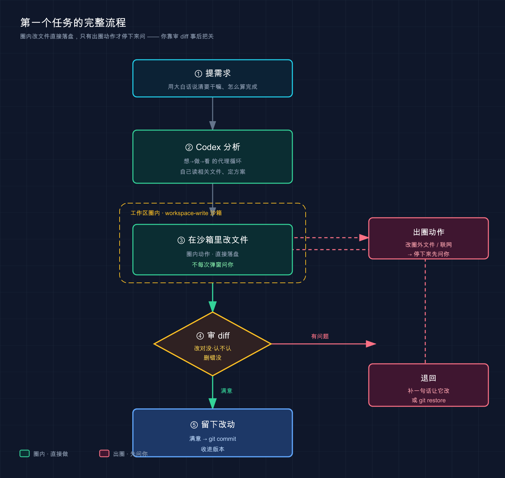
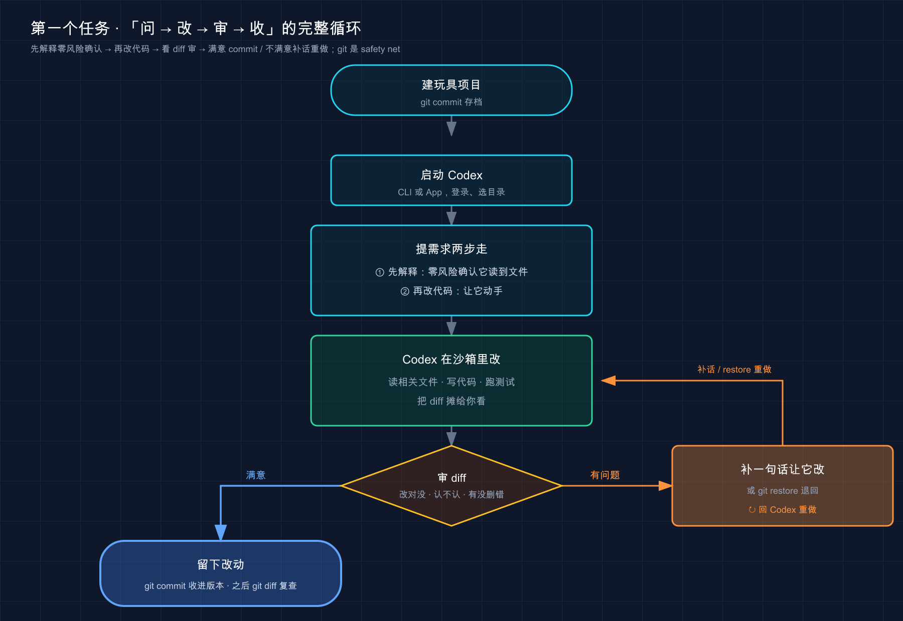

# 06 · 跑通第一个任务

> 📚 **系列导航**：上一篇 [05 · 接入 DeepSeek 等国产模型](05-third-party-models.md) 把「换大脑」那条野路子讲透了。配置篇到此为止——这一篇正式上手干活，**让 Codex 实打实改一次你的代码，跑通从提需求到看 diff 验收的完整闭环**。下一篇 [07 · 桌面 App 全景](07-desktop-app.md) 再把桌面端那张脸看个遍。

兄弟们，先交代一件我刚上手 Codex 时干的蠢事。

那是我装好 Codex CLI 的头一个晚上，兴冲冲想试试它到底能不能改代码。我直接 `cd` 进了公司一个跑了两年、几百个文件的主仓库，劈头一句「把用户模块重构一下，太乱了」。Codex 读文件读了十几秒，刷屏刷得我眼花，然后甩出一大坨改动——**横跨七八个文件**。我当时心一横「应该没问题吧」，眼睛都没细看就点了同意。

结果呢？它确实「重构」了，但顺手改了两个我压根没让它碰的接口签名，本地测试当场红一片。我花了快一个小时才把它的改动一行行捋清楚、挑出哪些要、哪些得退回去。**那一晚我最大的教训不是「Codex 不行」，而是「我跳过了那个最该停下来看的动作——审 diff」。**

说句实话，这篇我最想塞给你的，就是这个动作。今天咱们不碰大项目，**建个三行代码的玩具，五分钟走一遍「提需求 → Codex 在沙箱里改 → 看 diff 验收 → 留下或退回」的完整一圈**，让你第一次拿到「Codex 帮我改对了代码、而且全程我看得明明白白」的成功体验。桌面 App 和 CLI 两条路我都给你走一遍。

**看完这一篇，你会拿到：**

- 一套从开终端 / 开 App 到跑通第一个任务的完整动作流程，照着做就行
- 把「审 diff」这个核心动作刻进肌肉记忆——**这是新手和老手最大的分水岭**
- 桌面 App 与 CLI 两种走法的逐步操作 + 预期输出，能自己验证成没成
- 几个让你第一次就不踩坑的关键提醒（拒绝后怎么补话、改错了怎么退回去）

> ⚠️ 下文凡涉及具体命令、参数、默认行为，都以 Codex [官方文档](https://developers.openai.com/codex) 为准；模型名、界面文案这类会随版本变的东西，看到时以你本地实际显示为准。

---

## 01 别拿正式项目练手，先建个玩具

先说结论，这是我用一小时换来的：**第一次用 Codex，千万别拿你的正式仓库开刀，建个三行代码的玩具项目。**

为什么？开头我那场翻车讲得够清楚了——正式项目文件多、依赖杂，Codex 一上来读半天，它改了什么你根本看不过来，**而你恰恰是在「看不过来」的时候最容易瞎点同意**。玩具项目就两三行，它动了哪个字你一眼能逮住，这才是用来练手的。

**类比：学骑自行车先找条没人的小路。** 没人一上来就骑去早高峰的主干道——先找条空巷子，摔了也不疼，把平衡和刹车的手感找到。玩具项目就是你那条空巷子：**改砸了？删掉重建，三十秒的事，心一点不慌。**

哪些人尤其得听这条劝：

- 完全没碰过命令行的——光是 Codex 读文件那几秒滚屏，就够你手心冒汗了，别再叠加「改的是真项目」的压力。
- 刚从别的工具切过来的——比如你用惯了 Claude Code，以为 Codex 一个套路，结果它的沙箱、审批节奏跟你预期的不一样（这正是上一篇 [05](05-third-party-models.md) 和 [02 核心概念](02-core-concepts.md) 反复提醒的），先在玩具上摸清脾气。
- 急着出活的——越急越要先跑通一次最小流程，把链路验通了再上真活，比中途翻车省时间。

打开终端（Mac 上是「终端 / Terminal」，Windows 上推荐 PowerShell），敲这两行建个玩具目录：

```bash
mkdir hello-codex
cd hello-codex
```

这两行的意思是：**新建一个叫 `hello-codex` 的文件夹，再进到里面**。`mkdir` = make directory（建文件夹），`cd` = change directory（进文件夹）。

接着塞一个最简单的 Python 文件进去。Mac / Linux 直接用：

```bash
echo 'def add(a, b):
    return a + b' > main.py
```

Windows PowerShell 里用 `echo` 写多行有点别扭，你直接用记事本新建一个 `main.py` ，把下面两行贴进去存好就行：

```python
def add(a, b):
    return a + b
```

> 💡 **一句话总结**：第一次用 Codex，先建个三行代码的玩具当「空巷子」——**它改了啥你一眼看得清，改砸了删掉重建，全程心不慌**。

---

## 02 把需求提清楚：Codex 干活的「想→做→看」循环

项目建好了，先别急着启动，花一分钟想清楚一件事：**你到底要让它干嘛，这话怎么说。**

为什么先聊这个？因为 Codex 不是许愿池——你扔进去什么质量的需求，它就回你什么质量的活。[02 核心概念](02-core-concepts.md) 讲过它是个**代理（Agent）**，干活靠一个循环：调用模型，执行模型指示的动作（读文件、改文件、调工具），直到任务完成或被你取消。翻成大白话还是那三个动作——**想 → 做 → 看**。

**类比：把活儿交给一个靠谱的装修工长。** 你说「这屋子收拾收拾」，他只能凭感觉来，多半不合你意；你说「主卧刷成米白、阳台加个洗手池、下周五前完工」，他就知道照着干、还能自己验收对没对。**需求越具体、越带「怎么算完成」，工长（Codex）越不容易跑偏。** 这正是官方在《Prompting》里给的两条核心建议：

- **让它能自我验证**：需求里带上复现步骤、验收方式、要跑的 lint / 测试，Codex 产出的质量明显更高。
- **大活拆小步**：复杂任务拆成一个个小而专注的步骤，它好测、你好审；实在不知道怎么拆，**直接让 Codex 先给你出个方案（plan）**。

举几个你真会遇到的场景，体会下「模糊」和「具体」的差别：

| ❌ 模糊的需求 | ✅ 具体的需求 |
|---|---|
| 「优化一下这个函数」 | 「给 `add` 加类型注解，传入非数字时抛 `TypeError`」 |
| 「这测试为啥挂了」 | 「跑 `pytest`，定位失败原因，修好后再跑一遍确认全绿」 |
| 「把项目重构下」 | 「先别动手，列个重构方案给我，我确认了再分步改」 |

最后那行是我现在最常用的开场——**遇到稍微大点的活，第一句永远是「先给方案，别动手」**。这是我从开头那场翻车里学乖的：让它先把计划摆出来，我审一遍方向，再放它动手，比它闷头改完我再收拾残局强太多。

> 💡 **一句话总结**：Codex 在「想→做→看」里干活，**你给的需求越具体、越带验收标准，它越不跑偏**；大活先让它出方案，别一上来就让它埋头改。

---

## 03 第一个任务先「读」不「改」：确认它真读到了你的文件

第一个真正的任务，我建议你**先让它解释代码，而不是改代码**。

为什么先解释？两个实在的理由：一是**确认 Codex 真读到了你的文件**，而不是在凭空瞎编（新手最大的疑虑就是「它到底看没看我代码」）；二是**解释类任务零风险**——它只读、只说，不动你一个字，最适合第一次试水。

**类比：新搭档入职第一天，你先让他「读读代码、跟我讲讲这块干嘛的」。** 你不会上来就甩核心模块让他重构——先听他复述一遍，你立马就知道他读懂没、靠不靠谱。让 Codex 解释代码，就是这个「入职第一天」的试探动作。

不管你用 CLI 还是 App，在输入框里敲这句（用大白话，不用记什么格式）：

```text
解释 main.py 这个文件在做什么，用新手能听懂的话说
```

回车。Codex 会自己去读 `main.py` ——**你不用手动把文件「喂」给它**，它在代理循环里自己就把相关文件读了。然后它给你一段大白话，大意是：这里定义了一个 `add` 函数，收两个参数 `a` 和 `b` ，返回它俩相加的结果。

**这一步跑通，意味着两件事成立了**：Codex 装对了、登录态正常，而且它**确实在读你机器上的真实文件**。地基稳了，下一步才敢放它动手。

把对 Codex 的指令分三类记，你以后心里就有谱：

| 指令类型 | 干什么 | 例子 | 风险 |
|---|---|---|---|
| **解释型** | 让它读懂、讲给你听 | 「解释这段代码」 | 零风险，不动文件 |
| **修改型** | 让它改现有代码 | 「给这个函数加类型注解」 | 会动文件，**要审 diff** |
| **生成型** | 让它写新东西 | 「补一个测试用例」 | 会建 / 改文件，**要审 diff** |

我自己每进一个陌生项目，雷打不动第一句都是「先帮我理一遍这个项目的结构」。一来确认 Codex 读得到、读得对；二来它理出来的结构图，常常比我自己翻半天还清楚——这是解释型任务白送的福利。

> 💡 **一句话总结**：第一个任务先用「解释型」试水——**确认它真读到了你的文件、地基稳了，再放它动手改**；修改型和生成型，后面都得过「审 diff」那一关。

---

## 04 核心动作：改完审 diff（全篇最该记住的一节）

到高潮了：**让 Codex 真正改一次代码。这一节是整篇的命门，开头我那一小时就栽在没做好它。**

接着上面的会话，直接敲：

```text
给 main.py 里的 add 函数加上类型注解，并补充基本的错误处理
```

这里得先把一个新手最容易误会的点说清楚——**默认档下，改工作区里的文件这件事，Codex 是直接动手的，不会每改一个文件都停下来弹窗等你点同意。** 为啥？[02](02-core-concepts.md) 讲过，默认的 Auto 档（`workspace-write` 沙箱 + `on-request` 审批）里，**在工作区圈内读文件、改文件、跑命令都算「圈内动作」，沙箱本来就是为这个放开的，所以照做不打扰你**；只有「出圈」的动作——比如改工作区**之外**的文件、要联网——才会停下来先问你。换句话说，它的默认节奏是：

1. 找到该改的文件（这里是 `main.py`），**直接在沙箱里把改动落下去**
2. 把这次改了什么，以 diff（差异对比）的形式**摆给你看**——终端里直接打印，你也能随时 `git diff` 复查
3. **你来事后把关**：扫一眼 diff，对就留着；不对就让它改回去、或者用 Git 退回（下两节细讲）

**那「审 diff」还重要吗？太重要了——它只是从「改前批准」挪到了「改后复查」。** Codex 把改动落盘 + 同步把 diff 摊在你面前，你这一眼扫下去就是质量关；真发现改错了，工作区里的改动你还没 commit，一条命令就能退回去。**所以默认档不是「不让你把关」，而是「先改给你看、你靠 diff 和 Git 兜底」。**

**类比：同事先把改动提交到一个临时分支，再喊你过来看。** 他没等你点头就动了手，但东西全在分支上、没合进主干——你扫一遍他改的地方，满意就合，不满意一句「这块退回去」就抹掉。**Codex 默认就是这种「先改、改完摊给你看、你拿 diff 和 Git 决定去留」的同事，而那份摊给你看的东西就是 diff。**

> ⚠️ 想要「改之前先停下来问我 / 先只出方案不动手」的体验？那不是默认档，得你主动调严：在会话里 `/permissions` 切到 `read-only`（只读只分析、要动手先问），或者干脆第一句就说「先别动手，列个方案给我」。默认的 Auto 档是放它直接改、你事后把关。

### 怎么看懂一个 diff

diff 就是「改之前」和「改之后」的逐行对照，看懂它只需记一条：

- **`-` 开头 / 红色的，是要删掉的旧行**
- **`+` 开头 / 绿色的，是要加上的新行**
- 没标记的，是没动的上下文，给你定位用的

你这次的 `main.py` 大概会从：

```python
def add(a, b):
    return a + b
```

变成类似这样（具体写法 Codex 每次可能略有不同，意思对就行）：

```python
def add(a: float, b: float) -> float:
    if not isinstance(a, (int, float)) or not isinstance(b, (int, float)):
        raise TypeError("a 和 b 必须是数字")
    return a + b
```

加了类型注解（`a: float`），也加了基本的错误处理（传进来不是数字就报错）。**你扫一遍 diff，问自己三个问题就够了**：

1. 它改的是不是我让它改的那块？（别像我那样，让它改 A，它顺手动了 B）
2. 加进来的逻辑，我看得懂、认可吗？
3. 有没有删掉我其实想留的东西？

三个都「是」，这版改动留着；有一个「不对」，**就补一句话让它改、或者 Git 退回**（下两节讲怎么补、怎么退）。**这一遍扫描，就是「审 diff」**——前后不到十秒，却是新手和老手最大的分水岭。

### 什么时候它才会停下来问你

默认 Auto 档下，**在工作区里改文件不弹审批**，所以这次加类型注解你多半看不到「同意 / 拒绝」的弹窗——改完直接落盘、diff 打在终端里。那「同意 / 拒绝」的提示在什么时候才冒出来？答案是**它要干一件出圈的事的时候**——典型就这几类：

| Codex 想干的事 | 默认 Auto 档下 | 你会看到的提示 |
|---|---|---|
| 在工作区里读 / 改文件 | 直接做，不打扰你 | 一般没有弹窗，改完给 diff |
| 在工作区内跑命令（如测试） | 直接跑，不打扰你 | 一般没有弹窗 |
| 需要联网或出圈的命令（如装包） | 停下来先问 | 「同意 / 拒绝」让你点 |
| 改工作区**之外**的文件、要联网 | 停下来先问 | 「同意 / 拒绝」让你点 |

真碰到这个「同意 / 拒绝」提示时，照着选就行：看懂了、放心 → 同意；不对劲 → 拒绝并补一句说清哪不行（下一节讲）。不同入口文案略有出入，有的还给你一个「同意且本次不再问」的提速选项。

**给新手的一条铁律：刚上手别图省事把档位调到最松（比如 `never` 或完全访问）。** 这话我用一小时的代价换来的——一旦放到最松，它连出圈动作都不问了，**在你没细看的情况下一口气改五六个文件，等你反应过来，已经分不清哪个改动是你要的、哪个是它自作主张加的了**。教训就一条：**越是不熟，越要保留那道「出圈先问 + 事后审 diff」的关卡。**

> ⚠️ 沙箱模式和审批策略都是可调的（[02](02-core-concepts.md) 讲过 `read-only` / `workspace-write` 和 `on-request` / `never`，[15 权限详解](15-permissions.md) 还会细讲）。**往严了调**（如 `read-only`），它连改文件都要先问你；**往松了调**（如 `never` / 完全访问），连出圈动作都不拦——放开权限前，先确认你真的信得过当前这摊活。

> 💡 **一句话总结**：默认档下 Codex **在工作区里直接改、改完把 diff 摊给你看**，只有出圈的动作才停下来问你；审 diff 就扫三件事——改对地方没、逻辑认不认、删错东西没；**第一次别把档位调到最松，留住那道把关。**



这张图把这一节的逻辑摊平了看：**提需求 → Codex 分析 → 在沙箱里改文件**，工作区圈内的动作（绿色那条主线）直接落盘、不每次问你；只有「出圈动作」（改圈外文件、联网）才拐去右边那条红线停下来问。改完落到「审 diff」这个岔口——满意就往下 `git commit` 留住，有问题就补句话让它改、或 `git restore` 退回，绕回去重改一版。

---

## 05 拒绝不是终点：补一句话，让它重来

新手常有个误会：以为「拒绝」就是把这事黄了、得从头再来。**不是。拒绝其实是一次「换个方向再来」的机会。**

Codex 在一个**线程（Thread）**里干活——官方定义：一个线程就是一次会话，你的提问加上后续的模型输出和工具调用，**一个线程里可以有好多轮对话**。所以无论是当场拒绝了它的某个出圈请求，还是看完 diff 觉得改得不对，这次会话的上下文都还在，你直接补一句，它就顺着改。

**类比：点菜上来不合口，你不用换家餐厅，跟服务员说一声「这个太咸了，重新做一份淡点的」就行。** 整桌菜的语境、你之前的要求，厨房都还记着，改的只是你不满意那一点。看完 diff 不满意、补句话让它重来，就是这个「退回去重做」的动作，成本极低。

举个我上周真碰到的：让 Codex 给一个函数加缓存，它 diff 里顺手引入了一个我项目里没装的第三方库。我没批准，直接补了一句：

```text
别引第三方库，用 Python 标准库 functools.lru_cache 实现就行
```

它立马撤回原方案，换成标准库重写了一版 diff，这回干净利落，我才点的同意。**全程没退出会话、没重头解释需求**——这就是「拒绝 + 补话」的顺滑之处。

所以记住这个心态转变：

| ❌ 新手以为 | ✅ 实际上 |
|---|---|
| 拒绝 = 这次白干了 | 拒绝 = 让它换个方向再来一版 |
| 不满意只能自己上手改 | 用大白话说清哪不对，它重写 |
| 每次不行都得重启会话 | 同一线程里多轮迭代，上下文还在 |

> 💡 **一句话总结**：看完 diff 不满意（或当场拒了某个请求）不是终点，而是「退回去重做」——**在同一个线程里补一句话说清哪不对，Codex 顺着改**，不用退出、不用从头解释。

---

## 06 改错落地了怎么办：Git 是你最硬的后悔药

万一你像开头的我一样，没细看就点了同意，改动已经落盘了——**慌不慌？不慌，只要你提前做了一件事：打 Git 检查点。**

这是 Codex 官方在快速上手里给的一条建议，大意是：「Codex 会改你的代码库，**建议在每个任务前后各创建一个 Git 检查点**，这样需要时能轻松回退。」注意——它讲的后悔药就是 **Git**，不是什么工具内置的撤销。

**类比：打硬仗前先存盘。** 你在 Boss 战前手动存个档，打输了不用从头通关，读档回到存档点就行。`git commit` 就是你在让 Codex 动手前，亲手存的那个档——**它改炸了，你一行命令就能读档回去。**

具体怎么做？让 Codex 动手**之前**，在项目目录里跑（只在第一次需要 `git init`）：

```bash
git init
git add -A && git commit -m "codex 动手前的存档点"
```

万一改炸了、想整个退回到动手前那一刻：

```bash
git restore .
```

> ⚠️ `git restore .` 会丢弃工作区里**所有**未提交的改动，退回到你上一次 commit 的样子。**只在你确实想全部放弃 Codex 这轮改动时用**；要是有一部分改对了想留，就别一刀切，改用下一段的细办法。

如果只是某几处不满意，**最省事的还是回到会话里用大白话让它改回去**——它记得这个线程里干过什么：

```text
刚才那次改动我不满意，帮我退回到改之前的样子
```

把两条后悔药摆一起，你按场景挑：

| 后悔药 | 怎么用 | 适合场景 | 局限 |
|---|---|---|---|
| **会话里说「改回去」** | 直接打字告诉 Codex | 刚改完、就一两处不满意 | 依赖它理解你的意思，非永久 |
| **Git 回退** | 动手前 `commit`，炸了 `git restore .` | 想干净利落退回某个确定状态 | 得提前存档，`restore` 是一刀切 |

我的铁律：**让 Codex 碰任何稍微重要点的代码前，先 `git commit` 存一档。** 这习惯救过我不止一次——有回它把一个配置文件改得面目全非，我连看的耐心都没有，直接 `git restore` 退回去重新提需求，三秒钟的事。**Git 才是你最硬的那块底牌。**

> 💡 **一句话总结**：Codex 改炸了别慌——**动手前 `git commit` 存档，炸了 `git restore .` 一键读档**；小修小补回会话里说「改回去」，但真正的进度，永远交给 Git 兜底。

---

## 07 动手（一）：CLI 五分钟跑通全流程

光看不练假把式。这一节把前面串成一条**能照着敲、有预期输出的完整流程**，走的是 **CLI**。打开终端，跟着走。

**第一步：建玩具项目并打 Git 存档**（Mac / Linux）

```bash
mkdir hello-codex && cd hello-codex
echo 'def add(a, b):
    return a + b' > main.py
git init && git add -A && git commit -m "初始版本"
```

Windows 用户：前两行 `mkdir` / `cd` 照敲，`main.py` 用记事本新建贴入那两行 Python，`git` 三连命令一样跑。

**预期**：`hello-codex` 里有个 `main.py`（那两行 `add` 函数），且已经有一次 Git 提交。可以 `ls`（Windows 用 `dir`）确认文件在。

**第二步：在项目目录里启动 Codex**

```bash
codex
```

**预期**：出现 Codex 的交互界面，底部是输入框和光标。如果提示你登录，说明前面登录没完成，回 [03 安装与登录](03-install.md) 把登录走一遍。

> ⚠️ **一定要在项目目录里启动 `codex` ，别在桌面或家目录裸启。** Codex 把你**当前所在的目录当工作区**——你在哪启动，它就读哪儿、在哪儿动手。这是新手最常踩的第一个坑。

**第三步：让它解释代码（零风险试水）**

```text
解释 main.py 这个文件在做什么，用新手能听懂的话说
```

**预期**：Codex 读取 `main.py` ，用大白话告诉你这是个「把两个数相加」的函数。**看到它准确说出 `add` 函数的作用 = 它真读到了你的文件，成功。**

**第四步：让它改代码，然后审 diff**

```text
给 main.py 里的 add 函数加上类型注解，并补充基本的错误处理
```

**预期**：默认档下 Codex 直接把 `main.py` 改掉，**并把这次改动以 diff（红 `-` 旧行、绿 `+` 新行）打印在终端里**。按第 04 节那三问扫一遍 diff。要是它中途要跑命令或干出圈的事，会冒出「同意 / 拒绝」让你点——看懂了再同意。

**第五步：回终端确认改动落地**

退出 Codex（退出按 `Ctrl + C` 或输入 `/exit`，以界面提示为准），回到终端看文件：

```bash
cat main.py
```

（Windows PowerShell 用 `type main.py` ）

**预期**：`main.py` 里出现了类型注解（像 `a: float` ）和错误处理（`raise TypeError(...)` ）。**和你刚才批准的 diff 对得上 = 全流程跑通，恭喜！**

想再确认一遍 Codex 到底改了哪几行，Git 给你一个上帝视角：

```bash
git diff
```

**预期**：终端打印出和你刚才在 Codex 里看到的那份 diff 基本一致的内容。**两边对得上，说明「你看到的」就是「它改的」，踏实了。**

> 💡 **一句话总结**：CLI 全流程五步——建项目存档 → `codex` 启动 → 解释代码试水 → 改代码并审 diff → 回终端用 `cat` / `git diff` 验收；**记得在项目目录里启动，记得改前先 Git 存档**。

---

## 08 动手（二）：桌面 App 走一遍同样的活

不爱碰终端的，桌面 App 把同样的流程做成了点点点。**注意：桌面 App 目前只有 macOS 和 Windows，Linux 暂时没有**（Linux 用户走上面 CLI 那条路）。

App 的整体节奏和 CLI 一模一样，**就是把「敲命令」换成了「点界面」，核心那个「看 diff 验收」一步不少**。按官方快速上手的步骤走：

1. **打开 Codex App，登录**——用 ChatGPT 账号或 OpenAI API key （[03](03-install.md) 讲过两者区别）。
2. **选项目文件夹**——挑一个你想让 Codex 干活的目录。第一次练手就选刚才那个 `hello-codex`（或随便建个玩具目录）。之前用过 App / CLI / IDE 扩展的话，这里会列出历史项目。
3. **确认选的是 Local**——官方强调：发第一条消息前，**确保选的是 Local**（具体位置以你界面实际显示为准），让 Codex 在你本机干活，而不是云端。这一步新手最容易忽略。
4. **发第一条消息**——在输入框里打需求，跟 CLI 里一字不差地来：

```text
解释 main.py 这个文件在做什么，用新手能听懂的话说
```

确认它读懂了，再发改代码那句：

```text
给 main.py 里的 add 函数加上类型注解，并补充基本的错误处理
```

**预期**：默认 Local 档下，App 同样会直接把改动落到你的项目里，然后在**审查面板（review pane）**里把这次改了什么一行行高亮给你看——官方说这个面板反映的是你 Git 仓库里**尚未提交的改动**，也就是改完之后的复盘视图。**这正是 App 比 CLI 舒服的地方——图形化的 diff 看得更清楚，旁边还有暂存、提交、回退的按钮**。看完满意，直接在面板里提交；不满意，让它改回去或退掉。

> 官方在快速上手的 CLI / IDE 那两条里都建议你**改前后各打一个 Git 检查点**，方便随时回退；App 这边内置了 Git 功能，看完 diff 你可以在界面里直接暂存、提交。

CLI 和 App 到底选哪个？给你一张对照表，按自己的习惯挑：

| 维度 | CLI（命令行） | 桌面 App |
|---|---|---|
| **平台** | ✅ Mac / Windows / Linux 全有 | ❌ 仅 Mac / Windows |
| **上手门槛** | 要敲命令，怕终端的人发怵 | ✅ 点点就行，对小白友好 |
| **看 diff** | 终端里文本 diff，够用 | ✅ 图形面板，更直观 |
| **多任务并行** | 开多个终端窗口 | ✅ 多项目并排切换，体验更顺 |
| **核心流程** | 提需求 → 它改 → 审 diff 验收 | **完全一样**，只是换成点界面 |

我自己的用法：**写代码、跑命令我常驻 CLI**（顺手、跨平台）；但遇到改动多、diff 长的活，我会切到 **App 里审 diff**，那个图形面板一行行看，比在终端里翻文本舒服不少。**一次登录后两端一般都能用（具体以官方鉴权说明为准），挑你顺手的。**

> 💡 **一句话总结**：桌面 App 把同样的活做成点点点（仅 Mac / Windows），**发消息前记得选 Local**；它的图形审查面板看长改动更舒服，但「Codex 改完、你审 diff 验收」这个核心动作，和 CLI 一模一样。

---

## 09 全流程一张图

把这一篇的完整闭环，用一张图收个尾——不管你走 CLI 还是 App，跑的都是这一圈：



这张图最该盯住的是中间那个**审 diff 岔口**：Codex 在沙箱里把改动落下去、同步摊出 diff，**你看懂了就留着、看着不对就让它改回去或 Git 退回**——这个「人来把关」的环节，就是你和 Codex 协作的安全阀。开头我那一小时，丢的就是这一步。

> 💡 **一句话总结**：整个第一个任务，核心就一个闭环——**提需求 → Codex 在沙箱里改 → 你审 diff → 留下或退回**；把「审 diff」这一步焊死在流程里，你就再不会重蹈我那场翻车。

---

## 10 小结

这一篇你干了一件实事：**完整跑通了 Codex 的第一个任务——从建项目、启动，到解释代码、改代码、审 diff 验收**，CLI 和 App 两条路都走了一遍。

把核心动作串起来回顾：

| 步骤 | 动作 | 关键点 |
|---|---|---|
| 建项目 | `mkdir` + 建文件 + `git commit` | 先用玩具练手，动手前先存档 |
| 提需求 | 用大白话，越具体越好 | 大活先让它出方案，别埋头改 |
| 解释 | 「解释 xxx 文件」 | 零风险，先确认它读到了文件 |
| 改代码 | 「给函数加类型注解……」 | 默认档**直接改、同步摊出 diff**，你事后把关 |
| **审 diff** | 扫三问：改对没·认不认·删错没 | **新手和老手的分水岭，别跳过** |
| 反悔 | 「改回去」/ `git restore .` | Git 是最硬的后悔药 |

**你现在应该能**：在 CLI 或 App 里启动 Codex、用自然语言让它读懂并修改一段代码、**看懂它给的 diff 并决定留下还是退回**、知道改错了怎么退回去。

这套动作——**提需求 → 看 diff → 留下 / 退回 / 反悔**——就是你之后所有 Codex 使用的最小内核。后面再花哨的功能（MCP、子代理、技能、自动化……），本质都是在这个循环上做加法。**而那个最该刻进肌肉记忆的动作，永远是「审 diff」**——别像开头的我，用一小时去换这个教训。

> 💡 **一句话总结**：第一个任务的最小内核就一句——**提需求 → Codex 改 → 你审 diff → 留下或退回**；默认档是放它直接改、你靠 diff 和 Git 事后兜底，要「改前先问」就主动切到更严的档。

---

下一篇 **[07 · 桌面 App 全景](07-desktop-app.md)**——这篇你已经在 App 里浅尝了一次，但桌面端能干的远不止改代码：多项目并行、worktree 隔离、内置浏览器、自动化任务……下一篇带你把桌面 App 这张脸看个全。先想个问题：你刚在 App 里审 diff 时，有没有觉得那个图形面板比终端舒服？如果是，下一篇你大概率会爱上它。
