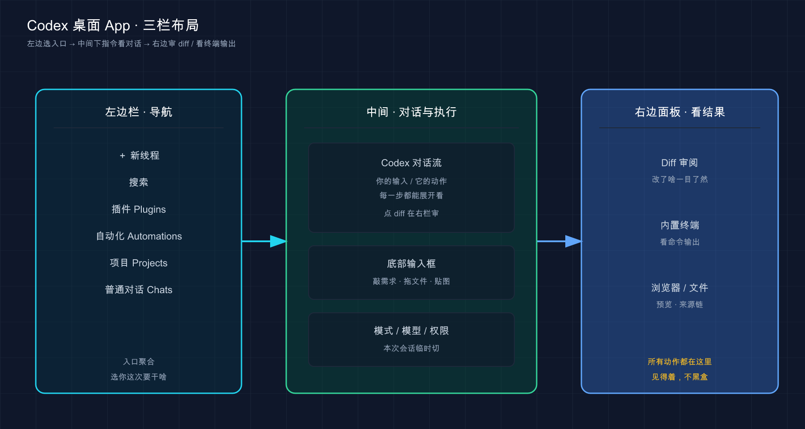
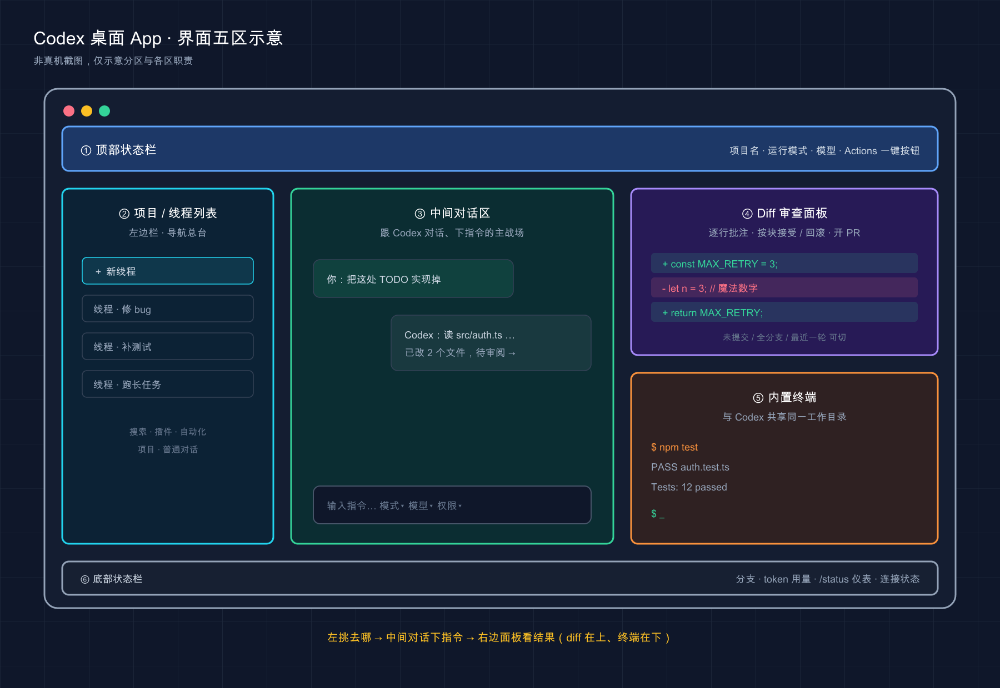
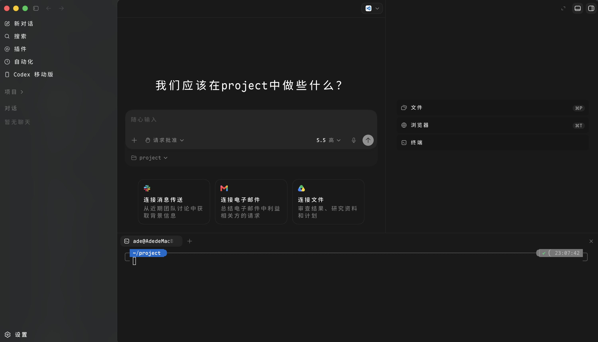

# 07 · 桌面 App 全景

> 📚 **系列导航**：上一篇 [06 跑通第一个任务](06-first-task.md) 让你发出了第一条指令、看着 Codex 真把活干完。这一篇正式进它官方**最主推的入口**——桌面 App，把界面分区、能干的事、关键设置和快捷键一次性铺平。下一篇 [08 命令行 CLI 上手](08-cli.md) 再回终端，把另一条线补齐。

OpenAI 把 Codex 拆成四个入口，但官网首页的下载大按钮、文档里 `app` 那一整棵目录、连发布会演示都围着同一个东西转——**桌面 App**。不是 CLI、不是网页版，是这个独立窗口。

这不是随口一说。我数了下官方 `app` 目录下的子页面：features、commands、settings、review、worktrees、automations、browser、computer-use、local-environments、chrome-extension……**十几个页面专门讲桌面 App，CLI 的文档体量连它一半都不到**。官方把宝压在了哪，一目了然。

可吊诡的是，很多人第一反应是「桌面 App？那不就是给不会命令行的人的简化版吗，我直接上 CLI」。**说句实话，这判断放 Codex 身上是错的**——Codex 的桌面 App 不是 CLI 的阉割版，它把并行、Worktree 隔离、可视化审阅、内置浏览器、自动化全塞进了一个窗口，反而是功能最满的那个面孔。

这一篇就带你把这个窗口逛一圈：哪块区域干嘛、怎么并行不打架、改完怎么一眼看清、哪些快捷键最值得记。

**看完这一篇，你会拿到：**

- 一张桌面 App 界面分区图，左边栏 / 中间对话区 / 右边面板各管什么，一眼对上号
- 三种运行模式（Local / Worktree / Cloud）到底差在哪，什么活该选哪个
- 可视化审阅面板怎么用——逐行批注、按块接受 / 回滚、提交推送 PR 全在窗口里
- 内置终端、Actions 快捷按钮、Automations 自动化这些「CLI 给不了」的爽点
- 一份最该背的快捷键 + 斜杠命令对照表，外加一个能照抄的上手流程

> ⚠️ 下文凡涉及具体快捷键、设置项、默认行为，都以 Codex [官方文档](https://developers.openai.com/codex/app) 为准；快捷键官方文档目前**只给了 macOS 的标注**，Windows 上的键位以你本机 **Settings > Keyboard Shortcuts** 里显示的为准，下面会专门提醒。

---

## 01 先认门：桌面 App 是个什么定位

很多人装好桌面 App，对着满屏的栏、按钮、图标发懵，根本不知道从哪下手。先别急着点，**先搞清它的定位**，后面每块区域你才知道该往哪归。

先给结论：**Codex 桌面 App 是一个「为并行而生」的代码工作台**。官方原话叫它 "a focused desktop experience for working on Codex threads in parallel"——一个专注于「并行跑多个 Codex 线程（thread）」的桌面体验。这里的**线程（thread）**，你可以理解成一次独立的对话任务，第 06 篇你发的那条指令，背后就是一个线程。

**类比：一个带很多工位的开放式工作间。**（这里「工位」指每个独立的 Codex 任务线程，不是你实际坐的位置。）CLI 像你一个人坐在一张桌子前埋头干，干完一件再下一件；桌面 App 则像你当了个小组长，眼前一排工位，每个工位坐一个 Codex 在干不同的活——这边在修 bug、那边在补测试、角落那个在跑长任务——你站在中间扫一眼就知道谁干到哪了，谁卡住了喊你拍板。**「同时盯住一排活、随时切过去插手」才是桌面 App 的本命**。

它跟 CLI、IDE 扩展跑的是**同一个 Codex**，共享同一份 `AGENTS.md`（第 02 篇讲过的项目入职手册）、同一套 MCP 配置、同一批 Skills——这点官方反复强调。所以它不是「另一个弱化工具」，而是**同一个 Codex 换了个最适合并行和可视化的外壳**。

几个你真会用到桌面 App 的场景：

- **手头三四个互不相干的小需求**，想同时铺开跑，又怕它们改同一份文件打架。
- **接手一个陌生前端项目**，想边让 Codex 改、边用内置浏览器看页面效果。
- **每天早上想要一份「昨天代码库改了啥」的简报**，让它定时自动生成。

这三件事 CLI 要么做不了、要么得自己搭一堆脚手架，桌面 App 是开箱即用。

> 💡 **一句话总结**：桌面 App 不是 CLI 的简化版，**它是同一个 Codex 套了个「为并行 + 可视化」打造的工作台外壳**，官方主推的就是它。

---

## 02 装它：两个平台，外加一条 Linux 的坏消息

先把最扫兴的一条放最前面：**Linux 目前没有桌面 App**。

这不是你漏装了什么，是官方还没出——Linux 用户官网挂了个[填表等通知](https://openai.com/form/codex-app/) 的页面，在那之前**老老实实用 CLI**（下一篇就讲）。所以下面只说 macOS 和 Windows。

安装本身第 03 篇已经手把手带过了，这里只把和桌面 App 强相关的几条拎出来再钉一遍：

| 平台 | 怎么拿 | 容易栽的坑 |
|------|--------|-----------|
| **macOS（Apple Silicon）** | 到官网桌面 App 下载页（按钮直达）下默认包 | 下错芯片版本装不上 |
| **macOS（Intel 芯片）** | 同页选 **Intel build** | 别下成 Apple Silicon 的 |
| **Windows** | 经 Microsoft Store 分发；命令行可 `winget install Codex -s msstore` | 沙箱相关配置见第 03 篇 |
| **Linux** | 暂无，[填表等通知](https://openai.com/form/codex-app/) | 先用 CLI 顶上 |

装好打开 App，登录这一步有个**新手最容易忽略的隐性门槛**，必须单独说：

**桌面 App 用 ChatGPT 账号登录功能最全；用 OpenAI API key 登录，部分功能会受限或不可用。** 官方原话是 "some functionality might not be available"。具体哪些功能在 API key 下用不了，**变化较快，一律以官方计费 / 功能可用性页面为准**——但你记住一个原则：**想把桌面 App 的本事吃满，就用 ChatGPT 账号登**。这也呼应第 04 篇讲的：Codex 跟着 ChatGPT 套餐走，Plus / Pro / Business / Edu / Enterprise 都含 Codex 用量。

我自己 2026 年三月第一次装桌面 App 时图省事，顺手贴了个 API key 登进去，结果点某个云端相关的功能一直灰着，还以为是版本 bug，折腾了十几分钟才反应过来是登录方式的锅。**退出来换 ChatGPT 账号重登，灰的地方立马亮了。** 这坑我替你踩过了。

> 💡 **一句话总结**：桌面 App **只有 Mac / Windows，Linux 还在排队**；Mac 注意分清 Intel / Apple Silicon 包，登录优先用 **ChatGPT 账号**——API key 会让部分功能掉线。

---

## 03 界面分区：左边栏 / 中间区 / 右边面板各管什么

打开桌面 App，画面大致分三竖条：**左边栏管「去哪」、中间管「干活和对话」、右边面板管「看结果」**。把这三块对上号，你就不会再对着满屏按钮发懵了。

先上一张分区示意图，看不到图也不影响，记住下面的拆解就行：



这张图想说的是：**你从左边栏挑「在哪个项目、开哪个线程」→ 在中间跟 Codex 对话、下指令 → 在右边面板审阅它干出来的结果**，工作流是从左到右流动的。下面逐块拆。

### 左边栏：你的「导航总台」

左边栏从上到下，是你管理一切的入口（名称以你本地实际显示为准，官方界面在持续微调）：

- **新线程**：开一个全新任务。这是你用得最勤的按钮。
- **搜索**：翻历史对话、项目记录。大项目里相当于全局搜索。
- **插件（Plugins）**：给 Codex 加外部能力，比如浏览器、GitHub。
- **自动化（Automations）**：让 Codex 定时自动跑任务（第 05 节细说）。
- **项目（Projects）**：你绑定的代码仓库 / 文件夹列表，多项目在这切。
- **普通对话（Chats）**：不绑项目的纯聊天，适合查个东西、做点调研。

这里有个**新手最容易混的点**，单独拎出来：**项目（Project）不等于普通对话（Chat）**。

**类比：项目是「带工牌的正式工」，普通对话是「门口问路的访客」。** 项目绑定到你电脑上一个具体文件夹，Codex 进去能读文件、改代码、跑命令——它有「工牌」，能进车间动手。普通对话则不挂任何项目，官方说它用的是 Codex 自己管的一个 `threads` 目录（默认 `~/.codex/threads` ），适合研究、规划、调插件这类**不需要碰你代码仓库**的事——就像门口问路的访客，聊得欢但进不了车间。

真实场景对照：

- 想让 Codex **改你 `~/code/my-app` 里的登录逻辑** → 用项目。
- 想问它「Rust 的所有权到底咋回事」**纯查资料** → 用普通对话，不用挂项目。

### 中间区：对话和下指令的主战场

中间这一大块主工作区是核心：上半是 Codex 的对话流（它读了啥、改了啥、跑了啥命令一路滚下来），底部是输入框。输入框这一排藏着几个关键开关，发指令前先扫一眼：

- **模式选择**：Local / Worktree / Cloud，决定这个线程在哪跑（第 04 节专讲）。
- **模型选择**：切当前用哪个模型，会话中途也能换。
- **权限选择**：就是第 02 篇讲的审批策略，控制 Codex 动手前问不问你。

### 右边面板：看 Codex 干了啥

右边面板默认可能收着，**点右上角那个面板图标能把它展开**。它是「结果展示区」，最常用的三样：

- **Diff 审阅**：Codex 改了哪些文件、具体改在哪几行（第 03 节的重头戏）。
- **内置终端**：和 Codex 共享同一个工作目录的终端（第 05 节讲）。
- **预览**：网页、文件、图片、来源（Sources）这类，点了就在这显示。

把上面三块拼到一个窗口里，大致就是下面这个样子：



这张图把桌面 App 的窗口拆成六块标了出来——顶部状态栏（项目 / 模式 / 模型 / Actions ）、左侧项目与线程列表、中间对话区、右上 Diff 审查面板、右下内置终端、底部状态栏（分支 / token 用量 / 连接状态 ），底部那行箭头点的就是「左挑去哪 → 中间下指令 → 右边看结果」这条主线。**这是示意图，真实界面以官方 / 真机为准**——官方布局在持续微调，区域位置和名称可能和你本机略有出入，对上「每块管什么」即可。

示意图讲清了「每区职责」，再看一眼真机长啥样，对照着就更踏实：




> 💡 **一句话总结**：界面就三竖条——**左边栏挑去哪、中间跟 Codex 对话下指令、右边面板看它干出来的结果**；记牢「项目能动代码、普通对话只闲聊」这条区分，少走一半弯路。

---

## 04 三种运行模式：Local / Worktree / Cloud 怎么选

发第一条消息前，输入框下方让你选一个**运行模式**。这是桌面 App 里最该一次搞懂的设定——选错了，要么改动污染了你的主分支，要么活儿跑去了你够不着的地方。

官方给的三种模式：

| 模式 | 在哪跑 | 改动落在哪 | 啥时候用 |
|------|--------|-----------|---------|
| **Local** | 你本机，当前项目目录 | **直接改你的工作目录** | 日常开发、想立刻看到结果 |
| **Worktree** | 你本机，独立 Git worktree | 隔离的副本里，不碰主目录 | 想试个新想法、或多个任务并行不打架 |
| **Cloud** | OpenAI 云端隔离环境 | 云上沙箱，结果以 PR / 报告回来 | 长任务挂后台、不占本机 |

官方特意点了一句关键的：**Local 和 Worktree 都跑在你自己电脑上**，只有 Cloud 是远程的。别被「Worktree 听着很高级」吓到，它本质还是在你本机干活，只是换了个隔离的文件夹。

重点说 **Worktree**，因为它是桌面 App「并行不打架」的命根子。

**类比：给同一份蓝图复印好几套，各画各的。** 你和几个 Codex 都在改同一个项目（同一份蓝图），如果都挤在 Local 这一份原件上画，笔触必然互相覆盖。Worktree 的做法是——**给每个任务复印一套完整的蓝图副本**（一个 Git worktree，底层就是 `git worktree`），各画各的，谁也别想动到别人那张；等某张画好了，再决定要不要并回原件。**在合并之前，一个线程的改动绝不会污染另一个**。

第 02 篇讲沙箱时我提过一次踩坑，这里再补一个跟 Worktree 直接相关的真实教训：我四月有次在 Local 模式下同时开了两个线程改同一个仓库，一个在重构数据层、一个在改路由，结果两边都动了同一个配置文件，第二个线程一提交把第一个的改动盖了一半，我对着 `git diff` 懵了好一会儿才反应过来。**后来凡是「同一项目并行」，我一律开 Worktree，再没出过这种互相覆盖的事。**

几个关于 Worktree 必须知道的官方事实，免得你踩坑：

- **Worktree 只能用在 Git 仓库里**——底层就是 `git worktree`，没 Git 玩不转。项目不是 Git 仓库，审阅面板会提示你先建一个。
- **Worktree 只继承 Git 里的文件**——`.gitignore` 里的东西（比如 `.env` 、`node_modules`）**不会**跟着进去。所以新 worktree 里常常缺依赖，得靠「设置脚本」补上（第 05 节讲 Local Environments 时细说）。
- **存哪**：Codex 把 worktree 建在 `$CODEX_HOME/worktrees` 下（`CODEX_HOME` 默认 `~/.codex` ），而且默认处于 "detached HEAD" 状态，不会污染你的分支。
- **Handoff（交接）**：想把一个线程在 Local 和 Worktree 之间挪，用线程头部的 **Hand off**，Codex 自己处理底层 Git 操作。比如在 worktree 后台跑完，想拿回主目录用熟悉的 IDE 看，就 Handoff 到 Local。
- **会自动清理**：官方默认只保留最近 **15** 个 Codex 托管的 worktree，旧的会自动删（删前存快照，能恢复）。这个上限和自动删除能在设置里改。

> 注意：上面这些数字和默认值（比如「保留 15 个」）官方在持续调整，看到时**以你本地设置面板显示的为准**。

> 💡 **一句话总结**：**Local 直接改主目录、Worktree 给每个任务一份隔离副本、Cloud 把活外包到云上**；想在同一项目里并行又不打架，闭眼选 Worktree——但记牢它只继承 Git 里的文件。

---

## 05 那些「CLI 给不了」的爽点

桌面 App 真正拉开和 CLI 差距的，是下面这几样**图形界面才玩得转**的东西。一个个说。

### 可视化审阅面板：改对没改对，一眼看清

这是图形界面相对纯终端**最直观的提升**。CLI 里 Codex 改完代码，diff 是一片绿加红的文本流；桌面 App 把它变成了**能点、能逐行批注、能按块接受或回滚**的审阅面板（Review pane）。

**类比：从「读邮件全文」升级到「在文档里改批注」。** CLI 看 diff 像收到一封纯文本邮件，你只能从头读到尾、想反馈得另起一段打字描述「第几行那个变量名改一下」；审阅面板像在 Word / 飞书文档里开了批注模式——**你直接戳在那一行上写意见**，精准太多。

审阅面板的关键能力（全部来自官方）：

- **默认看「未提交的改动」**：它反映的是你整个 Git 仓库的状态，不只是 Codex 改的——你自己手改的、其它未提交的，都会显示。
- **能切看的范围**：除了「未提交」，还能切到 **All branch changes**（跟基线分支比）和 **Last turn changes**（只看 Codex 最近这一轮改了啥）。本地还能在 **Unstaged / Staged**（未暂存 / 已暂存）之间切。
- **逐行内联批注**：把鼠标悬到 diff 某一行，点冒出来的 **+** 按钮，写下反馈提交。批完再给线程发一句话（比如「按内联批注改，范围保持最小」），Codex 就照着改。
- **按粒度暂存 / 回滚**：整份 diff、单个文件、单个 hunk（代码块）三种粒度，都能 stage（暂存）、unstage 或 revert（丢弃）。看中哪块留哪块，不想要的一键回滚。

> **审完还能直接发出去**：本地和 worktree 的任务，看完 diff 满意了，直接在 App 里 commit、push、建 Pull Request，不用切终端。

> 提醒：审阅面板**只对 Git 仓库里的项目生效**。不是 Git 仓库的话，它会先提示你建一个。要在 App 里处理 GitHub 上的 PR 评论，机器上得装好并登录 [GitHub CLI（`gh`）](https://cli.github.com/) ——跑一句 `gh auth login` 授权，否则 PR 上下文可能加载不出来。

我自己用下来，**逐行批注这一下是真香**。以前在 CLI 里想让它改某处，得费劲描述「就是那个处理超时的函数里、大概第二三十行那个魔法数字」，它还经常找错地方；现在直接点在那行上写「这数字抽成常量」，一发一个准。

### 内置终端：和 Codex 共享同一个环境

每个线程都自带一个**内置终端（integrated terminal）**，作用域就是当前项目或 worktree。**点右上角的终端图标，或按 macOS 的 `Cmd + J` 打开**（Windows 键位见第 06 节，以本机设置为准）。

它最妙的一点：**这个终端开在线程的工作目录里，跟 Codex 共享同一个环境**。你在里头跑 `git status` 或 `npm test`，看到的就是 Codex 正在改的那一份文件，不会出现「它改了但我终端里是旧的」这种错位。更进一步——**Codex 能读这个终端的输出**，所以它能瞄一眼你跑的开发服务器状态、回头看一眼刚才那次构建为啥挂了。

> 一个容易踩的快捷键坑（官方专门写了）：`Cmd + K` 在桌面 App 里是**打开命令菜单**，不是清空终端。想清终端用 `Ctrl + L`。

### Actions：把常用命令变成顶部按钮

老敲同一串命令（`npm run dev` 、跑测试、格式化）？桌面 App 让你把它存成 **Action（操作）**，变成窗口顶部一个**一键按钮**。

**类比：把常点的外卖存成「再来一单」。** 每次重新搜店、选菜、下单太烦，存个「再来一单」点一下就行。Actions 就是给项目常用命令存的「再来一单」——点一下，它在内置终端里跑起来。

Actions 配在哪？跟 Worktree 的「设置脚本」一起，都属于 **Local Environments（本地环境）**，配置存在项目根目录的 `.codex` 文件夹里，能提交进 Git 全队共享。设置脚本是「新建 worktree 时自动跑」的（专治上一节说的「worktree 缺依赖」），Actions 是「你手动点着跑」的，两者搭配，worktree 一建好依赖就齐、常用命令一键就到。

### Automations：让它定时自动干活

**Automations（自动化）** 让 Codex 按时间表自动跑任务——定时、每天、每周都行。

**类比：给 Codex 设个闹钟 + 待办。** 闹钟一响（到点了），它自己起来把你预先交代的待办干掉，干完把结果放你收件箱。

官方给的几个实用例子：

- **每日代码库简报**：分析最近提交，生成一份「昨天改了啥」的摘要。
- **遥测错误监控**：定期检查 telemetry 里的报错，试着自动修。
- **线程自动化（thread automation）**：让某个线程定时「醒来」继续长期任务，保留上下文——适合需要反复回到同一个对话往下推的活。

> 前提：Automations 要正常跑，得 **App 开着、对应项目在磁盘上可用**。

我四月给一个个人项目设过一条「每天上午把昨天的 commit 总结成中文日报」的 Automation，挂了两周，每天早上打开 App 就躺着一份现成简报——**这种「人没动、活已经干了」的体验，是 CLI 给不了的**。

> 💡 **一句话总结**：审阅面板（逐行批注 + 按块回滚 + 直接开 PR）、共享环境的内置终端、一键 Actions、定时 Automations——**这四样是桌面 App 甩开 CLI 的核心，全靠图形界面才玩得转**。

---

## 06 快捷键与斜杠命令：最该背的那几个

桌面 App 的快捷键不少，但你不用全记。先说一条**重要前提**：

> 官方快捷键文档目前**只标了 macOS 键位**。Windows 上对应的键以你本机 **Settings > Keyboard Shortcuts** 面板里显示的为准——那里能搜命令名、也能改键位，拿不准就去那查，别照搬 Mac 的 `Cmd` 硬套。

下面这些是我用下来**回报率最高**的 macOS 快捷键（全部来自官方 commands 文档）：

| macOS 快捷键 | 干什么 | 为什么值得记 |
|-------------|--------|-------------|
| `Cmd + Shift + P` 或 `Cmd + K` | 打开命令菜单 | 啥都能从这搜着干，记不住别的就记这个 |
| `Cmd + N` 或 `Cmd + Shift + O` | 新建线程 | 并行的起点，用得最勤 |
| `Cmd + J` | 切换内置终端 | 跑命令验证改动，高频 |
| `Cmd + B` | 切换左边栏 | 想要更大对话区时收起它 |
| `Cmd + Option + B` | 切换 Diff 审阅面板 | 审改动一开一关 |
| `Cmd + G` | 搜历史线程 | 翻旧任务全靠它 |
| `Cmd + F` | 在当前线程里查找 | 注意：只搜当前线程，不跨线程 |
| `Cmd + ,` | 打开设置 | 改外观、Git、MCP 全在这 |
| `Ctrl + L` | 清空终端 | 别误用 `Cmd + K`（那是命令菜单）|
| `Ctrl + M` | 语音输入 | 按住说话，转成文字 |

> 一个细节：搜历史线程（`Cmd + G`）和「在当前线程里查找」（`Cmd + F`）是两码事——前者跨所有线程翻旧对话，后者只在你打开的这一个线程里找文字。别用混了。

再说**斜杠命令（slash command）**。在输入框打 `/` 会冒出一个列表，这是不离开对话框就能控制 Codex 的快捷开关。官方目前列的这几个：

| 斜杠命令 | 作用 |
|---------|------|
| `/status` | 看当前线程 ID、上下文用量、限额情况 |
| `/review` | 开代码审查模式，审未提交改动或跟基线分支比 |
| `/plan` | 切换计划模式（开/关），做多步规划 |
| `/goal` | 设一个 Codex 要持续达成的目标（先用 `/plan` 把它捋清楚再设）|
| `/mcp` | 看已连接的 MCP server 状态 |
| `/feedback` | 提反馈（可附带日志）|

> 补充：在输入框打 `$` 能显式调用 Skills；启用的 Skills 也会出现在斜杠命令列表里。`/goal` 如果列表里没有，可能要在 `config.toml` 里开 `features.goals = true` 或跑 `codex features enable goals`（以官方为准）。

我自己最常按的是 **`/status`**——长任务跑一会儿，敲一下就知道上下文烧了多少、限额还剩多少，比闷头猜强。第 04 篇讲计费时说过 Codex 限额是按 token 烧的，`/status` 就是你随时盯油表的那个仪表。

> 💡 **一句话总结**：记不住一堆键就先记 `Cmd + K`（命令菜单啥都能搜）和 `Cmd + N`（新建线程）；斜杠命令里 **`/status`** 看用量、**`/review`** 开审查最值钱；**Windows 键位一律看本机设置面板**，别照搬 Mac。

---

## 07 动手：从打开到跑通第一个并行任务

光看不练假把式。下面走一遍**桌面 App 独有**的最小流程——开两个并行线程、用 Worktree 隔离、再用审阅面板看改动，每步都给你能自验的预期结果。

> 前提：你已按第 03 篇装好桌面 App、用 **ChatGPT 账号**登录了。**练手挑一个你熟的小项目，且它得是个 Git 仓库**（Worktree 和审阅面板都依赖 Git）。

### 第一步：加项目、选 Worktree 模式

左边栏点新建线程 / 加项目，**选一个 Git 仓库文件夹**。在底部输入框下方，**模式选 `Worktree`**（不是 Local）。

✅ 自验：能看到模式切到了 Worktree、底下让你选一个起始分支（基于 `main` 或当前分支都行）。**若提示「需要 Git 仓库」** → 你选的文件夹没初始化 Git，先 `git init` 或换个仓库。

### 第二步：发第一条指令

输入框里下个具体的小任务，比如：

```text
找一处 TODO 注释，把它实现掉
```

或者：

```text
给这个项目的 README 补一段「如何本地运行」的说明
```

按回车发送。**预期**：Codex 基于你选的分支建一个 Git worktree，在那份隔离副本里开干——你的主工作目录这会儿一动不动。

### 第三步：再开一个并行线程

不等第一个跑完，左边栏**再点一次新建线程**，同样选 Worktree 模式，下另一个不相干的任务，比如：

```text
把项目里所有 console.log 调试输出清理掉
```

✅ **预期结果**：左边栏现在列着**两个线程**，各自在**独立的 worktree** 里跑，互不干扰。这就是桌面 App 的命根子——**两个任务同改一个项目，却谁也污染不了谁**。你可以来回点着切，看各自进度。

### 第四步：用审阅面板看改动

挑一个跑完的线程，**打开右边的 Diff 审阅面板**（macOS `Cmd + Option + B` ，Windows 看本机键位）。你会看到改了哪些文件、具体改在哪几行。

试试这几个动作自验：

- **悬到某一行 → 点 `+`**：弹出批注框，写句反馈（比如「这里加个注释」），提交后给线程发一句「按内联批注改」，看 Codex 是否照改。
- **按 hunk 暂存 / 回滚**：看中的块 stage，不想要的块 revert。

✅ **预期结果**：你**点暂存 / 提交之前，Codex 的改动都还在 worktree 副本里待审**——满意了再 commit / push，不满意逐块回滚。这种「改完先摆给你审、你点头才落地」的节奏，正是桌面 App 让人放心的地方。

### 第五步（可选）：把线程交接回 Local

某个 worktree 线程改得满意、想拿回主目录用熟悉的 IDE 接着弄，点线程头部的 **Hand off** 交接到 **Local**，Codex 自己处理底层 Git 操作。

✅ **预期**：线程和代码一起挪进了 Local，你能在常用 IDE 里打开继续。**注意**：`.gitignore` 里的文件不会跟着交接过去（Handoff 走的是 Git 操作）。

到这步，你已经把桌面 App 最核心的一条链路跑通了：**多线程并行 → Worktree 隔离 → 可视化审阅 → 交接落地**。这套是 CLI 给不了的体验，第一次同时看着两个 Codex 在两份副本里干活、却互不打架，那种「这才是工作台」的实感挺明显的。

> 💡 **一句话总结**：开 Worktree 并行线程 → 等跑完 → 审阅面板逐行批注或按块回滚 → 满意再 commit，这条链路跑一遍，桌面 App 的核心体验就装进肌肉记忆了。

---

## 08 小结

这一篇把 Codex 官方最主推的入口——桌面 App——逛了一整圈，核心就这几条：

- **它的定位**：不是 CLI 的简化版，而是**同一个 Codex 套了个「为并行 + 可视化」打造的工作台外壳**，共享 `AGENTS.md`、MCP、Skills。
- **装它**：只有 Mac / Windows（Linux 排队中），登录优先用 **ChatGPT 账号**，API key 会让部分功能掉线。
- **界面三竖条**：左边栏挑去哪、中间跟 Codex 对话下指令、右边面板看结果；**项目能动代码、普通对话只闲聊**。
- **三种模式**：Local 直改主目录、**Worktree 给每个任务一份隔离副本**（并行不打架的命根子，只继承 Git 里的文件）、Cloud 外包到云。
- **CLI 给不了的爽点**：可视化审阅（逐行批注 + 按块回滚 + 直接开 PR）、共享环境的内置终端、一键 Actions、定时 Automations。
- **快捷键 / 斜杠命令**：记牢 `Cmd + K`、`Cmd + N`、`/status`、`/review`；**Windows 键位一律看本机设置面板**。

你现在应该能：在 Mac / Windows 上独立用起桌面 App、看懂界面每块区域、开多个并行线程且明白它们靠 Worktree 隔离、用审阅面板逐行批注并按块接受 Codex 的改动。**把并行这套跑顺，同时推几个需求就不再手忙脚乱了。**

---

下一篇 **[08 命令行 CLI 上手](08-cli.md)**——桌面 App 这么香，那 CLI 还学不学？答案是：**要脚本化、要进服务器、要塞进 CI 流水线，桌面 App 干不了这些，CLI 才是正解**。下一篇带你回到终端，把 `codex` 这条命令、交互界面、和自动化场景一次讲透——两条线都拿下，你才算把 Codex 真正用全。
