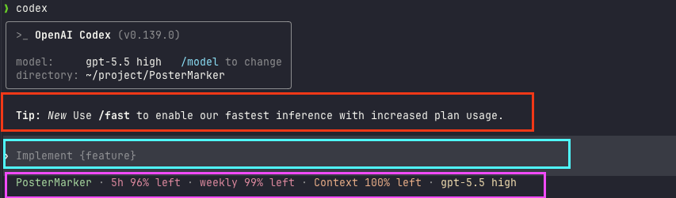
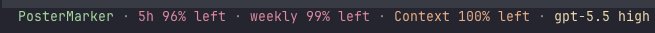

# 08 · 命令行 CLI 上手

> 📚 **系列导航**：上一篇 [07 桌面 App 全景](07-desktop-app.md) 带你把图形界面那套点法摸熟了——看 diff、并排跑任务、可视化审批。这一篇调头钻进终端，搞懂 `codex` 这条命令到底怎么用：命令结构怎么拆、交互界面长啥样、常用选项和斜杠命令各管什么。下一篇 [09 IDE 扩展（VS Code 等）](09-ide.md) 再把它塞进编辑器里。

都说「图形界面对小白最友好，能不碰命令行就别碰」——但说句实话，这话用在 Codex 身上，得打个对折。

我自己俩入口都用了小半年，结论很明确：**桌面 App 适合「看」，CLI 适合「干」**。你要可视化盯着每一处改动、同时摆开五个任务并排比较，桌面 App 确实爽。可一旦你想把 Codex 接进自己的工作流——写个脚本让它每天自动审一遍代码、在没有图形界面的云服务器上跑、或者干脆塞进 CI 流水线——**这些桌面 App 一个都办不到，全得靠 CLI**。

更反直觉的一点：**CLI 的「黑窗口」其实没那么黑**。Codex CLI 启动后不是让你对着一行光标干瞪眼，而是进了一个叫 TUI（Terminal User Interface，终端用户界面）的全屏交互界面——有对话区、有输入框、有状态栏，跟桌面 App 的信息密度差不太多，只是全用键盘操作。我第一次开它的时候还愣了一下：这哪是命令行，这分明是个「长在终端里的 App」。

所以这一篇不劝退、也不神化。**它只干一件事：把 `codex` 这条命令彻底讲透**，让你从「不敢敲」到「敲得顺」。

**看完这一篇，你会拿到：**

- 一张 `codex` 命令结构图——一条命令拆成哪几块、子命令和选项分别长在哪
- 交互式 TUI 的三块分区（对话区 / 输入框 / 状态栏）各看什么、怎么操作
- 一份**最该记的常用选项速查表**（`--model`、`--sandbox`、`--cd`、`--search`、`-i`……），全部对照官方 `cli/reference` 核对过
- 几个天天用的斜杠命令和键盘动作，外加一个能照着跑的最小验证流程
- 交互式（盯着干）和 `exec`（一句话跑完）两种跑法的分界线，知道啥时候用哪个

> ⚠️ 下文凡涉及具体命令、选项、默认行为，都以 Codex [官方文档](https://developers.openai.com/codex) 为准；模型名、套餐这类随版本变的东西，看到时以你本地实际显示为准，本篇不写死。

---

## 01 先把 `codex` 这条命令拆开看

很多新手怕命令行，不是怕敲字，是**怕那一长串带横杠的东西不知道哪个是哪个**——`codex exec --sandbox workspace-write --model xxx "干点啥"`，看着像天书。

其实结构特别规整。先给结论：**`codex` 这条命令，最多就四块拼起来——主命令、子命令、选项、提示词**。认住这四块，再长的命令你都能一眼拆开。

**类比：在咖啡馆点一杯定制咖啡。** `codex` 是你走进店里喊的那声「来杯咖啡」（主命令）；要不要换成「冰美式」还是「拿铁」，那是**子命令**（`exec`、`resume`、`cloud`……换一种喝法）；「少冰、加一份浓缩、燕麦奶」这些附加要求是**选项**（带 `--` 的那些）；最后你想让它干的活——「帮我看看这段代码」——就是**提示词**。一句话四个部分，缺哪个都行，但顺序是固定的。

拆开长这样：

```text
codex   [子命令]   [选项...]   ["提示词"]
  │         │          │            │
 主命令   换跑法     调参数      要干的活
```

逐块说清楚：

- **主命令 `codex`**：装好之后终端里就有这条命令了。光敲 `codex` 回车，进的是交互式 TUI。
- **子命令**：换一种「跑法」。比如 `codex exec` 是非交互式跑（一句话跑完就退出，不进界面）、`codex resume` 是接着上次的会话聊、`codex login` 是登录。**不写子命令，默认就是进交互界面。**
- **选项（flag）**：带 `--` 或 `-` 的开关，用来调参数。比如 `--model` 换模型、`--sandbox` 调沙箱、`--cd` 换工作目录。大部分选项有长短两种写法（`--model` 等于 `-m`）。
- **提示词**：用引号裹起来的一句话，是你这次想让它干的活。**可写可不写**——不写就进界面慢慢聊，写了它就直接拿这句话开干。

几个你立刻能上手的例子，从简单到复杂：

```bash
# 啥都不带，进交互界面
codex
```

```bash
# 带一句提示词，进界面后它直接开干
codex "解释一下这个项目的结构"
```

```bash
# 换个模型 + 指定工作目录
codex --model gpt-5.5 --cd ~/my-project "把 README 补全"
```

> ⚠️ 上面 `gpt-5.5` 只是个示意。**具体有哪些模型名、哪个是当前推荐，随版本变得很快**，敲 `/model` 看你本地实际列出来的就行，别照抄写死的型号。

看出来没——**再花哨的命令，也就是这四块的排列组合**。后面所有用法，都是往这个骨架上填东西。

> 💡 **一句话总结**：`codex` 命令就四块——主命令 + 子命令（换跑法）+ 选项（调参数）+ 提示词（干啥活），认住这个骨架，天书秒变填空题。

---

## 02 进了交互界面，先认住这三块

光敲 `codex` 回车，弹出来的就是 TUI。第一次见这一屏新手容易发懵：哪儿是我说话的地方？它干到哪一步了？

别慌，跟桌面 App 一个道理，**你只需要认住三块：对话区、输入框、状态栏**。其余滚动的内容都是它在「跟你汇报」，扫一眼就行。

**类比：看直播带货的画面。** 中间一大片是主播在演示（**对话区**，Codex 在这儿讲它的计划、贴代码、显示 diff）；最底下那条输入框是你打字发弹幕的地方（**输入框**，你所有指令从这儿进）；屏幕角落那行小字显示「在线人数、当前商品」（**状态栏**，显示当前模型、上下文用了多少、在哪个目录）。你看直播不用盯满屏，认住这三块就跟得上节奏。



逐块拆开：

- **对话区**（中间最大那片）：Codex 的「主场」。它在这儿一步步讲它要干啥、贴出改动的代码块和 Git diff，而且**代码和 diff 都带语法高亮**（官方特意做的，看着不费眼）。你审它改了什么，主要看这儿。
- **输入框**（最底下）：你跟 Codex 说话的**唯一入口**。打字、贴代码、贴截图、敲斜杠命令，全在这一行。
- **状态栏 / 页脚**（贴着输入框那几行小字）：显示会话的关键读数——当前用的哪个模型、上下文窗口还剩多少、当前工作目录、Git 分支等。官方还提供了 `/statusline` 让你自己挑要显示哪些字段、怎么排序，看不顺眼可以调。

这里插一个新手必踩的坑，提前给你打预防针：**屏幕突然花了、或者一半空白**。别以为它崩了。最常见的是你在 tmux 里跑 Codex，切窗口回来满屏乱码，看着像挂了想重启——其实按一下 `Ctrl+L` 就干净了，它强制重绘屏幕，**对话不会丢**。

我去年在一台 SSH 连过去的服务器上跑 Codex，网络抖了一下整个界面错位，当时差点 `Ctrl+C` 杀掉重来，幸好想起来这个键，一按就恢复了——**要是真重启，那一长串上下文就白攒了**。

不过这里有个 Codex 特有的、容易和 `Ctrl+L` 搞混的点，得说清楚：

`Ctrl+L` 只清屏幕、**不动对话**，会话照旧；而斜杠命令 `/clear` 是清屏幕**外加开一段全新对话**——上下文一起清空。一个是「擦黑板」，一个是「换张新黑板」，别按错。

> 💡 **一句话总结**：TUI 认住「对话区看它干啥、输入框你说话、状态栏看读数」三块就够开工；屏幕花了按 `Ctrl+L` 重绘（对话不丢），别跟清空对话的 `/clear` 搞混。

---

## 03 最该记的常用选项：八个就够日常

选项（flag）是 CLI 的灵魂，但官方 `cli/reference` 那张表列了几十个，全背没必要。我按自己的实际使用频率挑了**八个新手日常真会用到的**，其余的用到再查。

**类比：相机的几个常用旋钮。** 一台单反几十个按钮，但你 90% 的时间就拧那么几个——光圈、快门、ISO。选项也一样：**先把高频的这几个用顺，剩下的当「专业模式」，需要了再翻说明书**。

下面这张表，全部对照官方 `cli/reference` 核对过：

| 选项（长 / 短） | 干啥用 | 举个例子 |
|---|---|---|
| `--model` / `-m` | 临时换一个模型跑这次 | `codex -m gpt-5.5 "重构这个函数"` |
| `--sandbox` / `-s` | 选沙箱策略（`read-only` / `workspace-write` / `danger-full-access`） | `codex -s read-only "只帮我审一下别动手"` |
| `--ask-for-approval` / `-a` | 选审批时机（`untrusted` / `on-request` / `never`） | `codex -a on-request "修一下这个 bug"` |
| `--cd` / `-C` | 不用先 `cd`，直接指定工作目录 | `codex --cd ~/proj "讲讲这项目"` |
| `--add-dir` | 额外再放开一个可写目录（可重复） | `codex --cd app --add-dir ../shared` |
| `--image` / `-i` | 把图片（截图 / 设计稿）一起喂给它 | `codex -i error.png "这报错咋回事"` |
| `--search` | 这次开启「实时联网搜索」 | `codex --search "用最新的 API 写"` |
| `--oss` | 改用本地开源模型（需要本机跑着 Ollama） | `codex --oss "离线帮我写个脚本"` |

几个值得单独点一句的：

**`--cd` 是我用得最顺手的一个。** 以前我要在某个项目里开 Codex，得先 `cd` 进那个目录再敲 `codex`，两步。后来发现 `codex --cd ~/某项目 "..."` 一步到位，工作目录直接定到那儿，启动后 TUI 顶部还会显示当前路径，不怕搞错地方。

**`--sandbox` 和 `--ask-for-approval` 这对，是控制「它能动多大、动手前问不问你」的核心开关。** 这俩在第 02 篇「核心概念」里已经掰开讲过了（沙箱管能不能、审批管问不问），这里你只要知道**在命令行能临时指定它俩**就行。官方给的低风险日常组合是 `--sandbox workspace-write` 配 `--ask-for-approval on-request`——围栏锁着、要出圈才问，安全又不烦。**它们具体每档啥含义、怎么持久化进配置，第 15 篇「权限、沙箱与审批」专门展开**，本篇不重复。

**`--search` 默认走缓存：Codex 本地默认就开着网页搜索，只是用 OpenAI 维护的预索引缓存结果（降低被恶意网页注入的风险）；加 `--search` 这一次就切到实时。** 你要最新数据，单次加 `--search` 就从缓存切到实时联网。注意：不管缓存还是实时，**搜来的网页内容都该当成不可信来源看待**。

那个最危险的开关也得提一句、但**别急着用**：

> ⚠️ `--dangerously-bypass-approvals-and-sandbox`（别名 `--yolo`）会**绕过所有审批和沙箱**，每条命令都直接跑、不拦不问。官方原话是「只在已经做好外部隔离的环境里用」。新手阶段**当它不存在**——你还没到需要它的时候，误用一次可能就让 Codex 在你整台机器上撒欢了。

> 💡 **一句话总结**：八个高频选项先用顺——`-m` 换模型、`-s` / `-a` 调权限、`--cd` / `--add-dir` 定目录、`-i` 喂图、`--search` 联网；`--yolo` 这种危险开关新手当它不存在。

---

## 04 斜杠命令：会话里的「遥控器按钮」

选项是**启动前**在命令行敲的；进了交互界面之后，你想中途调点啥，靠的是**斜杠命令（slash command）**——在输入框打一个 `/` 就弹出一长串。

**类比：电视遥控器上的功能键。** 电视开着的时候，你不会关机重开去换台、调音量——抬手按遥控器就行。斜杠命令就是 Codex 会话的遥控器：**不退出、不重启，输入框打个 `/` 当场调整**。换模型、改权限、清上下文、看改动……都是按一下的事。

官方内置了一大把（`/` 打出来自己翻），新手阶段先把下面这几个焊进肌肉记忆，其余的用到再说：

| 斜杠命令 | 干啥用 | 啥时候按 |
|---|---|---|
| `/model` | 当场切换模型（和推理强度） | 想换个更强 / 更快的模型时 |
| `/permissions` | 切换审批模式（Auto / Read Only / Full Access） | 想放开或收紧它的动手权限 |
| `/status` | 看当前会话信息（模型、审批策略、可写目录、上下文余量） | 不确定现在啥配置时，先看一眼 |
| `/diff` | 看 Git diff（含还没被 Git 跟踪的新文件） | 提交前审一遍它到底改了啥 |
| `/compact` | 把长对话压缩成摘要，腾出上下文 | 聊太久、上下文快满了 |
| `/review` | 让一个独立的审查代理审你的改动 | 写完想找「第二双眼睛」把关 |
| `/init` | 在当前目录生成 `AGENTS.md` 脚手架 | 想给项目立规矩、让它记住约定 |
| `/clear` | 清屏并开一段全新对话 | 想彻底换个话题、从头开始 |

这里有个 Codex 挺贴心的细节，官方文档专门写了：**任务正跑着的时候，你可以先把下一条指令或斜杠命令打好，按 `Tab` 排进队列**，等这一轮跑完它自动接着处理——不用干等。我经常在它跑测试的间隙，先把 `/review` 用 `Tab` 排好队，它一跑完审查无缝衔接，省了来回切的工夫。

> 注意：**斜杠命令体系内容很多**（光内置的就几十个，还能自定义），上面只是日常最常用的一小撮。**完整的斜杠命令清单、自定义命令怎么写，第 12 篇「斜杠命令与快捷键」专门展开**，本篇你只要知道「`/` 是会话遥控器」、记住上面这几个救急的就够了。

> 💡 **一句话总结**：进了界面靠斜杠命令当遥控器，`/model` 换模型、`/permissions` 调权限、`/status` 看状态、`/diff` 审改动是日常四大件；跑着任务能用 `Tab` 把下一条命令排进队列。

---

## 05 几个天天用的键盘动作

斜杠命令之外，还有一小撮**纯键盘动作**，是日常操作 TUI 的「快捷键」。挑官方文档里明确写了、且新手每天会用到的几个，记死就行：

| 键盘动作 | 作用 |
|---|---|
| `Ctrl+C` | 中断当前操作；也可用 `/exit` 关闭交互会话 |
| `Ctrl+L` | 重绘屏幕（清屏但**保留**当前对话） |
| `↑` / `↓`（上 / 下箭头） | 在输入框翻**草稿历史**（连之前贴的图片占位也能恢复） |
| `Ctrl+R` | 反向搜索提示词历史，回车选中、`Esc` 取消 |
| `Ctrl+O` | 复制 Codex 最近一条**已完成**的输出（等同 `/copy`） |
| `Tab` | 任务跑着时，把下一条输入 / 斜杠命令 / `!` 命令排进队列 |
| `Esc` `Esc`（输入框为空时） | 退回去编辑你上一条消息，继续按可往前翻，回车从那点重新分叉 |
| `Ctrl+G` | 在外部编辑器里写长提示词，写完带回输入框 |

两个特别值得单独说的：

**`!` 前缀——不打扰 Codex，顺手跑个 shell 命令。** 在输入框开头打 `!`，后面跟一条命令（比如 `!ls`、`!git status`），这条命令直接在你终端跑。官方说 Codex 会**把它的输出当成「用户提供的命令结果」收进上下文**，而且**照样走你的审批和沙箱设置**。它香在哪？想顺手看一眼仓库状态、又不想让 Codex 专门跑一趟烧 token——`!git status` 立等可取，而且 Codex 也「看到」了，下一句能接着这个状态聊。

```text
!git status
```

**`Ctrl+G` 开编辑器写长指令。** 嫌在小输入框里写几十行的复杂需求憋屈？按 `Ctrl+G`，Codex 会打开 `VISUAL` 环境变量指定的编辑器（没设就用 `EDITOR`），你在里头从容写完保存，内容自动带回输入框。写那种带格式的长 prompt 时我基本都这么干，比在终端里硬敲舒服太多。

还有个 `@` 前缀也提一句：在输入框打 `@` 会触发**工作区文件的模糊搜索**，按 `Tab` 或回车把选中的路径塞进消息里——想精准点名某个文件时用它，省得用大白话描述「那个 auth 文件」它找错。

平台差异提醒：上面的键在不同终端 / 系统下个别可能行为略有差异，Codex 还提供了 `/keymap` 让你查看和自定义 TUI 快捷键绑定。**键不顺手能改，但新手先把默认的用熟**，别一上来就折腾配置。

> 💡 **一句话总结**：键盘动作里 `!` 顺手跑命令、`@` 点名文件、`Ctrl+G` 开编辑器写长指令、`Tab` 排队、`Ctrl+O` 复制输出最常用；想改键有 `/keymap`，但先用熟默认的。

---

## 06 动手：五分钟把 CLI 跑一遍

光看不练明天就忘。下面给一套**最小验证流程**，不依赖任何复杂项目，新建个空文件夹就能跑。打开终端跟着走。

> 还没装 Codex CLI？回第 03 篇「安装与登录」装好再来。装没装成功，一句 `codex --version` 能看出来。

**第一步：建个空目录，进去启动。**

Mac / Linux 这么敲（Windows 用 PowerShell，把 `mkdir -p` 换成 `mkdir`）：

```bash
mkdir -p ~/codex-cli-demo && cd ~/codex-cli-demo
codex
```

**预期**：进入全屏 TUI，中间是对话区，最底下是输入框，贴着输入框有状态栏小字（显示当前模型、目录等）。

**第二步：用 `/status` 看一眼当前配置。**

在输入框打：

```text
/status
```

**预期**：Codex 打印出当前会话的概况——用的哪个模型、审批策略是啥、有哪些可写目录、上下文还剩多少。心里先有个底，知道自己现在是什么配置。



社区的 token-tracker 工具也能以图形化方式呈现类似信息（见上图），显示项目名称、5 小时 token 剩余量、一周使用剩余量、上下文占比、当前模型等字段。

**第三步：试 `!` 顺手跑条命令。**

在输入框开头打 `!`（顶格），后面跟命令：

```text
!echo hello-codex-cli
```

回车。**预期**：终端**直接**打印出 `hello-codex-cli`，而且这条命令和输出被收进了对话上下文——证明 `!` shell 模式生效了，全程没惊动 Codex 去「解释」。

**第四步：试 `↑` 翻草稿历史。**

输入框空着时，按一下**上箭头 `↑`**。

**预期**：你刚才那条 `!echo ...` 被原样调回输入框。这就是草稿历史，重发指令不用重打。先清掉它。

**第五步：试 `/diff` 看改动（顺便让它真干件活）。**

先让它干点会改文件的小事：

```text
新建一个文件 hi.txt，里面写一行 "hello from codex cli"。
```

它可能会停下来请求批准（取决于当前审批策略），同意即可。完事后打：

```text
/diff
```

**预期**：Codex 列出 Git 视角的改动，包括这个**还没被 Git 跟踪**的新文件 `hi.txt`。这就是提交前审改动的标准动作。

**第六步：退出。**

```text
/exit
```

**预期**：退出交互会话，回到普通终端。（按 `Ctrl+C` 也能中断 / 退出。）

跑完这六步，本篇讲的 TUI 分区、`/status`、`!` shell、草稿历史、`/diff`、退出，你就全亲手验证过一遍了。

> ⚠️ 小插曲：如果第五步它没停下来问、直接就建好了，说明你当前审批策略比较宽松（比如 Auto 档下在工作区内写文件本就不拦）——这不是 bug，正是第 02 篇讲的沙箱 + 审批在按规则放行。想看它「停下来问」那一下，用 `/permissions` 切到 `Read Only` 再让它建文件就能复现。

> 💡 **一句话总结**：照着这六步亲手跑一遍，TUI 分区、`/status`、`!` 跑命令、`↑` 历史、`/diff` 审改动、`/exit` 退出全过一遍肌肉记忆，比看十遍表都记得牢。

---

## 07 交互式 vs `exec`：盯着干，还是一句话跑完

最后讲一个 CLI 独有、桌面 App 给不了的本事，也是很多人选 CLI 的真正理由——**非交互式跑法 `codex exec`**。

前面六节讲的都是「交互式」：你敲 `codex`，进界面，跟它来回聊、审它的每一步。但有些活根本不需要你盯着——比如「每天早上自动审一遍昨天的提交」「在 CI 里让它跑测试并修好失败用例」。这种「一句话丢进去、跑完吐结果就退出」的场景，就是 `exec`（别名 `codex e`）的主场。

**类比：点堂食 vs 点外卖。** 交互式像堂食——你坐店里，菜一道道上、边吃边跟厨师反馈「这个再咸点」。`exec` 像点外卖——你下单（一句提示词），厨房关起门做完直接送到（结果打到 stdout），中间不用你在场。**要盯着调整用堂食（交互式），要批量自动化用外卖（`exec`）。**

最简单的样子：

```bash
codex exec "审查当前改动，列出潜在 bug"
```

它会读工作目录、定个计划、把最终结果**流式打到终端**，然后退出——不进 TUI、不等你按键。

`exec` 几个新手用得上的选项（同样对照官方 `cli/reference`）：

| `exec` 选项 | 干啥用 |
|---|---|
| `--model` / `-m` | 指定这次用哪个模型 |
| `--json` | 输出按行的 JSON 事件（喂给脚本解析用） |
| `--output-last-message` / `-o` | 把最终那条消息写到文件里 |
| `--skip-git-repo-check` | 允许在非 Git 目录里跑（一次性目录方便） |
| `--ephemeral` | 不把会话记录落盘 |

把交互式和 `exec` 摆一起对比，你就知道什么时候用哪个：

| 维度 | 交互式（`codex`） | 非交互式（`codex exec`） |
|---|---|---|
| 跑完会怎样 | 进 TUI，停在界面等你继续 | 吐完结果直接退出 |
| 适合的活 | 探索、调试、需要来回沟通的 | 脚本、CI、批量、定时跑的 |
| 要不要你在场 | 要，你审它每一步 | 不要，丢进去就走 |
| 输出形态 | 界面里可视化看 | 流到 stdout，可配 `--json` 给机器读 |
| 典型场景 | 「帮我重构这块，咱边改边看」 | 「每天自动生成 changelog」 |

我自己的真实用法：手头需要边看边调的活，老老实实开交互式；而像「跑全套测试再修好失败用例」这种又慢又长、修完我直接看结果的活，我写进一个脚本用 `codex exec --sandbox workspace-write` 挂着跑。**官方还提了个 CI 里的实用搭配**：`--json` 配 `--output-last-message`——前者给你机器可读的过程事件，后者捞一份最终的自然语言总结，两边都不耽误。

> 注意：`exec` 是为「无人值守」设计的，所以审批时机通常配 `never`（没人在场点头）。这也意味着它**默认更放得开**，务必配合合适的沙箱策略，别在没隔离的环境里对着重要项目无脑 `exec`。`exec` 的脚本化、CI 集成是后面工程化章节的正题，本篇你先知道「有这么个非交互跑法、它和盯着干是两条路」就够了。

> 💡 **一句话总结**：交互式是「堂食」（盯着调、来回聊），`exec` 是「外卖」（一句话丢进去跑完就退）；要沟通用前者，要自动化 / CI / 批量用后者——这正是 CLI 比桌面 App 多出来的杀手锏。

---

## 08 小结

这一篇没教你怎么写需求（那是第 13 篇的事），专门把 `codex` 这条命令本身讲透了。

把核心收成一张表，揣兜里：

| 你想干嘛 | 怎么做 |
|---|---|
| 进交互界面 | 敲 `codex`（带提示词它直接开干） |
| 换模型 / 调权限（启动时） | `--model` / `--sandbox` / `--ask-for-approval` |
| 指定工作目录 | `--cd <路径>`（不用先 `cd`） |
| 喂图片给它 | `-i <图片>` |
| 会话里换模型 / 看状态 / 审改动 | `/model` / `/status` / `/diff` |
| 顺手跑条 shell 命令 | 输入框打 `!` 开头 |
| 屏幕花了 | `Ctrl+L`（对话不丢） |
| 写长指令 | `Ctrl+G` 开编辑器 |
| 一句话跑完就退（自动化） | `codex exec "..."` |

**你现在应该能**：一眼把任意一条 `codex` 命令拆成「主命令 + 子命令 + 选项 + 提示词」；认出 TUI 的对话区、输入框、状态栏；用八个高频选项启动、用斜杠命令中途调整、用 `!` 和 `Ctrl+G` 提速；还能分清「盯着干的交互式」和「一句话跑完的 `exec`」该在什么场合用哪个。

**最该带走的一句话**：CLI 不是「简化版桌面 App」，而是**功能更全、还能接进自动化的那一个**——黑窗口的门槛，一旦迈过去，你会发现它比图形界面能干的事多得多。

---

下一篇 **〔09 IDE 扩展（VS Code 等）〕**：命令行摸熟了，但你平时写代码大概率是泡在编辑器里的。下一篇就把 Codex 塞进 VS Code、Cursor 这些 IDE 里——侧边栏直接对话、改动直接在编辑器里看 diff，**命令行那套能力，怎么不出编辑器就用上**？咱们下篇接着聊。
