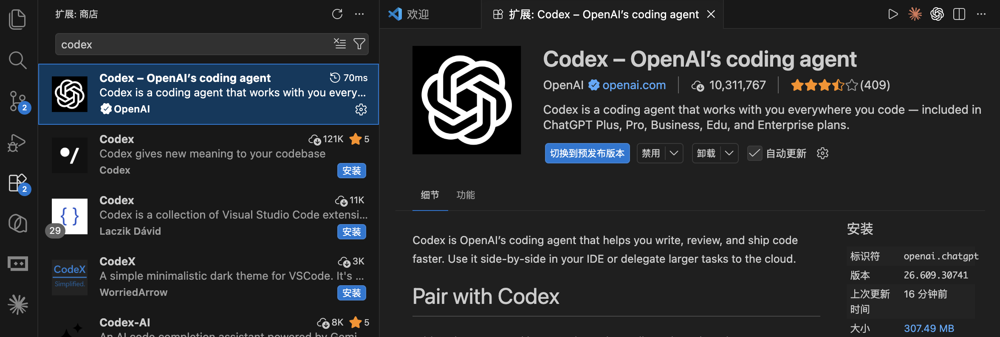
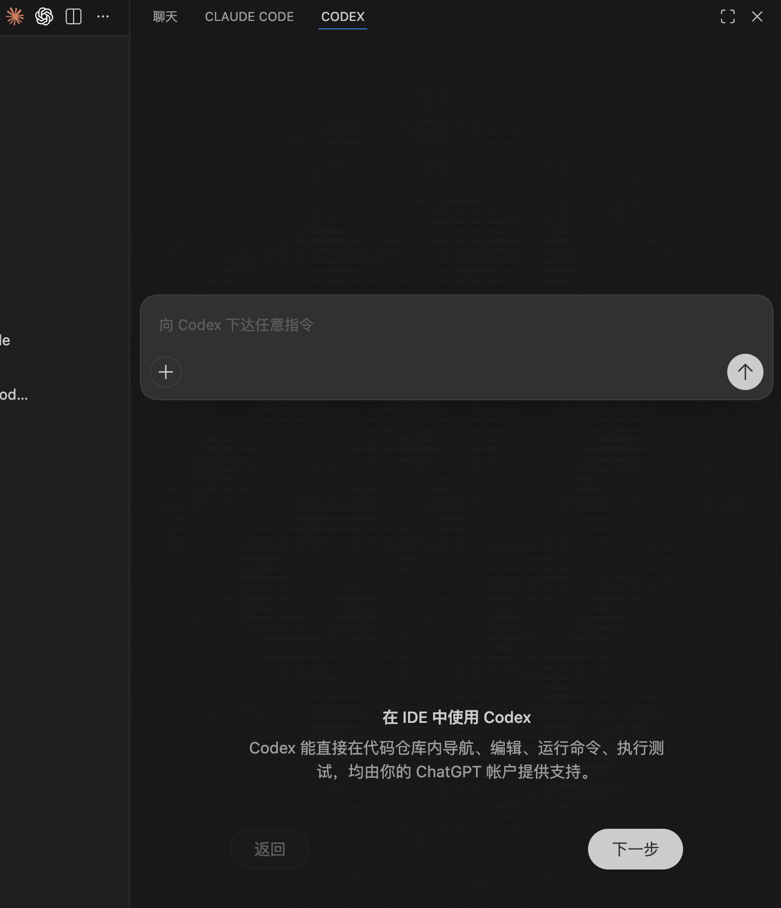

# 09 · IDE 扩展（VS Code 等）

> 📚 **系列导航**：上一篇 [08 命令行 CLI 上手](08-cli.md) 带你在终端里把 `codex` 敲熟了。这一篇把 Codex 搬进 VS Code——同一个代理、同一份配置，换成有图形界面、能并排看 diff 的玩法。下一篇 [10 云端 Codex Cloud](10-cloud.md) 再把活儿外包到云上跑。

先还原一段我上个月跟同事的真实对话。

> 同事：「我在 VS Code 里搜 `Codex`，咋一个官方的都搜不到？跳出来一堆名字带 codex 的小插件。」
> 我：「你搜错关键词了，官方扩展不叫 Codex，它的 ID 是 `openai.chatgpt`。」
> 同事：「啥？OpenAI 把 Codex 的扩展叫 ChatGPT？这谁猜得到。」
> 我：「就这一个名字，我也卡过五分钟。认 publisher 是 OpenAI 的那条，装就对了。」

说白了，**Codex 的 IDE 扩展第一道坎不在用，在「找对它」**——名字反直觉、Cursor 里默认还藏在折叠的扩展栏里。这篇把这些反直觉的点提前给你标出来，再把图形界面相比 CLI 真正爽的那几样讲透。

**看完这一篇，你会拿到：**

- 在 VS Code / Cursor / Windsurf 里装上 Codex 扩展的完整步骤，外加「搜不到 / 图标找不到」的排查清单
- 编辑器上下文（`@file`、选中代码自动喂）、三档审批模式（approval mode）、模型与思考深度切换这几个图形界面爽点怎么用
- 一张「扩展 vs CLI vs 桌面 App 该用哪个」的对照表，外加扩展独有的斜杠命令和可自定义的快捷键

---

## 01 先搞清楚：扩展、CLI、桌面 App 是什么关系

「我前面已经会用终端里的 `codex`、桌面 App 也装了，还要不要再来个扩展？」先给结论：**扩展不是第四个新工具，它就是把 Codex CLI 套了一层编辑器界面**。官方说得很直白——IDE 扩展「用的是和 Codex CLI 同一个代理，共享同一份配置」。你在 `~/.codex/config.toml` 里调好的模型、沙箱、审批策略，扩展全部照单继承；你在 CLI 里登录、写的 `AGENTS.md`，扩展这边一样认。

**类比：同一辆车，方向盘和遥控器两套操控。** CLI 是你坐进驾驶座握方向盘——直接、全功能、什么挡都能挂；扩展是配套的遥控器，让你不用钻进驾驶座，在编辑器里点几下就把车开起来，还能在大屏上实时看车况（并排 diff）。**发动机、油箱、行车记录是同一套**——你换哪个操控，车还是那辆车。桌面 App（前面 03、07 篇讲过）则是同款车的另一个独立外壳，适合不想碰编辑器、要多任务并排盯的人。

那到底什么时候用哪个？我用下来的判断，整理成一张表：

| 场景 | CLI（终端） | IDE 扩展 | 桌面 App |
|------|-----------|---------|---------|
| 平时就泡在 VS Code / Cursor 里写代码 | 凑合 | ✅ 最顺，代码上下文开箱即喂 | 要切窗口 |
| 写脚本、批量自动化、SSH 上服务器干活 | ✅ 唯一选择 | ❌ | ❌ |
| 不想碰命令行、要多任务并排盯 | ❌ 劝退 | 一般 | ✅ 最舒服 |
| 看改动 diff、选中某段代码直接问 | 文本 diff，将就 | ✅ 原生并排 diff | ✅ 可视化 |
| 想用扩展里没有的全部 CLI 能力 | ✅ 全 | 在内置终端跑 `codex` 即可 | — |

一句话：**写代码、审改动这类「跟文件打交道」的活，扩展明显更顺手**；要批量跑命令或用扩展面板里没暴露的功能，直接在编辑器的集成终端敲 `codex`——它和扩展共享同一份配置和登录，无缝切。

> 💡 一句话总结：扩展、CLI、桌面 App 是同一个 Codex 的三张脸，**共享配置和登录、按手头的活随时切**，不用纠结二选一。

---

## 02 安装：认准 `openai.chatgpt`，外加 Cursor 的「图标藏起来」坑

### 支持哪些编辑器、哪些系统

官方明确：Codex IDE 扩展支持 **VS Code 及其分支 Cursor、Windsurf**（还有 VS Code Insiders），JetBrains 全家桶（IntelliJ、PyCharm、WebStorm、Rider 等）走的是另一个独立的 **JetBrains 集成**。系统层面 **macOS、Windows、Linux 全支持**；Windows 上既能用原生 Windows 沙箱直接跑，也能在需要 Linux 环境时切到 WSL2（细节见官方 Windows 指南）。

> 国内提示：装扩展、用 ChatGPT 账号登录、之后让 Codex 干活都要连 OpenAI 服务，**全程需要魔法上网**，和终端版一致。

### 三种安装方式

**方式一：扩展市场搜（最稳，但要搜对名字）**

在编辑器里按 `Cmd+Shift+X`（Mac）或 `Ctrl+Shift+X`（Windows / Linux）打开扩展视图。**这里是全篇第一个坑**：很多人顺手搜 `Codex`，结果跳出一堆第三方小插件，就是不见官方那条。原因是——**官方扩展的 ID 是 `openai.chatgpt`，发布者（publisher）是 OpenAI**。搜 `Codex` 或 `ChatGPT` 都行，但认准发布者是 **OpenAI** 的那条再点安装，别装成仿冒的。
比如 VS Code 中搜 codex：


**方式二：点链接直装**

开着编辑器时，点对应链接会直接跳到安装页：

```text
VS Code   : vscode:extension/openai.chatgpt
Cursor    : cursor:extension/openai.chatgpt
Windsurf  : windsurf:extension/openai.chatgpt
```

**方式三：命令行装（最快）**

如果 `code` / `cursor` 命令行工具已经装好，一行搞定：

```bash
code --install-extension openai.chatgpt
```

Cursor 把 `code` 换成 `cursor` 即可。**预期输出**类似：

```text
Installing extensions...
Extension 'openai.chatgpt' was successfully installed.
```

> ⚠️ 上面那行扩展 ID `openai.chatgpt` 是官方写明的；这条安装命令我对照过官方仓库，ID 一致，可放心用。

### 装完图标找不到？分编辑器排查

官方说：装完后 **Codex 会出现在编辑器侧边栏，VS Code 里默认在右侧**。但不同编辑器表现不一样，照下面这张表对号入座：

| 现象 | 你用的编辑器 | 排查动作 |
|------|------------|---------|
| 装完没立刻看到 Codex | VS Code | 官方建议：**重启一下编辑器**，再看右侧栏 |
| 右侧栏空空的 / 找不到入口 | Cursor | Cursor 的活动栏默认是横排，**折叠项会把 Codex 藏起来**——把它 pin 出来、调一下扩展顺序 |
| 想把 Codex 挪回左边主侧栏 | VS Code | 直接把 Codex 图标**拖回左侧活动栏**即可 |
| 想在 Cursor 里把它挪到右侧 | Cursor | 设置搜 `activity bar`、把朝向改成 `vertical`、重启，再拖到右侧，最后把朝向改回 `horizontal` |

我自己在 Cursor 里就栽过第二条：装完在右上角翻了半天没有 Codex，差点以为没装上，后来才发现它被折叠在活动栏的「更多」里——**Cursor 的横排活动栏一挤就把后装的扩展收进折叠菜单**，pin 出来就好了。这个坑 VS Code 用户碰不到，Cursor 用户基本人均踩一次。

### 第一次打开要登录

第一次点开 Codex 面板会提示登录，用 **ChatGPT 账号**或 **API Key** 二选一。官方特意说了一句省心的话：**你的 ChatGPT 订阅本身就含 Codex 用量**，所以多数人直接用 ChatGPT 账号登就行，不用额外配 API Key。具体哪档订阅给多少额度，看 04 篇，或以官方计费页为准。

> 扩展是**自动更新**的；想手动确认版本，去编辑器的扩展页点一下检查更新即可。

> 💡 一句话总结：装扩展认准发布者 **OpenAI**、ID 是 **`openai.chatgpt`**；VS Code 装完重启就有、默认在右侧，**Cursor 记得把被折叠的图标 pin 出来**。

---

## 03 编辑器上下文：把「你说的是哪段代码」喂准

让 Codex 干活最大的浪费，是它「不知道你指的是哪个文件、哪段代码」于是满项目瞎翻。**扩展相比 CLI 最大的便利，就是它能直接借用编辑器里的上下文。** 官方原话：当 Codex 拿到了你打开的文件和选中的代码，**你能写更短的提示，拿到更快、更相关的结果**。

**类比：当面指着图纸说话，而不是打电话描述。** 你跟装修师傅打电话说「客厅那面墙上靠窗那块」，对方还得脑补半天、容易理解错；当面把图纸摊开，手指头往上一戳「这儿」，一秒到位。CLI 像打电话（你得用文字把位置描述清楚），扩展像当面指图纸（选中、`@` 一下，位置就喂过去了）。

具体两招：

### 第一招：`@file` 提及文件

在提示框里用 `@` 跟上文件名，Codex 就会把那份文件当参考。官方给的示范长这样：

```text
用 @example.tsx 当参考，给 app 加一个叫 "Resources" 的新页面，
内容是 @resources.ts 里定义的资源列表
```

一句话里 `@` 了两个文件——一个当样板、一个当数据源，Codex 不用猜你说的是哪俩文件。

### 第二招：选中代码 + Auto Context，自动喂

这招比 `@` 还省事：**直接在编辑器里选中一段代码**，它就进了当前对话的上下文。扩展还有个叫 **Auto Context（自动上下文）** 的开关，开着的时候会**自动把你最近打开的文件、编辑器上下文**带进去——你可以用斜杠命令 `/auto-context` 随时开关它（斜杠命令清单见第 06 节）。

除了选中自动喂，官方还提供两个把上下文「钉」进对话的命令，可以在命令面板里跑、也能绑快捷键：

| 命令 ID | 干啥 |
|---|---|
| `chatgpt.addToThread` | 把**选中的那段代码**加进当前对话当上下文 |
| `chatgpt.addFileToThread` | 把**整个文件**加进当前对话当上下文 |

我自己排查一个 React 组件的样式 bug 时最爱用第二招：选中那段可疑的 JSX，直接问「这块为什么渲染错位」，不用打一个字去描述它在哪——**它两轮就定位到是父容器的 flex 设置串了**。要是用 CLI，光把那段嵌套结构用文字讲清楚就得敲半天。

> ⚠️ 想拖图片进提示框当参考？官方提醒：**拖放图片时按住 `Shift`**，否则 VS Code 会拦住扩展的拖放（这点和它处理附件的机制有关）。

> 💡 一句话总结：`@file` 喂文件、选中代码 + Auto Context 自动喂上下文——**把「你说的是哪段」这个最大的猜测成本直接干掉**，提示能写得更短、结果更准。

---

## 04 三档审批模式：让它先聊方案，还是放手让它干

这一节是扩展里你最该搞清楚的开关。还记得 02 篇讲的「沙箱 + 审批」吗？在 CLI 里它们是两个维度分开拧；**在扩展里，官方把它简化成了输入框下方一个三档的「审批模式（approval mode）」切换器**，点一下就换，不用碰配置文件。



官方定义的三档是这样的：

| 审批模式 | Codex 的行为 | 什么时候用 |
|------|--------------|-----------|
| **`Agent`**（默认） | 在工作目录内**自动**读文件、改文件、跑命令；**要出工作目录或要联网，才停下来问你** | 日常开发的主力档 |
| **`Chat`** | 只聊天、只出主意，**动手前先规划**，不直接改 | 想先讨论方案、读代码、做审查，别动我东西 |
| **`Agent (Full Access)`** | 读、改、跑命令、联网**全部免审批** | 完全信任的环境，**官方原话「使用前务必谨慎」** |

**类比：实习生的三种授权级别。** `Chat` 是「只许你出方案、动手前先报备」；`Agent` 是「桌面这一摊你随便收拾，但要去别的部门或对外联系，先来问我一声」；`Agent (Full Access)` 是「全公司随你跑、对外联系也不用报备」——最后这档名字里带 Full Access 不是摆设，官方专门叮嘱了「谨慎」。

几个你真会遇到的场景：

- **接手陌生项目、只想让它先讲讲架构**：切 `Chat`，它只读不改，给你出方案，你心里有底了再放它动手。
- **日常增删改查**：用默认的 `Agent` 就好——工作区内的活它自己干，要 `pip install` 联网、要碰工作区外的文件，它会停下来问你。
- **跑一个你 100% 确定无害的批处理**：临时切 `Agent (Full Access)` 省得一路点同意，**但跑完记得切回来**。

这里我有个真实教训。今年四月我图省事，让 Codex 给一个模块批量补日志时全程挂着接近完全放开的档，它顺手把好几个文件的 import 顺序也「优化」了一遍，我回头花了十几分钟才理清它到底动了哪些地方。**从那以后我立了条规矩：默认就停在 `Agent`，只有自己百分百确定的活才临时升到 Full Access，干完立刻降回来。** 多文件大改动前，宁可先用 `Chat` 让它把方案讲一遍，在动手前就框住它，比事后收拾干净得多。

> 💡 一句话总结：扩展把权限收成输入框下一个三档开关——**`Chat` 只谋不动、`Agent` 工作区内自动出圈才问（默认）、`Agent (Full Access)` 全放开（慎用）**；大改动前先 `Chat` 看方案。

---

## 05 切模型 + 调思考深度：贵的留给硬活

扩展把「换大脑」和「调它想多深」也做成了点几下的事，这俩都在**输入框下方的切换器**里。

**先说切模型。** Codex 默认用官方推荐的模型（当前是 GPT 系列，具体型号会随版本变，以你本地切换器里实际显示为准）。点输入框下的模型切换器就能换——**不同模型各有所长**，简单活给轻量模型省额度，复杂活给旗舰模型保质量。

**再说思考深度（reasoning effort，推理强度）**，这是 CLI 篇也提过的概念。官方说它控制「Codex 回你之前先想多久」，在同一个模型切换器里选 **`low` / `medium` / `high`** 三档：

**类比：考试时给每道题分配的思考时间。** `low` 像扫一眼就作答的送分题，快但容易毛糙；`high` 像压轴大题，让它多推几步、想充分，慢但稳。官方给的建议很实在——**从 `medium` 起步，只有遇到真需要深想的硬骨头再切 `high`**。理由也写明了：拉高思考深度更费 token、还更快吃掉你的速率限制，尤其配高能力模型时。

我的用法跟官方建议基本一致：**日常 `medium` 一把过**，又快又省；只有那种要读懂一堆文件、跨模块推理的疑难任务，才临时拉到 `high`。一刀切全程拉满纯属浪费——你以为是「保险起见」，其实是又慢又烧额度。

| 维度 | 切模型 | 调思考深度（effort） |
|---|---|---|
| 在哪切 | 输入框下方切换器 | 同一个切换器，每个模型可单独设 |
| 选什么 | 轻量 / 旗舰等（以本地显示为准） | `low` / `medium` / `high` |
| 怎么权衡 | 简单活省额度、复杂活保质量 | 越高越深越慢越费 token |
| 我的默认 | 日常用默认模型 | `medium`，硬活临时拉 `high` |

> 💡 一句话总结：模型和思考深度都在输入框下方点几下就切——**简单活用轻量模型、日常思考深度给 `medium`**，把贵的旗舰模型和 `high` 留给真正的硬活，别一把梭。

---

## 06 斜杠命令和云端委派：扩展里的两件趁手家伙

### 扩展专属的斜杠命令

在 Codex 聊天框里敲 `/`，会弹出一串斜杠命令——**注意，这套命令和你在网上老教程里看到的 `/explain`、`/fix`、`/test` 不是一回事**。官方实际提供的是下面这些（控制 Codex 的行为、在本地和云端之间切、查状态）：

| 斜杠命令 | 干啥 |
|---|---|
| `/status` | 查当前对话的 thread ID、上下文用量、速率限制 |
| `/auto-context` | 开 / 关 Auto Context（自动带上最近文件和编辑器上下文） |
| `/local` | 切到**本地模式**，任务在你工作区跑 |
| `/cloud` | 切到**云端模式**，任务丢到远程跑（需要云端权限） |
| `/cloud-environment` | 选用哪个云端环境（仅云端模式下可用） |
| `/review` | 进入代码审查模式，审未提交的改动或跟某个基准分支对比 |
| `/goal` | 给 Codex 设一个**持续目标**，让它一直朝这个方向干 |
| `/feedback` | 打开反馈对话框，提交反馈（可选附日志） |

> ⚠️ 网上不少 Codex 教程列的斜杠命令是 `/explain`、`/fix`、`/test` 这类——**这些在官方文档里查不到**，别照抄。以编辑器里敲 `/` 实际弹出的为准，上面这张表来自官方斜杠命令页。

补一句：`/goal` 万一在列表里不出现，是因为它要先开个功能开关——在 `~/.codex/config.toml` 里写 `[features]` 段下 `goals = true`，或者直接让 Codex 帮你跑 `codex features enable goals`（以官方为准）。

### 把长任务委派到云端（实验性体感，按官方为准）

扩展有个很爽的能力：**手头一个又慢又长的活，不用占着你本机，直接丢到 Codex 云端跑，还能在编辑器里盯进度、看结果。** 官方给的步骤是：

1. 先在 ChatGPT 的 Codex 设置里建好一个**云端环境**。
2. 在扩展里选好环境，点 **Run in the cloud**。

它还有个贴心细节：你可以让云端**从 `main` 起跑**（适合开个全新的点子），也可以**带着你本地的改动起跑**（适合收尾一个进行到一半的活）。更妙的是——**从本地对话发起云端任务时，Codex 会记住这段对话的上下文，能接着你刚才聊的往下干**；云端跑完，你又能把改动拉回本地，应用 diff、测试、收尾。

我自己的常用搭配：手头小修小补在扩展里当场盯着改，「把整套测试跑一遍再修好所有失败用例」这种又慢又长的活，`/cloud` 丢上去挂着，接杯咖啡回来收结果。云端这块是 10 篇的主角，这里你只要知道「扩展里一键就能把活外包出去」。

> 💡 一句话总结：扩展的斜杠命令是 `/status`、`/local`、`/cloud`、`/review` 这套**官方清单**（不是 `/explain` `/fix`），其中 `/cloud` 能把长任务一键委派到云端跑、还带着上下文——别被老教程的假命令带偏。

---

## 07 动手环节：10 分钟在 VS Code 里跑通全流程

下面从零走一遍，每步都给了「你该看到什么」，照着做就能自验装没装对、会不会用。**全程不依赖你已有的复杂项目，新建个空文件夹就行。**

**第 0 步：建个最小练手项目，用 VS Code 打开**

在终端跑（Mac / Linux；Windows 用 PowerShell，把 `mkdir -p` 换成 `mkdir`）：

```bash
mkdir -p ~/codex-ide-demo && cd ~/codex-ide-demo
printf 'def greet(name):\n    return "Hello " + name\n\nprint(greet("world"))\n' > demo.py
code .
```

**预期**：VS Code 打开这个文件夹，左侧资源管理器里能看到 `demo.py`。（没装 `code` 命令行工具就手动打开这个文件夹。）

**第 1 步：打开 Codex 面板并登录**

VS Code 装完扩展后，Codex 默认在**右侧侧边栏**；没看到就按官方说的重启一下编辑器（Cursor 用户记得把折叠的图标 pin 出来）。点开 Codex 面板，首次出现登录提示就用 **ChatGPT 账号**登录、在浏览器完成授权。

**预期**：右侧出现 Codex 对话面板，顶部不再提示未登录，输入框下方能看到模型切换器和审批模式切换器。

**第 2 步：选中代码 + 让它改，看并排 diff**

在 `demo.py` 里选中 `greet` 函数那两行（确认审批模式停在默认的 `Agent`），然后在输入框里打：

```text
帮我把它改成用 f-string，并加上类型注解
```

**预期**：Codex 没反问你「哪个函数」（说明选中上下文喂进去了），直接给出改动——把 `return "Hello " + name` 改成 `return f"Hello {name}"`、函数签名补上类型注解，并以并排 diff 的形式让你看清增删。看明白再应用。

**第 3 步：切到 `Chat` 模式，让它先出方案**

点输入框下方的审批模式切换器，切到 **`Chat`**，然后给个稍大的需求：

```text
给这个文件加上命令行参数支持，让用户能从终端传入名字，先说说你打算怎么改
```

**预期**：因为在 `Chat` 模式，Codex **不直接改文件**，而是先给你讲方案（比如打算引入 `argparse`、改哪几处）。你觉得 OK，再切回 `Agent` 让它动手。

**第 4 步：用 `/status` 看一眼当前状态**

在输入框敲：

```text
/status
```

**预期**：它列出当前对话的 thread ID、上下文用量、速率限制这些信息。跑到这步，**编辑器上下文、并排 diff、审批模式切换、斜杠命令四个核心你就都用过一遍了**。

---

## 08 顺手收藏：自定义快捷键和「切回 CLI」

### 给 Codex 命令绑快捷键

Codex 的扩展命令默认大多**没绑快捷键**（除了新建对话），但都能自己绑。官方给的两条路：一是点 Codex 聊天框里的设置图标、选 **Keyboard shortcuts**；二是走命令面板自己配——

1. 打开命令面板（`Cmd+Shift+P` / `Ctrl+Shift+P`）。
2. 跑 **Preferences: Open Keyboard Shortcuts**。
3. 搜 `Codex` 或具体命令 ID（比如 `chatgpt.newChat`），点铅笔图标，敲你想要的组合键。

可绑的命令（来自官方，平台差异已标）：

| 命令 ID | 默认快捷键 | 干啥 |
|---|---|---|
| `chatgpt.newChat` | Mac `Cmd+N` / Win·Linux `Ctrl+N` | 新建一个对话（thread） |
| `chatgpt.openSidebar` | 无（可自绑） | 打开 Codex 侧边栏面板 |
| `chatgpt.newCodexPanel` | 无（可自绑） | 新建一个 Codex 面板 |
| `chatgpt.addToThread` | 无（可自绑） | 把选中代码加进当前对话 |
| `chatgpt.addFileToThread` | 无（可自绑） | 把整个文件加进当前对话 |
| `chatgpt.implementTodo` | 无（可自绑） | 让 Codex 处理选中的 TODO 注释 |

> ⚠️ 网上老教程列的 `Cmd+Shift+C` 打开面板、`Cmd+Shift+E` 解释代码这类快捷键，官方命令表里**没有**——别当默认值记，一切以编辑器里的 Keyboard Shortcuts 实际绑定为准。

### 几个值得知道的扩展设置

扩展自己的设置不多，**真正影响行为的（模型、审批、沙箱）都在共享的 `~/.codex/config.toml` 里改**（这点官方反复强调，见 02 篇和配置篇）。编辑器里能调的主要是体验项，挑几个常用的：

| 设置项 | 干啥 |
|---|---|
| `chatgpt.openOnStartup` | 扩展启动好后自动聚焦 Codex 侧边栏 |
| `chatgpt.commentCodeLensEnabled` | 在 TODO 注释上方显示 CodeLens，点一下就让 Codex 来处理 |
| `chatgpt.localeOverride` | 指定 Codex 界面语言，留空自动检测 |
| `chatgpt.runCodexInWindowsSubsystemForLinux` | **Windows 专属**：可用时在 WSL 里跑 Codex（仓库和工具链在 WSL2 时用它），改这项会重载 VS Code |

> Windows 用户单独注意 `runCodexInWindowsSubsystemForLinux` 这一项：你的代码和工具链如果都在 WSL2 里，开它；否则 Codex 默认能用 Windows 原生沙箱直接跑。改完会自动重载窗口生效（以官方为准）。

### 想用回纯 CLI 的味道？

太简单了：在编辑器里打开**集成终端**（`` Cmd+` `` / `` Ctrl+` ``），直接敲 `codex` 就行——**它和扩展共享同一份配置、同一个登录**，扩展面板里没暴露的 CLI 能力照样能用。图形和命令行，在同一个 VS Code 窗口里随你切。

> 💡 一句话总结：Codex 命令默认大多没绑键、但都能在 **Keyboard Shortcuts** 里自绑；**行为类设置在 `~/.codex/config.toml`、体验类设置在编辑器里**；想回 CLI 味，集成终端敲 `codex` 即可。

---

## 09 小结

这一篇把 Codex 从终端搬进了 VS Code，核心就这几件事：

- **扩展 ≠ 新工具**：它用的是和 CLI 同一个代理、共享 `~/.codex/config.toml` 和登录，写代码用扩展、要 CLI 专属能力就切集成终端。
- **装好的第一关是「找对它」**：官方扩展 ID 是 **`openai.chatgpt`**、发布者是 **OpenAI**；VS Code 装完重启就在右侧，**Cursor 记得把折叠的图标 pin 出来**。
- **图形界面三个爽点**：编辑器上下文（`@file` / 选中代码自动喂）、三档审批模式（`Chat` / `Agent` / `Agent (Full Access)`）、模型与思考深度一键切。
- **别被假命令带偏**：斜杠命令认 `/status` `/local` `/cloud` `/review` 这套官方清单，不是 `/explain` `/fix`；快捷键以 Keyboard Shortcuts 实际绑定为准。

你现在应该能独立装好扩展、用 `@` 和选中喂准上下文、按任务在三档审批模式间切、用并排 diff 审改动，并知道把长任务一键 `/cloud` 委派出去。**这套流程跑顺了，日常在编辑器里写代码就能稳定靠它。**

---

下一篇 **10 云端 Codex Cloud**——这一篇结尾那个 `/cloud` 你只是浅尝了一下，下一篇正式把它讲透：怎么在浏览器里把任务完全外包给 OpenAI 的云环境、它怎么拉你 GitHub 的仓库关起门来改、改完怎么给你交 diff 甚至直接提 PR。留个问题先想想：手头哪些活是你最想「丢出去挂着、回头收结果」的？
