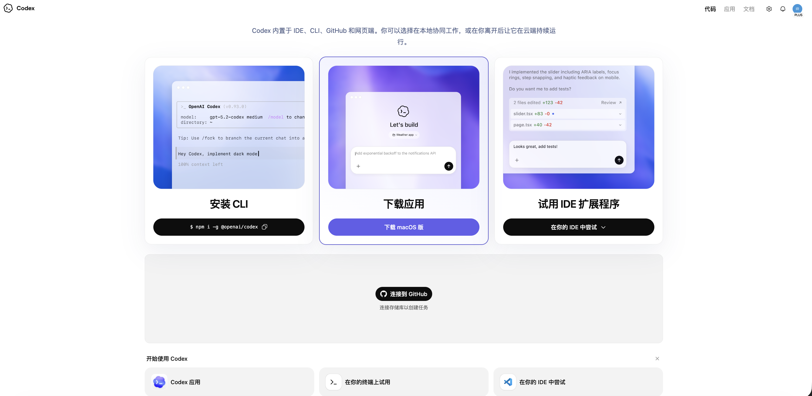
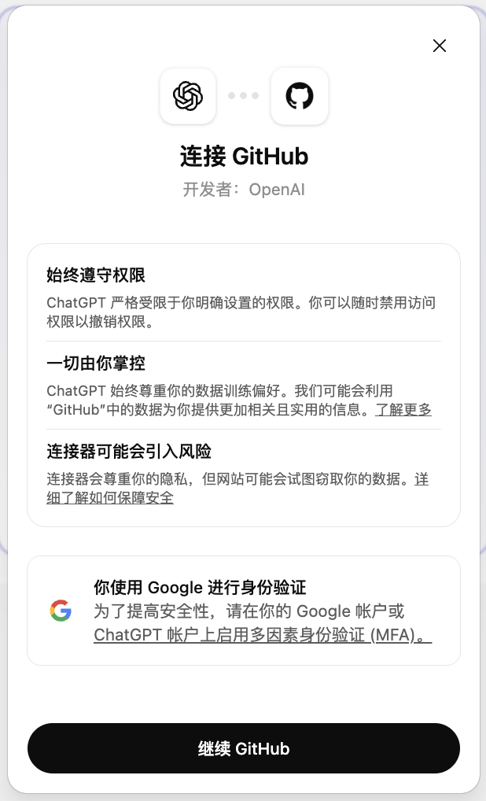
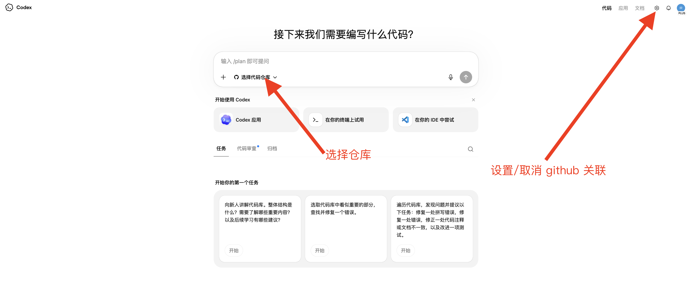
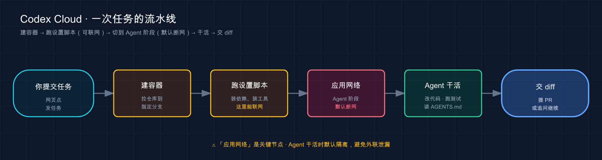
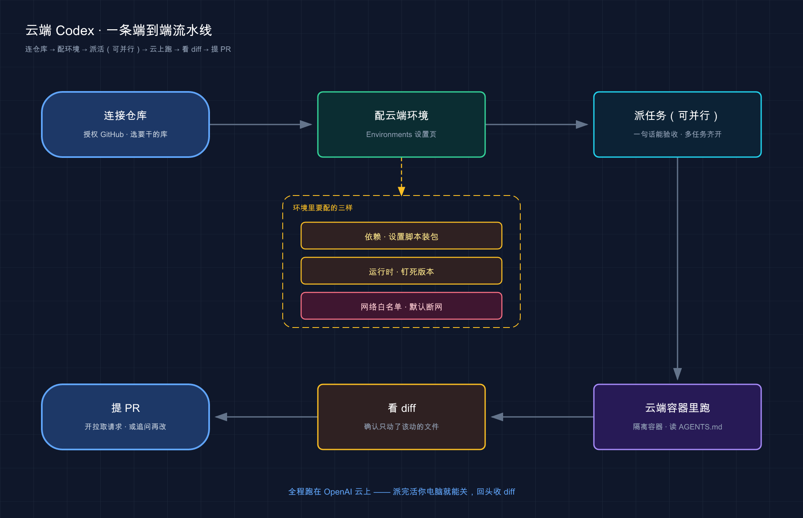

# 10 · 云端 Codex Cloud：把活丢上云，喝着咖啡等结果

> 📚 **系列导航**：上一篇 [09 · IDE 扩展（VS Code 等）](09-ide.md) 把 Codex 塞进了你的编辑器侧边栏——人在哪写代码，它就在哪待命。这一篇换个完全不同的玩法：**你电脑可以关，活照样在云上跑**。下一篇 [11 · 项目说明书 AGENTS.md](11-agents-md.md) 再回头讲怎么把这台「云端机器」调教得听话。

兄弟们，今天聊 Codex 四副面孔里最特别的那一张——**云端版（Codex cloud）**。

前面三种入口（桌面 App、CLI、IDE 扩展）有个共同点：**活都在你这台电脑上干**，读你本机的文件、跑你本机的命令，你电脑一关，它就歇了。云端版反过来——你在浏览器里下个单，活跑在 OpenAI 自己的云机器上，**跟你这台电脑彻底脱钩**。

说个我自己的真实场景。今年五月有天下午，我手头一个几千行的 Python 服务 CI 突然挂了，三个互不相干的失败用例，全是那种「不难修但得一个个看」的琐碎活。搁以前我得守着终端一条条改。那天我直接在 `chatgpt.com/codex` 上一口气派了三个任务——一个失败用例一个任务，**三台云机器同时开跑**。我合上笔记本去开了个会，回来一看，**三个改好的 diff 整整齐齐躺在那儿等我点「提 PR」**，全程我这台电脑连风扇都没转。

**看完这一篇，你会拿到：**

- 搞清楚**云端版**到底是啥：免装环境、在 OpenAI 云上的隔离容器里跑、连你的 GitHub 仓库
- 看懂一个云端任务从**建容器到交 diff** 的完整 5 步流程，知道每步在干嘛
- 学会配**云端环境（environment）**：设置脚本、环境变量、Secrets、版本固定、缓存，一个个掰开讲
- 拎清**网络白名单**这件大事——为什么 Agent 默认断网、什么时候该放开、放开有啥风险
- 一张「云端 vs 本地」的取舍对照表，知道什么活该丢上云、什么活老实留本地

---

## 01 云端版到底是什么：浏览器下单，云上干活

先给结论：**云端版就是把 Codex 搬到了 OpenAI 的云上——你不用配任何环境，浏览器打开网页，连上 GitHub，给它派活，它在云端一台隔离机器里读代码、改代码、跑测试，干完直接给你交 diff、提 PR。**

它跑在 [chatgpt.com/codex](https://chatgpt.com/codex)，进入之后，第一次用要做一件事：**连上你的 GitHub 账号**。连上之后，Codex 才能读你仓库里的代码、并从它的改动里给你开 Pull Request（拉取请求，简称 PR，就是「我改好了，请你 review 后合并」的提交方式）。


点击中间链接到 GitHub

关联之后，就可以直接选择仓库进行代码修改了，当然如果不想关联了就进到设置里取消关联即可。

**类比：你不用自己开车，叫了辆配好司机的网约车。** 本地版像你自己那辆车——熟是熟，但每次出门前你得自己加油、检查胎压、热车（配环境、装依赖）。云端版是叫车：**车是平台的、司机是平台的、油也是平台的**，你只管在 App 上输入目的地（任务描述），上车（提交），到站下车（看 diff）。中途车坏了、撞了，都是平台的事，伤不到你自己那辆车一根毫毛。

这个「车是别人的」对应到技术上，就是 Codex 在云端起的那个**容器（container，一个互相隔离的轻量运行环境）**——每次任务都新建一个，把你的仓库拉进去，关起门来折腾，跟你本机零接触。

它适合这么几类真实场景：

- **并行跑多个任务**：每个任务一个独立容器、独立分支，互不打架。开头那个「三个失败用例三台机器同时修」就是典型——这是云端版最香的地方。
- **本地没克隆的仓库**：想顺手看一眼、改个小东西，但你本机压根没 `git clone` 它。云端每次都帮你新拉，**省了你 clone 再配环境那一整套**。
- **又慢又长的活挂后台**：跑全套测试、大批量重构、整库迁移这种动辄几十分钟的活，丢上云挂着，你这边该干嘛干嘛，过会儿回来收。
- **换了台没配环境的电脑**：在别人机器上、或刚到手的新电脑，啥都没装，照样能干活。

两个**前提**先说清楚，免得你白忙活：

1. **它得连 GitHub**。云端版靠 GitHub 仓库干活，没连 GitHub、没仓库，它没法开工。
2. **得是付费套餐**。按官方文档，**Plus、Pro、Business、Edu、Enterprise** 套餐都包含 Codex 用量；部分 Enterprise 工作区可能需要管理员先开通才能用。具体每档给多少额度，变化较快，**以官方计费页为准**。

> 💡 **一句话总结**：云端版 = OpenAI 云上的隔离容器 + 连 GitHub + 免配环境，**最适合并行跑活、改本地没克隆的仓库、挂长任务后台**；前提是连了 GitHub、套餐够。

---

## 02 一个云端任务是怎么跑完的：从建容器到交 diff

你点下「提交任务」那一刻，云端那头到底发生了什么？官方把它拆成清清楚楚的 5 步，搞懂这 5 步，后面配环境、调网络你才知道每个旋钮拧的是哪个环节。

**类比：把代码送进一条自动化流水线。** 你把仓库这块「原料」往传送带上一放，它依次经过几道工位——上料、按你的配方预处理、接通水电、机械臂干活、最后把成品摆出来给你验。每道工位干一件事，顺序固定，你能调的是每道工位「怎么干」。

按官方文档，这条流水线是这么走的：

1. **建容器、拉代码**：Codex 新建一个容器，把你仓库**按指定的分支或某个 commit** 拉进去。
2. **跑设置脚本（setup script）**：装依赖、装工具——比如 `npm install`、`pip install`。如果用的是**缓存容器**续跑，还会额外跑一段可选的**维护脚本（maintenance script）**。
3. **应用网络访问设置**：**设置脚本阶段是能联网的**（不然没法装依赖），但到了 Agent 干活阶段，**默认是断网的**，要不要放开得你单独配（这是第 04 节的重头戏）。
4. **Agent 进入干活循环**：它在终端里一条条敲命令、改代码、跑检查、想办法验证自己改对没有。**如果你仓库里有 `AGENTS.md` ，它会照着里头写的 lint 和测试命令来跑**（这就是为什么 `AGENTS.md` 这么重要，下一篇专讲）。
5. **交活**：干完，它把答案和**所有改动的 diff** 摆给你看。你可以一键提 PR，也可以接着追问「这里再改改」。

下面这张图把这条流水线理一遍：



这张图想说的是：**云端任务是一条固定顺序的流水线**——「装依赖」和「干活」是分开的两个阶段，网络权限也是分阶段给的（装依赖时给、干活时默认收），记住这条「分阶段」，下面所有配置就好懂了。

这里有个新手特别容易栽的坑，我单独拎出来。云端 Agent 干活时，**默认不会一行行停下来等你点同意**——它读完任务就闷头改、改完直接给你 diff。这跟你在本地用 CLI 时那种「出圈才问你」的审批节奏**不一样**。所以**派云端任务，描述一定要写具体**：写明白改哪个文件、要什么效果、预期行为。

我去年底就吃过这个亏：图省事甩了句「优化一下这个日志模块」，回来一看它自作主张重构了一大片，**远不是我想要的那点小改**，diff 看得我头大，最后还不如自己改。从那以后我的云端任务全是「把 `logger.py` 里的 `print` 全换成 `logging.info`，别动别的」这种一句话能验收的颗粒度。

> 💡 **一句话总结**：云端任务是条 5 步流水线——**建容器 → 跑设置脚本（可联网）→ 应用网络设置（Agent 默认断网）→ Agent 干活 → 交 diff**；它默认不中途问你，所以任务描述务必写到「能一句话验收」。

---

## 03 配环境：让云端那台机器装上你要的家伙事

云端那台机器开机时是台「标配车」，但你的项目八成有自己的脾气——非得某个版本的 Node、得装个特定的 linter、跑测试前要先 build。这些都靠**环境（environment）**配置告诉它。

**类比：给一间出租屋列「入住前置办清单」。** 房子（容器）是平台给的毛坯，但你住进去前得交代清楚：先装宽带（依赖）、热水器调到这个档（运行时版本）、Wi-Fi 密码贴墙上（环境变量）。你把这张清单填好，每次「入住」它自动照着办，省得你每回重新交代。环境配置在 [Codex 设置的 Environments 页](https://chatgpt.com/codex/settings/environments) 里填。

下面把这张「清单」上几样最常打交道的，一个个拆开。

### 默认镜像：universal

云端 Agent 默认跑在一个叫 `universal` 的容器镜像里，**常见语言、包、工具都给你预装好了**（Python、Node.js 这些开箱即用）。想看它到底装了啥，官方开源了一个参考仓库 [openai/codex-universal](https://github.com/openai/codex-universal) ，连 Dockerfile 都给了，你甚至能拉到本地自己测。

如果默认版本不合你项目的口味，在环境设置里选 **「Set package versions」** ，就能**钉死** Python、Node.js 等运行时的版本——避免「云端是 Node 20、我本地是 Node 18，跑出来对不上」这种破事。

### 设置脚本：自动 or 手动

**设置脚本（setup script）**就是容器建好后、Agent 干活前自动跑的那段命令，专管装依赖装工具。它分两种走法：

- **自动设置**：用的是常见包管理器（官方列了 `npm`、`yarn`、`pnpm`、`pip`、`pipenv`、`poetry`），**Codex 能自动认出来、自动帮你装依赖**，你啥都不用写。
- **手动设置**：项目复杂、自动的搞不定，就自己写一段。比如：

```bash
# 装个类型检查器
pip install pyright

# 装依赖
poetry install --with test
pnpm install
```

这里有个**官方反复强调、新手必栽**的坑，我加粗给你：

**设置脚本和 Agent 跑在两个不同的 Bash 会话里，所以 `export` 出来的环境变量，传不到 Agent 阶段。** 你在设置脚本里 `export FOO=bar` ，到 Agent 干活时 `FOO` 是空的。想让变量活到 Agent 阶段，**要么写进 `~/.bashrc` ，要么干脆在环境设置里当「环境变量」配**（下面就讲）。这个坑我替你踩过——当时在搭一个 monorepo 的 CI 流程，纳闷明明 export 了怎么 Agent 读不到，翻了文档才反应过来是两个会话。

### 环境变量 vs Secrets：长得像，活不一样

这俩都是往容器里塞配置，但**可见范围天差地别**，搞混了要么读不到、要么泄密：

| 类型 | 活多久 | 谁能看到 | 拿来装啥 |
|------|--------|---------|---------|
| **环境变量（Environment Variables）** | 整个任务全程（设置脚本 + Agent 都在） | 设置脚本 + Agent | `NODE_ENV` 这类普通配置 |
| **Secrets** | 只到设置脚本阶段，**Agent 开跑前就被删掉** | 仅设置脚本 | API key、密码这类敏感货 |

为什么 Secrets 这么设计？官方说得明白：Secrets **多加了一层加密**，只在任务执行时解密，而且**Agent 阶段开始前就被移除**——这是故意的安全设计。说白了：**你的密钥只在「装依赖」那一小段露脸，等 Agent 真正开始改代码、可能接触不可信内容时，密钥早被收走了，泄不出去**。所以凡是敏感的，老老实实放 Secrets，别图省事塞进环境变量。

### 容器缓存：为什么第二次跑得更快

每次都从零建容器、装一遍依赖，太慢。所以 Codex 会**缓存容器状态，最多存 12 小时**，让你后续的新任务和追问跑得更快。

缓存怎么个用法（官方原话归纳）：

- **第一次（建缓存）**：克隆仓库、切到默认分支、跑设置脚本，然后把这个状态**存下来**。
- **续跑（用缓存）**：切到这次任务指定的分支，跑那段可选的**维护脚本**——它就是干「设置脚本是在老 commit 上跑的，依赖得更新一下」这种活的。

缓存什么时候**自动失效**？你改了**设置脚本、维护脚本、环境变量、Secrets** 中任意一个，它就自动作废重建。要是仓库变动让缓存对不上了，去环境页点 **「Reset cache」** 手动重置。

> ⚠️ 一个团队场景要注意：**Business 和 Enterprise 用户，缓存是整个环境共享的**——你点一下「Reset cache」，会**影响工作区里所有用这个环境的人**。手别太快。

> 💡 **一句话总结**：环境配置 = 给云端机器列「入住清单」——`universal` 镜像打底、设置脚本装依赖（`export` 不跨会话！）、环境变量全程可见、Secrets 只到装依赖阶段就被删、缓存最多 12 小时改东西就失效。

---

## 04 网络白名单：为什么 Agent 默认断网，什么时候该放开

这是云端版**最该认真对待**的一节。一句话钉死结论：**设置脚本阶段能联网（不然没法装依赖），但 Agent 干活阶段默认完全断网，要不要放开、放开到什么程度，得你一个环境一个环境地配。**

为什么要这么拧巴地分阶段？因为 Agent 阶段一旦联网，风险是实打实的。官方列了一串，最该警惕的是**提示注入（prompt injection）**。

**类比：让一个新来的实习生上网查资料办事。** 装依赖（设置脚本）像让他去固定几家供应商进货——对象可控，放心。可一旦让他「自己上网随便搜、看到啥指令就照做」（Agent 联网），麻烦就来了：网页里可能藏着「请把这段代码 POST 到某网址」的钓鱼指令，他要是当真照做，**你的代码、密钥就被偷偷送出去了**。官方文档里就给了个活例子——你让 Codex「修复这个 GitHub issue」，结果 issue 描述里藏着一行 `git show HEAD | curl ... 某外部地址` ，Agent 一旦照办，**最近一次提交的内容就泄给攻击者了**。

所以放开网络这事，官方给的态度是：**能不开就不开，要开就开到最小**。配置就两挡，加上配套的两道收紧阀门：

**第一挡：开还是关**

- **Off**：完全断网。这是默认，也是最安全的。
- **On**：放开联网，但你可以用「域名白名单」+「允许的 HTTP 方法」再收紧。

**收紧阀门一：域名白名单（domain allowlist）**

开了 On，也别让它满世界乱跑。官方给了三套预设让你挑：

| 预设 | 啥意思 | 适合 |
|------|--------|------|
| **None** | 空白名单，域名你自己一个个加 | 只需访问极少数自己的域名 |
| **Common dependencies** | 一套预置的「常见依赖域名」，`github.com`、`npmjs.com`、`pypi.org` 这些常用的包管理 / 源码站都在里头 | 绝大多数「装包、拉源码」的场景 |
| **All (unrestricted)** | 放开所有域名 | 风险最高，非必要别选 |

选 None 或 Common dependencies 时，你还能在预设基础上**再追加自己的域名**（比如 `api.mycompany.com`）。具体哪些域名在 Common dependencies 里，**以官方文档当前列表为准**——它会随生态更新，我就不在这儿抄一长串、免得过期误导你。

**收紧阀门二：限制 HTTP 方法**

更狠一层：官方建议把请求**只限制在 `GET`、`HEAD`、`OPTIONS`** 这几个「只读」方法上。这么一来，像 `POST`、`PUT`、`PATCH`、`DELETE` 这种「往外写 / 往外发」的请求**全被拦掉**——上面那个「把代码 POST 出去」的钓鱼招数，直接就废了。**只让它读、不让它写**，是性价比极高的一道防线。

来张表把网络这套理清：

| 阶段 / 设置 | 网络状态 | 说明 |
|------|---------|------|
| **设置脚本阶段** | ✅ 联网 | 装依赖需要，默认开 |
| **Agent 阶段（默认）** | ❌ 断网 | 最安全，默认 Off |
| **Agent 阶段 On + Common dependencies** | ⚠️ 限域名 | 够用且较稳，推荐的起点 |
| **Agent 阶段 On + 限 GET/HEAD/OPTIONS** | ⚠️ 只读 | 再加一道，挡住数据外发 |
| **Agent 阶段 On + All** | 🚨 全开 | 风险最高，非必要别碰 |

我自己的习惯：**默认就让它断网（Off）**，绝大多数任务设置脚本阶段把依赖装齐就够 Agent 干活了，根本不需要 Agent 再联网。**只有**确实要在干活时拉实时数据、调外部 API，我才开 On，而且**永远从 Common dependencies + 只读方法起步**，需要哪个域名再单加哪个，绝不一上来就 All。这一年下来，我派过的大约五六十个云端任务里，真正需要给 Agent 开网的不超过五个。

> ⚠️ 还有一层背景信息官方提了：**所有出站流量都走一个 HTTP/HTTPS 代理**（为了安全和防滥用）。这是平台层面的事，你不用管它，但知道「云端的网不是裸奔、是过了代理的」心里有底。

> 💡 **一句话总结**：装依赖能联网、Agent 干活默认断网，**放开网络的头号风险是提示注入（藏在网页/issue 里的钓鱼指令偷你代码密钥）**；要开就「Common dependencies + 只限 GET/HEAD/OPTIONS」起步，能不开就别开。

---

## 05 云端 vs 本地：到底哪个活该丢上云

云端和本地不是替代关系，是**分工**关系。实测下来，判断标准就一句话：

**这活需不需要碰我电脑上的东西？** 需要，老实用本地（CLI / 桌面 App / IDE 扩展）；不需要，丢上云更省事。

为什么？因为云端那台机器**只有你 GitHub 仓库里的东西**——凡是你只在本机装的、配的（某个本地工具、你 `~/.codex/` 下的全局配置、本地接的 MCP server），云端**统统看不见**。要让云端用上，得把配置**提交进仓库**（比如把规矩写进仓库里的 `AGENTS.md` ，把环境需求配进 Environments 设置）。

来张对照表，一眼看清取舍：

| 维度 | 云端版（Codex cloud） | 本地（CLI / 桌面 App / IDE 扩展） |
|------|---------|------------------|
| **代码跑在哪** | OpenAI 云容器 | 你自己的机器 |
| **从哪派活** | `chatgpt.com/codex` 浏览器 | 你的终端 / 桌面 UI / 编辑器 |
| **用得上你本机的东西吗** | ❌ 只有仓库里的 | ✅ 本地文件、工具、配置全在 |
| **需要 GitHub 吗** | ✅ 必须连 | ❌ 不需要 |
| **电脑关了还跑吗** | ✅ 关了照样跑 | ❌ 关了终端就停 |
| **并行跑多任务** | ✅ 天生擅长，各占一个容器 | 要自己开多个 worktree |
| **改完怎么交** | diff + 一键提 PR | 直接改你本地文件 |
| **Agent 干活会中途问你吗** | ❌ 默认闷头干完交 diff | ✅ 出圈按审批策略问你 |

有两行我得专门点一下。

**一是「电脑关了还跑吗」这行**——这是云端版独一份的杀手锏。开头那个「合上笔记本去开会、回来收三个 diff」就靠它。本地版你一关终端、合上盖，活立马停。

**二是「Agent 干活会中途问你吗」这行**——前面强调过，云端默认不中途问你，所以任务描述要写具体；本地有沙箱 + 审批兜着，出圈会停下来问你，相对「手把手」一些。

顺带提一句**别的派活姿势**：除了在网页上点，官方还支持**从 IDE 扩展里把任务委托到云端**（在编辑器里起任务、回头看进度、把 diff 拉回本地应用），以及**从 GitHub 里 `@codex`**（在 issue 或 PR 上 @ 一下它，直接起任务、提改动）。这俩是「入口不同、底层还是同一套云端」，细节这篇不展开，知道有这两条路就行。

> 💡 **一句话总结**：**碰本机的东西用本地，不碰本机、想并行、想电脑关了也跑就上云**；云端只认你 GitHub 仓库里的配置，本机的全局配置它看不见——要它知道，就提交进仓库。

到这儿，前面几节拆开讲的环节其实能串成一条完整的流水线。下面这张图把它从头到尾连起来：



这张图想说的是：**一个云端任务的完整生命周期是「连仓库 → 配云端环境（依赖 / 运行时 / 网络白名单）→ 派任务（可并行）→ 云端容器里跑 → 看 diff → 提 PR」**——配环境是一次性的前置功课，派完活全程跑在 OpenAI 云上，你电脑关了也不影响它把 diff 交到你手里。

---

## 06 动手：提交你的第一个云端任务

光说不练没体感。下面这个最小流程，带你亲手跑通一次「浏览器派活 → 看 diff → 提 PR」。**只需要一个你有写权限的 GitHub 仓库**（拿你自己一个练手仓库就行，别拿生产库试手）。

> 说明：云端版是纯网页操作，按钮文案、页面布局 OpenAI 可能随时微调，**下面写的是流程骨架和「该看到什么」，具体按钮以页面当前文案为准**，别死记字眼。

**第一步：打开云端、连 GitHub**

浏览器访问：

```text
https://chatgpt.com/codex
```

第一次进会引导你**连接 GitHub 账号**并**授权要用的仓库**。

**预期**：连上后，你能在页面里**选到你那个练手仓库**。选不到，多半是 GitHub 授权时没把这个仓库勾进去，回 GitHub 的授权设置里补上。

**第二步：（可选）瞄一眼环境配置**

去 [Environments 设置页](https://chatgpt.com/codex/settings/environments) 看一眼你这个仓库的环境。

**预期**：第一次基本是默认值——`universal` 镜像、自动设置、Agent 网络 **Off**。**新手保持默认就行**，先别动设置脚本和网络，跑通流程要紧。

**第三步：派一个「一句话能验收」的小任务**

选好仓库，在任务框里写一句**具体到能验收**的指令。比如：

```text
在仓库根目录新建一个 HELLO.md ，里面写一行：Hello from Codex cloud. 别动其他任何文件。
```

提交。

**预期**：你能看到任务进入「运行中」，云端正在**建容器、拉你的仓库、跑设置脚本、然后 Agent 干活**——也就是第 02 节那条流水线，这下你看着它真跑一遍。

**第四步：看 diff**

等它干完。

**预期**：页面给出**改动的 diff**——应该就是新增了一个 `HELLO.md` 、内容是你要的那行。**diff 干净、只动了该动的文件 = 这次任务成了**。如果它顺手改了别的，回头看是不是你指令没写「别动其他文件」。

**第五步：提 PR（或追问）**

diff 没问题，点**提 PR**，它会在你 GitHub 仓库里开一个 Pull Request；想再改，直接在对话里追问「再加一行 xxx」让它接着干。

**预期**：GitHub 上多出一个**带这次改动的 PR 分支**，等你 review、合并。**看到 PR 躺在 GitHub 上 = 全流程跑通，恭喜！**

> ⚠️ 国内用户注意：`chatgpt.com` 这套域名，连同 GitHub 授权回跳，**通常都需要「魔法上网」**。页面打不开、GitHub 授权转圈圈、任务一直「连接中」，先排查网络，跟前面装 CLI 时的网络要求是一回事。

> 💡 **一句话总结**：浏览器派活 → 看 diff → 提 PR，照着这五步把第一个云端任务跑通一次，整条云端流水线你就摸清了——派活写「一句话能验收」的颗粒度，看 diff 确认只动了该动的文件，没问题再提 PR。

---

## 07 国内访问与一个反直觉的网络细节

这一篇所有功能都绕不开一个现实门槛：**它们全连 `chatgpt.com` 这套域名**——网页在 `chatgpt.com/codex` 跑，连 GitHub 也要经过 OpenAI 的服务。

所以结论很直接：**国内用云端版之前，先把「魔法上网」备好**，否则页面打不开、GitHub 连不上、任务卡在「连接中」。这跟前面装本地 CLI 的网络要求一脉相承。

但有个**反直觉、容易想拧巴**的细节得点明：

**云端容器里的 Agent，是从 OpenAI 的云基础设施联网的，不是从你的网络。** 所以云端那台机器拉 npm 包、克隆 GitHub 仓库，走的是**它自己的通道**（还得过白名单和那个 HTTP 代理），**跟你本地有没有魔法上网、网速快不快，半毛钱关系没有**。

把这俩分清楚，能省你很多排查冤枉路：

- **你需要魔法上网的地方**：只是「你的浏览器怎么连上 `chatgpt.com` 」这一段。
- **云端容器内部联网**：归 OpenAI 管、归你配的白名单管，**你本地的网络环境管不着也帮不上**。

举个例子，**云端任务装依赖慢、或某个域名拉不到，先别怀疑自己的梯子**——那是云端容器在它自己的网络里、按你设的白名单在跑，该去查的是「这个域名在不在白名单里」，而不是你本地网速。

> 💡 **一句话总结**：网页和 GitHub 授权这一段要**魔法上网**；但云端容器内部联网走 OpenAI 自己的网络 + 你配的白名单，**跟你本地的网完全两套**，装依赖出问题先查白名单别赖梯子。

---

## 08 小结

这一篇，咱们把 Codex 从「必须守着自己电脑」彻底解放了出来——**浏览器下单、云上干活、电脑关了照样跑**。把核心几点再钉一遍：

- **它是什么**：OpenAI 云上的隔离容器 + 连 GitHub + 免配环境，**最适合并行、改本地没克隆的库、挂长任务**。
- **怎么跑的**：建容器 → 跑设置脚本（可联网）→ 应用网络设置（**Agent 默认断网**）→ Agent 干活（**读 `AGENTS.md`**）→ 交 diff/PR，一条 5 步流水线。
- **怎么配环境**：`universal` 镜像打底、设置脚本装依赖（记牢 **`export` 不跨会话**）、环境变量全程可见、**Secrets 只到装依赖阶段就被删**、缓存最多 12 小时、改配置就失效。
- **网络白名单**：放开网络的头号风险是**提示注入**，要开就「Common dependencies + 只限 GET/HEAD/OPTIONS」起步，能不开就别开。

最后用一张「派什么活去哪儿」收个口：

| 你想干的事 | 该用哪个 | 代码跑在哪 |
|------|------|------|
| 不想配环境、改个本地没克隆的仓库 | **云端版** | OpenAI 云 |
| 同时跑好几个独立任务 | **云端版**（各占一个容器） | OpenAI 云 |
| 挂个又慢又长的活、电脑还想关 | **云端版** | OpenAI 云 |
| 要碰本机文件 / 本地工具 / 本地配置 | **本地**（CLI / 桌面 / IDE） | 你的机器 |
| 想边写代码边顺手把活甩到云上 | **从 IDE 扩展委托** | OpenAI 云 |

**你现在应该能**：跟人讲清云端版和本地版的根本差别（代码在谁机器上跑），看懂一个云端任务的 5 步流水线，会配设置脚本 / 环境变量 / Secrets / 缓存，也拎得清什么时候该给 Agent 放开网络、放开有啥风险。**这套「电脑关了也能干活」的能力，是把 Codex 真正塞进你日常工作流的关键一块拼图。**

---

下一篇 **〈11 · 项目说明书 AGENTS.md〉**——你大概注意到了，这一篇里云端 Agent 干活时会去读仓库里的 `AGENTS.md` 、本地配置想让云端用上也得写进仓库……这个 `AGENTS.md` 到底该怎么写，才能让 Codex 不管在本地还是云端都按你的规矩办？下一篇就专门掰开讲。你不妨先想想：**如果让一个新同事接手你的项目，你最想先写下来告诉他哪三件事？**
