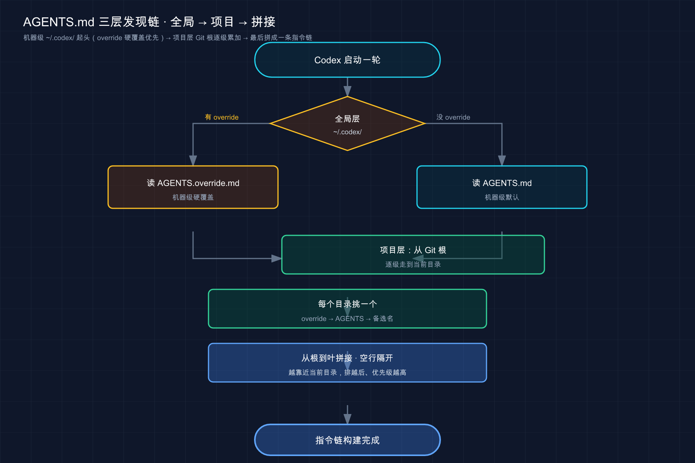
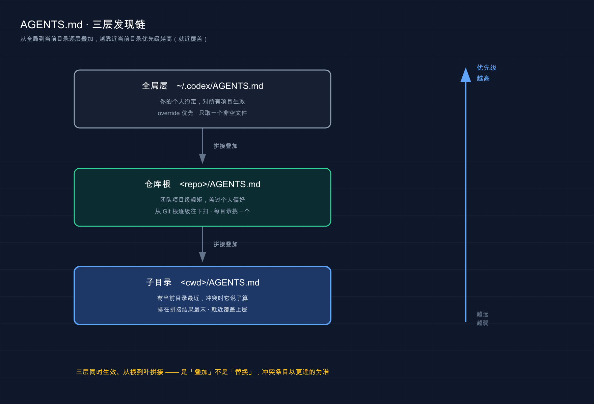

# 11 · 项目说明书 AGENTS.md：把规矩焊进 Codex 的开工流程

> 📚 **系列导航**：上一篇 [10 · 云端 Codex Cloud](10-cloud.md) 把「让 Codex 在远端跑、回头收 PR」这条线讲透了。这一篇拉回本地，聊一份**每个项目都该有、但九成新手写废了**的文件——`AGENTS.md`，Codex 每次开工前都要先读一遍的项目说明书。

说个我刚上手 Codex 时干的蠢事。

那是去年我把一个 Node 项目交给 Codex，开宗明义在根目录写了份 `AGENTS.md`，第一行赫然写着「**本项目用 pnpm，禁用 npm**」。结果它转头给我来了一句 `npm install`。我当场以为它没读到，气得把那条规矩复制了三遍、加粗、还打了感叹号。还是不听。

折腾半天才发现——**它读到了，只是那条规矩被我埋在了第 140 行**。前面我塞了公司简介、产品路线图、技术选型的来龙去脉，洋洋洒洒一百多行。等 Codex 翻到「禁用 npm」那句，注意力早被前面那堆废话稀释没了。**问题从来不是它不听话，是我把唯一有用的那条焊进了一坨没用的里**。

`AGENTS.md` 之于 Codex，就是 `CLAUDE.md` 之于 Claude Code，**同一个概念换了个文件名**。但 Codex 这边的发现机制、覆写规则、字节上限自成一套，有几处容易踩的坑。这篇就把它们连同「该写什么、不该写什么」一次讲清。

**看完这一篇，你会拿到：**

- Codex 发现 `AGENTS.md` 的完整链条（全局层 → 项目层 → 合并顺序），以及谁冲突时说了算
- `AGENTS.override.md` 这个 Claude Code 没有的「临时盖章」机制，什么时候用
- 一张「该写 vs 不该写」清单，避开我当年那个「140 行没人听」的坑
- 改文件名（`project_doc_fallback_filenames`）、调字节上限（`project_doc_max_bytes`）两个旋钮的官方用法
- 一套照着敲就能验证「Codex 到底读没读到」的动手流程

**注意：** 本篇只聚焦 `AGENTS.md` 这一个文件怎么写好、怎么被加载。和它容易混的「记忆（Memories）」机制（那是本地自动回忆层、默认关着）在 [02 核心概念] 里已经点过，**记住一句话：真正必须每次生效的团队规矩，写进 `AGENTS.md`，别指望记忆**。

---

## 01 先搞懂：AGENTS.md 是 Codex 开工前的「交接清单」

先给结论：**`AGENTS.md` 是你写给 Codex 的一份持久指令，它每次启动、动手干活之前都先读一遍，当成这个项目的背景装进脑子。**

为什么需要它？因为 Codex 每开一轮（每轮（per run）——官方术语，在 TUI 里通常是每启动一个会话算一轮）都从一张白纸开始。上回你苦口婆心交代的「用 pnpm、别碰 `legacy/`、测试这么跑」，这回它一概不记得。没有 `AGENTS.md`，你就得每次重新解释一遍。

**类比：交接班的工作清单。** 工厂三班倒，上一班下班前会在墙上那块板写清楚——这台机器有点毛病别硬开、这批料要先质检、紧急联系人是谁。下一班接手，照着板上干就行，不用把上一班的人薅回来口述。`AGENTS.md` 就是 Codex 的那块交接板——**而且是它每次接班前都会先扫一眼的那块**。

（注意我这里没用「入职手册」——那个比喻 [02] 已经用过了。交接清单更贴切的地方在于：它强调「每一轮开工都重读」，不是「入职那天看一次」。）

什么时候该往里加内容？几个特别实在的信号：

- **Codex 第二次犯同一个错** —— 这条得固化进去，别再口头纠正第三遍
- 你这轮又敲了一遍上轮敲过的那句更正
- 代码审查时发现，它本该早就知道这个代码库的某个约定
- 新队友（或者三个月后的你自己）需要同样的背景才能快速上手

我自己最爱的用法，[02] 里提过、这里再强调一次——**把它当反馈回路**：Codex 对你代码库做了错误假设，别光在对话里纠正（那是一次性的，下轮它又忘），直接让它把这条修正写进 `AGENTS.md`。我给一个 Python 项目调了两周，那份 `AGENTS.md` 从空白长到二十来行，全是它踩过、被我逮住、然后自己记下来的坑，现在新会话基本不犯重复错误了。

> 💡 一句话总结：`AGENTS.md` 是 Codex 每轮开工必读的交接清单，**犯一次错就记一条，越用越顺手**；它跟 Claude Code 的 `CLAUDE.md` 是同一个概念，换了个名字。

---

## 02 发现链条：Codex 是怎么找到这些文件的

`AGENTS.md` 不止一份，它能放在好几个地方，**作用范围从大到小**。Codex 启动时会把它们串成一条「指令链」。这一节就把这条链拆开——这也是跟 Claude Code 差异最大的一块，看仔细。

按官方文档，Codex 构建指令链分两步走（一轮一构建，TUI 里通常是每启动一个会话构建一次）：

**第一步，全局层（Global scope）。** 在你的 Codex 主目录（默认 `~/.codex` ，除非你设了 `CODEX_HOME` 环境变量）里，Codex **先看有没有 `AGENTS.override.md` ，有就用它；没有才读 `AGENTS.md`** 。这一层**只取第一个非空文件**，不会两个都读。

**第二步，项目层（Project scope）。** 从项目根目录（通常是 Git 根）开始，**一路往下走到你当前所在的目录**。沿途每一个目录里，Codex 按这个顺序挑：先看 `AGENTS.override.md` ，再看 `AGENTS.md` ，最后看 `project_doc_fallback_filenames` 里你自定义的备选文件名。**每个目录最多只收一个文件**。

**第三步，合并（Merge order）。** Codex 把找到的这些文件**从根到叶依次拼接**，中间用空行隔开。**越靠近你当前目录的文件，因为排在拼接结果的越后面，优先级越高、能盖过前面的**。

光说有点绕，上张图：



这张图把整条链走了一遍：先在全局层二选一，再到项目层逐级各挑一个，最后从根到叶拼起来——**离你越近的，说话越晚、越管用**。

这里有两个要点，都来自官方，记牢：

**第一，是「拼接」不是「覆盖」。** 全局那份和项目那份**同时生效**，不存在「写了项目级，全局级就失效」。它们全都进上下文，后面的不会把前面的整个顶掉，只是**冲突的条目以靠后（更近）的为准**。

**第二，更近的赢。** 比如全局 `AGENTS.md` 说「字符串用单引号」、项目根 `AGENTS.md` 说「用双引号」——项目根离当前目录更近、排得更靠后，所以**双引号胜出**。说白了，**项目规矩能盖过你的个人偏好，这正是团队协作想要的**。

**类比：公司规章的层级。** 集团总章程管所有子公司（全局层），某家子公司有自己的补充规定（项目根），某个部门还能再加细则（子目录）。三套同时有效、不互相删除；但真冲突时，**离你最近的那一级说了算**——部门细则 > 子公司规定 > 集团总章。`AGENTS.md` 这条链就是这么个逻辑。



这张图把三层从上到下叠了出来——全局层（`~/.codex/`）、仓库根、子目录依次拼接，三层同时生效；右侧那根「优先级」轴在提醒你：**越靠近当前目录的那一层，排在拼接结果越靠后、冲突时越管用**，这就是「就近覆盖」。

> 💡 一句话总结：Codex 发现链 = 全局层（`~/.codex/`，override 优先、只取一个非空文件）→ 项目层（Git 根逐级到当前目录、每目录挑一个）→ **从根到叶拼接，越近优先级越高**；是拼接不是覆盖。

---

## 03 AGENTS.override.md：Claude Code 没有的「临时盖章」

上一节反复出现一个名字——`AGENTS.override.md` 。这玩意儿 Claude Code 那边**没有对应物**，是 Codex 独有的设计，单独拎出来讲。

先说它解决什么问题。设想你 `~/.codex/AGENTS.md` 里写了一套团队共用的全局约定，平时挺好。但今天你接了个临时活，需要**整段换掉**这套全局指导，又不想把原文件删了（删了回头还得重写）。怎么办？

**类比：在文件上盖一张「以此为准」的便签。** 原合同还在抽屉里，你没撕；只是临时贴了张便签条「本月按这个新条款执行」。事儿办完，便签一揭，原合同自动生效。`AGENTS.override.md` 就是这张便签——**它在时，同级的 `AGENTS.md` 被整个跳过；把它删了，原来那份立刻回来**。

官方给的两个典型场景：

- **全局临时覆写**：在 `~/.codex/AGENTS.override.md` 写一套临时全局指导，原 `~/.codex/AGENTS.md` 原封不动。活干完删掉 override，共享的那份就恢复了。
- **子目录特殊规则**：某个子目录的团队需要一套跟外面完全不同的规矩。比如支付服务目录 `services/payments/` ，里头放一个 `AGENTS.override.md` ：

```md
# services/payments/AGENTS.override.md

## 支付服务规则

- 用 `make test-payments` 替代 `npm test`
- 轮换 API Key 前必须先通知安全频道
```

放了这个 override，**这个目录里同级的 `AGENTS.md` 就被跳过**（如果有的话），Codex 在这个目录干活时认 override 这份。

这里要拎清一个新手最容易混的点——**override 跟「覆盖整条链」不是一回事**：

| 范围 | `AGENTS.override.md` 的作用 |
|------|---------------------------|
| **同一个目录内** | 它存在 → 同级的 `AGENTS.md`（和备选文件名）被跳过，**这一层只认 override** |
| **跨目录（整条链）** | 它**不会**清掉别的目录的指令；上层指令照常拼进来，只是冲突时被更近的覆盖 |

说白了：**override 是「这一层用我，别用旁边的 `AGENTS.md`」，不是「全链路只听我一个」**。整条链的拼接、就近优先规则照旧。我第一次用的时候就理解错了，以为在子目录放个 override 能把全局那份屏蔽掉，结果全局约定照样生效——后来翻官方文档才搞明白，**它只在自己那一格里二选一**。

还有个排查神器级的用法：万一 Codex 蹦出来一条你压根没写的奇怪指令，**第一件事就是顺着目录树往上、连同 `~/.codex` ，找有没有谁藏了个 `AGENTS.override.md`**。把它改名或删掉，就回退到常规 `AGENTS.md` 了。官方排查清单里专门列了这条。

> 💡 一句话总结：`AGENTS.override.md` 是 Codex 独有的「临时盖章」——**它在的那一层，同级 `AGENTS.md` 被跳过；它不影响别的目录的指令拼接**；想临时换指导又不删原文件，用它最省事；遇到莫名其妙的指令，先去揪有没有谁藏了个 override。

---

## 04 该写什么 vs 不该写什么

这一节是全篇的命门，也是我开头那个「140 行没人听」的解药。**`AGENTS.md` 写不好，九成栽在「该写的没写清，不该写的塞一堆」。**

先说该写的——一句话：**写「Codex 在每一轮里都该保持的事实」**。翻成清单就是这五类：

| 类别 | 具体写什么 | 例子 |
|------|-----------|------|
| **项目概述** | 一句话说清这是个啥 | 「基于 FastAPI 的订单管理后端」 |
| **技术栈** | 语言、框架、数据库、关键工具 | 「Python 3.11 / PostgreSQL / pytest」 |
| **常用命令** | 测试、构建、检查 / lint 怎么跑 | `npm run lint` 、`make test-payments` |
| **代码约定** | 风格、命名、必须遵守的写法 | 「函数必须有类型注解」「字符串用双引号」 |
| **明确的「不要做」** | 雷区、禁改文件、必须先确认的操作 | 「禁改 `migrations/` 已有文件」「新增生产依赖前先确认」 |

其中**常用命令是被参考最频繁的**——Codex 跑测试、提 PR 前会先来这儿翻命令，省得它瞎猜或者用错。官方那份示例 `AGENTS.md` 里头第一条就是命令：「提 PR 前运行 `npm run lint` 」。**禁止清单则是防它「聪明但闯祸」的护栏**：哪些目录是遗留代码只读不改、哪个操作改之前必须先问你。

再说**不该写的**，这才是新手翻车重灾区，也是我亲身踩过的坑：

- ❌ **长篇大论的背景**：公司介绍、产品愿景、技术选型的历史渊源——Codex 写代码用不上，纯占上下文，还把真正有用的规矩稀释了（参见我开头那 140 行）。
- ❌ **过时信息**：换了包管理器却没更新 `AGENTS.md` ，里头还写着 npm，结果反过来误导它。
- ❌ **看代码就知道的东西**：别去复述目录结构里每个文件干啥、别把 ESLint / Prettier 已经定义好的代码风格再抄一遍。**Codex 自己会读代码，复述等于白占空间。**

官方对「别写太大」给了硬性约束，但它的红线跟 Claude Code 不太一样——**Claude Code 是「按行数」（建议 200 行内），Codex 是「按字节」**：

Codex 跳过空文件，一旦拼接后的总大小达到 `project_doc_max_bytes` 限制（默认 32 KiB），就停止继续加文件。

注意这话有两层意思：一是**默认 32 KiB 封顶**，超了就截断（甚至整个文件被拦在外面）；二是这个上限**算的是合并后的总和**，全局 + 项目 + 子目录加一块儿。所以你一份文件写太肥，可能把后面更重要的那份顶出窗口。**官方建议：撞上限了，要么调高 `project_doc_max_bytes` ，要么把指令拆到多级子目录分散放**（这正好呼应 [04 计费] 里讲的「`AGENTS.md` 瘦身 + 按子目录分层」省 token）。

有个好用的土办法，我现在写每一条之前都先自问一句：**「这条 Codex 看代码能不能自己推出来？能，就删。」** 就靠这一刀，能把一份接手项目的 `AGENTS.md` 从一百多行砍到几十行，留下的全是它推不出来的硬约束——砍完之后，它用错包管理器的次数肉眼可见地降下去。

> 💡 一句话总结：写「每轮都该记住的事实」（概述 / 技术栈 / 命令 / 约定 / 禁区），**删一切 Codex 看代码能自证的东西**；红线是**字节**——合并后默认 32 KiB（`project_doc_max_bytes`），撑爆了就调高上限或按子目录拆。

---

## 05 两个旋钮：改文件名、调字节上限

大多数人用默认的 `AGENTS.md` 就够了。但有两种情况你得动配置——这一节讲两个写在 `~/.codex/config.toml`（Codex 的用户级配置文件）里的旋钮。

### 旋钮一：让 Codex 认你已有的文件名

设想你仓库里早就有一份 `TEAM_GUIDE.md` ，全队一直拿它当规范文档。你不想再造一个 `AGENTS.md` 重复一遍，**想让 Codex 直接把 `TEAM_GUIDE.md` 当指令文件读**。这时候就用 `project_doc_fallback_filenames`（备选文件名）：

```toml
# ~/.codex/config.toml
project_doc_fallback_filenames = ["TEAM_GUIDE.md", ".agents.md"]
```

加了这条之后，Codex 在每个目录里的挑选顺序变成：`AGENTS.override.md` → `AGENTS.md` → `TEAM_GUIDE.md` → `.agents.md` ，**取第一个存在（且非空）的**。

> **不在这个列表里的文件名，Codex 在指令发现这一步一律忽略。** 想让某个自定义文件被当成项目说明书，就必须把它的名字加进 `project_doc_fallback_filenames` ——别指望 Codex「猜」。

### 旋钮二：合并内容被截断了，调高上限

上一节说过默认 32 KiB 封顶。如果你的指令确实超了、又暂时不想拆文件，可以把 `project_doc_max_bytes` 调大：

```toml
# ~/.codex/config.toml
project_doc_max_bytes = 65536
```

这就把上限抬到了 64 KiB，能塞下更多合并指导才触顶。不过我得劝一句——**这是治标**。内容真有用，调上限；但更多时候，撞上 32 KiB 是个信号，提醒你「该精简了」或「该按子目录拆了」，而不是「该把上限往上拱」。我自己的偏好是**优先拆、其次删，实在拆不动才抬上限**。

两个旋钮的适用场景对照一下：

| 你的处境 | 该动哪个旋钮 |
|---------|------------|
| 仓库已有 `TEAM_GUIDE.md` 想直接当说明书用 | `project_doc_fallback_filenames` 加上它的名字 |
| 合并后的指导超了 32 KiB 被截断 | 先想拆子目录 / 精简；非调不可才抬 `project_doc_max_bytes` |
| 想换一套独立配置 profile（如自动化用户） | 设 `CODEX_HOME` 指到别的目录（见下节动手） |

> ⚠️ 改完 `config.toml` 记得**重启 Codex** ——这两个配置在启动时读，不重启不生效。这点官方排查清单里专门强调过（「回退文件名不生效？确认拼写无误，重启 Codex」）。

> 💡 一句话总结：`project_doc_fallback_filenames` 让 Codex 认你自定义的文件名（不在列表里的一律忽略）；`project_doc_max_bytes` 抬高合并上限（默认 32 KiB），但撞上限**优先拆 / 删而非硬抬**；改完都得重启。

---

## 06 动手：给玩具项目配一份合格的 AGENTS.md 并验证加载

光说不练没用。下面用一个最小项目，走一遍「建文件 → 写规矩 → 验证 Codex 真读到了」的完整流程。跟着敲，几分钟搞定。

> 平台差异先说清：下面建项目的命令 `mkdir` / `git init` 在 **Mac / Linux** 直接用；**Windows** 下建议在 Git Bash 或 WSL 里敲，或用资源管理器手动建文件夹。路径里的 `~` 指用户主目录，Windows 对应 `C:\Users\你的用户名\` 。

**第一步：建个玩具项目并初始化 git**

```bash
mkdir agents-md-demo
cd agents-md-demo
git init
```

**预期**：`agents-md-demo` 目录里出现一个 `.git` 目录。git 初始化是为了让 Codex 能把这里识别成「项目根」（它通常以 Git 根为起点往下扫），也为了这份 `AGENTS.md` 能进版本控制、团队共享。

**第二步：手写一份精简的项目级 AGENTS.md**

用你顺手的编辑器，在项目根目录新建 `AGENTS.md` ，贴入下面这份（**注意它一共没几行——这就是好 `AGENTS.md` 该有的样子**）：

```md
# agents-md-demo — 一个演示用的最小项目

只有用来演示 AGENTS.md 怎么写，没有真实业务逻辑。

## 常用命令

- `npm test` —— 运行测试

## 编程约定

- 所有函数必须有类型注解
- 字符串一律用双引号

## 注意事项

- 不要新增任何生产依赖，需要时先问我
```

**预期**：项目根目录下出现 `AGENTS.md` ，内容就是上面这几节。**全文十几行——记住这个篇幅感，真实项目也别失控膨胀。**

**第三步：让 Codex 复述它读到的指令**

官方给了一个特别直接的验证法——**让 Codex 把当前生效的指令总结一遍**。在项目目录里跑：

```bash
codex --ask-for-approval never "Summarize the current instructions."
```

**预期**：Codex 在动手提方案之前，会**回显你刚写的那几条**（命令、类型注解、双引号、别加依赖）。只要它复述出来了，就说明这份 `AGENTS.md` 这一轮确实被装进了它的上下文。

> ℹ️ 这里的 `--ask-for-approval never` 只是为了让它别在演示时停下来问你审批、好让输出干净，**不是说平时干活也建议这么用**——日常该用什么审批模式，看 [02 核心概念] 和后面权限相关的篇章，别在不熟的项目里随手关审批。

**第四步（进阶）：验证子目录覆写真的「就近优先」**

想亲眼看到「越近越管用」，再做一步。在项目里建个子目录，放一份只覆盖一条命令的 override：

```bash
mkdir -p services/payments
```

在 `services/payments/AGENTS.override.md` 里写：

```md
# services/payments/AGENTS.override.md

## 支付服务规则

- 用 `make test-payments` 替代 `npm test`
```

然后**从这个子目录的视角**启动 Codex，让它报告加载了哪些指令来源：

```bash
codex --cd services/payments --ask-for-approval never "List the instruction sources you loaded."
```

**预期**：按官方描述，Codex 会**依次列出**——先全局文件（如果你 `~/.codex` 下有的话）、再仓库根的 `AGENTS.md` 、最后是支付服务这份 override；而且这一层的测试命令会以 override 的 `make test-payments` 为准，**根目录那条 `npm test` 在这个子目录里被盖掉了**。这就是「就近优先」的活样本。

> ⚠️ 万一发现 Codex 没按 `AGENTS.md` 来：① 先用上面的「Summarize the current instructions」确认它到底读到没；② 跑 `codex status` 看它认的工作区根目录是不是你以为的那个；③ 顺着目录树往上找有没有谁藏了 `AGENTS.override.md` 把你的规矩盖了；④ 文件别是空的（Codex 跳过空文件）。这几步是官方排查清单的顺序，照着走基本能定位。

> 💡 一句话总结：照着「建文件 → 写精简规矩 → 用『Summarize the current instructions』让 Codex 复述」走一遍，亲眼确认它真读到了你的 `AGENTS.md`；再加一层子目录 override，就能看清「越近越优先」是怎么把根目录那条命令盖掉的。

---

## 07 小结

这一篇你把 `AGENTS.md` 这个「Codex 的项目说明书」从发现机制到落地写法摸清了：

| 维度 | 关键结论 |
|------|---------|
| 是什么 | 每轮开工必读的交接清单，**就是 `CLAUDE.md` 换了个名** |
| 发现链 | 全局层（override 优先、取一个非空）→ 项目层（Git 根逐级到当前目录、每目录挑一个）→ **从根到叶拼接** |
| 谁说了算 | 拼接不覆盖，**越靠近当前目录的越晚拼、冲突时占优** |
| override | Codex 独有的「临时盖章」：**那一层跳过同级 `AGENTS.md`**，但不清掉别处指令 |
| 写什么 | 概述 / 技术栈 / 命令 / 约定 / 禁区，**删一切代码能自证的** |
| 大小红线 | **按字节**算，合并默认 32 KiB（`project_doc_max_bytes`），撑爆优先拆 / 删 |
| 两个旋钮 | `project_doc_fallback_filenames` 改文件名、`project_doc_max_bytes` 调上限，**改完重启** |

**你现在应该能：** 判断一条信息该不该进 `AGENTS.md` 、该放哪一层；看懂多层文件冲突时谁赢；用 `AGENTS.override.md` 临时换指导、又不删原文件；撞上字节上限知道是拆还是抬；用「Summarize the current instructions」一句话验证 Codex 到底读没读到。**一句话——你能写出一份 Codex 真愿意听、而不是像我当年那样写了 140 行没人理的 `AGENTS.md` 了。**

---

下一篇 **12「斜杠命令与快捷键」**——这篇里你已经在命令行里敲了好几次 `codex ...` ，那进了会话之后呢？`/` 开头的斜杠命令能让你当场切模式、清上下文、看状态，再配上几个顺手的快捷键，操作效率能翻倍。下一篇就把会话里这套「快捷操作面板」一次摊开。留个小思考：这一篇让 Codex「记住规矩」靠的是写文件，那要是想在会话**当场**改它的行为、又不想动 `AGENTS.md` ，你猜该用什么？
