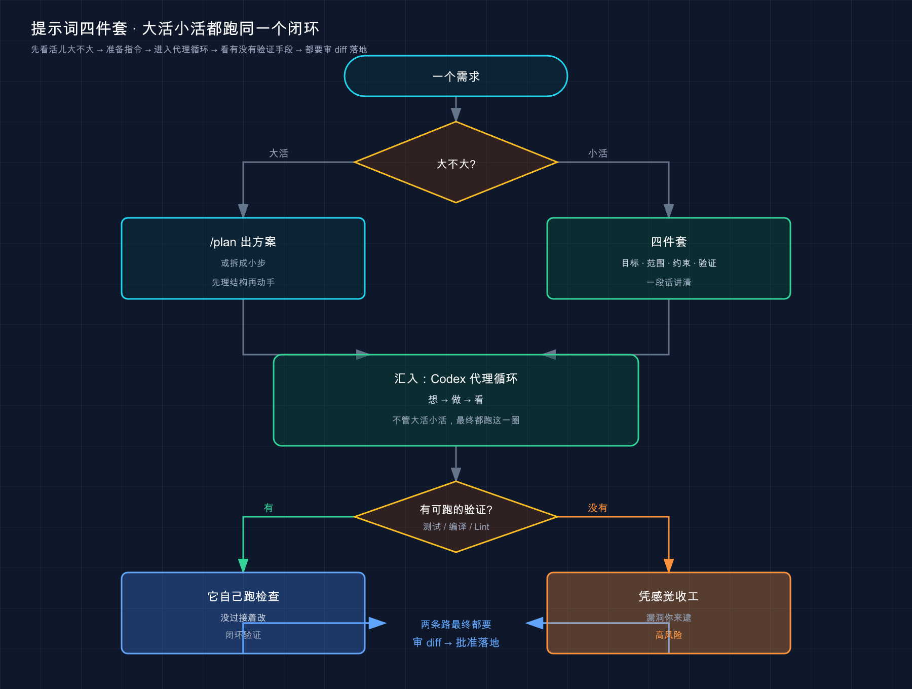

# 13 · 提示词（Prompt）写法：把话说到 Codex 心坎里

> 📚 **系列导航**：上一篇 [12 · 斜杠命令与快捷键](12-slash-commands.md) 教你在会话里把手指放对地方——`/` 切模式、清上下文、看状态，键位都熟了。这一篇换个层面：手知道往哪按了，**嘴还得知道怎么说**。同一个需求，话说得到不到位，Codex 干出来的活儿天差地别。

都说「AI 编程工具强不强，看的是模型」——这话我得抬杠。

说句不太中听的实话：同一个 GPT-5、同一个仓库，**会提需求的人三句话搞定，不会提的人来回返工五轮还一肚子火**。模型早就够强了，多数时候卡你的不是它的脑子，是你递给它的那句话。你把一句信息量约等于零的「修一下这个 bug」甩过去，它只能脑补——哪个文件、什么报错、改成啥样，全靠猜。猜错了，你盯着满屏 diff 嘀咕「这 AI 不行啊」，可**不行的真不是它**。

我去年就栽过这么一跤。一个 Node 服务报 500，我啪地一句「登录接口挂了，修一下」回车，连日志都没贴。Codex 翻了半天，挑了个它以为的 bug，改了三个文件，**没一个是真正的病根**——真正的错在一个我没提的环境变量上，它压根不知道有这茬。那次我才彻底想明白：**Codex 的天花板，很大程度是被我自己的提问方式锁死的**。

所以这一篇不教你背模板，教你想明白一件事——**Codex 到底需要知道什么，才不跑偏**。把这个想透了，提示词自然就会写了。

**看完这一篇，你会拿到：**

- 一张「烂提问 vs 好提问」对照表，照着改，返工率立降
- 一套写需求的「四件套」框架：目标、范围、约束、验证——缺哪件 Codex 就在哪件上脑补
- 大任务怎么拆成 Codex 啃得动、你审得过来的小步
- 用 `/goal`（目标模式）把验收标准钉成「不达标不收工」的官方玩法（需提前开 `features.goals`，05 节有详细步骤）
- 一个可照做的「同一需求两种说法」实验，亲眼看出差距

> ⚠️ 下文凡涉及具体命令、参数、默认行为，都以 Codex [官方文档](https://developers.openai.com/codex/prompting) 为准；模型名、界面文案这类会随版本变的东西，看到时以你本地实际显示为准，本篇不写死。

---

## 01 烂提问到底烂在哪

把开头那次翻车摊开看。「登录接口挂了，修一下」这句话，**站在 Codex 的角度，信息缺得离谱**：

- 哪个登录接口？它得满项目翻。
- 怎么个挂法？报什么错、什么条件下复现？它一概不知。
- 期望的正确行为是啥？它只能按「一般来说登录应该怎样」脑补。

[06 · 跑通第一个任务](06-first-task.md) 里讲过，Codex 干活是个**代理循环（agent loop）**——调模型、读文件、改文件、跑命令，「想 → 做 → 看」转圈。官方原话是它「在一个循环里跑终端命令，改代码、跑检查、尝试验证自己的工作」。但这个循环再聪明，**第一步「想」喂进去的是垃圾，后面整圈都在错误方向上空转**。

**类比：给外卖填地址。** 你下单只写「送到那个小区」，骑手只能挨栋楼瞎转，多半送错还得打你电话。换成「XX 小区 8 栋 2 单元 1503，门口有个绿色鞋柜」，他闭着眼都能送到。**地址越精确，骑手越不绕路；你越是甩一句模糊的，他越得猜，猜错的概率越大。** Codex 提需求一模一样——你给的「地址」精度，直接决定它绕不绕路。

来看官方文档反复强调的对照思路，我整理成一张表（左列烂、右列好）：

| 场景 | ❌ 烂提问 | ✅ 好提问 |
|------|---------|---------|
| **修 bug** | 「登录接口挂了，修一下」 | 「用户报告会话超时后调 `POST /api/login` 返回 500。先写个能复现的失败测试，定位 `src/auth/` 里的 token 刷新逻辑，再修，最后跑测试确认转绿」 |
| **写测试** | 「给 `parser.py` 加测试」 | 「给 `parser.py` 的 `parse_date` 写测试，覆盖空字符串、非法格式两个边界，别用 mock，跑 `pytest` 确认通过」 |
| **加功能** | 「加个导出功能」 | 「先看 `report.py` 里现有的 `export_csv` 怎么写的，照同样模式加个 `export_json`，除了已装的库别引新依赖」 |
| **读代码** | 「这模块怎么写成这样」 | 「翻一下 `transform` 模块的 git 历史，总结它的接口是怎么一步步演变成现在这样的」 |

看出门道没？**好提问全在干一件事：把 Codex 本来要靠猜的东西，提前喂给它。** 它不用猜，自然不跑偏。

> 💡 一句话总结：烂提问烂在「信息缺口全靠 Codex 脑补」，**好提问就是把它要猜的，你提前说清楚**。

---

## 02 写需求的「四件套」：目标 / 范围 / 约束 / 验证

上一节说「把要猜的提前喂给它」，可到底该喂哪些？别凭感觉，记一个框架就够——**目标、范围、约束、验证，四件套**。这是我把无数次返工总结成的一张检查表：每次提需求前在脑子里过一遍，**缺哪件，Codex 就会在哪件上替你做主**。

**类比：给装修工长交代活儿的「交底单」。** 靠谱的工长开工前会跟你确认四件事——这次到底要弄成啥效果（目标）、动哪几个房间别的别碰（范围）、有啥讲究比如承重墙不能拆（约束）、完工怎么验收（验证）。四件齐了他照着干、还能自己收尾；缺一件，他就得自作主张猜一个，多半不合你意。**给 Codex 提需求，就是给它递这张交底单。**

拆开看这四件分别是什么、缺了会怎样：

| 要件 | 回答的问题 | 怎么给 | 缺了会怎样 |
|------|-----------|--------|-----------|
| **目标（Goal）** | 要做成什么 | 「让空列表返回 0」「导出改成 JSON 格式」 | 它猜你想要啥，方向全凭运气 |
| **范围（Scope）** | 动哪、不动哪 | 点名文件 / 函数：「只改 `stats.py` 的 `average`」 | 它满项目大海捞针，顺手动别的 |
| **约束（Constraint）** | 有啥不能碰的讲究 | 「别引新库」「保持向后兼容」「别动 `migrations/`」 | 它按自己偏好来，回头未必合你心意 |
| **验证（Verification）** | 怎么算成功 | 「写俩测试用例跑一遍」「构建退出码为 0」 | 它「感觉差不多了」就收工，漏洞你来逮 |

这四件里，**「验证」是新手最容易漏、却最该补的一件**——官方专门点了它：

> Codex 在能够验证自己工作的时候，产出质量更高。把复现问题的步骤、验证功能的方式、要跑的 lint 和预提交检查都带上。

为啥验证这么关键？因为**没有可跑的检查，「看起来完成」就是 Codex 唯一的收工信号**。你不给标准，它凭「感觉」就停手，真正兜底验收的人变成你，每个漏洞都得你亲自盯。可一旦你给它一个能跑出「通过 / 失败」的检查——一组测试用例、一条 lint 命令、一个构建退出码——**这个循环就自己闭合了**：它干完 → 跑检查 → 看结果 → 没过接着改，根本不用你守着。

我自己写需求现在基本是「四件套连珠炮」。上个月给一个 Python 项目加邮箱校验，我是这么说的：

```text
在 src/validators.py 里加一个 validate_email 函数（目标）。
只动这个文件，别碰别的（范围）。
用标准库 re 实现，别引第三方库（约束）。
写完补三个测试：user@example.com 为真、invalid 为假、user@.com 为假，
跑 pytest 确认全过（验证）。
```

四件齐活，Codex 一遍命中——定位文件、写函数、补那三个测试、真去跑、把绿色结果摆给我看。**它没有任何一步需要猜，因为我把「做成啥、改哪、用啥、怎么算成功」全说死了。**

> 💡 一句话总结：提需求前在脑子里过一遍「目标 / 范围 / 约束 / 验证」四件套，**缺哪件 Codex 就在哪件上替你做主**；其中「验证」最该补——给它能跑出通过 / 失败的检查，循环就自己闭合。

---

## 03 范围与约束：能「贴」的绝不用「说」

四件套里，「范围」和「约束」常常不用长篇描述，**直接把料贴到它嘴边就行**——这一节单拎出来讲怎么贴，因为这是实操里最省事的一招。

核心就一句：**凡是能「贴」的，绝不用「说」。** Codex 读原始材料，永远比读你对材料的二手转述准。

**第一，把相关文件直接放进上下文。** 官方在《Prompting》里明说：提交需求时，**带上 Codex 能用的上下文，比如相关文件和图片的引用**。最直接的就是在需求里点名文件路径：

```text
参考 src/types/user.ts 里的类型定义，给 UserService 补上类型注解
```

这比「项目里有个 user 类型文件，你去找找」靠谱一万倍。**IDE 扩展（IDE extension）这块有个白送的福利**：官方文档写得很清楚——IDE 扩展会**自动把你当前打开的文件列表、以及选中的文本范围，当成上下文带进去**。换句话说，在 VS Code 里你光标选中哪几行，Codex 就知道你说的是那几行，不用你再描述。

**类比：USB 插盘 vs 口头报坐标。** 点名文件、IDE 自动带上下文，就像把一块「资料 U 盘」直接插进 Codex 的工作台——插上即用，它要的资料一秒到位；你光用嘴说「资料在三楼档案室第二个柜子」，它还得自己跑一趟，跑错了更耽误事。（[02 核心概念](02-core-concepts.md) 里 MCP 那个 USB 接口比喻是讲「插外部能力」，这里是「插资料」，一个意思的两种用法。）

**第二，报错直接整段贴，别概括。** 这条值得练成肌肉记忆——遇到 traceback，别概括「它报了个空指针」，把完整堆栈原样糊进去：

```text
运行测试时报了这个错，帮我定位原因：
TypeError: Cannot read properties of null (reading 'userId')
    at getUserProfile (src/services/user.ts:42:18)
    at async ProfileController.getProfile (src/controllers/profile.ts:15:20)
```

为啥要整段贴？因为堆栈里**文件名、行号、调用链全有**，Codex 顺着 `user.ts:42` 就能精准定位。你概括一遍，等于把这些关键坐标全删了，它又得从头猜。

**第三，UI / 视觉问题直接给图。** Codex 支持图片输入——界面里直接粘贴或拖拽图片到对话区；CLI 里也能带图（具体命令行参数以[官方文档](https://developers.openai.com/codex/prompting)为准）。设计稿、报错截图、架构图，**给图永远比用文字描述「按钮往左挪一点」精确**。

把「该给的料」和「怎么给」对一下：

| 你想给的料 | ❌ 用嘴描述 | ✅ 直接喂 |
|-----------|-----------|---------|
| 某个文件的内容 | 「项目里有个处理认证的文件」 | 需求里点名 `src/auth/session.ts` |
| 当前在看的代码 | 「就那块逻辑」 | IDE 里选中它，扩展自动带进上下文 |
| 一段报错 | 「它报了个 undefined 的错」 | 把完整 traceback 原样贴进去 |
| 一个 UI 问题 | 「按钮位置不对」 | 直接粘截图 / 设计稿 |

> 💡 一句话总结：范围和约束多数时候不用长篇描述——点名文件、IDE 选中、整段贴报错、粘截图，**能「贴」的绝不用「说」**，Codex 读原始材料永远比读你的转述准。

---

## 04 大任务怎么拆：让 Codex 啃得动、你审得过来

四件套搞定了「一个需求怎么说清」。但有些活儿天生就大——「实现完整的用户认证系统」「把整个项目从 JavaScript 迁到 TypeScript」——这种你一句话糊过去，**Codex 会一口吞下去，然后在某个你看不见的角落里跑偏，等你发现已经改了一坨**。

官方对这种活儿的态度很明确：

> Codex 在你把复杂工作拆成更小、更聚焦的步骤时，处理得更好。小任务对 Codex 更好测、对你更好审。要是不确定怎么拆，直接让 Codex 给你提个方案（plan）。

这话有两层意思，都得记牢。**第一层：拆小不只是为了 Codex，也是为了你**——小步子它好跑测试、你好审 diff；一步几十行的改动，你扫一眼就知道对不对，一步几百行横跨八个文件，你根本审不过来（开头我那次翻车就是没审过来瞎点同意）。**第二层：不会拆？别硬拆，让 Codex 先出方案**——这正好接上 [06](06-first-task.md) 里那句「大活先让它出方案，别一上来就让它埋头改」。

**类比：吃一头牛不能整吞。** 再大的胃口也得切成一块块下嘴——一刀一块，嚼烂咽下，坏了哪块当场吐得出；整头吞下去，噎着了你都不知道卡在哪。大任务拆成小步，就是把那头牛切块——**每块都小到「出问题一眼看得见」，才安全**。

怎么拆？给你一套能照搬的「认证系统」拆法，体会下颗粒度：

```text
大任务：实现完整的用户认证系统

拆成小步，一步一交付：
步骤 1：设计认证的数据结构（用户表 + token 表），先给方案我确认
步骤 2：实现注册功能（密码 bcrypt 加密），补测试跑通
步骤 3：实现登录功能（签发 JWT），补测试跑通
步骤 4：实现 token 校验中间件，补测试跑通
步骤 5：实现登出功能，补测试跑通
```

注意这套拆法的两个讲究：**一是每步都自带「验证」**（补测试跑通）——这就是第 02 节四件套的「验证」落到每个小步上；**二是步骤 1 先出方案再动手**——结构这种牵一发动全身的东西，方向错了后面全白搭，先让它出图纸你审一眼，改两笔的成本远低于墙都砌好再返工。

不会拆的时候，Codex 自带两个帮你拆的档位，[07](07-desktop-app.md) 里提过，这里说清它俩的分工：

- **`/plan`（计划模式）**：让 Codex 先探索、提方案，**先出执行计划、再进入实现**。适合「我也吃不准这活儿该怎么动」的时候——先让它把步骤捋出来，你看着顺了再放行。
- **直接一句「先别改」**：不想切模式，普通对话里加一句限定也行——「先告诉我要动哪些文件、改动思路，这一步先别改任何代码」。

什么活儿该拆、该上 `/plan`，什么活儿别折腾？给个判断：

| 任务 | 怎么处理 |
|------|---------|
| 改错别字、加一行日志、重命名变量 | 直接干，**一句话能说清 diff 长啥样的，别拆别规划** |
| 给单个函数加校验、补一个测试 | 单个需求 + 四件套，一步到位 |
| 跨多文件、你不熟的代码、牵一发动全身 | 先 `/plan` 出方案，你审完再分步放行 |
| 「实现整个 XX 系统」「整体迁移 / 重构」 | 拆成 5~8 个自带验证的小步，逐步跑 |

最实用的土办法就一句：**「能不能一句话说清这次改完长啥样？」能，直接干；卡壳了，说明这活儿够复杂，先拆、先让它列计划。** 改个错别字也走 `/plan`，纯属给自己加戏。

> 💡 一句话总结：大任务别整吞——拆成「每步自带验证、小到一眼能审」的小块；**不会拆就让 Codex 用 `/plan` 先出方案**；反过来，一句话能说清 diff 的小活，直接干，别规划。

---

## 05 把验收标准钉死：`/goal` 目标模式

第 02 节说「验证」最该补，但普通提问里写的验证，有个局限：**它只管「这一轮」**——Codex 这轮跑一下检查，没过它可能就把控制权还给你了，等你再催。要是想让它**「不达标不撒手、自己一轮轮改到达标为止」**，Codex 有个专门的档——**目标模式（Goal mode）**。

先讲它跟普通提问差在哪。普通提问里写验收标准，是「跑一下看看」；`/goal` 是把标准**钉成整个任务的目标**。官方说得很直白：

> 设目标时，目标文本同时充当起始提示和完成标准。Codex 用它决定下一步做什么、以及任务是不是完成了。

换句话说，你给的那句目标，既是「干什么」也是「干到什么程度算完」——Codex 每跑完一段就拿它对照一次，**没达成就接着干，达成了才停**。适合那种「步骤多、得有个清晰的完成定义、它能边干边核对」的长活。

怎么用？在会话里敲 `/goal`，后面跟上你的目标。**关键是目标得写成「Codex 自己能判断成没成」的样子**——官方的要求是：好目标要含**具体的产出、可量化的指标、或可测的标准**。给两个官方示例感受下：

```text
/goal 把这个代码库从 JavaScript 迁到 TypeScript，要求在 strict 模式下编译通过，且不出现显式的 any 类型
```

```text
/goal 把首页的可交互时间（TTI）降到 1 秒以内
```

看出来没？「strict 模式编译通过、没有 any」「TTI 低于 1 秒」——**这些都是能跑出明确「是 / 否」的标准**。反过来，你写「代码质量很高」「体验更好」这种没法客观判定的，目标模式就没法帮你收尾，它判不了到底成没成。

几个用 `/goal` 的实操细节，别踩坑：

- **`/goal` 列表里不出现？** 它要先开个功能开关。官方给的办法：在 `~/.codex/config.toml` 里写 `[features]` 段下 `goals = true`，或者直接跑 `codex features enable goals`（也可以让 Codex 帮你跑）。

```toml
# ~/.codex/config.toml
[features]
goals = true
```

- **不会一上来就定目标？** 官方建议：目标一开始不好定的话，**先用 `/plan` 让 Codex 帮你把它捋清楚**，再转成目标；你甚至可以让它反过来「采访」你，帮你拟一个带清晰成功标准的目标。
- **目标跑起来之后还能转向。** 不是设了就锁死——你可以中途发消息追加约束（「换成用这个库」「别走那条路」）；想看进度又不想打断主线，用**侧边对话（side chat）**让它给你汇报一下。
- **长活怕断线？** 官方提醒：要长时间跑的目标，**断网前先暂停**，缓过来再恢复或编辑。

把普通提问的验证和 `/goal` 摆一起，什么时候用哪个一目了然：

| | 普通提问里写验证 | `/goal` 目标模式 |
|---|----------------|-----------------|
| 管多久 | 就这一轮，跑完可能还你控制权 | 整个任务，**没达标不撒手** |
| 适合 | 单个需求、一两步的活 | 步骤多、要清晰完成定义的长活 |
| 标准怎么写 | 「写俩测试跑一遍」 | 写成可量化、可测的「是 / 否」 |
| 要不要开开关 | 不用 | 要 `features.goals = true` |

> 💡 一句话总结：想让 Codex「不达标不收工、自己一轮轮改到达标」，用 `/goal` 目标模式——**目标得写成它自己能判「是 / 否」的可量化标准**；不会定目标先 `/plan` 捋，记得先开 `features.goals`。

---

## 06 动手：同一个需求，两种说法见真章

光听道理不解渴，咱们做个**能亲眼看出差距**的小实验。准备一个三行的玩具文件就行，不依赖你任何现成项目。

> 平台差异先说清：建文件的命令 `mkdir` 在 **Mac / Linux** 直接用；**Windows** 下 `mkdir` / `cd` 照敲，`stats.py` 用记事本新建贴入那两行存好即可。

**第一步：建个有「坑」的玩具文件**（Mac / Linux）

```bash
mkdir prompt-demo
cd prompt-demo
echo 'def average(nums):
    return sum(nums) / len(nums)' > stats.py
```

**这个函数有个坑**：传进来空列表 `[]` 时，`len(nums)` 是 0，会触发「除以零」崩溃。我们就拿它当试验田。

**第二步：在项目目录里启动 Codex**

```bash
codex
```

**预期**：出现 Codex 的交互界面，底部是输入框和光标。（没启动起来或提示登录，回 [03 安装与登录](03-install.md)。）

> ⚠️ 一定要在 `prompt-demo` 目录里启动 `codex`，别在桌面或家目录裸启——Codex 把你当前所在目录当工作区，你在哪启动就读哪儿。

**第三步：先用「烂提问」，感受它怎么脑补**

```text
@stats.py 帮我改改这个函数
```

**预期**：Codex 大概率会「猜」你想干啥——也许加类型注解、也许加文档字符串，**但它不知道你真正在意的是那个空列表崩溃**，方向全凭运气。这就是缺了「目标 / 验证」的代价：**它在替你做决定。**

**第四步：换「好提问」——四件套全上**

```text
@stats.py 里的 average 函数有个 bug：传入空列表时会因为除以零而崩溃。
期望行为是空列表返回 0（目标）。
只改这个函数，别动别的（范围）；用纯 Python 实现，别引库（约束）。
帮我修，并补一个测试：average([]) 应返回 0、average([2, 4]) 应返回 3，
写完跑一遍确认通过（验证）。
```

**预期**：这一次 Codex 的动作链条清清楚楚——定位空列表分支 → 加上判空返回 0 → 写出你点名的两个测试用例 → 真的去跑测试 → 把通过结果摆给你看。**它不再猜你要啥，因为「做成啥、改哪、用啥、怎么算成功」你全说死了。**

**第五步：退出，看改动落没落地**

退出 Codex（退出键以界面提示为准），回终端看文件：

```bash
cat stats.py
```

（Windows PowerShell 用 `type stats.py`）

**预期**：`stats.py` 里出现了对空列表的判断（类似 `if not nums: return 0`）。**和你第四步要求的对得上 = 你已经摸到「把话说清」的手感了。**

把两次提问并排放一起，差距一目了然：

| | 第三步 ❌ 烂提问 | 第四步 ✅ 好提问 |
|---|------------|--------------|
| 目标 | 没说，它发挥 | 空列表返回 0，写死了 |
| 范围 | 没说，满文件猜 | 点名 `average` 函数 |
| 约束 | 没说，随它引库 | 纯 Python、别引库 |
| 验证 | 没标准，「感觉」完了就停 | 两个测试用例 + 跑一遍 |
| 你的体验 | 盯着 diff 纳闷「这不是我要的」 | 它按你的剧本演，一遍过 |

> 💡 一句话总结：同一个文件、同一个 bug，烂提问让 Codex 替你做决定，好提问把「目标 / 范围 / 约束 / 验证」全说死——**亲手跑一遍这两步，差距比看十遍道理都直观**。

---

## 07 一张图收口：从需求到落地

把这一篇的逻辑用一张图串起来——一条需求从你嘴里出来，到 Codex 把活干完，走的就是这一圈：



这张图最该盯住两个岔口：**一个是「大不大」**——大活先拆、先 `/plan`，别整吞；**一个是「有没有可跑的验证」**——给了它能跑出通过 / 失败的检查，循环就自己闭合，没给它就只能凭感觉停手、把验收的活儿甩回给你。这两个岔口走对了，你和 Codex 的协作就顺了。

> 💡 一句话总结：一条需求的正路是「大活先拆 / `/plan` → 四件套说清 → 给可跑的验证让循环闭合 → 审 diff 落地」；**卡你的从来不是模型不够强，是这几步有没有走到位**。

---

## 08 小结

这一篇就讲了一件事：**怎么把一句话需求，说到 Codex 能精准接住。**

收个口，背不下来就记这张表：

| 招式 | 一句话 | 怎么落地 |
|------|--------|---------|
| **四件套** | 目标 / 范围 / 约束 / 验证，缺哪件它在哪件上脑补 | 「改 `average`（范围），空列表返 0（目标），别引库（约束），补俩测试跑通（验证）」 |
| **能贴别说** | 范围约束直接喂料 | 点名文件、IDE 选中、整段贴报错、粘截图 |
| **大活先拆** | 别整吞，切成自带验证的小块 | 不会拆就 `/plan` 出方案，审完再分步放行 |
| **钉死标准** | 让它不达标不撒手 | `/goal` + 可量化的「是 / 否」目标（先开 `features.goals`） |

**你现在应该能：** 把一句模糊的「帮我改改」翻译成 Codex 真正接得住的需求——目标、范围、约束、验证四件套说清，能贴的料直接喂，复杂的先拆 / 先 `/plan`，狠的上 `/goal` 钉死标准。**这套说话法则，是你之后用 Codex 一切操作的「内功」**——功能再花哨，喂进去的提问烂，出来的活儿也好不了。

> 反过来想一个问题留给你：既然「把话说清」这么重要，那有些规矩（比如「这个项目永远别引新库」「测试一律放 `tests/` 目录」）你每次都得在提问里重说一遍吗？有没有办法让 Codex「记住」，省得天天复读？（提示：[11 · AGENTS.md](11-agents-md.md) 其实埋了答案。）

---

下一篇 **[14 · 常见工作流](14-workflows.md)**——这一篇教的是「怎么把一句话说清」的通用法则，下一篇就把它落到几类最高频的具体活儿上：探索陌生代码库、修 bug、重构、写测试……每一类给你一套能照搬的标准打法。法则有了，该看招式了。
