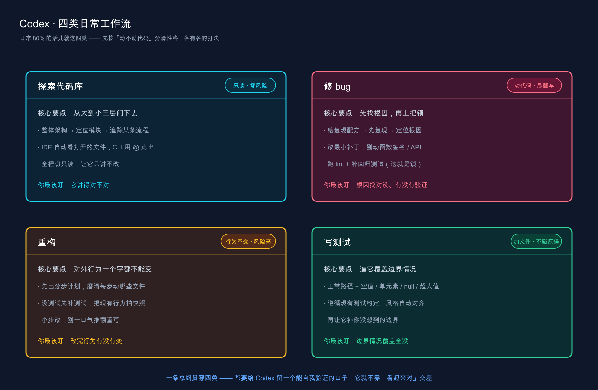

# 14 · 四类日常工作流：探索、修 bug、重构、写测试

> 📚 **系列导航**：上一篇 [13 · 提示词（Prompt）写法](13-prompting.md) 教你「话该怎么说」——把模糊需求拆成 Codex 听得懂的精确指令。这一篇换个角度落地：日常 80% 的活儿就那四类，**每一类我给你一套能直接照抄的流程**，套进去填空就能用。下一篇 [15 · 权限、沙箱与审批](15-permissions.md)。

先听段对话。上周一个刚转过来用 Codex 的兄弟在群里问我：

> 「我让它修个 bug，它三下就把报错弄没了，我提交了。结果第二天同样的毛病又冒出来了，咋回事？」
>
> 我问：「你让它先找根因了吗？补回归测试了吗？」
>
> 他：「……啊？修 bug 不就是把报错弄没吗？」

问题就出在这儿。**他把「报错消失」当成了「问题解决」，又没给那个 bug 上把锁**。其实探索、修 bug、重构、写测试这四类活儿，每一类都有自己固定的打法——套路对了，Codex 又快又稳；套路错了，它表面帮你干完、底下埋雷。

上一篇讲的是通用的「说话技巧」，这一篇要把它落到四个最高频的具体场景。我用 Codex 大半年，最后沉淀下来的就是这四套流程，**而且每套都顺着 Codex 自己的脾气来**——它在 IDE 里能看见你打开的文件，在 CLI 里得你用 `@` 点名；它擅长「能自己验证的活」，你就得给它留出验证的口子。

**看完这一篇，你会拿到：**

- 四类高频任务（探索 / 修 bug / 重构 / 写测试）各一套可直接复制的流程，含 IDE 和 CLI 两种走法的差异
- 每一类「为什么这么打」的关键道理，不是死记模板
- 一张四类任务的汇总对照表，各节末各有一张分类流程表、最后汇总成一张
- 一个能照着跑、给了预期输出的完整实战（拿一个真 bug 走一遍修复全流程）

> ⚠️ 下文凡涉及具体命令、斜杠命令、默认行为，都以 Codex [官方文档](https://developers.openai.com/codex/workflows) 为准；模型名、界面文案这类随版本变的东西，看到时以你本地实际显示为准，本篇不写死。

---

## 01 先认住：四种活儿，四把工具

动手之前，先把这四类活儿的「性格」分清楚。它们对 Codex 的要求完全不一样，**用错套路，效果差一大截**。

**类比：厨房里的四把刀，认准各自的用途。** 片鱼用柳刃、剁排骨用砍骨刀，你拿柳刃去剁骨头当然崩刃。探索、修 bug、重构、写测试，就是四把不同的刀——**关键不是「会不会用 Codex」，而是「这活儿该掏哪把刀」**。

它们最核心的区别在一个维度上：**这活儿动不动你的代码？**

| 活儿 | 动代码吗 | Codex 主要在干啥 | 你最该盯的 |
|------|---------|------------------|-----------|
| **探索代码库** | 不动（只读） | 读文件、给你讲清楚 | 它讲得对不对 |
| **修 bug** | 动 | 复现 + 定位根因 + 改 | 根因找对没、回归测试有没有 |
| **重构** | 动（但行为不变） | 等价改写 | 改完行为有没有变 |
| **写测试** | 加文件 | 生成测试 + 覆盖边界 | 边界情况覆盖全没 |

看出来没？**探索是零风险的**（它只读不写），所以可以放心大胆问；**修 bug 和重构是动刀的**，得让它先讲清楚再动手；**写测试介于两者之间**，它新建文件不碰你原有代码，但你得盯它有没有偷懒只测「正常情况」。

还有一条贯穿四类的总纲，来自官方提示词那页，值得先贴墙上：

> Codex 在「能验证自己工作」的时候，产出质量明显更高。给它复现步骤、验证办法、跑 lint（代码静态检查）和测试的指令——它就有据可依，而不是「看起来对」就交差。

这句话是这四套流程的地基。下面四节，本质上都是在回答一个问题——**这类活儿，怎么给 Codex 留一个能自己验证的口子**。

> 💡 一句话总结：四类活儿先按「动不动代码」分清性格——**探索零风险随便问，动刀的活儿先让它讲再让它改**；而且每一类都要给 Codex 留一个能自我验证的口子。



这张图把四类活儿摊在一块儿对比：每格一类，标了它「动不动代码」的性格、各自的核心打法、还有你最该盯的那一点——下面四节就是逐格把这套流程讲透。

---

## 02 探索陌生代码库：从大到小，三层问下去

先说最高频的场景：**你接手一个完全陌生的项目，第一件事是搞懂它**。

这事儿以前怎么干？打开文件夹，对着几十个目录发懵，一个个点进去看，看俩小时还是云里雾里。**现在不用了——Codex 把你的项目当工作区，它能自己读遍代码，你只管问**。

**类比：进一座没去过的大商场，先看导览图，再找那家店，最后走一遍路线。** 你不会一进门就钻进某个货架翻找，而是先在大厅看「整座商场几层、各层卖什么」（整体架构），再看「我要找的母婴用品在哪一层哪个区」（定位模块），最后照着「从入口怎么走到那家店」走一遍（追踪流程）。**从大到小、从面到线**，这就是探索的标准节奏。

这里要先讲一个关键点，关系到你这三层问题怎么提——**Codex 的 IDE 扩展和 CLI 拿上下文的方式不一样，Claude Code 在这点上也有区别**：Claude Code 的 CLI 会自动感知整个项目的上下文（靠 CLAUDE.md 和工作区），而 **Codex CLI 不会——它需要你用 `@` 显式点出文件**，才能「看见」你想让它看的东西。

**IDE 扩展会自动把你打开的文件、选中的代码当上下文喂进去；但在 Codex CLI 里，你通常得用 `@` 显式点出文件路径（或用 `/mention` 附一个具体文件）。**

说白了——**在 IDE 里探索，先把相关文件打开、把你关心的那段代码选上，再问；在 CLI 里探索，得用 `@文件名` 把文件点给它**。这是官方反复强调的差别，搞混了它就「看不见」你想让它看的东西。

### IDE 里这么问（本地探索最快）

打开最相关的几个文件，选中你关心的那段代码（可选但强烈建议），然后问。官方给的探索提示长这样：

```text
解释一下请求是怎么流过我选中的这段代码的。

请包含：
- 每个涉及的模块各自负责什么，简短说明
- 哪些数据被校验、在哪里校验
- 改这块时要小心的一两个「坑」
```

问完想快速核对它讲得对不对，再追一句让它给你可验证的清单：

```text
把这个请求流程总结成带编号的步骤列表，然后列出涉及的文件。
```

### CLI 里这么问（想要可滚动的文字记录 + shell 命令时）

先启动交互会话：

```bash
codex
```

然后用 `@` 把文件点给它再问（这是 CLI 和 IDE 最大的差别——**文件得你点，它不自动看**）：

```text
我要搞懂这个服务用的协议。读一下 @foo.ts @schema.ts，
讲讲它的数据结构和「请求 / 响应」流程，重点说清哪些字段必填、
哪些可选，以及向后兼容的规则。
```

**这里有个稳妥习惯，我自己每次接手新项目都用**：探索阶段先把审批收紧到只读。前面 [12 · 斜杠命令与快捷键](12-slash-commands.md) 讲过 `/permissions`，探索时切到 `Read Only`（只读）——**让它只读和讲、绝不一激动就动手改文件**。探索本来就该零风险，把这道闸先关上最踏实。

我去年接手一个三万行的老 Go 项目，第一天就这么干的：先在 CLI 里 `@` 点几个入口文件问「整体架构和主要模块」，摸清分了几个服务；再逐个「负责 X 的代码在哪些文件」定位；最后挑核心链路让它「把这条请求的流程总结成带编号的步骤」。**半天就摸到门道，搁以前没两三天下不来**。

直接给你**探索流程**，IDE 和 CLI 两种走法对照着用：

| 步骤 | IDE 扩展 | CLI |
|------|---------|-----|
| 1. 给上下文 | 打开相关文件、选中关心的代码段 | 用 `@文件名` 点出文件，或 `/mention` 附文件 |
| 2. 先问大架构 | 「整体架构概览，主要模块各负责啥」 | 同左，文件已 `@` 给它 |
| 3. 定位模块 | 「负责 [某功能] 的代码在哪些文件」 | 同左 |
| 4. 追踪流程 | 「追踪 [某条流程] 的完整路径」 | 同左 |
| 5. 要可验证产出 | 「总结成带编号步骤 + 涉及文件列表」 | 同左 |
| 全程 | 别让它改代码 | 切 `Read Only` 把它锁成只读 |

> 💡 一句话总结：探索就一个节奏——**从大架构到具体文件再到执行链路，从大到小三层问下去**；记牢 Codex 的脾气：**IDE 自动看你打开的文件，CLI 得用 `@` 点给它**，全程让它只读不改最稳。

---

## 03 修 bug：复现 → 找根因 → 改 → 跑验证

修 bug 是另一类高频活儿，也是**最容易翻车的一类**——开头那个兄弟踩的就是这个坑。

为啥容易翻车？因为新手最常犯的错是：**甩个报错就一句「帮我修一下」，然后 Codex 给你一个「能让报错消失」的修法**。注意，「报错消失」不等于「问题解决」——很多时候它只是把症状盖住了，根因还在那儿埋着，下次换个姿势又炸。

**类比：水管漏水，你不能只拿桶接着。** 地上一摊水，急着拿桶接、拿布擦（让报错消失），治标不治本——**得先顺着水迹找到是哪截管子裂了**（定位根因），换掉那截，再放水跑一遍确认不漏了（验证）。修 bug 一模一样——**先找漏点，别急着接水**。

Codex 修 bug 的官方打法，核心是给它一份**能复现的「配方」**，而不是一句高层描述。官方原话点得很透：

> 由你提供的：复现步骤和约束条件——**这些比一句高层描述重要得多**。由 Codex 提供的：命令输出、它发现的调用点、它触发出来的堆栈信息。

所以正确的修 bug 流程是四步，缺一不可：

1. **给复现配方 + 可疑文件**：完整报错、外加「我点了啥、走了哪几步才触发」，再附上你怀疑的文件
2. **让它先复现、再定位根因**：官方建议明确写「先在本地复现这个 bug」——它复现出来了，对根因的判断才靠谱，别让它对着空气猜
3. **给修复**：根因对了，再让它动手改，并叮嘱「保持改动最小」
4. **跑验证**：Codex 应该**改完重新跑一遍复现步骤**；有标准检查流程的，让它「跑 lint + 最小相关测试，把命令和结果报给我」

第四步是新手最容易漏的，但**恰恰是最值钱的一步**。官方在「修复后验证」里给的提示就一句话：

```text
修复之后，跑一遍 lint + 最小的相关测试套件。把用到的命令和结果报给我。
```

这就给 bug 上了把锁——**改完测试自动变绿，以后谁再不小心改回去，测试立刻报警**。开头那个兄弟的 bug 之所以复活，就是当初没留这把锁，没人知道那行代码碰不得。

### IDE 里修 bug

打开你觉得有问题的文件，连同它最近的调用方一起打开（IDE 会自动把打开的文件当上下文），然后：

```text
找出导致「显示已保存但没真正持久化」的 bug。
提出修复方案后，告诉我怎么在界面上验证它修好了。
```

### CLI 里修 bug

在仓库根目录启动 Codex，给它一份完整的复现配方。这是官方给的范例结构，**照着这个骨架填你自己的 bug**：

```bash
codex
```

```text
Bug：在设置页点「保存」，有时显示「已保存」但改动没真正生效。

复现：
1) 启动应用：npm run dev
2) 进入 /settings
3) 切换「开启提醒」开关
4) 点保存
5) 刷新页面：开关又弹回去了

约束：
- 不要改 API 的形态。
- 修复尽量小，可行的话补一个回归测试。

先在本地复现这个 bug，然后提出补丁并跑检查。
```

看出这份提示的讲究没——**它把「怎么触发」一步步写死了，还划了约束红线（别动 API），最后明确要求「先复现」**。这正是官方说的「复现配方比高层描述值钱」。

直接给你**修 bug 速查骨架**：

```text
Bug：[一句话说清现象]
复现：[编号列出每一步，从启动到触发]
约束：[别碰什么、改动多大]
怀疑文件：[你能定位到的话，@ 点出来]
请你：先复现 → 定位根因（先别改）→ 给最小修复 → 跑 lint 和相关测试报结果。
```

> 💡 一句话总结：修 bug 四步走——**给能复现的配方、让它先复现再找根因、改最小补丁、最后跑 lint 和测试验证**；复现配方比一句高层描述值钱得多，少了验证这把锁，同一个 bug 迟早复活。

---

## 04 重构：先理计划 → 小步改 → 行为不变 → 改前改后都测

重构这活儿，**风险最高，因为它动的是「没坏的代码」**。

修 bug 好歹有个明确的「修好了」标准——报错没了、测试绿了。重构没有，重构的目标是「代码更干净，但**对外行为一个字都不能变**」。一旦行为变了，你就是在重构的名义下偷偷引入 bug，**这是最坑的一种 bug，因为没人会去测一段「只是整理了一下」的代码**。

**类比：给行驶中的高铁换零件，不能停车、不能晃乘客。** 你得保证车照常跑、乘客没感觉，只是把底下某个部件换成更好维护的。重构就是「行驶中换件」——**对外的服务（乘客的体验）必须全程一模一样**。

重构最容易翻车在两点：**一是一口气推翻重写**（改动太大没法逐步验证），**二是没有测试兜底**（行为变没变全靠肉眼）。Codex 这边的官方打法，正好对症下药——**先理计划、再小步落地**。

### 第一步：先让它出一份重构计划

官方建议：动手前先让 Codex 产出一份重构计划。如果你装了 `$plan` 这个技能（skill），就显式调它（技能用 `$` 前缀调用，跟切 plan 模式的 `/plan` 斜杠命令不是一回事）。官方将其列为内置（SYSTEM 级）技能，通常开箱即用；没出现在列表里不必强求，直接用大白话让它「先出计划别动手」也行。

官方给的计划提示长这样（看它怎么把目标和约束都写死）：

```text
$plan

我们要重构 auth 子系统，目标：
- 拆分职责（token 解析 / 会话加载 / 权限判断分开）
- 减少循环依赖
- 提升可测试性

约束：
- 对用户可见的行为不能变
- 公开 API 保持稳定
- 给一份分步迁移计划
```

拿到计划别急着点头，**先跟它把计划磨清楚**——这一步是重构成败的分水岭：

```text
修改一下计划：
- 明确每个里程碑具体动哪几个文件
- 加一个回滚策略
```

为什么要先磨计划？因为官方那条总纲在这儿——**「把复杂的活拆成更小、更聚焦的步骤，Codex 干得更好，你也更好审」**。一份「每个里程碑动哪些文件 + 怎么回滚」的计划，等于把一次大重构拆成了好几次能单独验证的小重构。

### 第二步：小步落地，每步都测

计划定了，就一个里程碑一个里程碑地让它实现，**每实现一步，跑一遍测试确认行为没变**。这里有条铁规矩值得守：

**没有测试覆盖的代码，别让 Codex 直接重构。** 设想图快让它重构一个没测试的工具函数，它把一个边界分支「优化」掉了——那分支看着像废代码，其实处理了一种罕见输入。**线上炸了才发现。**

所以如果这段代码现在没测试，**重构第一步不是改，而是先补测试**——先用测试把「现在的行为」拍成快照，重构后对着快照验，行为没变才算成功。这点跟上一节修 bug 的逻辑一脉相承：**给 Codex 一个能自我验证的口子**，否则「看起来对」就是唯一信号，而看起来对的重构，恰恰最容易藏雷。

我自己吃过这亏：早期图省事让 Codex 重构一个没测试的金额格式化函数，它顺手「优化」掉了一个处理负数的分支，本地跑着没事，测试环境对账才发现负数全显示错了。从那以后我立的规矩是——**没测试，先补测试再重构，一次都不破例**。慢是慢一点，但再没翻过车。

直接给你**重构流程**：

| 步骤 | 干啥 | 关键叮嘱 |
|------|------|---------|
| 1. 出计划 | 让它（或 `$plan`）产出分步重构计划 | 目标 + 约束写死：行为不变、API 稳定 |
| 2. 磨计划 | 让它细化「每步动哪些文件 + 回滚策略」 | 拆成能单独验证的小里程碑 |
| 3. 补测试 | 代码没测试就先补覆盖现有行为的测试 | 把「现在的行为」拍成快照 |
| 4. 小步改 | 一个里程碑一个里程碑实现 | 别让它一次性推翻重写 |
| 5. 改前改后都测 | 每步跑测试，结果必须和重构前一致 | 行为变了立刻停、回滚 |

> ℹ️ 大型重构还有一招进阶玩法：**本地把计划磨好，再把又长又重的实现「外包」给云端并行跑**。这正是 [10 · 云端 Codex Cloud](10-cloud.md) 讲的场景——本地负责精细的规划和检查，云端负责跑长活。本篇先把本地这套流程吃透，云端委派那套到那篇细看。

> 💡 一句话总结：重构的命根子是「**对外行为不能变**」——先让它出分步计划、磨清楚每步动哪些文件，再小步落地、改前改后都测；没测试就先补测试再动手，**一口气重写和没测试兜底是重构两大杀手**。

---

## 05 写测试：重点是逼它覆盖边界情况

最后一类：**给代码补测试**。

写测试这事儿，Codex 干起来其实很顺手——官方建议里专门有一句「**遵循其他测试里已有的约定**」，它会去翻你现有的测试文件，照着你已经在用的框架、断言风格写，**风格自动对齐，不用你教**。但有个坑你必须知道：**你不特别交代，它默认偏向只测「正常情况」（happy path，即一切顺利的主流程）**。

什么叫只测正常情况？比如一个反转列表的函数，它给你测「`[1,2,3]` 反转成 `[3,2,1]`」——对是对，但**空列表呢？只有一个元素呢？传进来 null 呢？** 这些「边界情况（edge case，即极端或异常的输入）」才是真正会出 bug 的地方，也是测试最该覆盖的地方。

**类比：给新车做碰撞测试，不能只在直路上慢慢开一圈。** 真正值钱的测试是去撞墙、急刹、侧翻、追尾——专门试那些「极端工况」。**会出问题的永远是边界，不是正常路况。** 写测试的核心，就是逼 Codex 去测这些边界。

官方两种走法的提示里，都点名了同一件事——**happy path 加 edge cases 都要覆盖**。

### IDE 里写测试（基于选区）

打开有目标函数的文件，**选中定义这个函数的那几行**，从命令面板选「Add to Codex Thread」（加入 Codex 线程）把这几行加进上下文，然后：

```text
给这个函数写单元测试。遵循其他测试里已有的约定。
```

这里的「Add to Codex Thread」是 IDE 特有的动作——**它把你选中的精确行数喂给 Codex**，比用文字描述「那个函数」准得多。

### CLI 里写测试（提示里点名函数 + 文件）

启动 Codex，用 `@` 点出文件、说清函数名，**并明确要求覆盖边界**：

```bash
codex
```

```text
给 @transform.ts 里的 invert_list 函数加测试。
覆盖正常路径，外加边界情况。
```

注意官方这句范例最关键的就是结尾「**外加边界情况**」——把这句删了，它大概率只给你测正常路径。对照一下两种问法，差距一目了然：

| ❌ 模糊问法 | ✅ 精确问法 |
|-----------|-----------|
| 「给这个函数写测试」 | 「给 `@transform.ts` 里的 `invert_list` 写测试，**正常路径 + 重点覆盖空列表、单元素、null、超大列表**这几种边界」 |
| 它只测正常路径，覆盖率虚高 | 它把真正会炸的地方都测到 |

还有一招额外加分项——**主动让它帮你补漏**。你列的边界总有想不全的，干脆让它一并想：

```text
另外帮我想想还有哪些我没列到的边界情况，一并测上。
```

我写测试时基本都带这句，**它经常能揪出我压根没想到的输入组合**——某次给一个日期区间函数写测试，我列了空值和倒序，它自己补了「跨夏令时」和「同一天的起止」两种，全是我闷头列不全的。

直接给你**写测试流程**，IDE 和 CLI 对照：

| 步骤 | IDE 扩展 | CLI |
|------|---------|-----|
| 1. 锁定目标 | 选中函数行 →「Add to Codex Thread」 | 用 `@文件名` 点出文件、说清函数名 |
| 2. 要求对齐风格 | 「遵循其他测试的约定」 | 同左 |
| 3. 逼它测边界 | 「正常路径 + 边界情况：[列出来]」 | 同左 |
| 4. 让它补漏 | 「还有哪些我没想到的边界，一并测」 | 同左 |
| 5. 跑一遍 | 让它运行测试、有失败修到通过 | 同左 |

> 💡 一句话总结：写测试别只说「写测试」——**显式逼它覆盖边界情况**（空值、单元素、null、超大值），官方范例那句「外加边界情况」是命门；再让它帮你补没想到的边界，正常路径反而最不重要。

---

## 06 动手：拿一个真 bug 走一遍修复全流程

光看流程不算会，得跑一遍。下面用「修 bug」这一类做实战——**它四步最全，跑通它，另外三类你自然就会套**。这里特意埋了个真 bug 给你修。

> 平台差异先说清：下面 `mkdir` / `cd` 在 **Mac / Linux** 直接用；**Windows** 建议在 PowerShell 里敲，`calc.py` 用记事本手动新建。

**第一步：建一个带 bug 的玩具项目**

```bash
mkdir bug-demo
cd bug-demo
```

Mac / Linux 直接用 `echo` 写文件：

```bash
echo 'def average(numbers):
    return sum(numbers) / len(numbers)' > calc.py
```

Windows 用户用记事本新建 `calc.py` ，贴入这两行：

```python
def average(numbers):
    return sum(numbers) / len(numbers)
```

这个 `average` 函数算平均值，看着没毛病——**但传进去一个空列表，它会除以 0 崩掉**。这就是我们要修的 bug。

**预期**：`bug-demo` 文件夹里有个 `calc.py` ，内容就是 `average` 函数那两行。

**第二步：在仓库根目录启动 Codex**

```bash
codex
```

**预期**：进入交互式 TUI（终端用户界面，Terminal User Interface），中间是对话区，最底下是输入框。

**第三步：套用修 bug 流程，给一份复现配方**

在输入框里敲（这就是把第 03 节那套骨架填好的样子，注意它带了复现步骤、约束、和「先复现再改」的要求）：

```text
Bug：调用 calc.py 里的 average([]) 会崩。

复现：
1) 给 average 函数传一个空列表 []
2) 它必现 ZeroDivisionError: division by zero

约束：
- 改动尽量小，别动函数签名。

请你：先复现这个 bug，再定位根因（先别改），然后给最小修复，
最后补一个能复现这个 bug 的回归测试并跑一遍确认通过。
```

**预期**：Codex 会先复现、再告诉你根因——**空列表时 `len(numbers)` 是 0，除以 0 就崩了**；然后给一个 diff（差异补丁，即改动前后的对比）（比如空列表时返回 0、或抛一个更清楚的异常），停下来等你批准；批准后它还会新建一个测试文件（像 `test_calc.py`），里面有一条专门测空列表的用例。

> ℹ️ 它会不会停下来问你批准，取决于当前审批策略（Auto 档在工作区内改文件可能直接放行）。这一套沙箱 + 审批的逻辑，下一篇 [15 · 权限、沙箱与审批](15-permissions.md) 专门讲，这里照默认走即可。

**第四步：批准改动，看它跑验证**

看懂 diff 后选「同意 / Yes」。Codex 会接着跑刚写的测试——**这正是官方说的「改完重新跑一遍验证」**。

**预期**：终端里能看到测试结果，类似（具体格式以你本地测试框架为准）：

```text
test_calc.py::test_average_empty_list PASSED
test_calc.py::test_average_normal PASSED
```

**看到测试全绿 = 这个 bug 被修好了，而且上了锁**——以后谁再把这行改回去，测试立刻变红报警。

**第五步：退出，确认文件真的改了**

退出 Codex（敲 `/exit`），回终端看：

```bash
cat calc.py
```

（Windows PowerShell 用 `type calc.py`）

**预期**：`calc.py` 里 `average` 函数已经加了空列表的处理逻辑，目录下还多了个测试文件。**和你批准的 diff 对得上 = 修 bug 全流程跑通，恭喜！**

> ⚠️ 如果第三步 Codex 没主动写测试，大概率是你把提示里「补一个回归测试」那句删了。**别省那一句**——验证这把锁，正是新手和老手的分水岭。

> 💡 一句话总结：修 bug 全流程亲手跑一遍——**埋个真 bug、给复现配方让它先复现再改、看着它补测试跑绿**；跑通这一类，另外三类照葫芦画瓢就会。

---

## 07 小结

这一篇把你日常 80% 的活儿拆成了四类，每一类给了一套固定打法和一套能抄的流程：

| 活儿 | 流程核心 | 最该盯的注意点 |
|------|---------|--------------|
| **探索代码库** | 「整体架构 → 负责 X 的代码在哪 → 追踪某条流程」 | IDE 自动看打开的文件，CLI 得 `@` 点；全程只读 |
| **修 bug** | 「给复现配方 → 先复现再找根因 → 最小修复 → 跑验证」 | 复现配方比高层描述值钱，验证别省 |
| **重构** | 「先出计划 → 磨清楚 → 小步改 → 改前改后都测」 | 行为不能变，没测试先补测试，别一口气重写 |
| **写测试** | 「正常路径 + 重点覆盖边界，再让它补漏」 | 「外加边界情况」是命门，别只测 happy path |

贯穿这四类的，其实是同一条总纲：**给 Codex 留一个能自己验证的口子**——探索让它给可核对的步骤清单、修 bug 让它跑复现和测试、重构让它对着测试快照验、写测试逼它把边界测全。**只要 Codex 有得可验，它就不靠「看起来对」交差。**

**你现在应该能：** 拿到任何一类高频任务，不再对着光标发懵——直接调出对应流程套进去，知道每一步该让 Codex 先干什么、自己该盯什么，还知道同一类活儿在 IDE 和 CLI 里走法的差别在哪。**这四套流程，是你之后绝大多数工作的脚手架**；熟了之后你会发现，再复杂的任务也无非是这四类的组合与串联。

这四套打法经得起天天调用的考验——**再花哨的任务，最后也还是绕回这四套。**

---

下一篇 **[15 · 权限、沙箱与审批](15-permissions.md)**——这一篇里你已经好几次撞见「它停下来问你批不批」「探索时切只读」这些动作，但还没把背后那套机制讲透。Codex 凭什么知道哪步该问你、哪步能自己放行？沙箱到底圈住了它多大的地盘？下一篇就把**权限、沙箱、审批**这三件套一次摊开，让你真正拿稳「它能动多大、动手前问不问」的方向盘。留个小思考：这一篇修 bug 时它「改文件前停下来等你点头」，那要是你想让它在工作区内随便改、出了工作区才问你，该把哪个旋钮拧到哪一档？
