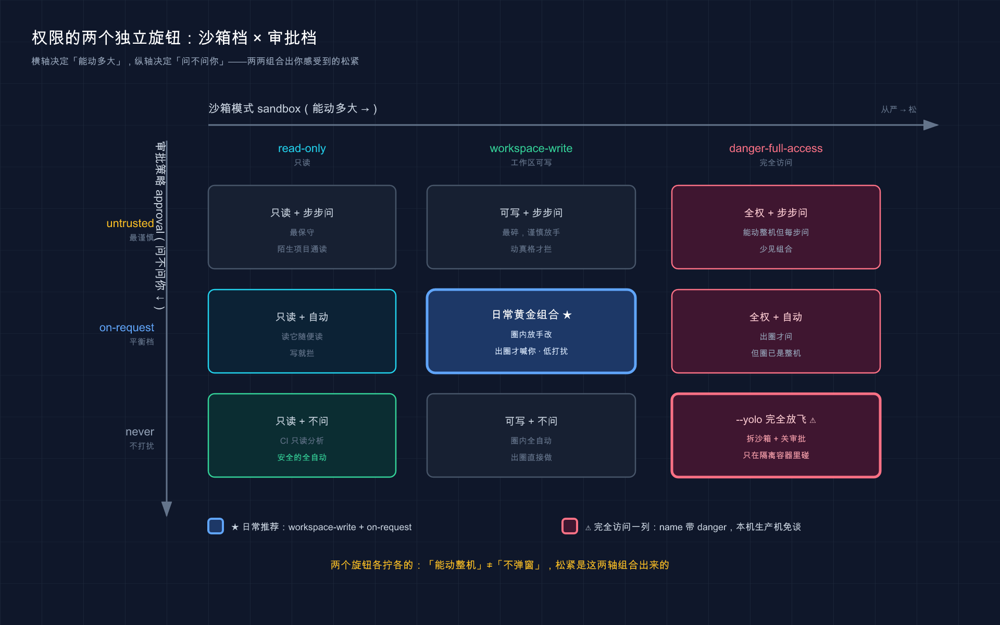

# 15 · 权限、沙箱与审批：放多松、收多紧，自己拧

> 📚 **系列导航**：上一篇 [14 · 常见工作流](14-workflows.md) 把 Codex 揉进了你的日常开发节奏。这一篇换个维度——管的不是「它怎么干活」，而是「它敢动多大」：从一行命令都要问你，到全自动放飞，**沙箱和审批这两个旋钮到底怎么拧、什么场景拧到哪一档，这一篇给你拧明白**。

说个我去年冬天干的蠢事。那会儿我刚把 Codex 配熟，图省事在 `~/.codex/config.toml` 里把 `sandbox_mode` 写死成了 `danger-full-access`，理由是「弹窗烦」。结果某天我在一个**没初始化 Git 的临时目录**里让它「清一下没用的文件」，它真就在我整个主目录里翻了起来——因为完全访问模式下根本没有「工作区」这道圈拦着它。我手忙脚乱按 `Esc` 打断，那一刻后背是凉的。

后来复盘，问题不在 Codex，在我：**我把一个该用在隔离容器里的危险配置，写成了全局默认**。它没乱，是我把缰绳松到了不该松的地方。

第 02 篇我们已经用「儿童乐园围栏」和「门禁 + 保安」把沙箱、审批这俩概念讲透了——**这一篇不重复定义**，只干一件事：手把手教你**怎么设、怎么选**。哪一档配哪一档、命令行临时怎么改、写进配置文件怎么持久化、危险模式的红线划在哪。

**看完这一篇，你会拿到：**

- 三种沙箱模式（`read-only` / `workspace-write` / `danger-full-access`）和三种审批策略（`untrusted` / `on-request` / `never`）怎么两两组合，一张表对号入座
- 命令行用 `--sandbox` / `--ask-for-approval` 临时调、`config.toml` 里写死当默认，两种姿势都给你模板
- Codex 启动时**默认给你哪一档**（跟你这文件夹有没有 Git 有关），以及为什么
- `workspace-write` 模式下网络默认是**关着**的、`.git` 是**只读保护**的——这些容易踩的默认值
- `--yolo`（完全放开）的红线到底在哪，本机和生产机为什么一律免谈

> ⚠️ 下文凡涉及具体命令、配置项、默认值，都以 Codex [官方文档](https://developers.openai.com/codex/agent-approvals-security) 为准；版本号、模型名这类会随更新变的东西，看到时以你本地实际显示为准。文中提到的「权限配置档（permission profiles）」是官方标注的 **Beta 功能，可能变化**，第 05 节会单独说。

---

## 01 先理清：你要拧的是「两个独立旋钮」

先把最容易绕晕的一件事说死：**沙箱和审批不是一个东西的两档，是两个互相独立的旋钮，各管各的。**

第 02 篇打过比方了，这里只补一句**怎么落到配置上**——它俩在 `config.toml` 里是两个分开的键，命令行里是两个分开的参数：

| 旋钮 | 管什么 | 配置键 | 命令行参数 | 简写 |
|---|---|---|---|---|
| **沙箱模式（sandbox mode，文件系统与网络访问边界）** | 能动多大 | `sandbox_mode` | `--sandbox` | `-s` |
| **审批策略（approval policy，每步操作是否暂停等待人工确认）** | 问不问你 | `approval_policy` | `--ask-for-approval` | `-a` |

为什么强调「独立」？因为新手最常见的误解是「我开了完全访问，是不是就不弹窗了」——**不是**。完全访问（沙箱旋钮拧到底）和不弹窗（审批旋钮拧到底）是两件事，你完全可以「能动整台机器、但每步都问你」，也可以「只能读、但闷头读不打扰」。这俩组合出来的效果，才是你实际感受到的「松紧」。

**类比：开车的「档位」和「限速」。** 沙箱像你挂的**档位**——挂 P 档（`read-only`）车根本不动，挂 D 档（`workspace-write`）能在路上跑，挂越野档（`danger-full-access`）连沟里都能下；审批像你给自己设的**限速提醒**——可以「超速才响」（`on-request`）、可以「见个生人就响」（`untrusted`）、也可以「关掉提醒闷头开」（`never`）。**档位决定车能去哪，限速决定啥时候提醒你**——两套互不替代。

几个你真会遇到的场景，帮你建立「这俩分开」的体感：

- 你想让它**只读代码、写份分析**：沙箱拧到 `read-only`，审批随便——反正它也写不了东西，弹不弹窗无所谓。
- 你想让它**在项目里放手改、但出了项目得喊你**：沙箱 `workspace-write` + 审批 `on-request`，这是日常黄金组合。
- 你在**隔离容器里跑批量任务、彻底别烦我**：沙箱 `danger-full-access` + 审批 `never`，俩旋钮都拧到底——但**只能在容器里**，下面会反复强调。

> 💡 一句话总结：沙箱（`--sandbox`）管「能动多大」、审批（`--ask-for-approval`）管「问不问你」，**是两个独立旋钮、在配置里也是两个分开的键**；你感受到的松紧，是这俩组合出来的。



这张图把两个旋钮摆成了一张二维表：横轴是沙箱模式（从严的 `read-only` 到松的 `danger-full-access`），纵轴是审批策略（从最谨慎的 `untrusted` 到不打扰的 `never`），每个交叉格就是一种实际松紧——蓝框那格 `workspace-write + on-request` 是日常黄金组合，右下角红框那格 `danger-full-access + never`（也就是 `--yolo`）则只该在隔离容器里碰。

---

## 02 三种沙箱模式：能动多大，这一档说了算

沙箱旋钮一共三档，官方原话定义很干脆，我用「能不能改文件 / 能不能联网 / 配哪种活」三栏给你列清楚——**这是本节最该记住的一张表**：

| 沙箱模式 | 能改文件吗 | 能联网吗 | 最适合的活 |
|---|---|---|---|
| `read-only`（只读） | ❌ 不能（要改得先批） | ❌ | 审代码、出方案、聊规划，「别动我东西」 |
| `workspace-write`（工作区可写） | ✅ 仅限工作区内 | ❌ **默认关**，得手动开 | **日常开发的默认档**，低打扰 |
| `danger-full-access`（完全访问） | ✅ 整台机器 | ✅ | 隔离容器 / VM，**名字带 danger 不是吓你的** |

几个**最容易想当然写错**的细节，挑出来钉死：

**第一，`workspace-write` 模式下网络默认是关着的。** 这点反直觉——你以为「能写文件了应该也能联网装依赖了吧」，**不是**。官方写得很明白：默认 `workspace-write` 把网络访问关着，要联网得自己在配置里开。想开网络，在 `config.toml` 里加这么一段：

```toml
[sandbox_workspace_write]
network_access = true
```

我自己第一次让 Codex 在 `workspace-write` 下 `npm install`，它卡住报了一堆网络错，我还以为是代理问题，折腾半天才想起来——**是沙箱默认没给它联网权限**。记住这条，能省你一晚上。

**第二，工作区不只是「当前目录」。** 官方说工作区还**自动包含临时目录**（比如 `/tmp`）。具体哪些目录在工作区内，进会话敲 `/status` 一看便知，别瞎猜。预期输出大致长这样：

```text
Sandbox: workspace-write
Approval: on-request
Workspace directories:
  /Users/you/myproject
  /tmp
```

看到 `Sandbox` 和 `Approval` 两行，就是当前档位；`Workspace directories` 列出的就是它能写的范围。

**第三，就算开了 `workspace-write`，有几个目录依然是「只读保护」的。** 这是 Codex 特意设的安全网——在可写的工作区里，下面这些路径仍然碰不得：

| 受保护路径 | 为什么保护 |
|---|---|
| `<工作区>/.git` | 防止它误改 Git 历史、把你仓库搞乱 |
| `<工作区>/.agents` | 防止它偷偷改自己的代理配置 |
| `<工作区>/.codex` | 同上，Codex 自己的配置目录 |

而且这个保护是**递归**的——这些目录底下的所有东西都跟着只读。所以你不用担心「开了可写它就能改我的 `.git`」，**Codex 默认就把这几个敏感目录锁住了**。

**第四，沙箱不只管 Codex 自己的读写，它派生的命令也一样受限。** 这点第 02 篇提过，这里再强调一遍它的实战意义：哪怕 Codex 调用 `git`、`npm`、测试脚本，这些子命令也被关在同一个圈里——所以你不会遇到「主进程被关着、子命令却越狱去改了别的目录」。

> 💡 一句话总结：三档沙箱里 `workspace-write` 是日常默认，但记住它**网络默认关、`.git` / `.agents` / `.codex` 强制只读**；想联网得手动开 `network_access`，想看工作区范围敲 `/status`。

---

## 03 三种审批策略：问不问你，这一档说了算

审批旋钮也是三档。沙箱画好了圈，**圈边上「该不该停下来问你」就归审批管**：

| 审批策略 | Codex 的行为 | 大白话 |
|---|---|---|
| `untrusted` | 只自动跑「已知安全」的只读操作，其余跑之前先问 | 防一切陌生命令，最谨慎 |
| `on-request` | 默认在沙箱圈里自己干，**要出圈时才停下来问** | 最常用的平衡档 |
| `never` | 不弹审批，闷头干 | 全自动，配合完全访问才有意义 |

这里有个官方细节值得拎出来——**`untrusted` 不是「只读」的意思**。它仍然会**自动执行那些已知安全的读操作**，只是凡是「可能改状态、或触发外部执行」的命令（比如有破坏性的 Git 操作、带 config 覆盖参数的命令）都要你点头。所以 `untrusted` 的体感是「读它随便读，一旦要动真格就拦」，比 `on-request` 更碎、更谨慎。

**还有个进阶档位你该知道：`never` 能和任意沙箱模式搭。** 很多人以为 `never`（不问）就等于「放飞」，**错**。官方明说 `--ask-for-approval never` 跟所有 `--sandbox` 模式都能配——你完全可以 `read-only` + `never`，意思是「只让它读、而且读的时候一句都别问我」，这是 CI 里只读分析的标准配法，安全得很。**「不问」和「放权」是两码事**，第 01 节那个「两个独立旋钮」的认知，到这儿又验证一次。

至于「谁来审批」，默认是弹给你本人（`approvals_reviewer = "user"`）。官方还提供了一个 `auto_review`（自动审查）选项——让一个审查 agent 替你先过一遍那些需要审批的请求。这个属于偏进阶、还在演进的能力，**16 · 安全与风险边界**会展开讲它的判断逻辑和风险，这里你只要知道有这么个开关，日常 `user` 够用。

> 💡 一句话总结：审批三档里 `on-request` 是日常默认；`untrusted` 更碎更谨慎（读随便读、动真格才拦）；`never` 是「不问」不是「放权」，能跟任意沙箱模式搭，CI 只读分析就常用 `read-only` + `never`。

---

## 04 怎么组合：临时调用命令行，写死用 config.toml

模式和策略都认全了，落到「怎么设」就两条路：**临时改用命令行参数，永久改写进配置文件。**

### 临时改：命令行参数（只管这一次）

启动时把两个参数一带，就指定了这一次会话的松紧。官方给的**低风险日常组合**长这样：

```bash
codex --sandbox workspace-write --ask-for-approval on-request
```

围栏锁着、出圈才问，安全又不烦。简写更短，`-s` 和 `-a`：

```bash
codex -s read-only -a on-request "只帮我审一下这段代码，别动手"
```

进了会话还想换？不用退出，一句斜杠命令当场切：

```text
/permissions
```

弹出选择器，挑你要的档（`Read Only` / `Auto` / `Full Access` 这类），即时生效。我自己的真实节奏是：**接手陌生项目先 `/permissions` 切只读**让它通读出方案，看完心里有底了再切 `workspace-write` 放手——这个习惯救过我好几次，避免它一上来就瞎改我还没看懂的代码。

> ⚠️ **新版菜单可能不同**：codex-cli **0.142** 起，官方推出 [permission profiles](https://developers.openai.com/codex/permissions)（**Beta，may change**）替代旧预设，你的 `/permissions` 可能变成 `Ask for approval` / `Approval for me` / `Full access` 这类**审批策略**档，不再直接出现 `Read Only`。要切只读时**改走启动参数 `codex --sandbox read-only`**，或在 `~/.codex/config.toml` 写 `sandbox_mode = "read-only"`（官方保留旧 sandbox 模式作兼容路径）。本节后续讲 `/permissions` 切只读的地方同此说明，不再重复。

下面这张图把「先看沙箱、再看审批」的两道关卡理清楚：


这张图在说：**每要做一步，Codex 先问「在不在沙箱圈内」（沙箱说了算），出圈了再问「要不要停下来问你」（审批说了算）**——两道关卡顺着走，缺一不可。

### 写死：config.toml 当默认（每次启动都生效）

每次都敲参数太烦，把常用组合写进配置文件一劳永逸。文件在 `~/.codex/config.toml`，加这两行：

```toml
approval_policy = "on-request"
sandbox_mode    = "workspace-write"
```

> 想要「最谨慎」的兜底配法？官方给的「永远先问」组合是 `approval_policy = "untrusted"` 配 `sandbox_mode = "read-only"`，等于每次启动都从最严开始，需要放权时再手动切。生产项目、共享机器适合这么兜底。

如果你有好几套常用组合（比如「日常一套、CI 一套」），别在一个文件里反复改——官方支持**配置预设档（profile）**，把每套存成单独文件，用 `--profile` 选：

```toml
# ~/.codex/full_auto.config.toml
approval_policy = "on-request"
sandbox_mode    = "workspace-write"
```

```toml
# ~/.codex/readonly_quiet.config.toml
approval_policy = "never"
sandbox_mode    = "read-only"
```

用的时候点名即可：

```bash
codex --profile full_auto
```

> ⚠️ 这里说的 profile（配置预设档）和第 05 节要讲的 permission profile（权限配置档）**是两个不同的东西**，名字像但别混：前者是「把一组配置打包命名」的老办法，后者是更新的、专门描述文件系统 + 网络边界的 Beta 机制。本节这套 `sandbox_mode` + `approval_policy` 是**目前的主线配法**，先把它吃透。

> 💡 一句话总结：临时改用 `-s` / `-a` 或会话里 `/permissions`，永久改写进 `~/.codex/config.toml` 的 `sandbox_mode` + `approval_policy`；多套常用组合用 `--profile` 切，**这套是当前主线，先掌握它**。

---

## 05 进阶一档：rules 精确控命令、permission profiles 精细画边界（Beta）

第 04 节那套「沙箱模式 + 审批策略」是粗调，定大基调。如果你想精确到「**这一条命令永远允许、那一条永远禁止**」，Codex 还有两件更细的工具。新手第一遍可以略过，等真有需求了再回来。

### rules：给单条命令定规矩（实验性）

> ⚠️ **实验性，可能变化。** rules 是官方标注的实验功能。

**Codex 真正用来「精确控单条命令」的机制叫 rules（规则）**，注意它的决策词是 `allow` / `prompt` / `forbidden`，不是某些教程里写的 `ask` / `approve` / `deny`——写法不同，别混。

它解决的问题是：沙箱是「按圈划」的粗边界，但有时你想要的是「`gh pr view` 这条命令哪怕出圈也直接放行、不用每次问」「`grep` 一律禁掉、逼自己用 `rg`」这种**按命令前缀**的精确控制。这时候扩大整个沙箱太粗暴，写一条 rule 才对症。

规则写在 `~/.codex/rules/` 下的 `.rules` 文件里，语法像 Python（实际是 Starlark）。一条规则长这样：

```python
prefix_rule(
    pattern = ["gh", "pr", "view"],
    decision = "prompt",
    justification = "查看 PR 允许，但要我点头",
)
```

`decision` 三选一，含义和它们的优先级官方写死了——**最严的赢**（`forbidden` > `prompt` > `allow`）：

| decision | 效果 |
|---|---|
| `allow` | 出沙箱直接跑，不问 |
| `prompt` | 每次匹配都先问你 |
| `forbidden` | 直接拦死，不问也不跑 |

有个安全设计很贴心：碰到 `git add . && rm -rf /` 这种**把多条命令塞进一行**的，Codex 在安全的前提下会把它**拆成单条逐个判**——哪怕你 `allow` 了 `git add`，那个 `rm -rf /` 也会被单独拦下，**不会被夹带过关**。改完规则想验证，用 `codex execpolicy check` 拿命令试一下它会怎么判，别上来就实战。

### permission profiles：把文件系统 + 网络边界打包成一个 profile（Beta）

> ⚠️ **Beta，可能变化，且和老的沙箱设置「不能混用」。** 这是官方反复强调的——如果你的任何配置文件里出现了 `sandbox_mode`、或你传了 `--sandbox`，Codex 就**还是走老的沙箱设置**，不会用 permission profiles。两套二选一，别同时配。

如果你觉得「`workspace-write` 不够细，我想精确规定哪个目录可写、哪个 `.env` 必须拦、能访问哪几个域名」，permission profiles（权限配置档）就是干这个的。它把**文件系统规则**和**网络规则**打包成一个命名 profile，用 `default_permissions` 指定默认用哪个。

官方内置三个，名字一看就懂（注意都带个冒号前缀）：

| 内置 profile | 作用 |
|---|---|
| `:read-only` | 保持本地命令只读 |
| `:workspace` | 允许写工作区根目录和系统临时目录 |
| `:danger-full-access` | 拿掉本地沙箱限制，只在确实需要广权限时用 |

自定义一个长这样（文件系统精确到「工作区可写、但所有 `.env` 拦死」）：

```toml
default_permissions = "project-edit"

[permissions.project-edit]
extends = ":workspace"

[permissions.project-edit.filesystem.":workspace_roots"]
"." = "write"
"**/*.env" = "deny"

[permissions.project-edit.network]
enabled = true

[permissions.project-edit.network.domains]
"api.openai.com" = "allow"
```

文件系统三种权限 `read` / `write` / `deny`，优先级和 rules 一个路子——**`deny` 最大**（`deny` > `write` > `read`），越具体的路径越优先。这套设计的妙处是：**你可以「工作区整体可写、但单独把 `.env` 抠出来拦死」**，粗放和精细一条配置里兼顾。网络也是「先白名单」——不写 `allow` 就一个域名都不放，`deny` 永远压过 `allow`。

我的建议很直接：**新手别碰 profiles，先用第 04 节那套主线配法把日常跑顺。** 等你有了「必须精确锁某个敏感文件 / 某批域名」的真实需求，再来研究它——而且记得它和老沙箱设置不能混用，切过去之前先把 `sandbox_mode` 从配置里清掉。

> 💡 一句话总结：rules 按**命令前缀**精确控（`allow`/`prompt`/`forbidden`，最严的赢），permission profiles（Beta）按**路径 + 域名**精细画边界（`deny` 最大）；两者都是进阶档，**新手先用主线，有刚需再上**，且 profiles 不能和老沙箱设置混配。

---

## 06 启动默认值 + 危险模式红线

机制讲完，落到「我到底该选哪档」，先得知道一件事：**Codex 启动时其实已经替你智能选了一档默认值**——而且它选哪档，跟你这文件夹有没有 Git 有关。

### Codex 默认给你哪一档

官方逻辑很聪明：**启动时它先看这文件夹是不是版本控制（有没有 Git），据此推荐不同的默认档**：

| 你启动 Codex 的文件夹 | 默认推荐 |
|---|---|
| 有 Git 管着（version-controlled） | **Auto 档**（`workspace-write` + `on-request`） |
| 没有 Git（non-version-controlled） | **`read-only`**（只读） |

这设计戳中要害：**有 Git 兜底，它改砸了你能 `git diff` 看、能回滚，所以敢放它在工作区写**；没 Git 的目录改了就改了、没法回退，所以默认只读保平安。回头看我开头那个翻车故事——**我恰恰是在「没 Git 的临时目录」里用了完全访问**，等于亲手拆掉了 Codex 给我准备的两层保护，能不出事吗。

另外有个细节：某些情况下 Codex 会**先以 `read-only` 起步，直到你明确「信任」这个工作目录**（比如通过初次引导提示、或 `/permissions`）才放开。看到它一开始畏手畏脚只肯读，别慌，**那是它在等你点头信任这个目录**，不是坏了。

还有一条和「联网」相关的默认值，顺手记一下——**网页搜索（web search）默认走缓存（`cached`），不是实时抓取**。官方维护了一份预索引的结果，缓存模式返回的是这份索引，而不是去抓活页面。好处是**降低被「实时页面里藏的提示注入」攻击的风险**。注意一个反直觉点：**如果你开了完全访问（`--yolo` 那套），网页搜索反而会默认切成实时（live）**。想强制实时用 `--search`、想彻底关掉设 `web_search = "disabled"`，但这块的安全考量留到 **16 · 安全与风险边界**细说。

### `--yolo`：完全放开的红线

最后是那道**红线**，也是我开头翻车的主角——完全放开。在 Codex 里它有两种等价写法：

- 配置层面：`sandbox_mode = "danger-full-access"` 配 `approval_policy = "never"`
- 命令行一把梭：`--dangerously-bypass-approvals-and-sandbox`（简短别名 `--yolo`，you only live once）

`--yolo` 这名字就差把「别瞎用」写脸上了。它**既拆掉沙箱、又关掉审批**，等于让 Codex 在你整台机器上为所欲为、还一句都不问。该不该开，照这张表对号：

| 场景 | 敢不敢开 `--yolo` / 完全访问 |
|---|---|
| 隔离容器 / VM / dev container | ✅ 敢，删的也是一次性环境 |
| CI 里跑一次性任务（容器内） | ✅ 敢，但环境本身得是隔离的 |
| 自己日常开发的本机 | ❌ 不开，宁可慢点也留着审批 |
| 装着公司生产代码、有重要数据的机器 | ❌ 绝对不开，这是炸弹 |

官方对此态度很明确：完全访问标着 **(not recommended)**（不推荐）。如果你的宿主机本来就跑不了 Linux 沙箱、或公司统一用容器化开发，**正确姿势是用 Docker / dev container 把外层隔离做好，再在容器里跑 `--yolo`**——让容器当那道安全边界，而不是裸着在本机上拆缰绳。官方甚至给了一份现成的安全 devcontainer 示例（带防火墙出站控制），值得参考。

但官方也补了句冷水，必须转告你：**就算在 devcontainer 里开完全访问，也不是绝对安全**——一个恶意项目能把容器内能拿到的东西（包括你的 Codex 登录凭据）全偷走。所以哪怕在容器里，**也只对可信的代码仓库这么干**，并且像对待任何高权限环境一样盯着它的动作。

我的血泪结论就一句：**完全访问只在「删了也不心疼、丢了也不要紧」的隔离环境里开，本机和生产机一律免谈。** 弹窗烦不是理由——烦，也比后背发凉强。

> 💡 一句话总结：Codex 默认按「有没有 Git」给你选档（有 Git → Auto、没 Git → 只读），别拆这层保护；网页搜索默认走缓存防注入；`--yolo`（完全放开）**只在隔离容器里碰，本机和生产机绝对不开**。

---

## 07 动手：5 分钟把三档松紧亲手切一遍

光看记不住。下面带你用一个空目录，**亲眼看到同一个请求在不同档位下，Codex 是「停下来问」还是「直接干」**。全程不依赖任何现成项目。

**第一步：建个空目录，进去启动 Codex。**

Mac / Linux（Windows 用 PowerShell，把 `mkdir -p` 换成 `mkdir`）：

```bash
mkdir -p ~/perm-demo && cd ~/perm-demo
codex
```

> 注意：这个目录**没初始化 Git**。按第 06 节讲的默认逻辑，Codex 很可能一进来就给你 `read-only` 起步——正好，省得我们手动切。

**第二步：确认当前档位。**

进会话先看一眼自己现在在哪档：

```text
/status
```

**预期**：能看到当前的沙箱模式、审批策略，以及工作区包含哪些目录。先把这一屏当基准。

**第三步：在只读档下，让它干一件「要写文件」的事。**

确保当前是只读（不是的话敲 `/permissions` 切到 `Read Only`），然后丢给它：

```text
帮我新建一个文件 hello.txt，里面写一行 "hello codex"。
```

**预期**：它**不会**默默把文件建好，而是**停下来请求批准**——因为「写文件」突破了 `read-only` 的边界，按审批策略它必须先问你，大意是：

```text
我需要创建文件 hello.txt，这超出了当前只读模式的权限，是否允许？
```

**看到它停下来问这一下，沙箱 + 审批就联手在你眼前跑了一遍**：沙箱判定「这步要出圈」，审批接着弹出来找你点头。

**第四步：切到工作区可写，对比放行的顺滑。**

```text
/permissions
```

在选择器里切到 `Auto` / `Workspace Write` 那一档，再让它建一次 `hello.txt`。**预期**：这回它**直接建好、不再问你**——因为在工作区里写文件本就在沙箱圈内，无需审批。

```text
已创建 hello.txt
```

**第五步（可选）：感受网络默认是关的。**

还在工作区可写档，让它干件要联网的事：

```text
帮我用 curl 访问一下 https://example.com，把返回内容贴出来。
```

**预期**：因为 `workspace-write` 默认**网络是关着的**（第 02 节讲过），它要么停下来请求联网批准、要么直接报访问失败——这正好印证「能写文件 ≠ 能联网」。想真放它联网，得回 `config.toml` 开 `network_access`，但本练习不必动。

跑通这几步，你就把「只读拦写、可写放行、网络默认关」这条核心链路**亲手验证了一遍**。以后任何松紧调整，本质都是在这套机制上换档。

> 💡 一句话总结：建个空目录、`/status` 看档、只读档让它写文件看它被拦、切可写看它放行、再试联网看它默认够不着——**亲手切一遍这三档，比记十条参数都管用**。

---

## 08 小结

这一篇把 Codex 的「权限缰绳」从机制到实战捋了一遍——**它能放多松、收多紧，全在沙箱和审批这两个旋钮的组合里**。

核心要点串起来回顾：

| 你要做的事 | 用什么 | 关键点 |
|---|---|---|
| 调「能动多大」 | 沙箱 `--sandbox` | `read-only` / `workspace-write` / `danger-full-access` 三档 |
| 调「问不问你」 | 审批 `--ask-for-approval` | `untrusted` / `on-request` / `never`，和沙箱独立 |
| 临时改这一次 | 命令行参数 / `/permissions` | 进会话能当场切档 |
| 永久写死默认 | `config.toml` | `sandbox_mode` + `approval_policy`；多套用 `--profile` |
| 精确控单条命令 / 路径 | rules / permission profiles | 进阶，新手先用主线，且 profiles 不能和老沙箱混配 |
| 完全放开 | `--yolo` | **只在隔离容器里碰**，本机生产机免谈 |

**你现在应该能：** 看懂三种沙箱模式和三种审批策略分别配什么活、用 `--sandbox` / `--ask-for-approval` 临时调或写进 `config.toml` 当默认、知道 Codex 默认按「有没有 Git」给你选档、清楚 `workspace-write` 下网络默认关而 `.git` 被只读保护，并且把 `--yolo` 这道红线焊死在「只在隔离环境开」。**这套「松紧自如」的控权能力，是你敢放手让 Codex 干活、又不至于像我那次一样后背发凉的底气。**

---

下一篇 **16 · 安全与风险边界**——这一篇教你「权限怎么配」，但配置只是工具，更上层的问题是：**到底该不该信任 AI 去碰你的代码和系统？提示注入（prompt injection）是怎么钻空子的？敏感数据怎么防泄露？前面提了一嘴的网页搜索缓存、自动审查，背后的安全账到底怎么算？** 缰绳攥在手里了，下一篇聊聊「什么时候该收、什么时候能放」的判断力。
