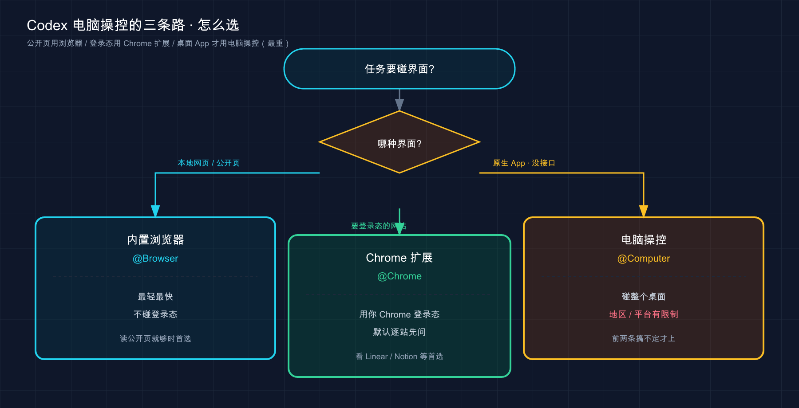

# 17 · 电脑操控与浏览器（Computer Use）：让 Codex 长出手

> 📚 **系列导航**：上一篇 [16 · 安全与风险边界](16-security.md) 把「Codex 能闯多大祸、边界在哪」这条线画清楚了。这一篇给它再开一扇门——**让 Codex 直接看你的屏幕、点你的桌面应用、开你的浏览器**：测一个原生 App、复现一个只在界面上才出现的 bug、在你登录好的网站里替你点几下。前面所有篇章里 Codex 干的活都在「文件 + 命令行」那一亩三分地，这篇是它头一回伸手碰图形界面。下一篇 [18 · config.toml 配置详解](18-config.md) 再回到配置文件，把那一摞旋钮一次拧明白。

> ⚠️ **实验性功能，可能随版本变化。** 本篇讲的 Computer Use（电脑操控）、Chrome 扩展、内置浏览器都还在快速迭代，下面凡涉及具体入口、菜单名、默认行为、快捷键，一律**以你界面里看到的和 [Codex 官方文档](https://developers.openai.com/codex/app/computer-use) 为准**，后续版本可能调整。

OpenAI 在官方文档里给 Computer Use 圈了一条很硬的地理红线：**上线时它在 macOS 和 Windows 可用，但欧洲经济区（EEA）、英国、瑞士这三处不行**。这不是网络问题，是功能本身按区域关掉了——你人在伦敦，哪怕魔法上网也不一定能开。

我第一次注意到这条，是去年翻 `app` 那棵文档目录时数页面：`computer-use`、`browser`、`chrome-extension` 三个页面**专门讲「Codex 怎么碰图形界面」**，比讲沙箱的篇幅还长。OpenAI 把这么多笔墨砸在这上面，说明它认定一件事——**光会读文件、跑命令的 AI，迟早会卡在「这事只能在界面上做」的墙前**。

举个我真撞过的墙：去年调一个 Electron 小工具，有个 bug 只在窗口拉到某个宽度时才崩，命令行里跑测试一切正常，日志干干净净。这种「只在界面上才现形」的 bug，以前我只能自己一遍遍拖窗口、截图、再回头跟它描述。**Computer Use 就是来拆这堵墙的**——让 Codex 自己看屏幕、自己动手复现。

这一篇就讲清三件事：Codex 碰图形界面的**三条路**（电脑操控、Chrome 扩展、内置浏览器）各管哪一块、怎么开起来、以及操作你「真桌面 / 真浏览器」时的安全边界在哪。

**看完这一篇，你会拿到：**

- 一句话讲明白 Computer Use 是什么、什么时候才轮到它出场（以及什么时候**别**用它）
- 三条「碰界面」的路彻底分清：**内置浏览器（localhost）→ Chrome 扩展（带登录态的网站）→ 电脑操控（整个桌面）**，配一张对照表
- 三条路各自的开启步骤（装哪个插件、给哪些系统权限、怎么 `@` 调它），以及地区 / 平台限制
- 网站访问的默认行为（**默认每个新站都先问你**）、allowlist / blocklist 怎么管、哪个开关一打开就不再问
- 操作「真桌面 / 真浏览器」相对沙箱的风险在哪、官方给了哪些护栏、你自己该守哪几条
- 一个能照着跑、给了预期结果的最小实战：用内置浏览器读一次本地页面

---

## 01 先搞懂：Computer Use 到底是什么、什么时候才用它

先给结论：**Computer Use = 让 Codex 像人一样「看屏幕、动鼠标键盘」操作图形界面**——它能看你 macOS 或 Windows 上的窗口、菜单、按钮，能点击、能打字、能翻菜单。命令行工具够不着、结构化集成（插件 / MCP）也没有的活，才轮到它。

官方把它的本命说得很直白：**当一件事「光看文件或命令输出验证不了」时，才用它**。比如——

- 测一个 Codex 正在帮你写的 macOS App、Windows App、iOS 模拟器流程，或别的桌面应用。
- 复现一个**只在图形界面里才冒出来**的 bug（就是我上面那个拖窗口才崩的例子）。
- 改一个**必须点 UI 才能改**的应用设置。
- 查一个**没有插件可接**的应用或数据源里的信息。
- 跑一条**横跨好几个 App** 的工作流。

**类比：请了个「能上手帮你点电脑」的实习生，而不是只会发邮件的远程同事。** 远程同事（命令行 / 插件）你只能给他发指令、收他回的文件，他碰不到你桌面；Computer Use 这个实习生是**坐到你工位上**的——他用你的鼠标、你的键盘，屏幕上有啥他看得见，你也全程看得见他在点哪。方便归方便，但他动的是你**真实的桌面**，不是一个隔间里的演练机——这点后面安全那节是重点。

这里有个新手最容易踩反的判断，**官方反复强调**：

> 对于你**在本地构建**的 Web 应用，**先用内置浏览器（in-app browser）**，而不是 Computer Use。

为什么？因为 Computer Use 是「最重、最慢」的手段——它要截屏、要算坐标、要一帧帧动鼠标。能用更轻的工具搞定的事，杀鸡别用牛刀。所以正确的排序是：**有插件 / MCP 就用插件，是网页就用浏览器工具，只有连原生桌面、模拟器、没接口的应用都得碰，才升级到 Computer Use**。下一节就把这三条路彻底摆开。

> 💡 **一句话总结**：Computer Use 让 Codex **看屏幕、动鼠标键盘**操作整个桌面，是「最重」的那条路——专留给原生 App、只在界面现形的 bug、没插件的数据源；**本地 Web 应用先用内置浏览器，别一上来就掏它**。

---

## 02 三条路分清楚：内置浏览器 / Chrome 扩展 / 电脑操控

接之前先把一件最容易混的事捋顺：**Codex 碰「界面」有三条路，新手十有八九会用错那条**。官方为这三条专门各写了一个文档页，可见它们是三个不同的东西，不是一个功能的三种叫法。

**类比：去另一个城市办事的三种交通方式。** 同城近距离（本地网页）走路就到，又快又不用打票——这是**内置浏览器**；要去你常去、有门禁卡的写字楼（你已登录的网站）得开你自己那台车，车里插着门禁卡——这是**Chrome 扩展**；连郊区没通路的地方都得去（原生桌面、没接口的应用），才包一辆能上山下乡的越野车——这是**电脑操控**。三种都能「移动」，但**用错了要么到不了、要么瞎费劲**。

挨个说清楚各自的主场：

**内置浏览器（in-app browser）** ——Codex 窗口里**自带的一个浏览器**，你和它共享同一个渲染页面的视图。它专管：**本地开发服务器（localhost）、文件预览、不用登录的公开页**。它**不碰**你 Chrome 的登录态、cookie、扩展、已开的标签页——所以它干净、隔离，预览和验证都关在 Codex 里头，不动你日常浏览器。开发时改完前端想看一眼效果，就用它。

**Chrome 扩展（Codex Chrome extension）** ——当任务**需要你已经登录好的浏览器状态**时才用它。官方点名的典型场景：让 Codex 读 / 操作 **LinkedIn、Salesforce、Gmail、公司内部工具**这类必须登录的站。它借的是你真实 Chrome 里那份登录态，能进你登录着的一切。

**电脑操控（Computer Use）** ——上一节讲的，**碰的是整个桌面**：原生 App、模拟器、跨应用流程。范围最大，也最慢。

三条路对照着看，你就知道该掏哪条：

| 维度 | 内置浏览器 | Chrome 扩展 | 电脑操控 |
|------|-----------|------------|---------|
| **碰什么** | Codex 自带浏览器里的网页 | 你真实 Chrome（带登录态） | 整个 macOS / Windows 桌面 |
| **典型活儿** | localhost、文件预览、公开页 | LinkedIn / Salesforce / Gmail / 内网系统 | 原生 App、模拟器、跨应用流程 |
| **用不用你的登录态** | ❌ 不用，干净隔离 | ✅ 用你 Chrome 的登录态 | 看你操作的具体应用 |
| **怎么调起来** | `@Browser` 或让它「用浏览器」 | `@Chrome` | `@Computer` 或 `@AppName` |
| **装什么** | Browser 插件 | Chrome 插件 + Chrome 扩展 | Computer Use 插件 |
| **轻重 / 速度** | 最轻最快 | 中等 | 最重最慢 |

一句话分工：**本地网页用内置浏览器，登录态网站用 Chrome 扩展，连桌面都得碰才上电脑操控**。下面三节分别讲怎么开。

> 💡 **一句话总结**：碰界面有三条路——**内置浏览器（localhost / 公开页，不碰登录态）、Chrome 扩展（你已登录的网站）、电脑操控（整个桌面）**；从轻到重，用错那条要么够不着要么瞎费劲，先对着表选对路再动手。

---

## 03 开起来之一：内置浏览器（最该先用的那条）

按「从轻到重」的顺序，先讲最该先上手的内置浏览器。它的定位就一句话：**你和 Codex 共享一个看渲染页面的视图，专门拿来预览和验证本地 Web 应用**。

### 装插件 + 打开它

第一步，装 **Browser 插件**：在 Codex 里进 **Plugins**，把 Browser 插件加上、打开（具体入口以界面为准）。

第二步，打开内置浏览器。官方给了几种方式：

- 从工具栏点开；
- 点页面里的某个 URL 自动打开；
- 在浏览器里手动输地址导航；
- 用快捷键——**macOS 是 `Cmd+Shift+B` ，Windows 是 `Ctrl+Shift+B`** 。

### 让 Codex 自己操作内置浏览器

光预览还不够，你可以让 Codex **直接操作**这个内置浏览器：点击、打字、看渲染后的状态、截图、下载页面资源、跑只读的页面检查 JavaScript、或者验证一个修复有没有生效。

调它的方式：在任务里让它「用浏览器」，或者直接 `@Browser` 引用。一条官方示例长这样：

```text
用浏览器打开 http://localhost:3000/settings，复现那个布局 bug，
只修溢出的那几个控件，别动其它。
```

### 它有个「批注」绝活

内置浏览器最香的一点，是**批注（comment / annotation）**——当一个 bug **只在渲染出来的页面上才看得见**时，你可以直接在页面元素上圈一下、留句话，给 Codex 一个**精准到具体元素**的目标，比打一堆字描述清楚多了。

官方给的操作要点（以界面为准）：

- 打开**批注模式（Annotation mode）**，选中一个元素或区域，提交评论；
- 批注模式里**按住 `Shift` 点击**可以框选一块区域；
- **按住 `Cmd` 点击**可以立刻把评论发出去。

留完批注，在对话里发条消息让它来处理就行。好的批注是**具体的**，比如：

```text
这个按钮在手机上会溢出。能放一行就保持一行，
放不下就换行，但别改卡片的高度。
```

还有个更精细的入口——**批注上有个 config 图标**，点开后可以直接在界面上调**字体、文字大小、间距、颜色**，并实时预览效果，满意了再提交给 Codex。比纯文字描述「字体改大一点、颜色偏暖一点」精准多了，所见即所得。

我自己用下来，批注这招对「差一点点」的视觉调整特别灵——上个月调一个定价页，tooltip 老是盖住光标下的数据点，我懒得描述坐标，直接在那个 tooltip 上圈一下写「把它挪到图表范围内、别遮数据点」，Codex 一次就改对了。**关键是把你在意的那个「视觉状态」说清楚**：加载中、空状态、报错、还是成功态。

一个隔离边界你得记住，官方写得很明确：

> 内置浏览器**不支持**认证流程、登录后的页面、你日常浏览器的配置、cookie、扩展、或已经打开的标签页。它只用来打开**不用登录就能访问**的页面。

也就是说——**要登录的站，它干不了，那是下一节 Chrome 扩展的活**。

> 💡 **一句话总结**：内置浏览器是「Codex 自带的、干净隔离的浏览器」，装 Browser 插件后用 `@Browser` 调，专治 localhost / 公开页的预览和验证；**批注（圈元素 + 留话）是它最值钱的绝活**；但它不碰登录态，要登录的站交给 Chrome 扩展。

---

## 04 开起来之二：Chrome 扩展（要登录态时才用）

当任务**离不开你已经登录好的浏览器状态**——读你的 LinkedIn、改 Salesforce 里的客户、在 Gmail 里干活、操作公司内网系统——这时候才轮到 **Chrome 扩展**。

### 从 Plugins 装

官方给的安装流程是从插件走，照着点就行：

1. 打开 Codex，进 **Plugins** 。
2. 添加 **Chrome** 插件。
3. **跟着安装向导走**——它会引导你装 **Codex 的 Chrome 扩展**（在 Chrome 应用商店里），并批准 Chrome 弹出的权限提示。
4. 打开 Chrome，确认 Codex 扩展显示 **Connected（已连接）**。

> 装扩展、访问 Chrome 应用商店在国内一般需要「魔法上网」；具体的扩展页面跟着 Codex 的安装向导走，别自己去搜一个名字相近的装错了。

装好后**开一个新的 Codex 线程**，Codex 在任务需要登录态网站时会主动建议用 Chrome；你也可以直接在提示词里点名它：

```text
@Chrome 打开 Salesforce，根据这些通话记录更新对应的客户。
```

如果 Chrome 还没开，Codex 能替你开。一个贴心细节：**Chrome 浏览器任务跑在 Chrome 的标签页分组（tab group）里**，一个线程的活会被归到同一组，不至于把你标签栏搅得乱七八糟。

### 网站访问：默认每个新站都先问你

这是 Chrome 扩展（也包括内置浏览器）最该搞懂的默认行为——**别想当然以为它装好就能随便乱跑**：

> **默认情况下，Codex 在操作每一个新网站之前都会先问你。** 它按网站的 host（比如 `example.com` ）来弹这个确认。

被问到时，你有三个选项，按风险自己挑：

- **只在当前对话里允许**这个网站；
- **始终允许**这个 host，以后用它就不再问；
- **拒绝**这个网站。

更细的控制在 **Computer Use 设置**里——你可以维护一份 **allowlist（白名单）和 blocklist（黑名单）**：

- 白名单里的域名，Codex 用它**不再问**；
- 黑名单里的域名，Codex **不许用**；
- 把某个域名**从白名单移除**，下次用它会**重新问你**；从黑名单移除，则是从「直接禁掉」变回「会再问一次」。

这里有两个开关 / 设定，新手最容易栽，单独拎出来强调：

| 设定 | 默认 / 行为 | 踩坑提醒 |
|------|------------|---------|
| **每个新站先问** | 默认**开着**（会问） | 这是第一道闸，别嫌烦就急着关 |
| **始终允许浏览器内容（always allow browser content）** | 你**手动打开后**，Codex **不再**为用网站弹确认 | 一旦打开就等于**拆了那道闸**，想清楚再开 |
| **浏览器历史记录（browser history）** | Codex 想用时**会问**，且**没有「始终允许」选项** | 历史里可能有内网 URL、搜索词等敏感信息，按需放行、用完即止 |

最后那条浏览器历史值得多说一句：官方明确它的历史访问**每次都按请求临时授权、不给永久放行**——因为历史记录里常藏着敏感的内网地址、搜索词、登录设备上的活动痕迹，**一旦被页面里的恶意内容诱导，这些数据可能被抄到不该去的地方**。所以它故意不给「一劳永逸」的口子。

### 连不上怎么办

接 Chrome 扩展最常见的就是「连不上」。官方给了一串排查顺序，照着走（先确认你要访问的站**没被黑名单挡着**，再往下）：

1. 从 Chrome 工具栏或扩展菜单打开 Codex 扩展，看是不是 **Connected** 。要是显示断开、或提示缺 native host，就到 Codex 的 **Plugins** 里**移除再重新添加** Chrome 插件，重走安装向导。
2. 进 Codex 的 **Plugins** ，确认 Chrome 插件是**开着**的。
3. 确认你用的是**装了扩展的那个 Chrome 配置文件（profile）**——多 profile 的人最容易栽这条，扩展装在 A、你却在 B 里干活。
4. **开个新线程**再试，能清掉线程级的连接状态。
5. 重启 Chrome 和 Codex 再试；还不行就**卸载扩展、移除并重加 Chrome 插件、重走向导**。
6. 显示 **Connected** 但还是用不了，跑 `/feedback` 联系支持，**带上线程 ID** 。

> 还有个独立的小坑：如果 Chrome 任务需要**从你电脑上传文件**，得在扩展详情页里打开 **「Allow access to file URLs（允许访问文件 URL）」** ，否则它够不到本地文件。改完重启那个任务。

> 💡 **一句话总结**：要登录态的网站才用 Chrome 扩展，从 **Plugins** 加 Chrome 插件、跟向导装扩展、确认 **Connected** ，用 `@Chrome` 调；**默认每个新站先问你**，allowlist / blocklist 在 Computer Use 设置里管，「始终允许浏览器内容」一开就等于拆闸——想清楚再开。

---

## 05 开起来之三：电脑操控（碰整个桌面）

最重的这条留到最后。电脑操控让 Codex **看屏幕、动鼠标键盘**操作整个 macOS / Windows 桌面，开它有两道门槛——**地区 + 系统权限**——比前两条都硬。

### 先对地区和平台

把最扫兴的放最前面：

- **平台**：macOS 和 Windows 可用，**Linux 不在此列**（Codex 桌面 App 本身目前就没有 Linux 版，第 07 篇讲过）。
- **地区**：**上线时不支持欧洲经济区（EEA）、英国、瑞士**。这三处人在当地可能直接开不了，别以为是 bug。

### 装插件 + 给系统权限

第一步，装 **Computer Use 插件**：进 Codex 设置，打开 **Computer Use** ，点 **Install** 装上——**在让它操作桌面应用之前先装好**。

第二步，给系统权限，两个平台不一样：

**macOS** 要授**两项**权限（首次使用会弹，按提示给）：

| 权限 | 用途 |
|------|------|
| **屏幕录制（Screen Recording）** | 让 Codex **看见**目标应用的界面 |
| **辅助功能（Accessibility）** | 让 Codex **点击、打字、导航** |

要是 Codex 死活看不见或控制不了某个应用，去 **系统设置 > 隐私与安全性** ，把 Codex 应用的「屏幕录制」和「辅助功能」勾上。

**Windows** 没有这两项系统授权那套，但有个**前台规矩**：电脑操控跑在**当前活动桌面**上，任务期间**目标应用必须可见**，而且——

> 在 Windows 上，电脑操控**无法在后台运行**。任务跑着的时候，Codex 会**移动你的鼠标指针、打字、接管前台**。

说白了：Windows 上它一干活就**抢你的鼠标键盘**，你这会儿别想同时用这台电脑。想让任务在你离开时继续跑，官方给两条路：**保持设备解锁联网 + 用手机远程查看进度**，或者**在 Windows 虚拟机里跑 Codex** ，让它接管虚拟机而不是你主桌面。

### 怎么调起来

在提示词里 `@Computer` ，或者直接 `@AppName` 点名某个应用，把**具体哪个 App、哪个窗口、哪条流程**说清楚。官方两条示例：

```text
用电脑操控打开这个 App，复现新手引导里的那个 bug，
修掉导致它的最小代码路径。每改一次，就把同一条 UI 流程重跑一遍。
```

```text
打开 @Chrome，验证最新改动之后结账页面是否还正常。
```

注意第二条——`@Chrome` 既能走上一节的 Chrome 扩展（结构化、带登录态），也能在电脑操控语境里让它「视觉地」操作浏览器。**官方的建议是：目标应用有专用插件 / MCP 就优先用那个，只有需要「肉眼看着操作」时才上电脑操控**。

### 权限和审批：和系统权限是两码事

这里有个容易混的点，官方专门拆开讲：**电脑操控的「系统权限」和 Codex 里的「应用审批」是两套东西**。

- **系统权限**（macOS 的屏幕录制 / 辅助功能）：让 Codex **有能力**看和操作应用。
- **应用审批**：决定你**允许** Codex 用哪些应用。任务里它**用某个应用前会先问你**；你可以选 **始终允许（Always allow）** ，以后用这个 App 就不再问——这份「始终允许」清单能在 Codex 设置的 **Computer Use** 板块里移除。
- 而**文件读取、文件编辑、shell 命令**，**照旧走线程的沙箱和审批设置**（第 15、16 篇那套），不因为开了电脑操控就放松。

碰到敏感或破坏性的操作，Codex **可能还会额外再问一次**。

### 锁定使用（macOS 专属，谨慎开）

还有个进阶能力叫**锁定使用（Locked use）**，**只在 macOS** 有，而且**默认关着、得你手动开**。它解决的是：你从别的设备发了个 Codex 任务，任务要用桌面应用，但**你的 Mac 已经锁屏了**。

启用后，Codex 会装一个 **Apple 授权插件（authorization plug-in）**，参与 macOS 的解锁流程，在受信任的电脑操控回合里**临时解锁** Mac、保留锁屏保护。官方列出 4 道安全护栏：

- 授权窗口**短时效**，仅限当次解锁尝试有效。
- 自动解锁**只对活跃回合**的 Codex 开放。
- 解锁期间 **Codex 会盖住所有显示器画面**。
- **一旦检测到本地有人动键盘 / 鼠标，立刻重新锁屏**并暂停自动解锁。

官方把话说得很死：**这是个刻意做窄的能力，不是给你 Mac 的「通用远程解锁」后门**，别的 App 和本地进程都借不到它解锁。**新手别急着开这个**，等你真有「锁屏后还要让它干活」的刚需再说。

> 💡 **一句话总结**：电脑操控碰整个桌面，门槛最高——**地区上 EEA / 英国 / 瑞士不支持、Linux 没有**；macOS 装插件后给「屏幕录制 + 辅助功能」，Windows 会**抢你前台**；系统权限和应用审批是两码事，文件 / shell 照旧走沙箱；锁定使用是 macOS 专属、默认关、刻意做窄，新手先别碰。

---

## 06 安全：它动的是「真桌面 / 真浏览器」，不是沙箱

这一节最不能跳——**因为电脑操控和 Chrome 扩展碰的都是你真实的、登录着一切的桌面和浏览器，不是一个用完即焚的沙箱**。这跟前面 Codex 在沙箱里跑命令（第 15 篇）是完全不同的信任边界，第 16 篇那根「便利和风险成正比」的主线，到这儿绷到了最紧。

### 风险到底在哪

官方说得直接：用电脑操控时，Codex 能**看屏幕内容、截图、操作目标应用里的窗口 / 菜单 / 键盘输入 / 剪贴板**。把这些「它看得见的东西」都当成它任务期间会处理的上下文。两类风险你得有数：

- **登录态等于钥匙串**：它访问网站不用再认证，**你登录了什么，它就够得着什么**。官方的提醒一针见血——

> 网页可能包含**恶意或误导性内容**，而网站会把已批准的点击、表单提交、登录态下的操作，**当成是你本人发起的**。

- **提示注入（prompt injection）**：第 16 篇讲过——**网页内容里可能藏着「写给 AI 看」的恶意指令**。操作浏览器 / 桌面时这风险格外真，因为它读的全是**外部的、你控制不了的**页面和界面内容。

### 官方给了哪些护栏

好在这不是「敞开了让它乱来」，内置了几道闸：

- **每个新网站先问你**（第 04 节那道），是浏览器侧的第一道闸。
- **每个新应用先审批**（第 05 节），是桌面侧的第一道闸；敏感 / 破坏性操作还可能再问一次。
- **操作随时可中断**——你可以**随时停掉任务、或直接夺回电脑的控制权**。
- **有几件事它压根做不了**，这是硬护栏：

> 电脑操控**无法自动化终端应用、也无法自动化 Codex 自己**（那会绕过 Codex 的安全策略）；它也**无法以管理员身份认证、无法替你批准电脑上的安全和隐私权限提示**。

最后这条特别让人安心——**它没法自己点掉那个「是否授予权限」的系统弹窗**，安全相关的口子始终攥在你手里。

### 你自己该守的几条

官方护栏之外，操作真桌面 / 真浏览器还有几条土规矩，我整理成一张「该怎么办」表：

| 场景 | ❌ 别这么干 | ✅ 该这么办 |
|------|-----------|-----------|
| 一次给多少任务 | 一口气甩好几个 App / 流程让它乱跑 | **一次只给一个**明确的目标应用或流程 |
| 敏感应用 | 把网银、密码管理器开着不管 | 任务不需要就**关掉**敏感应用 |
| Windows 上干活 | 它抢前台时你还想同时用这台机 | 用**第二台设备 / 虚拟机**，或先停任务再自己用 |
| 涉及密钥的任务 | 丢给它自己跑、人走开 | **你在场、能逐步批准**时才做 |
| 「始终允许」 | 见一个点一个，图省事 | **只对你确实信任**它自动用的 App / 站点开 |
| 账户 / 支付 / 隐私 / 网络设置 | 让它自己点完 | 这类操作**全程在场盯着** |
| 它点错了窗口 | 等它自己纠正 | **立刻取消任务** |

还有个数据层面的提醒：通过桌面应用做的改动，**在保存到磁盘、被项目追踪之前，可能不会出现在审查面板（review pane）里**——别以为审查面板空着就等于没改东西。另外，**你的 ChatGPT 数据控制设置**适用于经 Codex 处理的内容，**包括电脑操控截的那些屏**。

> 想边干活边继续用浏览器？官方给了个干净的办法——**让 Codex 去用另一个不同的浏览器**，把它跟你日常那个隔开，互不打扰。

总原则就一条：**它在桌面 / 浏览器里点的每一下都是「真的」**——不像沙箱里跑错了删个环境重来，浏览器里点了「确认付款」就是真付了。所以**越是不可逆、越是涉钱的操作，越要自己把着方向盘**。

> 💡 **一句话总结**：电脑操控和 Chrome 扩展碰的是**真桌面 / 真浏览器**（非沙箱），风险在「登录态即钥匙」和「页面里的提示注入」；官方护栏有「逐站 / 逐应用先问、随时可中断、终端 / Codex 自身 / 系统权限弹窗它碰不了」，你自己则要**一次一个目标、关掉无关敏感应用、把涉钱和不可逆操作攥在手里**。

---

## 07 动手：用内置浏览器读一次本地页面

光看不练假把式。下面带你跑一个**最小实战**：用**内置浏览器**（三条路里最轻、最安全的那条）打开一个本地页面、让 Codex 读点东西回来。**全程不碰你的登录态、不抢你前台**，专门拿来验证「这条路通了没」。

> 为什么选内置浏览器练手？因为它**不用任何系统权限、不碰你的 Chrome、不受地区限制**，是三条路里门槛最低、翻车面最小的。Chrome 扩展和电脑操控按前面的步骤开，原理一样、只是闸更多。

**第一步：起一个本地页面**

随便起个最简单的静态服务，给内置浏览器一个能打开的本地地址。任选其一：

```bash
python3 -m http.server 3000
```

**预期**：终端显示类似 `Serving HTTP on :: port 3000 (http://[::]:3000/) ...` ，说明本地服务起来了。先用你日常浏览器访问 `http://localhost:3000` 确认能打开（会列出当前目录的文件）。

**第二步：装并打开内置浏览器**

在 Codex 里进 **Plugins** ，确认 **Browser 插件**已加好、已打开（以界面为准）。然后打开内置浏览器——用快捷键最快：

- **macOS**：`Cmd+Shift+B`
- **Windows**：`Ctrl+Shift+B`

✅ 自验：Codex 窗口里弹出一个内置浏览器视图。

**第三步：让 Codex 用内置浏览器读页面**

给它一条「只读、不碰敏感账号」的指令：

```text
用浏览器打开 http://localhost:3000，
把页面上列出的文件名读给我，并截一张图。
```

**预期**：你会**看见内置浏览器导航到 `http://localhost:3000`** ，Codex 把页面上的内容（这里就是目录里的文件名列表）读回对话，并附一张截图。**看到它真打开、内容真回来了 = 这条路通了。** 第一次操作某个站时，按第 04 节说的，它**可能先弹一个确认问你要不要用这个网站**——允许即可。

**第四步（可选）：试试批注**

想体验第 03 节那个绝活，打开**批注模式**，在页面某个元素上圈一下、留句话（比如「这行字太小，调大两号」），再发条消息让 Codex 处理。**预期**：它能精准定位到你圈的那个元素去改，而不用你描述半天它在哪。

跑通前三步，你就把「装 Browser 插件 → 打开内置浏览器 → 让它读本地页面」这条最轻的链路走了一遍。**以后无论是换内置浏览器干别的活、还是升级到 Chrome 扩展 / 电脑操控，本质都是这套「装插件 → 给权限 / 确认 → `@` 调它 → 看它动起来」，无非闸越来越多、动的东西越来越真。**

> 💡 **一句话总结**：动手就三步——**起本地服务、打开内置浏览器（`Cmd/Ctrl+Shift+B`）、给一条只读指令看它真把页面读回来**；这是三条路里最轻最安全的入口，跑通它，另外两条照葫芦画瓢、只是多几道闸。

---

## 08 小结

这一篇给 Codex 接上了**图形界面**——从「只会摸文件和命令行」，到能开浏览器、点桌面应用、复现只在界面才现形的 bug。但更关键的是，你搞清了**碰界面有三条路、别用错**。

把核心串起来回顾：

| 你要做的事 | 关键点 |
|-----------|--------|
| 理解 Computer Use | 让 Codex**看屏幕、动鼠标键盘**操作桌面，是**最重**的路，本地 Web 先用内置浏览器 |
| 分清三条路 | **内置浏览器（localhost）→ Chrome 扩展（登录态网站）→ 电脑操控（整个桌面）**，从轻到重 |
| 开内置浏览器 | 装 Browser 插件、`@Browser` 调、`Cmd/Ctrl+Shift+B` 打开，**批注是绝活** |
| 开 Chrome 扩展 | Plugins 加 Chrome 插件 + 装扩展、`@Chrome` 调，**默认每个新站先问你** |
| 开电脑操控 | 装 Computer Use 插件，macOS 给「屏幕录制 + 辅助功能」、Windows 抢前台；**EEA / 英国 / 瑞士、Linux 不支持** |
| 守住安全 | 碰的是**真桌面 / 真浏览器**：一次一个目标、圈小网站 / 应用范围、涉钱和不可逆操作自己来 |

**你现在应该能：** 讲清这三条路各管哪一块、什么活该掏哪条；独立把内置浏览器开起来读本地页面；知道 Chrome 扩展和电脑操控怎么装、有哪些地区 / 平台限制；并且清楚操作真桌面 / 真浏览器的风险在哪、该守哪几道闸。**这一接，Codex 从「本地代码助手」迈出了一大步——能直接替你看屏幕、动界面了。**

这三条路的关系，用一张图收个尾：



这张图把「任务要碰界面 → 是哪种界面 → 走哪条路 → 各自的脾气」一条线串清楚了，下回拿不准用哪个，照它走一遍就有答案。

> 💡 **一句话总结**：三条路**从轻到重**——内置浏览器管本地和公开页、Chrome 扩展管你登录着的网站、电脑操控管整个桌面；权限越大风险越真，核心安全原则只有一条：**操作真桌面 / 真浏览器时，每一下都是「真的」，涉钱和不可逆的自己把着方向盘**。

---

下一篇 **18「config.toml 配置详解」**——这一篇里你装了三个插件、调了一堆权限和 allowlist，是不是觉得设置散落在各处、记不住？其实 Codex 把绝大多数行为旋钮都收在一个文件里——`config.toml` 。下一篇就把这摞旋钮一次拧明白：模型、沙箱、审批、MCP……哪个键控什么、默认是什么、改完要不要重启。留个小思考：这一篇让 Codex「能动手」靠的是装插件 + 给权限，那要是想把「默认用哪个模型、默认多大胆」这些**一开机就生效**的偏好定下来，你猜该写到哪儿？
